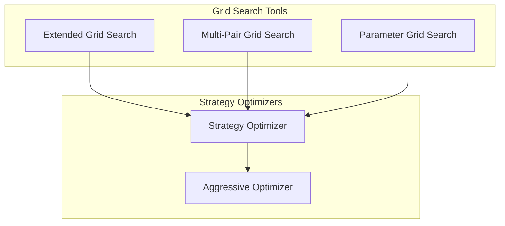
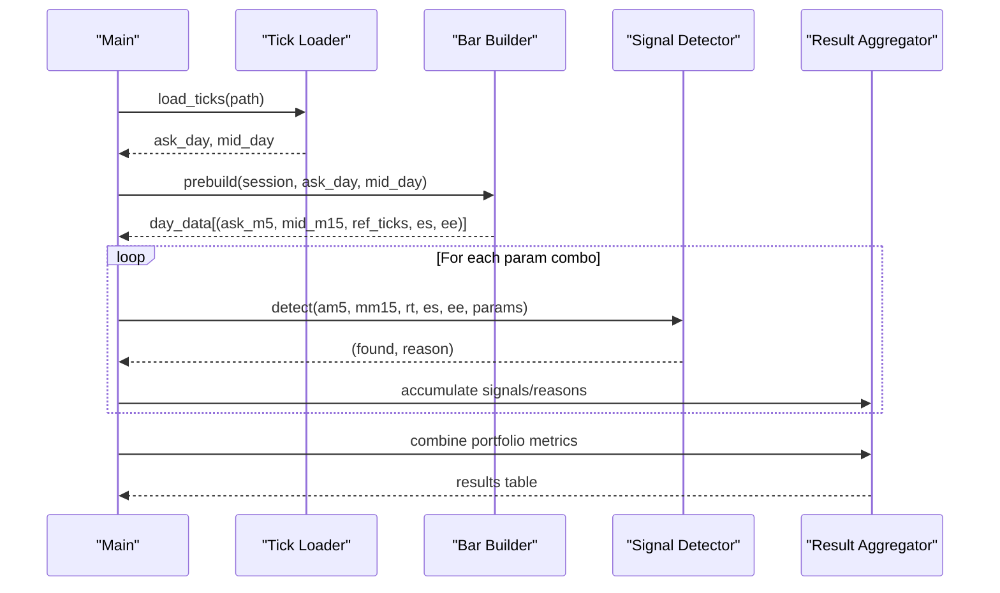
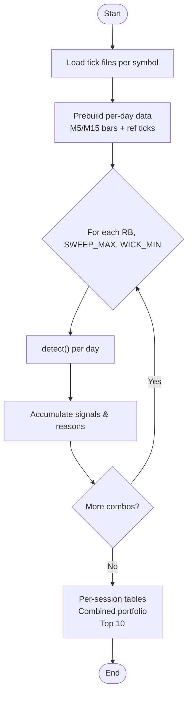
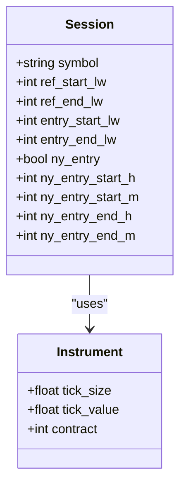
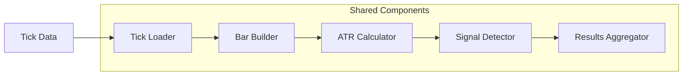

# Grid Search Tools

<cite>
**Referenced Files in This Document**
- [extended_grid_search.py](file://tools/extended_grid_search.py)
- [multi_pair_grid_search.py](file://tools/multi_pair_grid_search.py)
- [parameter_grid_search.py](file://tools/parameter_grid_search.py)
- [strategy_optimizer.py](file://tools/strategy_optimizer.py)
- [aggressive_optimizer.py](file://tools/aggressive_optimizer.py)
</cite>

## Table of Contents
1. [Introduction](#introduction)
2. [Project Structure](#project-structure)
3. [Core Components](#core-components)
4. [Architecture Overview](#architecture-overview)
5. [Detailed Component Analysis](#detailed-component-analysis)
6. [Dependency Analysis](#dependency-analysis)
7. [Performance Considerations](#performance-considerations)
8. [Troubleshooting Guide](#troubleshooting-guide)
9. [Conclusion](#conclusion)
10. [Appendices](#appendices)

## Introduction
This document explains the specialized grid search tools suite used to explore parameter spaces for a sweep-and-reclaim trading strategy across multiple instruments and sessions. It covers:
- Extended grid search with an additional reclaim window dimension
- Multi-pair grid search for cross-instrument analysis (EURUSD, GBPUSD, USDJPY)
- Parameter grid search for targeted optimization on a single instrument
- Configuration options for grid dimensions, search boundaries, and optimization criteria
- Practical examples for setting up custom searches, analyzing multi-pair correlations, and optimizing parameters under different market conditions
- Integration patterns with the main strategy optimizer and result aggregation methods

The suite is designed for offline research using tick data, building M5/M15 bars, computing ATR, detecting signals, and reporting signal rates and rejection reasons to guide parameter selection.

## Project Structure
The grid search tools are implemented as standalone Python scripts under tools/. Each script focuses on a specific scope:
- extended_grid_search.py: 3D grid over SWEEP_MAX x WICK_MIN x RECLAIM_BARS across three sessions
- multi_pair_grid_search.py: 2D grid over SWEEP_MAX x WICK_MIN across three sessions
- parameter_grid_search.py: 2D grid over SWEEP_MAX x WICK_MIN on EURUSD only
- strategy_optimizer.py: broader ORB-based strategy optimizer with stop modes and session combinations
- aggressive_optimizer.py: challenge-focused multi-strategy optimizer with portfolio simulation

**Diagram sources**
- [extended_grid_search.py:290-432](file://tools/extended_grid_search.py#L290-L432)
- [multi_pair_grid_search.py:384-466](file://tools/multi_pair_grid_search.py#L384-L466)
- [parameter_grid_search.py:197-245](file://tools/parameter_grid_search.py#L197-L245)
- [strategy_optimizer.py:491-530](file://tools/strategy_optimizer.py#L491-L530)
- [aggressive_optimizer.py:491-509](file://tools/aggressive_optimizer.py#L491-L509)

**Section sources**
- [extended_grid_search.py:1-65](file://tools/extended_grid_search.py#L1-L65)
- [multi_pair_grid_search.py:1-85](file://tools/multi_pair_grid_search.py#L1-L85)
- [parameter_grid_search.py:1-25](file://tools/parameter_grid_search.py#L1-L25)
- [strategy_optimizer.py:1-70](file://tools/strategy_optimizer.py#L1-L70)
- [aggressive_optimizer.py:1-85](file://tools/aggressive_optimizer.py#L1-L85)

## Core Components
- Signal detection pipeline:
  - Load tick files per symbol into ask_day and mid_day dictionaries keyed by date
  - Build M5 bars from ask ticks and M15 bars from mid ticks
  - Compute ATR(14) prior to entry window
  - Detect first sweep beyond reference range; enforce minimum ATR distance
  - Reclaim within configurable window; require wick strength threshold
  - Displacement confirmation and stop placement within ATR bands
- Session handling:
  - London wall time conversion to server UTC+3 with DST awareness
  - New York wall time conversion with DST-aware offsets
- Grid iteration:
  - Nested loops over parameter candidates
  - Per-day evaluation accumulating signals and rejection reasons
  - Combined portfolio view aggregating signals across sessions

Key configuration constants:
- SWEEP_ATR_MIN: minimum sweep depth in ATR units
- DISP_BODY_MIN: minimum body ratio for displacement confirmation
- STOP_BUFF_ATR: buffer around sweep extreme for stop placement
- STOP_ATR_MIN / STOP_ATR_MAX: acceptable stop distance band in ATR units
- SERVER_UTC_OFFSET: server timezone offset (UTC+3)

**Section sources**
- [extended_grid_search.py:24-33](file://tools/extended_grid_search.py#L24-L33)
- [multi_pair_grid_search.py:25-34](file://tools/multi_pair_grid_search.py#L25-L34)
- [parameter_grid_search.py:17-24](file://tools/parameter_grid_search.py#L17-L24)
- [extended_grid_search.py:149-221](file://tools/extended_grid_search.py#L149-L221)
- [multi_pair_grid_search.py:183-266](file://tools/multi_pair_grid_search.py#L183-L266)
- [parameter_grid_search.py:85-194](file://tools/parameter_grid_search.py#L85-L194)

## Architecture Overview
The architecture follows a consistent pattern across tools:
- Data ingestion: parse tab-delimited tick CSVs into per-day ask and mid tick lists
- Preprocessing: build M5/M15 bars and compute ATR(14) before entry window
- Signal detection: parameterized function returns (found, reason) per day
- Grid loop: iterate parameter combinations, accumulate signals and reasons
- Reporting: per-session tables, combined portfolio metrics, top combinations

**Diagram sources**
- [extended_grid_search.py:227-283](file://tools/extended_grid_search.py#L227-L283)
- [extended_grid_search.py:290-339](file://tools/extended_grid_search.py#L290-L339)
- [multi_pair_grid_search.py:272-340](file://tools/multi_pair_grid_search.py#L272-L340)
- [multi_pair_grid_search.py:384-400](file://tools/multi_pair_grid_search.py#L384-L400)

## Detailed Component Analysis

### Extended Grid Search (3D Grid)
Purpose:
- Explore SWEEP_MAX x WICK_MIN x RECLAIM_BARS across EURUSD London, GBPUSD London, USDJPY New York
- Add reclaim_bars as third dimension to assess how deep reclaims can be while maintaining signal quality

Key implementation details:
- SESSIONS define symbol, reference window, entry window, and NY-specific flags
- TICK_FILES map symbols to tick CSV paths
- prebuild constructs per-day structures once outside the grid loop to avoid recomputation
- detect implements the full signal logic with detailed rejection reasons

Configuration highlights:
- RECLAIM_BARS_CANDIDATES = [3, 4, 5]
- SWEEP_MAX_CANDIDATES = [0.50, 0.75, 1.00, 1.25]
- WICK_MIN_CANDIDATES = [0.60, 0.50, 0.45, 0.40]

Reporting:
- Per-session tables with baseline marker
- Combined portfolio view summing signals across sessions
- Top 10 combinations ranked by total signals
- Annualization and challenge ETA estimates based on EURUSD day count

**Diagram sources**
- [extended_grid_search.py:290-339](file://tools/extended_grid_search.py#L290-L339)
- [extended_grid_search.py:341-428](file://tools/extended_grid_search.py#L341-L428)

**Section sources**
- [extended_grid_search.py:38-64](file://tools/extended_grid_search.py#L38-L64)
- [extended_grid_search.py:149-221](file://tools/extended_grid_search.py#L149-L221)
- [extended_grid_search.py:259-283](file://tools/extended_grid_search.py#L259-L283)
- [extended_grid_search.py:290-432](file://tools/extended_grid_search.py#L290-L432)

### Multi-Pair Grid Search (2D Grid)
Purpose:
- Test SWEEP_MAX x WICK_MIN across three sessions with explicit instrument specs
- Provide combined portfolio view noting at most one trade per calendar day

Key differences from extended:
- Fixed reclaim window (3 bars) instead of varying reclaim_bars
- Explicit INSTRUMENTS mapping with tick_size, tick_value, contract size
- More detailed DST helpers and session boundary computation

Configuration highlights:
- SWEEP_MAX_CANDIDATES = [0.50, 0.60, 0.75, 1.00, 1.25]
- WICK_MIN_CANDIDATES = [0.60, 0.50, 0.45, 0.40]
- SESSIONS include NY-specific entry times and DST handling

Reporting:
- Per-session tables with baseline marker
- Combined portfolio view summing signals across sessions
- Challenge context with Phase 1 targets and estimated days to accumulate signals

**Diagram sources**
- [multi_pair_grid_search.py:39-84](file://tools/multi_pair_grid_search.py#L39-L84)

**Section sources**
- [multi_pair_grid_search.py:39-84](file://tools/multi_pair_grid_search.py#L39-L84)
- [multi_pair_grid_search.py:183-266](file://tools/multi_pair_grid_search.py#L183-L266)
- [multi_pair_grid_search.py:308-370](file://tools/multi_pair_grid_search.py#L308-L370)
- [multi_pair_grid_search.py:384-466](file://tools/multi_pair_grid_search.py#L384-L466)

### Parameter Grid Search (Single Instrument)
Purpose:
- Quick throwaway script to test coarse combinations on EURUSD only
- Focuses on signal rate changes with minimal overhead

Implementation notes:
- Single tick file path for EURUSD
- Simplified session boundaries (London-only)
- Direct counting without per-session structure

Configuration:
- sweep_candidates = [0.50, 0.60, 0.75, 1.00]
- wick_candidates = [0.60, 0.50, 0.45, 0.40]

Reporting:
- Simple table with days, signals, rate%, too_deep, weak_wick
- Baseline marker for current parameters

**Section sources**
- [parameter_grid_search.py:17-24](file://tools/parameter_grid_search.py#L17-L24)
- [parameter_grid_search.py:85-194](file://tools/parameter_grid_search.py#L85-L194)
- [parameter_grid_search.py:197-245](file://tools/parameter_grid_search.py#L197-L245)

### Strategy Optimizer Integration
Purpose:
- Broader optimization framework testing ORB strategies with multiple stop modes and session combinations
- Provides leaderboard and findings generation

Integration points:
- Uses similar tick loading and bar building patterns
- Supports session combinations including multi-pair setups
- Computes monthly cash estimates, Sharpe-like scores, and Kelly fractions

Configuration grids:
- TARGET_R_GRID = [1.5, 2.0, 2.5, 3.0]
- ORB_BARS_GRID = [4, 6, 8]
- STOP_MODE_GRID = ["range", "half_range", "atr_fixed"]
- ATR_STOP_GRID = [0.25, 0.35, 0.50]
- MIN_ORB_PIPS_GRID = [3, 5]

Session definitions:
- SESSION_DEFS maps session names to bounds calculation functions
- Handles both London and NY sessions with DST-aware conversions

**Section sources**
- [strategy_optimizer.py:62-70](file://tools/strategy_optimizer.py#L62-L70)
- [strategy_optimizer.py:214-224](file://tools/strategy_optimizer.py#L214-L224)
- [strategy_optimizer.py:491-530](file://tools/strategy_optimizer.py#L491-L530)
- [strategy_optimizer.py:536-571](file://tools/strategy_optimizer.py#L536-L571)

### Aggressive Optimizer
Purpose:
- Challenge-focused optimizer targeting The5ers $2,500 New High Stakes
- Tests multiple strategies (orb_atr, orb_half, vola) with portfolio simulation

Key features:
- Fixed lot sizing to prevent compounding blow-up
- Daily loss limits and overall drawdown floors
- Phase 1 completion tracking with qualifying days
- Leaderboard ranking by fastest Phase 1 completion, then monthly P&L

Configuration:
- STRATEGY_GRID = ["orb_atr", "orb_half", "vola"]
- TARGET_R_GRID = [1.5, 2.0, 2.5, 3.0]
- ORB_BARS_GRID = [4, 6, 8]
- ATR_STOP_GRID = [0.25, 0.35, 0.50]

**Section sources**
- [aggressive_optimizer.py:34-85](file://tools/aggressive_optimizer.py#L34-L85)
- [aggressive_optimizer.py:491-509](file://tools/aggressive_optimizer.py#L491-L509)
- [aggressive_optimizer.py:515-552](file://tools/aggressive_optimizer.py#L515-L552)

## Dependency Analysis
The tools share common dependencies and patterns:
- Tick data format: tab-delimited CSV with timestamp, bid, ask columns
- Timezone handling: London and New York DST-aware conversions to server UTC+3
- Bar construction: M5 from ask ticks, M15 from mid ticks
- ATR calculation: 14-period average of ranges before entry window
- Signal detection: consistent logic across tools with parameter variations

**Diagram sources**
- [extended_grid_search.py:227-283](file://tools/extended_grid_search.py#L227-L283)
- [multi_pair_grid_search.py:272-340](file://tools/multi_pair_grid_search.py#L272-L340)
- [parameter_grid_search.py:197-245](file://tools/parameter_grid_search.py#L197-L245)

**Section sources**
- [extended_grid_search.py:227-283](file://tools/extended_grid_search.py#L227-L283)
- [multi_pair_grid_search.py:272-340](file://tools/multi_pair_grid_search.py#L272-L340)
- [parameter_grid_search.py:197-245](file://tools/parameter_grid_search.py#L197-L245)

## Performance Considerations
Memory management techniques:
- Pre-build per-day data structures once outside grid loops to avoid recomputation
- Use dictionaries keyed by date for efficient lookups
- Store raw tick data in memory but process incrementally per day
- Avoid creating unnecessary intermediate objects in tight loops

Processing optimizations:
- Filter invalid rows during tick loading (missing bid/ask, parsing errors)
- Early termination in signal detection when conditions fail
- Limit search windows to relevant time periods (reference and entry sessions)
- Use list comprehensions and generator expressions where possible

Parallel processing capabilities:
- Current implementations are sequential due to shared state and complex dependencies
- No multiprocessing or threading is used in the grid search tools
- Potential parallelization opportunities exist for independent session processing

[No sources needed since this section provides general guidance]

## Troubleshooting Guide
Common issues and solutions:
- Missing tick files: tools skip missing files gracefully with skip messages
- Invalid tick data: parsing errors are caught and skipped during loading
- Zero ATR: signal detection returns early with appropriate reason codes
- Empty sessions: tools check for valid data before processing

Error handling patterns:
- try/except blocks around datetime parsing
- Validation checks for minimum data requirements (e.g., 14 bars for ATR)
- Reason codes for detailed failure analysis (too_deep, weak_wick, no_sweep, etc.)

Debugging tips:
- Check per-session breakdowns to identify problematic instruments
- Review rejection reasons to understand signal filtering behavior
- Compare baseline parameters against optimized combinations
- Validate timezone conversions for edge cases around DST transitions

**Section sources**
- [extended_grid_search.py:295-302](file://tools/extended_grid_search.py#L295-L302)
- [multi_pair_grid_search.py:391-396](file://tools/multi_pair_grid_search.py#L391-L396)
- [parameter_grid_search.py:202-222](file://tools/parameter_grid_search.py#L202-L222)

## Conclusion
The grid search tools suite provides comprehensive parameter exploration capabilities for sweep-and-reclaim trading strategies. The extended grid search adds a third dimension for reclaim window analysis, while multi-pair and parameter grid searches offer focused optimization approaches. All tools implement robust error handling, timezone-aware session management, and detailed reporting to support informed parameter selection.

The integration with strategy optimizers enables broader strategy testing and portfolio simulation. Memory management through pre-building and incremental processing ensures efficient operation on large datasets. While parallel processing is not currently implemented, the modular design allows for future enhancements.

[No sources needed since this section summarizes without analyzing specific files]

## Appendices

### Configuration Options Reference

#### Grid Dimensions
- **Extended Grid**: SWEEP_MAX x WICK_MIN x RECLAIM_BARS
- **Multi-Pair Grid**: SWEEP_MAX x WICK_MIN  
- **Parameter Grid**: SWEEP_MAX x WICK_MIN

#### Search Boundaries
- **SWEEP_ATR_MIN**: Minimum sweep depth in ATR units (typically 0.05)
- **DISP_BODY_MIN**: Minimum body ratio for displacement confirmation (typically 0.60)
- **STOP_BUFF_ATR**: Buffer around sweep extreme for stop placement (typically 0.10)
- **STOP_ATR_MIN/MAX**: Acceptable stop distance band in ATR units (typically 0.60-1.50)

#### Optimization Criteria
- **Signal Rate**: Percentage of days producing signals
- **Rejection Reasons**: Detailed breakdown of why signals were rejected
- **Portfolio Aggregation**: Combined signals across multiple sessions/instruments
- **Challenge Context**: Estimates for meeting phase targets

### Practical Examples

#### Setting Up Custom Grid Searches
1. Define parameter candidates in the appropriate grid arrays
2. Configure session definitions for target instruments
3. Specify tick file paths for historical data
4. Run the tool and analyze output tables for optimal parameters

#### Analyzing Multi-Pair Correlations
1. Use multi_pair_grid_search.py for cross-instrument analysis
2. Review combined portfolio view for aggregate performance
3. Compare individual session performance vs. combined results
4. Identify parameter sets that work well across multiple instruments

#### Optimizing Parameters Across Market Conditions
1. Test different parameter ranges for varying volatility regimes
2. Analyze rejection reasons to understand market condition sensitivity
3. Compare performance across different time periods
4. Validate selected parameters on out-of-sample data

[No sources needed since this section provides general guidance]