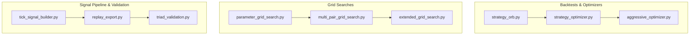
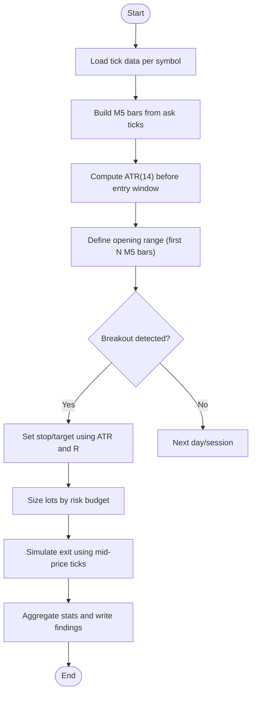
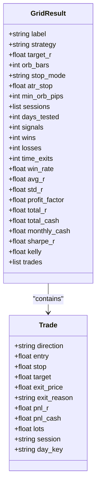
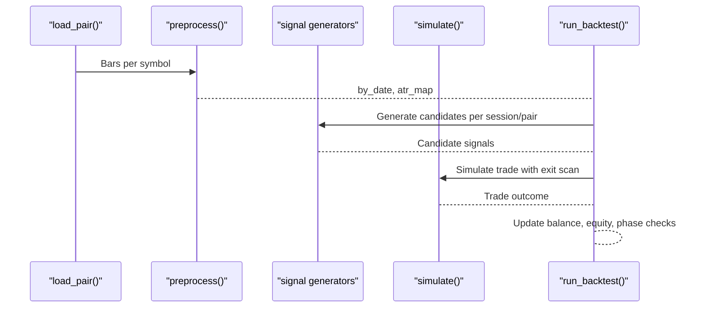
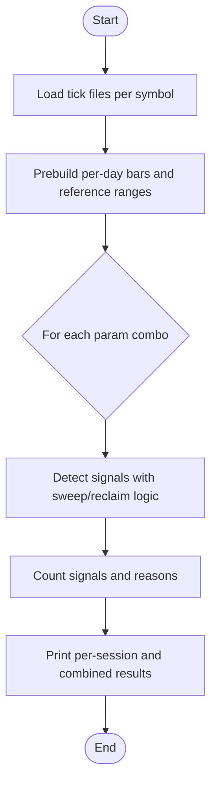
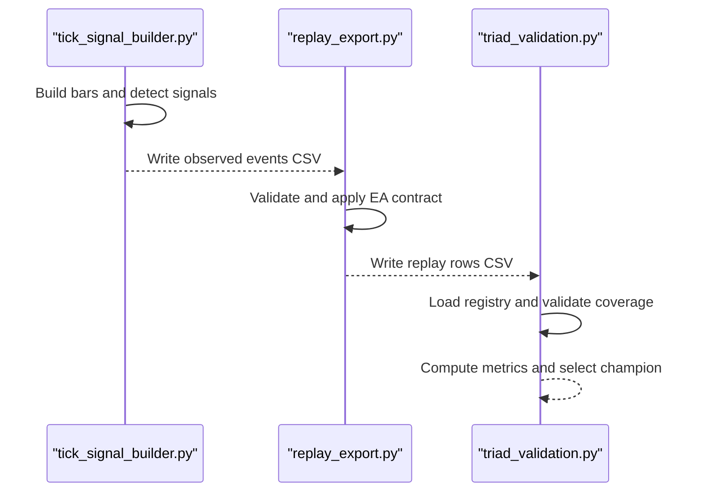
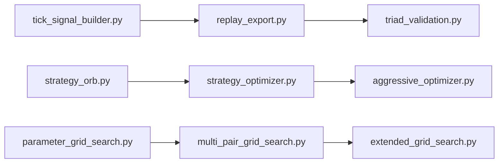

# Research Tools

<cite>
**Referenced Files in This Document**
- [strategy_optimizer.py](file://tools/strategy_optimizer.py)
- [aggressive_optimizer.py](file://tools/aggressive_optimizer.py)
- [extended_grid_search.py](file://tools/extended_grid_search.py)
- [multi_pair_grid_search.py](file://tools/multi_pair_grid_search.py)
- [parameter_grid_search.py](file://tools/parameter_grid_search.py)
- [strategy_orb.py](file://tools/strategy_orb.py)
- [tick_signal_builder.py](file://tools/tick_signal_builder.py)
- [replay_export.py](file://tools/replay_export.py)
- [triad_validation.py](file://tools/triad_validation.py)
</cite>

## Table of Contents
1. Introduction
2. Project Structure
3. Core Components
4. Architecture Overview
5. Detailed Component Analysis
6. Dependency Analysis
7. Performance Considerations
8. Troubleshooting Guide
9. Conclusion
10. Appendices

## Introduction
This document provides comprehensive documentation for the Python-based research and optimization tools suite used to develop, validate, and optimize trading strategies for a multi-pair, session-aware approach. It focuses on:
- Strategy optimizer functionality for parameter grid search across multiple strategies and sessions
- Aggressive optimization approaches targeting challenge rules (Phase 1/Phase 2) with risk controls
- Multi-pair analysis tools for signal detection and parameter tuning
- Backtesting procedures, performance metrics, and result interpretation
- API references, configuration options, input/output formats, and integration patterns with the broader research ecosystem

The suite supports both Opening Range Breakout (ORB) strategies and sweep/reclaim strategies, with DST-aware session handling, tick-to-bar conversion, ATR-based sizing, and challenge simulation.

## Project Structure
The tools are organized by purpose:
- Strategy backtests and optimizers: strategy_orb.py, strategy_optimizer.py, aggressive_optimizer.py
- Parameter grid searches: parameter_grid_search.py, multi_pair_grid_search.py, extended_grid_search.py
- Signal pipeline and validation: tick_signal_builder.py, replay_export.py, triad_validation.py



**Diagram sources**
- [strategy_orb.py:1-668](file://tools/strategy_orb.py#L1-L668)
- [strategy_optimizer.py:1-803](file://tools/strategy_optimizer.py#L1-L803)
- [aggressive_optimizer.py:1-795](file://tools/aggressive_optimizer.py#L1-L795)
- [parameter_grid_search.py:1-245](file://tools/parameter_grid_search.py#L1-L245)
- [multi_pair_grid_search.py:1-466](file://tools/multi_pair_grid_search.py#L1-L466)
- [extended_grid_search.py:1-432](file://tools/extended_grid_search.py#L1-L432)
- [tick_signal_builder.py:1-838](file://tools/tick_signal_builder.py#L1-L838)
- [replay_export.py:1-1259](file://tools/replay_export.py#L1-L1259)
- [triad_validation.py:1-1934](file://tools/triad_validation.py#L1-L1934)

**Section sources**
- [strategy_orb.py:1-668](file://tools/strategy_orb.py#L1-L668)
- [strategy_optimizer.py:1-803](file://tools/strategy_optimizer.py#L1-L803)
- [aggressive_optimizer.py:1-795](file://tools/aggressive_optimizer.py#L1-L795)
- [parameter_grid_search.py:1-245](file://tools/parameter_grid_search.py#L1-L245)
- [multi_pair_grid_search.py:1-466](file://tools/multi_pair_grid_search.py#L1-L466)
- [extended_grid_search.py:1-432](file://tools/extended_grid_search.py#L1-L432)
- [tick_signal_builder.py:1-838](file://tools/tick_signal_builder.py#L1-L838)
- [replay_export.py:1-1259](file://tools/replay_export.py#L1-L1259)
- [triad_validation.py:1-1934](file://tools/triad_validation.py#L1-L1934)

## Core Components
- Strategy OrB Backtester: Implements ORB entry logic, ATR-based stop/target, lot sizing, and per-session backtesting with findings report generation.
- Strategy Optimizer: Grid search over ORB variants (range, half_range, atr_fixed), target R, opening range bars, minimum range filters, and session combinations; includes challenge simulation and leaderboard.
- Aggressive Multi-Pair Optimizer: Tests ORB and volatility expansion strategies across many pairs and sessions, enforces challenge constraints (daily loss limit, total floor), fixed lot sizing, and Phase 1/Phase 2 tracking.
- Parameter Grid Search Tools: Sweep/reclaim parameter tuning (sweep depth, reclaim wick, reclaim window), multi-pair and extended grids, reporting signal rates and rejection reasons.
- Tick Signal Builder: Converts raw ticks into observed events using frozen V2.1 Sleeve A logic, computes exit paths, and writes event CSVs for downstream processing.
- Replay Exporter: Transforms observed events into registry-conformant replay rows, applying EA contract arithmetic (entry, stop, costs, lots, exits).
- TRIAD Validator: Loads registry, validates replay coverage, applies fill policies, computes metrics, selects champions, and simulates challenge phases with robust gates.

**Section sources**
- [strategy_orb.py:1-668](file://tools/strategy_orb.py#L1-L668)
- [strategy_optimizer.py:1-803](file://tools/strategy_optimizer.py#L1-L803)
- [aggressive_optimizer.py:1-795](file://tools/aggressive_optimizer.py#L1-L795)
- [parameter_grid_search.py:1-245](file://tools/parameter_grid_search.py#L1-L245)
- [multi_pair_grid_search.py:1-466](file://tools/multi_pair_grid_search.py#L1-L466)
- [extended_grid_search.py:1-432](file://tools/extended_grid_search.py#L1-L432)
- [tick_signal_builder.py:1-838](file://tools/tick_signal_builder.py#L1-L838)
- [replay_export.py:1-1259](file://tools/replay_export.py#L1-L1259)
- [triad_validation.py:1-1934](file://tools/triad_validation.py#L1-L1934)

## Architecture Overview
The research pipeline integrates data ingestion, signal detection, parameter optimization, and validation:

```mermaid
sequenceDiagram
participant Data as "Tick Data"
participant TSB as "tick_signal_builder.py"
participant RE as "replay_export.py"
participant TV as "triad_validation.py"
participant OPT as "strategy_optimizer.py / aggressive_optimizer.py"
participant GRID as "grid search tools"
Data->>TSB : Raw tick CSV
TSB-->>RE : Observed events CSV
RE-->>TV : Registry-conformant replay rows
TV-->>OPT : Metrics and selection results
GRID-->>OPT : Parameter grids and signal rates
OPT-->>Data : Backtest runs and leaderboards
```

**Diagram sources**
- [tick_signal_builder.py:1-838](file://tools/tick_signal_builder.py#L1-L838)
- [replay_export.py:1-1259](file://tools/replay_export.py#L1-L1259)
- [triad_validation.py:1-1934](file://tools/triad_validation.py#L1-L1934)
- [strategy_optimizer.py:1-803](file://tools/strategy_optimizer.py#L1-L803)
- [aggressive_optimizer.py:1-795](file://tools/aggressive_optimizer.py#L1-L795)
- [multi_pair_grid_search.py:1-466](file://tools/multi_pair_grid_search.py#L1-L466)
- [extended_grid_search.py:1-432](file://tools/extended_grid_search.py#L1-L432)

## Detailed Component Analysis

### Strategy OrB Backtester
- Purpose: Standalone ORB backtester that builds M5 bars from ask ticks, defines an opening range, detects breakouts, sets ATR-based stops/targets, sizes lots, and simulates exits.
- Key functions:
  - Bar building and ATR computation
  - Session boundary calculation with DST awareness
  - Lot sizing based on risk fraction and instrument specs
  - Per-session backtesting and combined statistics
  - Findings report generation
- Inputs: Tick files per symbol; outputs: printed results and markdown findings.
- Outputs: Per-session stats, combined stats, challenge context estimates.



**Diagram sources**
- [strategy_orb.py:136-155](file://tools/strategy_orb.py#L136-L155)
- [strategy_orb.py:243-367](file://tools/strategy_orb.py#L243-L367)
- [strategy_orb.py:374-411](file://tools/strategy_orb.py#L374-L411)

**Section sources**
- [strategy_orb.py:1-668](file://tools/strategy_orb.py#L1-L668)

### Strategy Optimizer
- Purpose: Grid search over ORB variants and parameters across sessions; computes signals, win rate, avg R, profit factor, monthly cash estimate, Sharpe-R, Kelly fraction; includes challenge simulation.
- Parameter grid: Target R multiples, ORB bars, stop modes (range, half_range, atr_fixed), ATR stop fractions, minimum ORB width pips, session combinations.
- Key functions:
  - Prebuild days with session bounds
  - Run combo per day with rolling M15 history
  - Leaderboard printing and findings writer
  - Challenge simulator for Phase 1 outcomes
- Inputs: Tick files per symbol; outputs: leaderboard and findings markdown.



**Diagram sources**
- [strategy_optimizer.py:75-124](file://tools/strategy_optimizer.py#L75-L124)
- [strategy_optimizer.py:411-485](file://tools/strategy_optimizer.py#L411-L485)

**Section sources**
- [strategy_optimizer.py:1-803](file://tools/strategy_optimizer.py#L1-L803)

### Aggressive Multi-Pair Optimizer
- Purpose: Fast-path to pass The5ers $2,500 challenge using multiple strategies and pairs; enforces daily loss limits, total drawdown floor, fixed lot sizing, and tracks qualifying days and Phase 1 completion.
- Strategies: ORB with ATR-fixed stop, ORB with midpoint stop, volatility expansion entry.
- Pairs: London and NY sessions across EURUSD, GBPUSD, EURGBP, GBPJPY, EURJPY, AUDUSD, USDCHF, NZDUSD, USDJPY, USDCAD, XAUUSD.
- Key functions:
  - Preprocess bars by date and compute ATR map
  - Signal generators per strategy
  - Simulation with bar-level exit scanning
  - Backtest loop enforcing max trades/day and safety buffers
  - Leaderboard and deep-dive printouts; findings writer



**Diagram sources**
- [aggressive_optimizer.py:149-168](file://tools/aggressive_optimizer.py#L149-L168)
- [aggressive_optimizer.py:174-207](file://tools/aggressive_optimizer.py#L174-L207)
- [aggressive_optimizer.py:226-288](file://tools/aggressive_optimizer.py#L226-L288)
- [aggressive_optimizer.py:294-328](file://tools/aggressive_optimizer.py#L294-L328)
- [aggressive_optimizer.py:334-485](file://tools/aggressive_optimizer.py#L334-L485)

**Section sources**
- [aggressive_optimizer.py:1-795](file://tools/aggressive_optimizer.py#L1-L795)

### Multi-Pair and Extended Grid Searches
- Multi-pair grid search: Tests sweep_max and wick_min across EURUSD London, GBPUSD London, USDJPY New York; reports signal counts, rates, and rejection reasons; combined portfolio view.
- Extended grid search: Adds reclaim_bars dimension; same sessions; prints per-session tables and top combos; annualized signal estimates and challenge ETA.
- Parameter grid search: Coarse sweep_max x wick_min on EURUSD; prints current baseline marker.



**Diagram sources**
- [multi_pair_grid_search.py:308-370](file://tools/multi_pair_grid_search.py#L308-L370)
- [extended_grid_search.py:259-283](file://tools/extended_grid_search.py#L259-L283)
- [parameter_grid_search.py:85-194](file://tools/parameter_grid_search.py#L85-L194)

**Section sources**
- [multi_pair_grid_search.py:1-466](file://tools/multi_pair_grid_search.py#L1-L466)
- [extended_grid_search.py:1-432](file://tools/extended_grid_search.py#L1-L432)
- [parameter_grid_search.py:1-245](file://tools/parameter_grid_search.py#L1-L245)

### Tick Signal Builder and Replay Exporter
- Tick Signal Builder: Reads raw tick CSV, builds ask-side M5 bars and mid-price M5/M15 bars, computes ATR, defines Asian reference range, applies frozen V2.1 Sleeve A signal detector, reconstructs exit paths, and writes observed events CSV.
- Replay Exporter: Validates observed events, applies EA contract arithmetic (entry, stop, costs, lots, exits), expands to full calendar coverage, and produces registry-conformant replay rows consumed by the validator.



**Diagram sources**
- [tick_signal_builder.py:285-462](file://tools/tick_signal_builder.py#L285-L462)
- [tick_signal_builder.py:469-587](file://tools/tick_signal_builder.py#L469-L587)
- [replay_export.py:319-434](file://tools/replay_export.py#L319-L434)
- [replay_export.py:458-762](file://tools/replay_export.py#L458-L762)
- [triad_validation.py:278-331](file://tools/triad_validation.py#L278-L331)
- [triad_validation.py:646-708](file://tools/triad_validation.py#L646-L708)

**Section sources**
- [tick_signal_builder.py:1-838](file://tools/tick_signal_builder.py#L1-L838)
- [replay_export.py:1-1259](file://tools/replay_export.py#L1-L1259)
- [triad_validation.py:1-1934](file://tools/triad_validation.py#L1-L1934)

## Dependency Analysis
- Data dependency: All tools consume tick or OHLCV data from validation/HistoryData; DST-aware session boundaries ensure correct alignment with broker server time.
- Module coupling:
  - strategy_optimizer.py depends on session definitions, instrument specs, and tick loaders similar to strategy_orb.py but adds grid search and challenge simulation.
  - aggressive_optimizer.py shares concepts (ATR, session windows, lot sizing) but extends to multi-pair and challenge constraints.
  - Grid search tools share signal detection logic (sweep/reclaim) and DST helpers; extended_grid_search.py adds reclaim_bars dimension.
  - tick_signal_builder.py feeds replay_export.py which feeds triad_validation.py; this forms a strict pipeline for registry-conformant validation.



**Diagram sources**
- [tick_signal_builder.py:1-838](file://tools/tick_signal_builder.py#L1-L838)
- [replay_export.py:1-1259](file://tools/replay_export.py#L1-L1259)
- [triad_validation.py:1-1934](file://tools/triad_validation.py#L1-L1934)
- [strategy_orb.py:1-668](file://tools/strategy_orb.py#L1-L668)
- [strategy_optimizer.py:1-803](file://tools/strategy_optimizer.py#L1-L803)
- [aggressive_optimizer.py:1-795](file://tools/aggressive_optimizer.py#L1-L795)
- [parameter_grid_search.py:1-245](file://tools/parameter_grid_search.py#L1-L245)
- [multi_pair_grid_search.py:1-466](file://tools/multi_pair_grid_search.py#L1-L466)
- [extended_grid_search.py:1-432](file://tools/extended_grid_search.py#L1-L432)

**Section sources**
- [strategy_optimizer.py:1-803](file://tools/strategy_optimizer.py#L1-L803)
- [aggressive_optimizer.py:1-795](file://tools/aggressive_optimizer.py#L1-L795)
- [multi_pair_grid_search.py:1-466](file://tools/multi_pair_grid_search.py#L1-L466)
- [extended_grid_search.py:1-432](file://tools/extended_grid_search.py#L1-L432)
- [parameter_grid_search.py:1-245](file://tools/parameter_grid_search.py#L1-L245)
- [tick_signal_builder.py:1-838](file://tools/tick_signal_builder.py#L1-L838)
- [replay_export.py:1-1259](file://tools/replay_export.py#L1-L1259)
- [triad_validation.py:1-1934](file://tools/triad_validation.py#L1-L1934)

## Performance Considerations
- Data loading: Tick files can be large; prebuilding per-day bars reduces repeated computation in grid loops.
- ATR computation: Rolling M15 history is maintained to avoid recomputation; ensure sufficient bars exist before computing ATR.
- Session boundaries: DST-aware conversions prevent misalignment; verify server offset and session windows.
- Grid size: Larger grids increase runtime; use coarse grids first, then refine promising regions.
- Memory usage: Storing all days’ ticks may be memory-intensive; consider chunking or filtering by date ranges if needed.
- Exit simulation: Bar-level scans are efficient; minimize forward tick lookups by slicing within session windows.

[No sources needed since this section provides general guidance]

## Troubleshooting Guide
Common issues and resolutions:
- Missing tick files: Ensure paths under validation/HistoryData exist; scripts skip symbols if files are absent.
- Zero ATR: Insufficient pre-session bars or flat markets; adjust ATR warm-up or filter out low-volatility days.
- No signals: Check sweep/reclaim thresholds; too strict wick or displacement requirements can reject most days.
- Rejection reasons: Use grid search outputs to diagnose “too_deep”, “weak_wick”, “no_sweep”, “displace_fail”.
- Challenge simulation breaches: Daily loss limit or total floor breached; reduce risk per trade or tighten stop bands.
- Registry mismatch: For triad_validation.py, ensure registry version matches expected schema; re-run preregister if modified.

**Section sources**
- [strategy_optimizer.py:491-530](file://tools/strategy_optimizer.py#L491-L530)
- [aggressive_optimizer.py:491-509](file://tools/aggressive_optimizer.py#L491-L509)
- [multi_pair_grid_search.py:344-370](file://tools/multi_pair_grid_search.py#L344-L370)
- [extended_grid_search.py:315-339](file://tools/extended_grid_search.py#L315-L339)
- [triad_validation.py:317-331](file://tools/triad_validation.py#L317-L331)

## Conclusion
The research tools suite provides a robust framework for developing and validating multi-pair, session-aware trading strategies. It combines ORB and sweep/reclaim methodologies with rigorous parameter grids, DST-aware session handling, realistic lot sizing, and challenge simulations. The pipeline from tick data to registry-conformant validation ensures reproducibility and auditability. Use the grid search tools to identify robust parameter regions, the optimizers to evaluate performance under challenge constraints, and the validation suite to confirm statistical significance and compliance with frozen contracts.

[No sources needed since this section summarizes without analyzing specific files]

## Appendices

### API References and Configuration Options

- Strategy OrB Backtester
  - Inputs: Tick files per symbol; session definitions; ATR period; ORB bars; stop buffer; target R; risk fraction; commission per lot.
  - Outputs: Per-session stats, combined stats, findings markdown.
  - Key constants: SERVER_UTC_OFFSET, ACCOUNT_BALANCE, RISK_FRACTION, TARGET_R, COMMISSION_PER_LOT, ORB_BARS, STOP_BUFFER_ATR, STOP_ATR_MIN/MAX, MIN_STOP_PIPS.

- Strategy Optimizer
  - Inputs: Tick files; session combinations; parameter grids (target R, ORB bars, stop mode, ATR stop, min ORB pips).
  - Outputs: Leaderboard, findings markdown, challenge simulation results.
  - Key constants: TARGET_R_GRID, ORB_BARS_GRID, STOP_MODE_GRID, ATR_STOP_GRID, MIN_ORB_PIPS_GRID, SESSION_DEFS, TICK_FILES.

- Aggressive Multi-Pair Optimizer
  - Inputs: M5 OHLCV files per pair; strategy type; parameter grids; session windows; risk controls.
  - Outputs: Leaderboard, deep-dive printout, findings markdown.
  - Key constants: STRATEGY_GRID, TARGET_R_GRID, ORB_BARS_GRID, ATR_STOP_GRID, LONDON_PAIRS, NY_PAIRS, PHASE1_TARGET, DAILY_LOSS_LIMIT, TOTAL_FLOOR_PCT.

- Grid Search Tools
  - Inputs: Tick files; parameter grids (sweep_max, wick_min, reclaim_bars); session definitions.
  - Outputs: Per-session tables, combined portfolio views, signal rates, rejection breakdowns.
  - Key constants: SWEEP_MAX_CANDIDATES, WICK_MIN_CANDIDATES, RECLAIM_BARS_CANDIDATES, SESSIONS, INSTRUMENTS.

- Tick Signal Builder
  - Inputs: Raw tick CSV; combination name; output path; verbose flag.
  - Outputs: Observed events CSV with signal geometry and exit path metadata.
  - Key constants: SWEEP_ATR_MIN/MAX, RECLAIM_WICK_MIN, DISPLACEMENT_BODY_MIN, STOP_BUFFER_ATR, STOP_ATR_MIN/MAX, SERVER_UTC_OFFSET.

- Replay Exporter
  - Inputs: Observed events CSV; registry JSON; selection/holdout splits; initial balance.
  - Outputs: Registry-conformant replay rows CSV; schema validation; self-test support.
  - Key constants: EVENT_FIELDS, EXIT_REASONS, SWEEP_ATR_MIN/MAX, RECLAIM_WICK_MIN, DISPLACEMENT_BODY_MIN, STOP_BUFFER_ATR, STOP_ATR_MIN/MAX, MAX_COST_TO_R.

- TRIAD Validator
  - Inputs: Registry JSON; replay rows CSV; optional priorities text.
  - Outputs: Validation report JSON; metric reports; champion selection; simulation results.
  - Key constants: SCHEMA_VERSION, REGISTRY_VERSION, ALLOWED_COMBINATIONS, RANGE_BANDS, ATR_BANDS, TIME_STOPS, PROFILES, BREAKEVEN_POLICIES, FillPolicy, ValidationThresholds, SimulationSettings.

**Section sources**
- [strategy_orb.py:24-46](file://tools/strategy_orb.py#L24-L46)
- [strategy_optimizer.py:46-70](file://tools/strategy_optimizer.py#L46-L70)
- [aggressive_optimizer.py:34-85](file://tools/aggressive_optimizer.py#L34-L85)
- [multi_pair_grid_search.py:22-84](file://tools/multi_pair_grid_search.py#L22-L84)
- [extended_grid_search.py:21-64](file://tools/extended_grid_search.py#L21-L64)
- [parameter_grid_search.py:16-24](file://tools/parameter_grid_search.py#L16-L24)
- [tick_signal_builder.py:60-80](file://tools/tick_signal_builder.py#L60-L80)
- [replay_export.py:152-209](file://tools/replay_export.py#L152-L209)
- [triad_validation.py:49-159](file://tools/triad_validation.py#L49-L159)

### Practical Examples

- Parameter tuning for sweep/reclaim strategy
  - Run multi_pair_grid_search.py to vary sweep_max and wick_min across sessions; analyze signal rates and rejection reasons; select best combo for further testing.
  - Use extended_grid_search.py to add reclaim_bars dimension; compare total signals and annualized estimates.

- Strategy validation and optimization
  - Run strategy_orb.py to establish baseline ORB performance; then run strategy_optimizer.py to explore stop modes and target R grids; review leaderboard and findings.
  - Run aggressive_optimizer.py to test multi-pair strategies under challenge constraints; inspect Phase 1 completion and drawdown behavior.

- Performance benchmarking
  - Compare signal frequency and avg R across strategies; assess monthly cash estimates and Sharpe-R; simulate challenge phases to evaluate feasibility.

- Integration with validation pipeline
  - Use tick_signal_builder.py to generate observed events; run replay_export.py to produce replay rows; execute triad_validation.py to validate against registry and compute metrics.

[No sources needed since this section provides general guidance]

### Computational Requirements and Data Preparation

- Data preparation
  - Ensure tick files exist under validation/HistoryData with correct naming; verify DST-aware session windows match broker server time.
  - For multi-pair analyses, prepare M5 OHLCV files where required; ensure consistent date ranges across symbols.

- Computational requirements
  - Memory: Large tick datasets may require sufficient RAM; consider filtering by date ranges or using incremental processing.
  - CPU: Grid searches are CPU-bound; parallelization is not built-in; run sequentially or split tasks across machines.
  - Time: Longer datasets increase runtime; start with shorter windows to iterate quickly, then expand for validation.

- Result interpretation guidelines
  - Focus on avg R and signal frequency rather than win rate alone; monthly cash estimates depend on both.
  - Review rejection reasons to understand why signals were filtered; adjust thresholds conservatively.
  - Use challenge simulation outputs to assess feasibility under daily loss limits and total drawdown floors.

[No sources needed since this section provides general guidance]