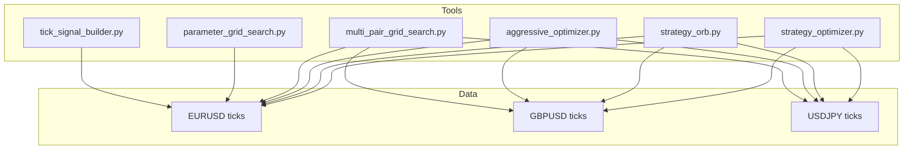
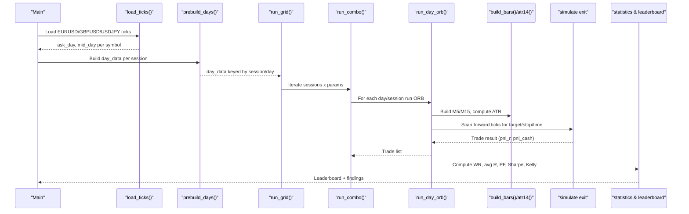
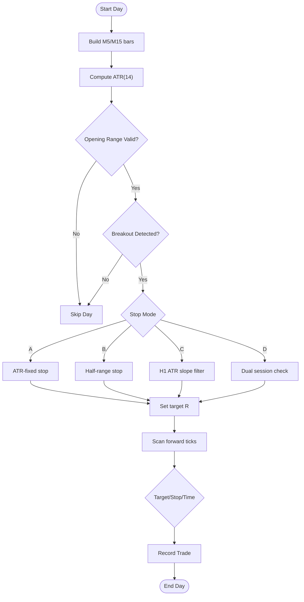
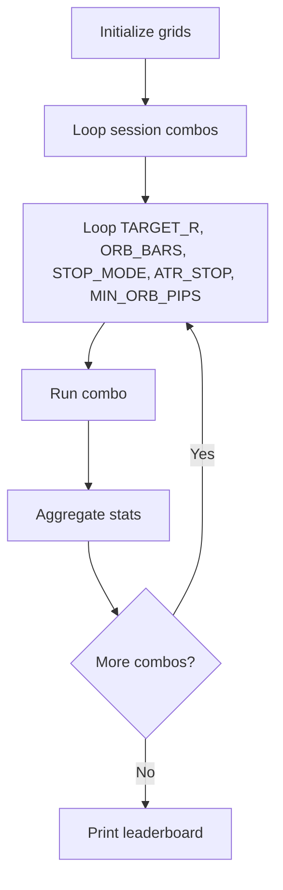
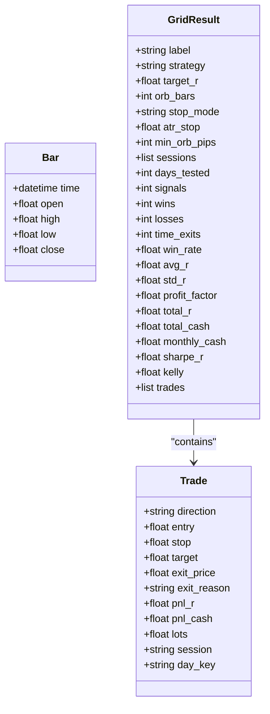
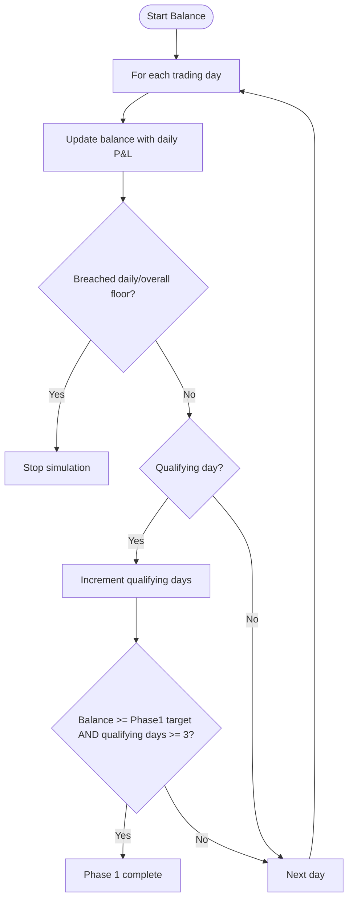
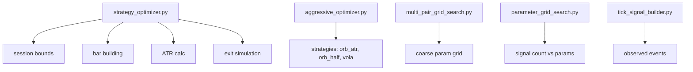
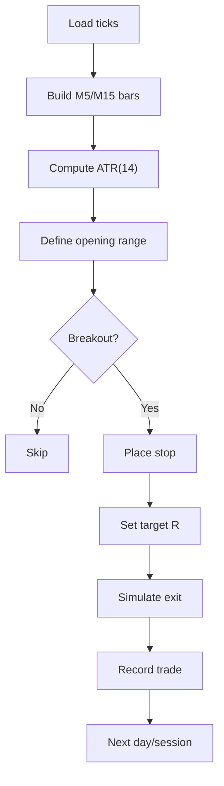

# Strategy Optimizer

<cite>
**Referenced Files in This Document**
- [strategy_optimizer.py](file://tools/strategy_optimizer.py)
- [strategy_orb.py](file://tools/strategy_orb.py)
- [aggressive_optimizer.py](file://tools/aggressive_optimizer.py)
- [multi_pair_grid_search.py](file://tools/multi_pair_grid_search.py)
- [parameter_grid_search.py](file://tools/parameter_grid_search.py)
- [tick_signal_builder.py](file://tools/tick_signal_builder.py)
</cite>

## Table of Contents
1. [Introduction](#introduction)
2. [Project Structure](#project-structure)
3. [Core Components](#core-components)
4. [Architecture Overview](#architecture-overview)
5. [Detailed Component Analysis](#detailed-component-analysis)
6. [Dependency Analysis](#dependency-analysis)
7. [Performance Considerations](#performance-considerations)
8. [Troubleshooting Guide](#troubleshooting-guide)
9. [Conclusion](#conclusion)
10. [Appendices](#appendices)

## Introduction
This document explains the core strategy optimizer tooling for Opening Range Breakout (ORB) strategies and related backtesting utilities. It covers:
- ORB strategy variants A–D, including stop placement logic and session handling
- Parameter grid search across target R multiples, opening range bars, stop modes, ATR stops, and minimum ORB width filters
- The backtesting engine that processes tick data, builds M5/M15 bars, calculates ATR, detects breakouts, and simulates trade exits
- Configuration options for sessions, instruments, risk management, and challenge simulation settings
- Practical usage examples, interpretation of results, and leaderboard outputs
- Statistical metrics: win rate, average R, profit factor, Sharpe ratio, and Kelly fraction calculations

## Project Structure
The optimizer ecosystem is implemented as a set of Python scripts under tools/:
- strategy_optimizer.py: Multi-session ORB optimizer with parameter grid and challenge simulation
- strategy_orb.py: Standalone ORB backtester for EURUSD/GBPUSD London and USDJPY New York
- aggressive_optimizer.py: Aggressive multi-pair optimizer with multiple strategies and challenge rules
- multi_pair_grid_search.py: Coarse grid search for sweep/reclaim parameters across three sessions
- parameter_grid_search.py: Quick spike to measure signal counts vs parameters on EURUSD
- tick_signal_builder.py: Tick-to-event builder producing observed events for replay/export

**Diagram sources**
- [strategy_optimizer.py:220-224](file://tools/strategy_optimizer.py#L220-L224)
- [strategy_orb.py:216-220](file://tools/strategy_orb.py#L216-L220)
- [aggressive_optimizer.py:85-86](file://tools/aggressive_optimizer.py#L85-L86)
- [multi_pair_grid_search.py:377-381](file://tools/multi_pair_grid_search.py#L377-L381)
- [parameter_grid_search.py:17-18](file://tools/parameter_grid_search.py#L17-L18)
- [tick_signal_builder.py:634-668](file://tools/tick_signal_builder.py#L634-L668)

**Section sources**
- [strategy_optimizer.py:1-803](file://tools/strategy_optimizer.py#L1-L803)
- [strategy_orb.py:1-668](file://tools/strategy_orb.py#L1-L668)
- [aggressive_optimizer.py:1-795](file://tools/aggressive_optimizer.py#L1-L795)
- [multi_pair_grid_search.py:1-466](file://tools/multi_pair_grid_search.py#L1-L466)
- [parameter_grid_search.py:1-245](file://tools/parameter_grid_search.py#L1-L245)
- [tick_signal_builder.py:1-838](file://tools/tick_signal_builder.py#L1-L838)

## Core Components
- ORB Strategy Variants
  - Strategy A: ATR-based stop decoupled from range width
  - Strategy B: Partial range stop at midpoint
  - Strategy C: Trend filter using H1 ATR slope alignment
  - Strategy D: Dual session combining London and NY with max one trade per calendar day
- Parameter Grid Search
  - Target R multiples: [1.5, 2.0, 2.5, 3.0]
  - Opening range bars: [4, 6, 8] (M5)
  - Stop modes: range, half_range, atr_fixed
  - ATR stops: [0.25, 0.35, 0.50] (for atr_fixed)
  - Minimum ORB width: [3, 5] pips
- Backtesting Engine
  - Loads tick data by symbol/day
  - Builds M5 and M15 bars
  - Computes ATR(14) from M15 mid-price bars before entry window
  - Detects first breakout after opening range
  - Simulates exits against forward ticks (target/stop/time)
- Challenge Simulation
  - Phase 1 targets and daily/overall drawdown limits
  - Sequential balance updates and qualifying days counting
- Leaderboard and Findings
  - Top combos filtered by signals and expectancy
  - Markdown findings with tables and deep-dive analysis

**Section sources**
- [strategy_optimizer.py:46-70](file://tools/strategy_optimizer.py#L46-L70)
- [strategy_optimizer.py:214-224](file://tools/strategy_optimizer.py#L214-L224)
- [strategy_optimizer.py:244-381](file://tools/strategy_optimizer.py#L244-L381)
- [strategy_optimizer.py:411-485](file://tools/strategy_optimizer.py#L411-L485)
- [strategy_optimizer.py:577-622](file://tools/strategy_optimizer.py#L577-L622)
- [strategy_optimizer.py:536-571](file://tools/strategy_optimizer.py#L536-L571)

## Architecture Overview
The optimizer orchestrates data loading, bar construction, signal detection, and statistical aggregation across sessions and parameter combinations.

**Diagram sources**
- [strategy_optimizer.py:187-208](file://tools/strategy_optimizer.py#L187-L208)
- [strategy_optimizer.py:387-405](file://tools/strategy_optimizer.py#L387-L405)
- [strategy_optimizer.py:491-530](file://tools/strategy_optimizer.py#L491-L530)
- [strategy_optimizer.py:411-485](file://tools/strategy_optimizer.py#L411-L485)
- [strategy_optimizer.py:244-381](file://tools/strategy_optimizer.py#L244-L381)

## Detailed Component Analysis

### ORB Strategy Variants A–D
- Strategy A (ATR-based stop): Stop distance is a fixed ATR fraction from entry, independent of opening range width. This avoids the “wide range = wide stop” problem.
- Strategy B (partial range stop): Stop placed near the midpoint of the opening range, tightening risk relative to full-range stops.
- Strategy C (trend filter): Only trades when H1 ATR slope aligns with breakout direction; implemented conceptually in documentation and referenced in recommendations.
- Strategy D (dual session): Combines London and NY sessions across pairs while enforcing max one trade per calendar day across all pairs.

**Diagram sources**
- [strategy_optimizer.py:244-381](file://tools/strategy_optimizer.py#L244-L381)
- [strategy_optimizer.py:411-485](file://tools/strategy_optimizer.py#L411-L485)

**Section sources**
- [strategy_optimizer.py:4-28](file://tools/strategy_optimizer.py#L4-L28)
- [strategy_optimizer.py:244-381](file://tools/strategy_optimizer.py#L244-L381)
- [strategy_optimizer.py:497-503](file://tools/strategy_optimizer.py#L497-L503)

### Parameter Grid Search
- Dimensions:
  - TARGET_R_GRID: [1.5, 2.0, 2.5, 3.0]
  - ORB_BARS_GRID: [4, 6, 8]
  - STOP_MODE_GRID: ["range", "half_range", "atr_fixed"]
  - ATR_STOP_GRID: [0.25, 0.35, 0.50]
  - MIN_ORB_PIPS_GRID: [3, 5]
- Session combinations tested include single and multi-session setups with constraints like max one trade per calendar day.

**Diagram sources**
- [strategy_optimizer.py:63-70](file://tools/strategy_optimizer.py#L63-L70)
- [strategy_optimizer.py:491-530](file://tools/strategy_optimizer.py#L491-L530)

**Section sources**
- [strategy_optimizer.py:63-70](file://tools/strategy_optimizer.py#L63-L70)
- [strategy_optimizer.py:491-530](file://tools/strategy_optimizer.py#L491-L530)

### Backtesting Engine Details
- Tick Loading: Reads tab-delimited tick files, groups by day, computes mid-price where both bid/ask present.
- Bar Building: Constructs M5 bars from ask ticks and M15 bars from mid ticks; deduplicates and sorts by time.
- ATR Calculation: Uses last 14 M15 ranges prior to entry start.
- Signal Detection: Identifies first breakout after opening range; applies minimum ORB width filter and stop validity checks.
- Exit Simulation: Scans forward mid-price ticks post-breakout to determine target hit, stop hit, or time exit.

**Diagram sources**
- [strategy_optimizer.py:75-124](file://tools/strategy_optimizer.py#L75-L124)

**Section sources**
- [strategy_optimizer.py:159-181](file://tools/strategy_optimizer.py#L159-L181)
- [strategy_optimizer.py:187-208](file://tools/strategy_optimizer.py#L187-L208)
- [strategy_optimizer.py:244-381](file://tools/strategy_optimizer.py#L244-L381)

### Challenge Simulation Settings
- Phase 1 target: +10% of starting balance
- Daily loss limit: 5% of current balance
- Overall floor: 10% drawdown from starting balance
- Qualifying days: minimum net P&L threshold per day
- Sequential simulation tracks balance, peak balance, breach conditions, and phase completion

**Diagram sources**
- [strategy_optimizer.py:577-622](file://tools/strategy_optimizer.py#L577-L622)

**Section sources**
- [strategy_optimizer.py:577-622](file://tools/strategy_optimizer.py#L577-L622)

### Configuration Options
- Sessions:
  - EURUSD_LONDON, GBPUSD_LONDON, USDJPY_NEWYORK with DST-aware boundaries
- Instruments:
  - Pip sizes, tick values, tick sizes per symbol
- Risk Management:
  - Account balance, risk fraction per trade, commission per lot, volume step/min
- Data Paths:
  - Tick file paths per symbol

**Section sources**
- [strategy_optimizer.py:46-70](file://tools/strategy_optimizer.py#L46-L70)
- [strategy_optimizer.py:214-224](file://tools/strategy_optimizer.py#L214-L224)

### Practical Usage Examples
- Running the optimizer:
  - Execute the main script to load data, run grid search, print leaderboard, and write findings markdown
- Interpreting results:
  - Focus on combos with sufficient signals and positive average R
  - Review monthly cash estimates, profit factor, Sharpe-R, and Kelly fraction
- Leaderboard output:
  - Sorted by estimated monthly P&L among viable combos
  - Includes sessions, parameters, signals, win rate, avg R, profit factor, monthly cash, Sharpe-R, Kelly

**Section sources**
- [strategy_optimizer.py:777-799](file://tools/strategy_optimizer.py#L777-L799)
- [strategy_optimizer.py:536-571](file://tools/strategy_optimizer.py#L536-L571)

### Statistical Metrics
- Win Rate: Proportion of trades exiting at target
- Average R: Mean net P&L per trade normalized by risk
- Profit Factor: Gross wins divided by gross losses
- Sharpe Ratio (approximate): Average R divided by standard deviation of R
- Kelly Fraction: Half-Kelly based on target R and win rate

**Section sources**
- [strategy_optimizer.py:449-470](file://tools/strategy_optimizer.py#L449-L470)

## Dependency Analysis
- Data dependencies:
  - Tick files for EURUSD, GBPUSD, USDJPY
  - Session definitions map symbols to time windows
- Module dependencies:
  - strategy_optimizer.py depends on bar building, ATR calculation, and session boundary helpers
  - aggressive_optimizer.py provides alternative multi-pair strategies and challenge simulation
  - multi_pair_grid_search.py and parameter_grid_search.py offer coarse parameter sweeps for related strategies
  - tick_signal_builder.py produces observed events for replay/export pipelines

**Diagram sources**
- [strategy_optimizer.py:214-224](file://tools/strategy_optimizer.py#L214-L224)
- [aggressive_optimizer.py:52-56](file://tools/aggressive_optimizer.py#L52-L56)
- [multi_pair_grid_search.py:32-35](file://tools/multi_pair_grid_search.py#L32-L35)
- [parameter_grid_search.py:19-24](file://tools/parameter_grid_search.py#L19-L24)
- [tick_signal_builder.py:634-668](file://tools/tick_signal_builder.py#L634-L668)

**Section sources**
- [strategy_optimizer.py:214-224](file://tools/strategy_optimizer.py#L214-L224)
- [aggressive_optimizer.py:52-56](file://tools/aggressive_optimizer.py#L52-L56)
- [multi_pair_grid_search.py:32-35](file://tools/multi_pair_grid_search.py#L32-L35)
- [parameter_grid_search.py:19-24](file://tools/parameter_grid_search.py#L19-L24)
- [tick_signal_builder.py:634-668](file://tools/tick_signal_builder.py#L634-L668)

## Performance Considerations
- Data preprocessing:
  - Prebuilding day data reduces repeated bar construction costs during grid loops
- Filtering:
  - Minimum ORB width and stop validity checks reduce unnecessary computations
- Exit scanning:
  - Forward tick scan is bounded by session end to limit processing
- Memory:
  - Mid-price and ask tick lists are grouped by day to manage memory footprint

[No sources needed since this section provides general guidance]

## Troubleshooting Guide
- No data loaded:
  - Ensure tick files exist at configured paths; script prints skips for missing files
- Zero ATR:
  - Insufficient M15 history before entry start; ensure enough pre-session data
- No signals:
  - Opening range too narrow or no breakout detected; adjust ORB bars or minimum ORB width
- Low viability:
  - Filter requires minimum signals and positive average R; review parameter grid and session combinations

**Section sources**
- [strategy_optimizer.py:783-792](file://tools/strategy_optimizer.py#L783-L792)
- [strategy_optimizer.py:272-285](file://tools/strategy_optimizer.py#L272-L285)
- [strategy_optimizer.py:536-571](file://tools/strategy_optimizer.py#L536-L571)

## Conclusion
The strategy optimizer provides a comprehensive framework for evaluating ORB strategies across multiple sessions and parameter combinations. By decoupling stop size from range width (Strategy A), tightening stops (Strategy B), applying trend filters (Strategy C), and combining sessions (Strategy D), it addresses key weaknesses in earlier implementations. The grid search and challenge simulation enable robust evaluation of performance under realistic trading constraints. Results are presented via leaderboards and detailed findings, guiding selection of optimal configurations for further validation and deployment.

[No sources needed since this section summarizes without analyzing specific files]

## Appendices

### Appendix A: Backtesting Engine Flow

**Diagram sources**
- [strategy_optimizer.py:159-181](file://tools/strategy_optimizer.py#L159-L181)
- [strategy_optimizer.py:244-381](file://tools/strategy_optimizer.py#L244-L381)

### Appendix B: Leaderboard Interpretation
- Viable combos require sufficient signals and positive expectancy
- Monthly cash estimate scales total cash by trading days ratio
- Sharpe-R indicates risk-adjusted return quality
- Kelly fraction suggests optimal bet sizing (half-Kelly used)

**Section sources**
- [strategy_optimizer.py:536-571](file://tools/strategy_optimizer.py#L536-L571)
- [strategy_optimizer.py:449-470](file://tools/strategy_optimizer.py#L449-L470)