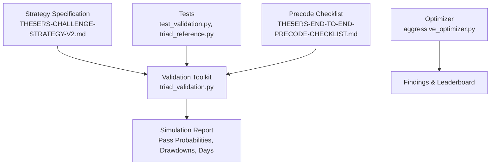
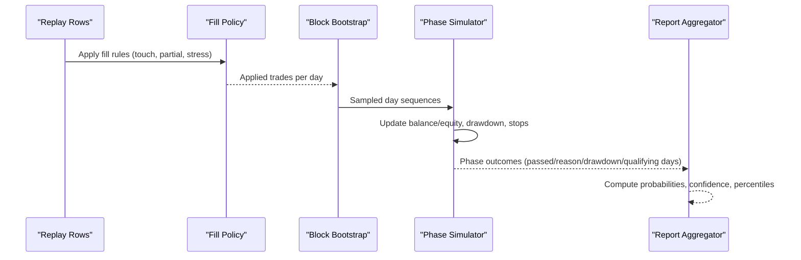
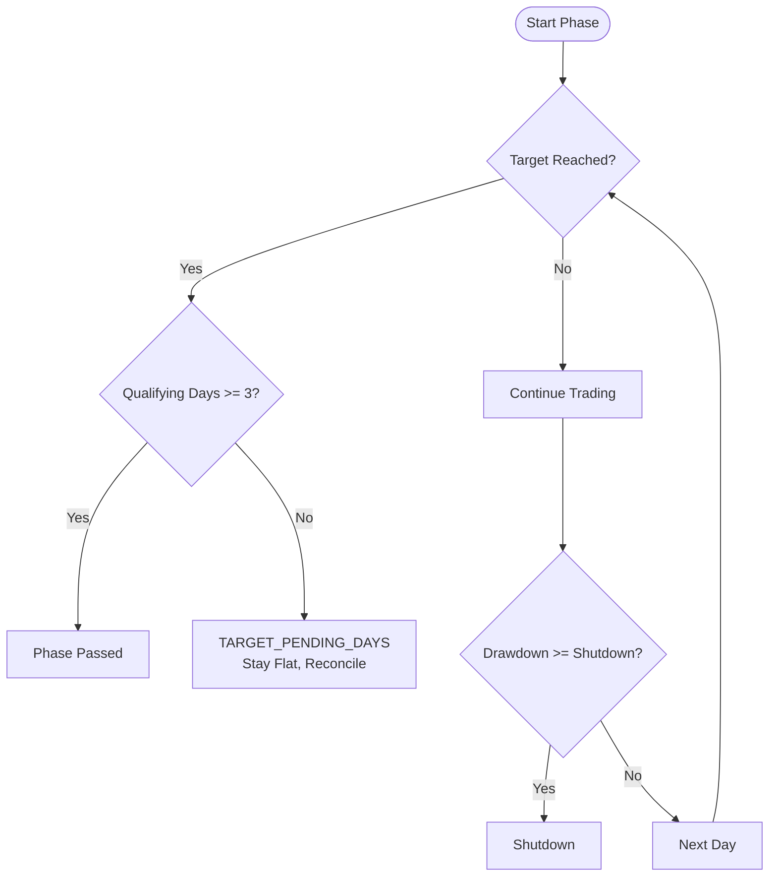
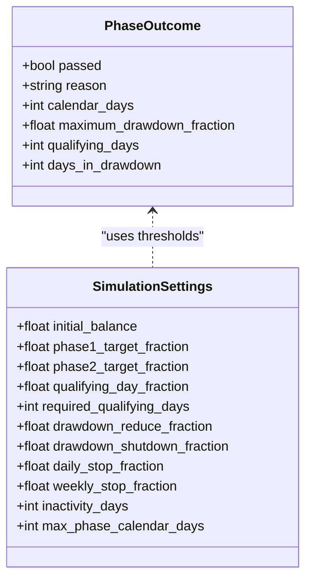
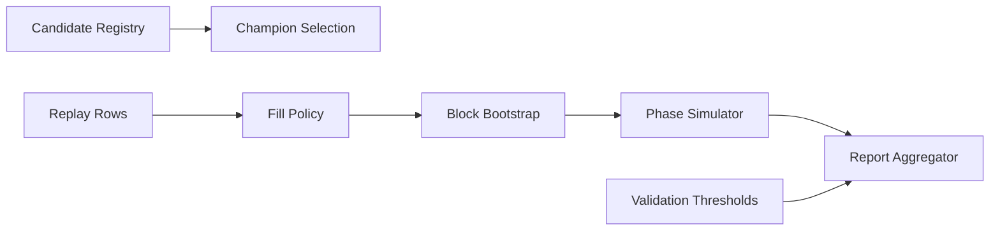

# Challenge Simulation Framework

<cite>
**Referenced Files in This Document**
- [THE5ERS-CHALLENGE-STRATEGY-V2.md](file://THE5ERS-CHALLENGE-STRATEGY-V2.md)
- [aggressive_optimizer.py](file://tools/aggressive_optimizer.py)
- [triad_validation.py](file://tools/triad_validation.py)
- [test_validation.py](file://tests/test_validation.py)
- [triad_reference.py](file://tests/triad_reference.py)
- [THE5ERS-END-TO-END-PRECODE-CHECKLIST.md](file://THE5ERS-END-TO-END-PRECODE-CHECKLIST.md)
</cite>

## Table of Contents
1. [Introduction](#introduction)
2. [Project Structure](#project-structure)
3. [Core Components](#core-components)
4. [Architecture Overview](#architecture-overview)
5. [Detailed Component Analysis](#detailed-component-analysis)
6. [Dependency Analysis](#dependency-analysis)
7. [Performance Considerations](#performance-considerations)
8. [Troubleshooting Guide](#troubleshooting-guide)
9. [Conclusion](#conclusion)
10. [Appendices](#appendices)

## Introduction
This document explains the The5ers challenge simulation framework used by the screening tool to evaluate strategy viability under the $2,500 New High Stakes two-step evaluation. It covers phase management (Phase 1 and Phase 2), target percentage calculations, qualifying day requirements, daily and overall drawdown limits, inactivity rules, and phase reset capabilities. It also describes how the simulation tracks account state, monitors compliance with challenge rules, and provides feedback on pass probabilities and risk metrics.

The framework is implemented as a combination of:
- A canonical specification defining immutable challenge parameters and operational rules.
- A validation engine that replays event-level results through a block-bootstrapped simulator to estimate pass probabilities and drawdown behavior across many paths.
- An optimizer that runs simplified bar-level simulations for parameter exploration and quick scenario analysis.

## Project Structure
At a high level, the repository contains:
- Strategy specification documents describing The5ers rules, risk controls, exits, and lifecycle transitions.
- A validation toolkit that consumes replay rows and simulates Phase 1 and Phase 2 outcomes with strict fill policies and thresholds.
- Optimizer scripts that run multi-pair backtests to explore strategies and report performance summaries.
- Tests that assert correctness of reference math, selection logic, and phase simulation behavior.

**Diagram sources**
- [THE5ERS-CHALLENGE-STRATEGY-V2.md:11-28](file://THE5ERS-CHALLENGE-STRATEGY-V2.md#L11-L28)
- [triad_validation.py:162-180](file://tools/triad_validation.py#L162-L180)
- [aggressive_optimizer.py:1-22](file://tools/aggressive_optimizer.py#L1-L22)
- [test_validation.py:275-312](file://tests/test_validation.py#L275-L312)

**Section sources**
- [THE5ERS-CHALLENGE-STRATEGY-V2.md:11-28](file://THE5ERS-CHALLENGE-STRATEGY-V2.md#L11-L28)
- [triad_validation.py:162-180](file://tools/triad_validation.py#L162-L180)
- [aggressive_optimizer.py:1-22](file://tools/aggressive_optimizer.py#L1-L22)
- [test_validation.py:275-312](file://tests/test_validation.py#L275-L312)

## Core Components
- Immutable challenge profile: defines targets, floors, and rule constraints that cannot be optimized or waived.
- Risk engine: fixed risk profiles paired with target R; drawdown throttle reduces risk at defined thresholds and shuts down at emergency boundaries.
- Daily operating state machine: enforces one-position, max-two-trades-per-day, and day-locking after profitable first trade or second completed trade.
- Profitable-day engine: calculates qualifying days using the official formula and counts them per phase.
- Firm-rule and target protection: persists phase identity and initial balance; computes daily and overall floors; prevents orders that could breach floors.
- Phase completion guards: require both target balance and three dashboard-confirmed qualifying days; lock phase upon completion; handle target reached before days via a pending-days state.
- Validation simulator: block-bootstrap sampling of calendar days to simulate Phase 1 then Phase 2, tracking drawdown, inactivity, and pass reasons.

**Section sources**
- [THE5ERS-CHALLENGE-STRATEGY-V2.md:31-50](file://THE5ERS-CHALLENGE-STRATEGY-V2.md#L31-L50)
- [THE5ERS-CHALLENGE-STRATEGY-V2.md:185-221](file://THE5ERS-CHALLENGE-STRATEGY-V2.md#L185-L221)
- [THE5ERS-CHALLENGE-STRATEGY-V2.md:224-269](file://THE5ERS-CHALLENGE-STRATEGY-V2.md#L224-L269)
- [THE5ERS-CHALLENGE-STRATEGY-V2.md:272-311](file://THE5ERS-CHALLENGE-STRATEGY-V2.md#L272-L311)
- [triad_validation.py:970-1072](file://tools/triad_validation.py#L970-L1072)
- [triad_validation.py:1122-1214](file://tools/triad_validation.py#L1122-L1214)

## Architecture Overview
The simulation architecture consists of:
- Replay ingestion: CSV rows representing candidate events, fills, costs, and violations.
- Fill policy application: filters touches without trade-through, partial fills, and applies stressed cost assumptions.
- Block bootstrap sampler: samples blocks of calendar days to preserve loss clusters and temporal structure.
- Phase simulator: iterates days, applies trades, updates balance/equity, checks drawdown and stop limits, counts qualifying days, and determines pass/fail reasons.
- Aggregation: computes pass probabilities, joint pass probability, confidence intervals, drawdown percentiles, and time-in-drawdown metrics.

**Diagram sources**
- [triad_validation.py:112-128](file://tools/triad_validation.py#L112-L128)
- [triad_validation.py:955-968](file://tools/triad_validation.py#L955-L968)
- [triad_validation.py:970-1072](file://tools/triad_validation.py#L970-L1072)
- [triad_validation.py:1122-1214](file://tools/triad_validation.py#L1122-L1214)

## Detailed Component Analysis

### Phase Management (Phase 1 and Phase 2)
- Targets:
  - Phase 1: +10% of phase initial balance ($250 on $2,500).
  - Phase 2: +5% of phase initial balance ($125 on $2,500).
- Completion requires reaching target balance AND three dashboard-confirmed qualifying days.
- If target is reached before qualifying days are confirmed, the system enters a pending-days state and remains flat until reconciliation and review.
- Phase transition:
  - Lock Phase 1 after both conditions are met.
  - On receiving Phase 2 account, verify product, initial balance, symbol specs, and rule set; create new static floors and counters; preserve champion configuration.

**Diagram sources**
- [triad_validation.py:980-1072](file://tools/triad_validation.py#L980-L1072)
- [triad_validation.py:1122-1214](file://tools/triad_validation.py#L1122-L1214)
- [THE5ERS-CHALLENGE-STRATEGY-V2.md:297-311](file://THE5ERS-CHALLENGE-STRATEGY-V2.md#L297-L311)

**Section sources**
- [THE5ERS-CHALLENGE-STRATEGY-V2.md:297-311](file://THE5ERS-CHALLENGE-STRATEGY-V2.md#L297-L311)
- [triad_validation.py:980-1072](file://tools/triad_validation.py#L980-L1072)
- [triad_validation.py:1122-1214](file://tools/triad_validation.py#L1122-L1214)

### Target Percentage Calculations
- Phase targets are fractions of the phase initial balance:
  - Phase 1: 1.10 × initial balance.
  - Phase 2: 1.05 × initial balance.
- These values are used directly in the simulator to determine when a phase target is reached.

**Section sources**
- [triad_validation.py:162-180](file://tools/triad_validation.py#L162-L180)
- [triad_reference.py:117-124](file://tests/triad_reference.py#L117-L124)

### Qualifying Day Requirements
- Qualifying day threshold: 0.5% of phase initial balance ($12.50 on $2,500).
- Official formula uses midnight balance and equity at rollover compared to previous day’s balance.
- The simulator increments qualifying days when daily net meets or exceeds the threshold.
- Three qualifying days are required per phase for completion.

**Section sources**
- [THE5ERS-CHALLENGE-STRATEGY-V2.md:243-269](file://THE5ERS-CHALLENGE-STRATEGY-V2.md#L243-L269)
- [triad_validation.py:980-1072](file://tools/triad_validation.py#L980-L1072)
- [triad_reference.py:86-88](file://tests/triad_reference.py#L86-L88)

### Daily and Overall Drawdown Limits
- Internal daily stop: 1.0% of phase initial balance ($25 on $2,500).
- Internal weekly stop: 2.0% of phase initial balance ($50 on $2,500).
- Strategy drawdown throttle:
  - 0–2% drawdown: full risk.
  - 2–5% drawdown: half risk.
  - ≥5% drawdown: shutdown.
- Firm floors:
  - Daily floor: 95% of rollover balance/equity.
  - Overall floor: 90% of phase initial balance.
  - Active floor is the maximum of daily and overall floors.
- Orders are prevented if stressed projected loss could cross active floor plus a conservative reserve.

**Section sources**
- [THE5ERS-CHALLENGE-STRATEGY-V2.md:200-221](file://THE5ERS-CHALLENGE-STRATEGY-V2.md#L200-L221)
- [THE5ERS-CHALLENGE-STRATEGY-V2.md:272-295](file://THE5ERS-CHALLENGE-STRATEGY-V2.md#L272-L295)
- [triad_validation.py:980-1072](file://tools/triad_validation.py#L980-L1072)
- [triad_reference.py:91-103](file://tests/triad_reference.py#L91-L103)

### Inactivity Rules
- Evaluation inactivity limit: 30 consecutive days without trading activity.
- The simulator tracks inactive days per phase and returns an “inactivity” reason if the limit is reached.

**Section sources**
- [THE5ERS-CHALLENGE-STRATEGY-V2.md:397-404](file://THE5ERS-CHALLENGE-STRATEGY-V2.md#L397-L404)
- [triad_validation.py:162-180](file://tools/triad_validation.py#L162-L180)
- [triad_validation.py:1049-1051](file://tools/triad_validation.py#L1049-L1051)

### Phase Reset Capabilities
- Phase 2 starts a new three-day counter and new static overall floor.
- Phase transition requires human-authorized verification of account number, server, product, initial balance, symbol specifications, and rule set.
- No order may be sent until the new account completes a clean initialization/reconciliation cycle.

**Section sources**
- [THE5ERS-CHALLENGE-STRATEGY-V2.md:407-414](file://THE5ERS-CHALLENGE-STRATEGY-V2.md#L407-L414)
- [triad_validation.py:1122-1214](file://tools/triad_validation.py#L1122-L1214)

### How the Simulation Tracks Account State
- Balance and high-water mark are updated per trade; drawdown measured from high-water mark.
- Daily and weekly stops are enforced; day locking occurs after profitable first trade or second completed trade.
- Qualifying days counted based on daily net meeting threshold.
- Inactivity tracked per day; shutdown triggered at drawdown thresholds.

**Diagram sources**
- [triad_validation.py:162-180](file://tools/triad_validation.py#L162-L180)
- [triad_validation.py:970-978](file://tools/triad_validation.py#L970-L978)

**Section sources**
- [triad_validation.py:980-1072](file://tools/triad_validation.py#L980-L1072)

### Compliance Monitoring and Feedback
- Fill policy ensures only valid fills are simulated; touches without trade-through and partial fills are excluded.
- Validation thresholds enforce minimum fills, expectancy, profit factor, pass probabilities, and drawdown limits.
- Reports include:
  - Phase 1 and Phase 2 pass probabilities.
  - Joint pass probability with confidence bounds.
  - Qualifying days by target probabilities.
  - Maximum drawdown percentiles and median time in drawdown.

**Section sources**
- [triad_validation.py:112-128](file://tools/triad_validation.py#L112-L128)
- [triad_validation.py:131-145](file://tools/triad_validation.py#L131-L145)
- [triad_validation.py:1122-1214](file://tools/triad_validation.py#L1122-L1214)

### Examples of Challenge Scenarios and Outcomes
- Scenario A: Consistent positive daily nets above $12.50 lead to rapid Phase 1 pass and subsequent Phase 2 pass; report shows high pass probabilities and low drawdown.
- Scenario B: Frequent losses push drawdown into half-risk tier; qualifying days accumulate slowly; pass probability decreases but may still meet thresholds depending on path distribution.
- Scenario C: Extended inactivity triggers “inactivity” failure before target is reached; pass probability drops to zero for that path.
- Scenario D: Target reached early but qualifying days not yet confirmed; system enters TARGET_PENDING_DAYS and remains flat until reconciliation; pass depends on subsequent qualifying days.

These scenarios are reflected in the simulator’s outcome reasons and aggregated report fields such as pass probabilities, reasons distributions, and drawdown metrics.

**Section sources**
- [triad_validation.py:980-1072](file://tools/triad_validation.py#L980-L1072)
- [triad_validation.py:1122-1214](file://tools/triad_validation.py#L1122-L1214)
- [test_validation.py:275-312](file://tests/test_validation.py#L275-L312)

## Dependency Analysis
The validation toolkit depends on:
- Replay rows containing event-level data and costs.
- Candidate configurations from a frozen registry.
- Fill policy to apply realistic execution assumptions.
- Block bootstrap sampler to preserve temporal structure.
- Phase simulator to compute outcomes and metrics.

**Diagram sources**
- [triad_validation.py:98-110](file://tools/triad_validation.py#L98-L110)
- [triad_validation.py:112-128](file://tools/triad_validation.py#L112-L128)
- [triad_validation.py:131-145](file://tools/triad_validation.py#L131-L145)
- [triad_validation.py:955-968](file://tools/triad_validation.py#L955-L968)
- [triad_validation.py:970-1072](file://tools/triad_validation.py#L970-L1072)
- [triad_validation.py:1122-1214](file://tools/triad_validation.py#L1122-L1214)

**Section sources**
- [triad_validation.py:98-110](file://tools/triad_validation.py#L98-L110)
- [triad_validation.py:112-128](file://tools/triad_validation.py#L112-L128)
- [triad_validation.py:131-145](file://tools/triad_validation.py#L131-L145)
- [triad_validation.py:955-968](file://tools/triad_validation.py#L955-L968)
- [triad_validation.py:970-1072](file://tools/triad_validation.py#L970-L1072)
- [triad_validation.py:1122-1214](file://tools/triad_validation.py#L1122-L1214)

## Performance Considerations
- Use block bootstrap sampling to preserve losing clusters and avoid overestimating pass rates.
- Limit maximum phase calendar days to control runtime while maintaining meaningful evaluation windows.
- Ensure sufficient replay coverage across all configurations and combinations to avoid biased results.
- Stress testing increases cost assumptions to validate robustness under adverse conditions.

[No sources needed since this section provides general guidance]

## Troubleshooting Guide
Common issues and resolutions:
- Missing replay coverage: ensure every configuration, combination, and day is present in WALK_FORWARD and HOLDOUT splits.
- Fill rejections: verify trade-through ticks and fill fraction; touches without trade-through are not fills.
- Inactivity failures: maintain trading activity within the 30-day limit; avoid maintenance trades solely to prevent inactivity.
- Drawdown shutdown: reduce risk at 2% drawdown; halt at 5%; reconcile and revalidate before resuming.
- Target pending days: remain flat; do not invent special trades; reconcile dashboard and EA counts.

**Section sources**
- [triad_validation.py:125-132](file://tools/triad_validation.py#L125-L132)
- [triad_validation.py:1049-1051](file://tools/triad_validation.py#L1049-L1051)
- [triad_validation.py:1023-1031](file://tools/triad_validation.py#L1023-L1031)
- [THE5ERS-CHALLENGE-STRATEGY-V2.md:397-404](file://THE5ERS-CHALLENGE-STRATEGY-V2.md#L397-L404)
- [THE5ERS-END-TO-END-PRECODE-CHECKLIST.md:235-258](file://THE5ERS-END-TO-END-PRECODE-CHECKLIST.md#L235-L258)

## Conclusion
The The5ers challenge simulation framework provides a rigorous, rule-compliant evaluation of strategy viability under the $2,500 New High Stakes two-step evaluation. It enforces immutable challenge parameters, manages phases with clear completion criteria, monitors drawdown and inactivity, and produces actionable reports with pass probabilities and risk metrics. By combining specification-driven rules with block-bootstrapped simulation and strict validation thresholds, it offers a reliable basis for selecting champions and assessing readiness for live deployment.

[No sources needed since this section summarizes without analyzing specific files]

## Appendices

### Appendix A: Key Constants and Profiles
- Profiles:
  - A: 0.40% risk, +1.5R target.
  - B: 0.35% risk, +1.75R target.
  - C: 0.30% risk, +2.0R target.
  - D: 0.25% risk, +2.5R target.
- Drawdown tiers:
  - 0–2%: full risk.
  - 2–5%: half risk.
  - ≥5%: shutdown.

**Section sources**
- [triad_reference.py:22-27](file://tests/triad_reference.py#L22-L27)
- [triad_reference.py:68-75](file://tests/triad_reference.py#L68-L75)

### Appendix B: Optimizer Quick Reference
- Multi-pair optimizer explores ORB and volatility strategies with fixed lot sizing off $2,500.
- Reports top combinations by fastest Phase 1 completion and monthly P&L.
- Includes per-pair contributions and equity curve summaries.

**Section sources**
- [aggressive_optimizer.py:1-22](file://tools/aggressive_optimizer.py#L1-L22)
- [aggressive_optimizer.py:334-485](file://tools/aggressive_optimizer.py#L334-L485)
- [aggressive_optimizer.py:515-552](file://tools/aggressive_optimizer.py#L515-L552)