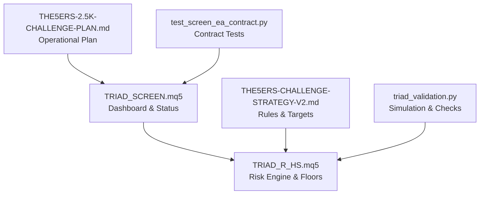
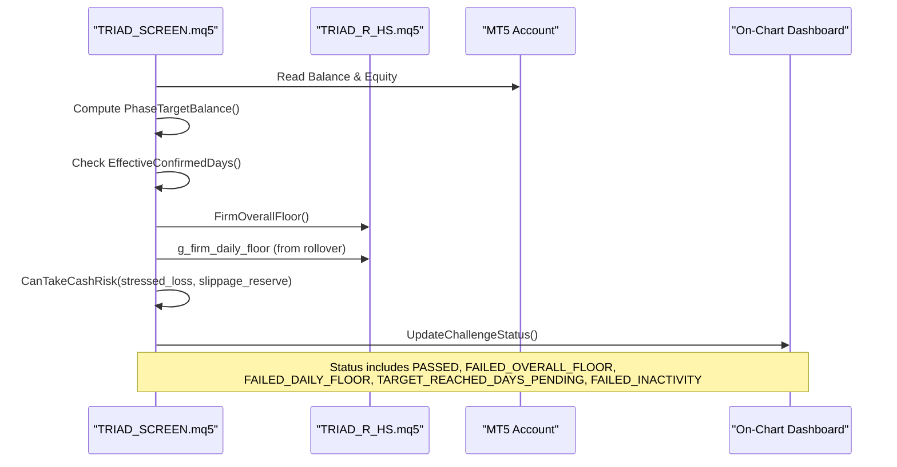
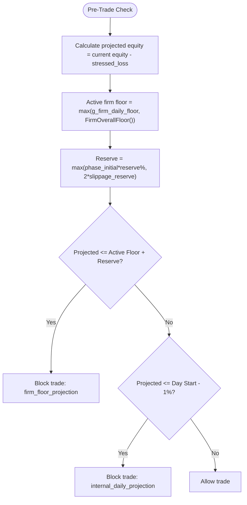
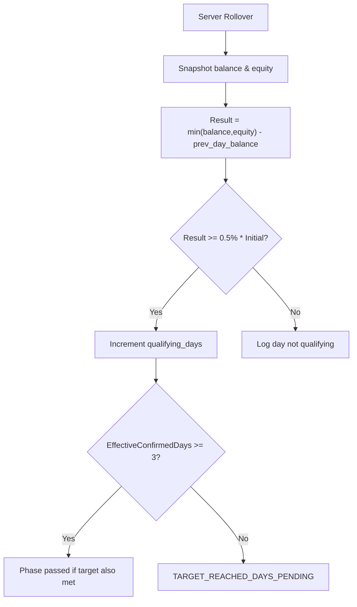
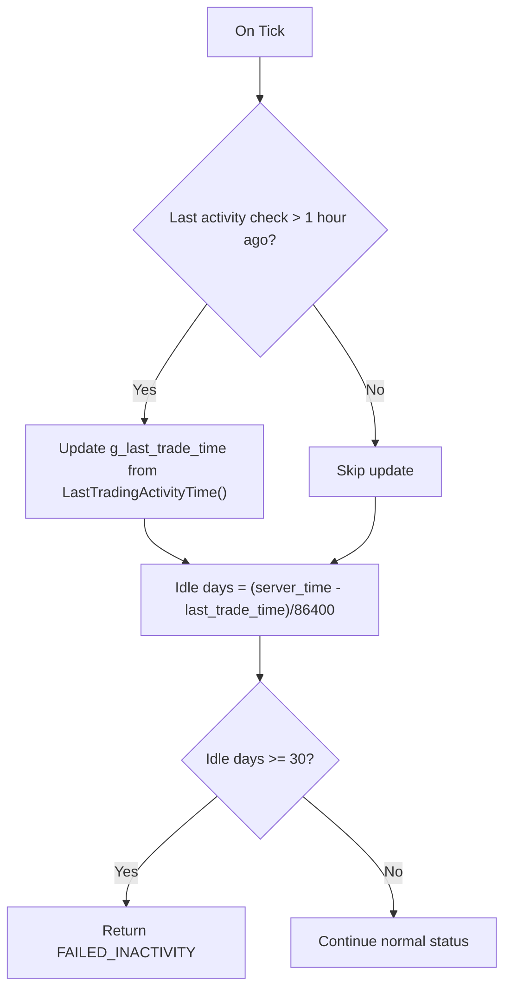
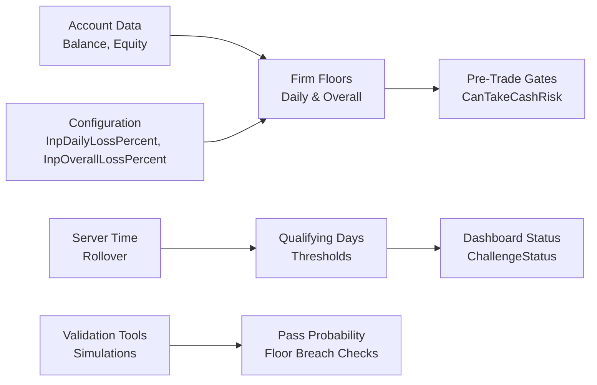

# Compliance Monitoring System

<cite>
**Referenced Files in This Document**
- [TRIAD_SCREEN.mq5](file://MQL5/Experts/TRIAD_SCREEN/TRIAD_SCREEN.mq5)
- [TRIAD_R_HS.mq5](file://MQL5/Experts/TRIAD_R_HS/TRIAD_R_HS.mq5)
- [THE5ERS-CHALLENGE-STRATEGY-V2.md](file://THE5ERS-CHALLENGE-STRATEGY-V2.md)
- [THE5ERS-2.5K-CHALLENGE-PLAN.md](file://THE5ERS-2.5K-CHALLENGE-PLAN.md)
- [test_screen_ea_contract.py](file://tests/test_screen_ea_contract.py)
- [triad_validation.py](file://tools/triad_validation.py)
</cite>

## Table of Contents
1. [Introduction](#introduction)
2. [Project Structure](#project-structure)
3. [Core Components](#core-components)
4. [Architecture Overview](#architecture-overview)
5. [Detailed Component Analysis](#detailed-component-analysis)
6. [Dependency Analysis](#dependency-analysis)
7. [Performance Considerations](#performance-considerations)
8. [Troubleshooting Guide](#troubleshooting-guide)
9. [Conclusion](#conclusion)
10. [Appendices](#appendices)

## Introduction
This document explains the compliance monitoring system that enforces The5ers challenge rules during simulation and live operation. It focuses on:
- Drawdown limit enforcement using InpDailyLossPercent (5%) and InpOverallLossPercent (10%)
- Qualifying day tracking with InpMinQualifyingDays (3 days) and InpQualifyingDayPercent (0.5%)
- Inactivity detection using InpInactivityDays (30 days)
- Alert mechanisms, violation detection algorithms, and recovery procedures when challenges fail
- Examples of successful rule adherence and common violation patterns leading to failure

The system is implemented primarily in MQL5 EAs and validated through Python-based simulation tools.

## Project Structure
The compliance logic spans two main EAs and supporting documentation/validation code:
- TRIAD_SCREEN.mq5: Dashboard-facing status, daily floors, qualifying-day estimation, inactivity checks, and alerting
- TRIAD_R_HS.mq5: Canonical risk engine, phase targets, firm floors, drawdown throttling, and pre-trade safety gates
- Documentation and tests define the exact rule set and verify implementation behavior

**Diagram sources**
- [TRIAD_SCREEN.mq5:3089-3127](file://MQL5/Experts/TRIAD_SCREEN/TRIAD_SCREEN.mq5#L3089-L3127)
- [TRIAD_R_HS.mq5:1660-1699](file://MQL5/Experts/TRIAD_R_HS/TRIAD_R_HS.mq5#L1660-L1699)
- [THE5ERS-CHALLENGE-STRATEGY-V2.md:272-311](file://THE5ERS-CHALLENGE-STRATEGY-V2.md#L272-L311)
- [THE5ERS-2.5K-CHALLENGE-PLAN.md:14-36](file://THE5ERS-2.5K-CHALLENGE-PLAN.md#L14-L36)
- [triad_validation.py:1010-1062](file://tools/triad_validation.py#L1010-L1062)
- [test_screen_ea_contract.py:75-116](file://tests/test_screen_ea_contract.py#L75-L116)

**Section sources**
- [TRIAD_SCREEN.mq5:3089-3127](file://MQL5/Experts/TRIAD_SCREEN/TRIAD_SCREEN.mq5#L3089-L3127)
- [TRIAD_R_HS.mq5:1660-1699](file://MQL5/Experts/TRIAD_R_HS/TRIAD_R_HS.mq5#L1660-L1699)
- [THE5ERS-CHALLENGE-STRATEGY-V2.md:272-311](file://THE5ERS-CHALLENGE-STRATEGY-V2.md#L272-L311)
- [THE5ERS-2.5K-CHALLENGE-PLAN.md:14-36](file://THE5ERS-2.5K-CHALLENGE-PLAN.md#L14-L36)
- [triad_validation.py:1010-1062](file://tools/triad_validation.py#L1010-L1062)
- [test_screen_ea_contract.py:75-116](file://tests/test_screen_ea_contract.py#L75-L116)

## Core Components
- Drawdown limits: Daily floor at 5% from rollover snapshot; overall floor at 10% from initial balance
- Qualifying days: Minimum 3 days per phase where each day meets a 0.5% profit threshold relative to initial balance
- Inactivity detection: 30 consecutive days without executed trades triggers failure
- Alerts and dashboard: Real-time status labels, color-coded states, and logs for violations and pending conditions
- Pre-trade safety gates: Projected loss must not breach active firm floor plus reserve or internal daily stop

**Section sources**
- [TRIAD_SCREEN.mq5:3089-3127](file://MQL5/Experts/TRIAD_SCREEN/TRIAD_SCREEN.mq5#L3089-L3127)
- [TRIAD_SCREEN.mq5:1820-1852](file://MQL5/Experts/TRIAD_SCREEN/TRIAD_SCREEN.mq5#L1820-L1852)
- [TRIAD_R_HS.mq5:1660-1699](file://MQL5/Experts/TRIAD_R_HS/TRIAD_R_HS.mq5#L1660-L1699)
- [THE5ERS-CHALLENGE-STRATEGY-V2.md:243-269](file://THE5ERS-CHALLENGE-STRATEGY-V2.md#L243-L269)
- [THE5ERS-2.5K-CHALLENGE-PLAN.md:14-36](file://THE5ERS-2.5K-CHALLENGE-PLAN.md#L14-L36)

## Architecture Overview
The compliance system integrates real-time account state with rule thresholds to enforce trading constraints and report status.

**Diagram sources**
- [TRIAD_SCREEN.mq5:3089-3127](file://MQL5/Experts/TRIAD_SCREEN/TRIAD_SCREEN.mq5#L3089-L3127)
- [TRIAD_SCREEN.mq5:1820-1852](file://MQL5/Experts/TRIAD_SCREEN/TRIAD_SCREEN.mq5#L1820-L1852)
- [TRIAD_R_HS.mq5:1660-1699](file://MQL5/Experts/TRIAD_R_HS/TRIAD_R_HS.mq5#L1660-L1699)

## Detailed Component Analysis

### Drawdown Limit Enforcement
- Daily loss limit: 5% of the rollover snapshot (higher of balance or equity)
- Overall loss limit: 10% of the phase initial balance
- Active firm floor: max(daily floor, overall floor)
- Pre-trade projection: projected equity after stressed loss must remain above active firm floor plus reserve
- Internal daily stop: additional guard at 1% from day start balance

**Diagram sources**
- [TRIAD_SCREEN.mq5:1838-1852](file://MQL5/Experts/TRIAD_SCREEN/TRIAD_SCREEN.mq5#L1838-L1852)
- [TRIAD_R_HS.mq5:1685-1699](file://MQL5/Experts/TRIAD_R_HS/TRIAD_R_HS.mq5#L1685-L1699)

**Section sources**
- [TRIAD_SCREEN.mq5:1820-1852](file://MQL5/Experts/TRIAD_SCREEN/TRIAD_SCREEN.mq5#L1820-L1852)
- [TRIAD_R_HS.mq5:1660-1699](file://MQL5/Experts/TRIAD_R_HS/TRIAD_R_HS.mq5#L1660-L1699)
- [THE5ERS-CHALLENGE-STRATEGY-V2.md:272-311](file://THE5ERS-CHALLENGE-STRATEGY-V2.md#L272-L311)
- [THE5ERS-2.5K-CHALLENGE-PLAN.md:239-255](file://THE5ERS-2.5K-CHALLENGE-PLAN.md#L239-L255)

### Qualifying Day Tracking
- Threshold: 0.5% of phase initial balance ($12.50 for $2,500)
- Calculation: min(midnight balance, midnight equity) - previous day balance
- Requirement: At least 3 qualifying days per phase
- Pending state: If target reached but days not confirmed, enter TARGET_REACHED_DAYS_PENDING

**Diagram sources**
- [TRIAD_SCREEN.mq5:3040-3052](file://MQL5/Experts/TRIAD_SCREEN/TRIAD_SCREEN.mq5#L3040-L3052)
- [test_screen_ea_contract.py:112-116](file://tests/test_screen_ea_contract.py#L112-L116)

**Section sources**
- [TRIAD_SCREEN.mq5:3040-3052](file://MQL5/Experts/TRIAD_SCREEN/TRIAD_SCREEN.mq5#L3040-L3052)
- [test_screen_ea_contract.py:75-116](file://tests/test_screen_ea_contract.py#L75-L116)
- [THE5ERS-CHALLENGE-STRATEGY-V2.md:243-269](file://THE5ERS-CHALLENGE-STRATEGY-V2.md#L243-L269)
- [THE5ERS-2.5K-CHALLENGE-PLAN.md:14-36](file://THE5ERS-2.5K-CHALLENGE-PLAN.md#L14-L36)

### Inactivity Detection
- Monitor last executed trade time across account history
- Calculate idle days since last activity
- Trigger FAILED_INACTIVITY if idle days >= 30

**Diagram sources**
- [TRIAD_SCREEN.mq5:3107-3125](file://MQL5/Experts/TRIAD_SCREEN/TRIAD_SCREEN.mq5#L3107-L3125)

**Section sources**
- [TRIAD_SCREEN.mq5:3107-3125](file://MQL5/Experts/TRIAD_SCREEN/TRIAD_SCREEN.mq5#L3107-L3125)
- [test_screen_ea_contract.py:75-116](file://tests/test_screen_ea_contract.py#L75-L116)

### Alert Mechanisms and Dashboard
- On-chart dashboard displays status, progress, floors, and warnings
- Color coding: green for passed, red for failed, orange for halted/dry run
- Logs events for entries blocked, pattern rejections, profitable day estimates, and rollover accounting
- Alerts include news block inactivity risks and order submission status

**Section sources**
- [TRIAD_SCREEN.mq5:3237-3325](file://MQL5/Experts/TRIAD_SCREEN/TRIAD_SCREEN.mq5#L3237-L3325)
- [TRIAD_SCREEN.mq5:3439-3443](file://MQL5/Experts/TRIAD_SCREEN/TRIAD_SCREEN.mq5#L3439-L3443)
- [TRIAD_R_HS.mq5:142-149](file://MQL5/Experts/TRIAD_R_HS/TRIAD_R_HS.mq5#L142-L149)

### Violation Detection Algorithms
- ChallengeStatus returns explicit states: PASSED, FAILED_OVERALL_FLOOR, FAILED_DAILY_FLOOR, TARGET_REACHED_DAYS_PENDING, FAILED_INACTIVITY, HALTED
- Pre-trade CanTakeCashRisk blocks orders if projected loss breaches firm floor or internal daily stop
- Simulation tools validate pass probabilities, qualifying day probabilities, and floor breaches under stress

**Section sources**
- [TRIAD_SCREEN.mq5:3089-3127](file://MQL5/Experts/TRIAD_SCREEN/TRIAD_SCREEN.mq5#L3089-L3127)
- [TRIAD_SCREEN.mq5:1838-1852](file://MQL5/Experts/TRIAD_SCREEN/TRIAD_SCREEN.mq5#L1838-L1852)
- [triad_validation.py:1010-1062](file://tools/triad_validation.py#L1010-L1062)
- [triad_validation.py:1277-1341](file://tools/triad_validation.py#L1277-L1341)

### Recovery Procedures When Challenges Fail
- HALTED state with reason prevents further trading until reconciliation
- State file mismatch or initialization errors halt EA and require manual review
- Deinitialization cleanup cancels pending orders and closes positions if exposure remains
- Reconciliation required before resuming trading after halt or restart

**Section sources**
- [TRIAD_SCREEN.mq5:3385-3405](file://MQL5/Experts/TRIAD_SCREEN/TRIAD_SCREEN.mq5#L3385-L3405)
- [TRIAD_SCREEN.mq5:3446-3468](file://MQL5/Experts/TRIAD_SCREEN/TRIAD_SCREEN.mq5#L3446-L3468)
- [THE5ERS-CHALLENGE-STRATEGY-V2.md:272-311](file://THE5ERS-CHALLENGE-STRATEGY-V2.md#L272-L311)

## Dependency Analysis
The compliance system depends on MT5 account data, server time, and configuration parameters. Validation tools simulate scenarios to ensure robustness.

**Diagram sources**
- [TRIAD_SCREEN.mq5:1820-1852](file://MQL5/Experts/TRIAD_SCREEN/TRIAD_SCREEN.mq5#L1820-L1852)
- [TRIAD_SCREEN.mq5:3089-3127](file://MQL5/Experts/TRIAD_SCREEN/TRIAD_SCREEN.mq5#L3089-L3127)
- [triad_validation.py:1010-1062](file://tools/triad_validation.py#L1010-L1062)

**Section sources**
- [TRIAD_SCREEN.mq5:1820-1852](file://MQL5/Experts/TRIAD_SCREEN/TRIAD_SCREEN.mq5#L1820-L1852)
- [TRIAD_SCREEN.mq5:3089-3127](file://MQL5/Experts/TRIAD_SCREEN/TRIAD_SCREEN.mq5#L3089-L3127)
- [triad_validation.py:1010-1062](file://tools/triad_validation.py#L1010-L1062)

## Performance Considerations
- Real-time dashboard updates are rate-limited by configurable refresh seconds
- Activity checks are throttled to once per hour to avoid excessive history queries
- High-water mark updates occur only when flat to maintain accurate drawdown measurement
- Pre-trade projections minimize unnecessary order attempts by failing fast

[No sources needed since this section provides general guidance]

## Troubleshooting Guide
Common issues and resolutions:
- FAILED_OVERALL_FLOOR: Equity dropped below 10% of initial balance; review drawdown management and position sizing
- FAILED_DAILY_FLOOR: Equity breached 5% daily floor; check rollover snapshots and floating losses
- FAILED_INACTIVITY: No trades executed for 30 days; ensure strategy generates valid signals within window
- TARGET_REACHED_DAYS_PENDING: Target reached but insufficient qualifying days; wait for dashboard confirmation
- HALTED: Strategy halted due to error or safety condition; reconcile state and review logs

**Section sources**
- [TRIAD_SCREEN.mq5:3089-3127](file://MQL5/Experts/TRIAD_SCREEN/TRIAD_SCREEN.mq5#L3089-L3127)
- [TRIAD_SCREEN.mq5:3385-3405](file://MQL5/Experts/TRIAD_SCREEN/TRIAD_SCREEN.mq5#L3385-L3405)

## Conclusion
The compliance monitoring system enforces The5ers challenge rules through precise calculations of daily and overall loss limits, qualifying day tracking, and inactivity detection. It provides real-time alerts and dashboard feedback while preventing violations via pre-trade safety gates. Validation tools ensure robust performance under stress, and recovery procedures handle failures safely.

[No sources needed since this section summarizes without analyzing specific files]

## Appendices

### Example Scenarios

#### Successful Rule Adherence
- Daily profit of $12.50+ counted as qualifying day
- Equity remains above both daily and overall floors
- Trades executed within 30-day window to avoid inactivity failure
- Target reached with 3 qualifying days confirmed by dashboard

#### Common Violation Patterns Leading to Failure
- Two full losses in one day exceeding internal daily stop
- Floating losses causing daily floor breach at rollover
- No trades for 30 consecutive days triggering inactivity failure
- Target reached but insufficient qualifying days resulting in pending state

**Section sources**
- [THE5ERS-2.5K-CHALLENGE-PLAN.md:164-186](file://THE5ERS-2.5K-CHALLENGE-PLAN.md#L164-L186)
- [THE5ERS-CHALLENGE-STRATEGY-V2.md:224-269](file://THE5ERS-CHALLENGE-STRATEGY-V2.md#L224-L269)
- [triad_validation.py:1010-1062](file://tools/triad_validation.py#L1010-L1062)