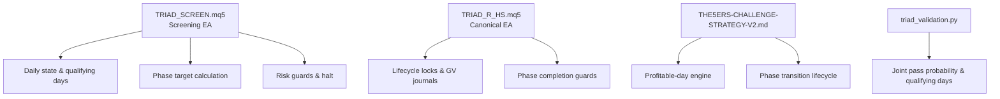
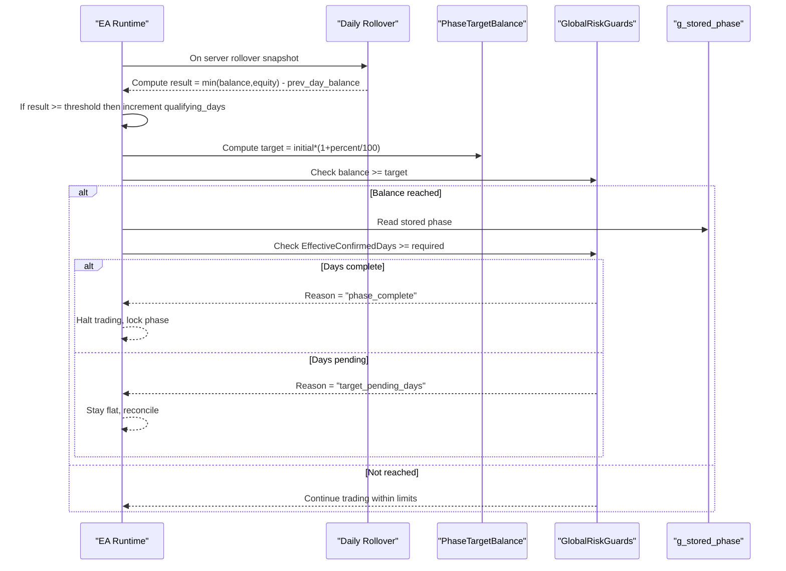
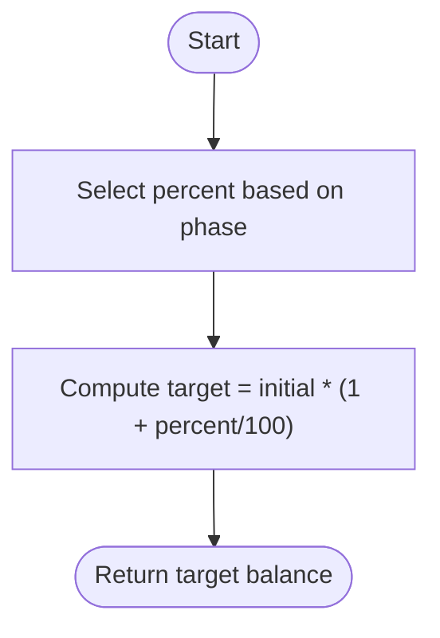
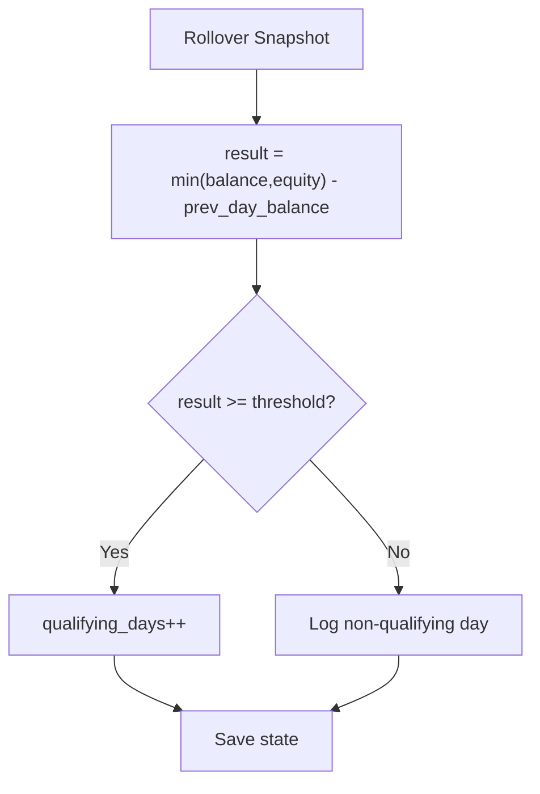
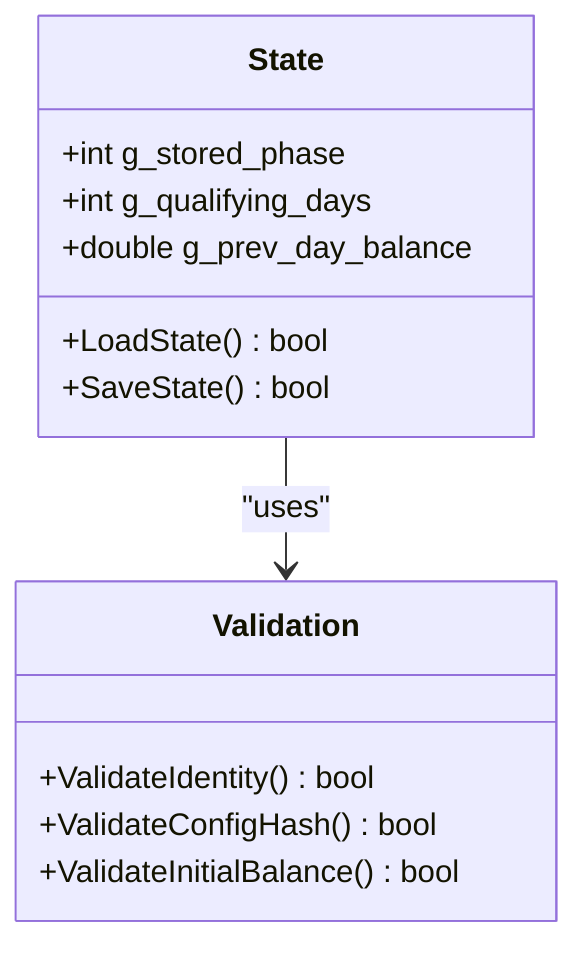
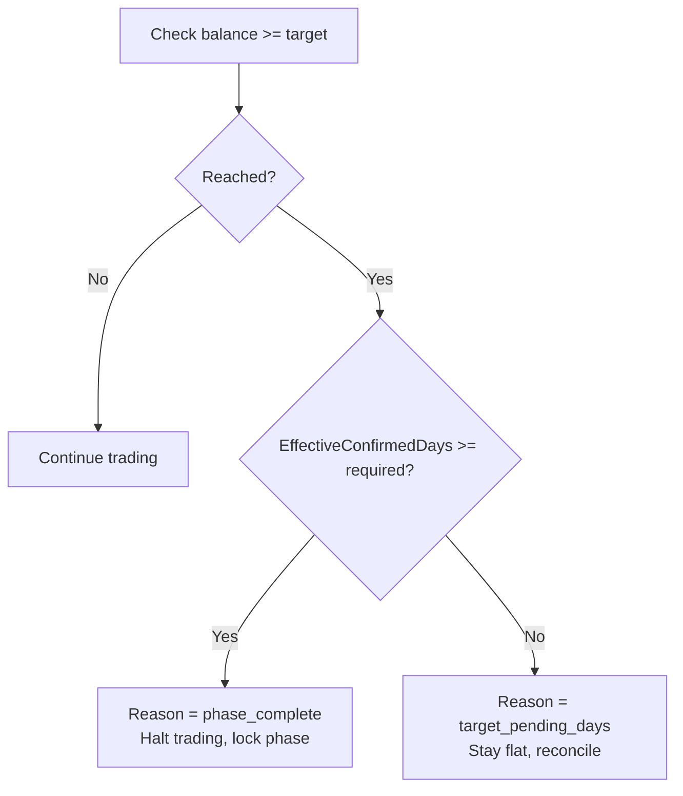
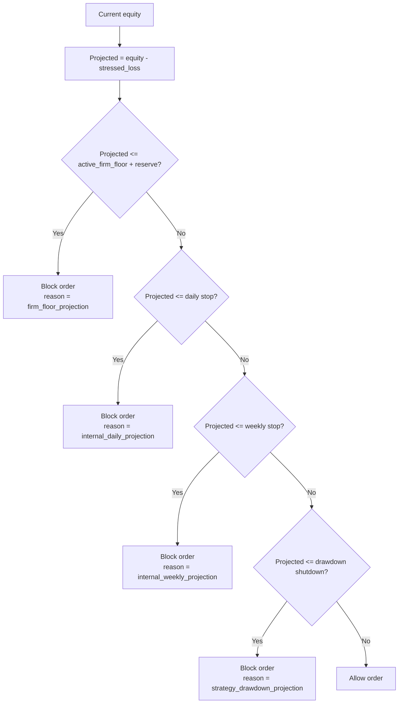
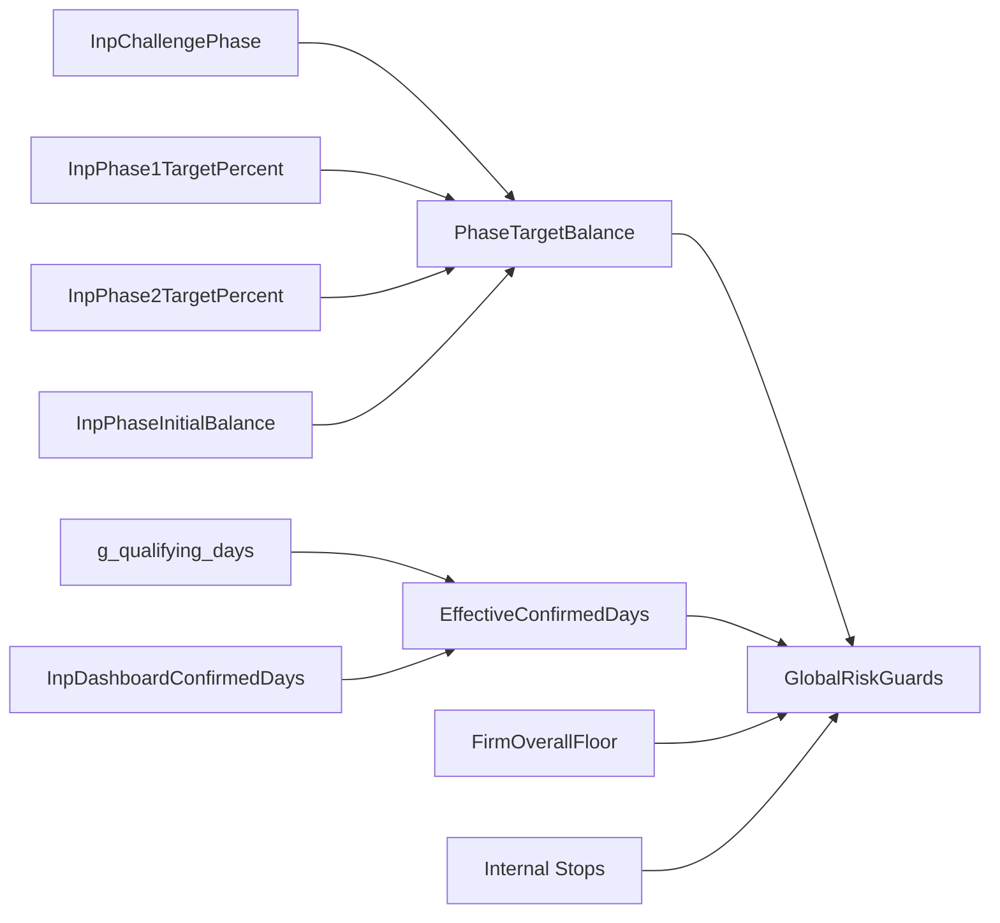

# Phase Management Logic

<cite>
**Referenced Files in This Document**
- [TRIAD_SCREEN.mq5](file://MQL5/Experts/TRIAD_SCREEN/TRIAD_SCREEN.mq5)
- [TRIAD_R_HS.mq5](file://MQL5/Experts/TRIAD_R_HS/TRIAD_R_HS.mq5)
- [THE5ERS-CHALLENGE-STRATEGY-V2.md](file://THE5ERS-CHALLENGE-STRATEGY-V2.md)
- [THE5ERS-END-TO-END-PRECODE-CHECKLIST.md](file://THE5ERS-END-TO-END-PRECODE-CHECKLIST.md)
- [triad_validation.py](file://tools/triad_validation.py)
</cite>

## Table of Contents
1. [Introduction](#introduction)
2. [Project Structure](#project-structure)
3. [Core Components](#core-components)
4. [Architecture Overview](#architecture-overview)
5. [Detailed Component Analysis](#detailed-component-analysis)
6. [Dependency Analysis](#dependency-analysis)
7. [Performance Considerations](#performance-considerations)
8. [Troubleshooting Guide](#troubleshooting-guide)
9. [Conclusion](#conclusion)

## Introduction
This document explains the phase management logic that drives The5ers challenge progression between Phase 1 and Phase 2. It covers how target achievement is calculated using InpPhase1TargetPercent (10%) and InpPhase2TargetPercent (5%), how balance growth triggers transition checks, how the system tracks current phase state through g_stored_phase, and how validation ensures proper progression requirements are met before allowing transitions. It also details daily progress monitoring toward phase goals and enforcement of phase-specific rules, with examples of successful transitions and failure cases.

## Project Structure
The phase management logic spans two MQL5 experts and supporting documentation:
- TRIAD_SCREEN.mq5 implements a research/screening EA with an on-chart dashboard for challenge simulation and day accounting.
- TRIAD_R_HS.mq5 is the canonical production EA with lifecycle locks, global variable journals, identity checks, and phase completion guards.
- THE5ERS-CHALLENGE-STRATEGY-V2.md defines the immutable profile, profitable-day engine, and phase transition lifecycle.
- THE5ERS-END-TO-END-PRECODE-CHECKLIST.md codifies stage gates including phase targets and transition procedures.
- triad_validation.py simulates multi-path outcomes to estimate joint pass probabilities and qualifying-day likelihoods.

**Diagram sources**
- [TRIAD_SCREEN.mq5:1774-1825](file://MQL5/Experts/TRIAD_SCREEN/TRIAD_SCREEN.mq5#L1774-L1825)
- [TRIAD_R_HS.mq5:1660-1695](file://MQL5/Experts/TRIAD_R_HS/TRIAD_R_HS.mq5#L1660-L1695)
- [THE5ERS-CHALLENGE-STRATEGY-V2.md:243-268](file://THE5ERS-CHALLENGE-STRATEGY-V2.md#L243-L268)
- [triad_validation.py:1035-1059](file://tools/triad_validation.py#L1035-L1059)

**Section sources**
- [TRIAD_SCREEN.mq5:98-110](file://MQL5/Experts/TRIAD_SCREEN/TRIAD_SCREEN.mq5#L98-L110)
- [TRIAD_R_HS.mq5:568-587](file://MQL5/Experts/TRIAD_R_HS/TRIAD_R_HS.mq5#L568-L587)
- [THE5ERS-CHALLENGE-STRATEGY-V2.md:384-422](file://THE5ERS-CHALLENGE-STRATEGY-V2.md#L384-L422)

## Core Components
- Target achievement calculation:
  - PhaseTargetBalance selects the appropriate percent based on current phase and computes the target balance from InpPhaseInitialBalance.
  - For Phase 1, InpPhase1TargetPercent = 10%; for Phase 2, InpPhase2TargetPercent = 5%.
- Qualifying day tracking:
  - EffectiveConfirmedDays returns the number of confirmed qualifying days, either from persisted counters or operator override.
  - Daily rollover snapshots compute min(midnight balance, midnight equity) minus previous day balance; if it meets the threshold (InpQualifyingDayPercent), the counter increments.
- Phase state persistence:
  - g_stored_phase persists the active phase across restarts and is validated against InpChallengePhase during state load.
- Transition criteria:
  - When ACCOUNT_BALANCE >= PhaseTargetBalance, GlobalRiskGuards sets reason to "phase_complete" if EffectiveConfirmedDays >= InpMinQualifyingDays, otherwise "target_pending_days".
  - Phase 1 requires reaching $2,750 and three qualifying days; Phase 2 requires reaching $2,625 and three qualifying days.
- Risk and floor enforcement:
  - FirmOverallFloor and FirmReserveCash protect against firm daily and overall loss boundaries.
  - Internal daily/weekly stops and drawdown shutdown prevent new orders when safety thresholds are breached.

**Section sources**
- [TRIAD_SCREEN.mq5:1774-1825](file://MQL5/Experts/TRIAD_SCREEN/TRIAD_SCREEN.mq5#L1774-L1825)
- [TRIAD_SCREEN.mq5:2000-2016](file://MQL5/Experts/TRIAD_SCREEN/TRIAD_SCREEN.mq5#L2000-L2016)
- [TRIAD_SCREEN.mq5:3025-3052](file://MQL5/Experts/TRIAD_SCREEN/TRIAD_SCREEN.mq5#L3025-L3052)
- [TRIAD_R_HS.mq5:1660-1695](file://MQL5/Experts/TRIAD_R_HS/TRIAD_R_HS.mq5#L1660-L1695)
- [THE5ERS-CHALLENGE-STRATEGY-V2.md:243-268](file://THE5ERS-CHALLENGE-STRATEGY-V2.md#L243-L268)

## Architecture Overview
The phase management architecture integrates target calculation, daily qualifying-day accounting, and risk/floor enforcement into a cohesive flow that prevents unauthorized transitions and ensures compliance with The5ers rules.

**Diagram sources**
- [TRIAD_SCREEN.mq5:1774-1825](file://MQL5/Experts/TRIAD_SCREEN/TRIAD_SCREEN.mq5#L1774-L1825)
- [TRIAD_SCREEN.mq5:2000-2016](file://MQL5/Experts/TRIAD_SCREEN/TRIAD_SCREEN.mq5#L2000-L2016)
- [TRIAD_SCREEN.mq5:3025-3052](file://MQL5/Experts/TRIAD_SCREEN/TRIAD_SCREEN.mq5#L3025-L3052)

**Section sources**
- [TRIAD_SCREEN.mq5:2000-2016](file://MQL5/Experts/TRIAD_SCREEN/TRIAD_SCREEN.mq5#L2000-L2016)
- [TRIAD_SCREEN.mq5:3025-3052](file://MQL5/Experts/TRIAD_SCREEN/TRIAD_SCREEN.mq5#L3025-L3052)

## Detailed Component Analysis

### Target Achievement Calculation
- PhaseTargetBalance uses InpChallengePhase to select InpPhase1TargetPercent (10%) or InpPhase2TargetPercent (5%).
- Target balance equals InpPhaseInitialBalance multiplied by (1 + percent/100).
- This ensures Phase 1 targets $2,750 and Phase 2 targets $2,625 when InpPhaseInitialBalance is $2,500.

**Diagram sources**
- [TRIAD_SCREEN.mq5:1820-1825](file://MQL5/Experts/TRIAD_SCREEN/TRIAD_SCREEN.mq5#L1820-L1825)

**Section sources**
- [TRIAD_SCREEN.mq5:1820-1825](file://MQL5/Experts/TRIAD_SCREEN/TRIAD_SCREEN.mq5#L1820-L1825)

### Qualifying Day Monitoring
- At rollover, the system computes result = min(midnight balance, midnight equity) - previous day balance.
- If result meets the threshold (InpQualifyingDayPercent of initial balance), the qualifying day counter increments.
- EffectiveConfirmedDays returns the count used for phase completion checks, optionally overridden by InpDashboardConfirmedDays.

**Diagram sources**
- [TRIAD_SCREEN.mq5:3025-3052](file://MQL5/Experts/TRIAD_SCREEN/TRIAD_SCREEN.mq5#L3025-L3052)
- [TRIAD_SCREEN.mq5:1774-1779](file://MQL5/Experts/TRIAD_SCREEN/TRIAD_SCREEN.mq5#L1774-L1779)

**Section sources**
- [TRIAD_SCREEN.mq5:3025-3052](file://MQL5/Experts/TRIAD_SCREEN/TRIAD_SCREEN.mq5#L3025-L3052)
- [TRIAD_SCREEN.mq5:1774-1779](file://MQL5/Experts/TRIAD_SCREEN/TRIAD_SCREEN.mq5#L1774-L1779)

### Phase State Tracking via g_stored_phase
- g_stored_phase is loaded from persisted state and validated against InpChallengePhase during LoadState.
- It is saved each time state is written, ensuring the EA knows which phase it is operating under after restarts.
- During initialization, the canonical EA validates identity, configuration hash, and initial balance to prevent mismatched phases.

**Diagram sources**
- [TRIAD_SCREEN.mq5:456-514](file://MQL5/Experts/TRIAD_SCREEN/TRIAD_SCREEN.mq5#L456-L514)
- [TRIAD_SCREEN.mq5:516-545](file://MQL5/Experts/TRIAD_SCREEN/TRIAD_SCREEN.mq5#L516-L545)
- [TRIAD_R_HS.mq5:3833-3860](file://MQL5/Experts/TRIAD_R_HS/TRIAD_R_HS.mq5#L3833-L3860)

**Section sources**
- [TRIAD_SCREEN.mq5:456-514](file://MQL5/Experts/TRIAD_SCREEN/TRIAD_SCREEN.mq5#L456-L514)
- [TRIAD_SCREEN.mq5:516-545](file://MQL5/Experts/TRIAD_SCREEN/TRIAD_SCREEN.mq5#L516-L545)
- [TRIAD_R_HS.mq5:3833-3860](file://MQL5/Experts/TRIAD_R_HS/TRIAD_R_HS.mq5#L3833-L3860)

### Phase Transition Criteria and Validation
- GlobalRiskGuards checks whether ACCOUNT_BALANCE >= PhaseTargetBalance.
- If true, it sets reason to "phase_complete" when EffectiveConfirmedDays >= InpMinQualifyingDays, otherwise "target_pending_days".
- Phase 1 requires $2,750 and three qualifying days; Phase 2 requires $2,625 and three qualifying days.
- The lifecycle enforces human-authorized transitions, fresh floors/counters, and no orders until clean initialization.

**Diagram sources**
- [TRIAD_SCREEN.mq5:2000-2016](file://MQL5/Experts/TRIAD_SCREEN/TRIAD_SCREEN.mq5#L2000-L2016)
- [THE5ERS-END-TO-END-PRECODE-CHECKLIST.md:252-277](file://THE5ERS-END-TO-END-PRECODE-CHECKLIST.md#L252-L277)

**Section sources**
- [TRIAD_SCREEN.mq5:2000-2016](file://MQL5/Experts/TRIAD_SCREEN/TRIAD_SCREEN.mq5#L2000-L2016)
- [THE5ERS-END-TO-END-PRECODE-CHECKLIST.md:252-277](file://THE5ERS-END-TO-END-PRECODE-CHECKLIST.md#L252-L277)

### Risk and Floor Enforcement
- FirmOverallFloor calculates the static overall loss boundary based on InpPhaseInitialBalance and InpOverallLossPercent.
- FirmReserveCash adds a conservative reserve to avoid crossing firm floors due to slippage or gaps.
- CanTakeCashRisk projects equity after stressed loss and blocks orders if projected equity breaches firm daily/overall floors, internal daily/weekly stops, or strategy drawdown shutdown.

**Diagram sources**
- [TRIAD_SCREEN.mq5:1827-1865](file://MQL5/Experts/TRIAD_SCREEN/TRIAD_SCREEN.mq5#L1827-L1865)

**Section sources**
- [TRIAD_SCREEN.mq5:1827-1865](file://MQL5/Experts/TRIAD_SCREEN/TRIAD_SCREEN.mq5#L1827-L1865)

## Dependency Analysis
- PhaseTargetBalance depends on InpChallengePhase, InpPhase1TargetPercent, InpPhase2TargetPercent, and InpPhaseInitialBalance.
- EffectiveConfirmedDays depends on g_qualifying_days and InpDashboardConfirmedDays.
- GlobalRiskGuards depends on PhaseTargetBalance, EffectiveConfirmedDays, FirmOverallFloor, and internal stops.
- Daily rollover logic depends on g_prev_day_balance, InpQualifyingDayPercent, and account balance/equity snapshots.

**Diagram sources**
- [TRIAD_SCREEN.mq5:1774-1825](file://MQL5/Experts/TRIAD_SCREEN/TRIAD_SCREEN.mq5#L1774-L1825)
- [TRIAD_SCREEN.mq5:1827-1865](file://MQL5/Experts/TRIAD_SCREEN/TRIAD_SCREEN.mq5#L1827-L1865)

**Section sources**
- [TRIAD_SCREEN.mq5:1774-1825](file://MQL5/Experts/TRIAD_SCREEN/TRIAD_SCREEN.mq5#L1774-L1825)
- [TRIAD_SCREEN.mq5:1827-1865](file://MQL5/Experts/TRIAD_SCREEN/TRIAD_SCREEN.mq5#L1827-L1865)

## Performance Considerations
- Daily rollover calculations are lightweight but must be executed reliably at server rollover to ensure accurate qualifying-day counts.
- Persisting state (g_stored_phase, g_qualifying_days, g_prev_day_balance) reduces recomputation and ensures continuity across restarts.
- Risk guards evaluate projections once per candidate submission, minimizing redundant checks while maintaining safety.

[No sources needed since this section provides general guidance]

## Troubleshooting Guide
Common issues and resolutions:
- Phase mismatch after restart:
  - Ensure g_stored_phase matches InpChallengePhase; mismatches cause LoadState to fail closed.
- Insufficient qualifying days:
  - Verify rollover snapshots capture min(balance,equity) correctly and that InpQualifyingDayPercent threshold is met.
- Target reached but not completed:
  - Enter TARGET_PENDING_DAYS; remain flat, reconcile formula/dashboard, and require human review before resuming.
- Order blocked by risk guards:
  - Check firm daily/overall floors, internal stops, and drawdown shutdown; adjust risk or wait for recovery.

**Section sources**
- [TRIAD_SCREEN.mq5:456-514](file://MQL5/Experts/TRIAD_SCREEN/TRIAD_SCREEN.mq5#L456-L514)
- [TRIAD_SCREEN.mq5:2000-2016](file://MQL5/Experts/TRIAD_SCREEN/TRIAD_SCREEN.mq5#L2000-L2016)
- [THE5ERS-CHALLENGE-STRATEGY-V2.md:243-268](file://THE5ERS-CHALLENGE-STRATEGY-V2.md#L243-L268)

## Conclusion
The phase management logic ensures disciplined progression through The5ers Phase 1 and Phase 2 by combining precise target calculations, robust qualifying-day accounting, and strict risk/floor enforcement. The system uses g_stored_phase to persist and validate the active phase, and GlobalRiskGuards to enforce completion criteria before halting trading. Successful transitions require both balance targets and qualifying days, while failures trigger safe states like TARGET_PENDING_DAYS to prevent rule violations.

[No sources needed since this section summarizes without analyzing specific files]