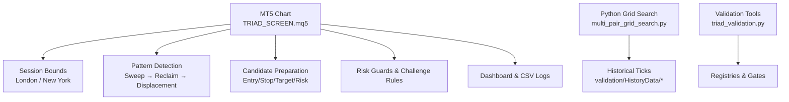
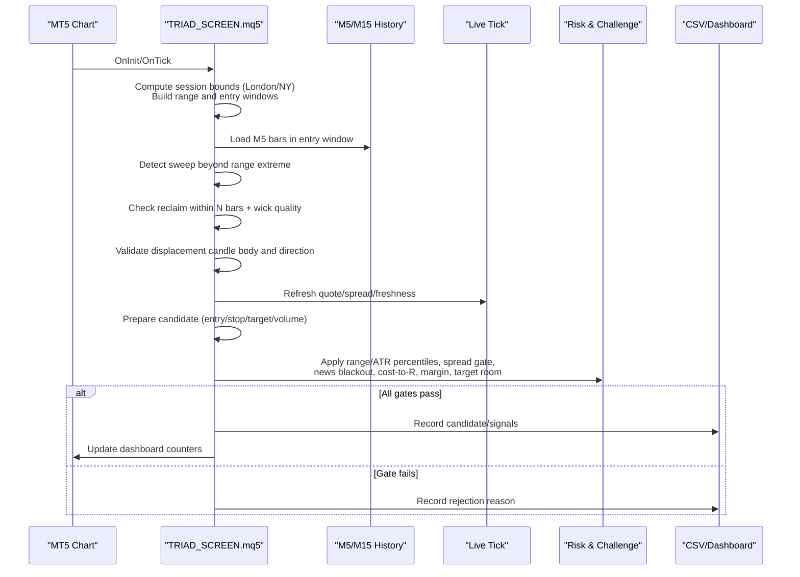
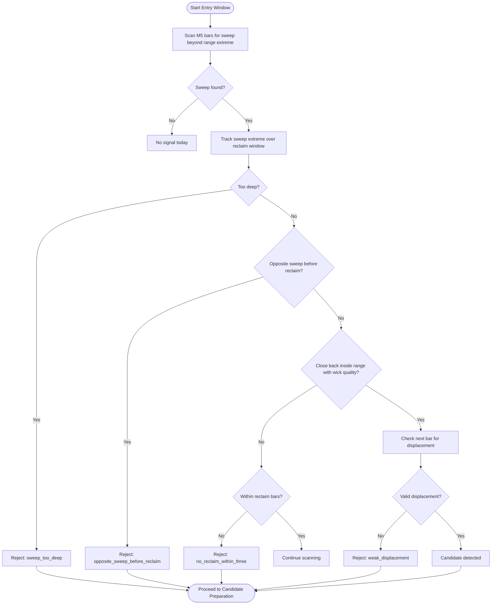
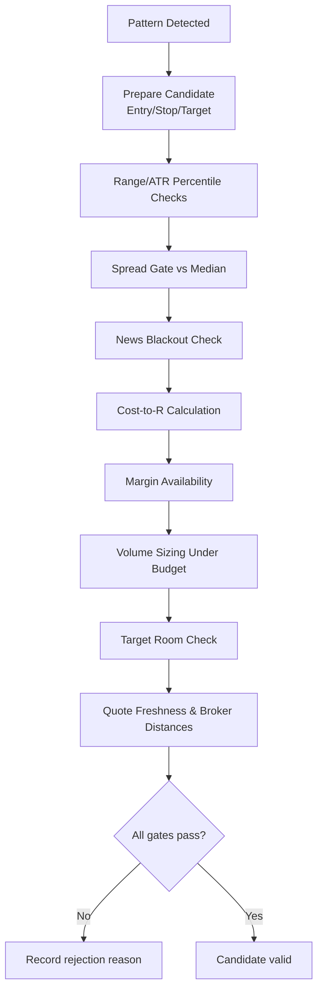
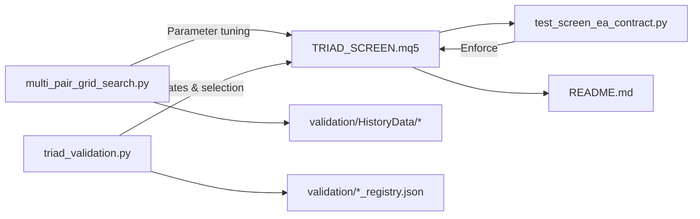
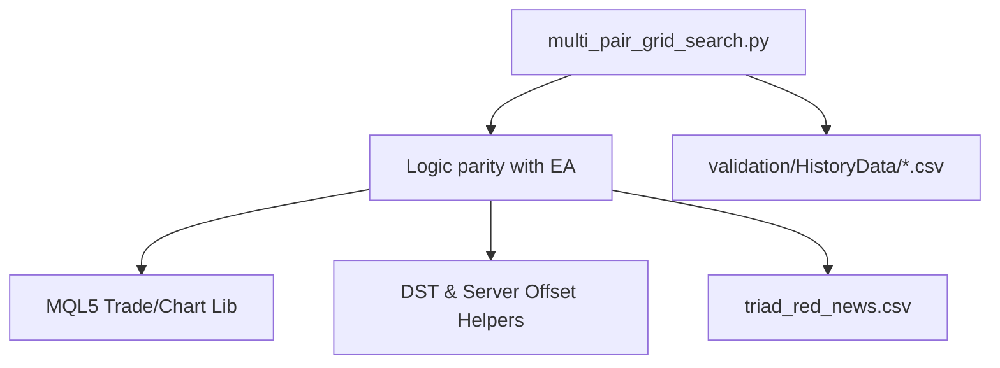

# Multi-Symbol Screening Engine

<cite>
**Referenced Files in This Document**
- [TRIAD_SCREEN.mq5](file://MQL5/Experts/TRIAD_SCREEN/TRIAD_SCREEN.mq5)
- [README.md](file://MQL5/Experts/TRIAD_SCREEN/README.md)
- [multi_pair_grid_search.py](file://tools/multi_pair_grid_search.py)
- [test_screen_ea_contract.py](file://tests/test_screen_ea_contract.py)
- [triad_validation.py](file://tools/triad_validation.py)
</cite>

## Table of Contents
1. [Introduction](#introduction)
2. [Project Structure](#project-structure)
3. [Core Components](#core-components)
4. [Architecture Overview](#architecture-overview)
5. [Detailed Component Analysis](#detailed-component-analysis)
6. [Dependency Analysis](#dependency-analysis)
7. [Performance Considerations](#performance-considerations)
8. [Troubleshooting Guide](#troubleshooting-guide)
9. [Conclusion](#conclusion)
10. [Appendices](#appendices)

## Introduction
This document explains the multi-symbol screening engine implemented by the TRIAD_SCREEN expert advisor (EA). It is a research and demo-screening tool that runs one symbol and one session window per MT5 demo account, detects sweep/reclaim patterns on M5 bars, evaluates candidates with strict risk and market-quality filters, and simulates a The5ers-style challenge rule set while providing an on-chart dashboard and CSV logs for review.

The supported symbol list includes EURUSD, GBPUSD, USDCHF, AUDUSD, USDCAD, NZDUSD, USDJPY, EURJPY, and GBPJPY. Each symbol can be screened in either the London or New York session window. The engine ports the canonical V2.1 entry rules so that a signal here corresponds to the same signal in the production EA.

## Project Structure
At a high level:
- The MQL5 EA implements the live screening logic, session bounds, pattern detection, candidate preparation, risk guards, and dashboard/logging.
- Python tools support parameter grid search and validation workflows that mirror the EA’s logic for offline analysis.
- Tests enforce contract stability (supported symbols, windows, defaults, and non-interference with the canonical EA).

**Diagram sources**
- [TRIAD_SCREEN.mq5:717-749](file://MQL5/Experts/TRIAD_SCREEN/TRIAD_SCREEN.mq5#L717-L749)
- [TRIAD_SCREEN.mq5:1290-1426](file://MQL5/Experts/TRIAD_SCREEN/TRIAD_SCREEN.mq5#L1290-L1426)
- [TRIAD_SCREEN.mq5:1640-1769](file://MQL5/Experts/TRIAD_SCREEN/TRIAD_SCREEN.mq5#L1640-L1769)
- [multi_pair_grid_search.py:183-265](file://tools/multi_pair_grid_search.py#L183-L265)

**Section sources**
- [TRIAD_SCREEN.mq5:1-156](file://MQL5/Experts/TRIAD_SCREEN/TRIAD_SCREEN.mq5#L1-L156)
- [README.md:12-58](file://MQL5/Experts/TRIAD_SCREEN/README.md#L12-L58)

## Core Components
- Supported symbols and sessions:
  - Symbols: EURUSD, GBPUSD, USDCHF, AUDUSD, USDCAD, NZDUSD, USDJPY, EURJPY, GBPJPY.
  - Sessions: London (range 00:00–07:00 local, entry 07:00–11:00), New York (reference range from previous London day 07:00–13:00 local, entry 08:30–11:00 NY local).
- Session management:
  - Computes UTC-aware London/New York windows using DST rules and server offset configuration.
  - Reads completed reference range only after it closes; prevents stale reconstruction when attached mid-session.
- Pattern detection:
  - Scans M5 bars within the entry window for a sweep beyond the reference range extreme, followed by a reclaim within a configurable bar count, then a displacement candle confirming direction.
- Candidate evaluation:
  - Entry at midpoint of displacement candle, stop beyond sweep extreme with buffer, target solving for desired net R, volume sizing under cash risk budget, spread/news/time filters, and broker distance checks.
- Risk and challenge simulation:
  - Tracks daily/weekly floors, drawdown shutdowns, qualifying days, phase targets, and inactivity rules.
- Dashboard and logging:
  - On-chart status labels and CSV journals summarizing signals, candidates, fills, rejects, and net-R ledger.

**Section sources**
- [TRIAD_SCREEN.mq5:77-80](file://MQL5/Experts/TRIAD_SCREEN/TRIAD_SCREEN.mq5#L77-L80)
- [TRIAD_SCREEN.mq5:717-749](file://MQL5/Experts/TRIAD_SCREEN/TRIAD_SCREEN.mq5#L717-L749)
- [TRIAD_SCREEN.mq5:1290-1426](file://MQL5/Experts/TRIAD_SCREEN/TRIAD_SCREEN.mq5#L1290-L1426)
- [TRIAD_SCREEN.mq5:1640-1769](file://MQL5/Experts/TRIAD_SCREEN/TRIAD_SCREEN.mq5#L1640-L1769)
- [TRIAD_SCREEN.mq5:1771-1865](file://MQL5/Experts/TRIAD_SCREEN/TRIAD_SCREEN.mq5#L1771-L1865)
- [README.md:12-58](file://MQL5/Experts/TRIAD_SCREEN/README.md#L12-L58)

## Architecture Overview
The screening process follows a deterministic pipeline per session:

**Diagram sources**
- [TRIAD_SCREEN.mq5:717-749](file://MQL5/Experts/TRIAD_SCREEN/TRIAD_SCREEN.mq5#L717-L749)
- [TRIAD_SCREEN.mq5:1290-1426](file://MQL5/Experts/TRIAD_SCREEN/TRIAD_SCREEN.mq5#L1290-L1426)
- [TRIAD_SCREEN.mq5:1608-1769](file://MQL5/Experts/TRIAD_SCREEN/TRIAD_SCREEN.mq5#L1608-L1769)

## Detailed Component Analysis

### Supported Symbol List and Session Windows
- The engine enforces a fixed universe of nine major pairs and two session windows. Any other symbol fails closed at initialization.
- Session windows are computed with DST-aware conversions between London and New York wall times and the configured server UTC offset.

Key behaviors:
- London: reference range 00:00–07:00 local; entry 07:00–11:00 local.
- New York: reference range from previous London day 07:00–13:00 local; entry 08:30–11:00 NY local.
- Range is read only after its closing time to avoid partial data and ensure consistency across sessions.

**Section sources**
- [TRIAD_SCREEN.mq5:77-80](file://MQL5/Experts/TRIAD_SCREEN/TRIAD_SCREEN.mq5#L77-L80)
- [TRIAD_SCREEN.mq5:717-749](file://MQL5/Experts/TRIAD_SCREEN/TRIAD_SCREEN.mq5#L717-L749)
- [test_screen_ea_contract.py:57-73](file://tests/test_screen_ea_contract.py#L57-L73)

### Signal Detection Algorithm: Sweep/Reclaim/Displacement
The algorithm scans M5 bars during the entry window:
1. Identify the first sweep beyond the reference range extreme measured in ATR units.
2. Track the sweep extreme through the reclaim window.
3. Reject if the sweep is too deep or if an opposite-side sweep occurs before reclaim.
4. Look for a reclaim candle that closes back inside the range with sufficient wick quality.
5. Require a subsequent displacement candle with a minimum body ratio and closing beyond the reclaim midpoint in the sweep direction.
6. If no reclaim occurs within the allowed bar count, mark a specific rejection; if displacement is missing or weak, mark appropriate rejections.

**Diagram sources**
- [TRIAD_SCREEN.mq5:1290-1426](file://MQL5/Experts/TRIAD_SCREEN/TRIAD_SCREEN.mq5#L1290-L1426)

**Section sources**
- [TRIAD_SCREEN.mq5:1290-1426](file://MQL5/Experts/TRIAD_SCREEN/TRIAD_SCREEN.mq5#L1290-L1426)

### Candidate Evaluation Criteria and Filtering Mechanisms
After a pattern is detected, the engine prepares a candidate with strict filters:
- Entry price: midpoint of the displacement candle, normalized to tick size.
- Stop price: beyond sweep extreme with ATR-based buffer; must fall within ATR-defined min/max band.
- Target price: solved to achieve desired net R after commissions and slippage reserves.
- Volume sizing: derived from cash risk budget based on profile and active drawdown adjustments; respects broker lot limits and step sizes.
- Market quality filters:
  - Spread gate vs median multiplier.
  - Comparable statistics: range percentile and ATR percentile thresholds over recent sessions.
  - News blackout windows around relevant currencies.
  - Cost-to-R limit including spread and slippage reserves.
  - Broker distances: stops/freezes levels respected.
  - Target room: target must fit within available liquidity relative to range.
- Quote freshness and validity checks before execution.

**Diagram sources**
- [TRIAD_SCREEN.mq5:1640-1769](file://MQL5/Experts/TRIAD_SCREEN/TRIAD_SCREEN.mq5#L1640-L1769)

**Section sources**
- [TRIAD_SCREEN.mq5:1640-1769](file://MQL5/Experts/TRIAD_SCREEN/TRIAD_SCREEN.mq5#L1640-L1769)

### Parameter Configuration Options
Key inputs include:
- Combo selection: symbol, session window, optional label, magic number, expected account currency, server UTC offset, quote age and deviation limits.
- Challenge presets: phase, initial balance, target percentages, qualifying days, daily/overall loss limits, inactivity days, phase reset behavior, dashboard confirmed days override.
- Risk profiles: base risk fraction and target R per profile; range/ATR percentile bands; comparable sessions count; time stop minutes; move stop to entry after 1R.
- Fixed geometry: sweep ATR bounds, reclaim bars and wick threshold, displacement body threshold, limit expiry bars, stop buffer and ATR bounds, max cost-to-R, spread median multiplier, commission per lot, slippage reserves, internal daily/weekly stops, drawdown reduce/shutdown thresholds, firm floor reserve, request caps and latency limits.
- News calendar: file path, requirement flag, block/flat minutes, rollover flat minutes, required coverage hours.
- Dashboard: visibility, refresh interval, status file prefix.

These parameters directly influence signal detection thresholds, candidate filtering, risk exposure, and operational safety.

**Section sources**
- [TRIAD_SCREEN.mq5:86-156](file://MQL5/Experts/TRIAD_SCREEN/TRIAD_SCREEN.mq5#L86-L156)
- [TRIAD_SCREEN.mq5:1771-1865](file://MQL5/Experts/TRIAD_SCREEN/TRIAD_SCREEN.mq5#L1771-L1865)

### Performance Optimization Techniques
- Completed-range-only reading: The reference range is loaded only after its closing time to avoid repeated partial reads and ensure stable boundaries.
- Mid-session attach handling: When attached inside the entry window, the engine consumes the session rather than reconstructing stale events, preventing false signals.
- Throttling and caps: Non-emergency request caps protect against excessive order calls; emergency cleanup bypasses these caps but uses per-ticket throttling.
- Efficient state persistence: Small CSV files store state and summaries; state is versioned and validated on load.
- Histogram-like percentile gating: Range and ATR percentiles reduce noise and improve robustness across regimes.
- Quote freshness checks: Prevents trading on stale quotes and avoids unnecessary computations when prices have moved.

**Section sources**
- [TRIAD_SCREEN.mq5:751-800](file://MQL5/Experts/TRIAD_SCREEN/TRIAD_SCREEN.mq5#L751-L800)
- [TRIAD_SCREEN.mq5:1608-1638](file://MQL5/Experts/TRIAD_SCREEN/TRIAD_SCREEN.mq5#L1608-L1638)
- [README.md:97-138](file://MQL5/Experts/TRIAD_SCREEN/README.md#L97-L138)

### Integration with Broader Research Workflow
- Offline parameter exploration: The Python grid search mirrors the EA’s sweep/reclaim/displacement logic to evaluate parameter combinations across historical ticks and report signal rates and rejection breakdowns.
- Validation and registries: Validation tools and registries define selection gates and ablation studies; the screen EA remains separate from the canonical production EA and registries, ensuring non-interference.
- Contract tests: Static tests enforce supported symbols, session windows, default safety settings, and dashboard presence, guarding against accidental drift.

**Diagram sources**
- [test_screen_ea_contract.py:57-73](file://tests/test_screen_ea_contract.py#L57-L73)
- [multi_pair_grid_search.py:183-265](file://tools/multi_pair_grid_search.py#L183-L265)
- [triad_validation.py:1530-1678](file://tools/triad_validation.py#L1530-L1678)

**Section sources**
- [multi_pair_grid_search.py:1-13](file://tools/multi_pair_grid_search.py#L1-L13)
- [test_screen_ea_contract.py:1-9](file://tests/test_screen_ea_contract.py#L1-L9)
- [triad_validation.py:1530-1678](file://tools/triad_validation.py#L1530-L1678)

## Dependency Analysis
- The EA depends on MQL5 standard libraries for trade operations and chart objects.
- It relies on accurate time conversion functions for London and New York DST transitions and server UTC offset configuration.
- CSV news calendar integration requires a properly formatted file; missing or stale calendars block entries.
- Python tools depend on historical tick files and implement consistent session bounds and signal detection for offline analysis.

**Diagram sources**
- [TRIAD_SCREEN.mq5:581-661](file://MQL5/Experts/TRIAD_SCREEN/TRIAD_SCREEN.mq5#L581-L661)
- [multi_pair_grid_search.py:121-131](file://tools/multi_pair_grid_search.py#L121-L131)

**Section sources**
- [TRIAD_SCREEN.mq5:581-661](file://MQL5/Experts/TRIAD_SCREEN/TRIAD_SCREEN.mq5#L581-L661)
- [multi_pair_grid_search.py:121-131](file://tools/multi_pair_grid_search.py#L121-L131)

## Performance Considerations
- Prefer running one combo per demo account to minimize overhead and simplify comparison.
- Keep the news calendar current; stale calendars cause unnecessary blocks.
- Use appropriate server UTC offset to avoid misaligned sessions.
- Tune range/ATR percentile bands to balance signal frequency and quality.
- Monitor dashboard metrics (signals, candidates, fills, rejects) to identify bottlenecks or overly restrictive filters.

[No sources needed since this section provides general guidance]

## Troubleshooting Guide
Common issues and resolutions:
- No signals:
  - Check range/ATR percentile thresholds; they may be too tight.
  - Verify news calendar coverage and ensure no red news blocks the entry window.
  - Confirm spread gate and cost-to-R limits are not rejecting candidates.
- Frequent rejects:
  - Review rejection reasons logged in CSV journal (e.g., “no_sweep_event”, “reclaim_wick”, “weak_displacement”).
  - Adjust reclaim wick threshold or sweep depth limits cautiously.
- Mid-session attach anomalies:
  - Ensure “skip fresh mid-session start” is enabled to consume the session without reconstructing stale events.
- Order submission disabled:
  - For dry runs, orders remain disabled; enable only on demo accounts for live testing.
- State mismatches:
  - If state file does not match combo or phase, consider allowing phase reset to start fresh.

**Section sources**
- [TRIAD_SCREEN.mq5:1290-1426](file://MQL5/Experts/TRIAD_SCREEN/TRIAD_SCREEN.mq5#L1290-L1426)
- [TRIAD_SCREEN.mq5:1640-1769](file://MQL5/Experts/TRIAD_SCREEN/TRIAD_SCREEN.mq5#L1640-L1769)
- [README.md:97-138](file://MQL5/Experts/TRIAD_SCREEN/README.md#L97-L138)

## Conclusion
The multi-symbol screening engine provides a robust, session-aware framework for detecting liquidity sweeps and reversals at London and New York opens. Its disciplined candidate evaluation, comprehensive risk guards, and integrated challenge simulation make it suitable for research and demo screening. Paired with offline parameter exploration and validation tools, it supports iterative refinement and safe experimentation before any production deployment.

[No sources needed since this section summarizes without analyzing specific files]

## Appendices

### Practical Setup Examples
- Choose a symbol and session:
  - Example: EURUSD with London window; set InpSymbol to EURUSD and InpWindow to TSC_WINDOW_LONDON.
- Configure challenge rules:
  - Set InpPhaseInitialBalance, InpPhase1TargetPercent, InpMinQualifyingDays, InpDailyLossPercent, InpOverallLossPercent, InpInactivityDays to match your agreement.
- Enable or disable order submission:
  - For dry runs, leave InpEnableOrderSubmission false; for demo testing, set true.
- Maintain news calendar:
  - Ensure triad_red_news.csv is up to date with UTC timestamps and RED/HIGH impact events.
- Interpret dashboard:
  - STATUS indicates ACTIVE, PASSED, TARGET_REACHED_DAYS_PENDING, or FAILED_* conditions.
  - ConfigHash records the exact setting fingerprint for reproducibility.
  - Ledger shows realized net-R from closed trades.

**Section sources**
- [README.md:59-96](file://MQL5/Experts/TRIAD_SCREEN/README.md#L59-L96)
- [TRIAD_SCREEN.mq5:86-156](file://MQL5/Experts/TRIAD_SCREEN/TRIAD_SCREEN.mq5#L86-L156)