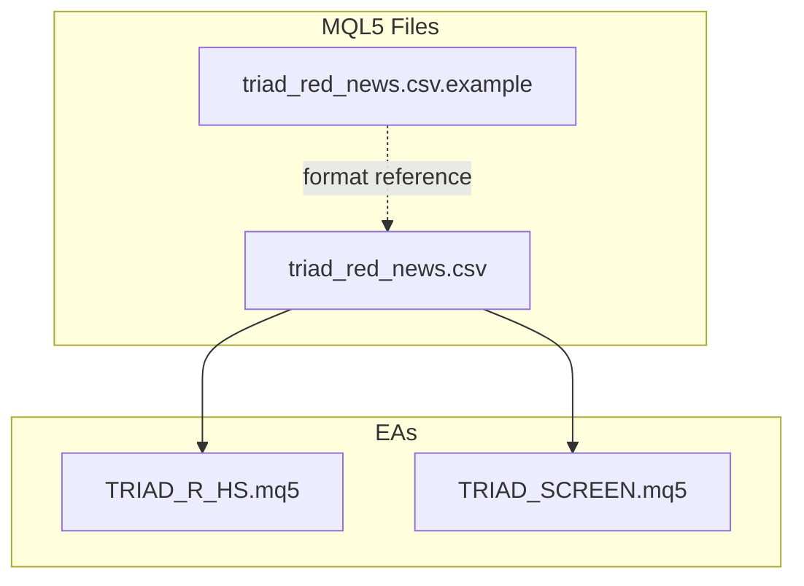
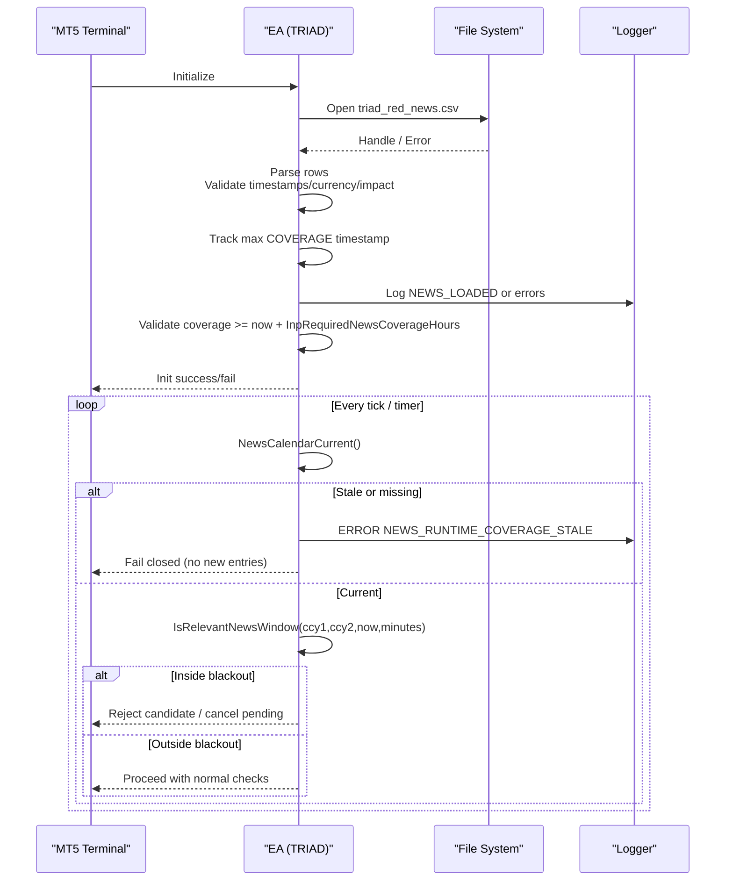
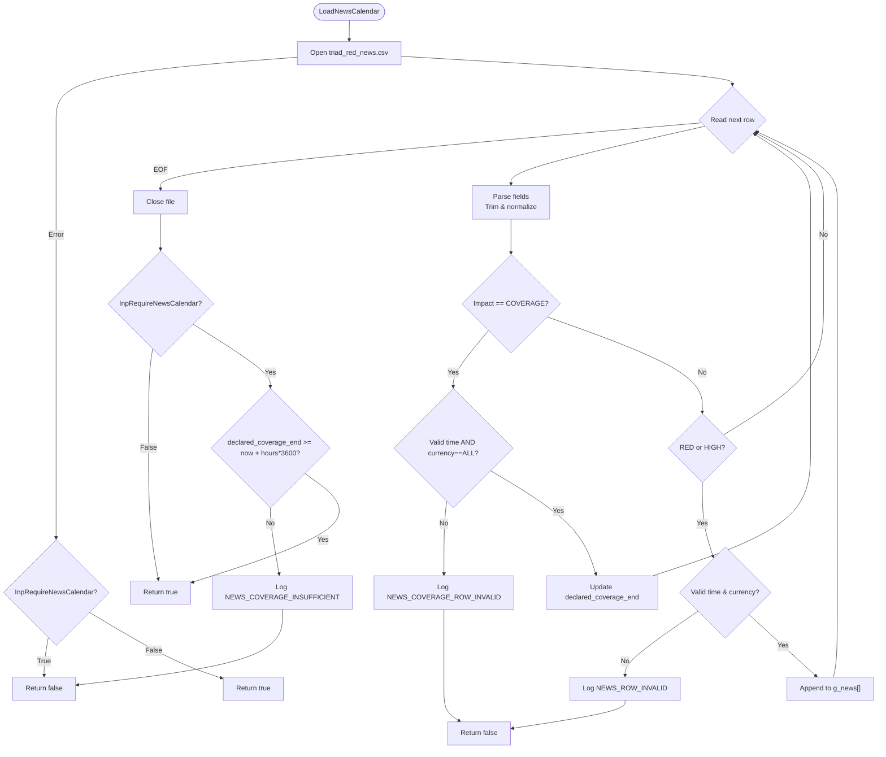
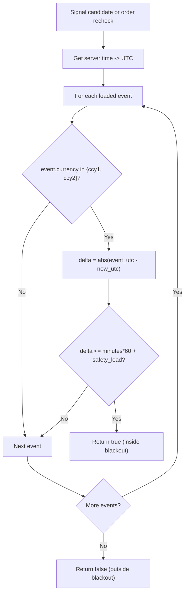
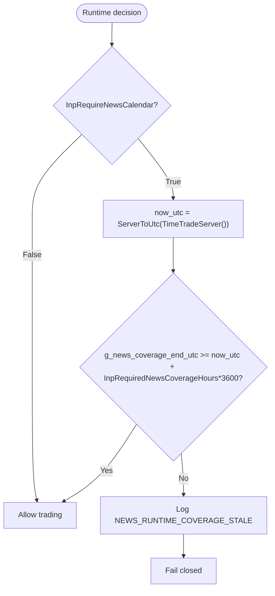
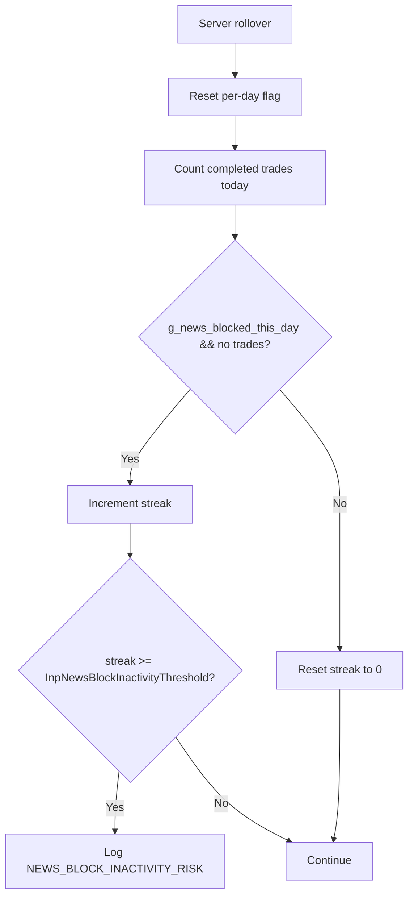
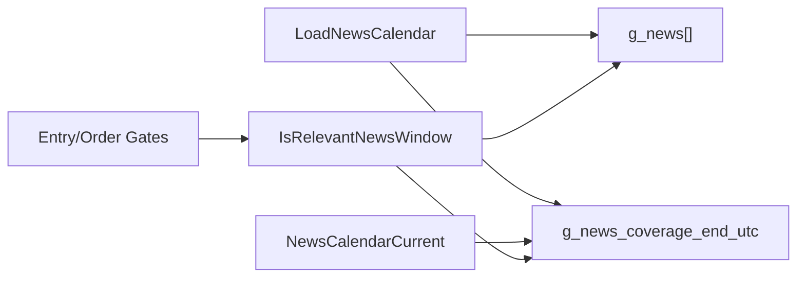

# News Calendar Integration

<cite>
**Referenced Files in This Document**
- [triad_red_news.csv.example](file://MQL5/Files/triad_red_news.csv.example)
- [TRIAD_R_HS.mq5](file://MQL5/Experts/TRIAD_R_HS/TRIAD_R_HS.mq5)
- [TRIAD_SCREEN.mq5](file://MQL5/Experts/TRIAD_SCREEN/TRIAD_SCREEN.mq5)
- [README.md (TRIAD_R_HS)](file://MQL5/Experts/TRIAD_R_HS/README.md)
</cite>

## Table of Contents
1. Introduction
2. Project Structure
3. Core Components
4. Architecture Overview
5. Detailed Component Analysis
6. Dependency Analysis
7. Performance Considerations
8. Troubleshooting Guide
9. Conclusion

## Introduction
This document explains the news calendar integration used by the TRIAD EAs to filter trading activity around high-impact economic events. It covers how the system parses triad_red_news.csv, calculates blackout windows before and after relevant events, validates that sufficient operator-verified news coverage exists, and enforces fail-closed behavior when the calendar is missing or stale. It also documents configuration options for news blocking parameters and validation rules.

## Project Structure
The news calendar feature is implemented identically in both EAs:
- TRIAD_R_HS.mq5: canonical research EA with full risk controls
- TRIAD_SCREEN.mq5: screen-only variant with matching news logic

Both EAs load a CSV named triad_red_news.csv from MQL5/Files and use it to block new entries and pending orders around relevant high-impact releases. A small example file demonstrates the required schema.

**Diagram sources**
- [triad_red_news.csv.example:1-7](file://MQL5/Files/triad_red_news.csv.example#L1-L7)
- [TRIAD_R_HS.mq5:80-85](file://MQL5/Experts/TRIAD_R_HS/TRIAD_R_HS.mq5#L80-L85)
- [TRIAD_SCREEN.mq5:145-150](file://MQL5/Experts/TRIAD_SCREEN/TRIAD_SCREEN.mq5#L145-L150)

**Section sources**
- [triad_red_news.csv.example:1-7](file://MQL5/Files/triad_red_news.csv.example#L1-L7)
- [TRIAD_R_HS.mq5:80-85](file://MQL5/Experts/TRIAD_R_HS/TRIAD_R_HS.mq5#L80-L85)
- [TRIAD_SCREEN.mq5:145-150](file://MQL5/Experts/TRIAD_SCREEN/TRIAD_SCREEN.mq5#L145-L150)
- [README.md (TRIAD_R_HS):27-49](file://MQL5/Experts/TRIAD_R_HS/README.md#L27-L49)

## Core Components
- CSV loader: reads triad_red_news.csv, validates rows, extracts high-impact events and an explicit COVERAGE declaration.
- Coverage validator: ensures the declared coverage extends at least InpRequiredNewsCoverageHours into the future; otherwise fails closed.
- Runtime checker: on every entry/order decision, verifies the calendar is still current.
- Blackout window detector: determines if current time falls within a configurable minutes-wide window around any relevant event for the pair’s currencies.
- Signal gating: rejects candidates and cancels pending orders inside blackout windows.
- Inactivity alerting: tracks consecutive days where valid signals were blocked exclusively by news and no trade completed, raising an error-level alert when a threshold is exceeded.

Key configuration inputs:
- InpNewsCsvFile: filename of the news calendar CSV
- InpRequireNewsCalendar: require calendar present and current
- InpRequiredNewsCoverageHours: minimum forward coverage required beyond current UTC
- InpNewsBlockMinutes: size of the blackout window around relevant events
- InpNewsFlatMinutes: flat buffer around rollover (separate from news)
- InpNewsBlockInactivityThreshold: consecutive news-blocked days without trades before alerting

**Section sources**
- [TRIAD_R_HS.mq5:80-85](file://MQL5/Experts/TRIAD_R_HS/TRIAD_R_HS.mq5#L80-L85)
- [TRIAD_SCREEN.mq5:145-150](file://MQL5/Experts/TRIAD_SCREEN/TRIAD_SCREEN.mq5#L145-L150)
- [TRIAD_R_HS.mq5:145-149](file://MQL5/Experts/TRIAD_R_HS/TRIAD_R_HS.mq5#L145-L149)
- [TRIAD_SCREEN.mq5:145-150](file://MQL5/Experts/TRIAD_SCREEN/TRIAD_SCREEN.mq5#L145-L150)

## Architecture Overview
The system follows a fail-closed design:
- On initialization, LoadNewsCalendar opens the CSV, validates each row, and records the latest COVERAGE timestamp.
- If InpRequireNewsCalendar is true and coverage is insufficient, initialization fails and no trading occurs.
- At runtime, NewsCalendarCurrent checks whether the calendar remains current relative to server time and the configured coverage horizon.
- Before any new entry or order submission, IsRelevantNewsWindow scans loaded events for the symbol’s base/profit currencies and returns true if within the blackout window plus a small safety lead.
- Candidates are rejected with rejection reason “news_blackout”; pending orders are deleted during rechecks.

**Diagram sources**
- [TRIAD_R_HS.mq5:836-918](file://MQL5/Experts/TRIAD_R_HS/TRIAD_R_HS.mq5#L836-L918)
- [TRIAD_R_HS.mq5:920-937](file://MQL5/Experts/TRIAD_R_HS/TRIAD_R_HS.mq5#L920-L937)
- [TRIAD_R_HS.mq5:939-954](file://MQL5/Experts/TRIAD_R_HS/TRIAD_R_HS.mq5#L939-L954)
- [TRIAD_SCREEN.mq5:847-929](file://MQL5/Experts/TRIAD_SCREEN/TRIAD_SCREEN.mq5#L847-L929)
- [TRIAD_SCREEN.mq5:931-948](file://MQL5/Experts/TRIAD_SCREEN/TRIAD_SCREEN.mq5#L931-L948)
- [TRIAD_SCREEN.mq5:950-956](file://MQL5/Experts/TRIAD_SCREEN/TRIAD_SCREEN.mq5#L950-L956)

## Detailed Component Analysis

### CSV Parsing and Validation
- Schema: utc_time,currency,impact,title
- Rows with impact RED or HIGH are loaded as events.
- A special ALL,COVERAGE row declares the operator-verified coverage-through time. Only this row proves completeness; far-future events do not imply intervening events exist.
- Time strings must match YYYY.MM.DD HH:MM exactly; currency must be a 3-letter uppercase code.
- Invalid rows cause immediate failure with specific error logs.

**Diagram sources**
- [TRIAD_R_HS.mq5:836-918](file://MQL5/Experts/TRIAD_R_HS/TRIAD_R_HS.mq5#L836-L918)
- [TRIAD_SCREEN.mq5:847-929](file://MQL5/Experts/TRIAD_SCREEN/TRIAD_SCREEN.mq5#L847-L929)

**Section sources**
- [TRIAD_R_HS.mq5:791-918](file://MQL5/Experts/TRIAD_R_HS/TRIAD_R_HS.mq5#L791-L918)
- [TRIAD_SCREEN.mq5:807-929](file://MQL5/Experts/TRIAD_SCREEN/TRIAD_SCREEN.mq5#L807-L929)
- [triad_red_news.csv.example:1-7](file://MQL5/Files/triad_red_news.csv.example#L1-L7)
- [README.md (TRIAD_R_HS):27-49](file://MQL5/Experts/TRIAD_R_HS/README.md#L27-L49)

### Blackout Period Calculation and Event Filtering
- Blackout window: centered around each relevant event for the symbol’s two currencies (base and profit). The window width is InpNewsBlockMinutes.
- Safety lead: a fixed small lead seconds margin is added to avoid timing edge cases due to timer cadence and latency.
- Relevance check: IsRelevantNewsWindow returns true if any event for ccy1 or ccy2 lies within ±window plus safety lead of current UTC time.
- Gating points:
  - Candidate preparation: if inside blackout, candidate is rejected with reason “news_blackout”.
  - Order recheck: pending orders are deleted if they would execute inside a blackout window.
  - Recent news guard: additional checks prevent opening positions immediately after relevant events.

**Diagram sources**
- [TRIAD_R_HS.mq5:939-954](file://MQL5/Experts/TRIAD_R_HS/TRIAD_R_HS.mq5#L939-L954)
- [TRIAD_SCREEN.mq5:950-956](file://MQL5/Experts/TRIAD_SCREEN/TRIAD_SCREEN.mq5#L950-L956)

**Section sources**
- [TRIAD_R_HS.mq5:939-954](file://MQL5/Experts/TRIAD_R_HS/TRIAD_R_HS.mq5#L939-L954)
- [TRIAD_SCREEN.mq5:950-956](file://MQL5/Experts/TRIAD_SCREEN/TRIAD_SCREEN.mq5#L950-L956)
- [TRIAD_R_HS.mq5:2428-2435](file://MQL5/Experts/TRIAD_R_HS/TRIAD_R_HS.mq5#L2428-L2435)
- [TRIAD_SCREEN.mq5:1689-1694](file://MQL5/Experts/TRIAD_SCREEN/TRIAD_SCREEN.mq5#L1689-L1694)

### News Coverage Validation and Fail-Closed Behavior
- Coverage requirement: the COVERAGE row must declare a timestamp at least InpRequiredNewsCoverageHours ahead of current UTC. Default is 24 hours.
- Initialization check: if coverage is insufficient, LoadNewsCalendar returns false (and fails init when InpRequireNewsCalendar is true).
- Runtime check: NewsCalendarCurrent continuously verifies coverage remains current; if stale, logs an error and prevents new entries.
- Zero-event days are allowed only if the COVERAGE row truthfully confirms no relevant events in the interval.

**Diagram sources**
- [TRIAD_R_HS.mq5:920-937](file://MQL5/Experts/TRIAD_R_HS/TRIAD_R_HS.mq5#L920-L937)
- [TRIAD_SCREEN.mq5:931-948](file://MQL5/Experts/TRIAD_SCREEN/TRIAD_SCREEN.mq5#L931-L948)

**Section sources**
- [TRIAD_R_HS.mq5:920-937](file://MQL5/Experts/TRIAD_R_HS/TRIAD_R_HS.mq5#L920-L937)
- [TRIAD_SCREEN.mq5:931-948](file://MQL5/Experts/TRIAD_SCREEN/TRIAD_SCREEN.mq5#L931-L948)
- [README.md (TRIAD_R_HS):27-49](file://MQL5/Experts/TRIAD_R_HS/README.md#L27-L49)

### Inactivity Alerting for News-Blocked Days
- Tracks days where a valid signal existed but was rejected exclusively due to news_blackout and no trade completed that day.
- Maintains a persistent streak counter across restarts.
- When the streak reaches InpNewsBlockInactivityThreshold, logs an ERROR-level alert to warn about potential inactivity breach risk.

**Diagram sources**
- [TRIAD_R_HS.mq5:3469-3490](file://MQL5/Experts/TRIAD_R_HS/TRIAD_R_HS.mq5#L3469-L3490)

**Section sources**
- [TRIAD_R_HS.mq5:3469-3490](file://MQL5/Experts/TRIAD_R_HS/TRIAD_R_HS.mq5#L3469-L3490)

## Dependency Analysis
- Both EAs depend on:
  - File I/O to read triad_red_news.csv
  - Time utilities to convert between server time and UTC
  - Logging infrastructure to emit structured events
- Coupling:
  - LoadNewsCalendar produces g_news[] and g_news_coverage_end_utc consumed by NewsCalendarCurrent and IsRelevantNewsWindow
  - IsRelevantNewsWindow is called from multiple gating points (candidate preparation, order recheck, recent-news guards)
- External dependencies:
  - Operator-provided triad_red_news.csv must be accurate and refreshed before coverage expires
  - Strategy Tester can package the default filename via #property tester_file

**Diagram sources**
- [TRIAD_R_HS.mq5:836-918](file://MQL5/Experts/TRIAD_R_HS/TRIAD_R_HS.mq5#L836-L918)
- [TRIAD_R_HS.mq5:920-954](file://MQL5/Experts/TRIAD_R_HS/TRIAD_R_HS.mq5#L920-L954)
- [TRIAD_SCREEN.mq5:847-929](file://MQL5/Experts/TRIAD_SCREEN/TRIAD_SCREEN.mq5#L847-L929)
- [TRIAD_SCREEN.mq5:931-956](file://MQL5/Experts/TRIAD_SCREEN/TRIAD_SCREEN.mq5#L931-L956)

**Section sources**
- [TRIAD_R_HS.mq5:836-954](file://MQL5/Experts/TRIAD_R_HS/TRIAD_R_HS.mq5#L836-L954)
- [TRIAD_SCREEN.mq5:847-956](file://MQL5/Experts/TRIAD_SCREEN/TRIAD_SCREEN.mq5#L847-L956)

## Performance Considerations
- Event scan cost: IsRelevantNewsWindow iterates over all loaded events per call. For typical calendars (tens to low hundreds), this is negligible.
- Safety lead reduces false negatives at the cost of slightly earlier blocking; ensure InpNewsBlockMinutes aligns with operational policy.
- Frequent calls occur at candidate preparation and order recheck; keep the event list minimal by excluding non-RED/HIGH rows during parsing.

[No sources needed since this section provides general guidance]

## Troubleshooting Guide
Common issues and their indicators:
- NEWS_FILE_OPEN: Unable to open triad_red_news.csv. Ensure the file exists in MQL5/Files and has correct permissions.
- NEWS_COVERAGE_ROW_INVALID: COVERAGE row malformed or currency not ALL. Fix the COVERAGE row to have a valid UTC timestamp and currency=ALL.
- NEWS_ROW_INVALID: Event row has invalid time or currency. Correct formatting to YYYY.MM.DD HH:MM and 3-letter uppercase currency.
- NEWS_COVERAGE_INSUFFICIENT: Declared coverage does not extend far enough into the future. Refresh the CSV so COVERAGE >= now + InpRequiredNewsCoverageHours.
- NEWS_RUNTIME_COVERAGE_STALE: Calendar became stale while running. Refresh the CSV promptly; the EA will fail closed until coverage is restored.
- NEWS_BLOCK_INACTIVITY_RISK: Consecutive days of news-blocked signals with no trades. Update the calendar or review strategy exposure to avoid inactivity breaches.

Operational tips:
- Always include an explicit ALL,COVERAGE row that you have independently verified.
- Keep triad_red_news.csv current; reload at server rollover or reattach the EA to refresh.
- Use InpRequireNewsCalendar=true in production to enforce fail-closed behavior.
- Tune InpNewsBlockMinutes to balance protection against slippage and opportunity loss.

**Section sources**
- [TRIAD_R_HS.mq5:836-918](file://MQL5/Experts/TRIAD_R_HS/TRIAD_R_HS.mq5#L836-L918)
- [TRIAD_R_HS.mq5:920-937](file://MQL5/Experts/TRIAD_R_HS/TRIAD_R_HS.mq5#L920-L937)
- [TRIAD_R_HS.mq5:3469-3490](file://MQL5/Experts/TRIAD_R_HS/TRIAD_R_HS.mq5#L3469-L3490)
- [TRIAD_SCREEN.mq5:847-929](file://MQL5/Experts/TRIAD_SCREEN/TRIAD_SCREEN.mq5#L847-L929)
- [TRIAD_SCREEN.mq5:931-948](file://MQL5/Experts/TRIAD_SCREEN/TRIAD_SCREEN.mq5#L931-L948)

## Conclusion
The news calendar integration provides robust, fail-closed protection around high-impact economic events. By requiring an operator-verified COVERAGE declaration, validating coverage continuously, and enforcing configurable blackout windows, the system minimizes execution risk during volatile releases. Proper maintenance of triad_red_news.csv and appropriate tuning of InpNewsBlockMinutes and InpRequiredNewsCoverageHours are essential to maintain safe and compliant operation.

[No sources needed since this section summarizes without analyzing specific files]