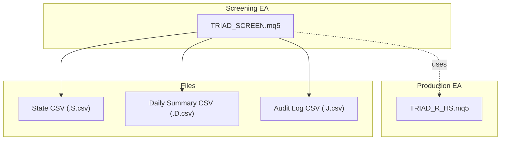
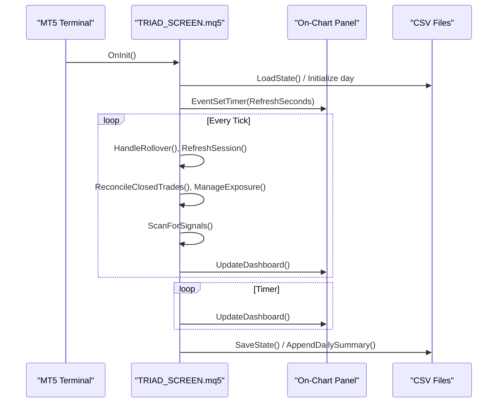
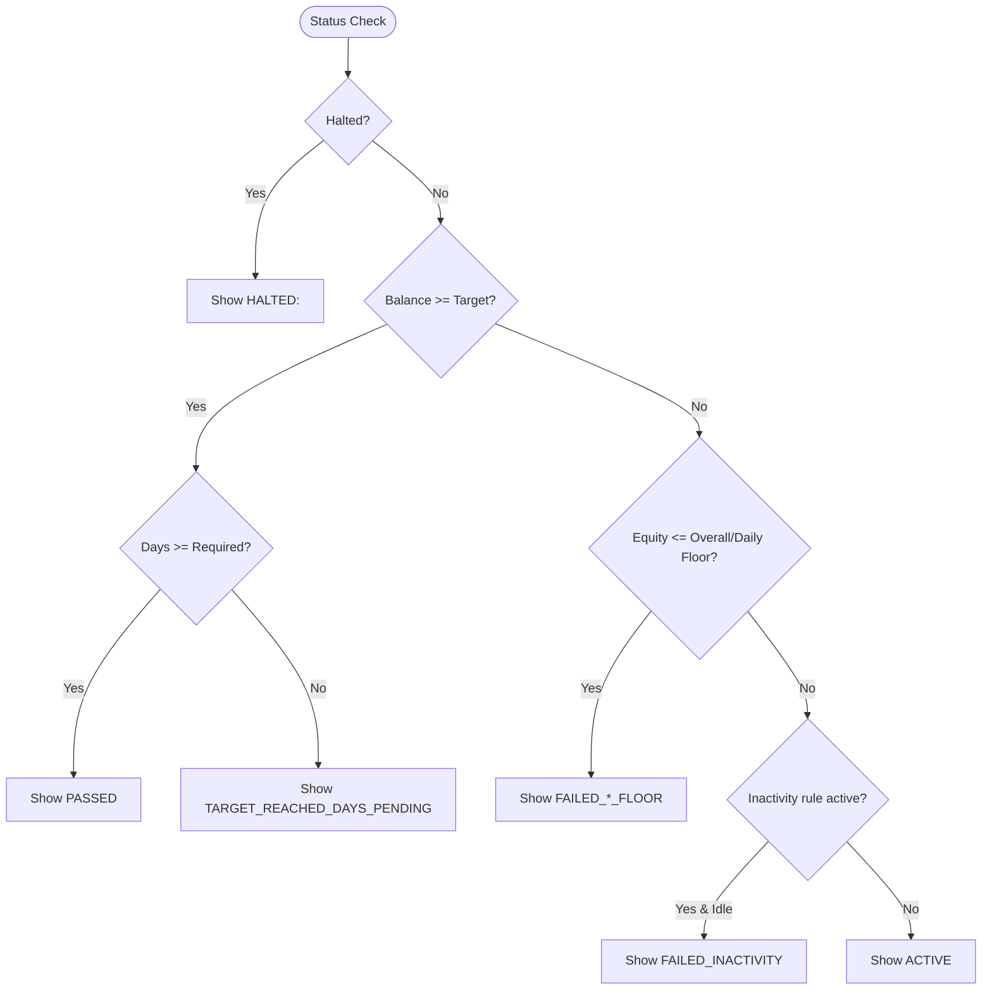
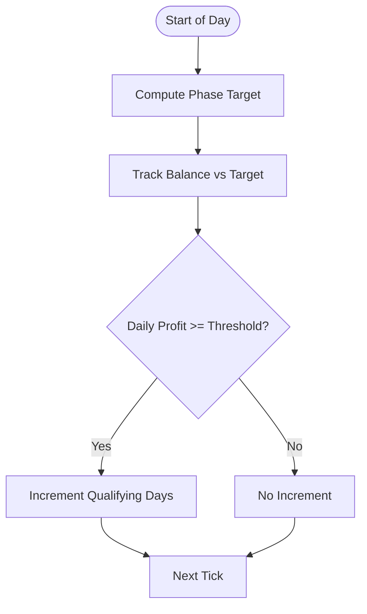
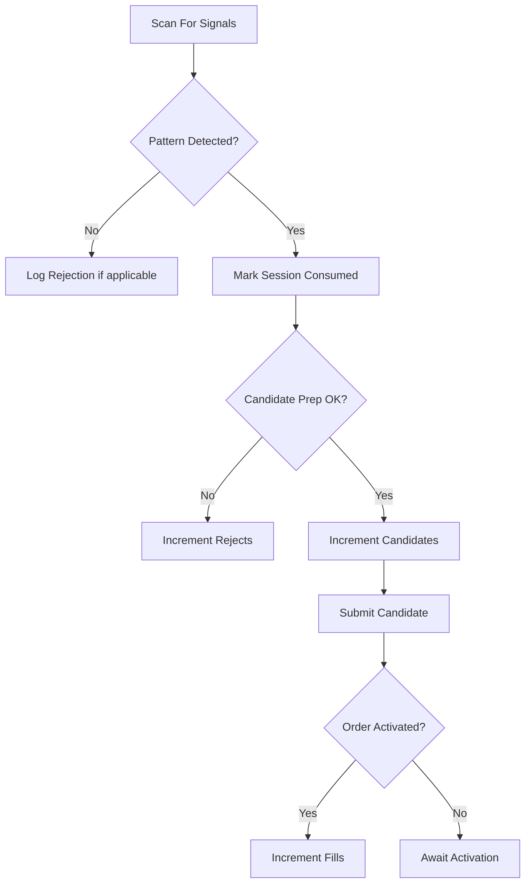
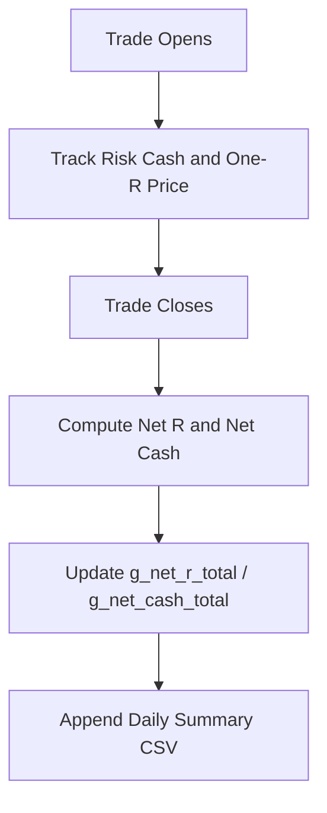
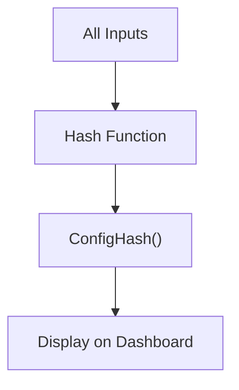
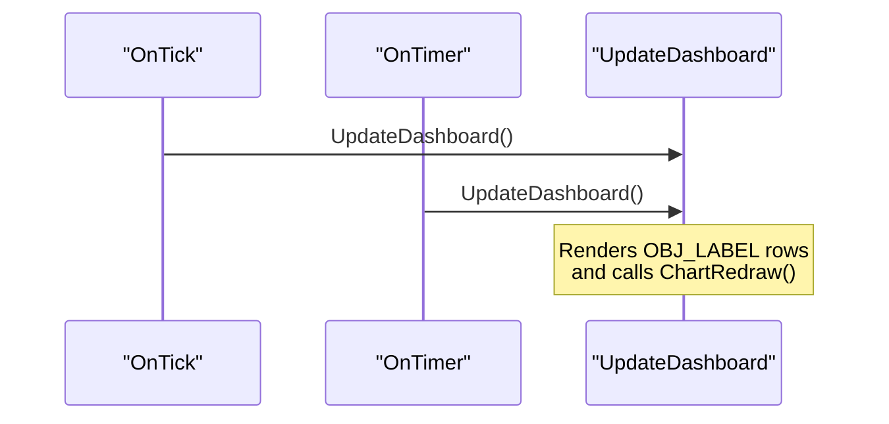
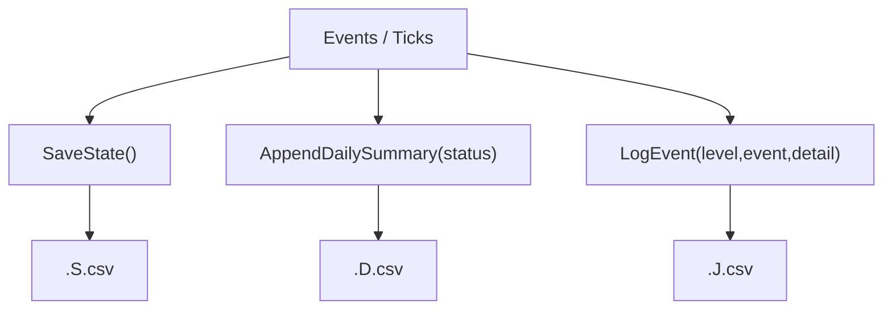
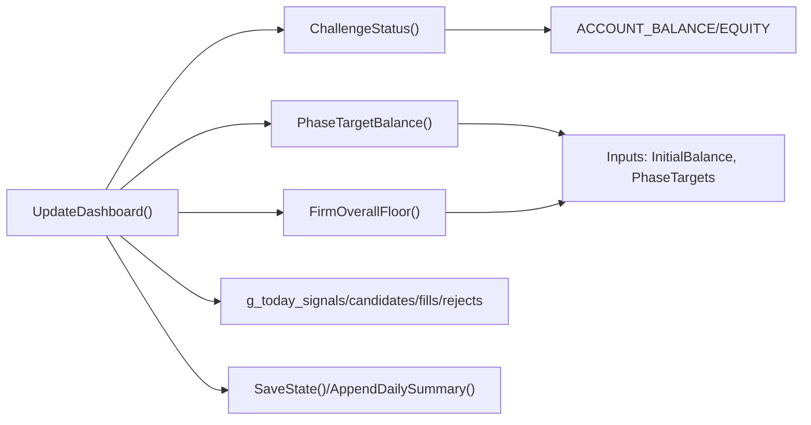

# On-Chart Dashboard and Monitoring

<cite>
**Referenced Files in This Document**
- [TRIAD_SCREEN.mq5](file://MQL5/Experts/TRIAD_SCREEN/TRIAD_SCREEN.mq5)
- [TRIAD_R_HS.mq5](file://MQL5/Experts/TRIAD_R_HS/TRIAD_R_HS.mq5)
- [README.md](file://MQL5/Experts/TRIAD_SCREEN/README.md)
- [test_screen_ea_contract.py](file://tests/test_screen_ea_contract.py)
</cite>

## Table of Contents
1. Introduction
2. Project Structure
3. Core Components
4. Architecture Overview
5. Detailed Component Analysis
6. Dependency Analysis
7. Performance Considerations
8. Troubleshooting Guide
9. Conclusion

## Introduction
This document explains the on-chart dashboard that provides real-time monitoring of screening operations for a single symbol/session combination. It focuses on how operators interpret challenge status, phase progress, qualifying days, daily metrics (signals/candidates/fills/rejects), net R calculations, and configuration fingerprint display. It also covers dashboard refresh mechanisms, status file generation, and how to use visual indicators to monitor screening performance and compliance with challenge rules.

## Project Structure
The on-chart dashboard is implemented in the screening Expert Advisor alongside its strategy logic and state persistence. The production EA contains shared challenge math used by the dashboard-facing logic.

**Diagram sources**
- [TRIAD_SCREEN.mq5:291-327](file://MQL5/Experts/TRIAD_SCREEN/TRIAD_SCREEN.mq5#L291-L327)
- [TRIAD_SCREEN.mq5:517-578](file://MQL5/Experts/TRIAD_SCREEN/TRIAD_SCREEN.mq5#L517-L578)
- [TRIAD_R_HS.mq5:1660-1683](file://MQL5/Experts/TRIAD_R_HS/TRIAD_R_HS.mq5#L1660-L1683)

**Section sources**
- [TRIAD_SCREEN.mq5:1-33](file://MQL5/Experts/TRIAD_SCREEN/TRIAD_SCREEN.mq5#L1-L33)
- [TRIAD_SCREEN.mq5:291-327](file://MQL5/Experts/TRIAD_SCREEN/TRIAD_SCREEN.mq5#L291-L327)
- [TRIAD_R_HS.mq5:1660-1683](file://MQL5/Experts/TRIAD_R_HS/TRIAD_R_HS.mq5#L1660-L1683)

## Core Components
- Challenge status machine: returns ACTIVE, PASSED, FAILED variants, or HALTED/DRY_RUN states based on account balance/equity, floors, and inactivity rules.
- Phase progress and qualifying days: computes percentage-to-target and tracks qualifying days; supports operator override via dashboard confirmed days.
- Daily metrics counters: signals, candidates, fills, rejects, last rejection reason, and open position details.
- Net R and cash totals: ledger-style tracking of net R and net cash for the session/day.
- Configuration fingerprint: deterministic hash of all behavior-affecting inputs displayed on the dashboard.
- Status files: persisted state CSV, daily summary CSV, and audit log CSV for post-run analysis.
- On-chart panel: terminal-local labels refreshed by timer and tick events.

**Section sources**
- [TRIAD_SCREEN.mq5:3089-3136](file://MQL5/Experts/TRIAD_SCREEN/TRIAD_SCREEN.mq5#L3089-L3136)
- [TRIAD_SCREEN.mq5:3237-3325](file://MQL5/Experts/TRIAD_SCREEN/TRIAD_SCREEN.mq5#L3237-L3325)
- [TRIAD_SCREEN.mq5:374-451](file://MQL5/Experts/TRIAD_SCREEN/TRIAD_SCREEN.mq5#L374-L451)
- [TRIAD_SCREEN.mq5:517-578](file://MQL5/Experts/TRIAD_SCREEN/TRIAD_SCREEN.mq5#L517-L578)

## Architecture Overview
The EA runs per symbol/session, scans for patterns, updates counters, persists state, and renders an on-chart dashboard. The dashboard reads live account data and computed metrics to show real-time status.

**Diagram sources**
- [TRIAD_SCREEN.mq5:3330-3443](file://MQL5/Experts/TRIAD_SCREEN/TRIAD_SCREEN.mq5#L3330-L3443)
- [TRIAD_SCREEN.mq5:3470-3508](file://MQL5/Experts/TRIAD_SCREEN/TRIAD_SCREEN.mq5#L3470-L3508)
- [TRIAD_SCREEN.mq5:517-578](file://MQL5/Experts/TRIAD_SCREEN/TRIAD_SCREEN.mq5#L517-L578)

## Detailed Component Analysis

### Challenge Status Display
- States shown: ACTIVE, PASSED, TARGET_REACHED_DAYS_PENDING, FAILED_OVERALL_FLOOR, FAILED_DAILY_FLOOR, FAILED_INACTIVITY, HALTED:<reason>, DRY_RUN variants when order submission is disabled.
- Logic:
  - If halted, returns HALTED with reason.
  - If balance meets phase target and qualifying days met, returns PASSED.
  - If equity breaches overall or daily floor, returns corresponding failure.
  - If configured inactivity window exceeded without activity, returns inactivity failure.
  - Otherwise ACTIVE.
- Visual indicator: color-coded status line on the dashboard (green for active/passing, red for failures, orange for halted/dry-run halted, silver for dry run).

**Diagram sources**
- [TRIAD_SCREEN.mq5:3089-3127](file://MQL5/Experts/TRIAD_SCREEN/TRIAD_SCREEN.mq5#L3089-L3127)
- [TRIAD_SCREEN.mq5:3247-3253](file://MQL5/Experts/TRIAD_SCREEN/TRIAD_SCREEN.mq5#L3247-L3253)

**Section sources**
- [TRIAD_SCREEN.mq5:3089-3127](file://MQL5/Experts/TRIAD_SCREEN/TRIAD_SCREEN.mq5#L3089-L3127)
- [TRIAD_SCREEN.mq5:3247-3253](file://MQL5/Experts/TRIAD_SCREEN/TRIAD_SCREEN.mq5#L3247-L3253)

### Phase Progress Tracking and Qualifying Days
- Phase target balance is derived from initial balance and phase-specific target percentages.
- Percent-to-target shows progress toward the phase goal.
- Qualifying days counter increments when daily profit threshold is achieved; effective confirmed days can be overridden by an operator input for testing or manual confirmation.

**Diagram sources**
- [TRIAD_SCREEN.mq5:1820-1830](file://MQL5/Experts/TRIAD_SCREEN/TRIAD_SCREEN.mq5#L1820-L1830)
- [TRIAD_SCREEN.mq5:3129-3136](file://MQL5/Experts/TRIAD_SCREEN/TRIAD_SCREEN.mq5#L3129-L3136)
- [TRIAD_SCREEN.mq5:1776-1778](file://MQL5/Experts/TRIAD_SCREEN/TRIAD_SCREEN.mq5#L1776-L1778)

**Section sources**
- [TRIAD_SCREEN.mq5:1820-1830](file://MQL5/Experts/TRIAD_SCREEN/TRIAD_SCREEN.mq5#L1820-L1830)
- [TRIAD_SCREEN.mq5:3129-3136](file://MQL5/Experts/TRIAD_SCREEN/TRIAD_SCREEN.mq5#L3129-L3136)
- [TRIAD_SCREEN.mq5:1776-1778](file://MQL5/Experts/TRIAD_SCREEN/TRIAD_SCREEN.mq5#L1776-L1778)

### Daily Metrics: Signals, Candidates, Fills, Rejects
- Signals: incremented when a pattern is detected in the entry window.
- Candidates: incremented after candidate preparation succeeds.
- Fills: incremented when an order becomes active and is tracked.
- Rejects: incremented when a pattern or candidate is rejected; last rejection reason is stored and shown.
- Open positions and pending entries are also counted and displayed.

**Diagram sources**
- [TRIAD_SCREEN.mq5:3141-3196](file://MQL5/Experts/TRIAD_SCREEN/TRIAD_SCREEN.mq5#L3141-L3196)
- [TRIAD_SCREEN.mq5:3288-3296](file://MQL5/Experts/TRIAD_SCREEN/TRIAD_SCREEN.mq5#L3288-L3296)

**Section sources**
- [TRIAD_SCREEN.mq5:3141-3196](file://MQL5/Experts/TRIAD_SCREEN/TRIAD_SCREEN.mq5#L3141-L3196)
- [TRIAD_SCREEN.mq5:3288-3296](file://MQL5/Experts/TRIAD_SCREEN/TRIAD_SCREEN.mq5#L3288-L3296)

### Net R Calculations and Ledger
- Net R total and net cash total are maintained across the session/day and reflected in the dashboard ledger line.
- These values are included in the daily summary CSV for post-run reconciliation.

**Diagram sources**
- [TRIAD_SCREEN.mq5:547-578](file://MQL5/Experts/TRIAD_SCREEN/TRIAD_SCREEN.mq5#L547-L578)
- [TRIAD_SCREEN.mq5:3295-3296](file://MQL5/Experts/TRIAD_SCREEN/TRIAD_SCREEN.mq5#L3295-L3296)

**Section sources**
- [TRIAD_SCREEN.mq5:547-578](file://MQL5/Experts/TRIAD_SCREEN/TRIAD_SCREEN.mq5#L547-L578)
- [TRIAD_SCREEN.mq5:3295-3296](file://MQL5/Experts/TRIAD_SCREEN/TRIAD_SCREEN.mq5#L3295-L3296)

### Configuration Fingerprint Display
- A deterministic hash is computed from all behavior-affecting inputs (symbol, window, profile, risk parameters, news settings, etc.).
- The hash is displayed on the dashboard header row to confirm the exact configuration being monitored.

**Diagram sources**
- [TRIAD_SCREEN.mq5:374-451](file://MQL5/Experts/TRIAD_SCREEN/TRIAD_SCREEN.mq5#L374-L451)
- [TRIAD_SCREEN.mq5:3260-3262](file://MQL5/Experts/TRIAD_SCREEN/TRIAD_SCREEN.mq5#L3260-L3262)

**Section sources**
- [TRIAD_SCREEN.mq5:374-451](file://MQL5/Experts/TRIAD_SCREEN/TRIAD_SCREEN.mq5#L374-L451)
- [TRIAD_SCREEN.mq5:3260-3262](file://MQL5/Experts/TRIAD_SCREEN/TRIAD_SCREEN.mq5#L3260-L3262)

### Dashboard Refresh Mechanisms
- The dashboard is rendered using terminal objects (labels) positioned in the chart’s top-left corner.
- Refresh triggers:
  - Tick event: OnTick calls UpdateDashboard after scanning and exposure management.
  - Timer event: OnTimer calls UpdateDashboard at a configurable interval (default seconds).
- When dashboard is disabled, objects are removed to avoid clutter.

**Diagram sources**
- [TRIAD_SCREEN.mq5:3206-3224](file://MQL5/Experts/TRIAD_SCREEN/TRIAD_SCREEN.mq5#L3206-L3224)
- [TRIAD_SCREEN.mq5:3237-3325](file://MQL5/Experts/TRIAD_SCREEN/TRIAD_SCREEN.mq5#L3237-L3325)
- [TRIAD_SCREEN.mq5:3439-3443](file://MQL5/Experts/TRIAD_SCREEN/TRIAD_SCREEN.mq5#L3439-L3443)
- [TRIAD_SCREEN.mq5:3470-3508](file://MQL5/Experts/TRIAD_SCREEN/TRIAD_SCREEN.mq5#L3470-L3508)

**Section sources**
- [TRIAD_SCREEN.mq5:3206-3224](file://MQL5/Experts/TRIAD_SCREEN/TRIAD_SCREEN.mq5#L3206-L3224)
- [TRIAD_SCREEN.mq5:3237-3325](file://MQL5/Experts/TRIAD_SCREEN/TRIAD_SCREEN.mq5#L3237-L3325)
- [TRIAD_SCREEN.mq5:3439-3443](file://MQL5/Experts/TRIAD_SCREEN/TRIAD_SCREEN.mq5#L3439-L3443)
- [TRIAD_SCREEN.mq5:3470-3508](file://MQL5/Experts/TRIAD_SCREEN/TRIAD_SCREEN.mq5#L3470-L3508)

### Status File Generation
- State file (.S.csv): persists day key, start times/balances/equity, week keys, qualifying days, creation time, last trade time, phase, halt flag/reason, request count, and combo identifier.
- Daily summary (.D.csv): appends one row per server day including balance, equity, phase, status, qualifying days, closed-net, signals/candidates/fills/rejects, last rejection, and net R total.
- Audit log (.J.csv): logs events with timestamp, level, event name, detail, balance, and equity.

**Diagram sources**
- [TRIAD_SCREEN.mq5:517-578](file://MQL5/Experts/TRIAD_SCREEN/TRIAD_SCREEN.mq5#L517-L578)
- [TRIAD_SCREEN.mq5:329-354](file://MQL5/Experts/TRIAD_SCREEN/TRIAD_SCREEN.mq5#L329-L354)

**Section sources**
- [TRIAD_SCREEN.mq5:517-578](file://MQL5/Experts/TRIAD_SCREEN/TRIAD_SCREEN.mq5#L517-L578)
- [TRIAD_SCREEN.mq5:329-354](file://MQL5/Experts/TRIAD_SCREEN/TRIAD_SCREEN.mq5#L329-L354)

### Operator Interpretation Guide
- STATUS line:
  - Green (ACTIVE/PASSED): healthy progression or completion.
  - Red (FAILED_*): breach of daily/overall floor or inactivity rule; immediate review required.
  - Orange (HALTED/DRY_RUN_HALTED): operational halt or dry-run halt; check logs and configuration.
  - Silver (DRY_RUN): orders disabled; simulation mode only.
- Phase and targets:
  - Progress percentage indicates distance to target; ensure it increases as expected.
  - Qualifying days must meet minimum before PASSED.
- Floors and reserves:
  - Daily and overall floors define hard limits; reserve cash adds buffer around worst-case slippage.
- Daily metrics:
  - Signals/Candidates/Fills/Rejects provide funnel visibility; high rejects may indicate market conditions or parameter tuning needs.
- Net R and cash:
  - Positive net R generally correlates with profitability; track trends over multiple days.
- News calendar:
  - Ensure coverage is valid; stale or missing calendar can block trading.

[No sources needed since this section summarizes interpretation guidance]

## Dependency Analysis
- The dashboard depends on:
  - Account info (balance/equity).
  - Challenge math functions (phase target, floors, reserves).
  - Session bounds and range readiness.
  - Pattern detection and candidate preparation.
  - File I/O for state and summaries.
- Shared challenge math is defined in the production EA but referenced conceptually by the screen EA’s status and thresholds.

**Diagram sources**
- [TRIAD_SCREEN.mq5:3237-3325](file://MQL5/Experts/TRIAD_SCREEN/TRIAD_SCREEN.mq5#L3237-L3325)
- [TRIAD_SCREEN.mq5:3089-3136](file://MQL5/Experts/TRIAD_SCREEN/TRIAD_SCREEN.mq5#L3089-L3136)
- [TRIAD_SCREEN.mq5:517-578](file://MQL5/Experts/TRIAD_SCREEN/TRIAD_SCREEN.mq5#L517-L578)

**Section sources**
- [TRIAD_SCREEN.mq5:3237-3325](file://MQL5/Experts/TRIAD_SCREEN/TRIAD_SCREEN.mq5#L3237-L3325)
- [TRIAD_SCREEN.mq5:3089-3136](file://MQL5/Experts/TRIAD_SCREEN/TRIAD_SCREEN.mq5#L3089-L3136)
- [TRIAD_SCREEN.mq5:517-578](file://MQL5/Experts/TRIAD_SCREEN/TRIAD_SCREEN.mq5#L517-L578)

## Performance Considerations
- Dashboard rendering uses lightweight label objects; keep refresh interval reasonable to avoid excessive redraws.
- File I/O occurs on rollover and periodically; ensure disk access is reliable.
- Avoid enabling order submission unless explicitly intended; dry-run mode reduces risk during testing.

[No sources needed since this section provides general guidance]

## Troubleshooting Guide
- No dashboard visible:
  - Confirm InpDashboardShow is true; otherwise objects are removed.
  - Verify timer is set; OnTimer should call UpdateDashboard.
- Status stuck on HALTED:
  - Check halt reason in logs; restart the EA after resolving the cause.
- FAILED statuses:
  - Review daily/overall floor breaches; adjust risk or stop-loss parameters.
  - Check inactivity rule if applicable.
- Low signals/candidates:
  - Validate range readiness and entry window timing; ensure news calendar coverage is valid.
- Mismatched config fingerprint:
  - Compare ConfigHash on dashboard with expected configuration; changes will alter the hash.

**Section sources**
- [TRIAD_SCREEN.mq5:3237-3325](file://MQL5/Experts/TRIAD_SCREEN/TRIAD_SCREEN.mq5#L3237-L3325)
- [TRIAD_SCREEN.mq5:3089-3127](file://MQL5/Experts/TRIAD_SCREEN/TRIAD_SCREEN.mq5#L3089-L3127)
- [TRIAD_SCREEN.mq5:374-451](file://MQL5/Experts/TRIAD_SCREEN/TRIAD_SCREEN.mq5#L374-L451)
- [README.md:97-113](file://MQL5/Experts/TRIAD_SCREEN/README.md#L97-L113)

## Conclusion
The on-chart dashboard provides a clear, real-time view of screening operations, challenge status, phase progress, qualifying days, daily metrics, net R, and configuration fingerprint. Operators can rely on color-coded status lines, numeric metrics, and persistent CSV files to monitor performance and compliance. Use the dashboard refresh mechanism and status files to validate behavior, troubleshoot issues, and ensure adherence to challenge rules.

[No sources needed since this section summarizes without analyzing specific files]