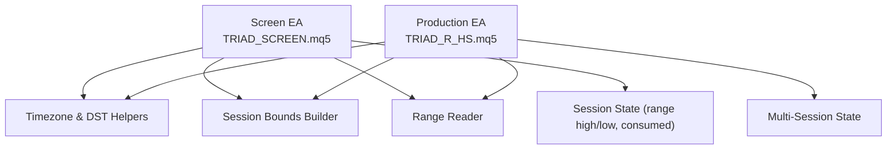
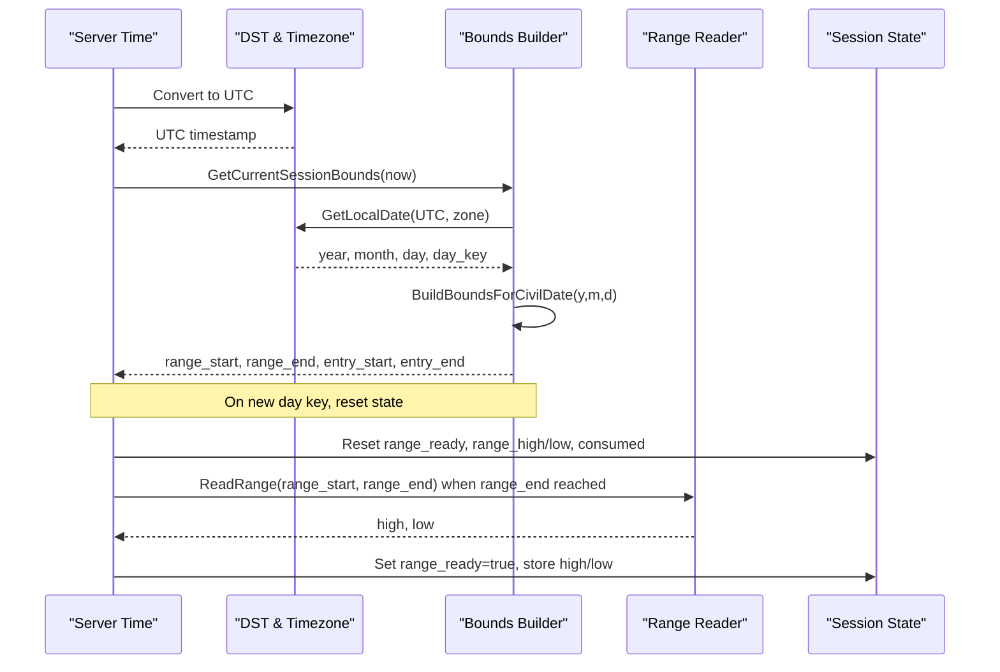
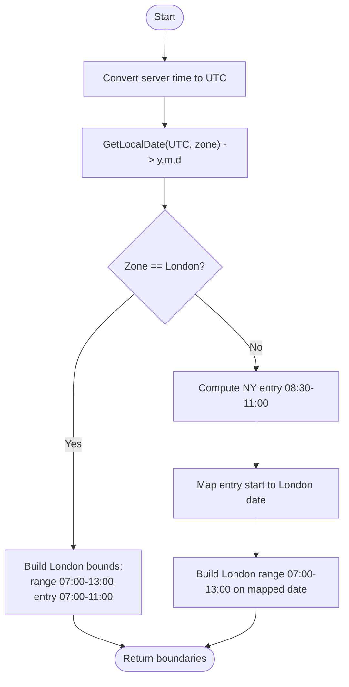
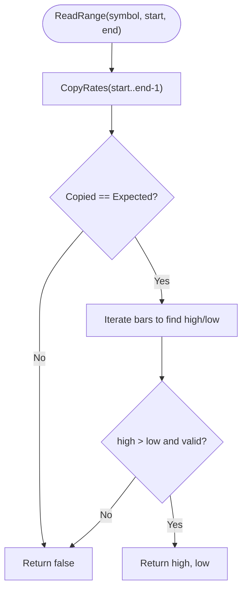
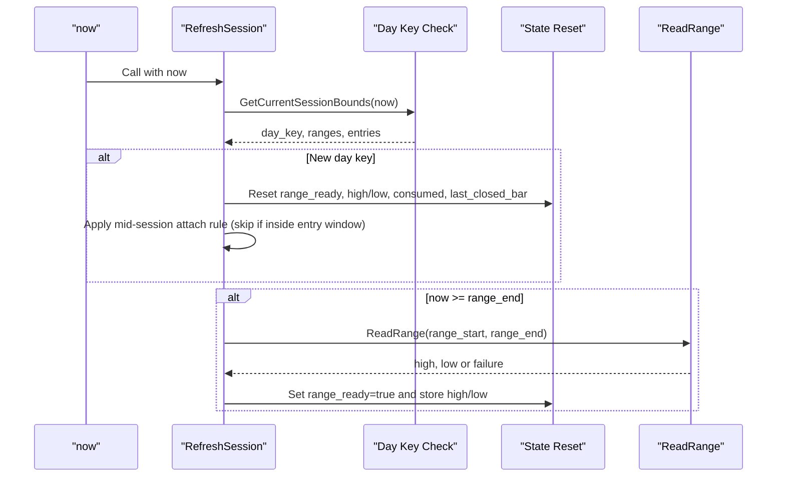
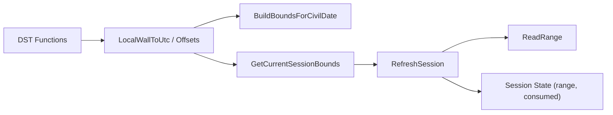

# Session Management and Time Handling

<cite>
**Referenced Files in This Document**
- [TRIAD_SCREEN.mq5](file://MQL5/Experts/TRIAD_SCREEN/TRIAD_SCREEN.mq5)
- [TRIAD_R_HS.mq5](file://MQL5/Experts/TRIAD_R_HS/TRIAD_R_HS.mq5)
- [test_reference.py](file://tests/test_reference.py)
</cite>

## Table of Contents
1. [Introduction](#introduction)
2. [Project Structure](#project-structure)
3. [Core Components](#core-components)
4. [Architecture Overview](#architecture-overview)
5. [Detailed Component Analysis](#detailed-component-analysis)
6. [Dependency Analysis](#dependency-analysis)
7. [Performance Considerations](#performance-considerations)
8. [Troubleshooting Guide](#troubleshooting-guide)
9. [Conclusion](#conclusion)

## Introduction
This document explains the session management system used by the screening engine to compute London and New York session boundaries, perform DST-aware timezone conversions, handle civil time correctly, and manage per-session state such as range highs/lows and consumption flags. It also documents how the system determines:
- Range periods (London 07:00–13:00 local time)
- Entry windows (London 07:00–11:00; New York 08:30–11:00)
- Day rollovers and session resets
- Session-specific variables like range high/low and consumed flags

The implementation is present in both the single-session screen EA and the multi-session production EA, with consistent logic for boundary calculation, DST handling, and state persistence.

## Project Structure
The relevant code lives in two MQL5 Expert Advisors:
- TRIAD_SCREEN.mq5: a single-symbol/session demo screener that mirrors the canonical strategy’s signal rules for one symbol+session at a time.
- TRIAD_R_HS.mq5: the canonical multi-session EA implementing the same session/timezone/state logic across multiple sessions.

Both files implement:
- DST-aware UTC offset functions for London and New York
- Civil-time helpers to convert between wall-clock times and UTC/server time
- Boundary builders for range and entry windows
- Session refresh and state reset on day rollover
- Range computation from historical bars
- Consumption flags to prevent replaying stale events mid-session

**Diagram sources**
- [TRIAD_SCREEN.mq5:621-749](file://MQL5/Experts/TRIAD_SCREEN/TRIAD_SCREEN.mq5#L621-L749)
- [TRIAD_R_HS.mq5:663-789](file://MQL5/Experts/TRIAD_R_HS/TRIAD_R_HS.mq5#L663-L789)

**Section sources**
- [TRIAD_SCREEN.mq5:39-156](file://MQL5/Experts/TRIAD_SCREEN/TRIAD_SCREEN.mq5#L39-L156)
- [TRIAD_R_HS.mq5:620-789](file://MQL5/Experts/TRIAD_R_HS/TRIAD_R_HS.mq5#L620-L789)

## Core Components
- DST-aware timezone conversion:
  - London UTC offset selection based on last Sunday in March and October
  - New York UTC offset selection based on second Sunday in March and first Sunday in November
  - Local wall-clock to UTC conversion with iterative offset correction
  - Server time conversion using configured UTC offset
- Session boundary calculation:
  - Build bounds for a given civil date and session kind
  - Derive range and entry windows in server time
  - Compute current session bounds from server time
- Session state management:
  - Per-day reset of range readiness, range high/low, and consumed flag
  - Mid-session attach protection to skip reconstructing stale events
  - Persistence of consumed state across restarts (production EA)
- Range computation:
  - Read exact high/low over a half-open interval using fixed bar counts
  - Validate completeness and continuity of bars

**Section sources**
- [TRIAD_SCREEN.mq5:621-749](file://MQL5/Experts/TRIAD_SCREEN/TRIAD_SCREEN.mq5#L621-L749)
- [TRIAD_SCREEN.mq5:751-806](file://MQL5/Experts/TRIAD_SCREEN/TRIAD_SCREEN.mq5#L751-L806)
- [TRIAD_R_HS.mq5:663-789](file://MQL5/Experts/TRIAD_R_HS/TRIAD_R_HS.mq5#L663-L789)
- [TRIAD_R_HS.mq5:1014-1033](file://MQL5/Experts/TRIAD_R_HS/TRIAD_R_HS.mq5#L1014-L1033)
- [TRIAD_R_HS.mq5:1867-1909](file://MQL5/Experts/TRIAD_R_HS/TRIAD_R_HS.mq5#L1867-L1909)

## Architecture Overview
The session management pipeline converts server time to UTC, determines the local civil date for the active window (London or New York), builds range and entry boundaries in server time, and then computes the reference range once the period has closed. The system persists and enforces session state to avoid reprocessing stale signals.

**Diagram sources**
- [TRIAD_SCREEN.mq5:741-749](file://MQL5/Experts/TRIAD_SCREEN/TRIAD_SCREEN.mq5#L741-L749)
- [TRIAD_SCREEN.mq5:717-739](file://MQL5/Experts/TRIAD_SCREEN/TRIAD_SCREEN.mq5#L717-L739)
- [TRIAD_SCREEN.mq5:751-806](file://MQL5/Experts/TRIAD_SCREEN/TRIAD_SCREEN.mq5#L751-L806)
- [TRIAD_R_HS.mq5:781-789](file://MQL5/Experts/TRIAD_R_HS/TRIAD_R_HS.mq5#L781-L789)
- [TRIAD_R_HS.mq5:754-779](file://MQL5/Experts/TRIAD_R_HS/TRIAD_R_HS.mq5#L754-L779)
- [TRIAD_R_HS.mq5:1014-1033](file://MQL5/Experts/TRIAD_R_HS/TRIAD_R_HS.mq5#L1014-L1033)

## Detailed Component Analysis

### DST-Aware Timezone Conversion
- London offset:
  - Standard time: UTC+0
  - Daylight saving: UTC+1 during last Sunday in March to last Sunday in October
- New York offset:
  - Standard time: UTC-5
  - Daylight saving: UTC-4 during second Sunday in March (02:00 EST) to first Sunday in November (02:00 EDT)
- LocalWallToUtc:
  - Converts wall-clock time to UTC using standard offset guess, then refines with DST lookup
  - Iterative correction ensures correctness around transition boundaries
- Server time conversion:
  - UtcToServer and ServerToUtc apply a configurable fixed offset to align with broker server time

Examples:
- During UK summer time, London 07:00 maps to an earlier UTC time than during winter time.
- New York entries are computed relative to NY local time but may span into London calendar dates due to overlap.

**Section sources**
- [TRIAD_SCREEN.mq5:621-651](file://MQL5/Experts/TRIAD_SCREEN/TRIAD_SCREEN.mq5#L621-L651)
- [TRIAD_R_HS.mq5:663-701](file://MQL5/Experts/TRIAD_R_HS/TRIAD_R_HS.mq5#L663-L701)
- [test_reference.py:145-156](file://tests/test_reference.py#L145-L156)

### Session Boundary Calculation
- Range periods:
  - London: 07:00–13:00 local time
  - New York: range derived from corresponding London date via entry start mapping
- Entry windows:
  - London: 07:00–11:00 local time
  - New York: 08:30–11:00 local time
- Boundary builder:
  - For London, sets range and entry directly from local times
  - For New York, computes entry window locally, then maps to London calendar date to set range boundaries
- Current session bounds:
  - Determines local date from UTC using session zone, then builds boundaries

**Diagram sources**
- [TRIAD_SCREEN.mq5:717-749](file://MQL5/Experts/TRIAD_SCREEN/TRIAD_SCREEN.mq5#L717-L749)
- [TRIAD_R_HS.mq5:754-789](file://MQL5/Experts/TRIAD_R_HS/TRIAD_R_HS.mq5#L754-L789)

**Section sources**
- [TRIAD_SCREEN.mq5:717-749](file://MQL5/Experts/TRIAD_SCREEN/TRIAD_SCREEN.mq5#L717-L749)
- [TRIAD_R_HS.mq5:754-789](file://MQL5/Experts/TRIAD_R_HS/TRIAD_R_HS.mq5#L754-L789)

### Range Computation and Validation
- ReadRange:
  - Copies M5 bars from start_time to end_time-1 (half-open interval)
  - Validates expected bar count and continuity
  - Computes high and low across the interval
- Usage:
  - Called after range_end is reached to finalize the authoritative range
  - Used repeatedly for comparable statistics across historical sessions

**Diagram sources**
- [TRIAD_R_HS.mq5:1014-1033](file://MQL5/Experts/TRIAD_R_HS/TRIAD_R_HS.mq5#L1014-L1033)

**Section sources**
- [TRIAD_R_HS.mq5:1014-1033](file://MQL5/Experts/TRIAD_R_HS/TRIAD_R_HS.mq5#L1014-L1033)

### Session State Management and Day Rollover
- Per-session fields:
  - range_start, range_end, entry_start, entry_end
  - range_ready, range_high, range_low
  - consumed flag to prevent replaying stale events
  - last_closed_bar to track progress through session bars
- RefreshSession:
  - On new day key, resets range_ready, warnings, consumed, last_closed_bar, and clears range high/low
  - Applies mid-session attach rule: if attached inside entry window after initial bar, mark consumed to avoid stale reconstruction
  - After range_end, attempts to read range; marks ready on success
- Production EA persistence:
  - Consumed state persisted to global variables keyed by session index and day key
  - Restored on startup to maintain semantics across restarts

**Diagram sources**
- [TRIAD_SCREEN.mq5:751-806](file://MQL5/Experts/TRIAD_SCREEN/TRIAD_SCREEN.mq5#L751-L806)
- [TRIAD_R_HS.mq5:1867-1909](file://MQL5/Experts/TRIAD_R_HS/TRIAD_R_HS.mq5#L1867-L1909)
- [TRIAD_R_HS.mq5:1852-1865](file://MQL5/Experts/TRIAD_R_HS/TRIAD_R_HS.mq5#L1852-L1865)

**Section sources**
- [TRIAD_SCREEN.mq5:229-264](file://MQL5/Experts/TRIAD_SCREEN/TRIAD_SCREEN.mq5#L229-L264)
- [TRIAD_SCREEN.mq5:751-806](file://MQL5/Experts/TRIAD_SCREEN/TRIAD_SCREEN.mq5#L751-L806)
- [TRIAD_R_HS.mq5:1852-1909](file://MQL5/Experts/TRIAD_R_HS/TRIAD_R_HS.mq5#L1852-L1909)

### Examples of Session Boundary Detection and Timezone Conversion
- London session on a non-DST day:
  - Range: 07:00–13:00 London local time
  - Entry: 07:00–11:00 London local time
  - Boundaries computed via LocalWallToUtc with London offset (0 or +1 depending on DST)
- New York session crossing into London date:
  - Entry: 08:30–11:00 New York local time
  - Range: mapped to corresponding London date (07:00–13:00 London)
  - Uses GetLocalDate(entry_start_utc, SESSION_LONDON) to determine London calendar date
- DST transitions:
  - London offset switches at last Sunday in March/October
  - New York offset switches at second Sunday in March and first Sunday in November
  - LocalWallToUtc iteratively corrects offsets to ensure accurate UTC conversion

**Section sources**
- [TRIAD_SCREEN.mq5:621-749](file://MQL5/Experts/TRIAD_SCREEN/TRIAD_SCREEN.mq5#L621-L749)
- [TRIAD_R_HS.mq5:663-789](file://MQL5/Experts/TRIAD_R_HS/TRIAD_R_HS.mq5#L663-L789)
- [test_reference.py:145-156](file://tests/test_reference.py#L145-L156)

## Dependency Analysis
Key dependencies and relationships:
- Timezone helpers depend on DST boundary functions (LastSundayUtc, NthSundayUtc)
- Boundary builder depends on timezone helpers and server time conversion
- RefreshSession depends on boundary builder and range reader
- Range reader depends on historical data availability and bar continuity checks
- Session state depends on day key changes and persistence mechanisms (production EA)

**Diagram sources**
- [TRIAD_SCREEN.mq5:621-749](file://MQL5/Experts/TRIAD_SCREEN/TRIAD_SCREEN.mq5#L621-L749)
- [TRIAD_R_HS.mq5:663-789](file://MQL5/Experts/TRIAD_R_HS/TRIAD_R_HS.mq5#L663-L789)
- [TRIAD_R_HS.mq5:1014-1033](file://MQL5/Experts/TRIAD_R_HS/TRIAD_R_HS.mq5#L1014-L1033)
- [TRIAD_R_HS.mq5:1867-1909](file://MQL5/Experts/TRIAD_R_HS/TRIAD_R_HS.mq5#L1867-L1909)

**Section sources**
- [TRIAD_SCREEN.mq5:621-806](file://MQL5/Experts/TRIAD_SCREEN/TRIAD_SCREEN.mq5#L621-L806)
- [TRIAD_R_HS.mq5:663-1033](file://MQL5/Experts/TRIAD_R_HS/TRIAD_R_HS.mq5#L663-L1033)
- [TRIAD_R_HS.mq5:1867-1909](file://MQL5/Experts/TRIAD_R_HS/TRIAD_R_HS.mq5#L1867-L1909)

## Performance Considerations
- Range reading uses fixed M5 bars and validates expected counts to avoid partial or inconsistent data access
- Range computation is performed only after range_end to minimize redundant work
- Comparable statistics loop limits attempts to avoid excessive history scans
- News calendar and spread lookups are minute-matched to reduce noise and improve accuracy

[No sources needed since this section provides general guidance]

## Troubleshooting Guide
Common issues and diagnostics:
- Range unavailable:
  - Occurs when required bars are missing or incomplete; logged with window and timestamps
  - Ensure sufficient history and continuous M5 data for the range interval
- Session not ready:
  - If range_end has not been reached, range_ready remains false; wait until range closes
- Mid-session attach skipped:
  - When attaching inside entry window after initial bar, session is marked consumed to prevent stale event reconstruction
- Day rollover incidents:
  - Server day regression or missed rollover exposure can halt processing; verify server time consistency and history availability

**Section sources**
- [TRIAD_SCREEN.mq5:782-806](file://MQL5/Experts/TRIAD_SCREEN/TRIAD_SCREEN.mq5#L782-L806)
- [TRIAD_R_HS.mq5:1897-1909](file://MQL5/Experts/TRIAD_R_HS/TRIAD_R_HS.mq5#L1897-L1909)

## Conclusion
The session management system implements robust, DST-aware timezone conversions and precise boundary calculations for London and New York sessions. It ensures reliable range computation, prevents stale signal reconstruction, and manages per-session state across day rollovers. The design supports both single-session screening and multi-session production use cases with consistent behavior and strong safeguards against data and timing inconsistencies.

[No sources needed since this section summarizes without analyzing specific files]