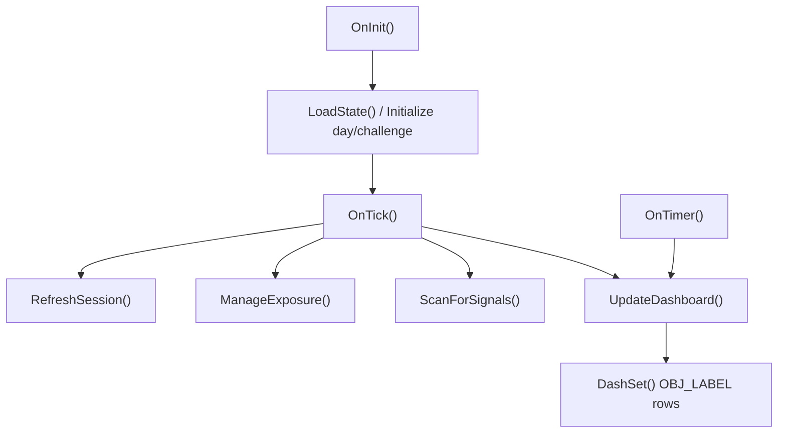
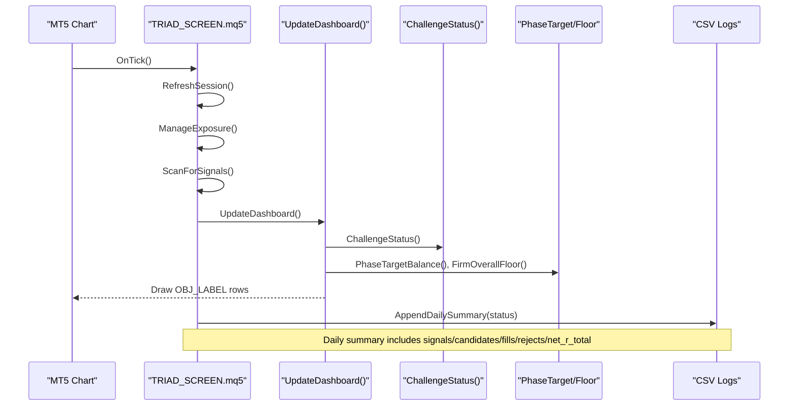
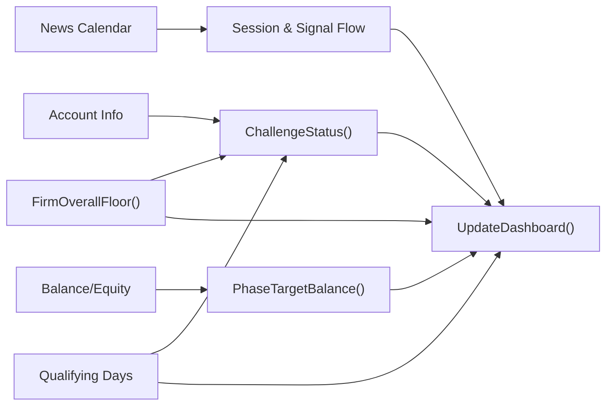

# On-Chart Dashboard Interface

<cite>
**Referenced Files in This Document**
- [TRIAD_SCREEN.mq5](file://MQL5/Experts/TRIAD_SCREEN/TRIAD_SCREEN.mq5)
- [README.md](file://MQL5/Experts/TRIAD_SCREEN/README.md)
</cite>

## Table of Contents
1. [Introduction](#introduction)
2. [Project Structure](#project-structure)
3. [Core Components](#core-components)
4. [Architecture Overview](#architecture-overview)
5. [Detailed Component Analysis](#detailed-component-analysis)
6. [Dependency Analysis](#dependency-analysis)
7. [Performance Considerations](#performance-considerations)
8. [Troubleshooting Guide](#troubleshooting-guide)
9. [Conclusion](#conclusion)
10. [Appendices](#appendices)

## Introduction
This document explains the TRIAD_SCREEN on-chart dashboard interface used to monitor a single symbol/session combination on a demo account. It focuses on interpreting visual components such as challenge status indicators (ACTIVE, PASSED, FAILED, DRY_RUN), phase progress tracking, qualifying days counter, daily and overall floor distances, today’s signals/candidates/fills/rejects statistics, total net R calculations, and the EA setting fingerprint display. It also covers how to customize display settings via input parameters and how to use real-time monitoring for strategy validation.

## Project Structure
The dashboard is implemented within a single MQL5 Expert Advisor file that:
- Computes challenge state and risk metrics
- Draws labeled text objects on the chart
- Updates labels at tick and timer intervals
- Persists state and writes CSV logs for review

**Diagram sources**
- [TRIAD_SCREEN.mq5:3330-3443](file://MQL5/Experts/TRIAD_SCREEN/TRIAD_SCREEN.mq5#L3330-L3443)
- [TRIAD_SCREEN.mq5:3470-3509](file://MQL5/Experts/TRIAD_SCREEN/TRIAD_SCREEN.mq5#L3470-L3509)
- [TRIAD_SCREEN.mq5:3237-3325](file://MQL5/Experts/TRIAD_SCREEN/TRIAD_SCREEN.mq5#L3237-L3325)

**Section sources**
- [TRIAD_SCREEN.mq5:3330-3443](file://MQL5/Experts/TRIAD_SCREEN/TRIAD_SCREEN.mq5#L3330-L3443)
- [TRIAD_SCREEN.mq5:3470-3509](file://MQL5/Experts/TRIAD_SCREEN/TRIAD_SCREEN.mq5#L3470-L3509)
- [TRIAD_SCREEN.mq5:3237-3325](file://MQL5/Experts/TRIAD_SCREEN/TRIAD_SCREEN.mq5#L3237-L3325)

## Core Components
- Challenge status machine: determines ACTIVE, PASSED, TARGET_REACHED_DAYS_PENDING, FAILED_OVERALL_FLOOR, FAILED_DAILY_FLOOR, FAILED_INACTIVITY, or HALTED states based on balance/equity thresholds and activity rules.
- Phase target and floors: computes phase target balance, overall floor, and daily floor with reserves.
- Qualifying days: counts profitable days against a threshold derived from initial balance and configured percentage.
- Today’s counters: tracks signals, candidates, fills, rejects, and last rejection reason per server day.
- Net R ledger: accumulates realized net R and net cash from closed trades recorded by this EA run.
- Dashboard UI: draws labeled rows showing status, phase info, progress, floors, session bounds, exposure, news calendar, profile/risk settings, and configuration hash.

**Section sources**
- [TRIAD_SCREEN.mq5:3089-3121](file://MQL5/Experts/TRIAD_SCREEN/TRIAD_SCREEN.mq5#L3089-L3121)
- [TRIAD_SCREEN.mq5:1820-1836](file://MQL5/Experts/TRIAD_SCREEN/TRIAD_SCREEN.mq5#L1820-L1836)
- [TRIAD_SCREEN.mq5:2992-3084](file://MQL5/Experts/TRIAD_SCREEN/TRIAD_SCREEN.mq5#L2992-L3084)
- [TRIAD_SCREEN.mq5:3237-3325](file://MQL5/Experts/TRIAD_SCREEN/TRIAD_SCREEN.mq5#L3237-L3325)

## Architecture Overview
The dashboard updates are driven by two triggers:
- OnTick: refreshes session, manages exposure, scans for signals, then updates the dashboard.
- Timer: periodically redraws the dashboard at a configurable interval.

**Diagram sources**
- [TRIAD_SCREEN.mq5:3470-3509](file://MQL5/Experts/TRIAD_SCREEN/TRIAD_SCREEN.mq5#L3470-L3509)
- [TRIAD_SCREEN.mq5:3237-3325](file://MQL5/Experts/TRIAD_SCREEN/TRIAD_SCREEN.mq5#L3237-L3325)
- [TRIAD_SCREEN.mq5:3089-3121](file://MQL5/Experts/TRIAD_SCREEN/TRIAD_SCREEN.mq5#L3089-L3121)
- [TRIAD_SCREEN.mq5:547-578](file://MQL5/Experts/TRIAD_SCREEN/TRIAD_SCREEN.mq5#L547-L578)

## Detailed Component Analysis

### Challenge Status Indicators
- ACTIVE: Within all rules; not halted; not passed yet.
- PASSED: Balance meets phase target AND qualifying days meet minimum.
- TARGET_REACHED_DAYS_PENDING: Target reached but qualifying days still short.
- FAILED_OVERALL_FLOOR: Equity at or below overall floor.
- FAILED_DAILY_FLOOR: Equity at or below daily floor snapshot.
- FAILED_INACTIVITY: No trading activity for configured number of days.
- HALTED: Per-run latch due to config/state issues; restart required.
- DRY RUN marker: When order submission is disabled, status is still computed from live equity.

Interpretation tips:
- Use PASSED only when both target and qualifying days are satisfied.
- If FAILED appears, check which floor was breached and whether news/calendar is valid.
- HALTED indicates an initialization or state mismatch; fix inputs and reattach.

**Section sources**
- [TRIAD_SCREEN.mq5:3089-3121](file://MQL5/Experts/TRIAD_SCREEN/TRIAD_SCREEN.mq5#L3089-L3121)
- [TRIAD_SCREEN.mq5:3237-3325](file://MQL5/Experts/TRIAD_SCREEN/TRIAD_SCREEN.mq5#L3237-L3325)
- [README.md:81-95](file://MQL5/Experts/TRIAD_SCREEN/README.md#L81-L95)

### Phase Progress Tracking
- Displays current phase number, balance, equity, and target balance.
- Progress percentage reflects distance to phase target.
- Confirmed days can be overridden via dashboard input for testing or manual accounting.

How it works:
- Phase target is computed from initial balance and phase-specific percentages.
- Progress is shown as a percentage toward the target.
- Effective confirmed days may come from tester mode estimation or operator override.

**Section sources**
- [TRIAD_SCREEN.mq5:1820-1825](file://MQL5/Experts/TRIAD_SCREEN/TRIAD_SCREEN.mq5#L1820-L1825)
- [TRIAD_SCREEN.mq5:3272-3276](file://MQL5/Experts/TRIAD_SCREEN/TRIAD_SCREEN.mq5#L3272-L3276)

### Qualifying Days Counter
- Counts profitable days where closing balance/equity improvement exceeds a threshold derived from initial balance and configured percentage.
- Resets each server rollover; updated after rollover accounting if history is available and no exposure crosses the boundary.

Operational notes:
- Ensure news calendar coverage is sufficient; otherwise qualifying-day logic may be skipped.
- If exposure exists across rollover, the day is not estimated and will be deferred until clean rollover.

**Section sources**
- [TRIAD_SCREEN.mq5:2992-3084](file://MQL5/Experts/TRIAD_SCREEN/TRIAD_SCREEN.mq5#L2992-L3084)

### Daily and Overall Floor Monitoring
- Daily floor: computed from daily snapshot of balance/equity multiplied by (1 - daily loss %).
- Overall floor: computed from initial balance multiplied by (1 - overall loss %).
- Reserve cash adds a buffer based on slippage reserve and configured percentage.

Dashboard display:
- Shows current daily floor, overall floor, and reserve cash next to the last trade’s risk.

**Section sources**
- [TRIAD_SCREEN.mq5:1827-1836](file://MQL5/Experts/TRIAD_SCREEN/TRIAD_SCREEN.mq5#L1827-L1836)
- [TRIAD_SCREEN.mq5:3277-3279](file://MQL5/Experts/TRIAD_SCREEN/TRIAD_SCREEN.mq5#L3277-L3279)

### Today’s Signals/Candidates/Fills/Rejects Statistics
- Signals: detected pattern events during the session.
- Candidates: patterns that pass geometry and filters.
- Fills: orders executed (if enabled).
- Rejects: reasons why a candidate was rejected (e.g., sweep too deep, weak displacement).
- Last rejection: most recent rejection reason string.

Dashboard display:
- Shows counts for pending entries, positions, signals, candidates, fills, and rejects.
- Also shows last rejection reason for quick diagnostics.

**Section sources**
- [TRIAD_SCREEN.mq5:3288-3294](file://MQL5/Experts/TRIAD_SCREEN/TRIAD_SCREEN.mq5#L3288-L3294)

### Total Net R Calculations
- Net R ledger records realized net R from closed trades using planned cash risk recorded at fill time.
- Net cash ledger tracks realized cash PnL similarly.
- Only trades opened while this EA ran are accurately accounted; adopted positions after restart are excluded.

Dashboard display:
- Shows “Ledger: net_r” and “net_cash” totals.

**Section sources**
- [TRIAD_SCREEN.mq5:3295-3296](file://MQL5/Experts/TRIAD_SCREEN/TRIAD_SCREEN.mq5#L3295-L3296)
- [README.md:91-95](file://MQL5/Experts/TRIAD_SCREEN/README.md#L91-L95)

### EA Setting Fingerprint Display
- ConfigHash generates a stable fingerprint from every input that affects behavior.
- Displayed alongside symbol/window to ensure you know exactly which settings produced results.

Usage:
- Record the hash with each account to attribute outcomes to specific configurations.
- Useful for comparing multiple demo accounts running different combos/settings.

**Section sources**
- [TRIAD_SCREEN.mq5:374-451](file://MQL5/Experts/TRIAD_SCREEN/TRIAD_SCREEN.mq5#L374-L451)
- [TRIAD_SCREEN.mq5:3260-3262](file://MQL5/Experts/TRIAD_SCREEN/TRIAD_SCREEN.mq5#L3260-L3262)

### Session Bounds and Range Readiness
- Displays range start/end and entry window times.
- Range readiness ensures the reference range is fully closed before being trusted.

Interpretation:
- If range times show “--:--”, the range is not yet ready; wait until the end of the reference window.
- Entry window times indicate when signals can be generated.

**Section sources**
- [TRIAD_SCREEN.mq5:3263-3267](file://MQL5/Experts/TRIAD_SCREEN/TRIAD_SCREEN.mq5#L3263-L3267)

### News Calendar Status
- Shows whether the calendar is OK, STALE/LOADING, or DISABLED.
- Coverage end timestamp indicates how far into the future the calendar is valid.

Operational guidance:
- Keep triad_red_news.csv current; stale coverage blocks entries per fail-closed design.
- If you do not require news calendar, set the input to disable checks.

**Section sources**
- [TRIAD_SCREEN.mq5:3317-3320](file://MQL5/Experts/TRIAD_SCREEN/TRIAD_SCREEN.mq5#L3317-L3320)

## Dependency Analysis
Key dependencies driving dashboard outputs:
- Account data: balance, equity, currency, server.
- Market data: session ranges, ATR, spread, completed bars.
- History data: deals/orders for rollover accounting and trade ledger reconstruction.
- Inputs: challenge rules, risk profile, news calendar requirements, dashboard refresh rate.

**Diagram sources**
- [TRIAD_SCREEN.mq5:3089-3121](file://MQL5/Experts/TRIAD_SCREEN/TRIAD_SCREEN.mq5#L3089-L3121)
- [TRIAD_SCREEN.mq5:1820-1836](file://MQL5/Experts/TRIAD_SCREEN/TRIAD_SCREEN.mq5#L1820-L1836)
- [TRIAD_SCREEN.mq5:3237-3325](file://MQL5/Experts/TRIAD_SCREEN/TRIAD_SCREEN.mq5#L3237-L3325)

**Section sources**
- [TRIAD_SCREEN.mq5:3089-3121](file://MQL5/Experts/TRIAD_SCREEN/TRIAD_SCREEN.mq5#L3089-L3121)
- [TRIAD_SCREEN.mq5:3237-3325](file://MQL5/Experts/TRIAD_SCREEN/TRIAD_SCREEN.mq5#L3237-L3325)

## Performance Considerations
- Dashboard refresh interval: configure InpDashboardRefreshSeconds to balance responsiveness and overhead.
- Heavy operations like rebuilding daily closed trades occur on rollover and dashboard update; keep charts minimal to avoid lag.
- News calendar loading happens at init and rollover; ensure file size and schema are correct to avoid delays.
- Avoid excessive symbols/windows per account; the EA runs one combo per demo account.

[No sources needed since this section provides general guidance]

## Troubleshooting Guide
Common issues and resolutions:
- STATUS: HALTED
  - Cause: state file mismatch or config failure.
  - Fix: adjust inputs to match combo/phase, or enable Allow Phase Reset to clear state; reattach EA.
- STATUS: FAILED_OVERALL_FLOOR or FAILED_DAILY_FLOOR
  - Cause: equity dropped below configured floors.
  - Fix: reduce risk profile, tighten stops, or adjust daily/overall loss percentages.
- Calendar: STALE/LOADING
  - Cause: triad_red_news.csv missing or insufficient coverage.
  - Fix: update CSV with current high-impact events and COVERAGE row; verify required coverage hours.
- Range times show “--:--”
  - Cause: reference range not yet closed.
  - Fix: wait until range_end passes; ensure historical data availability for the session window.
- No signals/candidates despite visible patterns
  - Cause: news blackout, insufficient stats, or strict geometry filters.
  - Fix: check news calendar, increase comparable sessions, relax percentile gates cautiously.
- Orders not executing
  - Cause: Enable Order Submission is false or broker constraints.
  - Fix: set Enable Order Submission true on demo accounts; verify symbol trading mode and stop levels.

**Section sources**
- [TRIAD_SCREEN.mq5:3330-3443](file://MQL5/Experts/TRIAD_SCREEN/TRIAD_SCREEN.mq5#L3330-L3443)
- [TRIAD_SCREEN.mq5:3237-3325](file://MQL5/Experts/TRIAD_SCREEN/TRIAD_SCREEN.mq5#L3237-L3325)
- [README.md:97-113](file://MQL5/Experts/TRIAD_SCREEN/README.md#L97-L113)

## Conclusion
The TRIAD_SCREEN on-chart dashboard provides a comprehensive, real-time view of challenge status, phase progress, qualifying days, floor distances, signal flow, and net R performance for a single symbol/session combo. By interpreting the status lines, floors, and counters—and by tuning inputs—you can validate strategy mechanics on demo accounts safely. Always record the ConfigHash to attribute results to exact settings and maintain a current news calendar to avoid unnecessary halts.

[No sources needed since this section summarizes without analyzing specific files]

## Appendices

### How to Customize Display Settings
- Toggle dashboard visibility: InpDashboardShow.
- Adjust refresh frequency: InpDashboardRefreshSeconds.
- Override confirmed days for testing: InpDashboardConfirmedDays.
- Control order submission: InpEnableOrderSubmission (demo only).
- Configure challenge rules: InpChallengePhase, InpPhaseInitialBalance, InpPhase1TargetPercent, InpPhase2TargetPercent, InpMinQualifyingDays, InpQualifyingDayPercent, InpDailyLossPercent, InpOverallLossPercent, InpInactivityDays.
- Set risk profile and geometry: InpProfile, percentiles, ATR limits, reclaim bars, displacement body min, stop/target buffers, slippage reserves, internal weekly/daily stops, drawdown reduce/shutdown, firm floor reserve.
- News calendar: InpRequireNewsCalendar, InpNewsBlockMinutes, InpNewsFlatMinutes, InpRolloverFlatMinutes, InpRequiredNewsCoverageHours, InpNewsCsvFile.

**Section sources**
- [TRIAD_SCREEN.mq5:86-156](file://MQL5/Experts/TRIAD_SCREEN/TRIAD_SCREEN.mq5#L86-L156)
- [TRIAD_SCREEN.mq5:3237-3325](file://MQL5/Experts/TRIAD_SCREEN/TRIAD_SCREEN.mq5#L3237-L3325)

### Interpreting Dashboard Outputs
- Header: Build ID and combo label.
- Account line: login, server, currency.
- Symbol/Window/ConfigHash: identifies combo and settings fingerprint.
- Session line: range and entry windows; “--:--” means unavailable/not ready.
- Status line: ACTIVE/PASSED/TARGET_REACHED_DAYS_PENDING/FAILED_*/HALTED; DRY RUN marker when orders disabled.
- Phase line: phase number, balance, equity, target.
- Progress line: percent to target, qualifying days count, confirmed days override.
- Floors line: daily floor, overall floor, reserve cash.
- Exposure line: pending entries, open positions, signals, candidates, fills, rejects.
- Rejection line: last rejection reason.
- Ledger line: net R and net cash totals.
- Profile/risk line: selected profile, base risk fraction, target R, time stop, breakeven toggle.
- News line: calendar status and coverage end.
- Warning line: order submission status.

**Section sources**
- [TRIAD_SCREEN.mq5:3255-3324](file://MQL5/Experts/TRIAD_SCREEN/TRIAD_SCREEN.mq5#L3255-L3324)

### Real-Time Monitoring Workflow
- Attach EA to the chosen symbol/chart with correct window and inputs.
- Verify news calendar is loaded and coverage is sufficient.
- Watch STATUS line for changes; confirm PASSED only when qualifying days are met.
- Monitor floors and reserves to ensure risk controls are effective.
- Review today’s counters and last rejection to diagnose signal flow issues.
- Record ConfigHash and daily summaries for post-session analysis.

**Section sources**
- [TRIAD_SCREEN.mq5:3470-3509](file://MQL5/Experts/TRIAD_SCREEN/TRIAD_SCREEN.mq5#L3470-L3509)
- [TRIAD_SCREEN.mq5:3237-3325](file://MQL5/Experts/TRIAD_SCREEN/TRIAD_SCREEN.mq5#L3237-L3325)