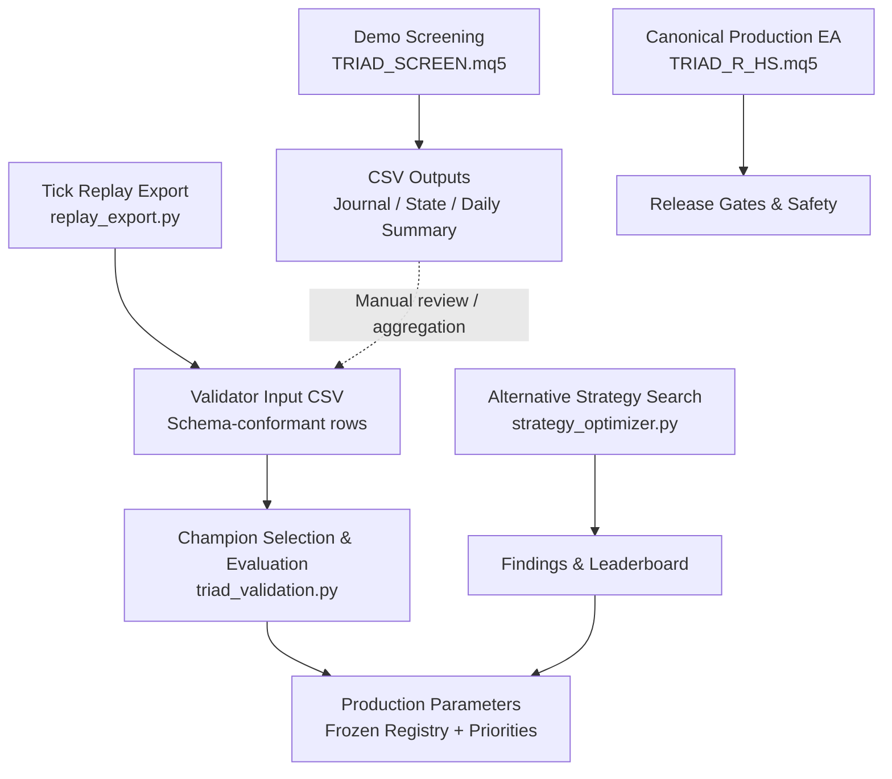
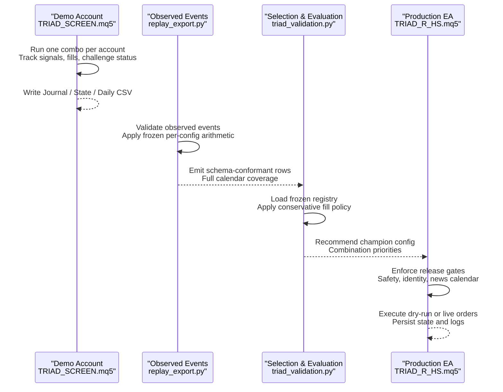
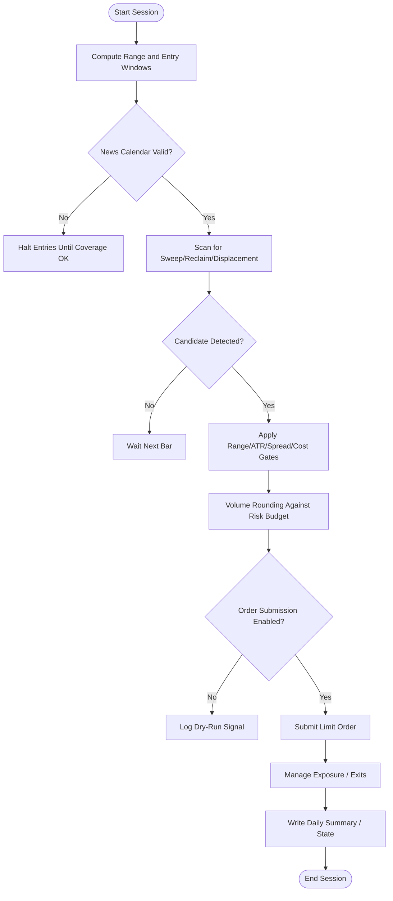
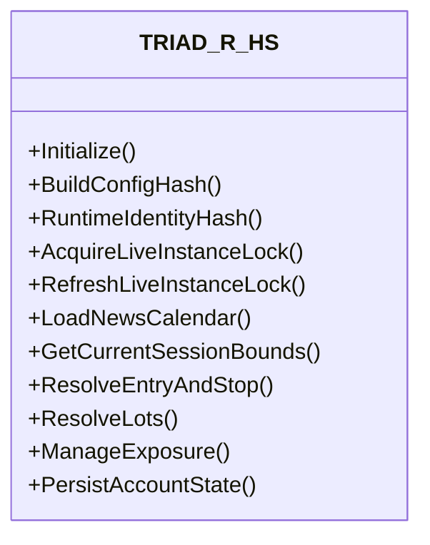
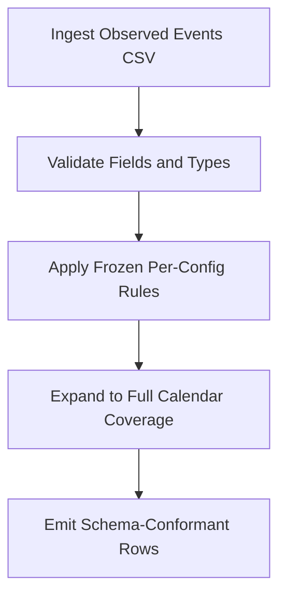
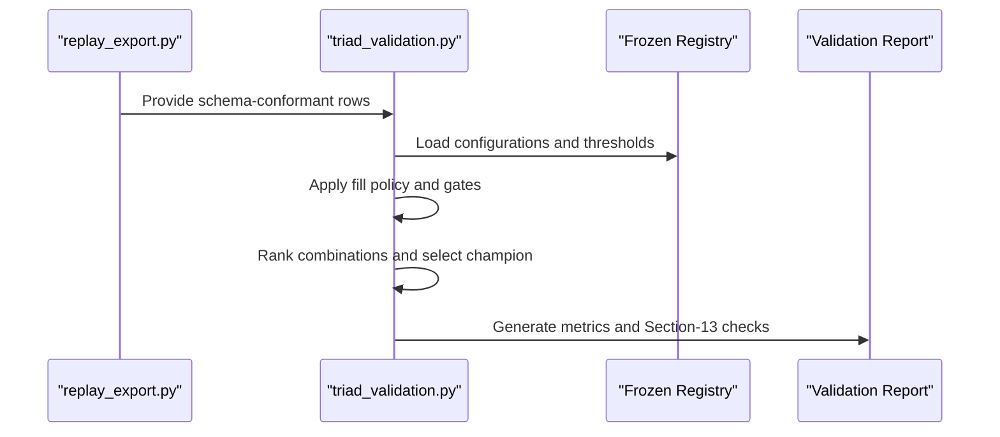
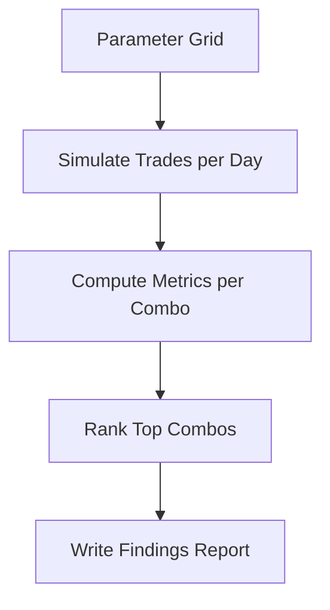
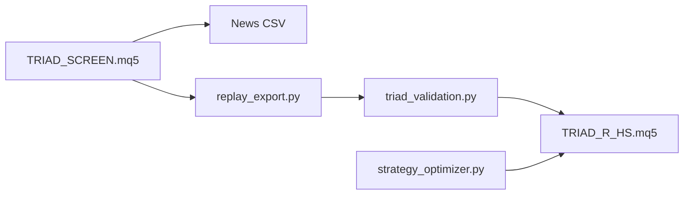

# Research Workflow Integration

<cite>
**Referenced Files in This Document**
- [TRIAD_SCREEN.mq5](file://MQL5/Experts/TRIAD_SCREEN/TRIAD_SCREEN.mq5)
- [TRIAD_R_HS.mq5](file://MQL5/Experts/TRIAD_R_HS/TRIAD_R_HS.mq5)
- [triad_validation.py](file://tools/triad_validation.py)
- [replay_export.py](file://tools/replay_export.py)
- [strategy_optimizer.py](file://tools/strategy_optimizer.py)
- [TRIAD_SCREEN README.md](file://MQL5/Experts/TRIAD_SCREEN/README.md)
- [TRIAD_R_HS README.md](file://MQL5/Experts/TRIAD_R_HS/README.md)
</cite>

## Table of Contents
1. [Introduction](#introduction)
2. [Project Structure](#project-structure)
3. [Core Components](#core-components)
4. [Architecture Overview](#architecture-overview)
5. [Detailed Component Analysis](#detailed-component-analysis)
6. [Dependency Analysis](#dependency-analysis)
7. [Performance Considerations](#performance-considerations)
8. [Troubleshooting Guide](#troubleshooting-guide)
9. [Conclusion](#conclusion)
10. [Appendices](#appendices)

## Introduction
This document explains how to integrate the screening tool into the broader research workflow for the TRIAD-R strategy. It focuses on how screening results inform strategy development, parameter optimization, and production validation; how screening insights relate to the canonical TRIAD_R_HS production EA; how data export and analysis workflows connect; and what best practices to follow for improving performance and managing risk.

The screening tool is a separate demo-only implementation that mirrors the frozen V2.1 entry rules and challenge simulation so you can compare symbol/session combinations on live demo accounts with an on-chart dashboard. The canonical production EA remains unchanged and enforces strict safety, identity, and release gates before any order submission.

## Project Structure
At a high level:
- MQL5 Experts implement the live strategies:
  - TRIAD_R_HS: canonical production EA (research implementation, fail-closed by default).
  - TRIAD_SCREEN: multi-symbol demo screening EA with a challenge dashboard and per-combo CSV outputs.
- Python tools implement the offline research pipeline:
  - replay_export: converts observed events from a tick/bar replay into the validator’s schema with full calendar coverage.
  - triad_validation: selects champions using a frozen registry and evaluates holdout outcomes under conservative fill policies.
  - strategy_optimizer: explores alternative strategies and parameters to improve monthly ROI and understand stop/target design trade-offs.

**Diagram sources**
- [TRIAD_SCREEN.mq5:1-800](file://MQL5/Experts/TRIAD_SCREEN/TRIAD_SCREEN.mq5#L1-L800)
- [replay_export.py:1-800](file://tools/replay_export.py#L1-L800)
- [triad_validation.py:1-800](file://tools/triad_validation.py#L1-L800)
- [strategy_optimizer.py:1-800](file://tools/strategy_optimizer.py#L1-L800)
- [TRIAD_R_HS.mq5:1-800](file://MQL5/Experts/TRIAD_R_HS/TRIAD_R_HS.mq5#L1-L800)

**Section sources**
- [TRIAD_SCREEN README.md:1-159](file://MQL5/Experts/TRIAD_SCREEN/README.md#L1-L159)
- [TRIAD_R_HS README.md:1-247](file://MQL5/Experts/TRIAD_R_HS/README.md#L1-L247)

## Core Components
- TRIAD_SCREEN (demo screening):
  - Runs one symbol/session combination per demo account.
  - Implements the same sweep/reclaim/displacement logic as the canonical EA but without production safety machinery.
  - Tracks The5ers-style challenge rules and writes per-day summaries, event journals, and persisted state files for later analysis.
- TRIAD_R_HS (canonical production EA):
  - Fail-closed research implementation with explicit release gates, instance locks, news calendar enforcement, and robust state persistence.
  - Enforces instrument/session priorities, cost gates, volume rounding, time stops, and drawdown controls.
- replay_export (data export):
  - Validates upstream observed-event CSVs and applies the frozen per-config arithmetic to produce the exact CSV schema consumed by the validator.
  - Expands events into full calendar coverage with explicit no-candidate rows for every configuration and combination.
- triad_validation (analysis and selection):
  - Loads a frozen registry of 160 configurations and applies conservative fill policies.
  - Selects a champion using walk-forward data only, then evaluates holdout outcomes with bootstrap confidence bounds and Section-13 checks.
- strategy_optimizer (parameter exploration):
  - Tests multiple strategy variants and parameter grids to maximize monthly ROI while controlling risk and understanding stop/target behavior.

**Section sources**
- [TRIAD_SCREEN.mq5:1-800](file://MQL5/Experts/TRIAD_SCREEN/TRIAD_SCREEN.mq5#L1-L800)
- [TRIAD_R_HS.mq5:1-800](file://MQL5/Experts/TRIAD_R_HS/TRIAD_R_HS.mq5#L1-L800)
- [replay_export.py:1-800](file://tools/replay_export.py#L1-L800)
- [triad_validation.py:1-800](file://tools/triad_validation.py#L1-L800)
- [strategy_optimizer.py:1-800](file://tools/strategy_optimizer.py#L1-L800)

## Architecture Overview
The end-to-end workflow connects live demo screening, offline replay export, frozen-regression validation, and production readiness.

**Diagram sources**
- [TRIAD_SCREEN.mq5:1-800](file://MQL5/Experts/TRIAD_SCREEN/TRIAD_SCREEN.mq5#L1-L800)
- [replay_export.py:1-800](file://tools/replay_export.py#L1-L800)
- [triad_validation.py:1-800](file://tools/triad_validation.py#L1-L800)
- [TRIAD_R_HS.mq5:1-800](file://MQL5/Experts/TRIAD_R_HS/TRIAD_R_HS.mq5#L1-L800)

## Detailed Component Analysis

### Screening Tool Integration
- Purpose: Compare symbol/session combinations on demo accounts using the same entry rules as the canonical EA, with a challenge dashboard and CSV outputs.
- Inputs: Symbol, session window, challenge presets, risk governors, news calendar file.
- Outputs: Event journal, daily summary, persisted state, planned cash risk per position, closed-trade ledger.
- Relationship to production: Signals here mirror the canonical EA’s signals for the same symbol/session; however, this tool omits production safety machinery and must not be used live.

**Diagram sources**
- [TRIAD_SCREEN.mq5:1-800](file://MQL5/Experts/TRIAD_SCREEN/TRIAD_SCREEN.mq5#L1-L800)

**Section sources**
- [TRIAD_SCREEN.mq5:1-800](file://MQL5/Experts/TRIAD_SCREEN/TRIAD_SCREEN.mq5#L1-L800)
- [TRIAD_SCREEN README.md:1-159](file://MQL5/Experts/TRIAD_SCREEN/README.md#L1-L159)

### Canonical Production EA
- Purpose: Frozen research implementation of the canonical strategy with strict safety and release gates.
- Key behaviors:
  - Instance lock and heartbeat prevent duplicate live instances.
  - News calendar enforced with required coverage; stale calendar halts entries.
  - Combination priorities determine routing when multiple symbols signal simultaneously.
  - Volume rounding anchored at minimum lot size; all-in loss fits risk budget.
  - Time stops, breakeven cap, and session-end exits manage exposure.
  - Persistent state includes configuration hash, identity hash, day/week keys, floors, high water, request counts, and halt latches.

**Diagram sources**
- [TRIAD_R_HS.mq5:1-800](file://MQL5/Experts/TRIAD_R_HS/TRIAD_R_HS.mq5#L1-L800)

**Section sources**
- [TRIAD_R_HS.mq5:1-800](file://MQL5/Experts/TRIAD_R_HS/TRIAD_R_HS.mq5#L1-L800)
- [TRIAD_R_HS README.md:1-247](file://MQL5/Experts/TRIAD_R_HS/README.md#L1-L247)

### Data Export Capabilities
- Observed-event contract:
  - Captures sweep/reclaim/displacement geometry, costs, limit activation/touch, fill fraction, exit reasons, and price paths at key horizons.
- Exporter responsibilities:
  - Validates observed events against strict schemas.
  - Applies frozen per-config entry/stop/cost/lot/target/time-stop/breakeven arithmetic.
  - Expands events into full calendar coverage with explicit no-candidate rows for every configuration and combination.
  - Does not infer WALK_FORWARD/HOLDOUT splits; both ranges are predeclared arguments.

**Diagram sources**
- [replay_export.py:1-800](file://tools/replay_export.py#L1-L800)

**Section sources**
- [replay_export.py:1-800](file://tools/replay_export.py#L1-L800)

### Analysis Workflows and Champion Selection
- Validator responsibilities:
  - Load frozen registry of 160 configurations.
  - Apply conservative fill policy (minimum trade-through ticks, minimum fill fraction, stressed scenarios).
  - Independently gate each instrument/session; disable failing combinations before portfolio ranking.
  - Select champion using WALK_FORWARD rows only; evaluate HOLDOUT outcomes after selection.
  - Compute metrics including expectancy, profit factor, fill rates, cash utilization, year-robustness, phase simulations, drawdown percentiles, and Section-13 checks.

**Diagram sources**
- [replay_export.py:1-800](file://tools/replay_export.py#L1-L800)
- [triad_validation.py:1-800](file://tools/triad_validation.py#L1-L800)

**Section sources**
- [triad_validation.py:1-800](file://tools/triad_validation.py#L1-L800)

### Parameter Optimization and Strategy Development
- Strategy optimizer explores alternative designs:
  - ORB variants with different stop modes and target R values.
  - Multi-session combinations with max-one-trade-per-calendar-day constraints.
  - Metrics include signal count, win rate, average R, profit factor, estimated monthly P&L, Sharpe-like score, and Kelly fraction.
- Outputs:
  - Leaderboard of top combos.
  - Findings report with recommendations and next steps.

**Diagram sources**
- [strategy_optimizer.py:1-800](file://tools/strategy_optimizer.py#L1-L800)

**Section sources**
- [strategy_optimizer.py:1-800](file://tools/strategy_optimizer.py#L1-L800)

## Dependency Analysis
- Screening depends on:
  - Same session bounds and DST handling as the canonical EA.
  - News calendar file for blackout windows.
  - Optional order submission (demo only).
- Export depends on:
  - Upstream observed-event CSV from a tick/bar replay.
  - Frozen registry for configuration definitions.
- Validation depends on:
  - Exported rows and frozen registry.
  - Conservative fill policy and Section-13 thresholds.
- Production EA depends on:
  - Release gates, instance locks, and identity verification.
  - Combination priorities and routing rules.

**Diagram sources**
- [TRIAD_SCREEN.mq5:1-800](file://MQL5/Experts/TRIAD_SCREEN/TRIAD_SCREEN.mq5#L1-L800)
- [replay_export.py:1-800](file://tools/replay_export.py#L1-L800)
- [triad_validation.py:1-800](file://tools/triad_validation.py#L1-L800)
- [TRIAD_R_HS.mq5:1-800](file://MQL5/Experts/TRIAD_R_HS/TRIAD_R_HS.mq5#L1-L800)
- [strategy_optimizer.py:1-800](file://tools/strategy_optimizer.py#L1-L800)

**Section sources**
- [TRIAD_SCREEN.mq5:1-800](file://MQL5/Experts/TRIAD_SCREEN/TRIAD_SCREEN.mq5#L1-L800)
- [replay_export.py:1-800](file://tools/replay_export.py#L1-L800)
- [triad_validation.py:1-800](file://tools/triad_validation.py#L1-L800)
- [TRIAD_R_HS.mq5:1-800](file://MQL5/Experts/TRIAD_R_HS/TRIAD_R_HS.mq5#L1-L800)
- [strategy_optimizer.py:1-800](file://tools/strategy_optimizer.py#L1-L800)

## Performance Considerations
- Use screening to identify symbol/session combinations that consistently produce signals and fills under realistic conditions before committing to production parameters.
- Prefer conservative fill assumptions in validation to avoid overestimating edge; ensure minimum trade-through ticks and full fills are modeled.
- Monitor execution costs (spread, slippage, commission) and ensure they remain within the all-in cost gate; adjust targets and stops accordingly.
- Validate across multiple regimes and years; ensure profits are not concentrated in a single year or regime.
- Use bootstrap confidence bounds and Section-13 checks to confirm robustness before production deployment.

[No sources needed since this section provides general guidance]

## Troubleshooting Guide
Common issues and resolutions:
- News calendar stale or missing coverage:
  - Ensure the news CSV contains verified events through the declared coverage timestamp; stale coverage disables new entries until refreshed.
- Missing or invalid observed events:
  - Verify the observed-event CSV header matches the expected schema; validate types and allowed values.
- Duplicate or inconsistent replay rows:
  - Ensure unique keys per server day, sequence, event ID, and combination; add explicit no-candidate rows for full coverage.
- Partial fills or missed limits:
  - Confirm limit_touched and trade_through_ticks reflect actual broker replay behavior; conservative policies will reject partial or non-traded-through limits.
- Production EA halted:
  - Check instance lock, identity mismatch, news calendar status, and state signatures; resolve root cause and reinitialize if necessary.

**Section sources**
- [TRIAD_R_HS README.md:1-247](file://MQL5/Experts/TRIAD_R_HS/README.md#L1-L247)
- [replay_export.py:1-800](file://tools/replay_export.py#L1-L800)
- [triad_validation.py:1-800](file://tools/triad_validation.py#L1-L800)

## Conclusion
Integrating the screening tool into the research workflow enables systematic comparison of symbol/session combinations and early detection of mechanical viability before production deployment. Screening results should feed into parameter optimization and validation pipelines that use frozen registries, conservative fill policies, and robust statistical checks. The canonical TRIAD_R_HS EA enforces strict safety and release gates, ensuring that only thoroughly validated configurations proceed to live trading. Best practices emphasize conservative modeling, multi-regime validation, clear documentation of parameters, and disciplined risk management throughout the workflow.

[No sources needed since this section summarizes without analyzing specific files]

## Appendices

### Best Practices for Using Screening Results
- Treat screening signals as evidence of mechanics, not edge; rely on the canonical Section-13 pipeline for edge claims.
- Record the setting fingerprint (config hash) for each demo run to attribute results to exact parameters.
- Aggregate per-day summaries and event journals to identify patterns in candidate quality, activation refusals, and fill rates.
- Use screening to prioritize which combinations to include in the frozen registry and router priorities.

**Section sources**
- [TRIAD_SCREEN README.md:1-159](file://MQL5/Experts/TRIAD_SCREEN/README.md#L1-L159)

### Risk Management Approaches
- Enforce daily and overall floor limits; close positions immediately upon breach.
- Apply internal drawdown shutdown and reduce exposure progressively as drawdown increases.
- Respect news blackouts and rollover buffers; do not force trades during high-impact events.
- Maintain one-position invariant; cancel/close duplicates and repair exposure violations promptly.

**Section sources**
- [TRIAD_SCREEN.mq5:1-800](file://MQL5/Experts/TRIAD_SCREEN/TRIAD_SCREEN.mq5#L1-L800)
- [TRIAD_R_HS.mq5:1-800](file://MQL5/Experts/TRIAD_R_HS/TRIAD_R_HS.mq5#L1-L800)