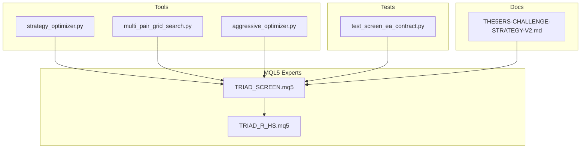
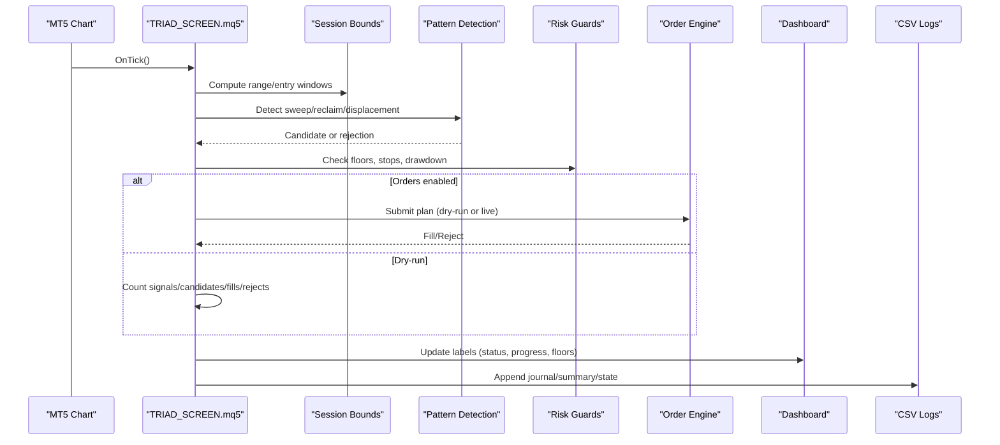
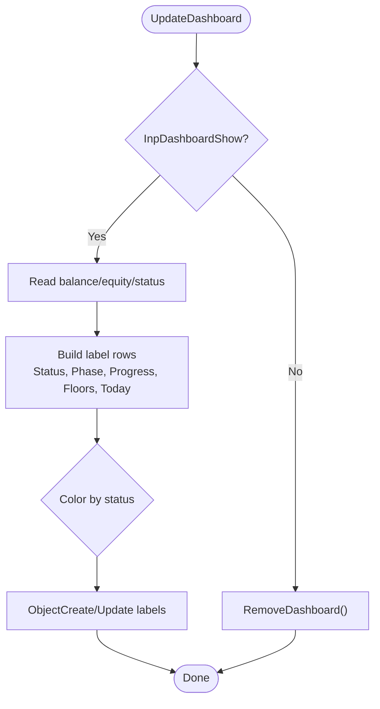
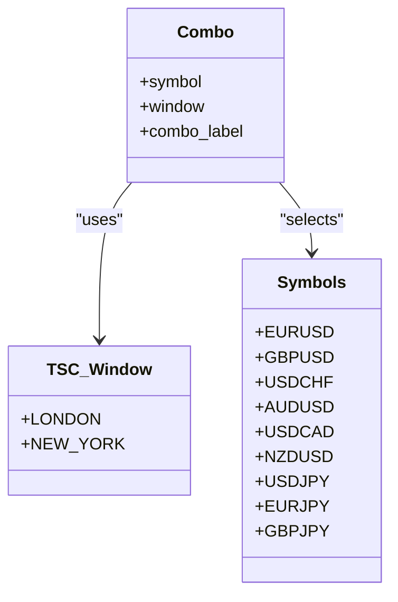
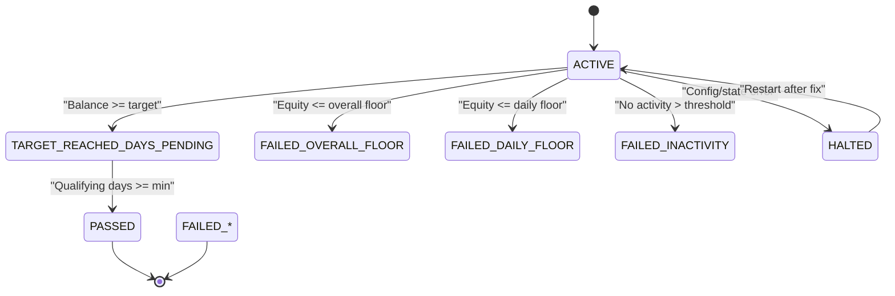
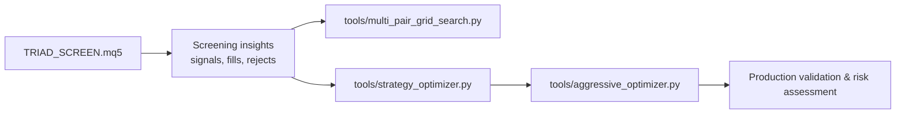
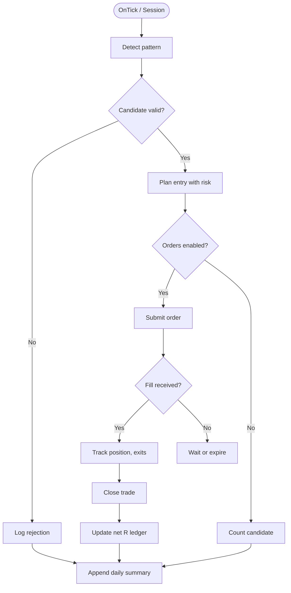
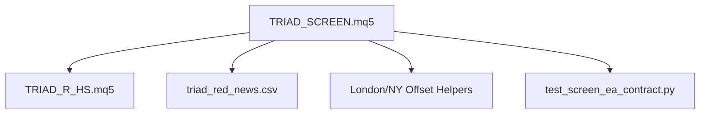

# Research and Screening Tool

<cite>
**Referenced Files in This Document**
- [TRIAD_SCREEN.mq5](file://MQL5/Experts/TRIAD_SCREEN/TRIAD_SCREEN.mq5)
- [README.md](file://MQL5/Experts/TRIAD_SCREEN/README.md)
- [TRIAD_R_HS.mq5](file://MQL5/Experts/TRIAD_R_HS/TRIAD_R_HS.mq5)
- [test_screen_ea_contract.py](file://tests/test_screen_ea_contract.py)
- [strategy_optimizer.py](file://tools/strategy_optimizer.py)
- [multi_pair_grid_search.py](file://tools/multi_pair_grid_search.py)
- [aggressive_optimizer.py](file://tools/aggressive_optimizer.py)
- [THE5ERS-CHALLENGE-STRATEGY-V2.md](file://THE5ERS-CHALLENGE-STRATEGY-V2.md)
</cite>

## Table of Contents
1. [Introduction](#introduction)
2. [Project Structure](#project-structure)
3. [Core Components](#core-components)
4. [Architecture Overview](#architecture-overview)
5. [Detailed Component Analysis](#detailed-component-analysis)
6. [Dependency Analysis](#dependency-analysis)
7. [Performance Considerations](#performance-considerations)
8. [Troubleshooting Guide](#troubleshooting-guide)
9. [Conclusion](#conclusion)
10. [Appendices](#appendices)

## Introduction
The TRIAD_SCREEN tool is a research and screening Expert Advisor designed to run one symbol and one session window per demo account, simulating the frozen V2.1 strategy rules while tracking a The5ers-style funding challenge. It provides an on-chart dashboard that displays challenge status, phase progress, qualifying days, daily and overall floor distances, today’s signals/candidates/fills/rejects, net-R ledger, and a settings fingerprint (ConfigHash). It writes structured CSV logs for later analysis and supports both dry-run mode (no orders) and live order submission on demo accounts only.

It complements broader research workflows by enabling multi-symbol screening across London and New York sessions, parameter exploration via related tools, and bridging insights from screening into production strategy validation and risk assessment.

**Section sources**
- [README.md:12-35](file://MQL5/Experts/TRIAD_SCREEN/README.md#L12-L35)
- [TRIAD_SCREEN.mq5:1-31](file://MQL5/Experts/TRIAD_SCREEN/TRIAD_SCREEN.mq5#L1-L31)

## Project Structure
At a high level, the project includes:
- MQL5 Experts: TRIAD_SCREEN (screening EA), TRIAD_R_HS (canonical frozen strategy)
- Tools: Python-based optimizers and grid search utilities for parameter studies
- Tests: Static contract tests ensuring screen EA behavior matches expectations and does not modify canonical assets
- Documentation: Challenge plans and strategy documents guiding rule presets and lifecycle

**Diagram sources**
- [TRIAD_SCREEN.mq5:1-31](file://MQL5/Experts/TRIAD_SCREEN/TRIAD_SCREEN.mq5#L1-L31)
- [TRIAD_R_HS.mq5:1-20](file://MQL5/Experts/TRIAD_R_HS/TRIAD_R_HS.mq5#L1-L20)
- [strategy_optimizer.py:1-34](file://tools/strategy_optimizer.py#L1-L34)
- [multi_pair_grid_search.py:1-13](file://tools/multi_pair_grid_search.py#L1-L13)
- [aggressive_optimizer.py:767-794](file://tools/aggressive_optimizer.py#L767-L794)
- [test_screen_ea_contract.py:1-9](file://tests/test_screen_ea_contract.py#L1-L9)
- [THE5ERS-CHALLENGE-STRATEGY-V2.md:384-422](file://THE5ERS-CHALLENGE-STRATEGY-V2.md#L384-L422)

**Section sources**
- [TRIAD_SCREEN.mq5:1-31](file://MQL5/Experts/TRIAD_SCREEN/TRIAD_SCREEN.mq5#L1-L31)
- [README.md:12-44](file://MQL5/Experts/TRIAD_SCREEN/README.md#L12-L44)

## Core Components
- On-chart dashboard: Displays challenge status, phase progress, qualifying days, floors, today’s activity, and ConfigHash; refreshes at a configurable interval.
- Multi-symbol screening: Supports EURUSD, GBPUSD, USDCHF, AUDUSD, USDCAD, NZDUSD, USDJPY, EURJPY, GBPJPY with London or New York windows. One combo per demo account.
- Challenge simulation: Tracks phase targets, qualifying days, daily loss boundary, overall floor, and inactivity rules; outputs PASSED, FAILED, ACTIVE, TARGET_REACHED_DAYS_PENDING, HALTED states.
- Strategy port: Faithful port of frozen V2.1 entry rules (session range, sweep/reclaim/displacement geometry, percentile gates, spread gate, volume sizing, visible SL/TP, time stop/breakeven/session exits).
- Logging and state: Writes event journal, persisted day/challenge state, per-day summary, planned cash risk per position, and closed-trade R ledger to CSV files under MQL5/Files.

Key inputs include symbol selection, session window, challenge preset parameters, risk governors, news calendar integration, and dashboard controls. Order submission defaults to disabled for safety.

**Section sources**
- [TRIAD_SCREEN.mq5:86-156](file://MQL5/Experts/TRIAD_SCREEN/TRIAD_SCREEN.mq5#L86-L156)
- [TRIAD_SCREEN.mq5:3086-3288](file://MQL5/Experts/TRIAD_SCREEN/TRIAD_SCREEN.mq5#L3086-L3288)
- [README.md:12-35](file://MQL5/Experts/TRIAD_SCREEN/README.md#L12-L35)
- [test_screen_ea_contract.py:57-73](file://tests/test_screen_ea_contract.py#L57-L73)

## Architecture Overview
The screening EA runs per demo account with a single symbol/window combination. Each tick/session it:
- Computes session bounds (range and entry windows) using DST-aware civil-time helpers.
- Detects patterns (sweep/reclaim/displacement) and builds candidates with ATR/range percentile and spread filters.
- Applies risk guards (daily/overall floors, internal stops, drawdown shutdown) and enforces exposure invariants.
- Simulates or submits orders based on InpEnableOrderSubmission.
- Updates challenge status machine and dashboard.
- Persists state and writes CSV logs.

**Diagram sources**
- [TRIAD_SCREEN.mq5:717-749](file://MQL5/Experts/TRIAD_SCREEN/TRIAD_SCREEN.mq5#L717-L749)
- [TRIAD_SCREEN.mq5:3086-3288](file://MQL5/Experts/TRIAD_SCREEN/TRIAD_SCREEN.mq5#L3086-L3288)

## Detailed Component Analysis

### On-Chart Dashboard Interface
- Purpose: Provide immediate visibility into challenge status, phase progress, qualifying days, daily/overall floor distances, today’s metrics, and a settings fingerprint.
- Implementation: Uses OBJ_LABEL objects positioned on the chart; refreshed at a configurable interval; removes previous labels before updating.
- Status colors: Green for passed, red for failed, orange for halted/dry-run halted, silver for dry-run active.

**Diagram sources**
- [TRIAD_SCREEN.mq5:3198-3288](file://MQL5/Experts/TRIAD_SCREEN/TRIAD_SCREEN.mq5#L3198-L3288)

**Section sources**
- [TRIAD_SCREEN.mq5:3198-3288](file://MQL5/Experts/TRIAD_SCREEN/TRIAD_SCREEN.mq5#L3198-L3288)
- [test_screen_ea_contract.py:118-125](file://tests/test_screen_ea_contract.py#L118-L125)

### Multi-Symbol Screening Capabilities
- Supported symbols: EURUSD, GBPUSD, USDCHF, AUDUSD, USDCAD, NZDUSD, USDJPY, EURJPY, GBPJPY.
- Sessions: London (range 00:00–07:00 local, entry 07:00–11:00) and New York (reference London range 07:00–13:00, entry 08:30–11:00).
- One combo per account: InpSymbol + InpWindow define the combo; auto-labeling if InpComboLabel is empty.

**Diagram sources**
- [TRIAD_SCREEN.mq5:39-64](file://MQL5/Experts/TRIAD_SCREEN/TRIAD_SCREEN.mq5#L39-L64)
- [TRIAD_SCREEN.mq5:77-80](file://MQL5/Experts/TRIAD_SCREEN/TRIAD_SCREEN.mq5#L77-L80)
- [TRIAD_SCREEN.mq5:86-97](file://MQL5/Experts/TRIAD_SCREEN/TRIAD_SCREEN.mq5#L86-L97)
- [README.md:46-57](file://MQL5/Experts/TRIAD_SCREEN/README.md#L46-L57)

**Section sources**
- [TRIAD_SCREEN.mq5:77-97](file://MQL5/Experts/TRIAD_SCREEN/TRIAD_SCREEN.mq5#L77-L97)
- [README.md:46-57](file://MQL5/Experts/TRIAD_SCREEN/README.md#L46-L57)

### Challenge Simulation Features
- Challenge preset: Editable inputs mirror The5ers $2,500 High Stakes (Phase 1 +10%, Phase 2 +5%, minimum qualifying days, daily loss %, overall floor %, inactivity days).
- Status machine: Returns PASSED, TARGET_REACHED_DAYS_PENDING, FAILED_OVERALL_FLOOR, FAILED_DAILY_FLOOR, FAILED_INACTIVITY, ACTIVE, HALTED.
- Persisted state: Saves day keys, balances, equity, qualifying days, phase, halt reason, request counts; reloads on init unless mismatched.

**Diagram sources**
- [TRIAD_SCREEN.mq5:3086-3138](file://MQL5/Experts/TRIAD_SCREEN/TRIAD_SCREEN.mq5#L3086-L3138)
- [TRIAD_SCREEN.mq5:456-545](file://MQL5/Experts/TRIAD_SCREEN/TRIAD_SCREEN.mq5#L456-L545)

**Section sources**
- [TRIAD_SCREEN.mq5:3086-3138](file://MQL5/Experts/TRIAD_SCREEN/TRIAD_SCREEN.mq5#L3086-L3138)
- [README.md:81-113](file://MQL5/Experts/TRIAD_SCREEN/README.md#L81-L113)

### Strategy Development and Parameter Optimization Integration
- Strategy parity: The screen EA ports the frozen V2.1 rules so signals here correspond to the same signals in the canonical EA for the same symbol/session.
- Parameter exploration: Use Python tools to explore grids (e.g., ORB bars, target R, stop modes, ATR stops) and assess signal rates, win rates, avg R, profit factor, monthly P&L, Sharpe-like scores, Kelly fractions.
- Multi-pair grid search: Focuses on specific pairs/sessions to evaluate geometry relaxations and rejection reasons.
- Aggressive optimizer: Runs multi-pair challenge simulations to identify top configurations and deep-dive best results.

**Diagram sources**
- [TRIAD_SCREEN.mq5:18-26](file://MQL5/Experts/TRIAD_SCREEN/TRIAD_SCREEN.mq5#L18-L26)
- [strategy_optimizer.py:1-34](file://tools/strategy_optimizer.py#L1-L34)
- [multi_pair_grid_search.py:1-13](file://tools/multi_pair_grid_search.py#L1-L13)
- [aggressive_optimizer.py:767-794](file://tools/aggressive_optimizer.py#L767-L794)

**Section sources**
- [TRIAD_SCREEN.mq5:18-26](file://MQL5/Experts/TRIAD_SCREEN/TRIAD_SCREEN.mq5#L18-L26)
- [strategy_optimizer.py:1-34](file://tools/strategy_optimizer.py#L1-L34)
- [multi_pair_grid_search.py:1-13](file://tools/multi_pair_grid_search.py#L1-L13)
- [aggressive_optimizer.py:767-794](file://tools/aggressive_optimizer.py#L767-L794)

### Performance Analysis and Outputs
- Daily summaries: Closed trade count, net P&L, floors, and today’s metrics written to CSV.
- Net-R ledger: Realized net R from closed trades using planned cash risk recorded at fill time; excludes positions adopted after restart without recorded risk.
- Event journal: Timestamped events with level, event name, detail, balance, equity for auditability.

**Diagram sources**
- [TRIAD_SCREEN.mq5:547-578](file://MQL5/Experts/TRIAD_SCREEN/TRIAD_SCREEN.mq5#L547-L578)
- [TRIAD_SCREEN.mq5:3281-3288](file://MQL5/Experts/TRIAD_SCREEN/TRIAD_SCREEN.mq5#L3281-L3288)

**Section sources**
- [TRIAD_SCREEN.mq5:547-578](file://MQL5/Experts/TRIAD_SCREEN/TRIAD_SCREEN.mq5#L547-L578)
- [TRIAD_SCREEN.mq5:3281-3288](file://MQL5/Experts/TRIAD_SCREEN/TRIAD_SCREEN.mq5#L3281-L3288)

## Dependency Analysis
- Canonical parity: TRIAD_SCREEN mirrors V2.1 logic from TRIAD_R_HS.mq5 for entries, sizing, exits, and risk guards.
- News calendar: Reads triad_red_news.csv to block entries around high-impact events; requires coverage row and UTC timestamps.
- DST/time: Uses London/New York offset functions to compute session bounds accurately.
- Testing: Static contract tests ensure supported symbols, windows, challenge presets, dashboard presence, and non-interference with canonical EA and registries.

**Diagram sources**
- [TRIAD_SCREEN.mq5:18-26](file://MQL5/Experts/TRIAD_SCREEN/TRIAD_SCREEN.mq5#L18-L26)
- [TRIAD_SCREEN.mq5:581-656](file://MQL5/Experts/TRIAD_SCREEN/TRIAD_SCREEN.mq5#L581-L656)
- [test_screen_ea_contract.py:133-146](file://tests/test_screen_ea_contract.py#L133-L146)

**Section sources**
- [TRIAD_SCREEN.mq5:581-656](file://MQL5/Experts/TRIAD_SCREEN/TRIAD_SCREEN.mq5#L581-L656)
- [test_screen_ea_contract.py:133-146](file://tests/test_screen_ea_contract.py#L133-L146)

## Performance Considerations
- Range loading: Completed range is read once every bar exists (now >= range_end) to avoid starvation in New York window where reference range closes before entry opens.
- Request throttling: Non-emergency requests capped per day; emergency cleanup bypasses cap but is per-ticket throttled.
- Dashboard refresh: Configurable interval avoids excessive redraws.
- Data normalization: Prices normalized to SYMBOL_TRADE_TICK_SIZE to respect broker specifications.

[No sources needed since this section provides general guidance]

## Troubleshooting Guide
Common issues and resolutions:
- Unsupported symbol: Ensure symbol is within the supported list; otherwise initialization fails closed.
- News calendar stale: If triad_red_news.csv lacks coverage or has outdated events, entries may be blocked; update file or disable requirement temporarily for dry runs.
- Mid-session attach: With skip fresh mid-session start enabled, attaching during entry window consumes the session to avoid reconstructing stale events.
- Halt reasons: Config mismatch, state file mismatch, or other errors result in HALTED; restart after fixing cause; persisted halt is not restored on next init.
- Order submission: Keep disabled for safety; enable only on demo accounts for live screening.

**Section sources**
- [TRIAD_SCREEN.mq5:356-362](file://MQL5/Experts/TRIAD_SCREEN/TRIAD_SCREEN.mq5#L356-L362)
- [TRIAD_SCREEN.mq5:771-780](file://MQL5/Experts/TRIAD_SCREEN/TRIAD_SCREEN.mq5#L771-L780)
- [TRIAD_SCREEN.mq5:3086-3138](file://MQL5/Experts/TRIAD_SCREEN/TRIAD_SCREEN.mq5#L3086-L3138)
- [README.md:97-113](file://MQL5/Experts/TRIAD_SCREEN/README.md#L97-L113)

## Conclusion
TRIAD_SCREEN provides a robust, transparent research and screening environment for evaluating the V2.1 strategy across multiple symbols and sessions on demo accounts. Its on-chart dashboard, challenge simulation, and structured logging support rapid iteration, parameter optimization, and informed decisions for production validation. By integrating with Python-based optimizers and adhering to canonical rules, it bridges screening insights into strategy improvements and risk assessments aligned with challenge requirements.

[No sources needed since this section summarizes without analyzing specific files]

## Appendices

### Usage Examples
- Setup screening parameters:
  - Set InpSymbol to desired pair, InpWindow to LONDON or NEW_YORK, configure challenge preset inputs to match your agreement, and keep InpEnableOrderSubmission false for dry runs.
  - Ensure triad_red_news.csv is current or set InpRequireNewsCalendar=false for testing.
- Interpret dashboard outputs:
  - STATUS indicates PASS/FAIL/ACTIVE/HALTED; check progress percentage, qualifying days, and floor distances.
  - ConfigHash identifies exact settings used; record it for reproducibility.
- Integrate with workflow:
  - Use screening results to guide parameter grids in tools/strategy_optimizer.py and tools/multi_pair_grid_search.py.
  - Validate top configurations against production constraints and risk limits before moving to live/funded accounts.

**Section sources**
- [README.md:59-79](file://MQL5/Experts/TRIAD_SCREEN/README.md#L59-L79)
- [TRIAD_SCREEN.mq5:3086-3288](file://MQL5/Experts/TRIAD_SCREEN/TRIAD_SCREEN.mq5#L3086-L3288)
- [strategy_optimizer.py:1-34](file://tools/strategy_optimizer.py#L1-L34)
- [multi_pair_grid_search.py:1-13](file://tools/multi_pair_grid_search.py#L1-L13)

### Relationship to Production Strategy Validation
- Parity: Signals and risk guards mirror the canonical EA, ensuring screening outcomes are meaningful for production validation.
- Lifecycle alignment: Challenge rules and phase transitions align with THE5ERS-CHALLENGE-STRATEGY-V2.md, supporting consistent evaluation across demo and funded phases.
- Risk assessment: Daily/overall floors, inactivity monitoring, and exposure invariants provide early warnings and safeguards for production deployment.

**Section sources**
- [TRIAD_SCREEN.mq5:18-26](file://MQL5/Experts/TRIAD_SCREEN/TRIAD_SCREEN.mq5#L18-L26)
- [THE5ERS-CHALLENGE-STRATEGY-V2.md:384-422](file://THE5ERS-CHALLENGE-STRATEGY-V2.md#L384-L422)