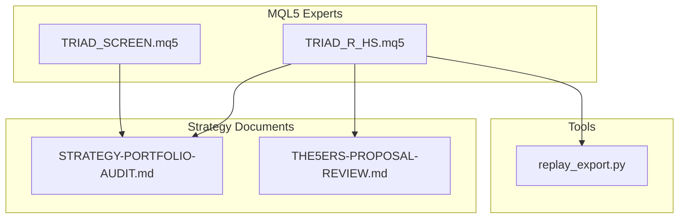
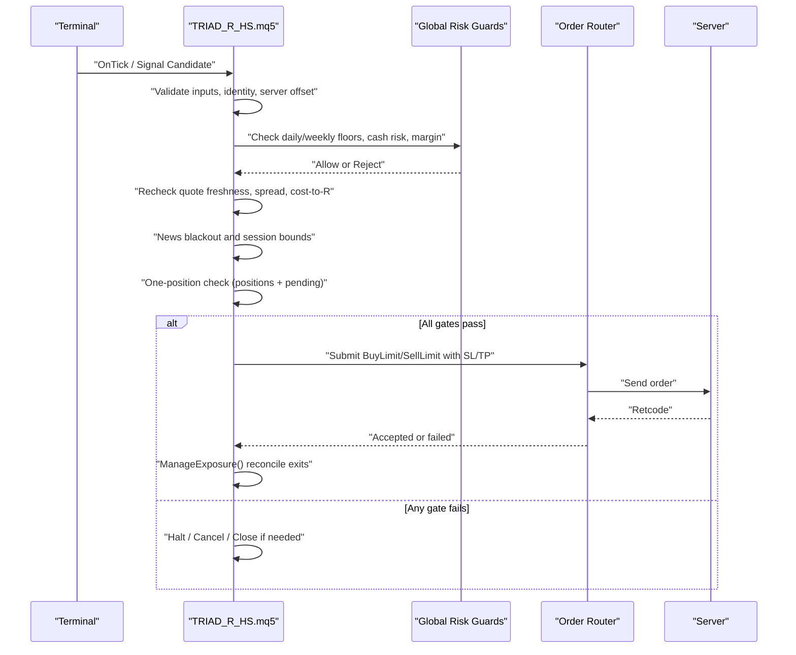
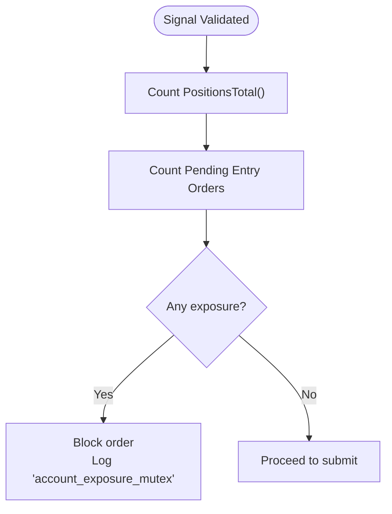
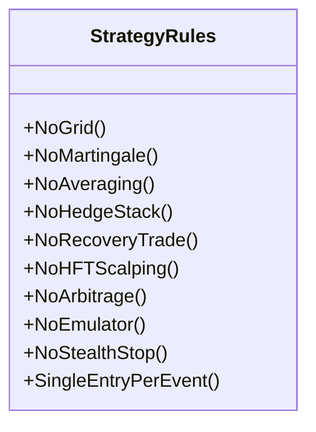
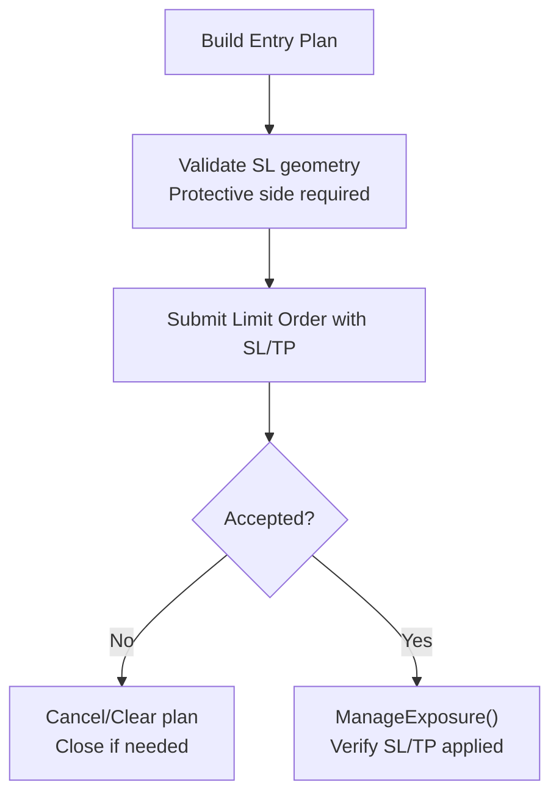
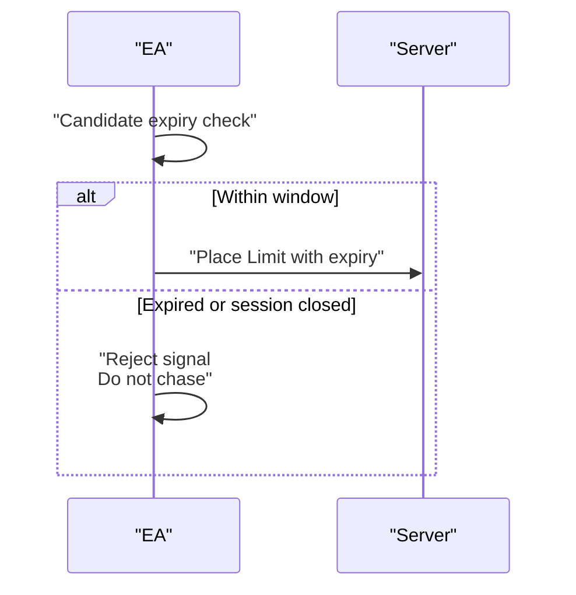
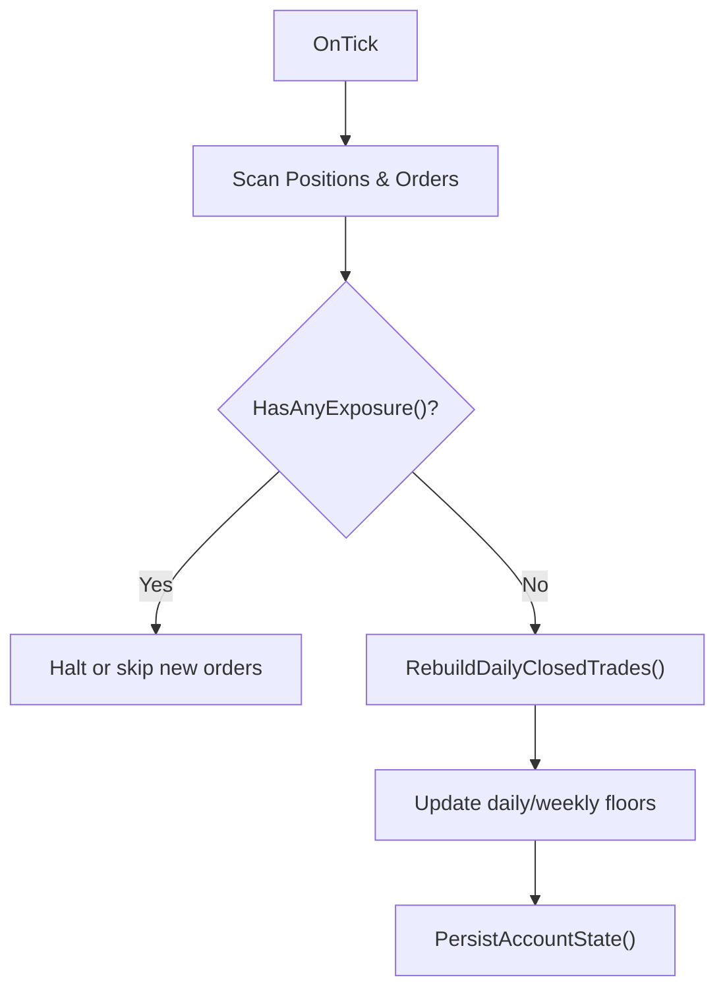
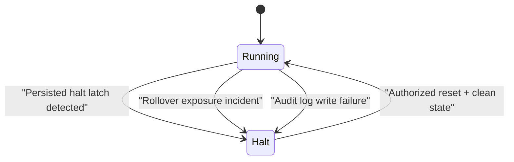
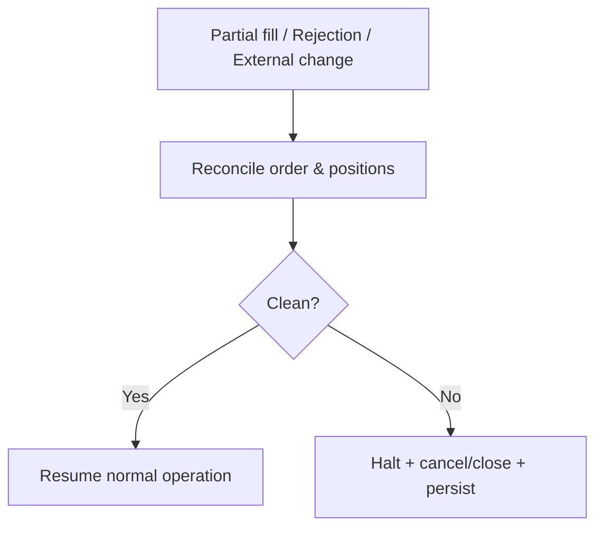
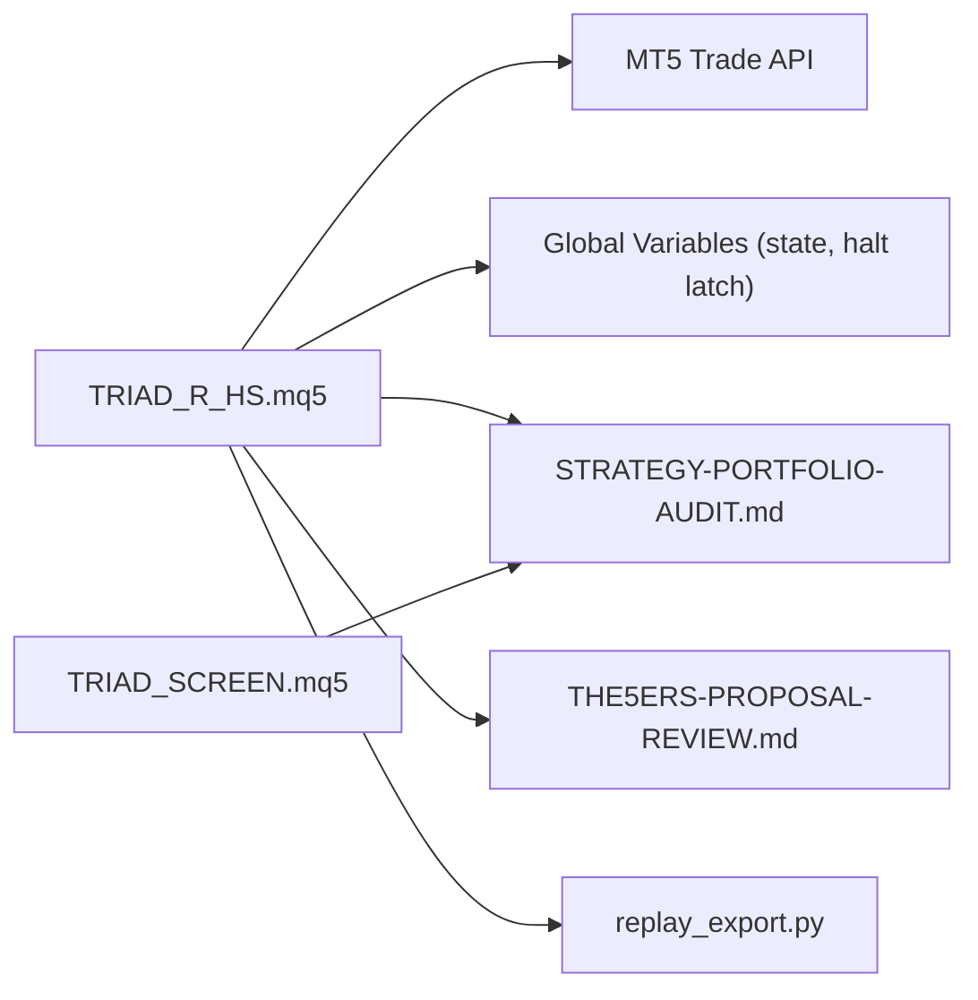

# Account State Checks

<cite>
**Referenced Files in This Document**
- [TRIAD_R_HS.mq5](file://MQL5/Experts/TRIAD_R_HS/TRIAD_R_HS.mq5)
- [TRIAD_SCREEN.mq5](file://MQL5/Experts/TRIAD_SCREEN/TRIAD_SCREEN.mq5)
- [STRATEGY-PORTFOLIO-AUDIT.md](file://STRATEGY-PORTFOLIO-AUDIT.md)
- [THE5ERS-PROPOSAL-REVIEW.md](file://THE5ERS-PROPOSAL-REVIEW.md)
- [replay_export.py](file://tools/replay_export.py)
</cite>

## Table of Contents
1. Introduction
2. Project Structure
3. Core Components
4. Architecture Overview
5. Detailed Component Analysis
6. Dependency Analysis
7. Performance Considerations
8. Troubleshooting Guide
9. Conclusion

## Introduction
This document explains the account state validation gates that enforce a strict one-position rule and comprehensive risk controls before any signal processing or order submission. It covers:
- One-position enforcement across all symbols on the account
- Prohibition of grid, martingale, averaging, hedge stacking, recovery trades, HFT/tick scalping, arbitrage, emulator, and stealth-stop strategies
- Broker-visible stop requirement attached to every entry order
- Market chase restriction after expired limits
- Real-time monitoring, position counting, and emergency halt mechanisms
- Edge cases such as partial fills, platform reconciliation issues, and manual intervention scenarios

The implementation is centered in the canonical EA TRIAD_R_HS.mq5, with supporting documentation and replay logic referenced for context.

## Project Structure
The repository contains two MQL5 Expert Advisors and supporting documents:
- TRIAD_R_HS.mq5: Canonical production-grade research EA with fail-closed safety, global risk guards, and one-position enforcement
- TRIAD_SCREEN.mq5: Demo screening tool that mirrors strategy mechanics without production safety machinery
- STRATEGY-PORTFOLIO-AUDIT.md: Strategy design constraints including prohibition of prohibited strategies and single-entry topology
- THE5ERS-PROPOSAL-REVIEW.md: Rule interpretation emphasizing bulk trading prohibition and coordinated execution bans
- replay_export.py: Replay/export utilities that validate stop geometry and cost-to-R assumptions used by the EA’s sizing and gating

**Diagram sources**
- [TRIAD_R_HS.mq5:1-100](file://MQL5/Experts/TRIAD_R_HS/TRIAD_R_HS.mq5#L1-L100)
- [TRIAD_SCREEN.mq5:1-100](file://MQL5/Experts/TRIAD_SCREEN/TRIAD_SCREEN.mq5#L1-L100)
- [STRATEGY-PORTFOLIO-AUDIT.md:280-310](file://STRATEGY-PORTFOLIO-AUDIT.md#L280-L310)
- [THE5ERS-PROPOSAL-REVIEW.md:192-207](file://THE5ERS-PROPOSAL-REVIEW.md#L192-L207)
- [replay_export.py:549-575](file://tools/replay_export.py#L549-L575)

**Section sources**
- [TRIAD_R_HS.mq5:1-100](file://MQL5/Experts/TRIAD_R_HS/TRIAD_R_HS.mq5#L1-L100)
- [TRIAD_SCREEN.mq5:1-100](file://MQL5/Experts/TRIAD_SCREEN/TRIAD_SCREEN.mq5#L1-L100)
- [STRATEGY-PORTFOLIO-AUDIT.md:280-310](file://STRATEGY-PORTFOLIO-AUDIT.md#L280-L310)
- [THE5ERS-PROPOSAL-REVIEW.md:192-207](file://THE5ERS-PROPOSAL-REVIEW.md#L192-L207)
- [replay_export.py:549-575](file://tools/replay_export.py#L549-L575)

## Core Components
- One-position mutex: The EA enforces zero exposure (no open positions and no pending entries) before submitting any new order. Exposure is checked globally across all symbols and orders.
- Global risk guards: Daily/weekly drawdown, firm floor, cash-risk budget, margin availability, spread and latency checks, news blackout windows, and request throttling are evaluated before submission.
- Broker-visible stop: Every entry order carries an explicit stop loss; invalid or missing stops cause rejection or immediate cleanup.
- Market chase restriction: After a limit expires, the EA does not chase price into the market; it cancels and waits for the next valid signal window.
- Emergency halt: On violations (e.g., unexpected rollover exposure, persisted halt latch, audit log failure), the EA halts, cancels pending orders, closes positions, and persists a fail-closed state.

**Section sources**
- [TRIAD_R_HS.mq5:1229-1253](file://MQL5/Experts/TRIAD_R_HS/TRIAD_R_HS.mq5#L1229-L1253)
- [TRIAD_R_HS.mq5:2700-2900](file://MQL5/Experts/TRIAD_R_HS/TRIAD_R_HS.mq5#L2700-L2900)
- [TRIAD_R_HS.mq5:3400-3600](file://MQL5/Experts/TRIAD_R_HS/TRIAD_R_HS.mq5#L3400-L3600)
- [STRATEGY-PORTFOLIO-AUDIT.md:280-310](file://STRATEGY-PORTFOLIO-AUDIT.md#L280-L310)
- [replay_export.py:549-575](file://tools/replay_export.py#L549-L575)

## Architecture Overview
The EA’s control flow validates environment, identity, calendar, signals, and account state before placing orders. If any gate fails, it logs and halts or rejects the trade.

**Diagram sources**
- [TRIAD_R_HS.mq5:2700-2900](file://MQL5/Experts/TRIAD_R_HS/TRIAD_R_HS.mq5#L2700-L2900)
- [TRIAD_R_HS.mq5:3400-3600](file://MQL5/Experts/TRIAD_R_HS/TRIAD_R_HS.mq5#L3400-L3600)

## Detailed Component Analysis

### One-Position Enforcement Across All Symbols
- The EA counts all open positions and all pending entry orders across the entire account. If either exists, no new order is submitted.
- Pending entry types include buy/sell limits, stops, and stop limits.
- This enforces the “one working entry or open position anywhere on the account” rule at all times.

**Diagram sources**
- [TRIAD_R_HS.mq5:1229-1253](file://MQL5/Experts/TRIAD_R_HS/TRIAD_R_HS.mq5#L1229-L1253)
- [TRIAD_R_HS.mq5:2783-2787](file://MQL5/Experts/TRIAD_R_HS/TRIAD_R_HS.mq5#L2783-L2787)

**Section sources**
- [TRIAD_R_HS.mq5:1229-1253](file://MQL5/Experts/TRIAD_R_HS/TRIAD_R_HS.mq5#L1229-L1253)
- [TRIAD_R_HS.mq5:2783-2787](file://MQL5/Experts/TRIAD_R_HS/TRIAD_R_HS.mq5#L2783-L2787)

### Prohibited Strategies and Single-Entry Topology
- The strategy explicitly avoids grid, martingale, averaging, hedge stacking, recovery trades, HFT/tick scalping, arbitrage, emulator, and stealth-stop behaviors.
- The portfolio audit emphasizes a single-entry per event/session and hard flat boundaries, rejecting correlated stacks and free-margin stacking.
- The proposal review highlights that simultaneous positions and coordinated/copy trading violate rules and must be prevented.

**Diagram sources**
- [STRATEGY-PORTFOLIO-AUDIT.md:280-310](file://STRATEGY-PORTFOLIO-AUDIT.md#L280-L310)
- [STRATEGY-PORTFOLIO-AUDIT.md:470-479](file://STRATEGY-PORTFOLIO-AUDIT.md#L470-L479)
- [THE5ERS-PROPOSAL-REVIEW.md:192-207](file://THE5ERS-PROPOSAL-REVIEW.md#L192-L207)

**Section sources**
- [STRATEGY-PORTFOLIO-AUDIT.md:280-310](file://STRATEGY-PORTFOLIO-AUDIT.md#L280-L310)
- [STRATEGY-PORTFOLIO-AUDIT.md:470-479](file://STRATEGY-PORTFOLIO-AUDIT.md#L470-L479)
- [THE5ERS-PROPOSAL-REVIEW.md:192-207](file://THE5ERS-PROPOSAL-REVIEW.md#L192-L207)

### Broker-Visible Stop Requirement
- Every entry order includes a broker-visible stop loss attached at submission time. Invalid or missing stops are rejected during pre-checks or trigger immediate cleanup upon submission failure.
- Replay export logic enforces that the stop must sit on the protective side of the entry; inverted pairs are considered broken and fail closed.

**Diagram sources**
- [TRIAD_R_HS.mq5:2796-2826](file://MQL5/Experts/TRIAD_R_HS/TRIAD_R_HS.mq5#L2796-L2826)
- [TRIAD_R_HS.mq5:2840-2873](file://MQL5/Experts/TRIAD_R_HS/TRIAD_R_HS.mq5#L2840-L2873)
- [replay_export.py:549-575](file://tools/replay_export.py#L549-L575)

**Section sources**
- [TRIAD_R_HS.mq5:2796-2826](file://MQL5/Experts/TRIAD_R_HS/TRIAD_R_HS.mq5#L2796-L2826)
- [TRIAD_R_HS.mq5:2840-2873](file://MQL5/Experts/TRIAD_R_HS/TRIAD_R_HS.mq5#L2840-L2873)
- [replay_export.py:549-575](file://tools/replay_export.py#L549-L575)

### Market Chase Restriction After Expired Limits
- The EA uses time-specified limit orders with explicit expiry times. If the signal window closes or the candidate expires, the EA does not convert to a market order to chase price.
- Pre-submission revalidation also checks that the candidate has not expired and that the session entry window remains open.

**Diagram sources**
- [TRIAD_R_HS.mq5:2742-2744](file://MQL5/Experts/TRIAD_R_HS/TRIAD_R_HS.mq5#L2742-L2744)
- [TRIAD_R_HS.mq5:2821-2826](file://MQL5/Experts/TRIAD_R_HS/TRIAD_R_HS.mq5#L2821-L2826)

**Section sources**
- [TRIAD_R_HS.mq5:2742-2744](file://MQL5/Experts/TRIAD_R_HS/TRIAD_R_HS.mq5#L2742-L2744)
- [TRIAD_R_HS.mq5:2821-2826](file://MQL5/Experts/TRIAD_R_HS/TRIAD_R_HS.mq5#L2821-L2826)

### Real-Time Account State Monitoring and Position Counting
- The EA continuously monitors:
  - Open positions via PositionsTotal()
  - Pending entry orders via OrdersTotal() filtered by entry types
  - Foreign exposure detection by magic number filtering
  - Daily/weekly rollover snapshots and firm floor updates
  - News blackout windows and quote freshness
- Reconciliation routines rebuild daily closed trades from history to compute net results and detect foreign deals.

**Diagram sources**
- [TRIAD_R_HS.mq5:1229-1272](file://MQL5/Experts/TRIAD_R_HS/TRIAD_R_HS.mq5#L1229-L1272)
- [TRIAD_R_HS.mq5:1274-1352](file://MQL5/Experts/TRIAD_R_HS/TRIAD_R_HS.mq5#L1274-L1352)
- [TRIAD_R_HS.mq5:3400-3514](file://MQL5/Experts/TRIAD_R_HS/TRIAD_R_HS.mq5#L3400-L3514)

**Section sources**
- [TRIAD_R_HS.mq5:1229-1272](file://MQL5/Experts/TRIAD_R_HS/TRIAD_R_HS.mq5#L1229-L1272)
- [TRIAD_R_HS.mq5:1274-1352](file://MQL5/Experts/TRIAD_R_HS/TRIAD_R_HS.mq5#L1274-L1352)
- [TRIAD_R_HS.mq5:3400-3514](file://MQL5/Experts/TRIAD_R_HS/TRIAD_R_HS.mq5#L3400-L3514)

### Emergency Halt Mechanisms
- Persistent halt latches and migration flags are validated on startup; mismatches or stale signatures fail closed.
- Unexpected exposure at rollover triggers immediate cancellation and closure, then halts until cleared.
- Audit log failures after order submission trigger cleanup and halt to prevent untracked exposure.

**Diagram sources**
- [TRIAD_R_HS.mq5:3765-3900](file://MQL5/Experts/TRIAD_R_HS/TRIAD_R_HS.mq5#L3765-L3900)
- [TRIAD_R_HS.mq5:3400-3444](file://MQL5/Experts/TRIAD_R_HS/TRIAD_R_HS.mq5#L3400-L3444)
- [TRIAD_R_HS.mq5:2830-2838](file://MQL5/Experts/TRIAD_R_HS/TRIAD_R_HS.mq5#L2830-L2838)

**Section sources**
- [TRIAD_R_HS.mq5:3765-3900](file://MQL5/Experts/TRIAD_R_HS/TRIAD_R_HS.mq5#L3765-L3900)
- [TRIAD_R_HS.mq5:3400-3444](file://MQL5/Experts/TRIAD_R_HS/TRIAD_R_HS.mq5#L3400-L3444)
- [TRIAD_R_HS.mq5:2830-2838](file://MQL5/Experts/TRIAD_R_HS/TRIAD_R_HS.mq5#L2830-L2838)

### Edge Cases and Manual Intervention Scenarios
- Partial fills: The EA reconciles accepted orders immediately and verifies SL/TP application; if discrepancies occur, it cleans up and halts to avoid unmanaged exposure.
- Platform reconciliation issues: History-based reconstruction of daily nets detects foreign deals and ensures accurate profitability accounting; missed rollover exposure forces state migration and halt.
- Manual intervention: If external changes occur (e.g., manual orders, balance/equity drift), fresh-state authorization is required; otherwise the EA refuses to initialize or continues to block submissions.

**Diagram sources**
- [TRIAD_R_HS.mq5:2840-2873](file://MQL5/Experts/TRIAD_R_HS/TRIAD_R_HS.mq5#L2840-L2873)
- [TRIAD_R_HS.mq5:3400-3444](file://MQL5/Experts/TRIAD_R_HS/TRIAD_R_HS.mq5#L3400-L3444)
- [TRIAD_R_HS.mq5:3765-3900](file://MQL5/Experts/TRIAD_R_HS/TRIAD_R_HS.mq5#L3765-L3900)

**Section sources**
- [TRIAD_R_HS.mq5:2840-2873](file://MQL5/Experts/TRIAD_R_HS/TRIAD_R_HS.mq5#L2840-L2873)
- [TRIAD_R_HS.mq5:3400-3444](file://MQL5/Experts/TRIAD_R_HS/TRIAD_R_HS.mq5#L3400-L3444)
- [TRIAD_R_HS.mq5:3765-3900](file://MQL5/Experts/TRIAD_R_HS/TRIAD_R_HS.mq5#L3765-L3900)

## Dependency Analysis
- TRIAD_R_HS.mq5 depends on MT5 Trade API and global variables for state persistence and instance locking.
- TRIAD_SCREEN.mq5 mirrors strategy logic but omits production safety machinery; it relies on local files for state and logging.
- STRATEGY-PORTFOLIO-AUDIT.md defines constraints that inform the EA’s design (single-entry, no prohibited strategies).
- THE5ERS-PROPOSAL-REVIEW.md provides rule interpretations that justify the one-position and anti-coordination gates.
- replay_export.py validates stop geometry and cost assumptions aligned with the EA’s sizing and gating.

**Diagram sources**
- [TRIAD_R_HS.mq5:1-100](file://MQL5/Experts/TRIAD_R_HS/TRIAD_R_HS.mq5#L1-L100)
- [TRIAD_SCREEN.mq5:1-100](file://MQL5/Experts/TRIAD_SCREEN/TRIAD_SCREEN.mq5#L1-L100)
- [STRATEGY-PORTFOLIO-AUDIT.md:280-310](file://STRATEGY-PORTFOLIO-AUDIT.md#L280-L310)
- [THE5ERS-PROPOSAL-REVIEW.md:192-207](file://THE5ERS-PROPOSAL-REVIEW.md#L192-L207)
- [replay_export.py:549-575](file://tools/replay_export.py#L549-L575)

**Section sources**
- [TRIAD_R_HS.mq5:1-100](file://MQL5/Experts/TRIAD_R_HS/TRIAD_R_HS.mq5#L1-L100)
- [TRIAD_SCREEN.mq5:1-100](file://MQL5/Experts/TRIAD_SCREEN/TRIAD_SCREEN.mq5#L1-L100)
- [STRATEGY-PORTFOLIO-AUDIT.md:280-310](file://STRATEGY-PORTFOLIO-AUDIT.md#L280-L310)
- [THE5ERS-PROPOSAL-REVIEW.md:192-207](file://THE5ERS-PROPOSAL-REVIEW.md#L192-L207)
- [replay_export.py:549-575](file://tools/replay_export.py#L549-L575)

## Performance Considerations
- Minimize redundant scans by caching session bounds and range statistics within the tick loop.
- Use efficient history selection ranges for daily net reconstruction to reduce CPU usage during rollover.
- Throttle non-emergency requests to avoid excessive network calls while allowing emergency cleanup to proceed unhindered.
- Ensure global variable flushes only when necessary to avoid I/O bottlenecks.

[No sources needed since this section provides general guidance]

## Troubleshooting Guide
Common issues and resolutions:
- Order submission failed: The EA halts, cancels any uncertain orders, clears the trade plan, and closes positions to ensure no hidden exposure.
- Audit log failure after order submission: Immediate cleanup and halt to prevent untracked state.
- Rollover exposure incident: Cancels and closes exposures, sets migration flag, and halts until resolved.
- Persisted halt latch mismatch: Fails closed; requires authorized reset and verification of clean state.
- Fresh state not authorized: Requires one-time authorization input to create initial state; subsequent runs reject unauthorized resets.

**Section sources**
- [TRIAD_R_HS.mq5:2830-2873](file://MQL5/Experts/TRIAD_R_HS/TRIAD_R_HS.mq5#L2830-L2873)
- [TRIAD_R_HS.mq5:3400-3444](file://MQL5/Experts/TRIAD_R_HS/TRIAD_R_HS.mq5#L3400-L3444)
- [TRIAD_R_HS.mq5:3765-3900](file://MQL5/Experts/TRIAD_R_HS/TRIAD_R_HS.mq5#L3765-L3900)

## Conclusion
The account state validation gates in TRIAD_R_HS.mq5 implement a robust, fail-closed architecture that enforces a strict one-position rule, prohibits risky or disallowed strategies, mandates broker-visible stops, and restricts chasing after expired limits. Real-time monitoring, rigorous reconciliation, and emergency halts protect against partial fills, platform inconsistencies, and manual interventions. Together with documented strategy constraints and replay validations, these gates provide a strong foundation for safe, compliant live operation.

[No sources needed since this section summarizes without analyzing specific files]