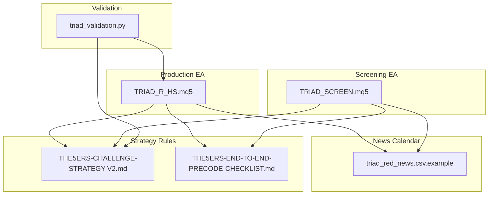
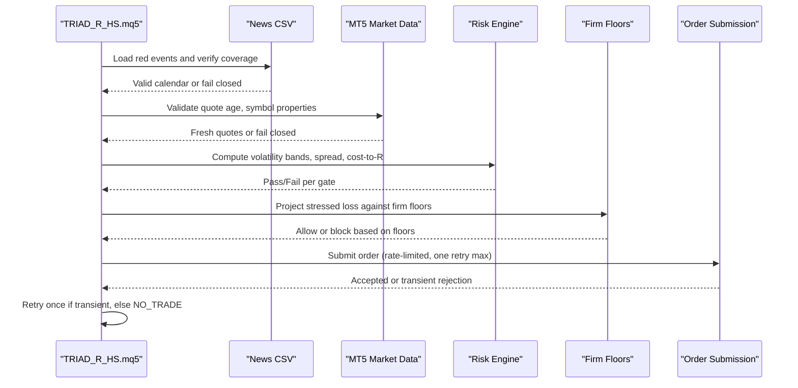
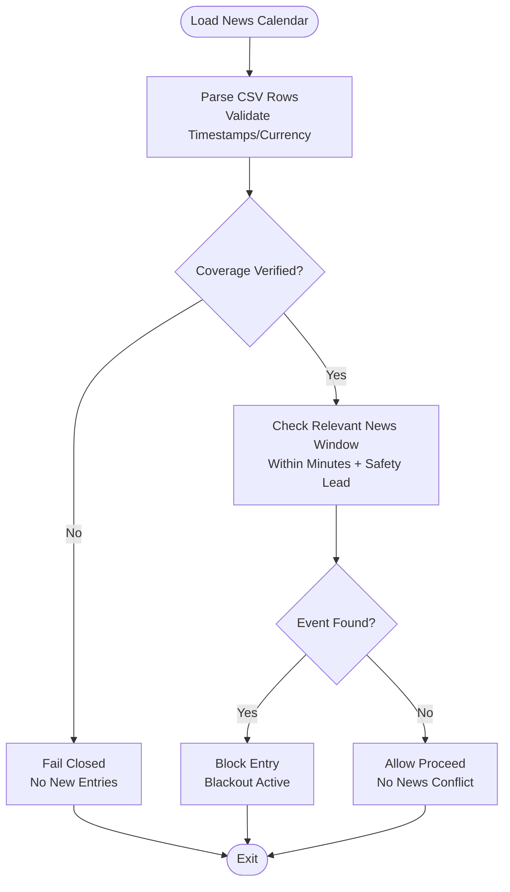
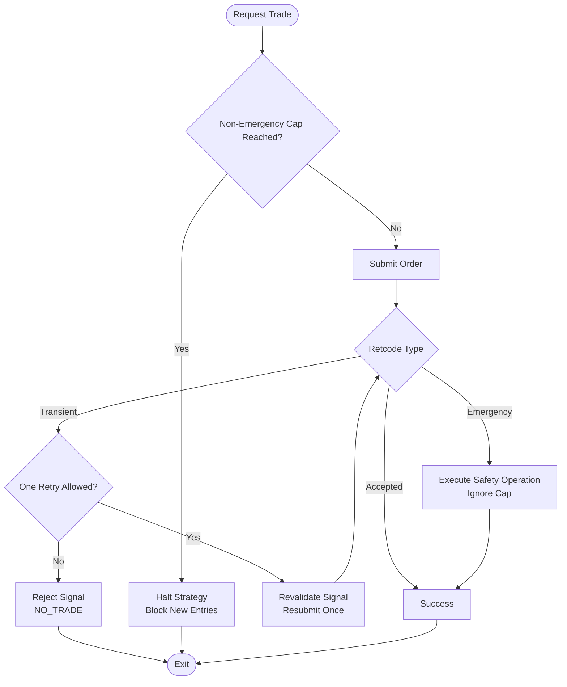
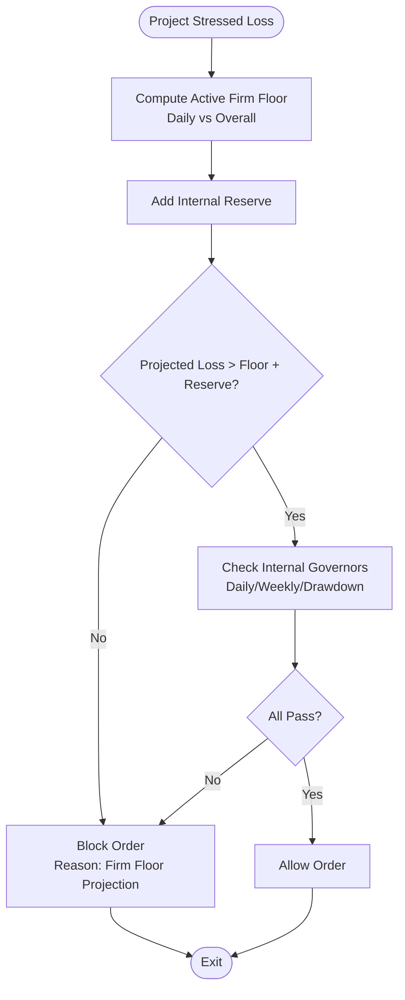
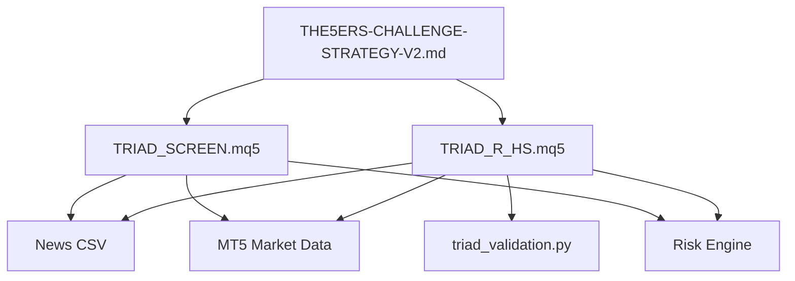

# Compliance Gates

<cite>
**Referenced Files in This Document**
- [TRIAD_R_HS.mq5](file://MQL5/Experts/TRIAD_R_HS/TRIAD_R_HS.mq5)
- [TRIAD_SCREEN.mq5](file://MQL5/Experts/TRIAD_SCREEN/TRIAD_SCREEN.mq5)
- [triad_red_news.csv.example](file://MQL5/Files/triad_red_news.csv.example)
- [THE5ERS-CHALLENGE-STRATEGY-V2.md](file://THE5ERS-CHALLENGE-STRATEGY-V2.md)
- [THE5ERS-END-TO-END-PRECODE-CHECKLIST.md](file://THE5ERS-END-TO-END-PRECODE-CHECKLIST.md)
- [THE5ERS-HIGH-STAKES-RESEARCH.md](file://THE5ERS-HIGH-STAKES-RESEARCH.md)
- [triad_validation.py](file://tools/triad_validation.py)
</cite>

## Table of Contents
1. Introduction
2. Project Structure
3. Core Components
4. Architecture Overview
5. Detailed Component Analysis
6. Dependency Analysis
7. Performance Considerations
8. Troubleshooting Guide
9. Conclusion

## Introduction
This document explains the compliance gates that protect The5ers High Stakes evaluation and funded operation for the TRIAD-R strategy. It focuses on:
- The 13 mandatory pre-signal gates, including instrument/session validation, account state checks, volatility filters, spread limits, news blackout periods, execution health monitoring, and firm floor protection.
- Economic calendar integration using Forex Factory red-folder events with 30-minute blackouts and USD currency restrictions.
- Rate limiting mechanisms that prevent more than one revalidated retry after transient rejection and cap non-emergency trade requests at 20 per server day.
- Prohibited practices such as grid/martingale strategies, simultaneous positions, high-frequency trading, and unauthorized parameter changes.
- Gate validation logic examples and fail-closed behavior when any gate fails.
- Edge-case handling for unavailable calendars, stale quotes, and platform connectivity issues.

The goal is to make compliance enforcement explicit, auditable, and safe under live market conditions.

## Project Structure
The compliance system spans two MQL5 Expert Advisors and supporting documentation:
- Production EA: TRIAD_R_HS.mq5 implements the canonical rules, lifecycle locks, accounting, news calendar, rate limiting, and safety controls.
- Screening EA: TRIAD_SCREEN.mq5 mirrors core logic for demo screening and dashboard reporting without production persistence.
- News calendar example: triad_red_news.csv.example defines the expected CSV schema used by both EAs.
- Strategy specification: THE5ERS-CHALLENGE-STRATEGY-V2.md defines the 13 mandatory gates, risk engine, daily state machine, and prohibited practices.
- Pre-code checklist: THE5ERS-END-TO-END-PRECODE-CHECKLIST.md maps each stage to required runtime behaviors and failure responses.
- Validation tooling: triad_validation.py provides offline gate verification and combined verdicts for release readiness.

**Diagram sources**
- [TRIAD_R_HS.mq5:1-120](file://MQL5/Experts/TRIAD_R_HS/TRIAD_R_HS.mq5#L1-L120)
- [TRIAD_SCREEN.mq5:1-150](file://MQL5/Experts/TRIAD_SCREEN/TRIAD_SCREEN.mq5#L1-L150)
- [triad_red_news.csv.example:1-7](file://MQL5/Files/triad_red_news.csv.example#L1-L7)
- [THE5ERS-CHALLENGE-STRATEGY-V2.md:74-95](file://THE5ERS-CHALLENGE-STRATEGY-V2.md#L74-L95)
- [THE5ERS-END-TO-END-PRECODE-CHECKLIST.md:121-145](file://THE5ERS-END-TO-END-PRECODE-CHECKLIST.md#L121-L145)
- [triad_validation.py:899-919](file://tools/triad_validation.py#L899-L919)

**Section sources**
- [TRIAD_R_HS.mq5:1-120](file://MQL5/Experts/TRIAD_R_HS/TRIAD_R_HS.mq5#L1-L120)
- [TRIAD_SCREEN.mq5:1-150](file://MQL5/Experts/TRIAD_SCREEN/TRIAD_SCREEN.mq5#L1-L150)
- [triad_red_news.csv.example:1-7](file://MQL5/Files/triad_red_news.csv.example#L1-L7)
- [THE5ERS-CHALLENGE-STRATEGY-V2.md:74-95](file://THE5ERS-CHALLENGE-STRATEGY-V2.md#L74-L95)
- [THE5ERS-END-TO-END-PRECODE-CHECKLIST.md:121-145](file://THE5ERS-END-TO-END-PRECODE-CHECKLIST.md#L121-L145)
- [triad_validation.py:899-919](file://tools/triad_validation.py#L899-L919)

## Core Components
- Mandatory pre-signal gates: 13 strict checks must pass before any order submission. These include session/instrument enablement, account mutex, volatility bands, spread limits, cost-to-R caps, news blackout, data freshness, execution health, stop geometry, volume sizing, target room, and firm floor projection.
- Economic calendar: Loads a CSV of red/high impact events, enforces coverage through a declared timestamp, applies 30-minute blackout windows around relevant events, and treats unavailable or stale calendars as a fail-closed condition.
- Rate limiting: Caps non-emergency trade requests at 20 per server day, allows only one revalidated retry after transient rejection, and preserves emergency safety operations regardless of the cap.
- Firm floor protection: Computes active firm floor from rollover balance/equity and static overall floor, adds an internal reserve, and blocks orders if projected stressed loss would breach floors.
- Fail-closed design: Any gate failure results in NO_TRADE; there is no override score. Persistent state, identity hashes, and halt latches ensure restarts cannot silently bypass protections.

**Section sources**
- [THE5ERS-CHALLENGE-STRATEGY-V2.md:74-95](file://THE5ERS-CHALLENGE-STRATEGY-V2.md#L74-L95)
- [THE5ERS-END-TO-END-PRECODE-CHECKLIST.md:121-145](file://THE5ERS-END-TO-END-PRECODE-CHECKLIST.md#L121-L145)
- [TRIAD_R_HS.mq5:798-995](file://MQL5/Experts/TRIAD_R_HS/TRIAD_R_HS.mq5#L798-L995)
- [TRIAD_R_HS.mq5:2527-2600](file://MQL5/Experts/TRIAD_R_HS/TRIAD_R_HS.mq5#L2527-L2600)
- [TRIAD_R_HS.mq5:1696-1712](file://MQL5/Experts/TRIAD_R_HS/TRIAD_R_HS.mq5#L1696-L1712)

## Architecture Overview
The compliance architecture enforces safety at multiple layers:
- Inputs and configuration are hashed and validated to prevent unauthorized changes.
- Account identity and lifecycle locks ensure only authorized instances operate on the correct account/server/product.
- Session bounds and instrument enablement restrict trading to approved combinations.
- Volatility and spread filters reject unsuitable market conditions.
- News calendar integration prevents entries near red events and enforces coverage requirements.
- Execution health checks validate latency and slippage bounds.
- Sizing and target-room checks ensure trades fit within risk budgets and reference ranges.
- Firm floor projections block orders that could breach daily or overall limits.
- Rate limiting and retry policies control request frequency while preserving emergency actions.

**Diagram sources**
- [TRIAD_R_HS.mq5:798-995](file://MQL5/Experts/TRIAD_R_HS/TRIAD_R_HS.mq5#L798-L995)
- [TRIAD_R_HS.mq5:2527-2600](file://MQL5/Experts/TRIAD_R_HS/TRIAD_R_HS.mq5#L2527-L2600)
- [TRIAD_R_HS.mq5:1696-1712](file://MQL5/Experts/TRIAD_R_HS/TRIAD_R_HS.mq5#L1696-L1712)
- [THE5ERS-CHALLENGE-STRATEGY-V2.md:74-95](file://THE5ERS-CHALLENGE-STRATEGY-V2.md#L74-L95)

## Detailed Component Analysis

### 13 Mandatory Pre-Signal Gates
Every gate must pass; there is no override. The gates cover:
1. Instrument/session enabled by locked configuration.
2. No working entry or open position account-wide.
3. Reference-range width within historical percentile band from prior 60 comparable sessions.
4. ATR(M15,14) within historical percentile band from prior 60 comparable session opens.
5. Spread no more than 1.5× its median for same symbol and minute-of-session over prior 60 sessions.
6. Estimated all-in round-trip cost no more than 0.10R.
7. No red-folder event for either currency within 30 minutes; USD restrictions apply to every USD pair; unavailable calendar fails closed.
8. Quote age, bar state, symbol properties, and calendar state valid.
9. Measured execution health inside tested latency/slippage bounds.
10. Stop and target prices satisfy live MT5 stop/freeze levels.
11. Rounded volume does not exceed active risk tier.
12. Planned target fits inside reference range.
13. Projected stressed loss remains above all internal and firm safety floors.

These gates are enforced in the production EA via input validation, session bounds, volatility/spread checks, news calendar integration, execution health monitoring, sizing logic, and firm floor projection.

**Section sources**
- [THE5ERS-CHALLENGE-STRATEGY-V2.md:74-95](file://THE5ERS-CHALLENGE-STRATEGY-V2.md#L74-L95)
- [THE5ERS-END-TO-END-PRECODE-CHECKLIST.md:121-145](file://THE5ERS-END-TO-END-PRECODE-CHECKLIST.md#L121-L145)
- [TRIAD_R_HS.mq5:3586-3597](file://MQL5/Experts/TRIAD_R_HS/TRIAD_R_HS.mq5#L3586-L3597)

### Economic Calendar Integration
The economic calendar uses a CSV file with columns: utc_time, currency, impact, title. Only RED/HIGH events are loaded. Coverage must be verified through a declared timestamp, and runtime coverage must remain current. Blackout windows are applied around relevant events for both currencies in the pair, with USD restrictions applying to every USD pair. Unavailable or stale calendars fail closed.

Key behaviors:
- Load and parse CSV rows, validate timestamps and currency codes.
- Track declared coverage end and enforce required coverage hours.
- Check upcoming/relevant news within configured minutes plus a small safety lead.
- Treat calendar_unavailable_or_stale as a blocking condition for new entries.

**Diagram sources**
- [triad_red_news.csv.example:1-7](file://MQL5/Files/triad_red_news.csv.example#L1-L7)
- [TRIAD_R_HS.mq5:798-995](file://MQL5/Experts/TRIAD_R_HS/TRIAD_R_HS.mq5#L798-L995)
- [TRIAD_SCREEN.mq5:887-998](file://MQL5/Experts/TRIAD_SCREEN/TRIAD_SCREEN.mq5#L887-L998)

**Section sources**
- [triad_red_news.csv.example:1-7](file://MQL5/Files/triad_red_news.csv.example#L1-L7)
- [TRIAD_R_HS.mq5:798-995](file://MQL5/Experts/TRIAD_R_HS/TRIAD_R_HS.mq5#L798-L995)
- [TRIAD_SCREEN.mq5:887-998](file://MQL5/Experts/TRIAD_SCREEN/TRIAD_SCREEN.mq5#L887-L998)
- [THE5ERS-HIGH-STAKES-RESEARCH.md:100-117](file://THE5ERS-HIGH-STAKES-RESEARCH.md#L100-L117)

### Rate Limiting Mechanisms
Rate limiting prevents excessive order traffic and ensures orderly execution:
- Non-emergency trade requests capped at 20 per server day.
- One revalidated retry allowed after transient rejection codes.
- Emergency safety operations (cancellations, closes, repairs) are never blocked by the cap.
- Request counts are persisted and included in state signatures to prevent tampering.

Transient rejection codes include requote, timeout, price changed/off, too many requests, locked, and connection errors. After a transient rejection, the EA performs one delayed, fully revalidated retry. If it fails again, the signal is rejected.

**Diagram sources**
- [TRIAD_R_HS.mq5:2527-2600](file://MQL5/Experts/TRIAD_R_HS/TRIAD_R_HS.mq5#L2527-L2600)
- [THE5ERS-CHALLENGE-STRATEGY-V2.md:47-50](file://THE5ERS-CHALLENGE-STRATEGY-V2.md#L47-L50)
- [THE5ERS-END-TO-END-PRECODE-CHECKLIST.md:165-179](file://THE5ERS-END-TO-END-PRECODE-CHECKLIST.md#L165-L179)

**Section sources**
- [TRIAD_R_HS.mq5:2527-2600](file://MQL5/Experts/TRIAD_R_HS/TRIAD_R_HS.mq5#L2527-L2600)
- [THE5ERS-CHALLENGE-STRATEGY-V2.md:47-50](file://THE5ERS-CHALLENGE-STRATEGY-V2.md#L47-L50)
- [THE5ERS-END-TO-END-PRECODE-CHECKLIST.md:165-179](file://THE5ERS-END-TO-END-PRECODE-CHECKLIST.md#L165-L179)

### Firm Floor Protection
Firm floor protection ensures orders do not breach daily or overall limits:
- Daily floor computed as higher of rollover balance or equity multiplied by 0.95.
- Overall floor computed as phase initial balance multiplied by 0.90.
- Active floor is the more restrictive of daily or overall.
- Internal reserve added to active floor, greater of 0.5% of phase initial balance or twice configured one-trade slippage reserve.
- Projected stressed loss must remain above active floor plus reserve.

Additional internal governors include daily stop (-1%), weekly stop (-2%), and strategy drawdown shutdown (5%). These are checked before every order and continuously during holding.

**Diagram sources**
- [TRIAD_R_HS.mq5:1696-1712](file://MQL5/Experts/TRIAD_R_HS/TRIAD_R_HS.mq5#L1696-L1712)
- [TRIAD_SCREEN.mq5:1827-1852](file://MQL5/Experts/TRIAD_SCREEN/TRIAD_SCREEN.mq5#L1827-L1852)
- [THE5ERS-CHALLENGE-STRATEGY-V2.md:272-296](file://THE5ERS-CHALLENGE-STRATEGY-V2.md#L272-L296)

**Section sources**
- [TRIAD_R_HS.mq5:1696-1712](file://MQL5/Experts/TRIAD_R_HS/TRIAD_R_HS.mq5#L1696-L1712)
- [TRIAD_SCREEN.mq5:1827-1852](file://MQL5/Experts/TRIAD_SCREEN/TRIAD_SCREEN.mq5#L1827-L1852)
- [THE5ERS-CHALLENGE-STRATEGY-V2.md:272-296](file://THE5ERS-CHALLENGE-STRATEGY-V2.md#L272-L296)

### Compliance Requirements and Prohibited Practices
Prohibited practices are strictly enforced:
- No grid, martingale, averaging, hedge, recovery trade, HFT, tick scalping, arbitrage, emulator, or stealth stop.
- No simultaneous positions or separate target tickets.
- No new entry or working entry order within 30 minutes of relevant red-folder news.
- No market chase after expired limit.
- Maximum two completed sequential trades per server day.
- Volume always rounded down; never increase size to satisfy profitable-day threshold.
- Runtime optimization and automatic parameter mutation disabled.
- Unauthorized parameter changes blocked by configuration hash validation.

These prohibitions are embedded in the strategy specification and enforced by input validation, session constraints, news blackout checks, and configuration integrity.

**Section sources**
- [THE5ERS-CHALLENGE-STRATEGY-V2.md:32-50](file://THE5ERS-CHALLENGE-STRATEGY-V2.md#L32-L50)
- [THE5ERS-END-TO-END-PRECODE-CHECKLIST.md:52-74](file://THE5ERS-END-TO-END-PRECODE-CHECKLIST.md#L52-L74)
- [TRIAD_R_HS.mq5:3586-3597](file://MQL5/Experts/TRIAD_R_HS/TRIAD_R_HS.mq5#L3586-L3597)

### Gate Validation Logic Examples
Examples of gate validation logic include:
- Session bounds: Compute London/New York civil-time ranges and convert to server time using DST-aware functions.
- Volatility filters: Calculate ATR(M15,14) percentiles from prior 60 comparable session opens and compare against configured bands.
- Spread limits: Measure current spread and compare to median spread for same symbol and minute-of-session over prior 60 sessions.
- Cost-to-R: Estimate all-in round-trip cost including commission and slippage reserve, ensure ≤0.10R.
- News blackout: Check upcoming/relevant news within 30 minutes plus safety lead; treat unavailable calendar as blocking.
- Execution health: Validate quote age, bar state, symbol properties, and measured latency/slippage bounds.
- Stop geometry: Ensure stop distance within 0.60-1.50 × ATR(M15,14) and satisfies live stop/freeze levels.
- Volume sizing: Round down to valid step, ensure within active risk tier, skip if minimum lot exceeds budget.
- Target room: Verify planned target fits inside reference range relative to opposite extreme.
- Firm floor projection: Project stressed loss against active firm floor plus reserve; block if breached.

Each gate returns a boolean pass/fail; any failure results in NO_TRADE.

**Section sources**
- [TRIAD_R_HS.mq5:754-789](file://MQL5/Experts/TRIAD_R_HS/TRIAD_R_HS.mq5#L754-L789)
- [TRIAD_R_HS.mq5:798-995](file://MQL5/Experts/TRIAD_R_HS/TRIAD_R_HS.mq5#L798-L995)
- [THE5ERS-CHALLENGE-STRATEGY-V2.md:74-95](file://THE5ERS-CHALLENGE-STRATEGY-V2.md#L74-L95)
- [THE5ERS-END-TO-END-PRECODE-CHECKLIST.md:121-145](file://THE5ERS-END-TO-END-PRECODE-CHECKLIST.md#L121-L145)

### Fail-Closed Behavior
The system fails closed when any gate condition is not met:
- Configuration hash mismatch blocks new orders.
- Stale quote/bar blocks new orders but leaves existing broker stops intact.
- Calendar missing/stale blocks new orders.
- Server rollover mismatch blocks new orders and triggers reconciliation.
- Order rejected allows one delayed, fully revalidated retry maximum.
- Visible stop missing triggers one correction attempt; otherwise close and halt.
- Duplicate/multiple positions trigger cancel entries, flatten safely, and halt.
- Request cap reached blocks entries but never suppresses safety cancel/close.
- Daily/weekly/strategy floor blocks entries and locks relevant period.
- Firm-floor danger blocks new orders and triggers emergency exposure reduction.
- EA/VPS restart reconstructs from broker state before action.
- Manual trade detected halts and requires reconciliation.

Fail-closed behavior is enforced through persistent state, identity hashes, halt latches, and global variable checks.

**Section sources**
- [TRIAD_R_HS.mq5:3586-3597](file://MQL5/Experts/TRIAD_R_HS/TRIAD_R_HS.mq5#L3586-L3597)
- [TRIAD_R_HS.mq5:1714-1730](file://MQL5/Experts/TRIAD_R_HS/TRIAD_R_HS.mq5#L1714-L1730)
- [THE5ERS-END-TO-END-PRECODE-CHECKLIST.md:319-338](file://THE5ERS-END-TO-END-PRECODE-CHECKLIST.md#L319-L338)

### Edge Case Handling
Edge cases are handled conservatively:
- Unavailable calendars: Treat as blocking condition; no new entries until coverage verified.
- Stale quotes: Block new orders; existing broker stops remain unaffected.
- Platform connectivity issues: Classify as transient rejection; allow one revalidated retry; otherwise reject.
- Partial fills: Reconcile actual risk/position count immediately; multiple-position state triggers flatten/halt.
- Missing visible stop: One immediate correction attempt; if unsuccessful, close and halt.
- Rollover mismatches: Block new orders; reconcile state and persist boundaries.
- External cashflow detection: Mark baseline invalid; require rebaseline or halt.

These edge cases are implemented through robust error handling, logging, and fail-closed transitions.

**Section sources**
- [TRIAD_R_HS.mq5:798-995](file://MQL5/Experts/TRIAD_R_HS/TRIAD_R_HS.mq5#L798-L995)
- [TRIAD_R_HS.mq5:2527-2600](file://MQL5/Experts/TRIAD_R_HS/TRIAD_R_HS.mq5#L2527-L2600)
- [THE5ERS-END-TO-END-PRECODE-CHECKLIST.md:319-338](file://THE5ERS-END-TO-END-PRECODE-CHECKLIST.md#L319-L338)

## Dependency Analysis
The compliance system has clear dependencies between components:
- Production EA depends on news calendar CSV for blackout enforcement.
- Both EAs depend on MT5 market data for quote validation and execution health.
- Risk engine depends on symbol specifications, commission, and slippage parameters.
- Validation tooling depends on strategy specification and simulation results.
- Configuration integrity depends on hash validation and identity checks.

**Diagram sources**
- [TRIAD_R_HS.mq5:798-995](file://MQL5/Experts/TRIAD_R_HS/TRIAD_R_HS.mq5#L798-L995)
- [TRIAD_SCREEN.mq5:887-998](file://MQL5/Experts/TRIAD_SCREEN/TRIAD_SCREEN.mq5#L887-L998)
- [triad_validation.py:899-919](file://tools/triad_validation.py#L899-L919)
- [THE5ERS-CHALLENGE-STRATEGY-V2.md:74-95](file://THE5ERS-CHALLENGE-STRATEGY-V2.md#L74-L95)

**Section sources**
- [TRIAD_R_HS.mq5:798-995](file://MQL5/Experts/TRIAD_R_HS/TRIAD_R_HS.mq5#L798-L995)
- [TRIAD_SCREEN.mq5:887-998](file://MQL5/Experts/TRIAD_SCREEN/TRIAD_SCREEN.mq5#L887-L998)
- [triad_validation.py:899-919](file://tools/triad_validation.py#L899-L919)
- [THE5ERS-CHALLENGE-STRATEGY-V2.md:74-95](file://THE5ERS-CHALLENGE-STRATEGY-V2.md#L74-L95)

## Performance Considerations
Compliance gates add minimal overhead but provide critical safety:
- News calendar loading occurs at initialization and refresh intervals; performance impact is negligible compared to market data calls.
- Volatility and spread calculations use cached historical data from prior sessions; computations are lightweight.
- Rate limiting prevents excessive network calls and reduces server load.
- Fail-closed behavior avoids costly mistakes that could result in rule violations or financial loss.
- Logging and persistence operations are optimized to avoid blocking critical paths.

Performance tuning should focus on efficient data access and avoiding unnecessary recalculations rather than removing safety checks.

[No sources needed since this section provides general guidance]

## Troubleshooting Guide
Common issues and resolutions:
- News calendar unavailable: Verify CSV file exists, contains valid timestamps and currency codes, and includes coverage declaration. Check required coverage hours and update feed as needed.
- Stale quotes: Ensure MT5 connection is stable and symbols are available. Check quote age thresholds and adjust if necessary.
- Order rejections: Review transient rejection codes and implement proper retry logic. Ensure signals are revalidated before resubmission.
- Firm floor breaches: Adjust risk sizing, reduce exposure, or halt strategy if projected losses approach limits.
- Configuration mismatches: Verify build ID, profile settings, and account identity match authorized records. Reset state only through authorized processes.
- Duplicate positions: Immediately cancel entries, flatten positions safely, and halt for reconciliation.

Use audit logs and dashboard reports to track gate failures and operational events.

**Section sources**
- [TRIAD_R_HS.mq5:798-995](file://MQL5/Experts/TRIAD_R_HS/TRIAD_R_HS.mq5#L798-L995)
- [TRIAD_R_HS.mq5:2527-2600](file://MQL5/Experts/TRIAD_R_HS/TRIAD_R_HS.mq5#L2527-L2600)
- [THE5ERS-END-TO-END-PRECODE-CHECKLIST.md:319-338](file://THE5ERS-END-TO-END-PRECODE-CHECKLIST.md#L319-L338)

## Conclusion
The compliance gates provide comprehensive protection for The5ers High Stakes evaluation and funded operation. The 13 mandatory pre-signal gates ensure trades meet strict criteria for instruments, sessions, volatility, spreads, costs, news, execution health, sizing, targets, and firm floors. Economic calendar integration prevents entries near red events with 30-minute blackouts and USD restrictions. Rate limiting controls request frequency while preserving emergency safety operations. Prohibited practices are strictly enforced through configuration validation, session constraints, and behavioral rules. The fail-closed design ensures safety under all conditions, including edge cases like unavailable calendars, stale quotes, and platform connectivity issues. This architecture balances compliance rigor with operational practicality, providing a robust foundation for successful challenge completion and funded trading.

[No sources needed since this section summarizes without analyzing specific files]