# Execution Health Monitoring

<cite>
**Referenced Files in This Document**
- [TRIAD_R_HS.mq5](file://MQL5/Experts/TRIAD_R_HS/TRIAD_R_HS.mq5)
- [triad_validation.py](file://tools/triad_validation.py)
</cite>

## Table of Contents
1. [Introduction](#introduction)
2. [Project Structure](#project-structure)
3. [Core Components](#core-components)
4. [Architecture Overview](#architecture-overview)
5. [Detailed Component Analysis](#detailed-component-analysis)
6. [Dependency Analysis](#dependency-analysis)
7. [Performance Considerations](#performance-considerations)
8. [Troubleshooting Guide](#troubleshooting-guide)
9. [Conclusion](#conclusion)

## Introduction
This document explains the execution health monitoring gates that protect order submission and live trading. It covers quote freshness, bar completion, symbol availability, measured execution health (latency and slippage), stop/target validation against broker constraints, volume sizing limits, target room checks for long and short trades, projected stressed loss floors, and fail-closed behavior when any gate fails.

## Project Structure
The execution health gates are implemented in the MQL5 expert advisor and validated by Python tools used in pre-deployment checks. The key runtime logic resides in the main expert file, while validation utilities enforce thresholds and report outcomes.

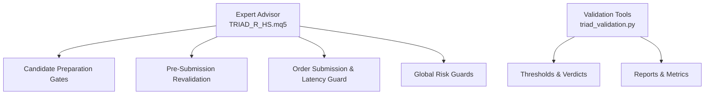

**Diagram sources**
- [TRIAD_R_HS.mq5:2380-2522](file://MQL5/Experts/TRIAD_R_HS/TRIAD_R_HS.mq5#L2380-L2522)
- [TRIAD_R_HS.mq5:2720-2900](file://MQL5/Experts/TRIAD_R_HS/TRIAD_R_HS.mq5#L2720-L2900)
- [triad_validation.py:888-919](file://tools/triad_validation.py#L888-L919)

**Section sources**
- [TRIAD_R_HS.mq5:2380-2522](file://MQL5/Experts/TRIAD_R_HS/TRIAD_R_HS.mq5#L2380-L2522)
- [TRIAD_R_HS.mq5:2720-2900](file://MQL5/Experts/TRIAD_R_HS/TRIAD_R_HS.mq5#L2720-L2900)
- [triad_validation.py:888-919](file://tools/triad_validation.py#L888-L919)

## Core Components
- Quote age validation ensures timely market data before decisions.
- Bar state verification confirms completed candles for reliable signals.
- Symbol property checks validate full trade mode and availability.
- Measured execution health enforces latency and slippage within tested bounds.
- Stop and target price validation against live MT5 stop/freeze levels prevents rejected orders.
- Rounded volume validation ensures it does not exceed active risk tier limits.
- Planned target room validation verifies sufficient distance for targets on both sides.
- Projected stressed loss validation maintains internal and firm safety floors.
- Fail-closed response halts or rejects when any gate condition fails.

**Section sources**
- [TRIAD_R_HS.mq5:1006-1012](file://MQL5/Experts/TRIAD_R_HS/TRIAD_R_HS.mq5#L1006-L1012)
- [TRIAD_R_HS.mq5:1086-1096](file://MQL5/Experts/TRIAD_R_HS/TRIAD_R_HS.mq5#L1086-L1096)
- [TRIAD_R_HS.mq5:2404-2414](file://MQL5/Experts/TRIAD_R_HS/TRIAD_R_HS.mq5#L2404-L2414)
- [TRIAD_R_HS.mq5:2720-2900](file://MQL5/Experts/TRIAD_R_HS/TRIAD_R_HS.mq5#L2720-L2900)
- [TRIAD_R_HS.mq5:2154-2204](file://MQL5/Experts/TRIAD_R_HS/TRIAD_R_HS.mq5#L2154-L2204)
- [TRIAD_R_HS.mq5:2181-2204](file://MQL5/Experts/TRIAD_R_HS/TRIAD_R_HS.mq5#L2181-L2204)
- [TRIAD_R_HS.mq5:2491-2517](file://MQL5/Experts/TRIAD_R_HS/TRIAD_R_HS.mq5#L2491-L2517)
- [TRIAD_R_HS.mq5:1685-1710](file://MQL5/Experts/TRIAD_R_HS/TRIAD_R_HS.mq5#L1685-L1710)

## Architecture Overview
The candidate preparation pipeline applies a sequence of gates to ensure only safe, executable setups proceed. A final revalidation occurs immediately before submission to account for rapidly changing conditions. If any gate fails, the system logs a rejection reason and refuses to submit, implementing a fail-closed policy.

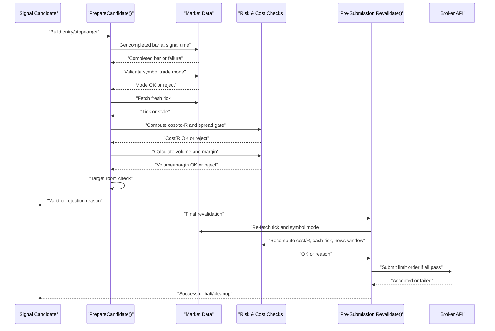

**Diagram sources**
- [TRIAD_R_HS.mq5:2380-2522](file://MQL5/Experts/TRIAD_R_HS/TRIAD_R_HS.mq5#L2380-L2522)
- [TRIAD_R_HS.mq5:2720-2900](file://MQL5/Experts/TRIAD_R_HS/TRIAD_R_HS.mq5#L2720-L2900)

## Detailed Component Analysis

### Quote Age Validation
Ensures the latest tick is fresh and valid before using it for cost and spread calculations.

- Freshness criteria include non-zero timestamps, valid bid/ask relationship, and age within configured maximum seconds.
- Used during candidate preparation and again just before submission to prevent stale pricing.

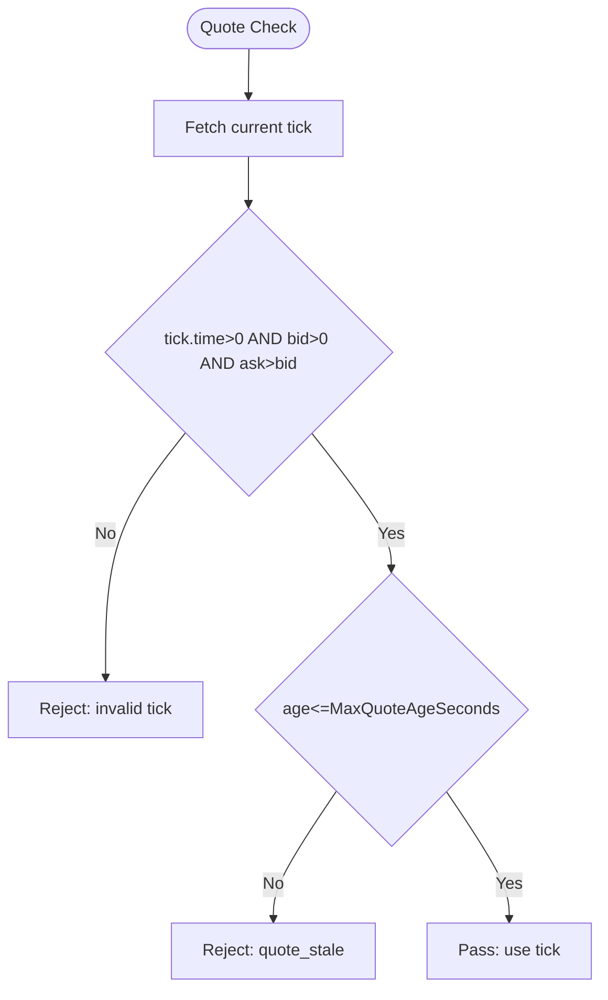

**Diagram sources**
- [TRIAD_R_HS.mq5:1006-1012](file://MQL5/Experts/TRIAD_R_HS/TRIAD_R_HS.mq5#L1006-L1012)

**Section sources**
- [TRIAD_R_HS.mq5:1006-1012](file://MQL5/Experts/TRIAD_R_HS/TRIAD_R_HS.mq5#L1006-L1012)
- [TRIAD_R_HS.mq5:2409-2414](file://MQL5/Experts/TRIAD_R_HS/TRIAD_R_HS.mq5#L2409-L2414)
- [TRIAD_R_HS.mq5:2749-2750](file://MQL5/Experts/TRIAD_R_HS/TRIAD_R_HS.mq5#L2749-L2750)

### Bar State Verification
Confirms that the displacement candle used for entry calculation is fully completed.

- Retrieves the exact M5 bar at the signal time and validates its completeness relative to current server time.
- Prevents decisions based on incomplete bars that could change.

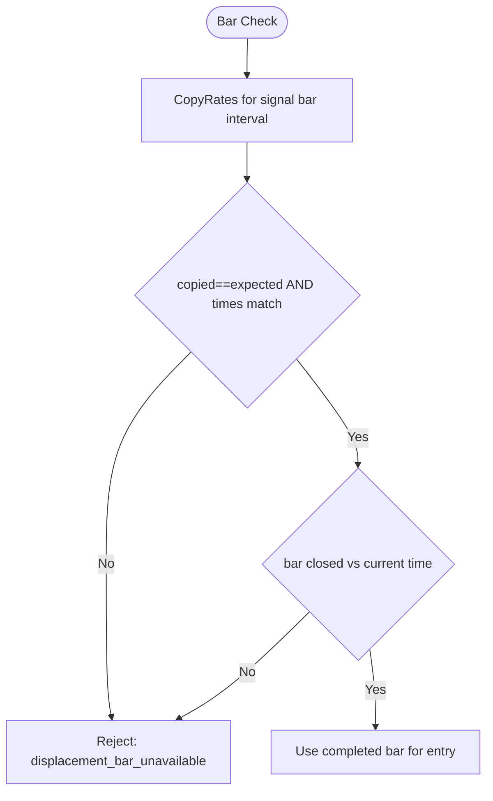

**Diagram sources**
- [TRIAD_R_HS.mq5:1086-1096](file://MQL5/Experts/TRIAD_R_HS/TRIAD_R_HS.mq5#L1086-L1096)

**Section sources**
- [TRIAD_R_HS.mq5:1086-1096](file://MQL5/Experts/TRIAD_R_HS/TRIAD_R_HS.mq5#L1086-L1096)
- [TRIAD_R_HS.mq5:2383-2389](file://MQL5/Experts/TRIAD_R_HS/TRIAD_R_HS.mq5#L2383-L2389)

### Symbol Property Checks
Validates contract specifications and trading availability.

- Ensures the symbol is in full trade mode; otherwise, the candidate is rejected.
- Confirms symbol point and spread metrics are usable for cost calculations.

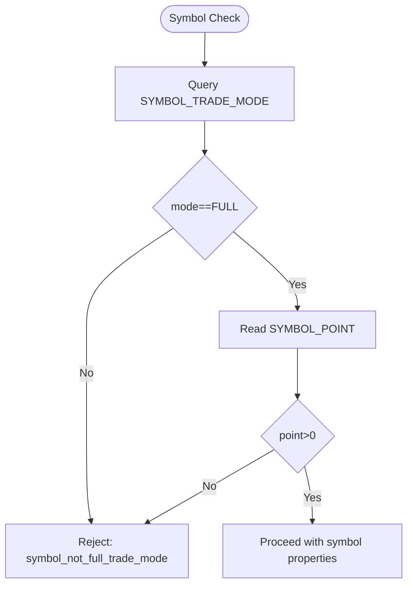

**Diagram sources**
- [TRIAD_R_HS.mq5:2404-2416](file://MQL5/Experts/TRIAD_R_HS/TRIAD_R_HS.mq5#L2404-L2416)

**Section sources**
- [TRIAD_R_HS.mq5:2404-2416](file://MQL5/Experts/TRIAD_R_HS/TRIAD_R_HS.mq5#L2404-L2416)
- [TRIAD_R_HS.mq5:2747-2755](file://MQL5/Experts/TRIAD_R_HS/TRIAD_R_HS.mq5#L2747-L2755)

### Measured Execution Health Assessment
Enforces latency and slippage constraints around order submission and cost modeling.

- Measures request latency from initiation to submission and halts if it exceeds configured limits.
- Computes cost-to-R including spread, slippage reserves, and commission; rejects if above threshold.
- Uses OrderCalcProfit to model adverse slippage and derive realistic cost-to-R.

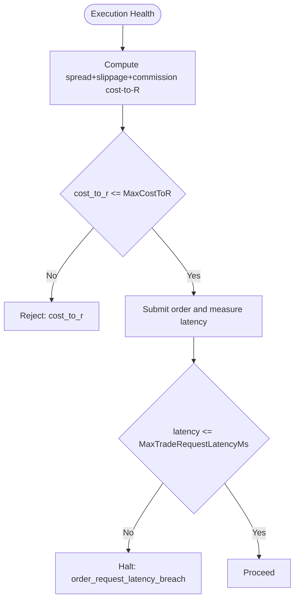

**Diagram sources**
- [TRIAD_R_HS.mq5:2181-2204](file://MQL5/Experts/TRIAD_R_HS/TRIAD_R_HS.mq5#L2181-L2204)
- [TRIAD_R_HS.mq5:2720-2900](file://MQL5/Experts/TRIAD_R_HS/TRIAD_R_HS.mq5#L2720-L2900)

**Section sources**
- [TRIAD_R_HS.mq5:2181-2204](file://MQL5/Experts/TRIAD_R_HS/TRIAD_R_HS.mq5#L2181-L2204)
- [TRIAD_R_HS.mq5:2720-2900](file://MQL5/Experts/TRIAD_R_HS/TRIAD_R_HS.mq5#L2720-L2900)

### Stop and Target Price Validation Against Live Levels
Prevents rejected orders by validating stops and targets against broker-imposed distances and freeze levels.

- Validates broker stop/freezing distances relative to current prices and candidate levels.
- Revalidates immediately before submission to capture live changes.

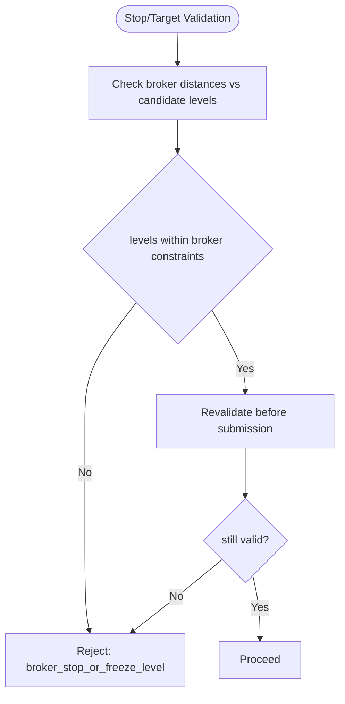

**Diagram sources**
- [TRIAD_R_HS.mq5:2154-2204](file://MQL5/Experts/TRIAD_R_HS/TRIAD_R_HS.mq5#L2154-L2204)
- [TRIAD_R_HS.mq5:2751-2752](file://MQL5/Experts/TRIAD_R_HS/TRIAD_R_HS.mq5#L2751-L2752)

**Section sources**
- [TRIAD_R_HS.mq5:2154-2204](file://MQL5/Experts/TRIAD_R_HS/TRIAD_R_HS.mq5#L2154-L2204)
- [TRIAD_R_HS.mq5:2751-2752](file://MQL5/Experts/TRIAD_R_HS/TRIAD_R_HS.mq5#L2751-L2752)

### Rounded Volume Validation Against Active Risk Tier Limits
Ensures calculated volume respects risk budgets and minimum lot requirements.

- Calculates volume based on budget derived from phase initial balance and active risk fraction.
- Rejects if volume cannot be computed or falls below minimum lot size.
- Confirms margin availability for the candidate volume.

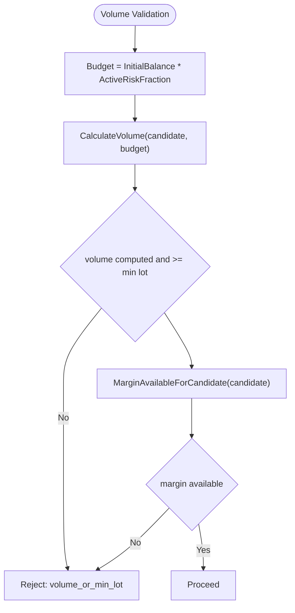

**Diagram sources**
- [TRIAD_R_HS.mq5:2480-2490](file://MQL5/Experts/TRIAD_R_HS/TRIAD_R_HS.mq5#L2480-L2490)
- [TRIAD_R_HS.mq5:2206-2220](file://MQL5/Experts/TRIAD_R_HS/TRIAD_R_HS.mq5#L2206-L2220)

**Section sources**
- [TRIAD_R_HS.mq5:2480-2490](file://MQL5/Experts/TRIAD_R_HS/TRIAD_R_HS.mq5#L2480-L2490)
- [TRIAD_R_HS.mq5:2206-2220](file://MQL5/Experts/TRIAD_R_HS/TRIAD_R_HS.mq5#L2206-L2220)

### Planned Target Room Validation
Verifies sufficient distance between entry and range extremes to accommodate the target.

- For longs: ensures range_high minus entry is greater than or equal to target minus entry.
- For shorts: ensures entry minus range_low is greater than or equal to entry minus target.
- Refreshes quote state prior to this check to avoid stale data.

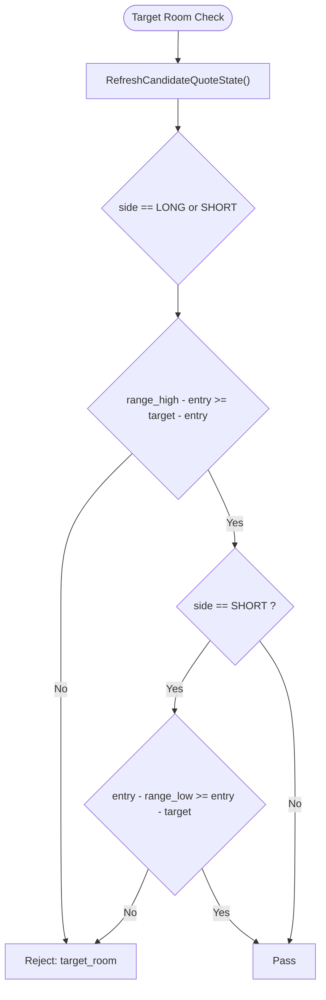

**Diagram sources**
- [TRIAD_R_HS.mq5:2496-2510](file://MQL5/Experts/TRIAD_R_HS/TRIAD_R_HS.mq5#L2496-L2510)

**Section sources**
- [TRIAD_R_HS.mq5:2496-2510](file://MQL5/Experts/TRIAD_R_HS/TRIAD_R_HS.mq5#L2496-L2510)

### Projected Stressed Loss Validation and Safety Floors
Maintains internal and firm safety floors through cash risk checks and global guards.

- Computes cash loss for the candidate volume including slippage reserve.
- Validates against active risk fraction and halts if exceeded.
- Enforces global risk guards including daily/weekly stops, external cash flow detection, and audit integrity.

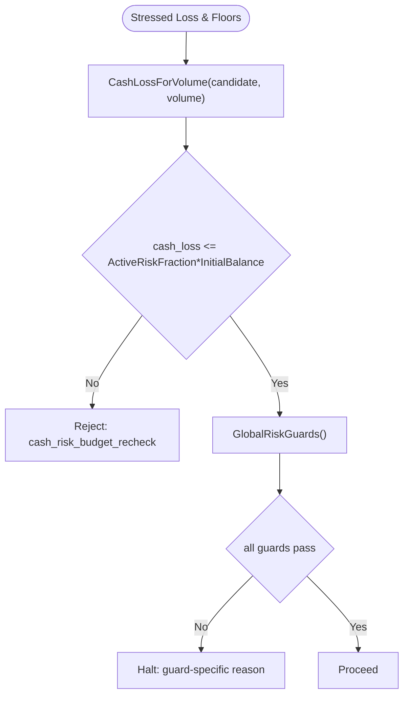

**Diagram sources**
- [TRIAD_R_HS.mq5:2760-2775](file://MQL5/Experts/TRIAD_R_HS/TRIAD_R_HS.mq5#L2760-L2775)
- [TRIAD_R_HS.mq5:1772-1807](file://MQL5/Experts/TRIAD_R_HS/TRIAD_R_HS.mq5#L1772-L1807)

**Section sources**
- [TRIAD_R_HS.mq5:2760-2775](file://MQL5/Experts/TRIAD_R_HS/TRIAD_R_HS.mq5#L2760-L2775)
- [TRIAD_R_HS.mq5:1772-1807](file://MQL5/Experts/TRIAD_R_HS/TRIAD_R_HS.mq5#L1772-L1807)

### Fail-Closed Response
When any gate fails, the system records a rejection reason and refuses to submit, often halting further activity until conditions resolve.

- Rejection reasons include quote staleness, symbol mode issues, spread anomalies, cost-to-R breaches, insufficient margin, target room failures, and broker distance violations.
- Pre-submission revalidation can also trigger a halt with detailed reasons such as expired candidates, terminal disconnection, or global risk guard failures.

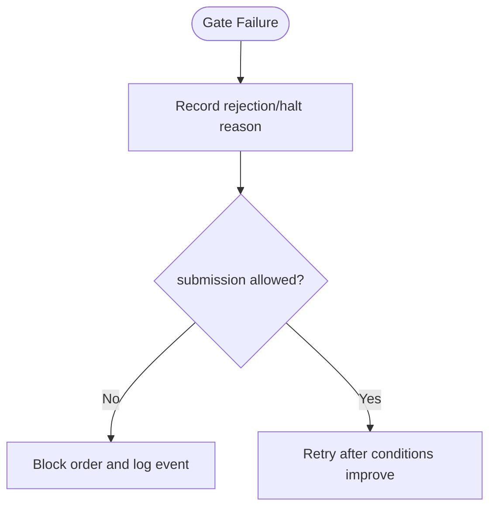

**Diagram sources**
- [TRIAD_R_HS.mq5:2380-2522](file://MQL5/Experts/TRIAD_R_HS/TRIAD_R_HS.mq5#L2380-L2522)
- [TRIAD_R_HS.mq5:2720-2900](file://MQL5/Experts/TRIAD_R_HS/TRIAD_R_HS.mq5#L2720-L2900)

**Section sources**
- [TRIAD_R_HS.mq5:2380-2522](file://MQL5/Experts/TRIAD_R_HS/TRIAD_R_HS.mq5#L2380-L2522)
- [TRIAD_R_HS.mq5:2720-2900](file://MQL5/Experts/TRIAD_R_HS/TRIAD_R_HS.mq5#L2720-L2900)

## Dependency Analysis
The execution health gates depend on market data functions, risk calculators, and global guards. Dependencies form a layered structure where each stage must succeed before proceeding to the next.

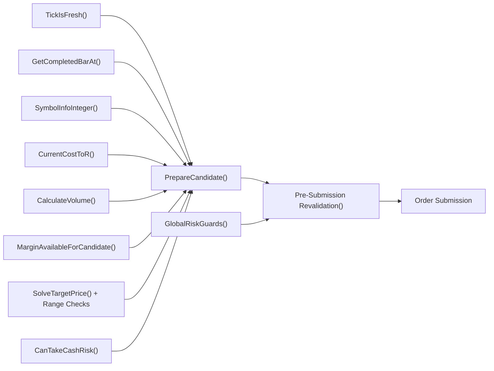

**Diagram sources**
- [TRIAD_R_HS.mq5:1006-1012](file://MQL5/Experts/TRIAD_R_HS/TRIAD_R_HS.mq5#L1006-L1012)
- [TRIAD_R_HS.mq5:1086-1096](file://MQL5/Experts/TRIAD_R_HS/TRIAD_R_HS.mq5#L1086-L1096)
- [TRIAD_R_HS.mq5:2181-2204](file://MQL5/Experts/TRIAD_R_HS/TRIAD_R_HS.mq5#L2181-L2204)
- [TRIAD_R_HS.mq5:2380-2522](file://MQL5/Experts/TRIAD_R_HS/TRIAD_R_HS.mq5#L2380-L2522)
- [TRIAD_R_HS.mq5:2720-2900](file://MQL5/Experts/TRIAD_R_HS/TRIAD_R_HS.mq5#L2720-L2900)

**Section sources**
- [TRIAD_R_HS.mq5:2380-2522](file://MQL5/Experts/TRIAD_R_HS/TRIAD_R_HS.mq5#L2380-L2522)
- [TRIAD_R_HS.mq5:2720-2900](file://MQL5/Experts/TRIAD_R_HS/TRIAD_R_HS.mq5#L2720-L2900)

## Performance Considerations
- Quote refreshes occur multiple times to avoid stale data, which adds overhead but improves safety.
- Historical statistics loading can delay first-quote freshness; explicit refresh mitigates this risk.
- Latency measurement around submission ensures performance remains within tested bounds; breaches trigger halts.
- Batch processing of candidates includes revalidation to prevent earlier candidates from winning on aged snapshots.

[No sources needed since this section provides general guidance]

## Troubleshooting Guide
Common rejection scenarios and their causes:

- Quote staleness: tick time too old or invalid bid/ask values.
- Symbol not full trade mode: symbol restricted or unavailable for trading.
- Spread gate: current spread exceeds median-based threshold.
- Cost-to-R breach: combined spread, slippage, and commission costs too high relative to risk.
- Volume or minimum lot: unable to compute volume or below minimum lot size.
- Insufficient margin: margin not available for proposed volume.
- Target calculation failure: inability to solve target price.
- Target room: insufficient distance between entry and range extremes for target placement.
- Broker stop or freeze level: candidate levels violate broker-imposed distances.
- News blackout: relevant news window blocks trading.
- Daily state or global risk guard: daily/weekly stops, external cash flow, or audit integrity issues.
- Order submission latency breach: request took too long, triggering a halt.

Fail-closed actions:
- Log rejection or halt reason.
- Cancel pending orders and close positions when necessary.
- Persist plan variables and clear them on failure to avoid inconsistent states.

**Section sources**
- [TRIAD_R_HS.mq5:2380-2522](file://MQL5/Experts/TRIAD_R_HS/TRIAD_R_HS.mq5#L2380-L2522)
- [TRIAD_R_HS.mq5:2720-2900](file://MQL5/Experts/TRIAD_R_HS/TRIAD_R_HS.mq5#L2720-L2900)
- [TRIAD_R_HS.mq5:1772-1807](file://MQL5/Experts/TRIAD_R_HS/TRIAD_R_HS.mq5#L1772-L1807)

## Conclusion
The execution health monitoring system implements a comprehensive set of gates to ensure safe, timely, and compliant order submission. By validating quotes, bars, symbols, costs, volumes, targets, and global risk conditions—and by enforcing strict latency and slippage bounds—the system minimizes the risk of rejected orders and protects capital. Fail-closed behavior guarantees that any violation results in immediate refusal or halt, preserving operational integrity.

[No sources needed since this section summarizes without analyzing specific files]