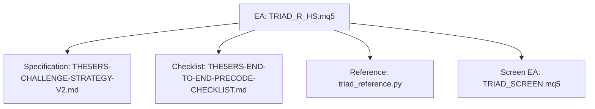
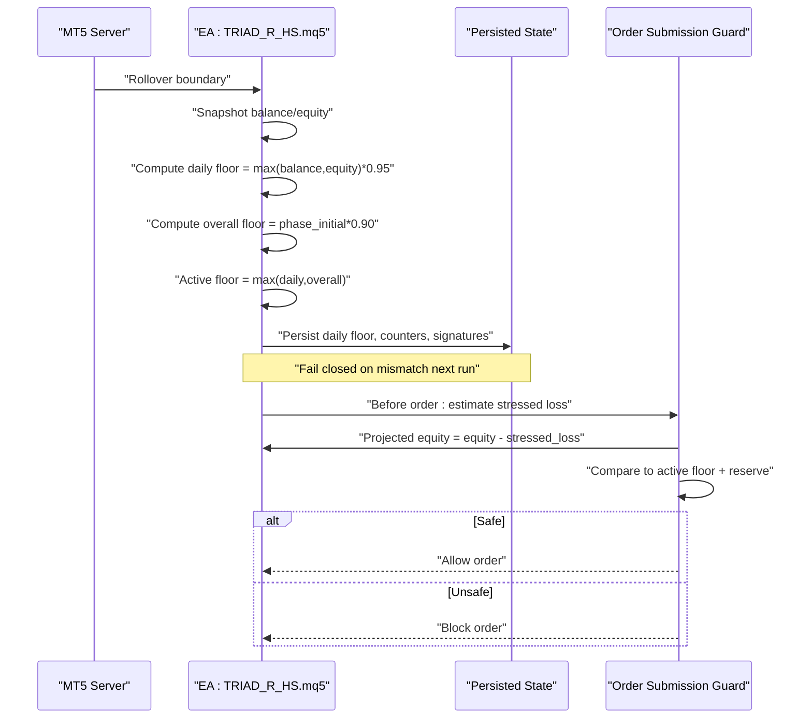
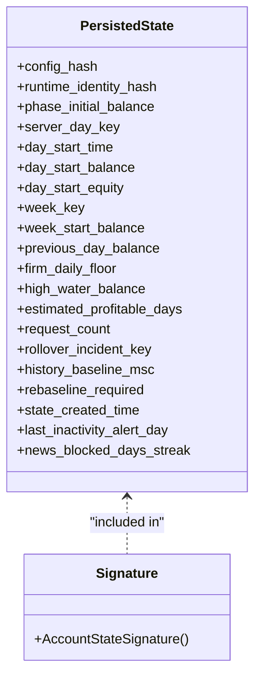
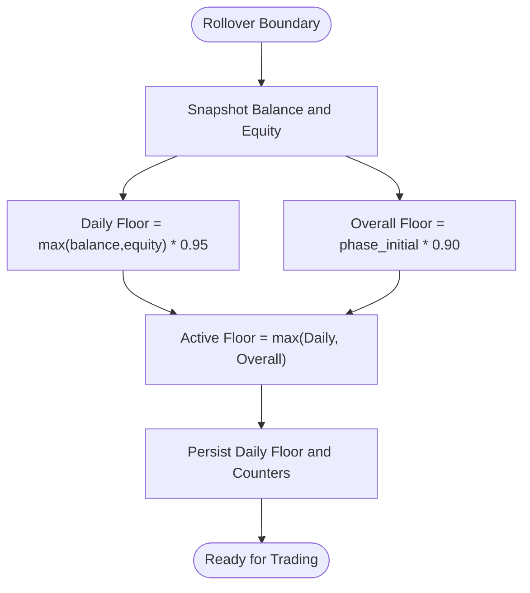
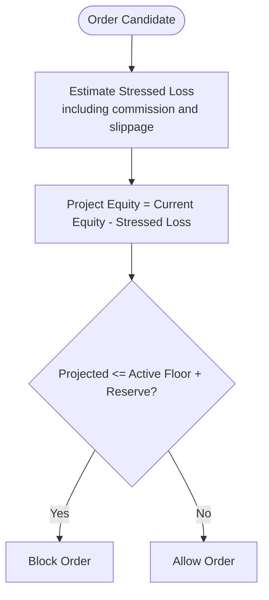
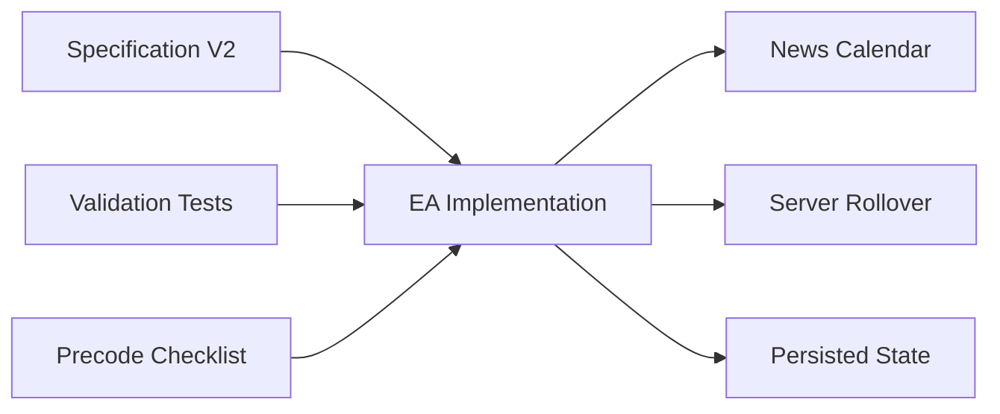

# Firm Floor Protection

<cite>
**Referenced Files in This Document**
- [TRIAD_R_HS.mq5](file://MQL5/Experts/TRIAD_R_HS/TRIAD_R_HS.mq5)
- [THE5ERS-CHALLENGE-STRATEGY-V2.md](file://THE5ERS-CHALLENGE-STRATEGY-V2.md)
- [THE5ERS-END-TO-END-PRECODE-CHECKLIST.md](file://THE5ERS-END-TO-END-PRECODE-CHECKLIST.md)
- [triad_reference.py](file://tests/triad_reference.py)
- [test_reference.py](file://tests/test_reference.py)
- [TRIAD_SCREEN.mq5](file://MQL5/Experts/TRIAD_SCREEN/TRIAD_SCREEN.mq5)
</cite>

## Table of Contents
1. Introduction
2. Project Structure
3. Core Components
4. Architecture Overview
5. Detailed Component Analysis
6. Dependency Analysis
7. Performance Considerations
8. Troubleshooting Guide
9. Conclusion
10. Appendices

## Introduction
This document explains the firm floor protection mechanisms that safeguard against account termination for the TRIAD-R High Stakes strategy. It covers persistence of critical account information, fail-closed mismatch detection, rollover-based floor calculations, active floor computation, order submission guards with reserve buffers, and phase-specific completion guards. It also provides examples of breach scenarios and emergency response procedures grounded in the repository’s specification and implementation.

## Project Structure
The firm floor protection is implemented primarily in the MQL5 Expert Advisor (EA) and governed by a canonical strategy specification. Supporting validation code and checklists provide independent verification and operational guidance.

**Diagram sources**
- [TRIAD_R_HS.mq5:1-200](file://MQL5/Experts/TRIAD_R_HS/TRIAD_R_HS.mq5#L1-L200)
- [THE5ERS-CHALLENGE-STRATEGY-V2.md:272-312](file://THE5ERS-CHALLENGE-STRATEGY-V2.md#L272-L312)
- [THE5ERS-END-TO-END-PRECODE-CHECKLIST.md:101-117](file://THE5ERS-END-TO-END-PRECODE-CHECKLIST.md#L101-L117)
- [triad_reference.py:91-103](file://tests/triad_reference.py#L91-L103)
- [TRIAD_SCREEN.mq5:3015-3052](file://MQL5/Experts/TRIAD_SCREEN/TRIAD_SCREEN.mq5#L3015-L3052)

**Section sources**
- [TRIAD_R_HS.mq5:1-200](file://MQL5/Experts/TRIAD_R_HS/TRIAD_R_HS.mq5#L1-L200)
- [THE5ERS-CHALLENGE-STRATEGY-V2.md:272-312](file://THE5ERS-CHALLENGE-STRATEGY-V2.md#L272-L312)
- [THE5ERS-END-TO-END-PRECODE-CHECKLIST.md:101-117](file://THE5ERS-END-TO-END-PRECODE-CHECKLIST.md#L101-L117)

## Core Components
- Persistent identity and state: account number/server, program/profile, phase, phase initial balance, selected base risk and exit configuration, configuration/build checksum, prior rollover balance/equity, day counters, weekly start, high-water mark, estimated profitable days, rollover incident flags, and request counts.
- Fail-closed mismatch detection: on any identity, config hash, or state signature mismatch, the EA halts and refuses to trade.
- Rollover floors: daily floor from rollover snapshot; overall floor from phase initial balance; active floor as the more restrictive of the two.
- Order submission guard: blocks orders if stressed projected loss could cross active floor plus reserve. Reserve is greater of 0.5% of phase initial balance or twice configured one-trade gap/slippage reserve.
- Phase completion guards: Phase 1 at $2,750 with three dashboard-confirmed qualifying days; Phase 2 at $2,625 with three dashboard-confirmed qualifying days.

**Section sources**
- [TRIAD_R_HS.mq5:405-428](file://MQL5/Experts/TRIAD_R_HS/TRIAD_R_HS.mq5#L405-L428)
- [TRIAD_R_HS.mq5:568-587](file://MQL5/Experts/TRIAD_R_HS/TRIAD_R_HS.mq5#L568-L587)
- [TRIAD_R_HS.mq5:3826-3860](file://MQL5/Experts/TRIAD_R_HS/TRIAD_R_HS.mq5#L3826-L3860)
- [TRIAD_R_HS.mq5:1674-1699](file://MQL5/Experts/TRIAD_R_HS/TRIAD_R_HS.mq5#L1674-L1699)
- [THE5ERS-CHALLENGE-STRATEGY-V2.md:272-312](file://THE5ERS-CHALLENGE-STRATEGY-V2.md#L272-L312)
- [triad_reference.py:91-103](file://tests/triad_reference.py#L91-L103)

## Architecture Overview
The EA enforces firm floor protection through a combination of persistent state, rollover reconciliation, and pre-order stress testing. At each server rollover, it snapshots balance and equity, computes daily and overall floors, and persists them. Before every order, it estimates the worst-case cash loss including commission and slippage and ensures projected equity remains above the active floor plus reserve.

**Diagram sources**
- [TRIAD_R_HS.mq5:3400-3514](file://MQL5/Experts/TRIAD_R_HS/TRIAD_R_HS.mq5#L3400-L3514)
- [TRIAD_R_HS.mq5:1674-1699](file://MQL5/Experts/TRIAD_R_HS/TRIAD_R_HS.mq5#L1674-L1699)
- [THE5ERS-CHALLENGE-STRATEGY-V2.md:285-295](file://THE5ERS-CHALLENGE-STRATEGY-V2.md#L285-L295)

## Detailed Component Analysis

### Persistence of Critical Account Information
- What is persisted:
  - Identity: login, server, currency, product code, phase.
  - Strategy selection: profile and exit configuration via configuration hash.
  - Phase baseline: phase initial balance.
  - Daily/weekly accounting: server day key, day start time/balance/equity, previous day balance, week key/start balance.
  - Floors and drawdown: firm daily floor, high-water balance.
  - Counters: estimated profitable days, request count, rollover incident key, history baseline timestamp, rebaseline flag, state creation time, inactivity alert day, news-block streak.
- How it is protected:
  - A state signature includes configuration hash, runtime identity, balances, timestamps, floors, and counters. On load, mismatches halt the EA.
  - External cashflow, unauthorized history, or rollover exposure incidents require migration/rebaseline and cannot be reset by ordinary halt clear.

**Diagram sources**
- [TRIAD_R_HS.mq5:405-428](file://MQL5/Experts/TRIAD_R_HS/TRIAD_R_HS.mq5#L405-L428)
- [TRIAD_R_HS.mq5:568-587](file://MQL5/Experts/TRIAD_R_HS/TRIAD_R_HS.mq5#L568-L587)
- [TRIAD_R_HS.mq5:3914-3943](file://MQL5/Experts/TRIAD_R_HS/TRIAD_R_HS.mq5#L3914-L3943)

**Section sources**
- [TRIAD_R_HS.mq5:405-428](file://MQL5/Experts/TRIAD_R_HS/TRIAD_R_HS.mq5#L405-L428)
- [TRIAD_R_HS.mq5:568-587](file://MQL5/Experts/TRIAD_R_HS/TRIAD_R_HS.mq5#L568-L587)
- [TRIAD_R_HS.mq5:3826-3860](file://MQL5/Experts/TRIAD_R_HS/TRIAD_R_HS.mq5#L3826-L3860)
- [TRIAD_R_HS.mq5:3914-3943](file://MQL5/Experts/TRIAD_R_HS/TRIAD_R_HS.mq5#L3914-L3943)
- [THE5ERS-CHALLENGE-STRATEGY-V2.md:272-284](file://THE5ERS-CHALLENGE-STRATEGY-V2.md#L272-L284)

### Fail-Closed Mismatch Detection
- Triggers:
  - Configuration hash mismatch between stored and current build.
  - Runtime identity mismatch (login/server/currency/product/phase).
  - Phase initial balance mismatch.
  - Incomplete or invalid persisted state fields.
  - State signature mismatch after loading.
- Behavior:
  - The EA logs an error and halts without trading.
  - Requires human review and authorized reinitialization or migration path.

**Section sources**
- [TRIAD_R_HS.mq5:3826-3860](file://MQL5/Experts/TRIAD_R_HS/TRIAD_R_HS.mq5#L3826-L3860)
- [TRIAD_R_HS.mq5:3914-3943](file://MQL5/Experts/TRIAD_R_HS/TRIAD_R_HS.mq5#L3914-L3943)
- [THE5ERS-CHALLENGE-STRATEGY-V2.md:272-284](file://THE5ERS-CHALLENGE-STRATEGY-V2.md#L272-L284)

### Rollover Calculation and Active Floor
- Daily floor: computed at confirmed server rollover using the higher of balance or equity at rollover multiplied by 0.95.
- Overall floor: static threshold based on phase initial balance multiplied by 0.90.
- Active floor: the more restrictive (higher) of daily and overall floors.
- If unexpected exposure exists at rollover, the EA preserves the higher boundary, marks an incident, defers flat snapshot until cleanup, and requires migration/rebaseline before continuing.

**Diagram sources**
- [TRIAD_R_HS.mq5:3400-3514](file://MQL5/Experts/TRIAD_R_HS/TRIAD_R_HS.mq5#L3400-L3514)
- [THE5ERS-CHALLENGE-STRATEGY-V2.md:285-295](file://THE5ERS-CHALLENGE-STRATEGY-V2.md#L285-L295)
- [triad_reference.py:91-103](file://tests/triad_reference.py#L91-L103)

**Section sources**
- [TRIAD_R_HS.mq5:3400-3514](file://MQL5/Experts/TRIAD_R_HS/TRIAD_R_HS.mq5#L3400-L3514)
- [THE5ERS-CHALLENGE-STRATEGY-V2.md:285-295](file://THE5ERS-CHALLENGE-STRATEGY-V2.md#L285-L295)
- [triad_reference.py:91-103](file://tests/triad_reference.py#L91-L103)

### Order Submission Guard with Reserve Buffer
- Reserve buffer: greater of 0.5% of phase initial balance or twice the configured one-trade gap/slippage reserve.
- Stress test: compute all-in loss including commission and stop slippage; project equity after loss.
- Guard rule: block order if projected equity can cross active floor plus reserve.
- Additional internal checks: daily stop projection and other internal governors are enforced alongside firm floors.

**Diagram sources**
- [TRIAD_R_HS.mq5:1674-1699](file://MQL5/Experts/TRIAD_R_HS/TRIAD_R_HS.mq5#L1674-L1699)
- [triad_reference.py:98-103](file://tests/triad_reference.py#L98-L103)
- [THE5ERS-CHALLENGE-STRATEGY-V2.md:295-295](file://THE5ERS-CHALLENGE-STRATEGY-V2.md#L295-L295)

**Section sources**
- [TRIAD_R_HS.mq5:1674-1699](file://MQL5/Experts/TRIAD_R_HS/TRIAD_R_HS.mq5#L1674-L1699)
- [triad_reference.py:98-103](file://tests/triad_reference.py#L98-L103)
- [THE5ERS-CHALLENGE-STRATEGY-V2.md:295-295](file://THE5ERS-CHALLENGE-STRATEGY-V2.md#L295-L295)

### Phase-Specific Completion Guards
- Phase 1: lock when balance reaches or exceeds $2,750 and three dashboard-confirmed qualifying days are recorded.
- Phase 2: lock when balance reaches or exceeds $2,625 and three dashboard-confirmed qualifying days are recorded.
- If target reached without confirmed days, enter a pending-days state requiring human review; no new trades to manufacture days.

**Section sources**
- [THE5ERS-CHALLENGE-STRATEGY-V2.md:297-312](file://THE5ERS-CHALLENGE-STRATEGY-V2.md#L297-L312)
- [test_reference.py:100-105](file://tests/test_reference.py#L100-L105)

### Rollover Exposure Handling and Migration Latch
- If exposure exists at rollover or was missed across offline periods, the EA:
  - Preserves the higher rollover boundary for the daily floor.
  - Marks a rollover incident and persists relevant state.
  - Requires migration/rebaseline and halts until reviewed.
  - Cancels pending orders and closes positions safely where possible.

**Section sources**
- [TRIAD_R_HS.mq5:3400-3469](file://MQL5/Experts/TRIAD_R_HS/TRIAD_R_HS.mq5#L3400-L3469)
- [TRIAD_SCREEN.mq5:3015-3052](file://MQL5/Experts/TRIAD_SCREEN/TRIAD_SCREEN.mq5#L3015-L3052)

## Dependency Analysis
- Specification-to-implementation alignment:
  - The EA references the canonical strategy specification for firm floors, reserves, and phase targets.
  - Validation tests implement identical arithmetic for floors and reserves, ensuring consistency.
- Operational dependencies:
  - News calendar must be valid; failures disable entries.
  - Server rollover boundary must be observed; local time is not used for resets.
  - Persisted state integrity is mandatory; mismatches halt trading.

**Diagram sources**
- [THE5ERS-CHALLENGE-STRATEGY-V2.md:272-312](file://THE5ERS-CHALLENGE-STRATEGY-V2.md#L272-L312)
- [triad_reference.py:91-103](file://tests/triad_reference.py#L91-L103)
- [THE5ERS-END-TO-END-PRECODE-CHECKLIST.md:101-117](file://THE5ERS-END-TO-END-PRECODE-CHECKLIST.md#L101-L117)

**Section sources**
- [THE5ERS-CHALLENGE-STRATEGY-V2.md:272-312](file://THE5ERS-CHALLENGE-STRATEGY-V2.md#L272-L312)
- [triad_reference.py:91-103](file://tests/triad_reference.py#L91-L103)
- [THE5ERS-END-TO-END-PRECODE-CHECKLIST.md:101-117](file://THE5ERS-END-TO-END-PRECODE-CHECKLIST.md#L101-L117)

## Performance Considerations
- Rollover reconciliation runs only at confirmed server boundaries; avoid unnecessary computations during ticks.
- Stress testing for order submission should use cached symbol properties and minimal API calls to reduce latency.
- Persisted state writes occur at rollover and periodically; ensure reliable terminal global variable flushes to prevent partial writes.
- News calendar reloads are required before entries; cache results within the session to minimize file I/O.

[No sources needed since this section provides general guidance]

## Troubleshooting Guide
Common issues and responses:
- Configuration/hash mismatch:
  - Symptom: EA halts with configuration mismatch error.
  - Action: Reattach the exact locked release; do not alter parameters or source.
- Identity mismatch:
  - Symptom: Error indicating login/server/currency/product/phase mismatch.
  - Action: Verify account credentials and product; reinitialize only with authorized inputs.
- Rollover exposure incident:
  - Symptom: Warning about rollover exposure; profitable-day estimation paused.
  - Action: Review positions/orders; allow EA to flatten; await migration/rebaseline approval.
- News calendar failure:
  - Symptom: New entries disabled due to calendar reload failure.
  - Action: Refresh calendar file; ensure coverage declaration is present and current.
- Order blocked by firm floor projection:
  - Symptom: Order rejected due to firm floor projection.
  - Action: Reduce risk or wait for safer conditions; verify reserve and slippage assumptions.

**Section sources**
- [TRIAD_R_HS.mq5:3826-3860](file://MQL5/Experts/TRIAD_R_HS/TRIAD_R_HS.mq5#L3826-L3860)
- [TRIAD_R_HS.mq5:3400-3469](file://MQL5/Experts/TRIAD_R_HS/TRIAD_R_HS.mq5#L3400-L3469)
- [TRIAD_R_HS.mq5:3509-3514](file://MQL5/Experts/TRIAD_R_HS/TRIAD_R_HS.mq5#L3509-L3514)
- [THE5ERS-CHALLENGE-STRATEGY-V2.md:272-295](file://THE5ERS-CHALLENGE-STRATEGY-V2.md#L272-L295)

## Conclusion
Firm floor protection in TRIAD-R combines robust persistence, strict mismatch detection, precise rollover-based floor calculations, and conservative order submission guards. These mechanisms collectively reduce the risk of breaching firm limits and help preserve accounts during volatility, gaps, and operational anomalies. Phase completion guards ensure disciplined transitions once both targets and qualifying days are met.

[No sources needed since this section summarizes without analyzing specific files]

## Appendices

### Example Breach Scenarios and Emergency Response
- Scenario 1: Gap beyond stop
  - Trigger: Market gaps such that realized loss crosses active floor plus reserve.
  - Response: EA cannot guarantee prevention; emergency close attempts are executed; halt and reconcile; log actual overshoot; do not resume until reviewed.
- Scenario 2: Slippage and commission exceed expectations
  - Trigger: All-in loss larger than modeled due to slippage/commission.
  - Response: Order guard should have blocked; if breached, flatten exposure; halt; update reserve calibration; require migration/rebaseline if state integrity is compromised.
- Scenario 3: Unexpected exposure at rollover
  - Trigger: Position or pending order spans rollover unexpectedly.
  - Response: Preserve higher rollover boundary; mark incident; cancel/close safely; require migration/rebaseline; do not snapshot flat state until clean.

**Section sources**
- [TRIAD_R_HS.mq5:3400-3469](file://MQL5/Experts/TRIAD_R_HS/TRIAD_R_HS.mq5#L3400-L3469)
- [TRIAD_R_HS.mq5:1674-1699](file://MQL5/Experts/TRIAD_R_HS/TRIAD_R_HS.mq5#L1674-L1699)
- [THE5ERS-CHALLENGE-STRATEGY-V2.md:285-295](file://THE5ERS-CHALLENGE-STRATEGY-V2.md#L285-L295)