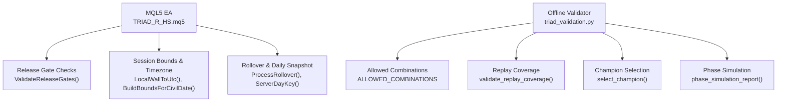
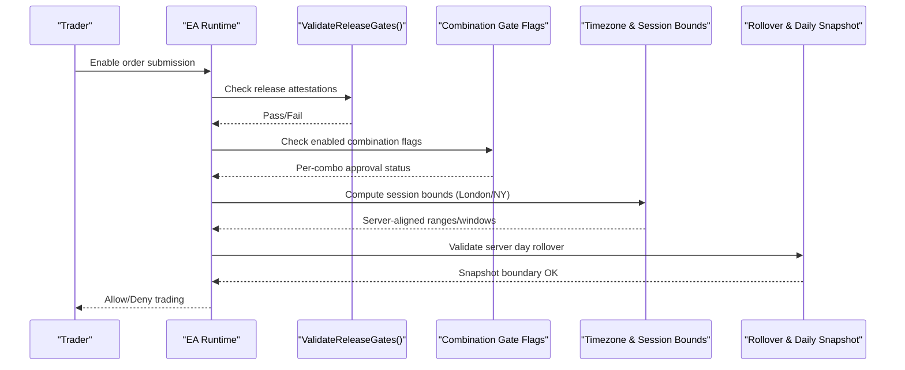
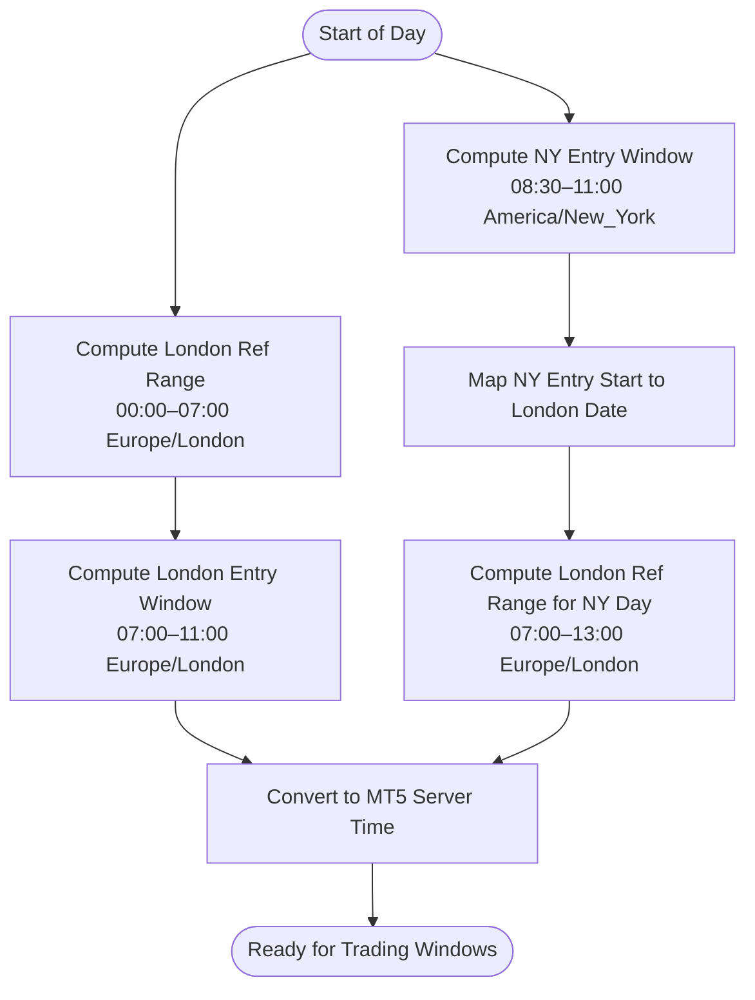
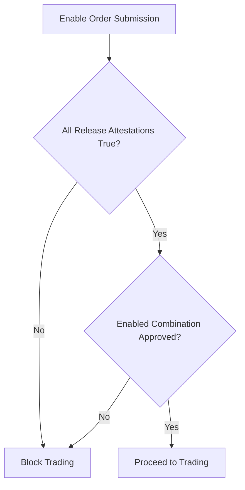
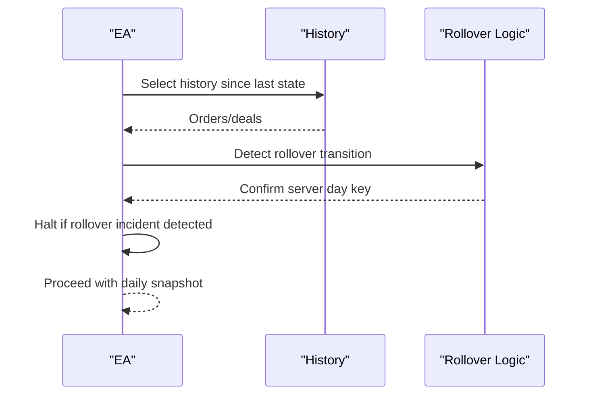
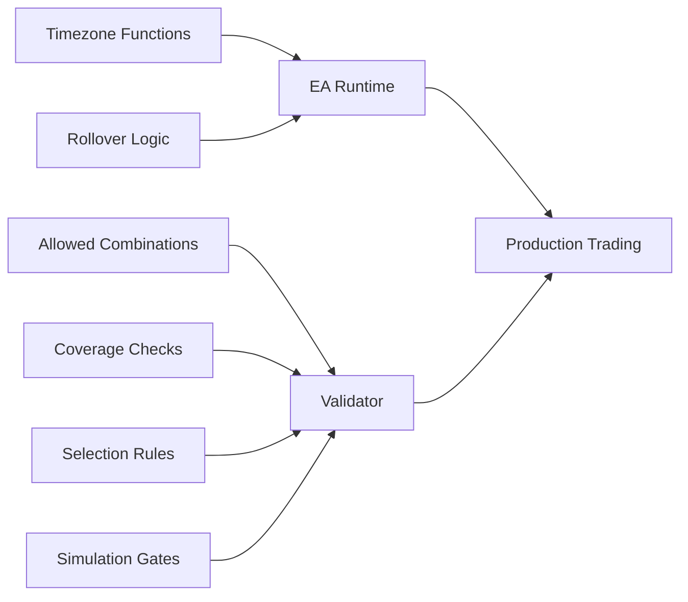

# Instrument and Session Validation

<cite>
**Referenced Files in This Document**
- [TRIAD_R_HS.mq5](file://MQL5/Experts/TRIAD_R_HS/TRIAD_R_HS.mq5)
- [triad_validation.py](file://tools/triad_validation.py)
- [test_validation.py](file://tests/test_validation.py)
- [multi_pair_grid_search.py](file://tools/multi_pair_grid_search.py)
- [triad_reference.py](file://tests/triad_reference.py)
</cite>

## Table of Contents
1. [Introduction](#introduction)
2. [Project Structure](#project-structure)
3. [Core Components](#core-components)
4. [Architecture Overview](#architecture-overview)
5. [Detailed Component Analysis](#detailed-component-analysis)
6. [Dependency Analysis](#dependency-analysis)
7. [Performance Considerations](#performance-considerations)
8. [Troubleshooting Guide](#troubleshooting-guide)
9. [Conclusion](#conclusion)

## Introduction
This document explains the instrument and session validation gates that restrict production trading to a single Sleeve A M5 sweep/reclaim strategy across three approved instrument/session combinations:
- EURUSD London
- GBPUSD London
- USDJPY New York

It covers how the system validates these combinations, enforces independent Section 13 approval per combination, handles timezones Europe/London and America/New_York independently with conversion to MT5 server timestamps to avoid DST conflicts, and ties session boundaries to confirmed MT5 server rollover for daily snapshots. It also documents why other instruments (XAUUSD, GBPJPY, indices) remain disabled and why Asian mean reversion strategies are blocked under this release.

## Project Structure
The validation logic is implemented in two layers:
- Live runtime enforcement in the MQL5 Expert Advisor (EA), which prevents order submission unless all release gates pass and each enabled combination has its own gate approval.
- Offline validation tooling that defines allowed combinations, replay coverage requirements, selection rules, and simulation gates aligned with Section 13.

**Diagram sources**
- [TRIAD_R_HS.mq5:3599-3614](file://MQL5/Experts/TRIAD_R_HS/TRIAD_R_HS.mq5#L3599-L3614)
- [TRIAD_R_HS.mq5:663-701](file://MQL5/Experts/TRIAD_R_HS/TRIAD_R_HS.mq5#L663-L701)
- [TRIAD_R_HS.mq5:754-771](file://MQL5/Experts/TRIAD_R_HS/TRIAD_R_HS.mq5#L754-L771)
- [TRIAD_R_HS.mq5:3379-3414](file://MQL5/Experts/TRIAD_R_HS/TRIAD_R_HS.mq5#L3379-L3414)
- [triad_validation.py:54-58](file://tools/triad_validation.py#L54-L58)
- [triad_validation.py:440-473](file://tools/triad_validation.py#L440-L473)

**Section sources**
- [TRIAD_R_HS.mq5:52-104](file://MQL5/Experts/TRIAD_R_HS/TRIAD_R_HS.mq5#L52-L104)
- [triad_validation.py:49-68](file://tools/triad_validation.py#L49-L68)

## Core Components
- Allowed combinations: The validator explicitly allows only EURUSD_LONDON, GBPUSD_LONDON, and USDJPY_NEW_YORK. Any other combination is rejected during replay loading.
- Release gates: The EA blocks live order submission unless all revision 2.1 attestations pass and each enabled combination has its own gate approval flag set.
- Timezone handling: The EA computes Europe/London and America/New_York civil-time offsets using DST-aware functions and converts wall-clock times to UTC before applying the configured MT5 server offset.
- Session bounds: For London sessions, reference range and entry windows are defined in Europe/London wall hours; for New York entries, the window is defined in America/New_York wall hours and mapped back to the correct London day when needed.
- Rollover and daily snapshots: The EA tracks server day keys and validates rollover transitions, ensuring daily snapshots align with confirmed MT5 server rollovers.

**Section sources**
- [triad_validation.py:54-58](file://tools/triad_validation.py#L54-L58)
- [triad_validation.py:360-437](file://tools/triad_validation.py#L360-L437)
- [TRIAD_R_HS.mq5:3599-3614](file://MQL5/Experts/TRIAD_R_HS/TRIAD_R_HS.mq5#L3599-L3614)
- [TRIAD_R_HS.mq5:663-701](file://MQL5/Experts/TRIAD_R_HS/TRIAD_R_HS.mq5#L663-L701)
- [TRIAD_R_HS.mq5:754-771](file://MQL5/Experts/TRIAD_R_HS/TRIAD_R_HS.mq5#L754-L771)
- [TRIAD_R_HS.mq5:3379-3414](file://MQL5/Experts/TRIAD_R_HS/TRIAD_R_HS.mq5#L3379-L3414)

## Architecture Overview
The validation architecture enforces a strict gating model:
- Only Sleeve A M5 sweep/reclaim is permitted.
- Only three instrument/session combinations are allowed.
- Each combination must independently pass Section 13 validation before being enabled.
- Timezone conversions are performed independently for Europe/London and America/New_York to avoid DST conflicts.
- Daily snapshots are anchored to confirmed MT5 server rollover boundaries.

**Diagram sources**
- [TRIAD_R_HS.mq5:3599-3614](file://MQL5/Experts/TRIAD_R_HS/TRIAD_R_HS.mq5#L3599-L3614)
- [TRIAD_R_HS.mq5:663-701](file://MQL5/Experts/TRIAD_R_HS/TRIAD_R_HS.mq5#L663-L701)
- [TRIAD_R_HS.mq5:754-771](file://MQL5/Experts/TRIAD_R_HS/TRIAD_R_HS.mq5#L754-L771)
- [TRIAD_R_HS.mq5:3379-3414](file://MQL5/Experts/TRIAD_R_HS/TRIAD_R_HS.mq5#L3379-L3414)

## Detailed Component Analysis

### Allowed Instrument/Session Combinations
- The validator defines exactly three allowed combinations: EURUSD_LONDON, GBPUSD_LONDON, USDJPY_NEW_YORK.
- Replay rows containing any other combination are rejected at load time.
- Tests confirm that the combination set is enforced and used consistently across selection and simulation.

Why this matters:
- It ensures only Sleeve A M5 sweep/reclaim on these pairs and sessions can be validated and deployed.
- It prevents accidental or intentional inclusion of unvalidated instruments or sessions.

**Section sources**
- [triad_validation.py:54-58](file://tools/triad_validation.py#L54-L58)
- [triad_validation.py:360-437](file://tools/triad_validation.py#L360-L437)
- [test_validation.py:201-228](file://tests/test_validation.py#L201-L228)

### Session Definitions and Timezone Handling
- EURUSD London and GBPUSD London:
  - Reference range: 00:00–07:00 Europe/London wall hours.
  - Entry window: 07:00–11:00 Europe/London wall hours.
- USDJPY New York:
  - Reference range: 07:00–13:00 Europe/London wall hours.
  - Entry window: 08:30–11:00 America/New_York wall hours.
- Timezone conversion:
  - The EA computes DST-aware offsets for Europe/London and America/New_York independently.
  - Wall-clock times are converted to UTC using LocalWallToUtc, then shifted to MT5 server time via UtcToServer.
  - For NY entries, the London date is derived from the NY entry start to compute the correct reference range.

**Diagram sources**
- [TRIAD_R_HS.mq5:663-701](file://MQL5/Experts/TRIAD_R_HS/TRIAD_R_HS.mq5#L663-L701)
- [TRIAD_R_HS.mq5:754-771](file://MQL5/Experts/TRIAD_R_HS/TRIAD_R_HS.mq5#L754-L771)
- [triad_reference.py:139-158](file://tests/triad_reference.py#L139-L158)

**Section sources**
- [multi_pair_grid_search.py:45-84](file://tools/multi_pair_grid_search.py#L45-L84)
- [triad_reference.py:139-158](file://tests/triad_reference.py#L139-L158)
- [TRIAD_R_HS.mq5:663-701](file://MQL5/Experts/TRIAD_R_HS/TRIAD_R_HS.mq5#L663-L701)
- [TRIAD_R_HS.mq5:754-771](file://MQL5/Experts/TRIAD_R_HS/TRIAD_R_HS.mq5#L754-L771)

### Independent Combination Approval (Section 13)
- The EA requires each enabled combination to have its own gate approval flag set before allowing order submission.
- If any enabled combination lacks approval, the release gate fails and trading remains disabled.
- The offline validator enforces that failing combinations are disabled before portfolio ranking and that the enabled set passes aggregate point-estimate gates.

**Diagram sources**
- [TRIAD_R_HS.mq5:3599-3614](file://MQL5/Experts/TRIAD_R_HS/TRIAD_R_HS.mq5#L3599-L3614)
- [triad_validation.py:278-305](file://tools/triad_validation.py#L278-L305)

**Section sources**
- [TRIAD_R_HS.mq5:3599-3614](file://MQL5/Experts/TRIAD_R_HS/TRIAD_R_HS.mq5#L3599-L3614)
- [triad_validation.py:278-305](file://tools/triad_validation.py#L278-L305)

### Rollover and Daily Snapshots
- The EA tracks server day keys and validates rollover transitions.
- Missed rollover exposure or history issues halt progression to prevent contaminated accounting.
- Daily snapshots are anchored to confirmed MT5 server rollover boundaries, ensuring consistent daily reporting and risk controls.

**Diagram sources**
- [TRIAD_R_HS.mq5:3284-3414](file://MQL5/Experts/TRIAD_R_HS/TRIAD_R_HS.mq5#L3284-L3414)

**Section sources**
- [TRIAD_R_HS.mq5:3284-3414](file://MQL5/Experts/TRIAD_R_HS/TRIAD_R_HS.mq5#L3284-L3414)

### Disabled Instruments and Blocked Strategies
- XAUUSD, GBPJPY, and indices are not part of the allowed combinations and are therefore disabled for this release.
- Asian mean reversion strategies are blocked because they are not included in the approved Sleeve A M5 sweep/reclaim scope and do not meet the Section 13 validation criteria for this release.
- The validator’s allowed set and the EA’s symbol contract checks ensure only the specified FX pairs and sessions can be enabled.

**Section sources**
- [triad_validation.py:54-58](file://tools/triad_validation.py#L54-L58)
- [triad_validation.py:360-437](file://tools/triad_validation.py#L360-L437)
- [TRIAD_R_HS.mq5:3616-3651](file://MQL5/Experts/TRIAD_R_HS/TRIAD_R_HS.mq5#L3616-L3651)

## Dependency Analysis
- The EA depends on timezone functions to compute accurate session boundaries and on rollover logic to anchor daily snapshots.
- The offline validator depends on the allowed combination set and replay coverage to enforce Section 13 requirements.
- Tests validate both the validator’s behavior and the consistency of session bounds across Python and MQL5 implementations.

**Diagram sources**
- [TRIAD_R_HS.mq5:663-701](file://MQL5/Experts/TRIAD_R_HS/TRIAD_R_HS.mq5#L663-L701)
- [TRIAD_R_HS.mq5:3379-3414](file://MQL5/Experts/TRIAD_R_HS/TRIAD_R_HS.mq5#L3379-L3414)
- [triad_validation.py:54-58](file://tools/triad_validation.py#L54-L58)
- [triad_validation.py:440-473](file://tools/triad_validation.py#L440-L473)

**Section sources**
- [triad_validation.py:54-58](file://tools/triad_validation.py#L54-L58)
- [triad_validation.py:440-473](file://tools/triad_validation.py#L440-L473)
- [TRIAD_R_HS.mq5:663-701](file://MQL5/Experts/TRIAD_R_HS/TRIAD_R_HS.mq5#L663-L701)
- [TRIAD_R_HS.mq5:3379-3414](file://MQL5/Experts/TRIAD_R_HS/TRIAD_R_HS.mq5#L3379-L3414)

## Performance Considerations
- Timezone computations are lightweight but must be executed once per session boundary calculation to avoid repeated DST lookups.
- Replay coverage validation ensures completeness without unnecessary recomputation by enforcing fixed day sets across configurations and combinations.
- Rollover checks are designed to fail fast on history availability issues to prevent costly downstream errors.

[No sources needed since this section provides general guidance]

## Troubleshooting Guide
Common issues and resolutions:
- Invalid combination in replay data: Ensure only EURUSD_LONDON, GBPUSD_LONDON, and USDJPY_NEW_YORK are used.
- Missing replay coverage: Provide no-candidate rows for every configuration/combination/day in both WALK_FORWARD and HOLDOUT splits.
- Release gate failures: Verify all attestation flags and per-combination gate approvals are set before enabling order submission.
- Timezone mismatches: Confirm expected server offset and that LocalWallToUtc and UtcToServer are applied consistently.
- Rollover incidents: Investigate missed rollover exposure or history faults; do not proceed until resolved.

**Section sources**
- [triad_validation.py:360-437](file://tools/triad_validation.py#L360-L437)
- [triad_validation.py:440-473](file://tools/triad_validation.py#L440-L473)
- [TRIAD_R_HS.mq5:3599-3614](file://MQL5/Experts/TRIAD_R_HS/TRIAD_R_HS.mq5#L3599-L3614)
- [TRIAD_R_HS.mq5:3379-3414](file://MQL5/Experts/TRIAD_R_HS/TRIAD_R_HS.mq5#L3379-L3414)

## Conclusion
The validation framework restricts production trading to a single Sleeve A M5 sweep/reclaim strategy across EURUSD London, GBPUSD London, and USDJPY New York. It enforces independent Section 13 approval per combination, uses robust timezone handling for Europe/London and America/New_York, and anchors daily snapshots to confirmed MT5 server rollover. Other instruments and Asian mean reversion strategies remain disabled because they are not part of the approved scope and do not meet the validation criteria for this release.

[No sources needed since this section summarizes without analyzing specific files]