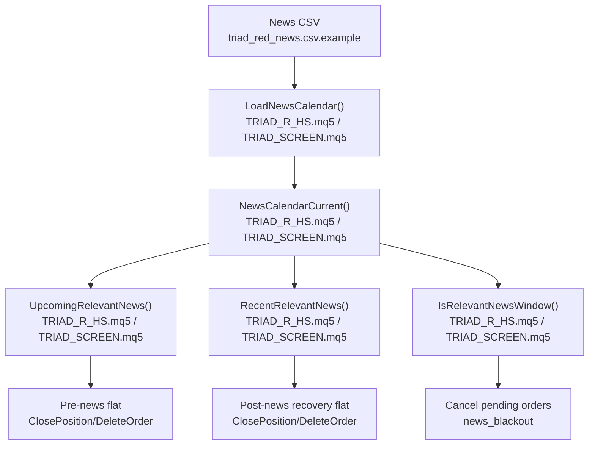
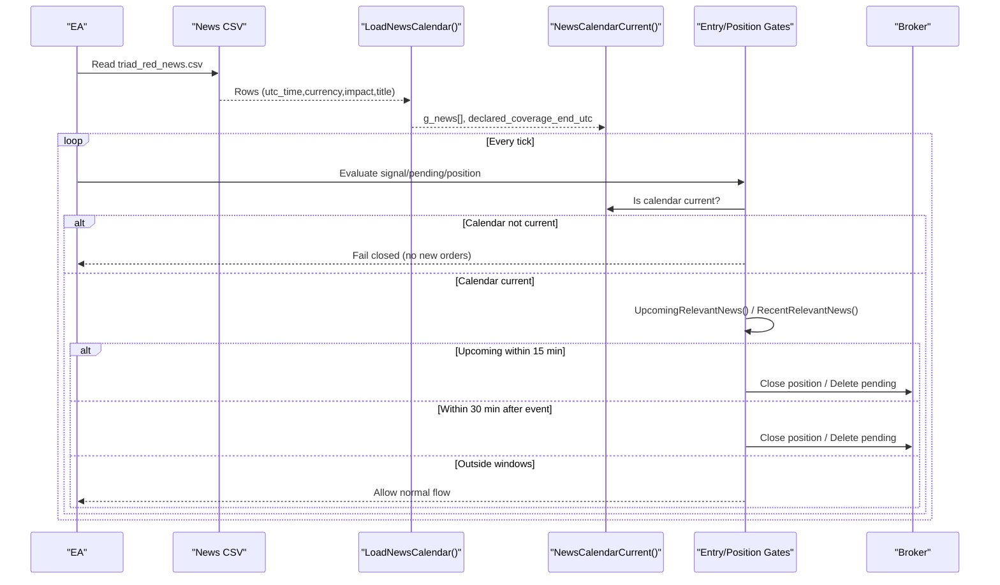
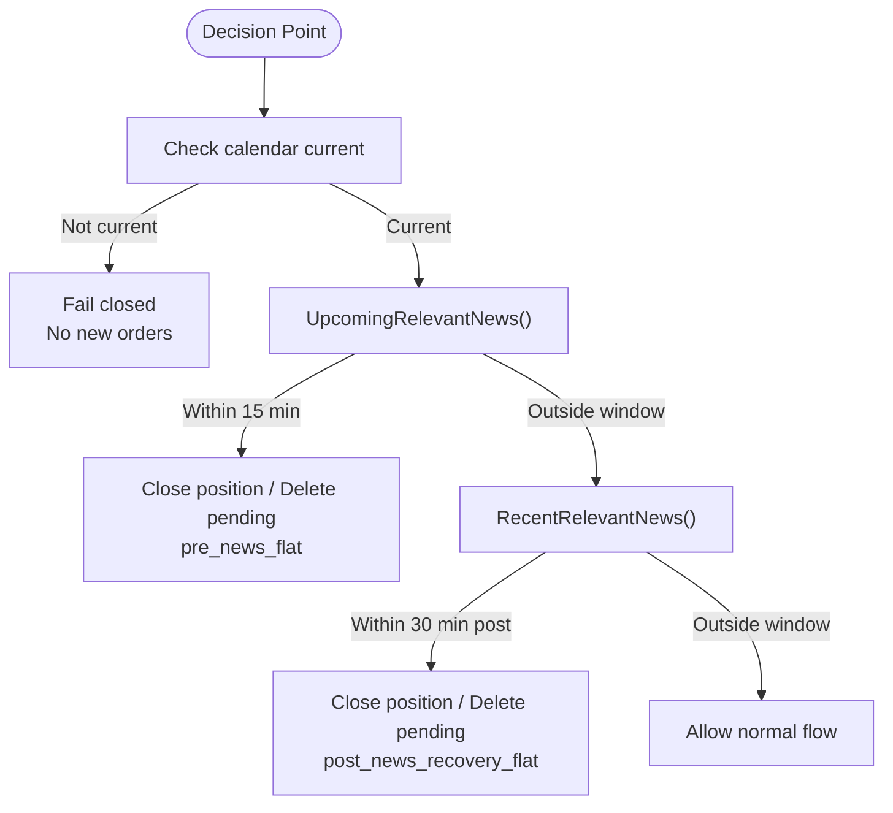
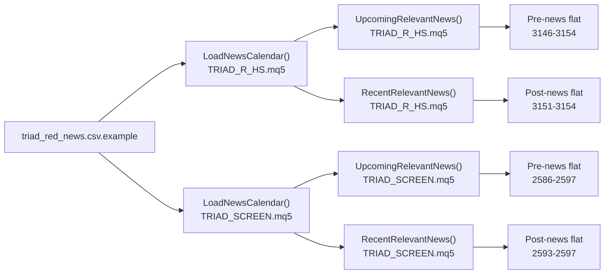

# News Blackout Periods

<cite>
**Referenced Files in This Document**
- [TRIAD_R_HS.mq5](file://MQL5/Experts/TRIAD_R_HS/TRIAD_R_HS.mq5)
- [TRIAD_SCREEN.mq5](file://MQL5/Experts/TRIAD_SCREEN/TRIAD_SCREEN.mq5)
- [triad_red_news.csv.example](file://MQL5/Files/triad_red_news.csv.example)
- [README.md](file://MQL5/Experts/TRIAD_R_HS/README.md)
- [THE5ERS-CHALLENGE-STRATEGY-V2.md](file://THE5ERS-CHALLENGE-STRATEGY-V2.md)
- [THE5ERS-PROPOSAL-REVIEW.md](file://THE5ERS-PROPOSAL-REVIEW.md)
- [test_reference.py](file://tests/test_reference.py)
</cite>

## Table of Contents
1. Introduction
2. Project Structure
3. Core Components
4. Architecture Overview
5. Detailed Component Analysis
6. Dependency Analysis
7. Performance Considerations
8. Troubleshooting Guide
9. Conclusion
10. Appendices

## Introduction
This document explains how news blackout periods are enforced to protect trading around high-impact economic releases. It covers:
- Red-folder event integration that blocks new entries and working entry orders within 30 minutes of relevant events, and forces positions flat at least 15 minutes before such events during expected holding windows.
- USD currency restrictions that apply to every USD pair through the same calendar-based logic.
- Fail-closed behavior when the economic calendar is unavailable or stale.
- The CSV-based economic calendar format specification, including required fields, timestamp formats, and coverage requirements.
- Operator-verified UTC coverage-through declarations and runtime checks that keep calendar coverage current.
- Examples of high-impact events (CPI, NFP, FOMC, central bank rate decisions).
- Forced-flat rules and 30-minute re-entry restrictions after events.
- Guidance for handling calendar failures, missing data, and timezone conversions between UTC and local server time.

## Project Structure
The enforcement logic is implemented in two MQL5 Expert Advisors with a shared calendar schema:
- TRIAD_R_HS.mq5: canonical production-oriented EA with full safety machinery.
- TRIAD_SCREEN.mq5: demo screening EA mirroring the canonical calendar behavior.
- triad_red_news.csv.example: example CSV defining red/high events and operator-verified coverage.
- README.md: operational rules for the CSV file.
- THE5ERS-CHALLENGE-STRATEGY-V2.md: policy-level forced-flat and re-entry rules.
- test_reference.py: tests validating UTC-to-server conversion and session boundaries.

**Diagram sources**
- [TRIAD_R_HS.mq5:836-917](file://MQL5/Experts/TRIAD_R_HS/TRIAD_R_HS.mq5#L836-L917)
- [TRIAD_SCREEN.mq5:847-928](file://MQL5/Experts/TRIAD_SCREEN/TRIAD_SCREEN.mq5#L847-L928)
- [TRIAD_R_HS.mq5:956-995](file://MQL5/Experts/TRIAD_R_HS/TRIAD_R_HS.mq5#L956-L995)
- [TRIAD_SCREEN.mq5:968-998](file://MQL5/Experts/TRIAD_SCREEN/TRIAD_SCREEN.mq5#L968-L998)

**Section sources**
- [triad_red_news.csv.example:1-7](file://MQL5/Files/triad_red_news.csv.example#L1-L7)
- [TRIAD_R_HS.mq5:836-917](file://MQL5/Experts/TRIAD_R_HS/TRIAD_R_HS.mq5#L836-L917)
- [TRIAD_SCREEN.mq5:847-928](file://MQL5/Experts/TRIAD_SCREEN/TRIAD_SCREEN.mq5#L847-L928)

## Core Components
- Economic calendar loader parses a CSV with columns utc_time, currency, impact, title. Only RED/HIGH rows are loaded; COVERAGE metadata defines verified coverage end.
- Runtime checks ensure the declared coverage extends beyond current UTC plus a configured number of hours; otherwise the system fails closed.
- Entry gating cancels pending orders inside blackout windows and prevents new orders near relevant events.
- Position management flattens positions before upcoming events and after recent events.
- Timezone helpers convert between UTC and MT5 server time using a fixed offset input and DST-aware session boundary calculations.

Key behaviors:
- No new entry or working entry order within 30 minutes of relevant red-folder news.
- Positions must be flat at least 15 minutes before relevant events during expected holding windows.
- Re-entry is blocked until 30 minutes after the event.
- If calendar data is unavailable or stale, the system fails closed by default.

**Section sources**
- [TRIAD_R_HS.mq5:836-917](file://MQL5/Experts/TRIAD_R_HS/TRIAD_R_HS.mq5#L836-L917)
- [TRIAD_SCREEN.mq5:847-928](file://MQL5/Experts/TRIAD_SCREEN/TRIAD_SCREEN.mq5#L847-L928)
- [TRIAD_R_HS.mq5:956-995](file://MQL5/Experts/TRIAD_R_HS/TRIAD_R_HS.mq5#L956-L995)
- [TRIAD_SCREEN.mq5:968-998](file://MQL5/Experts/TRIAD_SCREEN/TRIAD_SCREEN.mq5#L968-L998)
- [TRIAD_R_HS.mq5:3052-3053](file://MQL5/Experts/TRIAD_R_HS/TRIAD_R_HS.mq5#L3052-L3053)
- [TRIAD_R_HS.mq5:3146-3154](file://MQL5/Experts/TRIAD_R_HS/TRIAD_R_HS.mq5#L3146-L3154)
- [TRIAD_SCREEN.mq5:2586-2597](file://MQL5/Experts/TRIAD_SCREEN/TRIAD_SCREEN.mq5#L2586-L2597)
- [THE5ERS-CHALLENGE-STRATEGY-V2.md:174-179](file://THE5ERS-CHALLENGE-STRATEGY-V2.md#L174-L179)

## Architecture Overview
The system enforces news blackouts via a pipeline:
1. Load and validate the CSV at startup and on server rollover.
2. Track declared coverage end and enforce minimum future coverage.
3. On each decision point (entry, pending order, position), check if a relevant event is upcoming or recent.
4. Cancel pending orders and close positions as needed.
5. Convert times between UTC and server time consistently.

**Diagram sources**
- [TRIAD_R_HS.mq5:836-917](file://MQL5/Experts/TRIAD_R_HS/TRIAD_R_HS.mq5#L836-L917)
- [TRIAD_R_HS.mq5:956-995](file://MQL5/Experts/TRIAD_R_HS/TRIAD_R_HS.mq5#L956-L995)
- [TRIAD_R_HS.mq5:3052-3053](file://MQL5/Experts/TRIAD_R_HS/TRIAD_R_HS.mq5#L3052-L3053)
- [TRIAD_R_HS.mq5:3146-3154](file://MQL5/Experts/TRIAD_R_HS/TRIAD_R_HS.mq5#L3146-L3154)

## Detailed Component Analysis

### Economic Calendar CSV Format
- Columns: utc_time, currency, impact, title.
- Timestamp format: YYYY.MM.DD HH:MM in UTC.
- Impact values: RED or HIGH for events; COVERAGE for operator-verified coverage declaration.
- Coverage row: ALL,COVERAGE,<UTC timestamp>,<title>. Declares the latest UTC instant through which the operator has verified completeness.
- Currency codes: three-letter uppercase codes; normalized to uppercase by the loader.
- Required coverage: must extend at least InpRequiredNewsCoverageHours beyond current UTC. Default is 24 hours. Missing or stale coverage disables new entries and can force managed exposure flat at runtime.

Example rows are provided in the sample CSV.

**Section sources**
- [triad_red_news.csv.example:1-7](file://MQL5/Files/triad_red_news.csv.example#L1-L7)
- [TRIAD_R_HS.mq5:799-834](file://MQL5/Experts/TRIAD_R_HS/TRIAD_R_HS.mq5#L799-L834)
- [TRIAD_SCREEN.mq5:810-845](file://MQL5/Experts/TRIAD_SCREEN/TRIAD_SCREEN.mq5#L810-L845)
- [TRIAD_R_HS.mq5:836-917](file://MQL5/Experts/TRIAD_R_HS/TRIAD_R_HS.mq5#L836-L917)
- [TRIAD_SCREEN.mq5:847-928](file://MQL5/Experts/TRIAD_SCREEN/TRIAD_SCREEN.mq5#L847-L928)
- [README.md:37-47](file://MQL5/Experts/TRIAD_R_HS/README.md#L37-L47)

### USD Currency Restrictions
- The calendar applies to both currencies of a symbol. For any USD pair, USD is one of the two currencies, so relevant USD events trigger the same blackout and forced-flat logic.
- This ensures consistent protection across all USD pairs without hard-coded symbol lists.

**Section sources**
- [TRIAD_R_HS.mq5:956-995](file://MQL5/Experts/TRIAD_R_HS/TRIAD_R_HS.mq5#L956-L995)
- [TRIAD_SCREEN.mq5:968-998](file://MQL5/Experts/TRIAD_SCREEN/TRIAD_SCREEN.mq5#L968-L998)

### Fail-Closed Behavior
- If the CSV cannot be opened or required coverage is insufficient, the system returns failure for loading and treats it as a fail-closed state for new orders.
- At runtime, if coverage becomes stale (declared end falls behind current UTC plus required hours), a log is emitted and subsequent entry/order/position decisions treat the calendar as unavailable, preventing new activity.

**Section sources**
- [TRIAD_R_HS.mq5:836-846](file://MQL5/Experts/TRIAD_R_HS/TRIAD_R_HS.mq5#L836-L846)
- [TRIAD_R_HS.mq5:904-917](file://MQL5/Experts/TRIAD_R_HS/TRIAD_R_HS.mq5#L904-L917)
- [TRIAD_R_HS.mq5:920-937](file://MQL5/Experts/TRIAD_R_HS/TRIAD_R_HS.mq5#L920-L937)
- [TRIAD_SCREEN.mq5:847-857](file://MQL5/Experts/TRIAD_SCREEN/TRIAD_SCREEN.mq5#L847-L857)
- [TRIAD_SCREEN.mq5:913-928](file://MQL5/Experts/TRIAD_SCREEN/TRIAD_SCREEN.mq5#L913-L928)
- [TRIAD_SCREEN.mq5:931-948](file://MQL5/Experts/TRIAD_SCREEN/TRIAD_SCREEN.mq5#L931-L948)

### Timezone Handling
- UTC timestamps in the CSV are converted to server time using UtcToServer(server_offset_hours).
- Server time is converted back to UTC using ServerToUtc for comparisons against event times.
- Session boundaries use DST-aware offsets for London and New York to compute civil dates and entry windows.

**Section sources**
- [TRIAD_R_HS.mq5:693-701](file://MQL5/Experts/TRIAD_R_HS/TRIAD_R_HS.mq5#L693-L701)
- [TRIAD_SCREEN.mq5:653-661](file://MQL5/Experts/TRIAD_SCREEN/TRIAD_SCREEN.mq5#L653-L661)
- [TRIAD_R_HS.mq5:689-712](file://MQL5/Experts/TRIAD_R_HS/TRIAD_R_HS.mq5#L689-L712)
- [TRIAD_SCREEN.mq5:622-651](file://MQL5/Experts/TRIAD_SCREEN/TRIAD_SCREEN.mq5#L622-L651)
- [test_reference.py:154-156](file://tests/test_reference.py#L154-L156)

### Forced-Flat Rules and Re-Entry Restrictions
- Positions must be flat at least 15 minutes before relevant red events during expected holding windows.
- No re-entry until 30 minutes after the event.
- Pending orders are deleted inside blackout windows.
- These rules align with the challenge strategy policy.

**Diagram sources**
- [TRIAD_R_HS.mq5:956-995](file://MQL5/Experts/TRIAD_R_HS/TRIAD_R_HS.mq5#L956-L995)
- [TRIAD_R_HS.mq5:3052-3053](file://MQL5/Experts/TRIAD_R_HS/TRIAD_R_HS.mq5#L3052-L3053)
- [TRIAD_R_HS.mq5:3146-3154](file://MQL5/Experts/TRIAD_R_HS/TRIAD_R_HS.mq5#L3146-L3154)
- [TRIAD_SCREEN.mq5:2586-2597](file://MQL5/Experts/TRIAD_SCREEN/TRIAD_SCREEN.mq5#L2586-L2597)

**Section sources**
- [THE5ERS-CHALLENGE-STRATEGY-V2.md:174-179](file://THE5ERS-CHALLENGE-STRATEGY-V2.md#L174-L179)
- [TRIAD_R_HS.mq5:3052-3053](file://MQL5/Experts/TRIAD_R_HS/TRIAD_R_HS.mq5#L3052-L3053)
- [TRIAD_R_HS.mq5:3146-3154](file://MQL5/Experts/TRIAD_R_HS/TRIAD_R_HS.mq5#L3146-L3154)
- [TRIAD_SCREEN.mq5:2586-2597](file://MQL5/Experts/TRIAD_SCREEN/TRIAD_SCREEN.mq5#L2586-L2597)

### High-Impact Event Examples
- CPI, NFP, FOMC, and central bank rate decisions should be included as RED/HIGH events for their respective currencies in the CSV.
- Ensure coverage declarations extend sufficiently into the future to cover these events.

**Section sources**
- [README.md:37-47](file://MQL5/Experts/TRIAD_R_HS/README.md#L37-L47)
- [THE5ERS-CHALLENGE-STRATEGY-V2.md:174-179](file://THE5ERS-CHALLENGE-STRATEGY-V2.md#L174-L179)

## Dependency Analysis
- Both EAs depend on the same CSV schema and share identical calendar logic patterns.
- Entry and position controls call into UpcomingRelevantNews and RecentRelevantNews to decide whether to cancel or close.
- Timezone conversion functions depend on the configured server UTC offset and DST-aware session utilities.

**Diagram sources**
- [TRIAD_R_HS.mq5:836-917](file://MQL5/Experts/TRIAD_R_HS/TRIAD_R_HS.mq5#L836-L917)
- [TRIAD_SCREEN.mq5:847-928](file://MQL5/Experts/TRIAD_SCREEN/TRIAD_SCREEN.mq5#L847-L928)
- [TRIAD_R_HS.mq5:956-995](file://MQL5/Experts/TRIAD_R_HS/TRIAD_R_HS.mq5#L956-L995)
- [TRIAD_SCREEN.mq5:968-998](file://MQL5/Experts/TRIAD_SCREEN/TRIAD_SCREEN.mq5#L968-L998)
- [TRIAD_R_HS.mq5:3146-3154](file://MQL5/Experts/TRIAD_R_HS/TRIAD_R_HS.mq5#L3146-L3154)
- [TRIAD_SCREEN.mq5:2586-2597](file://MQL5/Experts/TRIAD_SCREEN/TRIAD_SCREEN.mq5#L2586-L2597)

**Section sources**
- [TRIAD_R_HS.mq5:836-917](file://MQL5/Experts/TRIAD_R_HS/TRIAD_R_HS.mq5#L836-L917)
- [TRIAD_SCREEN.mq5:847-928](file://MQL5/Experts/TRIAD_SCREEN/TRIAD_SCREEN.mq5#L847-L928)

## Performance Considerations
- Calendar checks iterate over loaded events per decision; keep the CSV minimal and accurate to avoid unnecessary scans.
- Use the coverage declaration to limit the effective event set to the verified horizon.
- Avoid excessive logging around frequent checks; rely on the single stale-coverage log per run.

[No sources needed since this section provides general guidance]

## Troubleshooting Guide
Common issues and resolutions:
- CSV file open failure:
  - Symptom: NEWS_FILE_OPEN error; no new entries if calendar is required.
  - Action: Verify file path and permissions; ensure the file exists and is readable.
- Insufficient coverage:
  - Symptom: NEWS_COVERAGE_INSUFFICIENT; fails closed until coverage is extended.
  - Action: Add an ALL,COVERAGE row with a timestamp extending at least InpRequiredNewsCoverageHours beyond current UTC.
- Stale runtime coverage:
  - Symptom: NEWS_RUNTIME_COVERAGE_STALE; prevents new orders and may force managed exposure flat.
  - Action: Refresh the CSV with updated coverage before the declared end expires.
- Invalid row or timestamp:
  - Symptom: NEWS_ROW_INVALID or NEWS_COVERAGE_ROW_INVALID; loader aborts load.
  - Action: Fix timestamp format (YYYY.MM.DD HH:MM), currency code (three uppercase letters), and impact value (RED/HIGH/COVERAGE).
- Timezone mismatch:
  - Symptom: Events appear off by hours due to broker/server offset differences.
  - Action: Confirm InpExpectedServerUtcOffsetHours matches your MT5 server; verify with tests and logs.

**Section sources**
- [TRIAD_R_HS.mq5:836-846](file://MQL5/Experts/TRIAD_R_HS/TRIAD_R_HS.mq5#L836-L846)
- [TRIAD_R_HS.mq5:904-917](file://MQL5/Experts/TRIAD_R_HS/TRIAD_R_HS.mq5#L904-L917)
- [TRIAD_R_HS.mq5:920-937](file://MQL5/Experts/TRIAD_R_HS/TRIAD_R_HS.mq5#L920-L937)
- [TRIAD_SCREEN.mq5:847-857](file://MQL5/Experts/TRIAD_SCREEN/TRIAD_SCREEN.mq5#L847-L857)
- [TRIAD_SCREEN.mq5:913-928](file://MQL5/Experts/TRIAD_SCREEN/TRIAD_SCREEN.mq5#L913-L928)
- [TRIAD_SCREEN.mq5:931-948](file://MQL5/Experts/TRIAD_SCREEN/TRIAD_SCREEN.mq5#L931-L948)
- [test_reference.py:154-156](file://tests/test_reference.py#L154-L156)

## Conclusion
The news blackout enforcement integrates a strict, operator-verified economic calendar with fail-closed safeguards to prevent trading around high-impact events. By applying 30-minute blackout windows for entries and orders, and forcing positions flat at least 15 minutes before relevant events, the system protects against unpredictable volatility. USD pairs are covered uniformly because the calendar matches either currency in a pair. Maintaining current coverage and correct timezone settings is essential for reliable operation.

[No sources needed since this section summarizes without analyzing specific files]

## Appendices

### Appendix A: Policy References
- 30-minute red-folder buffer and pre-set SL/TP behavior: see proposal review notes.
- Forced-flat and re-entry rules: see challenge strategy V2.

**Section sources**
- [THE5ERS-PROPOSAL-REVIEW.md:259-273](file://THE5ERS-PROPOSAL-REVIEW.md#L259-L273)
- [THE5ERS-CHALLENGE-STRATEGY-V2.md:174-179](file://THE5ERS-CHALLENGE-STRATEGY-V2.md#L174-L179)

### Appendix B: Example CSV Rows
- See the example file for format and coverage declaration.

**Section sources**
- [triad_red_news.csv.example:1-7](file://MQL5/Files/triad_red_news.csv.example#L1-L7)