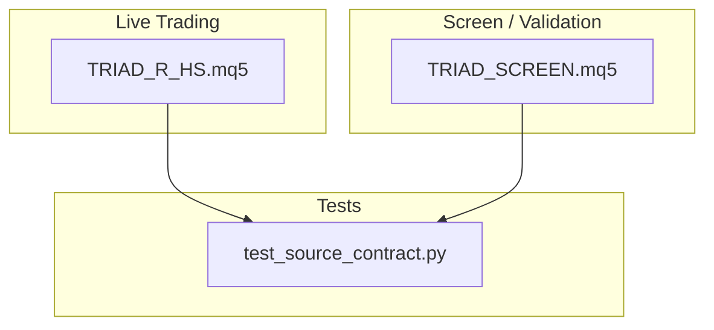
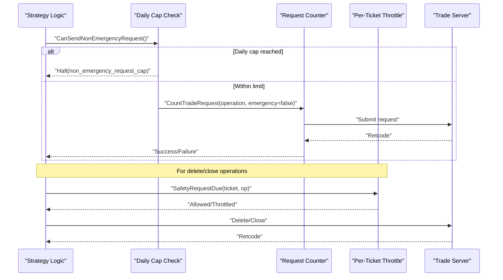
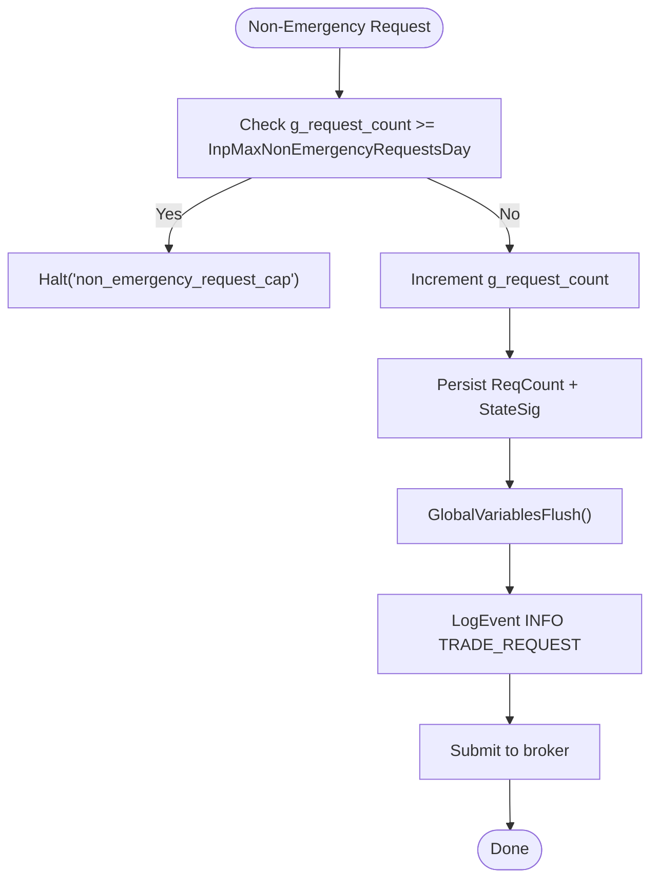
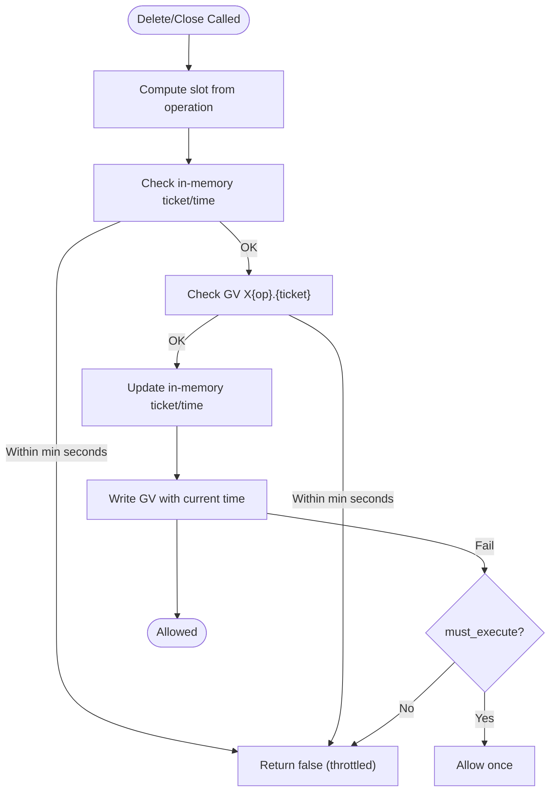
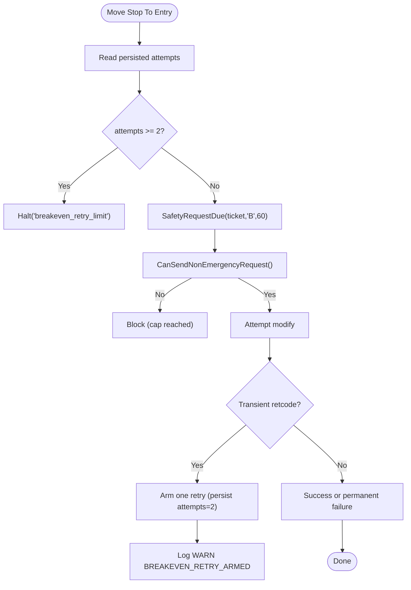
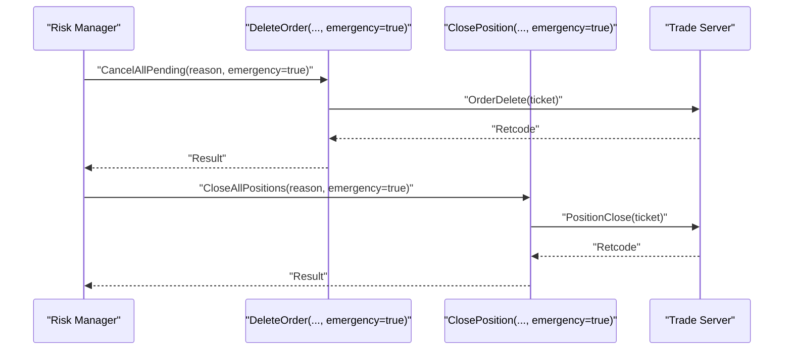
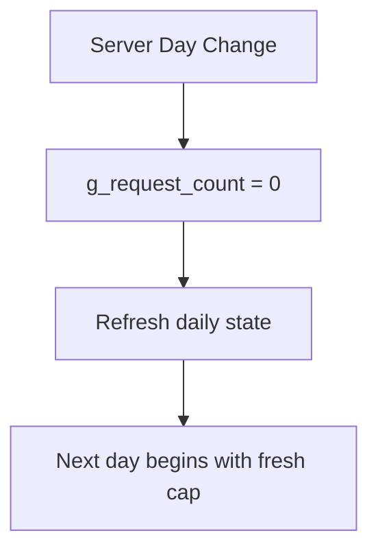
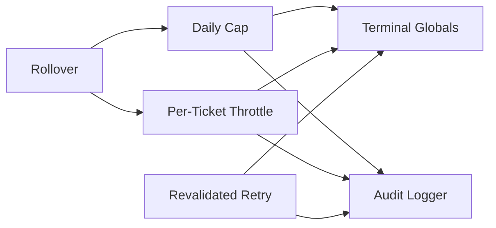

# Rate Limiting Mechanisms

<cite>
**Referenced Files in This Document**
- [TRIAD_R_HS.mq5](file://MQL5/Experts/TRIAD_R_HS/TRIAD_R_HS.mq5)
- [TRIAD_SCREEN.mq5](file://MQL5/Experts/TRIAD_SCREEN/TRIAD_SCREEN.mq5)
- [test_source_contract.py](file://tests/test_source_contract.py)
</cite>

## Table of Contents
1. [Introduction](#introduction)
2. [Project Structure](#project-structure)
3. [Core Components](#core-components)
4. [Architecture Overview](#architecture-overview)
5. [Detailed Component Analysis](#detailed-component-analysis)
6. [Dependency Analysis](#dependency-analysis)
7. [Performance Considerations](#performance-considerations)
8. [Troubleshooting Guide](#troubleshooting-guide)
9. [Conclusion](#conclusion)

## Introduction
This document explains the rate limiting mechanisms that protect the trading system against excessive or abusive order activity. It covers:
- Per-tick order modification prohibition to prevent rapid-fire changes
- A revalidated retry limitation allowing at most one retry after transient rejection for temporary platform issues
- The default daily cap of 20 non-emergency trade requests per server day and how it prevents abuse while allowing necessary operations
- Emergency operation exceptions that override normal limits for essential pending-order cancellations or emergency closes
- How the rate limit counter is tracked, reset at server rollover, and how blocking behavior works when caps are reached
- Logging and alerting for rate limit violations
- Examples of legitimate vs prohibited patterns and guidance during high-volatility events or connectivity issues

## Project Structure
The rate limiting logic is implemented in the live expert advisor (EA) and mirrored in a screen-only EA used for validation and monitoring. Key locations:
- Live EA: MQL5 Experts TRIAD_R_HS
- Screen EA: MQL5 Experts TRIAD_SCREEN
- Contract tests validating presence of required guards and tokens

**Diagram sources**
- [TRIAD_R_HS.mq5:2528-2558](file://MQL5/Experts/TRIAD_R_HS/TRIAD_R_HS.mq5#L2528-L2558)
- [TRIAD_SCREEN.mq5:2045-2068](file://MQL5/Experts/TRIAD_SCREEN/TRIAD_SCREEN.mq5#L2045-L2068)
- [test_source_contract.py:427-467](file://tests/test_source_contract.py#L427-L467)

**Section sources**
- [TRIAD_R_HS.mq5:89-89](file://MQL5/Experts/TRIAD_R_HS/TRIAD_R_HS.mq5#L89-L89)
- [TRIAD_R_HS.mq5:242-242](file://MQL5/Experts/TRIAD_R_HS/TRIAD_R_HS.mq5#L242-L242)
- [TRIAD_SCREEN.mq5:141-141](file://MQL5/Experts/TRIAD_SCREEN/TRIAD_SCREEN.mq5#L141-L141)
- [TRIAD_SCREEN.mq5:256-256](file://MQL5/Experts/TRIAD_SCREEN/TRIAD_SCREEN.mq5#L256-L256)

## Core Components
- Daily request cap: A configurable maximum number of non-emergency trade requests allowed per server day. When reached, further non-emergency requests are blocked and the EA halts with a specific reason.
- Request counting and persistence: Each non-emergency request increments an in-memory counter and persists it to terminal global variables along with an account state signature. On failure to persist, the EA halts to avoid drift.
- Safety throttling per ticket: For critical operations (delete order, close position), a per-ticket throttle ensures no more than one such operation per ticket within a minimum time window. This prevents rapid-fire modifications on the same instrument/ticket.
- Revalidated retry for transient failures: Certain post-fill operations (e.g., moving stop to breakeven) may be retried once if the first attempt fails due to transient platform conditions. After one retry, further attempts are blocked.
- Emergency overrides: Emergency-mode operations can bypass some throttles but still respect safety constraints and are logged distinctly. They are intended for necessary actions like cancelling pending orders or closing positions during emergencies.
- Server-day rollover reset: At each server day boundary, the daily request counter resets to zero, and other daily state is refreshed.

**Section sources**
- [TRIAD_R_HS.mq5:2528-2558](file://MQL5/Experts/TRIAD_R_HS/TRIAD_R_HS.mq5#L2528-L2558)
- [TRIAD_R_HS.mq5:2560-2583](file://MQL5/Experts/TRIAD_R_HS/TRIAD_R_HS.mq5#L2560-L2583)
- [TRIAD_R_HS.mq5:3220-3277](file://MQL5/Experts/TRIAD_R_HS/TRIAD_R_HS.mq5#L3220-L3277)
- [TRIAD_R_HS.mq5:3492-3503](file://MQL5/Experts/TRIAD_R_HS/TRIAD_R_HS.mq5#L3492-L3503)

## Architecture Overview
The rate limiting architecture enforces three layers of protection:
1. Global daily cap for non-emergency requests
2. Per-ticket safety throttle for sensitive operations
3. One-retry guard for transient failures in specific post-fill workflows

**Diagram sources**
- [TRIAD_R_HS.mq5:2528-2558](file://MQL5/Experts/TRIAD_R_HS/TRIAD_R_HS.mq5#L2528-L2558)
- [TRIAD_R_HS.mq5:2560-2583](file://MQL5/Experts/TRIAD_R_HS/TRIAD_R_HS.mq5#L2560-L2583)
- [TRIAD_R_HS.mq5:2601-2669](file://MQL5/Experts/TRIAD_R_HS/TRIAD_R_HS.mq5#L2601-L2669)

## Detailed Component Analysis

### Daily Non-Emergency Request Cap
- Default cap: 20 non-emergency trade requests per server day.
- Enforcement: Before submitting a non-emergency request, the EA checks whether the current count has reached the configured maximum. If so, it halts with a dedicated reason.
- Persistence: Each non-emergency request increments the in-memory counter and writes it to a terminal global variable alongside an account state signature. If persistence fails, the EA halts to prevent silent drift.
- Reset: At server rollover, the counter is reset to zero and daily state is refreshed.

**Diagram sources**
- [TRIAD_R_HS.mq5:2528-2558](file://MQL5/Experts/TRIAD_R_HS/TRIAD_R_HS.mq5#L2528-L2558)
- [TRIAD_R_HS.mq5:3492-3503](file://MQL5/Experts/TRIAD_R_HS/TRIAD_R_HS.mq5#L3492-L3503)

**Section sources**
- [TRIAD_R_HS.mq5:89-89](file://MQL5/Experts/TRIAD_R_HS/TRIAD_R_HS.mq5#L89-L89)
- [TRIAD_R_HS.mq5:2528-2558](file://MQL5/Experts/TRIAD_R_HS/TRIAD_R_HS.mq5#L2528-L2558)
- [TRIAD_R_HS.mq5:3492-3503](file://MQL5/Experts/TRIAD_R_HS/TRIAD_R_HS.mq5#L3492-L3503)

### Per-Tick Order Modification Prohibition (Safety Throttle)
- Purpose: Prevent rapid-fire modifications on the same ticket by enforcing a minimum time gap between delete/close operations on the same ticket.
- Mechanism: For each operation type (delete, close, modify), a slot tracks the last ticket and timestamp. If the same ticket is targeted within the minimum seconds, the operation is rejected.
- Persistence: Uses terminal global variables keyed by ticket and operation to survive restarts and ensure consistent throttling across sessions.
- Behavior: Optional modifications are blocked; emergency operations may force execution once even if persistence fails, but still honor the in-memory throttle.

**Diagram sources**
- [TRIAD_R_HS.mq5:2560-2583](file://MQL5/Experts/TRIAD_R_HS/TRIAD_R_HS.mq5#L2560-L2583)
- [TRIAD_R_HS.mq5:2601-2669](file://MQL5/Experts/TRIAD_R_HS/TRIAD_R_HS.mq5#L2601-L2669)

**Section sources**
- [TRIAD_R_HS.mq5:2560-2583](file://MQL5/Experts/TRIAD_R_HS/TRIAD_R_HS.mq5#L2560-L2583)
- [TRIAD_R_HS.mq5:2601-2669](file://MQL5/Experts/TRIAD_R_HS/TRIAD_R_HS.mq5#L2601-L2669)

### Revalidated Retry Limitation (One Retry After Transient Rejection)
- Scope: Post-fill operations such as moving stop to breakeven.
- Policy: If the first attempt fails due to transient platform conditions (e.g., requote, timeout, price changed, too many requests, locked, connection), the system arms one revalidated retry. After one retry, further attempts are blocked.
- Implementation: Tracks attempts in a persistent variable. If attempts reach the limit, the EA halts with a dedicated reason. Logs indicate when a retry is armed.

**Diagram sources**
- [TRIAD_R_HS.mq5:3220-3277](file://MQL5/Experts/TRIAD_R_HS/TRIAD_R_HS.mq5#L3220-L3277)
- [TRIAD_R_HS.mq5:2593-2599](file://MQL5/Experts/TRIAD_R_HS/TRIAD_R_HS.mq5#L2593-L2599)

**Section sources**
- [TRIAD_R_HS.mq5:3220-3277](file://MQL5/Experts/TRIAD_R_HS/TRIAD_R_HS.mq5#L3220-L3277)
- [TRIAD_R_HS.mq5:2593-2599](file://MQL5/Experts/TRIAD_R_HS/TRIAD_R_HS.mq5#L2593-L2599)

### Emergency Operation Exceptions
- Override behavior: Emergency-mode calls to delete order or close position can bypass certain throttles to ensure necessary risk reduction. However, they still log distinctly and may still be subject to per-ticket safety windows unless forced.
- Use cases: Cancel all pending orders or close all positions during emergencies. These functions iterate through orders/positions and invoke delete/close with emergency flags.

**Diagram sources**
- [TRIAD_R_HS.mq5:2601-2669](file://MQL5/Experts/TRIAD_R_HS/TRIAD_R_HS.mq5#L2601-L2669)
- [TRIAD_R_HS.mq5:2672-2689](file://MQL5/Experts/TRIAD_R_HS/TRIAD_R_HS.mq5#L2672-L2689)

**Section sources**
- [TRIAD_R_HS.mq5:2601-2669](file://MQL5/Experts/TRIAD_R_HS/TRIAD_R_HS.mq5#L2601-L2669)
- [TRIAD_R_HS.mq5:2672-2689](file://MQL5/Experts/TRIAD_R_HS/TRIAD_R_HS.mq5#L2672-L2689)

### Rate Limit Counter Tracking and Reset
- Tracking: The in-memory counter increments only for non-emergency requests and is persisted to terminal globals with an account state signature to detect unauthorized changes.
- Reset: At server rollover, the counter is reset to zero and daily state is updated. This ensures the cap applies per server day.

**Diagram sources**
- [TRIAD_R_HS.mq5:3492-3503](file://MQL5/Experts/TRIAD_R_HS/TRIAD_R_HS.mq5#L3492-L3503)

**Section sources**
- [TRIAD_R_HS.mq5:2538-2558](file://MQL5/Experts/TRIAD_R_HS/TRIAD_R_HS.mq5#L2538-L2558)
- [TRIAD_R_HS.mq5:3492-3503](file://MQL5/Experts/TRIAD_R_HS/TRIAD_R_HS.mq5#L3492-L3503)

### Blocking Behavior When Caps Are Reached
- Non-emergency requests: Blocked immediately; EA halts with a dedicated reason to prevent further submissions until rollover or operator intervention.
- Emergency requests: May proceed under strict safeguards to ensure risk control even when caps are reached.

**Section sources**
- [TRIAD_R_HS.mq5:2528-2536](file://MQL5/Experts/TRIAD_R_HS/TRIAD_R_HS.mq5#L2528-L2536)
- [TRIAD_R_HS.mq5:2601-2669](file://MQL5/Experts/TRIAD_R_HS/TRIAD_R_HS.mq5#L2601-L2669)

### Logging and Alerting for Rate Limit Violations
- Trade request logging: Every non-emergency request logs an informational event including operation details and emergency flag.
- Cap reached: When the daily cap is reached, the EA halts with a specific reason; screen mode also logs a warning indicating the current count versus the cap.
- Retry armed: When a transient failure arms a retry, a warning is logged indicating one revalidated retry remains.
- Audit integrity: Failure to persist counters or state signatures triggers a halt to maintain audit integrity.

**Section sources**
- [TRIAD_R_HS.mq5:2538-2558](file://MQL5/Experts/TRIAD_R_HS/TRIAD_R_HS.mq5#L2538-L2558)
- [TRIAD_R_HS.mq5:3220-3277](file://MQL5/Experts/TRIAD_R_HS/TRIAD_R_HS.mq5#L3220-L3277)
- [TRIAD_SCREEN.mq5:2045-2068](file://MQL5/Experts/TRIAD_SCREEN/TRIAD_SCREEN.mq5#L2045-L2068)

## Dependency Analysis
Rate limiting depends on several subsystems:
- Terminal global variables for persistence of counters and timestamps
- Account state signature to detect unauthorized state changes
- Trade server interaction for submission and result codes
- Rollover processing to reset daily counters

**Diagram sources**
- [TRIAD_R_HS.mq5:2538-2558](file://MQL5/Experts/TRIAD_R_HS/TRIAD_R_HS.mq5#L2538-L2558)
- [TRIAD_R_HS.mq5:2560-2583](file://MQL5/Experts/TRIAD_R_HS/TRIAD_R_HS.mq5#L2560-L2583)
- [TRIAD_R_HS.mq5:3220-3277](file://MQL5/Experts/TRIAD_R_HS/TRIAD_R_HS.mq5#L3220-L3277)
- [TRIAD_R_HS.mq5:3492-3503](file://MQL5/Experts/TRIAD_R_HS/TRIAD_R_HS.mq5#L3492-L3503)

**Section sources**
- [TRIAD_R_HS.mq5:2538-2558](file://MQL5/Experts/TRIAD_R_HS/TRIAD_R_HS.mq5#L2538-L2558)
- [TRIAD_R_HS.mq5:2560-2583](file://MQL5/Experts/TRIAD_R_HS/TRIAD_R_HS.mq5#L2560-L2583)
- [TRIAD_R_HS.mq5:3220-3277](file://MQL5/Experts/TRIAD_R_HS/TRIAD_R_HS.mq5#L3220-L3277)
- [TRIAD_R_HS.mq5:3492-3503](file://MQL5/Experts/TRIAD_R_HS/TRIAD_R_HS.mq5#L3492-L3503)

## Performance Considerations
- Minimal overhead: Rate limiting uses simple integer counters and short-lived global variable checks, keeping CPU usage low.
- Reduced network chatter: Per-ticket throttling avoids repeated failed modifications during volatile periods.
- Resilience: Persistent counters and state signatures reduce risk of drift after restarts or disconnections.

[No sources needed since this section provides general guidance]

## Troubleshooting Guide
Common scenarios and responses:
- Daily cap reached:
  - Symptom: Non-emergency requests blocked; EA halts with a dedicated reason.
  - Action: Wait for server rollover to reset the counter; review strategy signal frequency; consider reducing non-emergency operations.
- Per-ticket throttle active:
  - Symptom: Delete/close on the same ticket rejected within the minimum seconds.
  - Action: Space out emergency operations; verify that only necessary tickets are targeted.
- Transient failure retry exhausted:
  - Symptom: Post-fill modification fails twice; EA halts with a retry-limit reason.
  - Action: Investigate platform connectivity; check for market conditions causing frequent requotes or timeouts; resume after stabilization.
- Emergency operations:
  - Symptom: Emergency cancel/close executed despite caps.
  - Action: Confirm risk posture; review logs for reasons; ensure exposure is reduced as intended.

**Section sources**
- [TRIAD_R_HS.mq5:2528-2558](file://MQL5/Experts/TRIAD_R_HS/TRIAD_R_HS.mq5#L2528-L2558)
- [TRIAD_R_HS.mq5:2560-2583](file://MQL5/Experts/TRIAD_R_HS/TRIAD_R_HS.mq5#L2560-L2583)
- [TRIAD_R_HS.mq5:3220-3277](file://MQL5/Experts/TRIAD_R_HS/TRIAD_R_HS.mq5#L3220-L3277)

## Conclusion
The rate limiting mechanisms provide robust protection against excessive trading activity through a combination of daily caps, per-ticket throttling, and controlled retries for transient failures. Emergency overrides ensure necessary risk mitigation while maintaining auditability. The design balances operational resilience with conservative defaults to prevent abuse and maintain integrity across server rollovers and connectivity disruptions.

[No sources needed since this section summarizes without analyzing specific files]