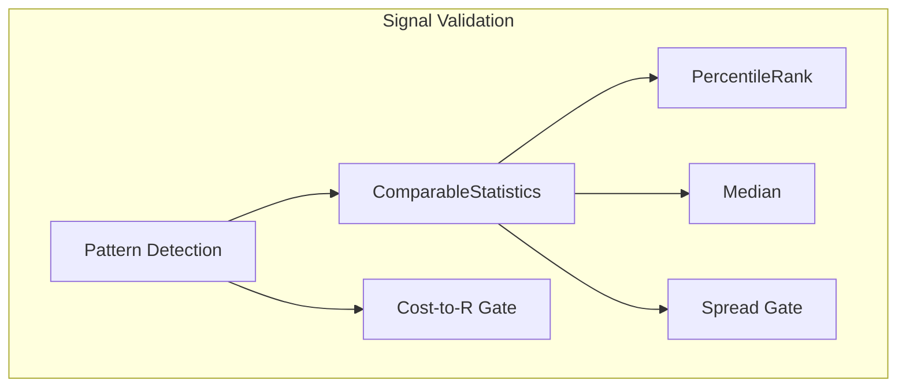
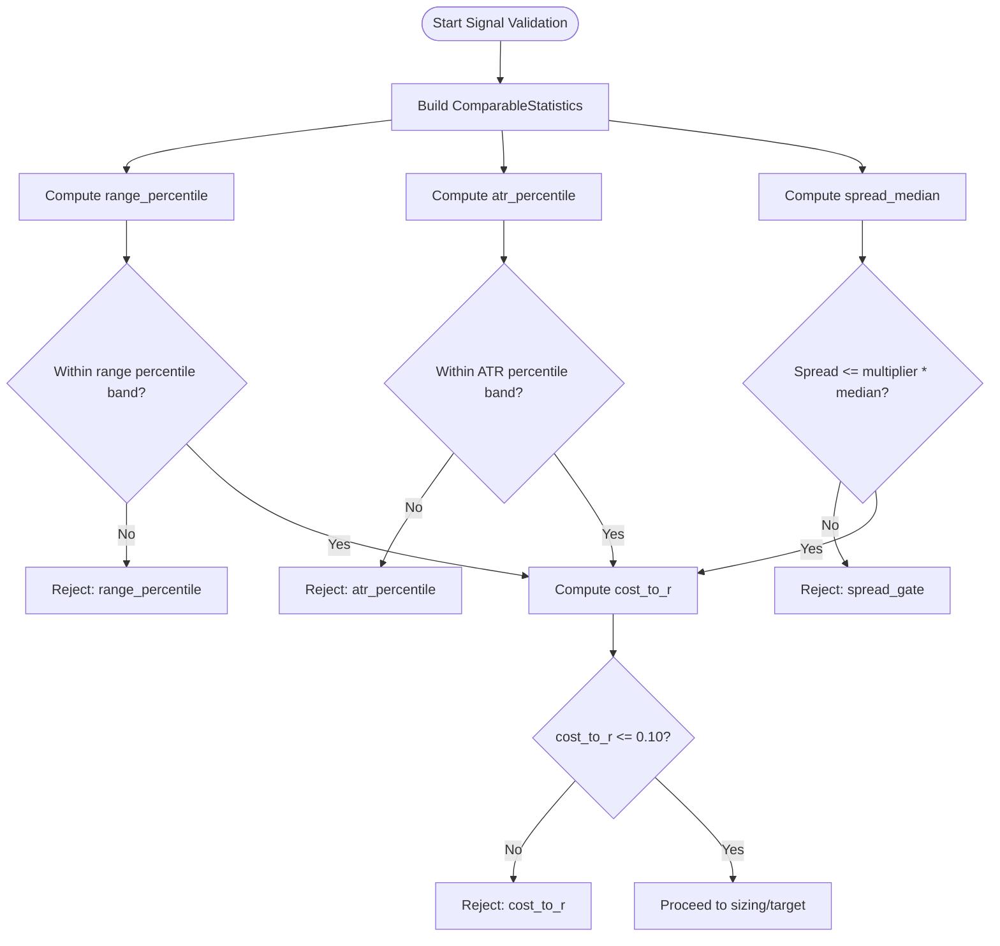

# Volatility and Spread Filters

<cite>
**Referenced Files in This Document**
- [TRIAD_R_HS.mq5](file://MQL5/Experts/TRIAD_R_HS/TRIAD_R_HS.mq5)
- [TRIAD_SCREEN.mq5](file://MQL5/Experts/TRIAD_SCREEN/TRIAD_SCREEN.mq5)
</cite>

## Table of Contents
1. [Introduction](#introduction)
2. [Project Structure](#project-structure)
3. [Core Components](#core-components)
4. [Architecture Overview](#architecture-overview)
5. [Detailed Component Analysis](#detailed-component-analysis)
6. [Dependency Analysis](#dependency-analysis)
7. [Performance Considerations](#performance-considerations)
8. [Troubleshooting Guide](#troubleshooting-guide)
9. [Conclusion](#conclusion)

## Introduction
This document explains the volatility and spread filtering gates used to validate trading opportunities before execution. It covers:
- Reference-range width validation using historical percentile bands from prior completed comparable sessions.
- ATR(M15,14)-based volatility filter using historical percentile bands from prior session opens.
- Spread limit validation ensuring current spread does not exceed a multiple of its median for the same symbol and minute-of-session over prior comparable sessions.
- Estimated all-in round-trip cost calculation capped at 0.10R.
It also documents how these filters adapt to different market conditions and prevent trading during abnormal volatility or liquidity events.

## Project Structure
The relevant logic is implemented in two MQL5 Expert Advisors:
- TRIAD_R_HS.mq5: Canonical research EA with full safety machinery and gating.
- TRIAD_SCREEN.mq5: Screening/demo EA that mirrors the canonical behavior for one symbol/session.

Both files implement:
- Comparable statistics collection across prior sessions (range widths, ATR values, spreads).
- Percentile ranking against those histories.
- Spread median computation and spread gate checks.
- Cost-to-R estimation and cap enforcement.



**Diagram sources**
- [TRIAD_R_HS.mq5:1160-1223](file://MQL5/Experts/TRIAD_R_HS/TRIAD_R_HS.mq5#L1160-L1223)
- [TRIAD_SCREEN.mq5:1154-1209](file://MQL5/Experts/TRIAD_SCREEN/TRIAD_SCREEN.mq5#L1154-L1209)
- [TRIAD_R_HS.mq5:2437-2478](file://MQL5/Experts/TRIAD_R_HS/TRIAD_R_HS.mq5#L2437-L2478)
- [TRIAD_SCREEN.mq5:1700-1727](file://MQL5/Experts/TRIAD_SCREEN/TRIAD_SCREEN.mq5#L1700-L1727)

**Section sources**
- [TRIAD_R_HS.mq5:1160-1223](file://MQL5/Experts/TRIAD_R_HS/TRIAD_R_HS.mq5#L1160-L1223)
- [TRIAD_SCREEN.mq5:1154-1209](file://MQL5/Experts/TRIAD_SCREEN/TRIAD_SCREEN.mq5#L1154-L1209)

## Core Components
- ComparableStatistics: Gathers reference range widths, ATR(M15,14), and minute-of-session spreads from prior comparable sessions to build distributions for percentile comparisons.
- PercentileRank: Computes the percentile rank of the current value within the historical distribution.
- Median: Computes the median of an array used for spread baseline.
- Spread Gate: Rejects trades when current spread exceeds configured multiplier times the median spread for the same symbol and minute-of-session.
- Cost-to-R Gate: Estimates all-in round-trip costs (spread, slippage, commission) relative to stop distance and rejects if above 0.10R.

Key inputs controlling behavior:
- InpRangePercentileLow / InpRangePercentileHigh: Initial challenger ranges for reference-width percentiles.
- InpAtrPercentileLow / InpAtrPercentileHigh: Initial challenger ranges for ATR percentiles.
- InpComparableSessions: Number of prior comparable sessions used for history (canonical default 60).
- InpSpreadMedianMultiplier: Multiplier on median spread for spread gate (canonical default 1.5).
- InpMaxCostToR: Maximum allowed estimated round-trip cost as fraction of R (canonical default 0.10).

**Section sources**
- [TRIAD_R_HS.mq5:108-135](file://MQL5/Experts/TRIAD_R_HS/TRIAD_R_HS.mq5#L108-L135)
- [TRIAD_SCREEN.mq5:112-135](file://MQL5/Experts/TRIAD_SCREEN/TRIAD_SCREEN.mq5#L112-L135)
- [TRIAD_R_HS.mq5:1139-1147](file://MQL5/Experts/TRIAD_R_HS/TRIAD_R_HS.mq5#L1139-L1147)
- [TRIAD_SCREEN.mq5:1133-1141](file://MQL5/Experts/TRIAD_SCREEN/TRIAD_SCREEN.mq5#L1133-L1141)
- [TRIAD_R_HS.mq5:1130-1137](file://MQL5/Experts/TRIAD_R_HS/TRIAD_R_HS.mq5#L1130-L1137)
- [TRIAD_SCREEN.mq5:1124-1131](file://MQL5/Experts/TRIAD_SCREEN/TRIAD_SCREEN.mq5#L1124-L1131)

## Architecture Overview
The signal validation pipeline applies regime and liquidity filters before any order submission:
1. Detect pattern and compute candidate parameters (entry, stop, target).
2. Build ComparableStatistics from prior sessions to obtain:
   - Range percentile vs historical range widths.
   - ATR percentile vs historical ATR(M15,14) at session open.
   - Spread median for the same symbol and minute-of-session.
3. Apply percentile gates for reference range width and ATR.
4. Apply spread gate using current spread vs median.
5. Compute cost-to-R and enforce cap.
6. Proceed to volume sizing and target solving only if all gates pass.

```mermaid
sequenceDiagram
participant S as "Signal Candidate"
participant CS as "ComparableStatistics"
participant PR as "PercentileRank"
participant MG as "Median"
participant SG as "Spread Gate"
participant CR as "Cost-to-R Gate"
S->>CS : Collect range widths, ATR(M15,14), spreads from prior sessions
CS-->>S : range_percentile, atr_percentile, spread_median_points
S->>PR : Validate range_percentile within [InpRangePercentileLow, InpRangePercentileHigh]
S->>PR : Validate atr_percentile within [InpAtrPercentileLow, InpAtrPercentileHigh]
S->>SG : Check spread_points <= InpSpreadMedianMultiplier * spread_median_points
S->>CR : Estimate round-trip cost (spread + slippage + commission) / stop_distance
CR-->>S : cost_to_r <= InpMaxCostToR ?
S-->>S : If all pass, proceed to sizing/target; else reject with reason
```

**Diagram sources**
- [TRIAD_R_HS.mq5:2437-2478](file://MQL5/Experts/TRIAD_R_HS/TRIAD_R_HS.mq5#L2437-L2478)
- [TRIAD_SCREEN.mq5:1700-1727](file://MQL5/Experts/TRIAD_SCREEN/TRIAD_SCREEN.mq5#L1700-L1727)
- [TRIAD_R_HS.mq5:1160-1223](file://MQL5/Experts/TRIAD_R_HS/TRIAD_R_HS.mq5#L1160-L1223)
- [TRIAD_SCREEN.mq5:1154-1209](file://MQL5/Experts/TRIAD_SCREEN/TRIAD_SCREEN.mq5#L1154-L1209)

## Detailed Component Analysis

### Reference-Range Width Validation
- Purpose: Ensure today’s reference range width is consistent with recent regimes.
- History: Prior 60 completed comparable sessions’ range widths are collected per session bounds.
- Percentile Calculation: Current range width is ranked against the historical distribution using PercentileRank.
- Allowed Bands:
  - Initial configuration: [30th, 80th] percentile.
  - Challenger configuration: [35th, 75th] percentile.
- Rejection: If outside the configured band, the candidate is rejected with reason “range_percentile”.

Implementation references:
- ComparableStatistics builds arrays of range widths and computes range_percentile via PercentileRank.
- The gating check compares candidate.range_percentile against InpRangePercentileLow and InpRangePercentileHigh.

Code snippet paths:
- [ComparableStatistics range collection and percentile computation:1160-1223](file://MQL5/Experts/TRIAD_R_HS/TRIAD_R_HS.mq5#L1160-L1223)
- [Range percentile gate check:2445-2449](file://MQL5/Experts/TRIAD_R_HS/TRIAD_R_HS.mq5#L2445-L2449)
- [Screening EA equivalent flow:1154-1209](file://MQL5/Experts/TRIAD_SCREEN/TRIAD_SCREEN.mq5#L1154-L1209)
- [Screening EA range percentile gate:1704-1708](file://MQL5/Experts/TRIAD_SCREEN/TRIAD_SCREEN.mq5#L1704-L1708)

**Section sources**
- [TRIAD_R_HS.mq5:1160-1223](file://MQL5/Experts/TRIAD_R_HS/TRIAD_R_HS.mq5#L1160-L1223)
- [TRIAD_R_HS.mq5:2445-2449](file://MQL5/Experts/TRIAD_R_HS/TRIAD_R_HS.mq5#L2445-L2449)
- [TRIAD_SCREEN.mq5:1154-1209](file://MQL5/Experts/TRIAD_SCREEN/TRIAD_SCREEN.mq5#L1154-L1209)
- [TRIAD_SCREEN.mq5:1704-1708](file://MQL5/Experts/TRIAD_SCREEN/TRIAD_SCREEN.mq5#L1704-L1708)

### ATR(M15,14) Volatility Filter
- Purpose: Ensure volatility regime is neither too low nor too high compared to recent session opens.
- History: For each prior comparable session, ATR(M15,14) is sampled at the session open boundary using ComputeAtrBefore.
- Percentile Calculation: Current ATR is ranked against the historical ATR distribution.
- Allowed Bands:
  - Initial configuration: [20th, 80th] percentile.
  - Challenger configuration: [25th, 75th] percentile.
- Rejection: If outside the configured band, the candidate is rejected with reason “atr_percentile”.

Implementation references:
- ComputeAtrBefore retrieves the canonical iATR(M15,14) value anchored to a completed M15 bar just before the session open.
- ComparableStatistics collects these ATR values into a history array and computes atr_percentile.
- The gating check compares candidate.atr_percentile against InpAtrPercentileLow and InpAtrPercentileHigh.

Code snippet paths:
- [ComputeAtrBefore ATR retrieval:1035-1063](file://MQL5/Experts/TRIAD_R_HS/TRIAD_R_HS.mq5#L1035-L1063)
- [ComparableStatistics ATR collection and percentile:1160-1223](file://MQL5/Experts/TRIAD_R_HS/TRIAD_R_HS.mq5#L1160-L1223)
- [ATR percentile gate check:2450-2454](file://MQL5/Experts/TRIAD_R_HS/TRIAD_R_HS.mq5#L2450-L2454)
- [Screening EA ATR gate:1709-1713](file://MQL5/Experts/TRIAD_SCREEN/TRIAD_SCREEN.mq5#L1709-L1713)

**Section sources**
- [TRIAD_R_HS.mq5:1035-1063](file://MQL5/Experts/TRIAD_R_HS/TRIAD_R_HS.mq5#L1035-L1063)
- [TRIAD_R_HS.mq5:1160-1223](file://MQL5/Experts/TRIAD_R_HS/TRIAD_R_HS.mq5#L1160-L1223)
- [TRIAD_R_HS.mq5:2450-2454](file://MQL5/Experts/TRIAD_R_HS/TRIAD_R_HS.mq5#L2450-L2454)
- [TRIAD_SCREEN.mq5:1709-1713](file://MQL5/Experts/TRIAD_SCREEN/TRIAD_SCREEN.mq5#L1709-L1713)

### Spread Limit Validation
- Purpose: Prevent trading during abnormal liquidity conditions by comparing current spread to historical median.
- History: For each prior comparable session, the spread at the exact minute-of-session corresponding to the signal decision time is recorded.
- Median Calculation: Median(spreads) provides the baseline spread for the symbol and minute-of-session.
- Gate Rule: Reject if current spread_points > InpSpreadMedianMultiplier * spread_median_points. Default multiplier is 1.5.
- Rejection: Reason “spread_gate” when exceeded.

Implementation references:
- GetHistoricalMinuteSpread reads the 1-minute bar spread at the comparable time.
- ComparableStatistics computes spread_median via Median.
- The spread gate is enforced immediately after ComparableStatistics returns.

Code snippet paths:
- [GetHistoricalMinuteSpread:1149-1158](file://MQL5/Experts/TRIAD_R_HS/TRIAD_R_HS.mq5#L1149-L1158)
- [Median function:1130-1137](file://MQL5/Experts/TRIAD_R_HS/TRIAD_R_HS.mq5#L1130-L1137)
- [Spread gate enforcement:2463-2468](file://MQL5/Experts/TRIAD_R_HS/TRIAD_R_HS.mq5#L2463-L2468)
- [Screening EA spread gate:1714-1719](file://MQL5/Experts/TRIAD_SCREEN/TRIAD_SCREEN.mq5#L1714-L1719)

**Section sources**
- [TRIAD_R_HS.mq5:1149-1158](file://MQL5/Experts/TRIAD_R_HS/TRIAD_R_HS.mq5#L1149-L1158)
- [TRIAD_R_HS.mq5:1130-1137](file://MQL5/Experts/TRIAD_R_HS/TRIAD_R_HS.mq5#L1130-L1137)
- [TRIAD_R_HS.mq5:2463-2468](file://MQL5/Experts/TRIAD_R_HS/TRIAD_R_HS.mq5#L2463-L2468)
- [TRIAD_SCREEN.mq5:1714-1719](file://MQL5/Experts/TRIAD_SCREEN/TRIAD_SCREEN.mq5#L1714-L1719)

### Estimated All-In Round-Trip Cost Cap at 0.10R
- Purpose: Ensure trading costs do not consume excessive risk capital.
- Components:
  - Current spread cost computed via OrderCalcProfit for the entry side.
  - Expected slippage modeled as adverse price movement equal to configured reserve points (stop and target slippage reserves).
  - Commission per lot round trip added.
- Metric: cost_to_r = (|spread_result| + |slippage_result| + commission) / |price_risk|.
- Gate: Reject if cost_to_r > InpMaxCostToR (default 0.10).
- Rejection: Reason “cost_to_r”.

Implementation references:
- CurrentCostToR calculates spread and slippage effects and divides by stop-distance-based price risk.
- The gate enforces the cap before proceeding to volume sizing and target solving.

Code snippet paths:
- [CurrentCostToR implementation:2172-2204](file://MQL5/Experts/TRIAD_R_HS/TRIAD_R_HS.mq5#L2172-L2204)
- [Cost-to-R gate enforcement:2470-2478](file://MQL5/Experts/TRIAD_R_HS/TRIAD_R_HS.mq5#L2470-L2478)
- [Screening EA cost-to-R gate:1721-1727](file://MQL5/Experts/TRIAD_SCREEN/TRIAD_SCREEN.mq5#L1721-L1727)

**Section sources**
- [TRIAD_R_HS.mq5:2172-2204](file://MQL5/Experts/TRIAD_R_HS/TRIAD_R_HS.mq5#L2172-L2204)
- [TRIAD_R_HS.mq5:2470-2478](file://MQL5/Experts/TRIAD_R_HS/TRIAD_R_HS.mq5#L2470-L2478)
- [TRIAD_SCREEN.mq5:1721-1727](file://MQL5/Experts/TRIAD_SCREEN/TRIAD_SCREEN.mq5#L1721-L1727)

### How Filters Adapt to Market Conditions
- Reference-range width percentile: Adapts to changing intraday volatility structures by comparing current range width to recent sessions; narrower or wider-than-normal ranges are filtered out.
- ATR(M15,14) percentile: Captures broader volatility regime shifts; prevents entries during unusually calm or turbulent periods.
- Spread median gate: Protects against liquidity squeezes where spreads widen abnormally relative to typical levels at the same minute-of-session.
- Cost-to-R cap: Ensures that even if signals appear valid, excessive costs (spread, slippage, commission) will block trades that would erode expected edge.

These mechanisms collectively reduce exposure to abnormal events while allowing participation in normal market conditions.

[No sources needed since this section synthesizes previously analyzed components]

## Dependency Analysis
- ComparableStatistics depends on:
  - ReadRange to get prior session highs/lows.
  - ComputeAtrBefore to sample ATR(M15,14) at session open.
  - GetHistoricalMinuteSpread to sample spreads at minute-of-session timestamps.
- PercentileRank and Median are pure functions operating on arrays built by ComparableStatistics.
- Spread gate and cost-to-R gate depend on live tick data and symbol properties.



**Diagram sources**
- [TRIAD_R_HS.mq5:1160-1223](file://MQL5/Experts/TRIAD_R_HS/TRIAD_R_HS.mq5#L1160-L1223)
- [TRIAD_R_HS.mq5:2437-2478](file://MQL5/Experts/TRIAD_R_HS/TRIAD_R_HS.mq5#L2437-L2478)
- [TRIAD_SCREEN.mq5:1154-1209](file://MQL5/Experts/TRIAD_SCREEN/TRIAD_SCREEN.mq5#L1154-L1209)
- [TRIAD_SCREEN.mq5:1700-1727](file://MQL5/Experts/TRIAD_SCREEN/TRIAD_SCREEN.mq5#L1700-L1727)

**Section sources**
- [TRIAD_R_HS.mq5:1160-1223](file://MQL5/Experts/TRIAD_R_HS/TRIAD_R_HS.mq5#L1160-L1223)
- [TRIAD_R_HS.mq5:2437-2478](file://MQL5/Experts/TRIAD_R_HS/TRIAD_R_HS.mq5#L2437-L2478)
- [TRIAD_SCREEN.mq5:1154-1209](file://MQL5/Experts/TRIAD_SCREEN/TRIAD_SCREEN.mq5#L1154-L1209)
- [TRIAD_SCREEN.mq5:1700-1727](file://MQL5/Experts/TRIAD_SCREEN/TRIAD_SCREEN.mq5#L1700-L1727)

## Performance Considerations
- ComparableStatistics iterates up to 160 attempts to collect InpComparableSessions (default 60) prior sessions, skipping weekends and invalid dates. This ensures robustness but can be computationally intensive on slow systems.
- PercentileRank performs O(n) scans over the history arrays; with n=60, this is negligible.
- Median sorts the spreads array; sorting 60 elements is trivial.
- ATR retrieval uses MT5’s iATR buffer; ensure sufficient bars are calculated before use to avoid EMPTY_VALUE results.
- Tick freshness checks prevent stale quotes from influencing decisions.

[No sources needed since this section provides general guidance]

## Troubleshooting Guide
Common rejection reasons and their causes:
- “comparable_stats”: Insufficient history loaded; ensure enough prior sessions are available and session bounds are correctly computed.
- “range_percentile”: Current reference range width falls outside configured percentile band; adjust bands or wait for more typical conditions.
- “atr_percentile”: Current ATR(M15,14) falls outside configured percentile band; indicates unusual volatility regime.
- “spread_gate”: Current spread exceeds configured multiplier times median spread; indicates liquidity stress.
- “cost_to_r”: Estimated round-trip cost exceeds 0.10R; consider tighter costs or different instruments/times.

Operational tips:
- Verify server time and session bounds to ensure correct minute-of-session matching.
- Confirm that ATR handles have sufficient bars calculated before sampling.
- Monitor news blackout windows and quote freshness to avoid false rejections due to external events or stale data.

**Section sources**
- [TRIAD_R_HS.mq5:2437-2478](file://MQL5/Experts/TRIAD_R_HS/TRIAD_R_HS.mq5#L2437-L2478)
- [TRIAD_SCREEN.mq5:1700-1727](file://MQL5/Experts/TRIAD_SCREEN/TRIAD_SCREEN.mq5#L1700-L1727)

## Conclusion
The volatility and spread filters provide a robust, historically grounded mechanism to admit only trades occurring under normal regime conditions and adequate liquidity. By validating reference-range width and ATR(M15,14) percentiles against prior sessions, enforcing spread limits relative to minute-of-session medians, and capping all-in costs at 0.10R, the system avoids trading during abnormal volatility or liquidity events. These gates adapt dynamically to evolving market conditions and protect capital by rejecting setups that are statistically inconsistent with recent experience or economically unviable due to costs.

[No sources needed since this section summarizes without analyzing specific files]