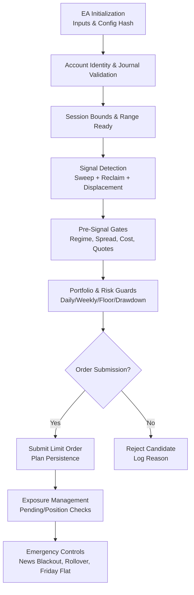
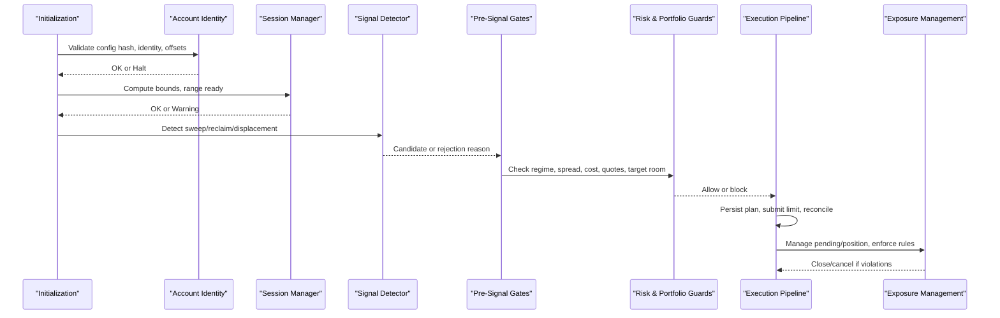
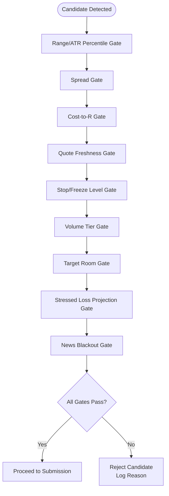
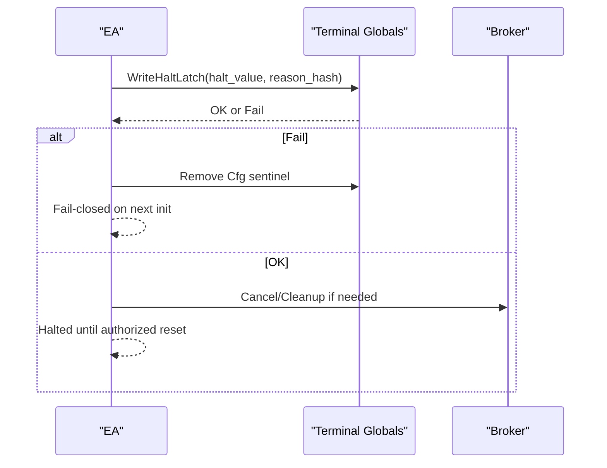
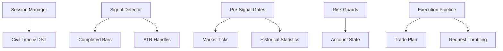

# Compliance Gates and Safety Mechanisms

<cite>
**Referenced Files in This Document**
- [TRIAD_R_HS.mq5](file://MQL5/Experts/TRIAD_R_HS/TRIAD_R_HS.mq5)
- [README.md](file://MQL5/Experts/TRIAD_R_HS/README.md)
</cite>

## Table of Contents
1. [Introduction](#introduction)
2. [Project Structure](#project-structure)
3. [Core Components](#core-components)
4. [Architecture Overview](#architecture-overview)
5. [Detailed Component Analysis](#detailed-component-analysis)
6. [Dependency Analysis](#dependency-analysis)
7. [Performance Considerations](#performance-considerations)
8. [Troubleshooting Guide](#troubleshooting-guide)
9. [Conclusion](#conclusion)

## Introduction
This document explains the compliance gates and safety mechanisms implemented in the TRIAD-R High Stakes strategy (revision 2.1). It focuses on:
- The mandatory pre-signal gates that must pass before any order is submitted
- Firm-rule and target protection systems, including phase initial balance persistence, configuration checksums, and rollover boundary enforcement
- Portfolio-level constraints such as maximum two sequential trades per server day, one-position rule, and rate limiting of non-emergency trade requests
- Emergency halt mechanisms and reconciliation procedures when safety systems trigger

The EA is intentionally fail-closed by default and requires explicit operator attestations to enable live trading.

**Section sources**
- [TRIAD_R_HS.mq5:1-14](file://MQL5/Experts/TRIAD_R_HS/TRIAD_R_HS.mq5#L1-L14)
- [TRIAD_R_HS.mq5:53-76](file://MQL5/Experts/TRIAD_R_HS/TRIAD_R_HS.mq5#L53-L76)
- [TRIAD_R_HS.mq5:3599-3614](file://MQL5/Experts/TRIAD_R_HS/TRIAD_R_HS.mq5#L3599-L3614)
- [README.md:1-8](file://MQL5/Experts/TRIAD_R_HS/README.md#L1-L8)

## Project Structure
The strategy is implemented as a single MQL5 Expert Advisor with embedded safety logic, session management, signal detection, cost/risk validation, and execution controls. Supporting documentation describes safe installation, news calendar contract, and required validation steps.

**Diagram sources**
- [TRIAD_R_HS.mq5:3536-3597](file://MQL5/Experts/TRIAD_R_HS/TRIAD_R_HS.mq5#L3536-L3597)
- [TRIAD_R_HS.mq5:1714-1846](file://MQL5/Experts/TRIAD_R_HS/TRIAD_R_HS.mq5#L1714-L1846)
- [TRIAD_R_HS.mq5:1936-2522](file://MQL5/Experts/TRIAD_R_HS/TRIAD_R_HS.mq5#L1936-L2522)
- [TRIAD_R_HS.mq5:2692-2901](file://MQL5/Experts/TRIAD_R_HS/TRIAD_R_HS.mq5#L2692-L2901)
- [TRIAD_R_HS.mq5:2942-3284](file://MQL5/Experts/TRIAD_R_HS/TRIAD_R_HS.mq5#L2942-L3284)

**Section sources**
- [TRIAD_R_HS.mq5:16-76](file://MQL5/Experts/TRIAD_R_HS/TRIAD_R_HS.mq5#L16-L76)
- [TRIAD_R_HS.mq5:158-262](file://MQL5/Experts/TRIAD_R_HS/TRIAD_R_HS.mq5#L158-L262)
- [TRIAD_R_HS.mq5:3950-3999](file://MQL5/Experts/TRIAD_R_HS/TRIAD_R_HS.mq5#L3950-L3999)
- [README.md:15-26](file://MQL5/Experts/TRIAD_R_HS/README.md#L15-L26)

## Core Components
- Configuration and release gates: Build ID, config hash, runtime identity, and operator attestations prevent unauthorized deployment.
- Session manager: London and New York sessions with range windows, entry windows, and consumed-state persistence.
- Signal detector: Sweep/reclaim/displacement pattern recognition with strict bar availability checks.
- Pre-signal gate suite: Regime filters (range/ATR percentiles), spread limits, cost-to-R, quote freshness, broker stop/freeze levels, and target room checks.
- Portfolio and risk guards: Daily/weekly stops, firm floor, drawdown shutdown, phase targets, lifecycle locks, and external cashflow detection.
- Execution pipeline: Plan persistence, request throttling, latency caps, revalidation, and exposure reconciliation.
- Emergency controls: News blackout, rollover flat, Friday flat, missing exits, stale quotes, and foreign exposure cleanup.

**Section sources**
- [TRIAD_R_HS.mq5:364-428](file://MQL5/Experts/TRIAD_R_HS/TRIAD_R_HS.mq5#L364-L428)
- [TRIAD_R_HS.mq5:1867-1909](file://MQL5/Experts/TRIAD_R_HS/TRIAD_R_HS.mq5#L1867-L1909)
- [TRIAD_R_HS.mq5:1936-2116](file://MQL5/Experts/TRIAD_R_HS/TRIAD_R_HS.mq5#L1936-L2116)
- [TRIAD_R_HS.mq5:2380-2522](file://MQL5/Experts/TRIAD_R_HS/TRIAD_R_HS.mq5#L2380-L2522)
- [TRIAD_R_HS.mq5:1593-1846](file://MQL5/Experts/TRIAD_R_HS/TRIAD_R_HS.mq5#L1593-L1846)
- [TRIAD_R_HS.mq5:2692-2901](file://MQL5/Experts/TRIAD_R_HS/TRIAD_R_HS.mq5#L2692-L2901)
- [TRIAD_R_HS.mq5:2942-3284](file://MQL5/Experts/TRIAD_R_HS/TRIAD_R_HS.mq5#L2942-L3284)

## Architecture Overview
The architecture enforces a fail-closed design with layered checks at every stage from initialization to execution and exposure management.

**Diagram sources**
- [TRIAD_R_HS.mq5:3536-3597](file://MQL5/Experts/TRIAD_R_HS/TRIAD_R_HS.mq5#L3536-L3597)
- [TRIAD_R_HS.mq5:1714-1846](file://MQL5/Experts/TRIAD_R_HS/TRIAD_R_HS.mq5#L1714-L1846)
- [TRIAD_R_HS.mq5:1936-2522](file://MQL5/Experts/TRIAD_R_HS/TRIAD_R_HS.mq5#L1936-L2522)
- [TRIAD_R_HS.mq5:2692-2901](file://MQL5/Experts/TRIAD_R_HS/TRIAD_R_HS.mq5#L2692-L2901)
- [TRIAD_R_HS.mq5:2942-3284](file://MQL5/Experts/TRIAD_R_HS/TRIAD_R_HS.mq5#L2942-L3284)

## Detailed Component Analysis

### 13 Mandatory Pre-Signal Gates
These gates are enforced before submitting an order. Each gate either validates market conditions or rejects the candidate with a specific reason.

1. Instrument/session enablement
   - Only enabled symbols/sessions participate; symbol contracts validated for base/profit currencies and capabilities.
   - Example path: symbol selection and capability checks during initialization and session refresh.
   - Failure behavior: logs error and prevents enabling that sleeve; no orders for disabled instruments.

2. Working order checks
   - Pending entries are validated against expected plan; mismatches cause deletion and halt.
   - Example path: pending order verification and plan matching.
   - Failure behavior: deletes mismatched orders and halts to prevent uncontrolled exposure.

3. Reference-range width validation
   - Range percentile computed over comparable historical sessions; must fall within configured bands.
   - Example path: ComparableStatistics and range percentile check.
   - Failure behavior: candidate rejected with “range_percentile”.

4. ATR volatility filtering
   - ATR percentile computed using canonical iATR(M15,14); must be within configured bands.
   - Example path: ComputeAtrBefore and atr percentile check.
   - Failure behavior: candidate rejected with “atr_percentile”.

5. Spread limits
   - Current spread compared to median spread; must not exceed multiplier threshold.
   - Example path: spread gate in PrepareCandidate and RefreshCandidateQuoteState.
   - Failure behavior: candidate rejected with “spread_gate” or “spread_gate_recheck”.

6. Cost estimation
   - Cost-to-R includes spread, slippage reserves, and commission via OrderCalcProfit; must be below max threshold.
   - Example path: CurrentCostToR and cost_to_r check.
   - Failure behavior: candidate rejected with “cost_to_r” or “cost_to_r_recheck”.

7. News blackout verification
   - No new entries allowed within configured minutes around relevant red/high events; existing positions flattened near events.
   - Example path: IsRelevantNewsWindow, UpcomingRelevantNews, RecentRelevantNews.
   - Failure behavior: candidate rejected with “news_blackout”; pending orders deleted; positions closed pre/post news.

8. Quote validity
   - Tick must be fresh and prices must allow executable limit placement; stale or invalid quotes reject candidates.
   - Example path: TickIsFresh and quote checks in PrepareCandidate and submission revalidation.
   - Failure behavior: candidate rejected with “quote_stale” or “quote_changed_or_stale”.

9. Execution health monitoring
   - Trade request latency capped; failures trigger reconciliation and cleanup.
   - Example path: request latency measurement and breach handling.
   - Failure behavior: halts and cancels/closes to avoid uncertain exposure.

10. Stop/freeze level compliance
    - Broker minimum distances for stop and freeze enforced; invalid distances reject candidates.
    - Example path: BrokerDistancesValid.
    - Failure behavior: candidate rejected with “broker_stop_or_freeze_level”.

11. Volume tier validation
    - Volume rounded to broker step and within min/max/directional limits; margin availability checked.
    - Example path: CalculateVolume and MarginAvailableForCandidate.
    - Failure behavior: candidate rejected with “volume_or_min_lot” or “insufficient_or_unknown_margin”.

12. Target room checking
    - Target must fit within available price space relative to range boundaries; otherwise rejected.
    - Example path: target room checks after solving target price.
    - Failure behavior: candidate rejected with “target_room”.

13. Stressed loss projection
    - Projected equity after worst-case stress must remain above firm floor, daily/weekly stops, and drawdown shutdown.
    - Example path: CanTakeCashRisk and GlobalRiskGuards.
    - Failure behavior: candidate rejected with reasons like “firm_floor_projection”, “internal_daily_projection”, “strategy_drawdown_projection”.

**Diagram sources**
- [TRIAD_R_HS.mq5:2380-2522](file://MQL5/Experts/TRIAD_R_HS/TRIAD_R_HS.mq5#L2380-L2522)
- [TRIAD_R_HS.mq5:1685-1712](file://MQL5/Experts/TRIAD_R_HS/TRIAD_R_HS.mq5#L1685-L1712)
- [TRIAD_R_HS.mq5:2154-2204](file://MQL5/Experts/TRIAD_R_HS/TRIAD_R_HS.mq5#L2154-L2204)
- [TRIAD_R_HS.mq5:2236-2271](file://MQL5/Experts/TRIAD_R_HS/TRIAD_R_HS.mq5#L2236-L2271)
- [TRIAD_R_HS.mq5:2273-2309](file://MQL5/Experts/TRIAD_R_HS/TRIAD_R_HS.mq5#L2273-L2309)
- [TRIAD_R_HS.mq5:2311-2341](file://MQL5/Experts/TRIAD_R_HS/TRIAD_R_HS.mq5#L2311-L2341)
- [TRIAD_R_HS.mq5:2428-2435](file://MQL5/Experts/TRIAD_R_HS/TRIAD_R_HS.mq5#L2428-L2435)

**Section sources**
- [TRIAD_R_HS.mq5:1936-2522](file://MQL5/Experts/TRIAD_R_HS/TRIAD_R_HS.mq5#L1936-L2522)
- [TRIAD_R_HS.mq5:1685-1712](file://MQL5/Experts/TRIAD_R_HS/TRIAD_R_HS.mq5#L1685-L1712)
- [TRIAD_R_HS.mq5:2154-2341](file://MQL5/Experts/TRIAD_R_HS/TRIAD_R_HS.mq5#L2154-L2341)
- [TRIAD_R_HS.mq5:2428-2522](file://MQL5/Experts/TRIAD_R_HS/TRIAD_R_HS.mq5#L2428-L2522)

### Firm-Rule and Target Protection Systems
- Phase initial balance persistence
  - Initial balance is persisted and validated across restarts; mismatches halt operation.
  - Example path: LoadOrCreateAccountState and state signature checks.
  - Failure behavior: halts with “persisted_initial_mismatch” or “state_signature_mismatch”.

- Configuration checksums
  - Build ID and all critical inputs hashed into a config hash; runtime identity includes login/server/currency/product/phase.
  - Example path: BuildConfigHash, RuntimeIdentityHash, AccountStateSignature.
  - Failure behavior: halts on config/hash mismatch or incomplete state.

- Rollover boundary enforcement
  - At server midnight, the EA reconciles daily floors, weekly baselines, and high-water marks; missed rollover exposure triggers migration and halt.
  - Example path: ProcessRollover and MissedRolloverExposure.
  - Failure behavior: halts with “missed_rollover_exposure” or “unexpected_rollover_exposure”; forces flat and migration.

- Lifecycle locks
  - Payout, phase transition, and scale transition locks prevent new trades until formal reconciliation.
  - Example path: GlobalRiskGuards lifecycle lock checks.
  - Failure behavior: blocks entries with reasons like “payout_request_lock”.

- Target arrival and dashboard days
  - When balance reaches phase target, entries stop unless dashboard confirms qualifying days; otherwise enters target_pending_days state.
  - Example path: PhaseTargetBalance and EffectiveConfirmedDays.
  - Failure behavior: blocks entries with “phase_complete” or “target_pending_days”.

**Section sources**
- [TRIAD_R_HS.mq5:3765-3948](file://MQL5/Experts/TRIAD_R_HS/TRIAD_R_HS.mq5#L3765-L3948)
- [TRIAD_R_HS.mq5:3379-3514](file://MQL5/Experts/TRIAD_R_HS/TRIAD_R_HS.mq5#L3379-L3514)
- [TRIAD_R_HS.mq5:1660-1672](file://MQL5/Experts/TRIAD_R_HS/TRIAD_R_HS.mq5#L1660-L1672)
- [TRIAD_R_HS.mq5:1806-1846](file://MQL5/Experts/TRIAD_R_HS/TRIAD_R_HS.mq5#L1806-L1846)

### Portfolio-Level Constraints
- Maximum two sequential trades per server day
  - Daily history reconstructed; more than two completed trades blocks further entries.
  - Example path: RebuildDailyClosedTrades and DailyStateAllowsEntry.
  - Failure behavior: blocks with “two_completed_trades”.

- One-position rule
  - Enforced via exposure invariant checks; multiple or overlapping exposures trigger immediate cleanup.
  - Example path: ManageExposure position/pending checks.
  - Failure behavior: halts with “multiple_or_overlapping_exposure” and closes/cancels.

- Rate limiting of non-emergency trade requests
  - Non-emergency requests capped per day; exceeding cap halts operation.
  - Example path: CanSendNonEmergencyRequest and CountTradeRequest.
  - Failure behavior: halts with “non_emergency_request_cap”.

- External cashflow and unauthorized history
  - Any deposit/withdrawal/bonus/correction or unauthorized magic/history triggers migration latch and halt.
  - Example path: CheckExternalCashflow and RequireStateMigration.
  - Failure behavior: halts with “external_cashflow_requires_rebaseline_release” or “unauthorized_trading_history”.

**Section sources**
- [TRIAD_R_HS.mq5:1274-1352](file://MQL5/Experts/TRIAD_R_HS/TRIAD_R_HS.mq5#L1274-L1352)
- [TRIAD_R_HS.mq5:1593-1619](file://MQL5/Experts/TRIAD_R_HS/TRIAD_R_HS.mq5#L1593-L1619)
- [TRIAD_R_HS.mq5:2528-2558](file://MQL5/Experts/TRIAD_R_HS/TRIAD_R_HS.mq5#L2528-L2558)
- [TRIAD_R_HS.mq5:2942-2994](file://MQL5/Experts/TRIAD_R_HS/TRIAD_R_HS.mq5#L2942-L2994)
- [TRIAD_R_HS.mq5:1419-1523](file://MQL5/Experts/TRIAD_R_HS/TRIAD_R_HS.mq5#L1419-L1523)

### Emergency Halt Mechanisms and Reconciliation Procedures
- Persistent halt latch
  - Halt value and reason hash stored with a domain-specific signature; partial writes fail closed.
  - Example path: WriteHaltLatch, ReadHaltLatch, Halt.
  - Failure behavior: halts and removes configuration sentinel if persist fails.

- Audit log failure
  - If audit log cannot be written, the EA halts and attempts cleanup of uncertain exposure.
  - Example path: LogEvent and post-submit audit checks.
  - Failure behavior: halts with “audit_log_failure” and cancels/closes.

- Instance lock fencing
  - Live instance ownership verified via terminal globals; stale instances fenced and halted.
  - Example path: AcquireLiveInstanceLock, RefreshLiveInstanceLock.
  - Failure behavior: halts with “live_instance_lock_not_owned” or “stale_instance_fenced”.

- Reconciliation workflow
  - On halt due to migration or external cashflow, the EA refuses ordinary reset; requires separately reviewed rebaseline release.
  - Example path: RequireStateMigration and LoadOrCreateAccountState migration checks.
  - Failure behavior: halts with “state_migration_required” or “persisted_state_migration_lock”.

**Diagram sources**
- [TRIAD_R_HS.mq5:329-350](file://MQL5/Experts/TRIAD_R_HS/TRIAD_R_HS.mq5#L329-L350)
- [TRIAD_R_HS.mq5:449-492](file://MQL5/Experts/TRIAD_R_HS/TRIAD_R_HS.mq5#L449-L492)
- [TRIAD_R_HS.mq5:3854-3894](file://MQL5/Experts/TRIAD_R_HS/TRIAD_R_HS.mq5#L3854-L3894)

**Section sources**
- [TRIAD_R_HS.mq5:329-350](file://MQL5/Experts/TRIAD_R_HS/TRIAD_R_HS.mq5#L329-L350)
- [TRIAD_R_HS.mq5:449-492](file://MQL5/Experts/TRIAD_R_HS/TRIAD_R_HS.mq5#L449-L492)
- [TRIAD_R_HS.mq5:2829-2896](file://MQL5/Experts/TRIAD_R_HS/TRIAD_R_HS.mq5#L2829-L2896)
- [TRIAD_R_HS.mq5:3854-3894](file://MQL5/Experts/TRIAD_R_HS/TRIAD_R_HS.mq5#L3854-L3894)

## Dependency Analysis
Key dependencies and their roles:
- Session manager depends on civil time conversion and DST-aware bounds
- Signal detector depends on completed bars, ATR handles, and displacement bar availability
- Pre-signal gates depend on market data (ticks, spreads), symbol properties, and historical statistics
- Risk guards depend on account state (balance/equity), daily/weekly baselines, and high-water mark
- Execution pipeline depends on plan persistence, request throttling, and broker capabilities

**Diagram sources**
- [TRIAD_R_HS.mq5:624-752](file://MQL5/Experts/TRIAD_R_HS/TRIAD_R_HS.mq5#L624-L752)
- [TRIAD_R_HS.mq5:1065-1096](file://MQL5/Experts/TRIAD_R_HS/TRIAD_R_HS.mq5#L1065-L1096)
- [TRIAD_R_HS.mq5:1035-1063](file://MQL5/Experts/TRIAD_R_HS/TRIAD_R_HS.mq5#L1035-L1063)
- [TRIAD_R_HS.mq5:1160-1223](file://MQL5/Experts/TRIAD_R_HS/TRIAD_R_HS.mq5#L1160-L1223)
- [TRIAD_R_HS.mq5:1714-1846](file://MQL5/Experts/TRIAD_R_HS/TRIAD_R_HS.mq5#L1714-L1846)
- [TRIAD_R_HS.mq5:2528-2558](file://MQL5/Experts/TRIAD_R_HS/TRIAD_R_HS.mq5#L2528-L2558)

**Section sources**
- [TRIAD_R_HS.mq5:624-752](file://MQL5/Experts/TRIAD_R_HS/TRIAD_R_HS.mq5#L624-L752)
- [TRIAD_R_HS.mq5:1035-1223](file://MQL5/Experts/TRIAD_R_HS/TRIAD_R_HS.mq5#L1035-L1223)
- [TRIAD_R_HS.mq5:1714-1846](file://MQL5/Experts/TRIAD_R_HS/TRIAD_R_HS.mq5#L1714-L1846)
- [TRIAD_R_HS.mq5:2528-2558](file://MQL5/Experts/TRIAD_R_HS/TRIAD_R_HS.mq5#L2528-L2558)

## Performance Considerations
- Historical statistics loading can be expensive; the EA uses minute-matched spread history and bounded lookbacks to minimize overhead.
- Quote freshness checks prevent stale decisions; a ten-second safety lead ensures timers do not cross exact cutoffs.
- Request latency monitoring protects against slow brokers; breaches trigger immediate halt and cleanup.
- Volume rounding and tick normalization reduce broker-side rejections and ensure valid submissions.

[No sources needed since this section provides general guidance]

## Troubleshooting Guide
Common issues and resolutions:
- News calendar stale or insufficient coverage
  - Symptom: “NEWS_COVERAGE_INSUFFICIENT” or “NEWS_RUNTIME_COVERAGE_STALE”
  - Action: Update triad_red_news.csv with verified coverage extending beyond current UTC plus required hours; reload on rollover or reattach.

- Insufficient history for statistics
  - Symptom: “STATS_INSUFFICIENT”
  - Action: Ensure sufficient M5/M15 history loaded; signals will be rejected until enough comparable sessions exist.

- Audit log write failure
  - Symptom: “AUDIT_LOG_OPEN_FAILED” or “AUDIT_LOG_WRITE_FAILED”
  - Action: Verify file permissions and disk space; EA will halt to prevent unsafe operation.

- External cashflow detected
  - Symptom: “EXTERNAL_CASHFLOW_DETECTED”
  - Action: Requires rebaseline/migration release; do not use ordinary halt reset.

- Unauthorized trading history
  - Symptom: “UNAUTHORIZED_TRADING_HISTORY” or “UNAUTHORIZED_ORDER_HISTORY”
  - Action: Investigate manual or foreign activity; requires rebaseline and formal reconciliation.

- Multiple or overlapping exposure
  - Symptom: “MULTIPLE_OR_OVERLAPPING_EXPOSURE”
  - Action: EA will cancel/close automatically; investigate why exposure invariant was violated.

- Persisted halt latch active
  - Symptom: “PERSISTED_RUNTIME_LATCH” or “PERSISTED_HALT_LOCK”
  - Action: Use one-time halt-reset authorization after resolving incident and confirming account is flat.

**Section sources**
- [TRIAD_R_HS.mq5:836-918](file://MQL5/Experts/TRIAD_R_HS/TRIAD_R_HS.mq5#L836-L918)
- [TRIAD_R_HS.mq5:1211-1218](file://MQL5/Experts/TRIAD_R_HS/TRIAD_R_HS.mq5#L1211-L1218)
- [TRIAD_R_HS.mq5:299-327](file://MQL5/Experts/TRIAD_R_HS/TRIAD_R_HS.mq5#L299-L327)
- [TRIAD_R_HS.mq5:1419-1523](file://MQL5/Experts/TRIAD_R_HS/TRIAD_R_HS.mq5#L1419-L1523)
- [TRIAD_R_HS.mq5:2970-2994](file://MQL5/Experts/TRIAD_R_HS/TRIAD_R_HS.mq5#L2970-L2994)
- [TRIAD_R_HS.mq5:3854-3894](file://MQL5/Experts/TRIAD_R_HS/TRIAD_R_HS.mq5#L3854-L3894)

## Conclusion
The TRIAD-R High Stakes strategy implements a comprehensive set of compliance gates and safety mechanisms designed to operate in a fail-closed manner. Every stage—from initialization through signal detection, pre-signal validation, portfolio and risk guarding, to execution and exposure management—includes explicit checks, logging, and emergency controls. The system enforces strict portfolio constraints, robust firm-rule protections, and rigorous reconciliation procedures to ensure safe operation under live market conditions.

[No sources needed since this section summarizes without analyzing specific files]