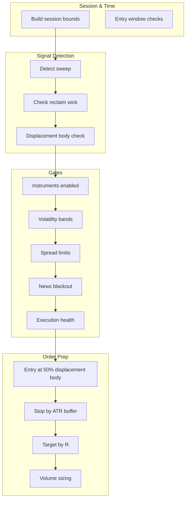
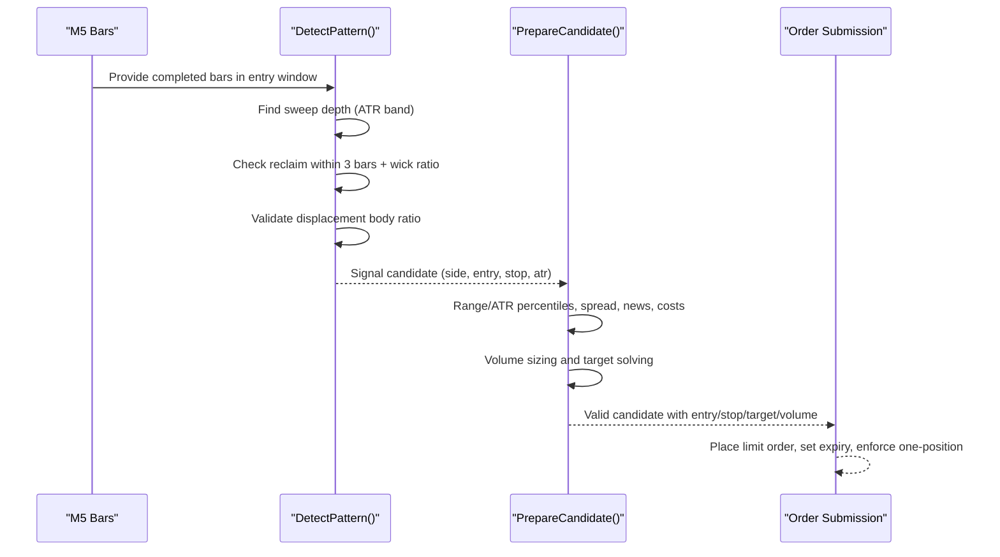
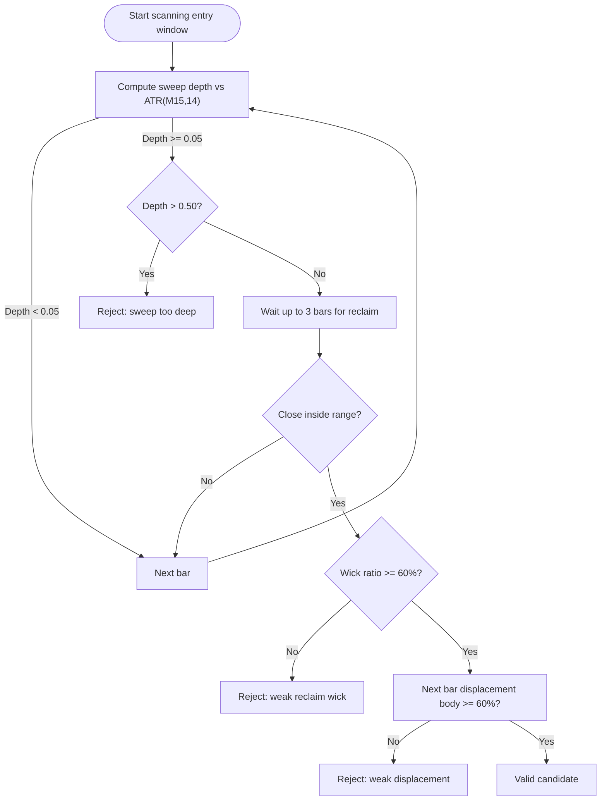
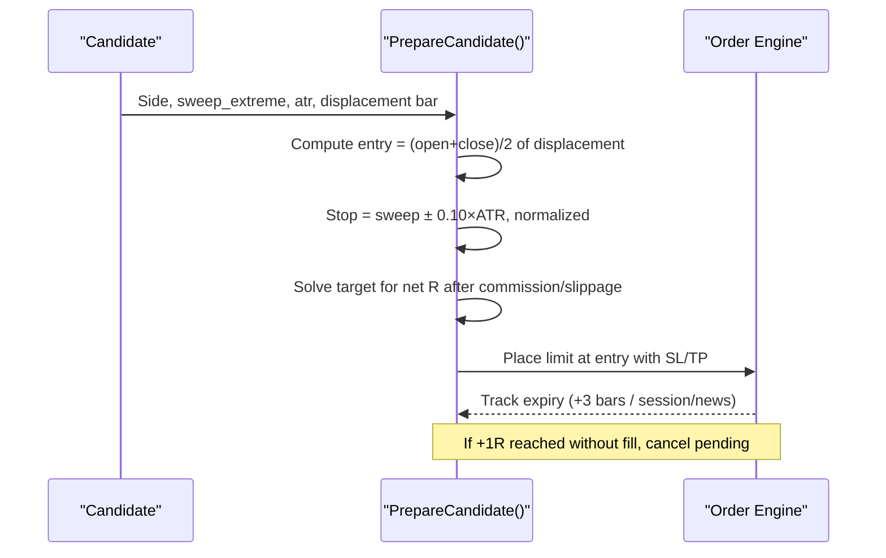
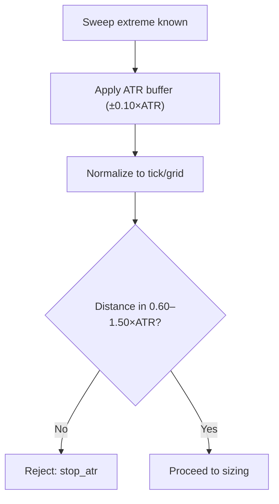
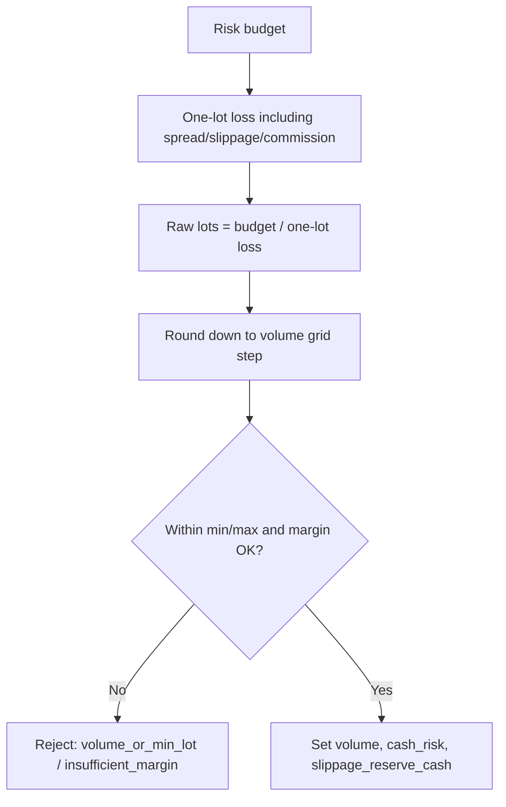
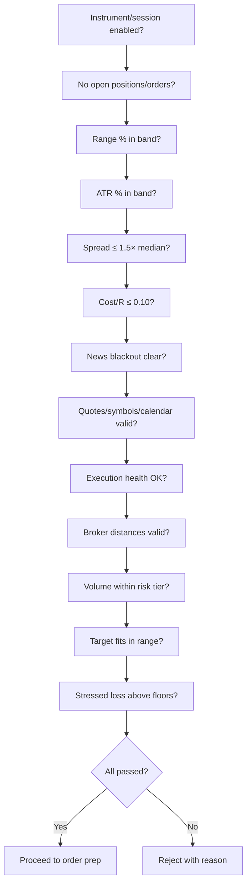
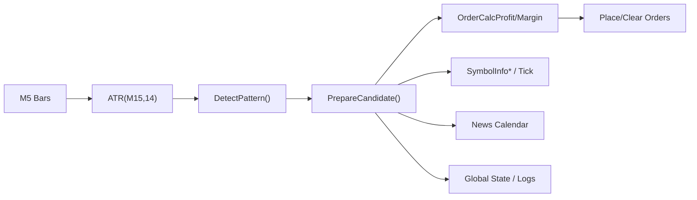

# Core Trading Rules

<cite>
**Referenced Files in This Document**
- [TRIAD_R_HS.mq5](file://MQL5/Experts/TRIAD_R_HS/TRIAD_R_HS.mq5)
- [THE5ERS-CHALLENGE-STRATEGY-V2.md](file://THE5ERS-CHALLENGE-STRATEGY-V2.md)
- [README.md](file://MQL5/Experts/TRIAD_R_HS/README.md)
- [triad_reference.py](file://tests/triad_reference.py)
</cite>

## Table of Contents
1. Introduction
2. Project Structure
3. Core Components
4. Architecture Overview
5. Detailed Component Analysis
6. Dependency Analysis
7. Performance Considerations
8. Troubleshooting Guide
9. Conclusion

## Introduction
This document specifies the core trading rules for the TRIAD-R strategy as implemented in the MQL5 Expert Advisor and aligned with the canonical specification. It focuses on the sweep/reclaim pattern recognition, entry sequence, stop/target sizing, and mandatory pre-signal gates that must pass before any order is placed. Concrete implementation references are provided via file paths and line ranges so readers can trace each rule to its source.

## Project Structure
The TRIAD-R High Stakes EA is a single-file MQL5 expert that implements:
- Session and time boundary management (London and New York windows).
- Sweep/reclaim signal detection on M5 bars using ATR(M15,14).
- Pre-signal validation gates (instruments, volatility, spread, news blackout, execution health).
- Entry preparation (limit at 50% displacement body), stop/target calculation, and volume sizing.
- Execution safety, rate limiting, and audit logging.

**Diagram sources**
- [TRIAD_R_HS.mq5:1936-2100](file://MQL5/Experts/TRIAD_R_HS/TRIAD_R_HS.mq5#L1936-L2100)
- [TRIAD_R_HS.mq5:2380-2522](file://MQL5/Experts/TRIAD_R_HS/TRIAD_R_HS.mq5#L2380-L2522)

**Section sources**
- [TRIAD_R_HS.mq5:16-150](file://MQL5/Experts/TRIAD_R_HS/TRIAD_R_HS.mq5#L16-L150)
- [TRIAD_R_HS.mq5:1936-2100](file://MQL5/Experts/TRIAD_R_HS/TRIAD_R_HS.mq5#L1936-L2100)
- [TRIAD_R_HS.mq5:2380-2522](file://MQL5/Experts/TRIAD_R_HS/TRIAD_R_HS.mq5#L2380-L2522)

## Core Components
- Pattern detection: sweep depth measured in ATR(M15,14), reclaim within three completed M5 candles, reclaim wick ratio threshold, and displacement body ratio threshold.
- Entry sequence: limit order at midpoint of displacement candle body; attach stop and target; cancel after expiry or if +1R reached without fill.
- Risk engine: ATR-based stop distance, bounded stop size, cost-to-R gate, volume selection from risk budget, and target solving for net R.
- Pre-signal gates: instrument/session enablement, no open positions, range/ATR percentile filters, spread limits, news blackout, quote freshness, broker distances, and execution health.

**Section sources**
- [TRIAD_R_HS.mq5:122-139](file://MQL5/Experts/TRIAD_R_HS/TRIAD_R_HS.mq5#L122-L139)
- [TRIAD_R_HS.mq5:1915-2100](file://MQL5/Experts/TRIAD_R_HS/TRIAD_R_HS.mq5#L1915-L2100)
- [TRIAD_R_HS.mq5:2380-2522](file://MQL5/Experts/TRIAD_R_HS/TRIAD_R_HS.mq5#L2380-L2522)
- [THE5ERS-CHALLENGE-STRATEGY-V2.md:74-114](file://THE5ERS-CHALLENGE-STRATEGY-V2.md#L74-L114)

## Architecture Overview
The EA processes M5 bars during the configured entry window, reconstructs the first qualifying sweep event, validates reclaim and displacement conditions, then runs all mandatory gates before preparing a candidate. If valid, it places a single limit order with attached stop/target and enforces cancellation/expiry logic.

**Diagram sources**
- [TRIAD_R_HS.mq5:1936-2100](file://MQL5/Experts/TRIAD_R_HS/TRIAD_R_HS.mq5#L1936-L2100)
- [TRIAD_R_HS.mq5:2380-2522](file://MQL5/Experts/TRIAD_R_HS/TRIAD_R_HS.mq5#L2380-L2522)

## Detailed Component Analysis

### Sweep/Reclaim Pattern Recognition
- Sweep condition: price trades beyond reference low/high by at least 0.05×A and at most 0.50×A of ATR(M15,14). The EA scans from the start of the entry window and records the first qualifying sweep.
- Reclaim condition: within three completed M5 candles after the sweep, an M5 candle closes back inside the reference range. The reclaim candle must have a lower/upper wick ratio of at least 60% of its total range depending on side.
- Displacement condition: the next completed M5 bar after the reclaim must be a displacement candle whose body is at least 60% of its range and closes above/below the prior candle midpoint.

**Diagram sources**
- [TRIAD_R_HS.mq5:1974-2092](file://MQL5/Experts/TRIAD_R_HS/TRIAD_R_HS.mq5#L1974-L2092)
- [TRIAD_R_HS.mq5:1915-1934](file://MQL5/Experts/TRIAD_R_HS/TRIAD_R_HS.mq5#L1915-L1934)

**Section sources**
- [TRIAD_R_HS.mq5:122-126](file://MQL5/Experts/TRIAD_R_HS/TRIAD_R_HS.mq5#L122-L126)
- [TRIAD_R_HS.mq5:1915-2100](file://MQL5/Experts/TRIAD_R_HS/TRIAD_R_HS.mq5#L1915-L2100)
- [THE5ERS-CHALLENGE-STRATEGY-V2.md:98-114](file://THE5ERS-CHALLENGE-STRATEGY-V2.md#L98-L114)

### Entry Sequence and Limit Placement
- Entry placement: limit order at 50% retracement of the displacement candle body (midpoint between open and close).
- Stop attachment: initial stop is placed beyond the sweep extreme with an ATR buffer.
- Target attachment: target solved to achieve net target R after commission and slippage allowance.
- Expiry/cancellation: cancel after three completed M5 bars, at session cutoff, before news buffer, or if +1R is reached without fill. No market chase after expiry.

**Diagram sources**
- [TRIAD_R_HS.mq5:2380-2402](file://MQL5/Experts/TRIAD_R_HS/TRIAD_R_HS.mq5#L2380-L2402)
- [TRIAD_R_HS.mq5:2273-2309](file://MQL5/Experts/TRIAD_R_HS/TRIAD_R_HS.mq5#L2273-L2309)
- [TRIAD_R_HS.mq5:2519-2522](file://MQL5/Experts/TRIAD_R_HS/TRIAD_R_HS.mq5#L2519-L2522)

**Section sources**
- [TRIAD_R_HS.mq5:2380-2522](file://MQL5/Experts/TRIAD_R_HS/TRIAD_R_HS.mq5#L2380-L2522)
- [THE5ERS-CHALLENGE-STRATEGY-V2.md:98-114](file://THE5ERS-CHALLENGE-STRATEGY-V2.md#L98-L114)

### Stop Loss Calculation and Bounds
- Long stop: sweep_low minus 0.10×ATR(M15,14).
- Short stop: sweep_high plus 0.10×ATR(M15,14).
- Stop distance must fall within 0.60–1.50×ATR(M15,14); otherwise reject.

**Diagram sources**
- [TRIAD_R_HS.mq5:2380-2402](file://MQL5/Experts/TRIAD_R_HS/TRIAD_R_HS.mq5#L2380-L2402)

**Section sources**
- [TRIAD_R_HS.mq5:128-130](file://MQL5/Experts/TRIAD_R_HS/TRIAD_R_HS.mq5#L128-L130)
- [TRIAD_R_HS.mq5:2380-2402](file://MQL5/Experts/TRIAD_R_HS/TRIAD_R_HS.mq5#L2380-L2402)
- [THE5ERS-CHALLENGE-STRATEGY-V2.md:117-128](file://THE5ERS-CHALLENGE-STRATEGY-V2.md#L117-L128)

### Position Sizing Methodology
- Budget: phase initial balance × active risk fraction (reduced by half in drawdown tier).
- All-in loss per lot includes price risk, spread, slippage reserve, and round-trip commission computed via broker functions.
- Volume selected as the largest step-aligned lot not exceeding budget; never rounded up; minimum lot enforced.
- Margin availability checked before submission.

**Diagram sources**
- [TRIAD_R_HS.mq5:2236-2271](file://MQL5/Experts/TRIAD_R_HS/TRIAD_R_HS.mq5#L2236-L2271)
- [TRIAD_R_HS.mq5:2206-2234](file://MQL5/Experts/TRIAD_R_HS/TRIAD_R_HS.mq5#L2206-L2234)

**Section sources**
- [TRIAD_R_HS.mq5:2236-2271](file://MQL5/Experts/TRIAD_R_HS/TRIAD_R_HS.mq5#L2236-L2271)
- [THE5ERS-CHALLENGE-STRATEGY-V2.md:117-147](file://THE5ERS-CHALLENGE-STRATEGY-V2.md#L117-L147)

### Mandatory Pre-Signal Gates
All gates must pass; there is no override. Key gates include:
- Instrument/session enabled by configuration.
- No working entry or open position account-wide.
- Reference-range width within historical percentile band (prior 60 comparable sessions).
- ATR(M15,14) within historical percentile band (prior 60 comparable session opens).
- Current spread ≤ 1.5× median spread for same symbol/minute-of-session (prior 60 sessions).
- Estimated all-in round-trip cost ≤ 0.10R.
- No red-folder news within 30 minutes for relevant currencies; unavailable calendar fails closed.
- Quote age, bar state, symbol properties, and calendar state valid.
- Execution health within tested latency/slippage bounds.
- Stop/target satisfy live broker freeze/stop levels.
- Rounded volume does not exceed active risk tier.
- Planned target fits inside reference range.
- Projected stressed loss remains above internal/firm floors.

**Diagram sources**
- [TRIAD_R_HS.mq5:2428-2517](file://MQL5/Experts/TRIAD_R_HS/TRIAD_R_HS.mq5#L2428-L2517)

**Section sources**
- [THE5ERS-CHALLENGE-STRATEGY-V2.md:74-93](file://THE5ERS-CHALLENGE-STRATEGY-V2.md#L74-L93)
- [TRIAD_R_HS.mq5:2428-2517](file://MQL5/Experts/TRIAD_R_HS/TRIAD_R_HS.mq5#L2428-L2517)

### Concrete Examples from Implementation

#### Long Scenario
- Sweep below reference low by 0.05–0.50×ATR(M15,14).
- Within three completed M5 bars, a candle closes back inside the reference range with lower wick ≥ 60% of range.
- Next completed M5 has body ≥ 60% of range and closes above prior candle midpoint.
- Limit placed at 50% of displacement body; stop at sweep_low − 0.10×ATR; target solved for net R; volume sized to risk budget; gates validated.

Implementation anchors:
- Sweep/reclaim/displacement detection and rejections: [DetectPattern:1974-2092](file://MQL5/Experts/TRIAD_R_HS/TRIAD_R_HS.mq5#L1974-L2092)
- Entry/stop/target/volume preparation and gates: [PrepareCandidate:2380-2522](file://MQL5/Experts/TRIAD_R_HS/TRIAD_R_HS.mq5#L2380-L2522)
- Cost-to-R and slippage modeling: [CurrentCostToR:2180-2204](file://MQL5/Experts/TRIAD_R_HS/TRIAD_R_HS.mq5#L2180-L2204)
- Volume sizing: [CalculateVolume:2236-2271](file://MQL5/Experts/TRIAD_R_HS/TRIAD_R_HS.mq5#L2236-L2271)
- Target solving: [SolveTargetPrice:2273-2309](file://MQL5/Experts/TRIAD_R_HS/TRIAD_R_HS.mq5#L2273-L2309)

**Section sources**
- [TRIAD_R_HS.mq5:1974-2092](file://MQL5/Experts/TRIAD_R_HS/TRIAD_R_HS.mq5#L1974-L2092)
- [TRIAD_R_HS.mq5:2180-2309](file://MQL5/Experts/TRIAD_R_HS/TRIAD_R_HS.mq5#L2180-L2309)
- [TRIAD_R_HS.mq5:2380-2522](file://MQL5/Experts/TRIAD_R_HS/TRIAD_R_HS.mq5#L2380-L2522)

#### Short Scenario
- Sweep above reference high by 0.05–0.50×ATR(M15,14).
- Within three completed M5 bars, a candle closes back inside the reference range with upper wick ≥ 60% of range.
- Next completed M5 has body ≥ 60% of range and closes below prior candle midpoint.
- Limit placed at 50% of displacement body; stop at sweep_high + 0.10×ATR; target solved for net R; volume sized to risk budget; gates validated.

Implementation anchors:
- Opposite-side checks and rejections: [DetectPattern:2043-2073](file://MQL5/Experts/TRIAD_R_HS/TRIAD_R_HS.mq5#L2043-L2073)
- Stop placement and bounds: [PrepareCandidate:2390-2402](file://MQL5/Experts/TRIAD_R_HS/TRIAD_R_HS.mq5#L2390-L2402)
- Gate enforcement (spread/news/cost): [PrepareCandidate:2428-2517](file://MQL5/Experts/TRIAD_R_HS/TRIAD_R_HS.mq5#L2428-L2517)

**Section sources**
- [TRIAD_R_HS.mq5:2043-2073](file://MQL5/Experts/TRIAD_R_HS/TRIAD_R_HS.mq5#L2043-L2073)
- [TRIAD_R_HS.mq5:2390-2517](file://MQL5/Experts/TRIAD_R_HS/TRIAD_R_HS.mq5#L2390-L2517)

## Dependency Analysis
- Pattern detection depends on M5 bar history and ATR(M15,14) computed before the entry window.
- Candidate preparation depends on real-time quotes, symbol properties, and broker functions for profit/margin calculations.
- Execution safety depends on instance locks, request throttling, and audit logging.

**Diagram sources**
- [TRIAD_R_HS.mq5:1961-1970](file://MQL5/Experts/TRIAD_R_HS/TRIAD_R_HS.mq5#L1961-L1970)
- [TRIAD_R_HS.mq5:2180-2234](file://MQL5/Experts/TRIAD_R_HS/TRIAD_R_HS.mq5#L2180-L2234)
- [TRIAD_R_HS.mq5:2428-2517](file://MQL5/Experts/TRIAD_R_HS/TRIAD_R_HS.mq5#L2428-L2517)

**Section sources**
- [TRIAD_R_HS.mq5:1961-1970](file://MQL5/Experts/TRIAD_R_HS/TRIAD_R_HS.mq5#L1961-L1970)
- [TRIAD_R_HS.mq5:2180-2234](file://MQL5/Experts/TRIAD_R_HS/TRIAD_R_HS.mq5#L2180-L2234)
- [TRIAD_R_HS.mq5:2428-2517](file://MQL5/Experts/TRIAD_R_HS/TRIAD_R_HS.mq5#L2428-L2517)

## Performance Considerations
- Use completed bars only; avoid intra-bar decisions to reduce noise and ensure deterministic signals.
- Keep indicator handles and history sufficient to compute stable ATR and optional EMA bias.
- Minimize repeated quote fetches; refresh quote-derived fields only when necessary before acceptance.
- Respect request throttling and daily caps to avoid server-side rejections and halts.

[No sources needed since this section provides general guidance]

## Troubleshooting Guide
Common rejection reasons and where they originate:
- No sweep event or ambiguous two-sided sweep: [DetectPattern:1974-2002](file://MQL5/Experts/TRIAD_R_HS/TRIAD_R_HS.mq5#L1974-L2002)
- Sweep too deep (>0.50×ATR): [DetectPattern:2016-2021](file://MQL5/Experts/TRIAD_R_HS/TRIAD_R_HS.mq5#L2016-L2021)
- Opposite sweep before reclaim: [DetectPattern:2023-2028](file://MQL5/Experts/TRIAD_R_HS/TRIAD_R_HS.mq5#L2023-L2028)
- Weak reclaim wick (<60%): [DetectPattern:2032-2037](file://MQL5/Experts/TRIAD_R_HS/TRIAD_R_HS.mq5#L2032-L2037)
- No reclaim within three bars: [DetectPattern:2076-2086](file://MQL5/Experts/TRIAD_R_HS/TRIAD_R_HS.mq5#L2076-L2086)
- News blackout: [PrepareCandidate:2428-2435](file://MQL5/Experts/TRIAD_R_HS/TRIAD_R_HS.mq5#L2428-L2435)
- Spread gate exceeded: [PrepareCandidate:2463-2468](file://MQL5/Experts/TRIAD_R_HS/TRIAD_R_HS.mq5#L2463-L2468)
- Cost-to-R too high: [PrepareCandidate:2470-2478](file://MQL5/Experts/TRIAD_R_HS/TRIAD_R_HS.mq5#L2470-L2478)
- Stop distance out of bounds: [PrepareCandidate:2396-2402](file://MQL5/Experts/TRIAD_R_HS/TRIAD_R_HS.mq5#L2396-L2402)
- Target room insufficient: [PrepareCandidate:2501-2510](file://MQL5/Experts/TRIAD_R_HS/TRIAD_R_HS.mq5#L2501-L2510)
- Volume/min lot issues: [PrepareCandidate:2480-2485](file://MQL5/Experts/TRIAD_R_HS/TRIAD_R_HS.mq5#L2480-L2485)

Operational safeguards:
- Instance lock and heartbeat prevent duplicate live instances.
- Request throttling prevents rapid retries and protects against server overload.
- Audit log writes capture events, balances, and request counts for post-mortem analysis.

**Section sources**
- [TRIAD_R_HS.mq5:1974-2086](file://MQL5/Experts/TRIAD_R_HS/TRIAD_R_HS.mq5#L1974-L2086)
- [TRIAD_R_HS.mq5:2396-2510](file://MQL5/Experts/TRIAD_R_HS/TRIAD_R_HS.mq5#L2396-L2510)
- [TRIAD_R_HS.mq5:2528-2583](file://MQL5/Experts/TRIAD_R_HS/TRIAD_R_HS.mq5#L2528-L2583)

## Conclusion
The TRIAD-R strategy enforces a strict, research-grade process: detect a precise sweep/reclaim pattern, validate multiple regime and execution gates, and submit a single limit order with calculated stop/target and risk-managed volume. The implementation codifies the canonical specification into robust, fail-closed checks with comprehensive logging and safety controls.

[No sources needed since this section summarizes without analyzing specific files]