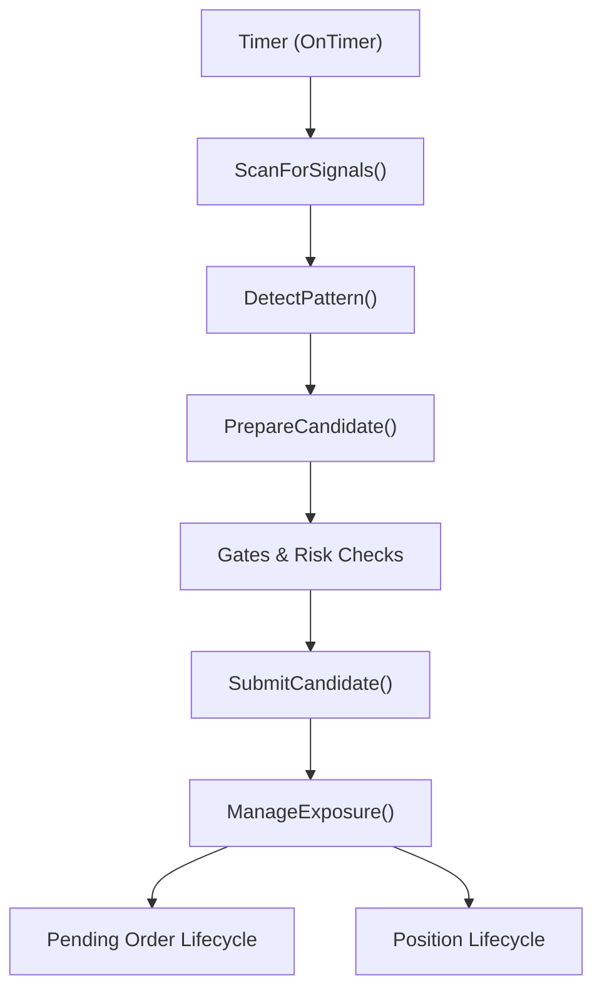
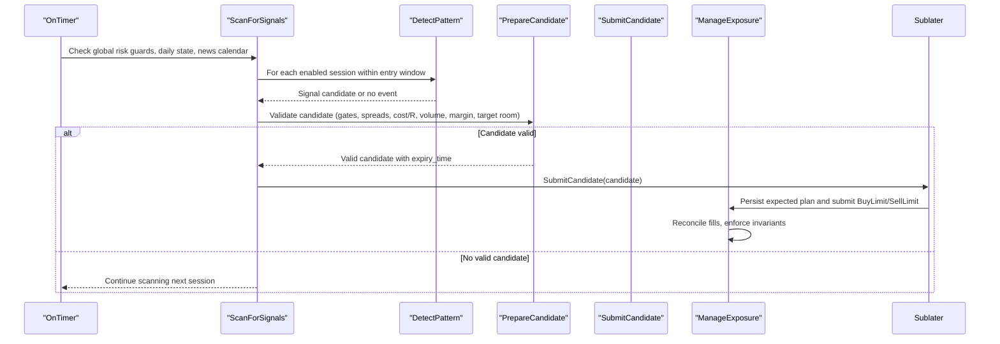
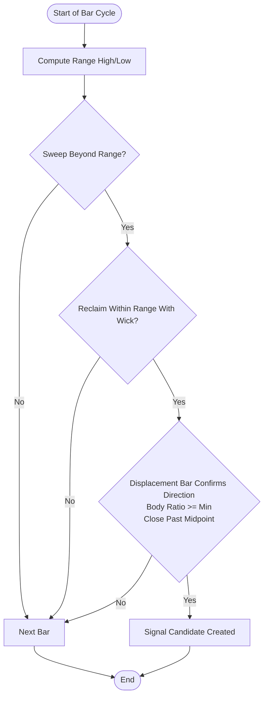
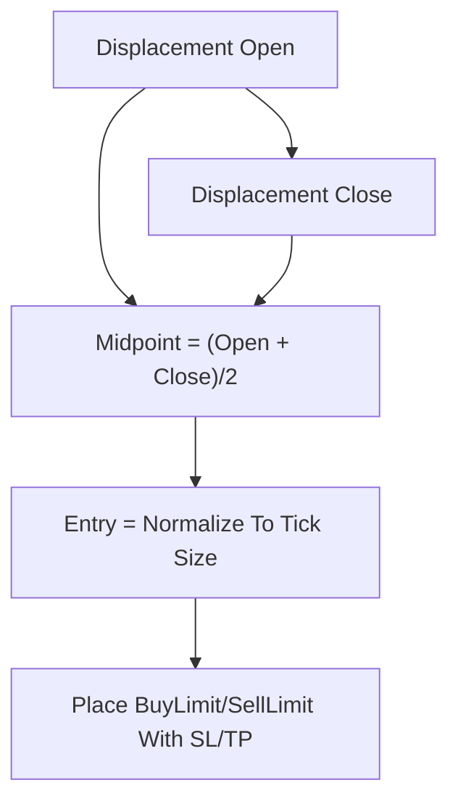
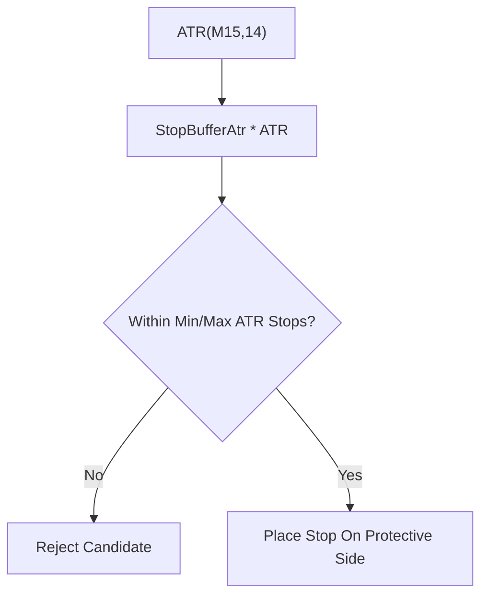
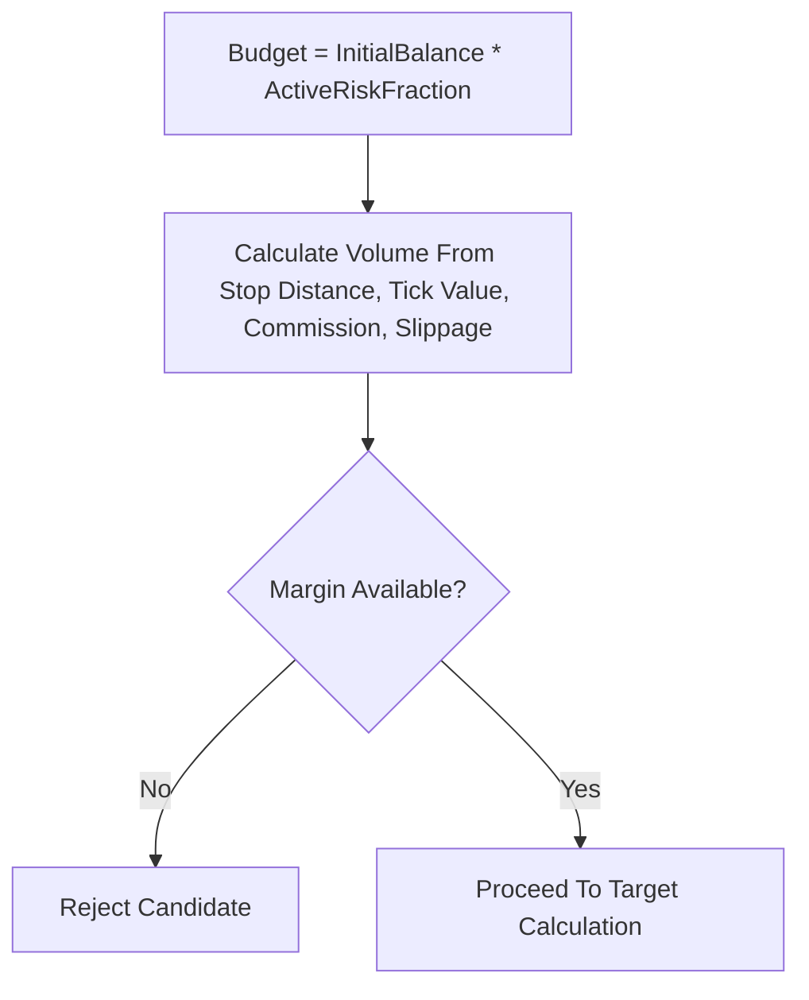
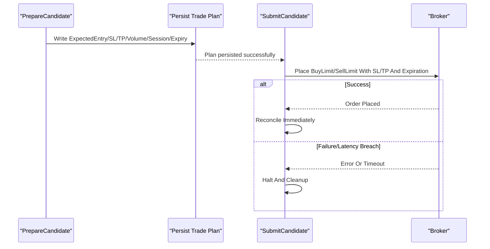
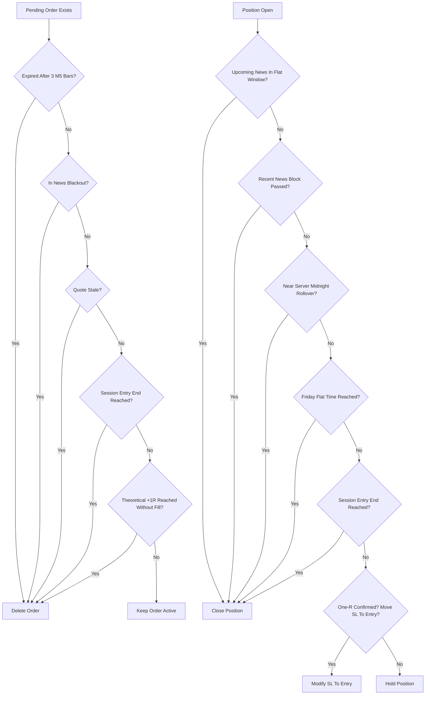
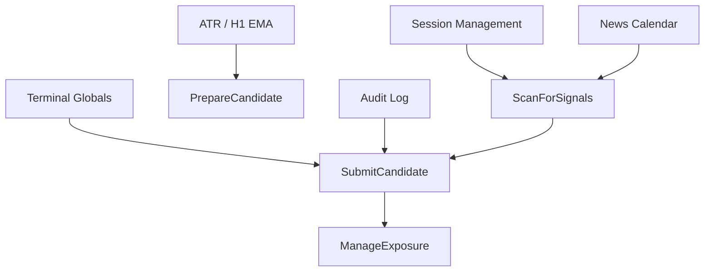

# Entry Conditions and Order Placement

<cite>
**Referenced Files in This Document**
- [TRIAD_R_HS.mq5](file://MQL5/Experts/TRIAD_R_HS/TRIAD_R_HS.mq5)
- [README.md](file://MQL5/Experts/TRIAD_R_HS/README.md)
</cite>

## Table of Contents
1. [Introduction](#introduction)
2. [Project Structure](#project-structure)
3. [Core Components](#core-components)
4. [Architecture Overview](#architecture-overview)
5. [Detailed Component Analysis](#detailed-component-analysis)
6. [Dependency Analysis](#dependency-analysis)
7. [Performance Considerations](#performance-considerations)
8. [Troubleshooting Guide](#troubleshooting-guide)
9. [Conclusion](#conclusion)

## Introduction
This document explains the entry conditions and order placement logic for the TRIAD-R strategy as implemented in the MQL5 Expert Advisor. It covers the complete entry sequence from sweep detection through limit order placement at the 50% retracement of the displacement candle body, ATR-based stop loss calculation, cash-risk-based position sizing, mandatory pre-signal gates (instrument/session validation, account state checks, volatility filters, spread limits, news blackout periods, and execution health monitoring), concrete examples of gate validation, and the full order lifecycle including cancellation after three completed M5 bars, session cutoff handling, news buffer protection, theoretical +1R level triggers, and the prohibition against replacing cancelled/expired orders with market orders.

## Project Structure
The strategy is implemented as a single MQL5 Expert Advisor file with supporting configuration inputs, safety controls, and logging. The EA runs on one chart, scans configured symbols/sessions, detects patterns, validates candidates through multiple gates, and submits a single pending limit order per signal when all conditions pass.

**Diagram sources**
- [TRIAD_R_HS.mq5:4294-4337](file://MQL5/Experts/TRIAD_R_HS/TRIAD_R_HS.mq5#L4294-L4337)
- [TRIAD_R_HS.mq5:4003-4099](file://MQL5/Experts/TRIAD_R_HS/TRIAD_R_HS.mq5#L4003-L4099)
- [TRIAD_R_HS.mq5:2692-2901](file://MQL5/Experts/TRIAD_R_HS/TRIAD_R_HS.mq5#L2692-L2901)
- [TRIAD_R_HS.mq5:2942-3284](file://MQL5/Experts/TRIAD_R_HS/TRIAD_R_HS.mq5#L2942-L3284)

**Section sources**
- [TRIAD_R_HS.mq5:4294-4337](file://MQL5/Experts/TRIAD_R_HS/TRIAD_R_HS.mq5#L4294-L4337)
- [TRIAD_R_HS.mq5:4003-4099](file://MQL5/Experts/TRIAD_R_HS/TRIAD_R_HS.mq5#L4003-L4099)

## Core Components
- Sweep/reclaim/displacement pattern detection and candidate preparation
- Mandatory pre-signal gates (instrument/session, account state, volatility, spread, cost-to-R, volume/margin, target room, risk budget, news blackout)
- Limit order submission with explicit expiry and plan persistence
- Order and position lifecycle management (cancellation, session cutoffs, news buffers, +1R confirmation, Friday flat, rollover flat)
- Safety controls (instance lock, request throttling, latency caps, audit log integrity)

**Section sources**
- [TRIAD_R_HS.mq5:2400-2522](file://MQL5/Experts/TRIAD_R_HS/TRIAD_R_HS.mq5#L2400-L2522)
- [TRIAD_R_HS.mq5:2692-2901](file://MQL5/Experts/TRIAD_R_HS/TRIAD_R_HS.mq5#L2692-L2901)
- [TRIAD_R_HS.mq5:2942-3284](file://MQL5/Experts/TRIAD_R_HS/TRIAD_R_HS.mq5#L2942-L3284)

## Architecture Overview
The EA’s runtime loop performs global risk checks, updates sessions, manages exposure, and scans for signals. When a valid candidate emerges, it persists the trade plan to terminal globals, revalidates immediately before submission, and places a time-expired limit order with stop and target. Exposure management enforces strict invariants and cancels or closes positions based on session boundaries, news windows, and theoretical +1R levels.

**Diagram sources**
- [TRIAD_R_HS.mq5:4294-4337](file://MQL5/Experts/TRIAD_R_HS/TRIAD_R_HS.mq5#L4294-L4337)
- [TRIAD_R_HS.mq5:4003-4099](file://MQL5/Experts/TRIAD_R_HS/TRIAD_R_HS.mq5#L4003-L4099)
- [TRIAD_R_HS.mq5:2692-2901](file://MQL5/Experts/TRIAD_R_HS/TRIAD_R_HS.mq5#L2692-L2901)
- [TRIAD_R_HS.mq5:2942-3284](file://MQL5/Experts/TRIAD_R_HS/TRIAD_R_HS.mq5#L2942-L3284)

## Detailed Component Analysis

### Sweep Detection and Displacement Confirmation
- Pattern detection identifies a sweep beyond recent range extremes followed by a reclaim bar that returns inside the range with sufficient wick length.
- After reclaim, the next bar must be a displacement bar confirming direction with a minimum body ratio and closing past the midpoint of the reclaim bar.
- These steps ensure the setup has both liquidity grab and follow-through characteristics.

**Diagram sources**
- [TRIAD_R_HS.mq5:2400-2522](file://MQL5/Experts/TRIAD_R_HS/TRIAD_R_HS.mq5#L2400-L2522)

**Section sources**
- [TRIAD_R_HS.mq5:2400-2522](file://MQL5/Experts/TRIAD_R_HS/TRIAD_R_HS.mq5#L2400-L2522)

### Entry Price: 50% Retracement of Displacement Body
- The entry price is set at the midpoint of the displacement candle body.
- The order is placed as a limit order with an explicit expiration tied to completed M5 bars.

**Diagram sources**
- [TRIAD_R_HS.mq5:2692-2901](file://MQL5/Experts/TRIAD_R_HS/TRIAD_R_HS.mq5#L2692-L2901)

**Section sources**
- [TRIAD_R_HS.mq5:2692-2901](file://MQL5/Experts/TRIAD_R_HS/TRIAD_R_HS.mq5#L2692-L2901)

### Stop Loss Calculation Using ATR-Based Formulas
- Stop distance uses ATR with configurable buffer and bounds to avoid overly tight or loose stops.
- The stop is placed on the protective side relative to entry and validated to ensure correct geometry.

**Diagram sources**
- [TRIAD_R_HS.mq5:2400-2522](file://MQL5/Experts/TRIAD_R_HS/TRIAD_R_HS.mq5#L2400-L2522)

**Section sources**
- [TRIAD_R_HS.mq5:2400-2522](file://MQL5/Experts/TRIAD_R_HS/TRIAD_R_HS.mq5#L2400-L2522)

### Position Sizing Based on Cash Risk
- Position size is derived from a fixed fraction of phase initial balance (active risk fraction).
- Volume calculation accounts for symbol tick value, stop distance, commission, and slippage reserves to ensure the maximum cash loss does not exceed the configured budget.
- Margin availability is checked before submission.

**Diagram sources**
- [TRIAD_R_HS.mq5:2400-2522](file://MQL5/Experts/TRIAD_R_HS/TRIAD_R_HS.mq5#L2400-L2522)

**Section sources**
- [TRIAD_R_HS.mq5:2400-2522](file://MQL5/Experts/TRIAD_R_HS/TRIAD_R_HS.mq5#L2400-L2522)

### Mandatory Pre-Signal Gates (13+ Checks)
Before any order submission, the candidate must pass a comprehensive set of gates. These include instrument/session validation, account state checks, volatility filters, spread limits, cost-to-R constraints, volume/margin checks, target room validation, risk budget acceptance, and news blackout checks. Additional runtime revalidation occurs immediately prior to submission.

Key gates and their roles:
- Instrument/session validation: Ensures symbols are correctly mapped to base/profit currencies and support required order types and expirations.
- Account state checks: Verifies authorized login/server, currency, leverage, hedging mode, trading permissions, and server offset tolerance.
- Volatility filters: Range percentile and ATR percentile bands constrain regime suitability.
- Spread limits: Current spread must not exceed a multiplier of the median spread.
- Cost-to-R: Includes spread, slippage, and commission; must be below a threshold.
- Volume/margin: Volume must be calculable and margin available.
- Target room: Enough space between entry and range boundary to fit target.
- Risk budget: Maximum cash loss acceptable under current quotes.
- News blackout: No entries during relevant news windows.

Concrete example flow:
1. Session within entry window? Yes.
2. Pattern detected? Yes.
3. Comparable statistics within bands? Yes.
4. H1 EMA bias filter passes (if enabled)? Yes.
5. Spread within limits? Yes.
6. Cost-to-R within threshold? Yes.
7. Volume calculable and margin available? Yes.
8. Target fits within range? Yes.
9. Cash risk budget accepts potential loss? Yes.
10. Not in news blackout? Yes.
11. Daily/global risk guards allow entry? Yes.
12. Revalidation at submission time passes? Yes.
13. No existing exposure? Yes.
Result: Submit candidate.

**Section sources**
- [TRIAD_R_HS.mq5:2400-2522](file://MQL5/Experts/TRIAD_R_HS/TRIAD_R_HS.mq5#L2400-L2522)
- [TRIAD_R_HS.mq5:2692-2901](file://MQL5/Experts/TRIAD_R_HS/TRIAD_R_HS.mq5#L2692-L2901)
- [TRIAD_R_HS.mq5:3536-3652](file://MQL5/Experts/TRIAD_R_HS/TRIAD_R_HS.mq5#L3536-L3652)
- [TRIAD_R_HS.mq5:3654-3731](file://MQL5/Experts/TRIAD_R_HS/TRIAD_R_HS.mq5#L3654-L3731)

### Order Submission and Plan Persistence
- Before submission, the EA persists the expected entry, stop, target, volume, session index, expiry, and other plan fields to terminal globals.
- A BuyLimit or SellLimit is placed with specified time expiration and deviation settings.
- If submission fails or latency exceeds limits, the EA halts and reconciles any uncertain exposure by cancelling pending orders and closing positions.

**Diagram sources**
- [TRIAD_R_HS.mq5:2692-2901](file://MQL5/Experts/TRIAD_R_HS/TRIAD_R_HS.mq5#L2692-L2901)

**Section sources**
- [TRIAD_R_HS.mq5:2692-2901](file://MQL5/Experts/TRIAD_R_HS/TRIAD_R_HS.mq5#L2692-L2901)

### Order Lifecycle: Cancellations, Session Cutoffs, News Buffers, +1R Triggers
- Pending order cancellation: Orders are deleted if expired after three completed M5 bars, if stale quotes are detected, if within a relevant news window, or if the session entry window ends.
- Theoretical +1R trigger: If the market reaches the theoretical +1R level without filling the order, the pending order is deleted to avoid holding unfillable plans.
- Position lifecycle: Positions are closed before upcoming news, after recent news, near server midnight rollover, on Friday flat cutoff, and when the session entry window ends. One-R confirmation can move the stop to breakeven if enabled.

**Diagram sources**
- [TRIAD_R_HS.mq5:2942-3284](file://MQL5/Experts/TRIAD_R_HS/TRIAD_R_HS.mq5#L2942-L3284)

**Section sources**
- [TRIAD_R_HS.mq5:2942-3284](file://MQL5/Experts/TRIAD_R_HS/TRIAD_R_HS.mq5#L2942-L3284)

### Prohibition Against Replacing Cancelled/Expired Orders With Market Orders
- The EA never replaces a cancelled or expired pending order with a market order. All entries are executed via limit orders with explicit stop and target.
- Reasoning: Market orders bypass the planned risk geometry, may incur unpredictable slippage, and violate the fail-closed design that requires visible exits and predictable cost-to-R. Replacing orders could also create overlapping exposure or inconsistent state across restarts. The EA enforces this by only submitting limit orders and cleaning up invalid or mismatched plans rather than switching to market execution.

**Section sources**
- [TRIAD_R_HS.mq5:2692-2901](file://MQL5/Experts/TRIAD_R_HS/TRIAD_R_HS.mq5#L2692-L2901)
- [TRIAD_R_HS.mq5:2942-3284](file://MQL5/Experts/TRIAD_R_HS/TRIAD_R_HS.mq5#L2942-L3284)

## Dependency Analysis
The entry and order placement logic depends on several subsystems:
- Session management for London and New York windows
- News calendar loading and coverage validation
- ATR and H1 EMA indicators for volatility and directional bias
- Terminal globals for plan persistence and safety throttling
- Audit logging for compliance and recovery

**Diagram sources**
- [TRIAD_R_HS.mq5:4003-4099](file://MQL5/Experts/TRIAD_R_HS/TRIAD_R_HS.mq5#L4003-L4099)
- [TRIAD_R_HS.mq5:2692-2901](file://MQL5/Experts/TRIAD_R_HS/TRIAD_R_HS.mq5#L2692-L2901)
- [TRIAD_R_HS.mq5:2942-3284](file://MQL5/Experts/TRIAD_R_HS/TRIAD_R_HS.mq5#L2942-L3284)

**Section sources**
- [TRIAD_R_HS.mq5:4003-4099](file://MQL5/Experts/TRIAD_R_HS/TRIAD_R_HS.mq5#L4003-L4099)
- [TRIAD_R_HS.mq5:2692-2901](file://MQL5/Experts/TRIAD_R_HS/TRIAD_R_HS.mq5#L2692-L2901)
- [TRIAD_R_HS.mq5:2942-3284](file://MQL5/Experts/TRIAD_R_HS/TRIAD_R_HS.mq5#L2942-L3284)

## Performance Considerations
- Timer-driven scanning minimizes per-tick overhead while keeping emergency equity checks responsive.
- History loading for comparable statistics can be expensive; candidates are refreshed immediately before ranking to avoid stale quote issues.
- Request throttling and latency caps protect against broker overload and network delays.
- Audit log failures halt the EA to prevent unlogged trades.

[No sources needed since this section provides general guidance]

## Troubleshooting Guide
Common rejection reasons and their implications:
- spread_gate: Current spread too wide relative to median; wait for tighter conditions.
- cost_to_r: Estimated cost including spread/slippage/commission exceeds threshold; reduce risk or wait for better conditions.
- volume_or_min_lot: Cannot calculate valid volume due to symbol constraints; verify symbol settings.
- insufficient_or_unknown_margin: Margin unavailable; reduce risk or increase free margin.
- target_room: Insufficient space to fit target within range; skip setup.
- news_blackout: Entry blocked by news window; wait until news buffer clears.
- candidate_expired_or_session_closed: Order expired or session ended; do not retry same signal.
- theoretical_1R_without_fill: Market reached +1R without fill; cancel and look for next setup.

Operational safeguards:
- Instance lock prevents duplicate live instances.
- Request count cap prevents excessive non-emergency requests.
- Latency breach halts and cleans up uncertain exposure.
- State signature validation prevents partial or corrupted journals.

**Section sources**
- [TRIAD_R_HS.mq5:2400-2522](file://MQL5/Experts/TRIAD_R_HS/TRIAD_R_HS.mq5#L2400-L2522)
- [TRIAD_R_HS.mq5:2528-2583](file://MQL5/Experts/TRIAD_R_HS/TRIAD_R_HS.mq5#L2528-L2583)
- [TRIAD_R_HS.mq5:2942-3284](file://MQL5/Experts/TRIAD_R_HS/TRIAD_R_HS.mq5#L2942-L3284)

## Conclusion
The TRIAD-R strategy implements a rigorous, fail-closed entry and order placement system. Entries are triggered by sweep/reclaim/displacement patterns and executed via limit orders at the 50% retracement of the displacement body, with ATR-based stops and cash-risk-based sizing. Every candidate passes extensive mandatory gates covering instrument/session validity, account state, volatility regimes, spread limits, cost-to-R, volume/margin, target room, risk budget, and news blackouts. The order lifecycle enforces cancellations after three completed M5 bars, session cutoffs, news buffers, and theoretical +1R triggers, while prohibiting replacement of cancelled/expired orders with market orders to preserve risk geometry and operational integrity.

[No sources needed since this section summarizes without analyzing specific files]