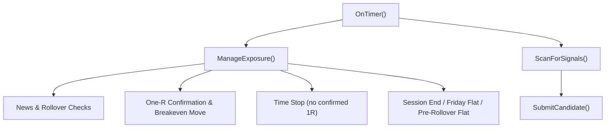
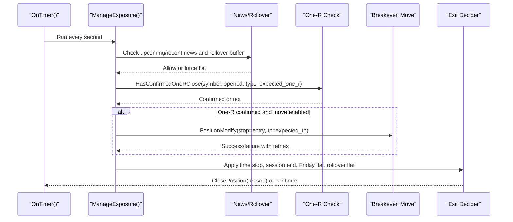
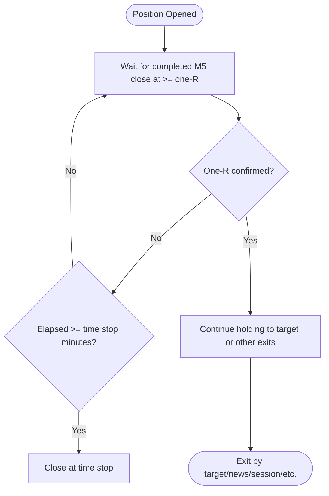
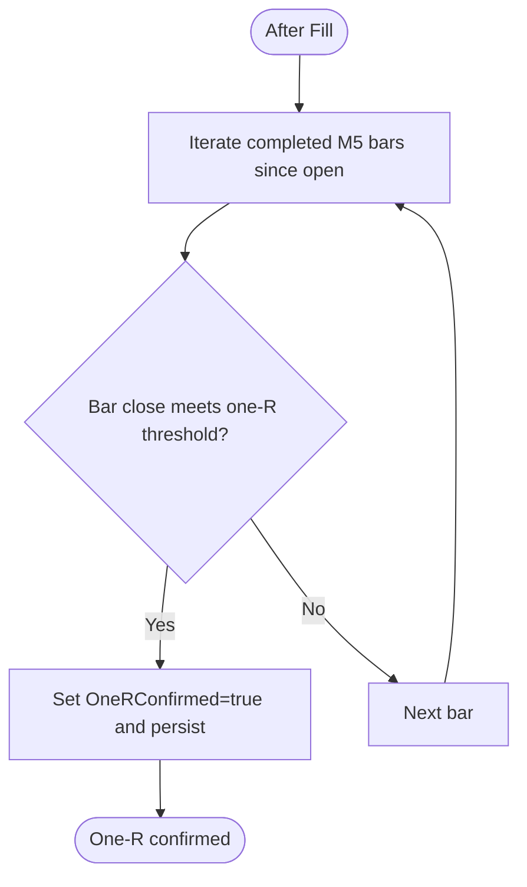
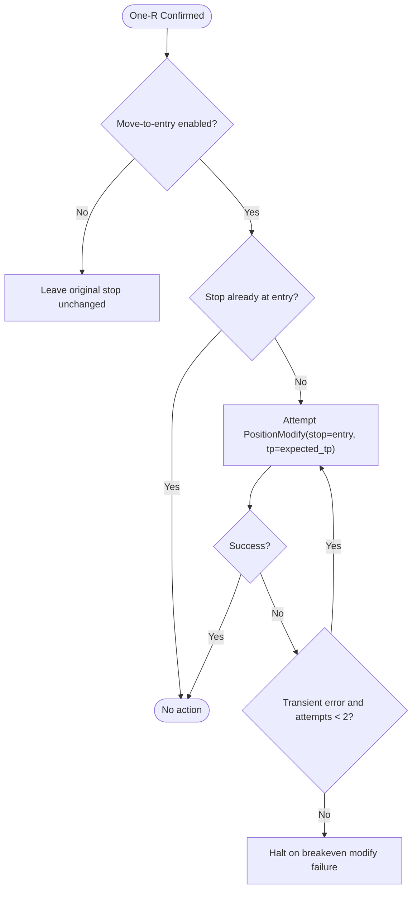
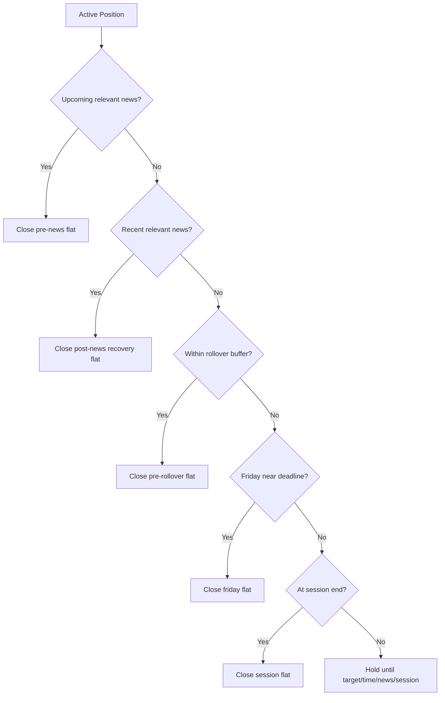
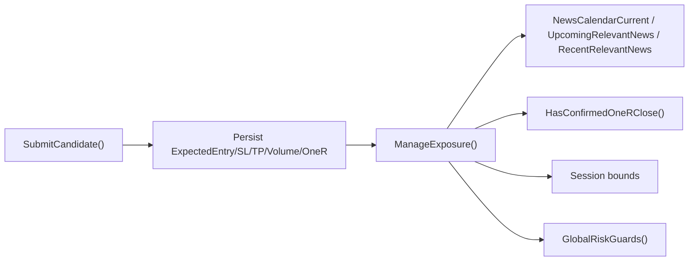

# Exit Engine and Trade Management

<cite>
**Referenced Files in This Document**
- [TRIAD_R_HS.mq5](file://MQL5/Experts/TRIAD_R_HS/TRIAD_R_HS.mq5)
- [README.md](file://MQL5/Experts/TRIAD_R_HS/README.md)
- [replay_export.py](file://tools/replay_export.py)
- [test_bugfix_regressions.py](file://tests/test_bugfix_regressions.py)
</cite>

## Table of Contents
1. Introduction
2. Project Structure
3. Core Components
4. Architecture Overview
5. Detailed Component Analysis
6. Dependency Analysis
7. Performance Considerations
8. Troubleshooting Guide
9. Conclusion

## Introduction
This document explains the exit engine and trade management system implemented in the TRIAD-R High Stakes EA. It focuses on the champion baseline exit model, breakeven stop management, forced-flat rules, session hard stops, rollover buffer protections, and how exits behave under different market conditions. It also documents why partial closing was removed from the initial challenge implementation and how that simplifies trade management.

## Project Structure
The exit engine is implemented inside a single MQL5 Expert Advisor file with supporting documentation and validation tooling:
- The EA source contains signal detection, candidate preparation, order submission, exposure management, news/calendar handling, rollover logic, and all exit controls.
- The README describes safe installation, news calendar contract, and operational constraints relevant to exits.
- Validation tools define replay-based exit accounting and confirm breakeven capping behavior used by the strategy’s reference implementation.

**Diagram sources**
- [TRIAD_R_HS.mq5:4294-4337](file://MQL5/Experts/TRIAD_R_HS/TRIAD_R_HS.mq5#L4294-L4337)
- [TRIAD_R_HS.mq5:2942-3284](file://MQL5/Experts/TRIAD_R_HS/TRIAD_R_HS.mq5#L2942-L3284)
- [TRIAD_R_HS.mq5:4003-4099](file://MQL5/Experts/TRIAD_R_HS/TRIAD_R_HS.mq5#L4003-L4099)
- [TRIAD_R_HS.mq5:2692-2900](file://MQL5/Experts/TRIAD_R_HS/TRIAD_R_HS.mq5#L2692-L2900)

**Section sources**
- [TRIAD_R_HS.mq5:4294-4337](file://MQL5/Experts/TRIAD_R_HS/TRIAD_R_HS.mq5#L4294-L4337)
- [TRIAD_R_HS.mq5:2942-3284](file://MQL5/Experts/TRIAD_R_HS/TRIAD_R_HS.mq5#L2942-L3284)
- [TRIAD_R_HS.mq5:4003-4099](file://MQL5/Experts/TRIAD_R_HS/TRIAD_R_HS.mq5#L4003-L4099)
- [TRIAD_R_HS.mq5:2692-2900](file://MQL5/Experts/TRIAD_R_HS/TRIAD_R_HS.mq5#L2692-L2900)
- [README.md:27-49](file://MQL5/Experts/TRIAD_R_HS/README.md#L27-L49)

## Core Components
- Champion baseline target: fixed +1.5R target derived from the selected risk profile.
- One-R confirmation: requires a completed M5 candle close at or beyond the one-R price before any breakeven move or time-stop exemption applies.
- Time-based exit: if no one-R confirmation occurs within the configured time stop window, the position is closed.
- Breakeven stop management: when enabled, moves broker-visible stop to entry after one-R confirmation; otherwise leaves original stop unchanged.
- Forced-flat rules: pre-news flat, post-news recovery flat, pre-rollover flat, Friday deadline, weekend buffer via session end, and session hard stops.
- Exposure invariant: only one managed position or pending order at a time; mismatches trigger immediate flattening.

**Section sources**
- [TRIAD_R_HS.mq5:1640-1650](file://MQL5/Experts/TRIAD_R_HS/TRIAD_R_HS.mq5#L1640-L1650)
- [TRIAD_R_HS.mq5:1098-1123](file://MQL5/Experts/TRIAD_R_HS/TRIAD_R_HS.mq5#L1098-L1123)
- [TRIAD_R_HS.mq5:3219-3283](file://MQL5/Experts/TRIAD_R_HS/TRIAD_R_HS.mq5#L3219-L3283)
- [TRIAD_R_HS.mq5:3144-3183](file://MQL5/Experts/TRIAD_R_HS/TRIAD_R_HS.mq5#L3144-L3183)
- [TRIAD_R_HS.mq5:2970-2994](file://MQL5/Experts/TRIAD_R_HS/TRIAD_R_HS.mq5#L2970-L2994)

## Architecture Overview
The EA runs a 1-second timer loop that:
- Refreshes sessions and account state
- Performs rollover processing and daily/weekly resets
- Enforces global risk guards
- Manages exposure (pending orders and positions)
- Scans for new signals

Exposure management is the central hub for all exits. It validates visible broker SL/TP against the persisted plan, enforces news and rollover buffers, checks one-R confirmation, applies breakeven moves when enabled, and closes positions according to time stops, session boundaries, and forced-flat rules.

**Diagram sources**
- [TRIAD_R_HS.mq5:4294-4337](file://MQL5/Experts/TRIAD_R_HS/TRIAD_R_HS.mq5#L4294-L4337)
- [TRIAD_R_HS.mq5:2942-3284](file://MQL5/Experts/TRIAD_R_HS/TRIAD_R_HS.mq5#L2942-L3284)
- [TRIAD_R_HS.mq5:1098-1123](file://MQL5/Experts/TRIAD_R_HS/TRIAD_R_HS.mq5#L1098-L1123)

## Detailed Component Analysis

### Champion Baseline Exit Model (+1.5R Target and Time Stop)
- Target: The EA selects a fixed target multiplier based on the chosen profile. The baseline uses +1.5R.
- Entry geometry and volume are computed so that the net target equals the desired R multiple after costs and slippage reserves.
- Time stop: If one-R confirmation has not occurred by the configured time stop window, the position is closed regardless of PnL.

**Diagram sources**
- [TRIAD_R_HS.mq5:1640-1650](file://MQL5/Experts/TRIAD_R_HS/TRIAD_R_HS.mq5#L1640-L1650)
- [TRIAD_R_HS.mq5:1098-1123](file://MQL5/Experts/TRIAD_R_HS/TRIAD_R_HS.mq5#L1098-L1123)
- [TRIAD_R_HS.mq5:3279-3283](file://MQL5/Experts/TRIAD_R_HS/TRIAD_R_HS.mq5#L3279-L3283)

**Section sources**
- [TRIAD_R_HS.mq5:1640-1650](file://MQL5/Experts/TRIAD_R_HS/TRIAD_R_HS.mq5#L1640-L1650)
- [TRIAD_R_HS.mq5:3279-3283](file://MQL5/Experts/TRIAD_R_HS/TRIAD_R_HS.mq5#L3279-L3283)

### One-R Confirmation Rules (Completed M5 Candle Close)
- The EA scans all completed M5 bars since the fill to detect whether any bar closed at or beyond the one-R level in the trade direction.
- This check reconstructs missed confirmations after disconnections or restarts and persists the confirmation flag to survive terminal restarts.

**Diagram sources**
- [TRIAD_R_HS.mq5:1098-1123](file://MQL5/Experts/TRIAD_R_HS/TRIAD_R_HS.mq5#L1098-L1123)
- [TRIAD_R_HS.mq5:3202-3218](file://MQL5/Experts/TRIAD_R_HS/TRIAD_R_HS.mq5#L3202-L3218)

**Section sources**
- [TRIAD_R_HS.mq5:1098-1123](file://MQL5/Experts/TRIAD_R_HS/TRIAD_R_HS.mq5#L1098-L1123)
- [TRIAD_R_HS.mq5:3202-3218](file://MQL5/Experts/TRIAD_R_HS/TRIAD_R_HS.mq5#L3202-L3218)

### Breakeven Stop Management
- When enabled, after one-R confirmation the EA attempts to move the broker-visible stop to entry (zero R).
- Moves are rate-limited and retried once on transient failures; persistent failures halt the EA to prevent unmanaged exposure.
- If disabled, the original stop remains unchanged throughout the trade.

**Diagram sources**
- [TRIAD_R_HS.mq5:3219-3277](file://MQL5/Experts/TRIAD_R_HS/TRIAD_R_HS.mq5#L3219-L3277)

**Section sources**
- [TRIAD_R_HS.mq5:3219-3277](file://MQL5/Experts/TRIAD_R_HS/TRIAD_R_HS.mq5#L3219-L3277)

### Forced-Flat Rules
- News protection:
  - Pre-news flat: closes position before high-impact events for the pair’s currencies within the configured window.
  - Post-news recovery flat: closes immediately after recent relevant news to avoid erratic moves.
- Rollover buffer:
  - Flattens positions within a fixed number of minutes before server midnight to avoid swap and gap risk.
- Friday deadline:
  - Forces flat at a fixed London-time cutoff on Fridays to avoid weekend exposure.
- Weekend buffer:
  - Session-end logic ensures positions are closed before the trading week ends, acting as a weekend buffer.
- Session hard stops:
  - Positions are closed at the end of the active session window to contain intraday risk.

**Diagram sources**
- [TRIAD_R_HS.mq5:3144-3183](file://MQL5/Experts/TRIAD_R_HS/TRIAD_R_HS.mq5#L3144-L3183)

**Section sources**
- [TRIAD_R_HS.mq5:3144-3183](file://MQL5/Experts/TRIAD_R_HS/TRIAD_R_HS.mq5#L3144-L3183)

### Session Hard Stops and Rollover Buffer Protections
- Session hard stops: The EA closes positions when the current symbol’s session entry window ends, ensuring trades do not run indefinitely outside their intended timeframe.
- Rollover buffer: A fixed minute window before server midnight forces flattening to avoid rollover gaps and swaps.
- These protections are enforced even if one-R confirmation has been achieved, because they are structural safeguards independent of PnL.

**Section sources**
- [TRIAD_R_HS.mq5:3157-3183](file://MQL5/Experts/TRIAD_R_HS/TRIAD_R_HS.mq5#L3157-L3183)

### Examples Across Market Conditions
- Strong trend with quick one-R confirmation:
  - One-R confirmed early; if move-to-entry is enabled, stop moves to entry; otherwise original stop stays; hold to +1.5R or session/news/rollover/Friday deadlines.
- Choppy market without one-R confirmation:
  - Time stop triggers at the configured horizon; position closes at the recorded price at that horizon.
- News cluster around CPI/NFP/FOMC:
  - Pre-news flat closes before event; post-news recovery flat closes after event; prevents trading through high volatility.
- Late Friday afternoon:
  - Friday deadline forces flat to avoid weekend risk; session end also acts as a weekend buffer.
- Near server rollover:
  - Pre-rollover flat closes positions within the configured buffer to avoid overnight risk.

[No sources needed since this section provides conceptual examples grounded by prior sections]

### Removal of Partial Closing and Its Impact
- The initial challenge implementation did not use partial closes. The screen EA’s ledger explicitly treats partial closes as non-completed trades and waits for full closure to record outcomes.
- Removing partial closing simplifies exit logic: there is no need to track tiered exits, reduce risk per slice, or manage remaining exposure after a partial. All exits are full-position closures, which reduces complexity and improves reliability.

**Section sources**
- [TRIAD_SCREEN.mq5:1891-1915](file://MQL5/Experts/TRIAD_SCREEN/TRIAD_SCREEN.mq5#L1891-L1915)
- [TRIAD_SCREEN.mq5:2822-2885](file://MQL5/Experts/TRIAD_SCREEN/TRIAD_SCREEN.mq5#L2822-L2885)

## Dependency Analysis
- ManageExposure depends on:
  - News calendar functions to determine blackout windows and recovery periods.
  - One-R confirmation function to gate breakeven moves and time-stop exemptions.
  - Session bounds to enforce session-end exits.
  - Global risk guards to ensure firm floors, drawdown limits, and phase targets are respected.
- SubmitCandidate prepares the trade plan (entry, stop, target, volume) and persists it so ManageExposure can validate broker-visible exits against the plan.

**Diagram sources**
- [TRIAD_R_HS.mq5:2942-3284](file://MQL5/Experts/TRIAD_R_HS/TRIAD_R_HS.mq5#L2942-L3284)
- [TRIAD_R_HS.mq5:2692-2900](file://MQL5/Experts/TRIAD_R_HS/TRIAD_R_HS.mq5#L2692-L2900)
- [TRIAD_R_HS.mq5:1098-1123](file://MQL5/Experts/TRIAD_R_HS/TRIAD_R_HS.mq5#L1098-L1123)
- [TRIAD_R_HS.mq5:1772-1846](file://MQL5/Experts/TRIAD_R_HS/TRIAD_R_HS.mq5#L1772-L1846)

**Section sources**
- [TRIAD_R_HS.mq5:2942-3284](file://MQL5/Experts/TRIAD_R_HS/TRIAD_R_HS.mq5#L2942-L3284)
- [TRIAD_R_HS.mq5:2692-2900](file://MQL5/Experts/TRIAD_R_HS/TRIAD_R_HS.mq5#L2692-L2900)
- [TRIAD_R_HS.mq5:1098-1123](file://MQL5/Experts/TRIAD_R_HS/TRIAD_R_HS.mq5#L1098-L1123)
- [TRIAD_R_HS.mq5:1772-1846](file://MQL5/Experts/TRIAD_R_HS/TRIAD_R_HS.mq5#L1772-L1846)

## Performance Considerations
- Timer cadence: The 1-second timer balances responsiveness with minimal overhead.
- History reads: One-R confirmation and comparable statistics read historical data; the EA caches indicator handles and uses efficient copy routines.
- Request throttling: Safety request due timers limit repeated modifications and closings to avoid overload during instability.
- Latency monitoring: Order submission latency is measured and halted if exceeded to protect execution quality.

[No sources needed since this section provides general guidance]

## Troubleshooting Guide
Common issues and where to look:
- Missing or invalid visible SL/TP:
  - The EA repairs missing stops once; if repair fails, it closes the position and halts to prevent unmanaged exposure.
- One-R confirmation not persisting:
  - Persistence failures halt the EA; check logs for persistence errors and ensure terminal globals are writable.
- Breakeven move failures:
  - Transient failures retry once; persistent failures halt to avoid leaving the stop away from entry.
- News calendar stale or insufficient coverage:
  - New entries are disabled; update the CSV and ensure coverage extends beyond required hours.
- Friday or rollover flats:
  - Intentional flattening near deadlines; verify local/server time alignment and session definitions.

**Section sources**
- [TRIAD_R_HS.mq5:3105-3130](file://MQL5/Experts/TRIAD_R_HS/TRIAD_R_HS.mq5#L3105-L3130)
- [TRIAD_R_HS.mq5:3209-3218](file://MQL5/Experts/TRIAD_R_HS/TRIAD_R_HS.mq5#L3209-L3218)
- [TRIAD_R_HS.mq5:3237-3277](file://MQL5/Experts/TRIAD_R_HS/TRIAD_R_HS.mq5#L3237-L3277)
- [TRIAD_R_HS.mq5:836-918](file://MQL5/Experts/TRIAD_R_HS/TRIAD_R_HS.mq5#L836-L918)

## Conclusion
The TRIAD-R exit engine centers on a disciplined, rule-based approach:
- Fixed +1.5R target with a strict one-R confirmation requirement before any protective adjustments.
- Time-based exits when momentum does not reach one-R quickly.
- Conservative forced-flat rules around news, rollover, and weekends to protect capital.
- Optional breakeven move that is robustly implemented with retries and fail-safe halts.
- Simplified management by avoiding partial closes, focusing on full-position exits and clear invariants.

These rules collectively aim to keep risk bounded, reduce exposure during uncertain periods, and maintain predictable behavior across varying market conditions.

[No sources needed since this section summarizes without analyzing specific files]