# Risk Management and Position Sizing

<cite>
**Referenced Files in This Document**
- [TRIAD_R_HS.mq5](file://MQL5/Experts/TRIAD_R_HS/TRIAD_R_HS.mq5)
- [README.md](file://MQL5/Experts/TRIAD_R_HS/README.md)
- [THE5ERS-CHALLENGE-STRATEGY-V2.md](file://THE5ERS-CHALLENGE-STRATEGY-V2.md)
- [replay_export.py](file://tools/replay_export.py)
</cite>

## Table of Contents
1. [Introduction](#introduction)
2. [Project Structure](#project-structure)
3. [Core Components](#core-components)
4. [Architecture Overview](#architecture-overview)
5. [Detailed Component Analysis](#detailed-component-analysis)
6. [Dependency Analysis](#dependency-analysis)
7. [Performance Considerations](#performance-considerations)
8. [Troubleshooting Guide](#troubleshooting-guide)
9. [Conclusion](#conclusion)
10. [Appendices](#appendices)

## Introduction
This document explains the risk management and position sizing system implemented in the TRIAD-R High Stakes strategy. It covers stop loss geometry using ATR(M15,14), cash risk calculation including all-in loss and slippage reserves, risk budgeting based on phase initial balance and active risk fraction, volume selection via MT5 tick economics, four paired risk/target profiles, drawdown throttle tiers, and loss governors (daily, weekly, two full losses rule, firm floor protection). Concrete examples illustrate how position sizes are calculated and adjusted under different account states and drawdown levels.

## Project Structure
The risk engine is implemented in a single MQL5 Expert Advisor with supporting documentation and validation tools:
- EA source: TRIAD_R_HS.mq5
- Strategy specification and safety rules: THE5ERS-CHALLENGE-STRATEGY-V2.md
- README with operational constraints and validation guidance: README.md
- Replay/export tool that mirrors EA sizing logic for research: replay_export.py

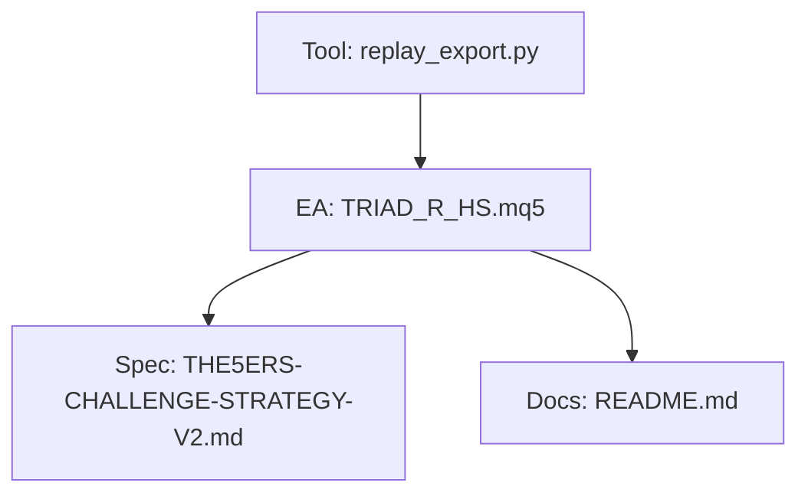

**Diagram sources**
- [TRIAD_R_HS.mq5:1-150](file://MQL5/Experts/TRIAD_R_HS/TRIAD_R_HS.mq5#L1-L150)
- [THE5ERS-CHALLENGE-STRATEGY-V2.md:283-302](file://THE5ERS-CHALLENGE-STRATEGY-V2.md#L283-L302)
- [README.md:1-150](file://MQL5/Experts/TRIAD_R_HS/README.md#L1-L150)
- [replay_export.py:732-759](file://tools/replay_export.py#L732-L759)

**Section sources**
- [TRIAD_R_HS.mq5:1-150](file://MQL5/Experts/TRIAD_R_HS/TRIAD_R_HS.mq5#L1-L150)
- [README.md:1-150](file://MQL5/Experts/TRIAD_R_HS/README.md#L1-L150)

## Core Components
- Stop loss geometry: ATR(M15,14)-based buffers around sweep extremes, clamped to configured ATR multiples.
- Cash risk: All-in loss per trade includes price risk at stop plus commission and a one-side stop slippage reserve.
- Risk budget: Derived from phase initial balance multiplied by an active risk fraction that halves when drawdown exceeds a threshold.
- Volume selection: Lattice-aligned lots derived from MT5 symbol volume properties and broker cost functions; validated against budget.
- Target resolution: Binary search to find target price that yields desired net profit equal to cash_risk × target R.
- Drawdown throttle: Active risk fraction reduced by 50% when drawdown reaches or exceeds the configured threshold.
- Loss governors: Firm overall/daily floors, internal daily/weekly stops, and drawdown shutdown gate new trades.

**Section sources**
- [TRIAD_R_HS.mq5:128-141](file://MQL5/Experts/TRIAD_R_HS/TRIAD_R_HS.mq5#L128-L141)
- [TRIAD_R_HS.mq5:1621-1712](file://MQL5/Experts/TRIAD_R_HS/TRIAD_R_HS.mq5#L1621-L1712)
- [TRIAD_R_HS.mq5:2217-2309](file://MQL5/Experts/TRIAD_R_HS/TRIAD_R_HS.mq5#L2217-L2309)
- [THE5ERS-CHALLENGE-STRATEGY-V2.md:283-302](file://THE5ERS-CHALLENGE-STRATEGY-V2.md#L283-L302)

## Architecture Overview
The risk pipeline runs per candidate signal and enforces layered checks before submission:

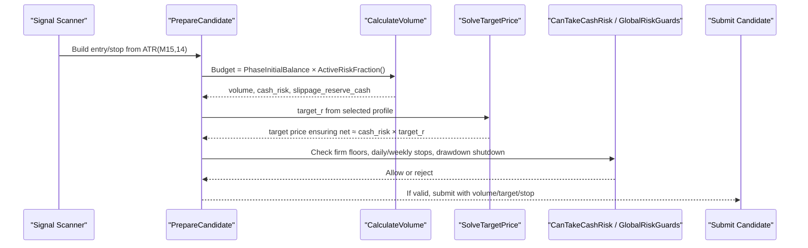

**Diagram sources**
- [TRIAD_R_HS.mq5:2380-2522](file://MQL5/Experts/TRIAD_R_HS/TRIAD_R_HS.mq5#L2380-L2522)
- [TRIAD_R_HS.mq5:2217-2309](file://MQL5/Experts/TRIAD_R_HS/TRIAD_R_HS.mq5#L2217-L2309)
- [TRIAD_R_HS.mq5:1685-1712](file://MQL5/Experts/TRIAD_R_HS/TRIAD_R_HS.mq5#L1685-L1712)
- [TRIAD_R_HS.mq5:1772-1846](file://MQL5/Experts/TRIAD_R_HS/TRIAD_R_HS.mq5#L1772-L1846)

## Detailed Component Analysis

### Stop Loss Calculation Using ATR(M15,14)
- The strategy uses iATR(symbol, PERIOD_M15, 14) to measure volatility.
- For long positions, the raw stop is placed below the sweep extreme minus a buffer proportional to ATR; for short positions, above the sweep extreme plus the same buffer.
- The resulting stop distance is normalized to ticks and then validated to be within configured ATR multiples of the stop distance relative to ATR.

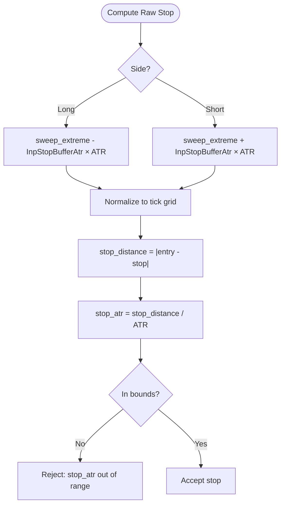

**Diagram sources**
- [TRIAD_R_HS.mq5:2389-2402](file://MQL5/Experts/TRIAD_R_HS/TRIAD_R_HS.mq5#L2389-L2402)
- [TRIAD_R_HS.mq5:3991-3993](file://MQL5/Experts/TRIAD_R_HS/TRIAD_R_HS.mq5#L3991-L3993)

**Section sources**
- [TRIAD_R_HS.mq5:2389-2402](file://MQL5/Experts/TRIAD_R_HS/TRIAD_R_HS.mq5#L2389-L2402)
- [TRIAD_R_HS.mq5:3991-3993](file://MQL5/Experts/TRIAD_R_HS/TRIAD_R_HS.mq5#L3991-L3993)

### Cash Risk Calculation and All-In Loss
- All-in loss per lot includes:
  - Price risk at the broker-visible stop
  - One-side stop slippage reserve (adverse slippage beyond the stop)
  - Round-trip commission per lot
- The function computes both base result at stop and adverse result with slippage reserve, derives the slippage reserve cash, and sums absolute price risk plus commission to obtain cash_loss.

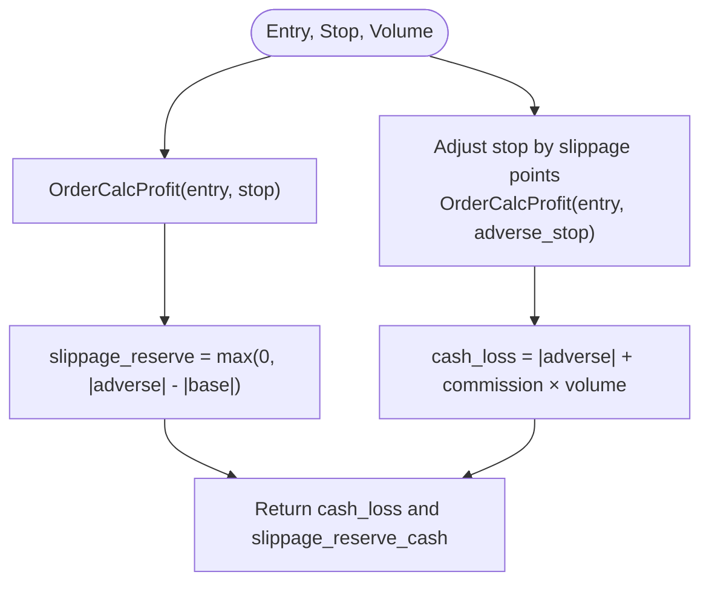

**Diagram sources**
- [TRIAD_R_HS.mq5:2217-2234](file://MQL5/Experts/TRIAD_R_HS/TRIAD_R_HS.mq5#L2217-L2234)
- [replay_export.py:732-759](file://tools/replay_export.py#L732-L759)

**Section sources**
- [TRIAD_R_HS.mq5:2217-2234](file://MQL5/Experts/TRIAD_R_HS/TRIAD_R_HS.mq5#L2217-L2234)
- [replay_export.py:732-759](file://tools/replay_export.py#L732-L759)

### Risk Budget Determination Based on Phase Initial Balance and Active Risk Fraction
- Risk budget per trade equals phase initial balance multiplied by the active risk fraction.
- Active risk fraction starts at the selected profile’s base risk and is halved if current strategy drawdown (from high-water) meets or exceeds the configured drawdown reduction threshold.

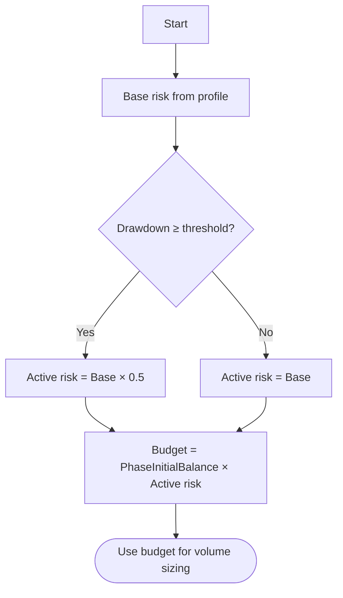

**Diagram sources**
- [TRIAD_R_HS.mq5:1628-1658](file://MQL5/Experts/TRIAD_R_HS/TRIAD_R_HS.mq5#L1628-L1658)
- [TRIAD_R_HS.mq5:1652-1658](file://MQL5/Experts/TRIAD_R_HS/TRIAD_R_HS.mq5#L1652-L1658)

**Section sources**
- [TRIAD_R_HS.mq5:1628-1658](file://MQL5/Experts/TRIAD_R_HS/TRIAD_R_HS.mq5#L1628-L1658)

### Volume Selection Using MT5 Tick Economics
- Volume is chosen from the broker’s volume lattice (minimum, maximum, step) and directional limit.
- The algorithm estimates per-lot all-in loss, scales to fit the risk budget, rounds down to the nearest valid lot step, and re-validates that the final all-in loss does not exceed the budget.
- Margin availability is checked using OrderCalcMargin prior to acceptance.

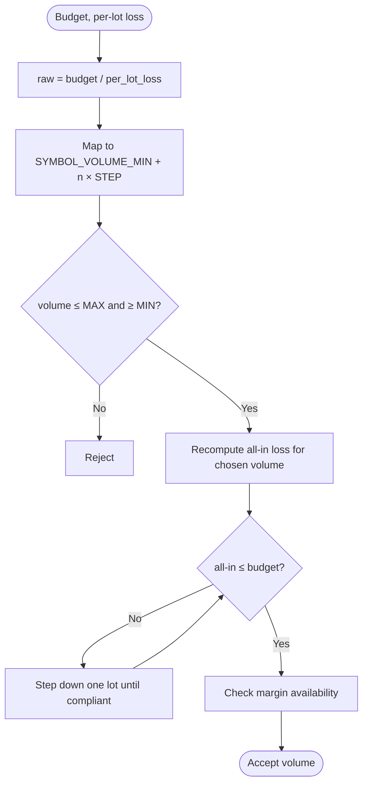

**Diagram sources**
- [TRIAD_R_HS.mq5:2236-2270](file://MQL5/Experts/TRIAD_R_HS/TRIAD_R_HS.mq5#L2236-L2270)
- [TRIAD_R_HS.mq5:2208-2215](file://MQL5/Experts/TRIAD_R_HS/TRIAD_R_HS.mq5#L2208-L2215)

**Section sources**
- [TRIAD_R_HS.mq5:2236-2270](file://MQL5/Experts/TRIAD_R_HS/TRIAD_R_HS.mq5#L2236-L2270)
- [TRIAD_R_HS.mq5:2208-2215](file://MQL5/Experts/TRIAD_R_HS/TRIAD_R_HS.mq5#L2208-L2215)

### Target Resolution and Net Profit Alignment
- Target price is solved via binary search to ensure the net profit after commissions equals cash_risk × target_r.
- A target slippage reserve is applied to the effective target price during profit calculation.

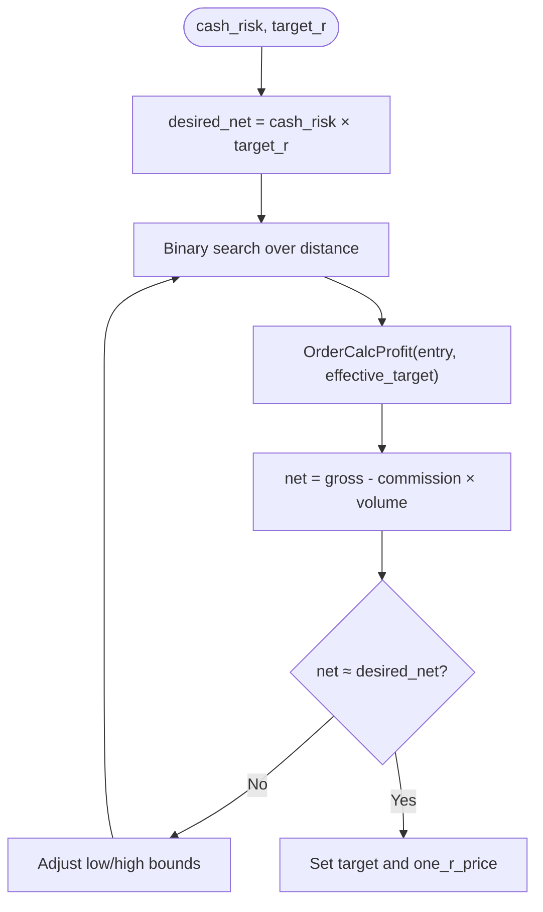

**Diagram sources**
- [TRIAD_R_HS.mq5:2273-2309](file://MQL5/Experts/TRIAD_R_HS/TRIAD_R_HS.mq5#L2273-L2309)

**Section sources**
- [TRIAD_R_HS.mq5:2273-2309](file://MQL5/Experts/TRIAD_R_HS/TRIAD_R_HS.mq5#L2273-L2309)

### Four Paired Risk/Target Profiles and Selection Criteria
- Profile A: 0.40% risk, +1.5R target
- Profile B: 0.35% risk, +1.75R target
- Profile C: 0.30% risk, +2.0R target
- Profile D: 0.25% risk, +2.5R target
- Selection is made via input configuration and frozen before out-of-sample evaluation; the EA reads the selected base risk and target R from this enum.

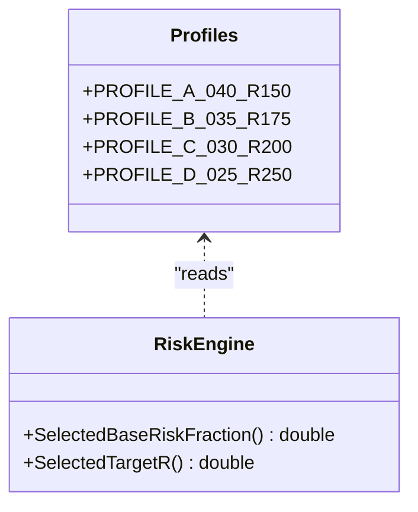

**Diagram sources**
- [TRIAD_R_HS.mq5:23-29](file://MQL5/Experts/TRIAD_R_HS/TRIAD_R_HS.mq5#L23-L29)
- [TRIAD_R_HS.mq5:1628-1650](file://MQL5/Experts/TRIAD_R_HS/TRIAD_R_HS.mq5#L1628-L1650)

**Section sources**
- [TRIAD_R_HS.mq5:23-29](file://MQL5/Experts/TRIAD_R_HS/TRIAD_R_HS.mq5#L23-L29)
- [TRIAD_R_HS.mq5:1628-1650](file://MQL5/Experts/TRIAD_R_HS/TRIAD_R_HS.mq5#L1628-L1650)

### Drawdown Throttle System
- Measured from the highest closed balance/equity reference.
- Three-tier behavior:
  - 0–2% drawdown: normal risk (profile base)
  - 2–5% drawdown: risk reduced to 50% of base
  - 5%+ drawdown: emergency halt (no new trades)
- Implementation:
  - Active risk fraction halves when drawdown reaches or exceeds the configured threshold.
  - Global risk guards enforce a hard shutdown when drawdown reaches or exceeds the configured shutdown percentage.

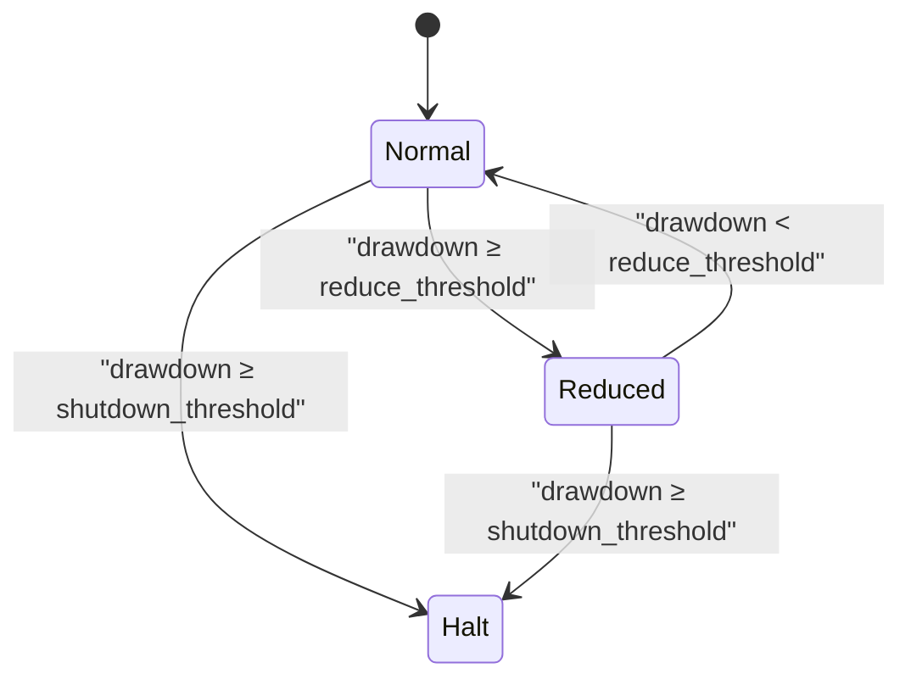

**Diagram sources**
- [TRIAD_R_HS.mq5:1621-1658](file://MQL5/Experts/TRIAD_R_HS/TRIAD_R_HS.mq5#L1621-L1658)
- [TRIAD_R_HS.mq5:1835-1839](file://MQL5/Experts/TRIAD_R_HS/TRIAD_R_HS.mq5#L1835-L1839)

**Section sources**
- [TRIAD_R_HS.mq5:1621-1658](file://MQL5/Experts/TRIAD_R_HS/TRIAD_R_HS.mq5#L1621-L1658)
- [TRIAD_R_HS.mq5:1835-1839](file://MQL5/Experts/TRIAD_R_HS/TRIAD_R_HS.mq5#L1835-L1839)

### Loss Governors
- Internal daily stop: prevents new trades if projected equity would fall below day start balance minus a percentage of phase initial balance.
- Internal weekly stop: prevents new trades if projected equity would fall below week start balance minus a percentage of phase initial balance.
- Two full losses rule: initialization rejects more than one completed trade or a first positive net trade to protect baseline assumptions.
- Firm floor protection:
  - Overall floor: phase initial balance × 0.90
  - Daily floor: computed at rollover as max(rollover_balance, rollover_equity) × 0.95
  - No order may be sent if stressed projected loss can cross active_firm_floor + firm_floor_reserve, where reserve is the greater of 0.5% of phase initial balance or twice the one-trade slippage reserve.

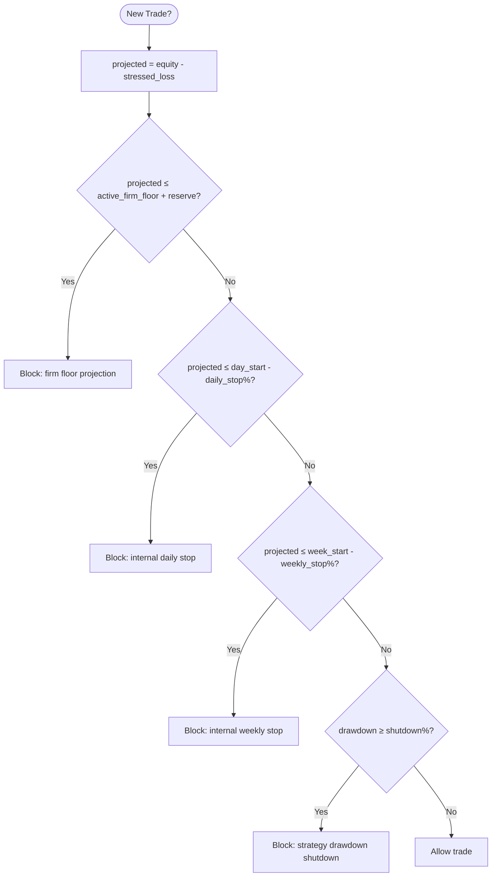

**Diagram sources**
- [TRIAD_R_HS.mq5:1685-1712](file://MQL5/Experts/TRIAD_R_HS/TRIAD_R_HS.mq5#L1685-L1712)
- [TRIAD_R_HS.mq5:1772-1846](file://MQL5/Experts/TRIAD_R_HS/TRIAD_R_HS.mq5#L1772-L1846)
- [THE5ERS-CHALLENGE-STRATEGY-V2.md:283-302](file://THE5ERS-CHALLENGE-STRATEGY-V2.md#L283-L302)

**Section sources**
- [TRIAD_R_HS.mq5:1685-1712](file://MQL5/Experts/TRIAD_R_HS/TRIAD_R_HS.mq5#L1685-L1712)
- [TRIAD_R_HS.mq5:1772-1846](file://MQL5/Experts/TRIAD_R_HS/TRIAD_R_HS.mq5#L1772-L1846)
- [THE5ERS-CHALLENGE-STRATEGY-V2.md:283-302](file://THE5ERS-CHALLENGE-STRATEGY-V2.md#L283-L302)

### Concrete Examples: Position Size Calculations and Adjustments
Example 1: Normal conditions (Profile A)
- Inputs: Phase initial balance $2,500; Profile A base risk 0.40%; target +1.5R.
- Budget: $2,500 × 0.0040 = $10.00.
- Suppose per-lot all-in loss at stop (including commission and one-side slippage reserve) is $2.00.
- Volume: floor((budget / per_lot_all_in)) mapped to lot step → choose largest valid lot such that all-in loss ≤ $10.00.
- Target: solve for price so net profit ≈ $10.00 × 1.5 = $15.00 after commissions.

Example 2: Drawdown 3% (Reduced tier)
- Active risk fraction halves to 0.20%.
- Budget: $2,500 × 0.0020 = $5.00.
- Volume recalculated to keep all-in loss ≤ $5.00; target net ≈ $5.00 × 1.5 = $7.50.

Example 3: Approaching firm floor
- If projected equity after all-in loss would breach active_firm_floor + reserve, the trade is blocked regardless of other conditions.

Example 4: Hit internal daily stop
- If projected equity would drop below day start balance minus 1.0% of phase initial balance ($25), no new trades until next server rollover resets the daily state.

These examples follow the exact arithmetic used in the EA: all-in loss includes price risk at stop, one-side stop slippage reserve, and round-trip commission; volume is lattice-aligned and re-checked against budget; target is solved to meet desired net R.

**Section sources**
- [TRIAD_R_HS.mq5:2217-2270](file://MQL5/Experts/TRIAD_R_HS/TRIAD_R_HS.mq5#L2217-L2270)
- [TRIAD_R_HS.mq5:2273-2309](file://MQL5/Experts/TRIAD_R_HS/TRIAD_R_HS.mq5#L2273-L2309)
- [TRIAD_R_HS.mq5:1628-1658](file://MQL5/Experts/TRIAD_R_HS/TRIAD_R_HS.mq5#L1628-L1658)
- [TRIAD_R_HS.mq5:1685-1712](file://MQL5/Experts/TRIAD_R_HS/TRIAD_R_HS.mq5#L1685-L1712)

## Dependency Analysis
Key dependencies in the risk engine:
- ATR(M15,14) handle for volatility measurement
- Symbol properties: point, spread, volume min/max/step, freeze levels
- Broker functions: OrderCalcProfit, OrderCalcMargin
- Account state: equity, balance, margins
- Persisted state: daily/weekly references, high water, firm floors

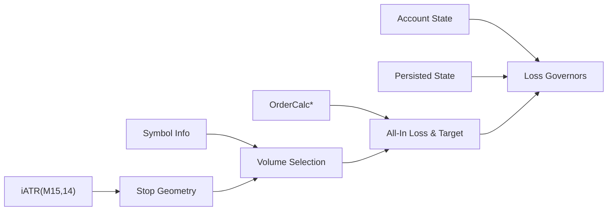

**Diagram sources**
- [TRIAD_R_HS.mq5:2217-2309](file://MQL5/Experts/TRIAD_R_HS/TRIAD_R_HS.mq5#L2217-L2309)
- [TRIAD_R_HS.mq5:1685-1712](file://MQL5/Experts/TRIAD_R_HS/TRIAD_R_HS.mq5#L1685-L1712)
- [TRIAD_R_HS.mq5:3991-3993](file://MQL5/Experts/TRIAD_R_HS/TRIAD_R_HS.mq5#L3991-L3993)

**Section sources**
- [TRIAD_R_HS.mq5:2217-2309](file://MQL5/Experts/TRIAD_R_HS/TRIAD_R_HS.mq5#L2217-L2309)
- [TRIAD_R_HS.mq5:1685-1712](file://MQL5/Experts/TRIAD_R_HS/TRIAD_R_HS.mq5#L1685-L1712)

## Performance Considerations
- Indicator handles and history depth: Ensure sufficient bars for ATR and EMA filters to avoid failures.
- Quote freshness: Spread and cost gates refresh quotes immediately before ranking to prevent stale pricing.
- Cost-to-R gating: Prevents trading when transaction costs erode expected R.
- Request limits: Non-emergency request caps prevent excessive chatter.

[No sources needed since this section provides general guidance]

## Troubleshooting Guide
Common rejection reasons and their causes:
- stop_atr: Stop distance outside configured ATR multiples
- quote_stale / quote_changed_or_stale: Quotes too old or changed between steps
- spread_gate / spread_gate_recheck: Current spread exceeds median-based threshold
- cost_to_r / cost_to_r_recheck: Transaction costs too high relative to R
- news_blackout: Trading blocked near high-impact events
- insufficient_or_unknown_margin: Margin check failed
- firm_floor_projection / internal_daily_projection / internal_weekly_projection / strategy_drawdown_projection: Risk guard rejected due to floors or thresholds

Actions:
- Verify indicator history and symbol contracts
- Refresh quotes and ensure low latency
- Review news calendar coverage and timing
- Confirm account margins and leverage settings
- Inspect logs for specific rejection reason

**Section sources**
- [TRIAD_R_HS.mq5:2404-2478](file://MQL5/Experts/TRIAD_R_HS/TRIAD_R_HS.mq5#L2404-L2478)
- [TRIAD_R_HS.mq5:2311-2341](file://MQL5/Experts/TRIAD_R_HS/TRIAD_R_HS.mq5#L2311-L2341)
- [TRIAD_R_HS.mq5:1685-1712](file://MQL5/Experts/TRIAD_R_HS/TRIAD_R_HS.mq5#L1685-L1712)

## Conclusion
The TRIAD-R risk system integrates robust stop geometry, precise all-in cash risk accounting, conservative volume selection aligned with broker tick economics, and layered governance through drawdown throttling and multiple loss governors. By anchoring risk budgets to phase initial balance and adjusting dynamically for drawdown, the strategy maintains consistent risk exposure while protecting capital through firm floors and internal stops.

[No sources needed since this section summarizes without analyzing specific files]

## Appendices

### Appendix A: Key Functions and Their Roles
- PrepareCandidate: Builds entry/stop, validates regime, spreads, costs, and prepares for volume/target calculations.
- CashLossForVolume: Computes all-in loss including slippage reserve and commission.
- CalculateVolume: Maps budget to broker volume lattice and validates against budget and margin.
- SolveTargetPrice: Finds target price to achieve desired net profit equal to cash_risk × target_r.
- CanTakeCashRisk: Enforces firm floors, daily/weekly stops, and drawdown shutdown on projections.
- GlobalRiskGuards: Orchestrates broader runtime checks including identity, journal validity, and lifecycle locks.

**Section sources**
- [TRIAD_R_HS.mq5:2380-2522](file://MQL5/Experts/TRIAD_R_HS/TRIAD_R_HS.mq5#L2380-L2522)
- [TRIAD_R_HS.mq5:2217-2309](file://MQL5/Experts/TRIAD_R_HS/TRIAD_R_HS.mq5#L2217-L2309)
- [TRIAD_R_HS.mq5:1685-1712](file://MQL5/Experts/TRIAD_R_HS/TRIAD_R_HS.mq5#L1685-L1712)
- [TRIAD_R_HS.mq5:1772-1846](file://MQL5/Experts/TRIAD_R_HS/TRIAD_R_HS.mq5#L1772-L1846)