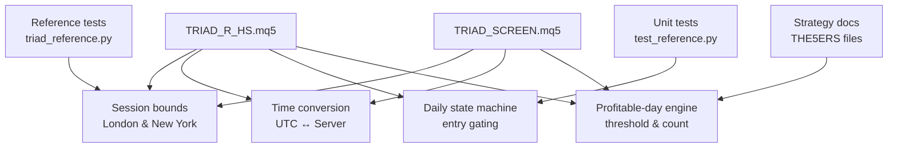
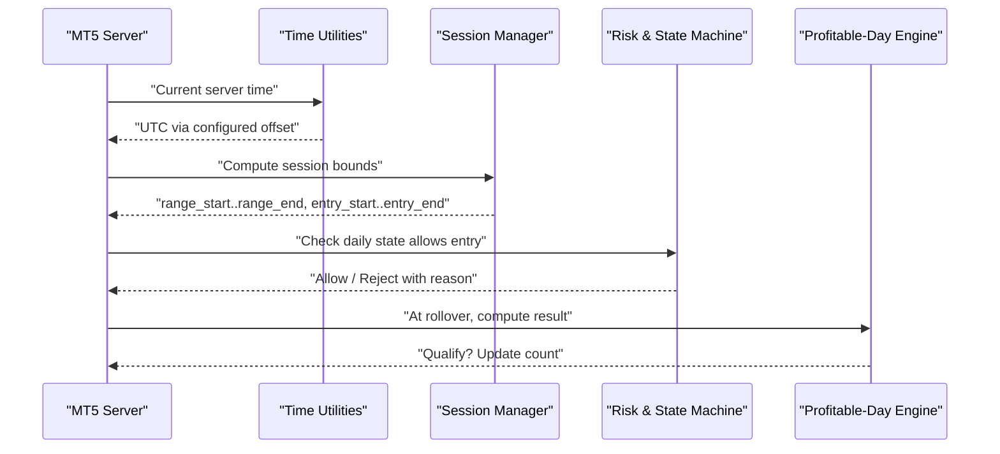
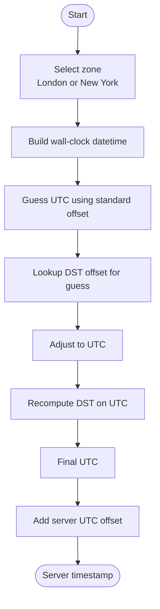
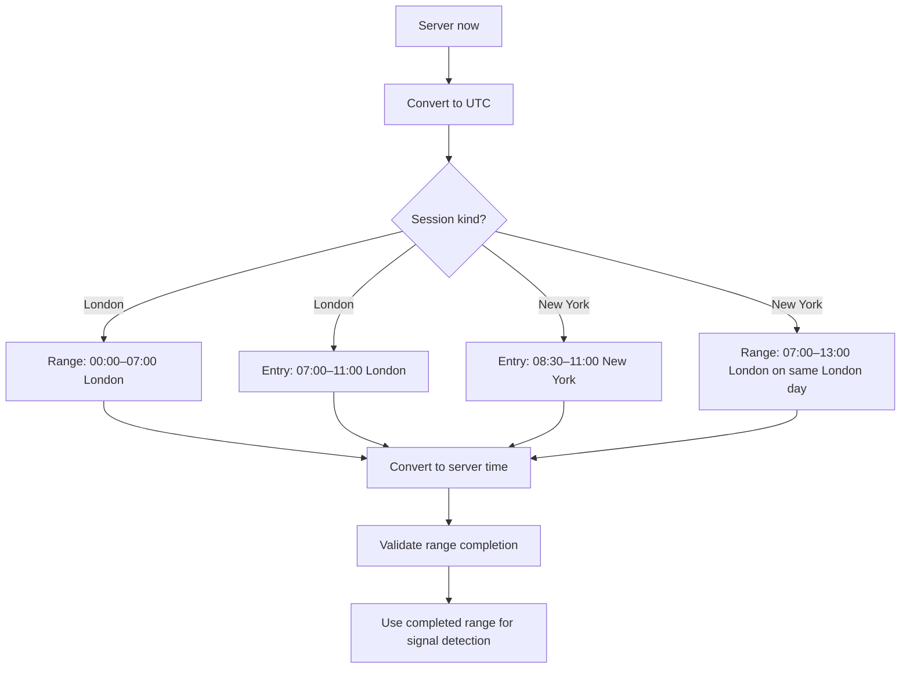
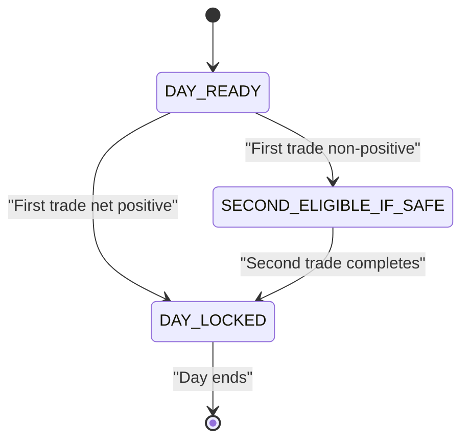
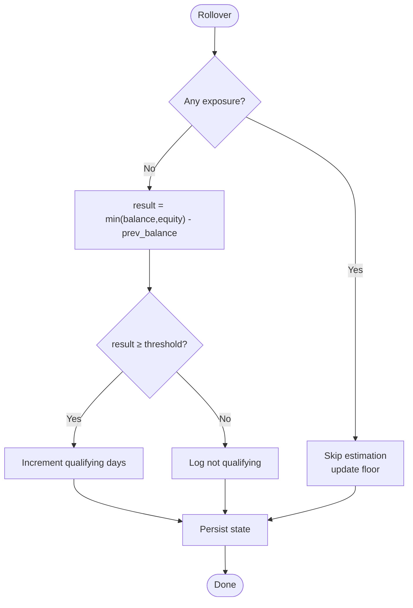
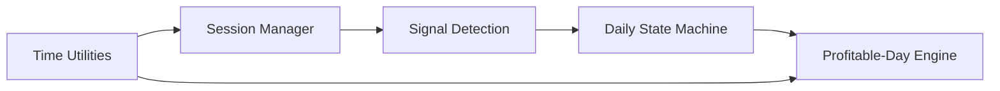

# Session Management and Time Handling

<cite>
**Referenced Files in This Document**
- [TRIAD_R_HS.mq5](file://MQL5/Experts/TRIAD_R_HS/TRIAD_R_HS.mq5)
- [TRIAD_SCREEN.mq5](file://MQL5/Experts/TRIAD_SCREEN/TRIAD_SCREEN.mq5)
- [triad_reference.py](file://tests/triad_reference.py)
- [test_reference.py](file://tests/test_reference.py)
- [THE5ERS-HIGH-STAKES-RESEARCH.md](file://THE5ERS-HIGH-STAKES-RESEARCH.md)
- [THE5ERS-2.5K-CHALLENGE-PLAN.md](file://THE5ERS-2.5K-CHALLENGE-PLAN.md)
</cite>

## Table of Contents
1. Introduction
2. Project Structure
3. Core Components
4. Architecture Overview
5. Detailed Component Analysis
6. Dependency Analysis
7. Performance Considerations
8. Troubleshooting Guide
9. Conclusion

## Introduction
This document explains how the TRIAD-R strategy manages trading sessions and time across multiple instruments, with a focus on:
- The three enabled instrument/session combinations: EURUSD London, GBPUSD London, and USDJPY New York.
- How civil-time boundaries are converted to MT5 server timestamps using independent Europe/London and America/New_York DST rules to avoid conflicts.
- The daily operating state machine that governs how many trades are allowed per day and when the day is locked.
- The profitable-day engine that calculates qualification thresholds and tracks qualifying days.
- Practical examples showing session validation, time boundary enforcement, and state transitions during a trading day.

## Project Structure
The relevant implementation lives in two MQL5 Expert Advisors:
- TRIAD_R_HS.mq5: canonical production EA with full safety, journaling, and multi-session support.
- TRIAD_SCREEN.mq5: research/screening EA that mirrors core logic for demo testing and dashboard reporting.

**Diagram sources**
- [TRIAD_R_HS.mq5:624-779](file://MQL5/Experts/TRIAD_R_HS/TRIAD_R_HS.mq5#L624-L779)
- [TRIAD_SCREEN.mq5:581-749](file://MQL5/Experts/TRIAD_SCREEN/TRIAD_SCREEN.mq5#L581-L749)
- [triad_reference.py:135-166](file://tests/triad_reference.py#L135-L166)
- [test_reference.py:85-100](file://tests/test_reference.py#L85-L100)
- [THE5ERS-HIGH-STAKES-RESEARCH.md:40-50](file://THE5ERS-HIGH-STAKES-RESEARCH.md#L40-L50)
- [THE5ERS-2.5K-CHALLENGE-PLAN.md:175-185](file://THE5ERS-2.5K-CHALLENGE-PLAN.md#L175-L185)

**Section sources**
- [TRIAD_R_HS.mq5:16-35](file://MQL5/Experts/TRIAD_R_HS/TRIAD_R_HS.mq5#L16-L35)
- [TRIAD_SCREEN.mq5:39-43](file://MQL5/Experts/TRIAD_SCREEN/TRIAD_SCREEN.mq5#L39-L43)

## Core Components
- Session definitions and enablement:
  - Three sessions are supported via an enum and per-symbol inputs:
    - SESSION_LONDON and SESSION_NEW_YORK kinds.
    - Enabled combinations: EURUSD London, GBPUSD London, USDJPY New York.
- Civil-time to server-time conversion:
  - Independent DST-aware offsets for Europe/London and America/New_York.
  - Conversion between UTC-like civil times and MT5 server timestamps using a configured server UTC offset.
- Daily operating state machine:
  - Entry gating based on completed trades and first-trade outcome.
  - Locks the day after a positive first trade or after two completed trades.
- Profitable-day engine:
  - Threshold derived from initial balance percentage (0.5% → $12.50 on $2,500).
  - Uses lower of midnight balance/equity minus previous day balance.
  - Requires three qualifying days per phase.

**Section sources**
- [TRIAD_R_HS.mq5:92-104](file://MQL5/Experts/TRIAD_R_HS/TRIAD_R_HS.mq5#L92-L104)
- [TRIAD_R_HS.mq5:624-779](file://MQL5/Experts/TRIAD_R_HS/TRIAD_R_HS.mq5#L624-L779)
- [TRIAD_R_HS.mq5:1593-1619](file://MQL5/Experts/TRIAD_R_HS/TRIAD_R_HS.mq5#L1593-L1619)
- [TRIAD_SCREEN.mq5:101-105](file://MQL5/Experts/TRIAD_SCREEN/TRIAD_SCREEN.mq5#L101-L105)
- [TRIAD_SCREEN.mq5:3040-3054](file://MQL5/Experts/TRIAD_SCREEN/TRIAD_SCREEN.mq5#L3040-L3054)
- [THE5ERS-HIGH-STAKES-RESEARCH.md:40-50](file://THE5ERS-HIGH-STAKES-RESEARCH.md#L40-L50)
- [THE5ERS-2.5K-CHALLENGE-PLAN.md:175-185](file://THE5ERS-2.5K-CHALLENGE-PLAN.md#L175-L185)

## Architecture Overview
The system separates concerns into:
- Time utilities: DST-aware conversions for London and New York, plus server offset handling.
- Session manager: computes range and entry windows per session kind and symbol.
- Signal pipeline: uses completed ranges and entry windows to detect patterns and prepare orders.
- Risk and state machine: enforces daily trade limits and locks based on outcomes.
- Profitable-day accounting: evaluates end-of-day results against thresholds and counts qualifying days.

**Diagram sources**
- [TRIAD_R_HS.mq5:624-779](file://MQL5/Experts/TRIAD_R_HS/TRIAD_R_HS.mq5#L624-L779)
- [TRIAD_R_HS.mq5:1593-1619](file://MQL5/Experts/TRIAD_R_HS/TRIAD_R_HS.mq5#L1593-L1619)
- [TRIAD_SCREEN.mq5:2992-3084](file://MQL5/Experts/TRIAD_SCREEN/TRIAD_SCREEN.mq5#L2992-L3084)

## Detailed Component Analysis

### Time Handling and DST-Aware Conversions
- London DST:
  - Standard offset 0; summer offset +1 hour during UK BST.
  - Boundaries computed by last Sunday in March and October at 01:00 local.
- New York DST:
  - Standard offset -5 hours; summer offset -4 hours during EDT.
  - Boundaries computed by second Sunday in March at 02:00 EST and first Sunday in November at 02:00 EDT.
- Conversion flow:
  - Local wall clock time → UTC using zone-specific DST rules.
  - UTC → Server time by adding configured expected server UTC offset hours.
  - Server time → UTC by subtracting the same offset.
- Date extraction:
  - GetLocalDate converts UTC to local date using the appropriate zone offset, producing a stable day key used for session lifecycle.

**Diagram sources**
- [TRIAD_R_HS.mq5:624-701](file://MQL5/Experts/TRIAD_R_HS/TRIAD_R_HS.mq5#L624-L701)
- [TRIAD_SCREEN.mq5:581-661](file://MQL5/Experts/TRIAD_SCREEN/TRIAD_SCREEN.mq5#L581-L661)
- [triad_reference.py:135-166](file://tests/triad_reference.py#L135-L166)

**Section sources**
- [TRIAD_R_HS.mq5:663-712](file://MQL5/Experts/TRIAD_R_HS/TRIAD_R_HS.mq5#L663-L712)
- [TRIAD_SCREEN.mq5:621-674](file://MQL5/Experts/TRIAD_SCREEN/TRIAD_SCREEN.mq5#L621-L674)

### Session Definitions and Validation
- Three enabled combinations:
  - EURUSD London: reference range 00:00–07:00 London time; entry window 07:00–11:00 London time.
  - GBPUSD London: same London windows as EURUSD.
  - USDJPY New York: reference range 07:00–13:00 London time; entry window 08:30–11:00 New York time.
- Bounds computation:
  - For London sessions, range and entry windows are built directly from London wall-clock times.
  - For New York sessions, entry windows use New York wall-clock times; the reference range is anchored to the corresponding London day derived from the NY entry start.
- Validation:
  - Range must be fully completed before reading high/low.
  - Entry detection only considers bars after the entry window opens and within the session.
  - Fresh attach mid-entry skips stale reconstruction to prevent trading old signals.

**Diagram sources**
- [TRIAD_R_HS.mq5:754-779](file://MQL5/Experts/TRIAD_R_HS/TRIAD_R_HS.mq5#L754-L779)
- [TRIAD_SCREEN.mq5:717-749](file://MQL5/Experts/TRIAD_SCREEN/TRIAD_SCREEN.mq5#L717-L749)

**Section sources**
- [TRIAD_R_HS.mq5:92-104](file://MQL5/Experts/TRIAD_R_HS/TRIAD_R_HS.mq5#L92-L104)
- [TRIAD_R_HS.mq5:754-779](file://MQL5/Experts/TRIAD_R_HS/TRIAD_R_HS.mq5#L754-L779)
- [TRIAD_SCREEN.mq5:717-749](file://MQL5/Experts/TRIAD_SCREEN/TRIAD_SCREEN.mq5#L717-L749)

### Daily Operating State Machine
The daily state machine controls how many trades can be taken and when the day is locked:
- Initial state: DAY_READY (first trade allowed).
- After one completed trade:
  - If net profit > 0: DAY_LOCKED immediately (no second trade).
  - If net profit ≤ 0: SECOND_ELIGIBLE_IF_SAFE (one more trade allowed if risk guards pass).
- After two completed trades: DAY_LOCKED regardless of outcome.
- Additional gates:
  - No foreign/manual deals.
  - News blackout checks and other global risk guards may block entries.

**Diagram sources**
- [TRIAD_R_HS.mq5:1593-1619](file://MQL5/Experts/TRIAD_R_HS/TRIAD_R_HS.mq5#L1593-L1619)
- [test_reference.py:85-100](file://tests/test_reference.py#L85-L100)

**Section sources**
- [TRIAD_R_HS.mq5:1593-1619](file://MQL5/Experts/TRIAD_R_HS/TRIAD_R_HS.mq5#L1593-L1619)
- [test_reference.py:85-100](file://tests/test_reference.py#L85-L100)

### Profitable-Day Engine
- Threshold calculation:
  - Qualifying day threshold = initial balance × qualifying percent (0.5% → $12.50 on $2,500).
- Result calculation:
  - Lower of midnight balance and equity minus previous day balance.
- Counting:
  - Each day meeting or exceeding the threshold increments the qualifying day count.
  - Phase requires three qualifying days; once reached, target status updates accordingly.
- Safeguards:
  - Only evaluated at clean rollover without exposure.
  - Missed rollover or offline periods skip estimation until next clean rollover.

**Diagram sources**
- [TRIAD_SCREEN.mq5:2992-3084](file://MQL5/Experts/TRIAD_SCREEN/TRIAD_SCREEN.mq5#L2992-L3084)
- [THE5ERS-HIGH-STAKES-RESEARCH.md:40-50](file://THE5ERS-HIGH-STAKES-RESEARCH.md#L40-L50)
- [THE5ERS-2.5K-CHALLENGE-PLAN.md:175-185](file://THE5ERS-2.5K-CHALLENGE-PLAN.md#L175-L185)

**Section sources**
- [TRIAD_SCREEN.mq5:3040-3054](file://MQL5/Experts/TRIAD_SCREEN/TRIAD_SCREEN.mq5#L3040-L3054)
- [THE5ERS-HIGH-STAKES-RESEARCH.md:40-50](file://THE5ERS-HIGH-STAKES-RESEARCH.md#L40-L50)
- [THE5ERS-2.5K-CHALLENGE-PLAN.md:175-185](file://THE5ERS-2.5K-CHALLENGE-PLAN.md#L175-L185)

### Examples: Sessions, Boundaries, and Transitions
- EURUSD London:
  - Reference range: 00:00–07:00 London time.
  - Entry window: 07:00–11:00 London time.
  - Example: On a Monday, if the London range completes at 07:00 London, the EA reads the range high/low and begins scanning for sweep/reclaim patterns from 07:00 to 11:00 London time.
- GBPUSD London:
  - Same windows as EURUSD London; independent session tracking per symbol.
- USDJPY New York:
  - Entry window: 08:30–11:00 New York time.
  - Reference range: 07:00–13:00 London time on the same London day as the NY entry start.
  - Example: If NY entry starts at 08:30 New York, the EA maps that to the corresponding London day and uses 07:00–13:00 London as the reference range.

- Time boundary enforcement:
  - Range must be fully completed before reading; otherwise warnings are logged and signals are rejected until data is available.
  - Entry detection ignores bars outside the entry window and avoids reconstructing stale events when attached mid-session.

- State transitions during a day:
  - First trade negative or flat: allow a second trade if safe.
  - First trade positive: lock the day immediately.
  - Two completed trades: lock the day regardless.

**Section sources**
- [TRIAD_R_HS.mq5:754-779](file://MQL5/Experts/TRIAD_R_HS/TRIAD_R_HS.mq5#L754-L779)
- [TRIAD_R_HS.mq5:1867-1909](file://MQL5/Experts/TRIAD_R_HS/TRIAD_R_HS.mq5#L1867-L1909)
- [TRIAD_R_HS.mq5:1593-1619](file://MQL5/Experts/TRIAD_R_HS/TRIAD_R_HS.mq5#L1593-L1619)
- [TRIAD_SCREEN.mq5:717-749](file://MQL5/Experts/TRIAD_SCREEN/TRIAD_SCREEN.mq5#L717-L749)

## Dependency Analysis
- Time utilities depend on DST rules for London and New York and on the configured server UTC offset.
- Session manager depends on time utilities to produce server-aligned windows.
- Signal detection depends on completed ranges and entry windows.
- Daily state machine depends on history reconstruction and risk guards.
- Profitable-day engine depends on rollover timing and account snapshots.

**Diagram sources**
- [TRIAD_R_HS.mq5:624-779](file://MQL5/Experts/TRIAD_R_HS/TRIAD_R_HS.mq5#L624-L779)
- [TRIAD_R_HS.mq5:1593-1619](file://MQL5/Experts/TRIAD_R_HS/TRIAD_R_HS.mq5#L1593-L1619)
- [TRIAD_SCREEN.mq5:2992-3084](file://MQL5/Experts/TRIAD_SCREEN/TRIAD_SCREEN.mq5#L2992-L3084)

**Section sources**
- [TRIAD_R_HS.mq5:624-779](file://MQL5/Experts/TRIAD_R_HS/TRIAD_R_HS.mq5#L624-L779)
- [TRIAD_R_HS.mq5:1593-1619](file://MQL5/Experts/TRIAD_R_HS/TRIAD_R_HS.mq5#L1593-L1619)
- [TRIAD_SCREEN.mq5:2992-3084](file://MQL5/Experts/TRIAD_SCREEN/TRIAD_SCREEN.mq5#L2992-L3084)

## Performance Considerations
- Range reads are performed only after the range closes to ensure authoritative data.
- Comparable statistics gather historical ranges, ATR, and spreads efficiently, skipping weekends and incomplete sessions.
- News calendar loading validates coverage and rejects stale or invalid rows early to avoid wasted computation.
- History scans for daily closed trades and rollover checks are bounded and optimized to run at rollover rather than continuously.

[No sources needed since this section provides general guidance]

## Troubleshooting Guide
Common issues and their indicators:
- Range unavailable:
  - Warning logged when range cannot be read before the entry window; signals will be rejected until data is ready.
- Insufficient statistics:
  - Error logged when comparable sessions are fewer than required; no signals until enough history accumulates.
- News calendar stale:
  - Error logged if coverage does not extend far enough into the future; trading may be blocked depending on configuration.
- Unauthorized history:
  - Halt triggered if external cashflows or unauthorized orders/deals are detected; state migration required.
- Rollover missed:
  - Warning logged if exposure crosses rollover; qualifying-day estimation skipped until next clean rollover.

**Section sources**
- [TRIAD_R_HS.mq5:836-918](file://MQL5/Experts/TRIAD_R_HS/TRIAD_R_HS.mq5#L836-L918)
- [TRIAD_R_HS.mq5:1160-1223](file://MQL5/Experts/TRIAD_R_HS/TRIAD_R_HS.mq5#L1160-L1223)
- [TRIAD_R_HS.mq5:1419-1523](file://MQL5/Experts/TRIAD_R_HS/TRIAD_R_HS.mq5#L1419-L1523)
- [TRIAD_SCREEN.mq5:2992-3084](file://MQL5/Experts/TRIAD_SCREEN/TRIAD_SCREEN.mq5#L2992-L3084)

## Conclusion
The TRIAD-R strategy implements robust session management and time handling by:
- Using independent DST-aware conversions for London and New York to derive accurate server-aligned windows.
- Enforcing strict session boundaries and validating completed ranges before signal detection.
- Applying a clear daily state machine that limits trades and locks the day after favorable or sufficient activity.
- Calculating profitable days using a transparent formula and requiring three qualifying days per phase.
These mechanisms together ensure disciplined trading aligned with challenge rules while minimizing DST-related edge cases and ensuring reliable operation across market sessions.