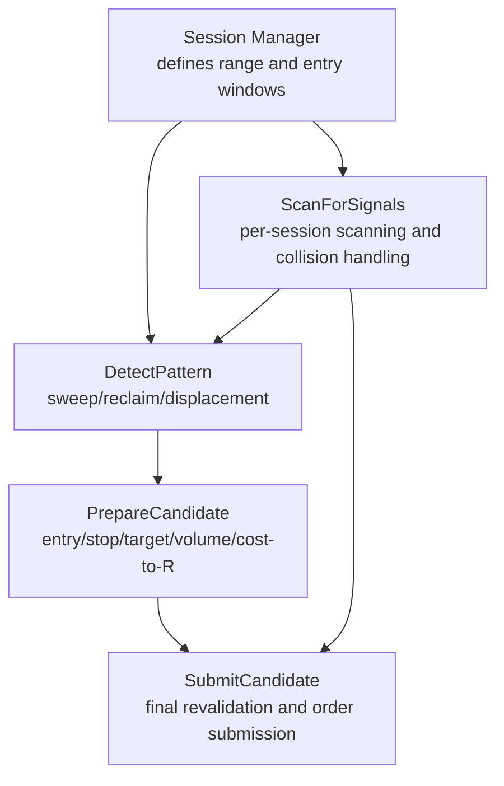
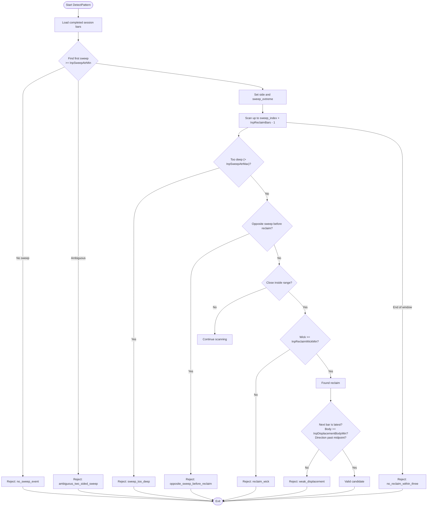
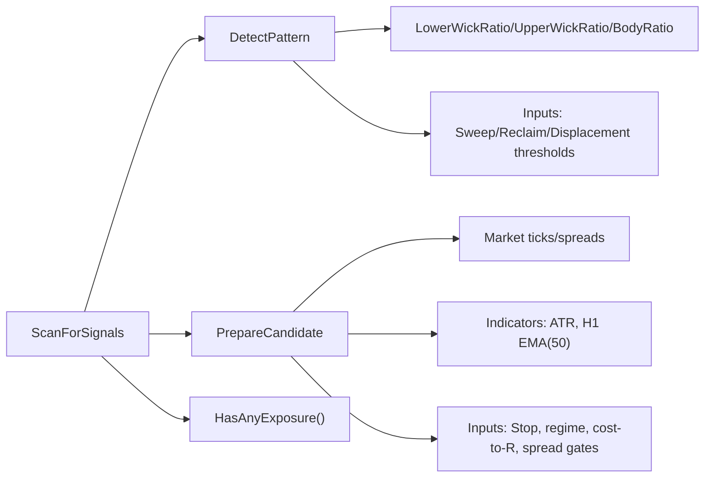

# Signal Detection and Pattern Recognition

<cite>
**Referenced Files in This Document**
- [TRIAD_R_HS.mq5](file://MQL5/Experts/TRIAD_R_HS/TRIAD_R_HS.mq5)
- [TRIAD_SCREEN.mq5](file://MQL5/Experts/TRIAD_SCREEN/TRIAD_SCREEN.mq5)
</cite>

## Table of Contents
1. [Introduction](#introduction)
2. [Project Structure](#project-structure)
3. [Core Components](#core-components)
4. [Architecture Overview](#architecture-overview)
5. [Detailed Component Analysis](#detailed-component-analysis)
6. [Dependency Analysis](#dependency-analysis)
7. [Performance Considerations](#performance-considerations)
8. [Troubleshooting Guide](#troubleshooting-guide)
9. [Conclusion](#conclusion)

## Introduction
This document explains the signal detection and pattern recognition logic for the TRIAD-R strategy’s sweep/reclaim setup. It focuses on how the system identifies a sweep beyond a reference range, validates a reclaim within a limited number of bars, confirms displacement strength, and enforces strict validation gates before considering a trade. It also documents the one-signal-per-event protection that prevents repeated sweeps of the same reference level from resetting the sequence.

## Project Structure
The canonical implementation lives in the MQL5 Expert Advisor (EA) files:
- Production EA: TRIAD_R_HS.mq5
- Screening counterpart: TRIAD_SCREEN.mq5

Both implement the same core pattern recognition and validation pipeline; the screening EA is a research tool that mirrors the canonical behavior without production safety machinery.



**Diagram sources**
- [TRIAD_R_HS.mq5:3980-4099](file://MQL5/Experts/TRIAD_R_HS/TRIAD_R_HS.mq5#L3980-L4099)
- [TRIAD_R_HS.mq5:1936-2116](file://MQL5/Experts/TRIAD_R_HS/TRIAD_R_HS.mq5#L1936-L2116)
- [TRIAD_R_HS.mq5:2380-2522](file://MQL5/Experts/TRIAD_R_HS/TRIAD_R_HS.mq5#L2380-L2522)
- [TRIAD_R_HS.mq5:2692-2799](file://MQL5/Experts/TRIAD_R_HS/TRIAD_R_HS.mq5#L2692-L2799)

**Section sources**
- [TRIAD_R_HS.mq5:3980-4099](file://MQL5/Experts/TRIAD_R_HS/TRIAD_R_HS.mq5#L3980-L4099)
- [TRIAD_SCREEN.mq5:3161-3199](file://MQL5/Experts/TRIAD_SCREEN/TRIAD_SCREEN.mq5#L3161-L3199)

## Core Components
- Session manager: defines London or New York session ranges and entry windows, tracks consumed state per session to enforce one event per day.
- Pattern detector: scans M5 bars to find the first qualifying sweep, then checks reclaim and displacement conditions.
- Candidate preparer: computes entry, stop, target, volume, cost-to-R, and applies regime and risk filters.
- Submission gate: performs final revalidation and submits orders only if all gates pass.

Key inputs used by the pattern detector and validator:
- Sweep depth bounds: InpSweepAtrMin, InpSweepAtrMax
- Reclaim window: InpReclaimBars
- Reclaim wick threshold: InpReclaimWickMin
- Displacement body threshold: InpDisplacementBodyMin
- Stop buffer and ATR-based stop sizing: InpStopBufferAtr, InpStopAtrMin, InpStopAtrMax
- Regime filters: range percentile and ATR percentile thresholds
- Cost-to-R limit: InpMaxCostToR
- Spread gate multiplier: InpSpreadMedianMultiplier
- H1 EMA bias filter: InpRequireH1EmaBias

**Section sources**
- [TRIAD_R_HS.mq5:121-149](file://MQL5/Experts/TRIAD_R_HS/TRIAD_R_HS.mq5#L121-L149)
- [TRIAD_R_HS.mq5:1915-1934](file://MQL5/Experts/TRIAD_R_HS/TRIAD_R_HS.mq5#L1915-L1934)
- [TRIAD_R_HS.mq5:2380-2522](file://MQL5/Experts/TRIAD_R_HS/TRIAD_R_HS.mq5#L2380-L2522)

## Architecture Overview
The detection and validation flow proceeds as follows:

```mermaid
sequenceDiagram
participant Sess as "Session Manager"
participant Det as "DetectPattern"
participant Prep as "PrepareCandidate"
participant Sub as "SubmitCandidate"
Sess->>Det : Provide completed session bars, range, entry window
Det->>Det : Find first sweep beyond reference low/high by ATR
alt Long sweep
Det->>Det : Track deepest low; reject if too deep or opposite sweep
Det->>Det : Check reclaim close inside range with sufficient lower wick
else Short sweep
Det->>Det : Track highest high; reject if too deep or opposite sweep
Det->>Det : Check reclaim close inside range with sufficient upper wick
end
Det-->>Sess : If no reclaim within N bars -> mark detected but rejected
Det->>Det : Validate displacement bar (body ratio and direction)
Det-->>Sess : Return candidate or rejection reason
Sess->>Prep : Entry=midpoint of displacement; Stop=sweep extreme ± buffer
Prep->>Prep : Apply stop ATR bounds, spread gate, cost-to-R, regime percentiles
Prep->>Prep : Compute volume, target, check target room
Prep-->>Sess : Valid candidate or rejection
Sess->>Sub : Final revalidation and order submission
```

**Diagram sources**
- [TRIAD_R_HS.mq5:1936-2116](file://MQL5/Experts/TRIAD_R_HS/TRIAD_R_HS.mq5#L1936-L2116)
- [TRIAD_R_HS.mq5:2380-2522](file://MQL5/Experts/TRIAD_R_HS/TRIAD_R_HS.mq5#L2380-L2522)
- [TRIAD_R_HS.mq5:2692-2799](file://MQL5/Experts/TRIAD_R_HS/TRIAD_R_HS.mq5#L2692-L2799)

## Detailed Component Analysis

### Sweep/Reclaim Pattern Identification
The pattern detector scans the completed session bars starting at the effective start of the entry window. It freezes ATR at the entry-window open so the scale does not change mid-candidate.

- Reference range: The session’s high and low are used as the “reference range.”
- Sweep condition: For each bar, compute distance from the reference boundary in ATR units:
  - Long sweep: (reference_low - bar.low) / ATR >= InpSweepAtrMin
  - Short sweep: (bar.high - reference_high) / ATR >= InpSweepAtrMin
- Ambiguity: If both long and short sweeps occur on the same bar, it is rejected as ambiguous.
- First sweep selection: The earliest qualifying sweep sets the side and the sweep extreme.

Reclaim search window:
- The detector looks from the sweep bar up to sweep_index + InpReclaimBars - 1.
- For a long sweep:
  - Track the deepest low across those bars.
  - Reject if (reference_low - deepest_low) / ATR > InpSweepAtrMax (“too deep”).
  - Reject if an opposite-side sweep occurs before reclaim.
  - A reclaim candle closes back inside the reference range (close between reference_low and reference_high).
  - The reclaim candle must have a lower wick of at least InpReclaimWickMin of its total range.
- For a short sweep:
  - Track the highest high across those bars.
  - Reject if (highest_high - reference_high) / ATR > InpSweepAtrMax (“too deep”).
  - Reject if an opposite-side sweep occurs before reclaim.
  - A reclaim candle closes back inside the reference range.
  - The reclaim candle must have an upper wick of at least InpReclaimWickMin of its total range.

If no reclaim occurs within the allowed bars:
- If there are still bars left in the window, the detector returns false (waiting).
- If the full window has elapsed, it marks the event as detected but rejected with “no_reclaim_within_three”.

Displacement requirement:
- The bar immediately after the reclaim must be the latest completed bar.
- For long: displacement.close > displacement.open, BodyRatio(displacement) >= InpDisplacementBodyMin, and displacement.close above the reclaim midpoint.
- For short: displacement.close < displacement.open, BodyRatio(displacement) >= InpDisplacementBodyMin, and displacement.close below the reclaim midpoint.
- If displacement fails, the event is marked detected but rejected with “weak_displacement”.

Concrete examples from the implementation:
- Long sweep detection and reclaim wick check: [TRIAD_R_HS.mq5:2012-2041](file://MQL5/Experts/TRIAD_R_HS/TRIAD_R_HS.mq5#L2012-L2041)
- Short sweep detection and reclaim wick check: [TRIAD_R_HS.mq5:2043-2073](file://MQL5/Experts/TRIAD_R_HS/TRIAD_R_HS.mq5#L2043-L2073)
- Displacement validation: [TRIAD_R_HS.mq5:2104-2115](file://MQL5/Experts/TRIAD_R_HS/TRIAD_R_HS.mq5#L2104-L2115)
- Wick/body helpers: [TRIAD_R_HS.mq5:1915-1934](file://MQL5/Experts/TRIAD_R_HS/TRIAD_R_HS.mq5#L1915-L1934)

Long and short mirror logic:
- The code mirrors the long and short branches symmetrically:
  - Depth checks use the appropriate boundary (low vs high).
  - Opposite sweep checks compare against the opposite boundary.
  - Reclaim checks ensure the close is inside the range and the relevant wick meets the threshold.
  - Displacement checks require directionality and body strength relative to the reclaim midpoint.

**Section sources**
- [TRIAD_R_HS.mq5:1936-2116](file://MQL5/Experts/TRIAD_R_HS/TRIAD_R_HS.mq5#L1936-L2116)
- [TRIAD_R_HS.mq5:1915-1934](file://MQL5/Experts/TRIAD_R_HS/TRIAD_R_HS.mq5#L1915-L1934)

### Signal Validation Process
Once DetectPattern returns a candidate, PrepareCandidate builds the trade plan and applies multiple validation gates:

- Entry and stop:
  - Entry is normalized to tick size at the midpoint of the displacement bar.
  - Stop is placed beyond the sweep extreme with a buffer proportional to ATR, then normalized.
  - Stop distance in ATR must fall within configured bounds; otherwise rejected.
- Market and quote checks:
  - Symbol must be in full trade mode.
  - Quote freshness and valid broker distances (stops/freeze levels) are enforced.
  - Spread must be within a multiplier of the median spread.
- Regime filters:
  - Range percentile and ATR percentile must be within configured bands.
  - Optional H1 EMA(50) directional bias can reject counter-trend setups when enabled.
- Cost-to-R and volume:
  - Current cost-to-R includes spread, slippage reserve, and commission; must be under the configured maximum.
  - Volume is computed to fit the cash risk budget respecting minimum lot and step constraints.
- Target and room:
  - Target price is solved to achieve the desired net R after costs and slippage.
  - There must be enough room between entry and nearest barrier (range high/low) to place the target.
- News blackout:
  - If a relevant news event is imminent, the candidate is rejected.
- Risk guards:
  - Daily and global risk limits may block entries.

Rejection reasons include:
- sweep_too_deep, opposite_sweep_before_reclaim, reclaim_wick, no_reclaim_within_three, weak_displacement
- stop_atr, symbol_not_full_trade_mode, quote_stale, spread_gate, h1_ema_bias
- cost_to_r, volume_or_min_lot, insufficient_or_unknown_margin, target_calc, target_room
- news_blackout, comparable_stats, range_percentile, atr_percentile

Code references:
- Entry/stop computation and stop ATR bounds: [TRIAD_R_HS.mq5:2380-2402](file://MQL5/Experts/TRIAD_R_HS/TRIAD_R_HS.mq5#L2380-L2402)
- Quote, spread, and cost-to-R checks: [TRIAD_R_HS.mq5:2409-2478](file://MQL5/Experts/TRIAD_R_HS/TRIAD_R_HS.mq5#L2409-L2478)
- Volume and target solving: [TRIAD_R_HS.mq5:2236-2309](file://MQL5/Experts/TRIAD_R_HS/TRIAD_R_HS.mq5#L2236-L2309)
- Target room check: [TRIAD_R_HS.mq5:2501-2510](file://MQL5/Experts/TRIAD_R_HS/TRIAD_R_HS.mq5#L2501-L2510)
- H1 EMA bias filter: [TRIAD_R_HS.mq5:2343-2378](file://MQL5/Experts/TRIAD_R_HS/TRIAD_R_HS.mq5#L2343-L2378)

**Section sources**
- [TRIAD_R_HS.mq5:2236-2309](file://MQL5/Experts/TRIAD_R_HS/TRIAD_R_HS.mq5#L2236-L2309)
- [TRIAD_R_HS.mq5:2380-2522](file://MQL5/Experts/TRIAD_R_HS/TRIAD_R_HS.mq5#L2380-L2522)

### One-Signal-Per-Event Protection and Repeated Sweeps
The system ensures only one sweep/reclaim event is considered per session per civil day:

- The detector reconstructs the first qualifying sweep from the start of the entry window. Once that event resolves—validly or invalidly—the session is marked consumed so later repeated sweeps cannot reset the sequence.
- In the scanning loop, once a candidate is detected (even if later rejected during preparation), the session is marked consumed and persisted.
- Exposure mutex: HasAnyExposure() blocks new signals while any position or pending entry exists.

Implementation references:
- Event consumption comment and logic: [TRIAD_R_HS.mq5:1974-1976](file://MQL5/Experts/TRIAD_R_HS/TRIAD_R_HS.mq5#L1974-L1976)
- Consumed flag set upon detection: [TRIAD_R_HS.mq5:4043-4047](file://MQL5/Experts/TRIAD_R_HS/TRIAD_R_HS.mq5#L4043-L4047)
- Exposure mutex: [TRIAD_R_HS.mq5:1250-1253](file://MQL5/Experts/TRIAD_R_HS/TRIAD_R_HS.mq5#L1250-L1253)
- Screen counterpart enforcement: [TRIAD_SCREEN.mq5:3176-3179](file://MQL5/Experts/TRIAD_SCREEN/TRIAD_SCREEN.mq5#L3176-L3179)

How repeated sweeps are handled:
- After the first event is detected, g_sessions[session_index].consumed becomes true. Subsequent sweeps in the same session/day are ignored because the scanner skips consumed sessions.
- This prevents “resetting” the sequence if price revisits the same reference level later in the session.

**Section sources**
- [TRIAD_R_HS.mq5:1974-1976](file://MQL5/Experts/TRIAD_R_HS/TRIAD_R_HS.mq5#L1974-L1976)
- [TRIAD_R_HS.mq5:4043-4047](file://MQL5/Experts/TRIAD_R_HS/TRIAD_R_HS.mq5#L4043-L4047)
- [TRIAD_R_HS.mq5:1250-1253](file://MQL5/Experts/TRIAD_R_HS/TRIAD_R_HS.mq5#L1250-L1253)
- [TRIAD_SCREEN.mq5:3176-3179](file://MQL5/Experts/TRIAD_SCREEN/TRIAD_SCREEN.mq5#L3176-L3179)

### Flowchart of Pattern Recognition Logic


**Diagram sources**
- [TRIAD_R_HS.mq5:1978-2116](file://MQL5/Experts/TRIAD_R_HS/TRIAD_R_HS.mq5#L1978-L2116)

## Dependency Analysis
Key dependencies and relationships:
- DetectPattern depends on:
  - Completed session bars and frozen ATR
  - Wick/body ratio helpers
  - Inputs: InpSweepAtrMin, InpSweepAtrMax, InpReclaimBars, InpReclaimWickMin, InpDisplacementBodyMin
- PrepareCandidate depends on:
  - Market data (ticks, spreads)
  - Indicator handles (ATR, optional H1 EMA)
  - Inputs: InpStopBufferAtr, InpStopAtrMin/Max, InpRangePercentileLow/High, InpAtrPercentileLow/High, InpMaxCostToR, InpSpreadMedianMultiplier, InpRequireH1EmaBias
- ScanForSignals coordinates:
  - Session refresh and consumed flags
  - Collision handling among multiple symbols/sessions
  - Final revalidation before submission



**Diagram sources**
- [TRIAD_R_HS.mq5:1915-1934](file://MQL5/Experts/TRIAD_R_HS/TRIAD_R_HS.mq5#L1915-L1934)
- [TRIAD_R_HS.mq5:2343-2378](file://MQL5/Experts/TRIAD_R_HS/TRIAD_R_HS.mq5#L2343-L2378)
- [TRIAD_R_HS.mq5:2380-2522](file://MQL5/Experts/TRIAD_R_HS/TRIAD_R_HS.mq5#L2380-L2522)
- [TRIAD_R_HS.mq5:1250-1253](file://MQL5/Experts/TRIAD_R_HS/TRIAD_R_HS.mq5#L1250-L1253)
- [TRIAD_R_HS.mq5:4003-4099](file://MQL5/Experts/TRIAD_R_HS/TRIAD_R_HS.mq5#L4003-L4099)

**Section sources**
- [TRIAD_R_HS.mq5:1915-1934](file://MQL5/Experts/TRIAD_R_HS/TRIAD_R_HS.mq5#L1915-L1934)
- [TRIAD_R_HS.mq5:2343-2378](file://MQL5/Experts/TRIAD_R_HS/TRIAD_R_HS.mq5#L2343-L2378)
- [TRIAD_R_HS.mq5:2380-2522](file://MQL5/Experts/TRIAD_R_HS/TRIAD_R_HS.mq5#L2380-L2522)
- [TRIAD_R_HS.mq5:4003-4099](file://MQL5/Experts/TRIAD_R_HS/TRIAD_R_HS.mq5#L4003-L4099)

## Performance Considerations
- ATR is frozen at the entry-window open to avoid recalculating scales mid-candidate, reducing noise and ensuring consistent sweep/stop sizing.
- The detector scans a bounded window (up to three bars post-sweep), limiting computational overhead.
- Candidate preparation loads historical statistics and indicator buffers; this is done sequentially and revalidated just before submission to keep quotes fresh.
- Collision handling ranks candidates by priority, cost-to-R, and signal timing to minimize redundant work and ensure deterministic selection.

[No sources needed since this section provides general guidance]

## Troubleshooting Guide
Common rejection reasons and their meanings:
- sweep_too_deep: The sweep exceeded the maximum allowed depth relative to ATR.
- opposite_sweep_before_reclaim: An opposing sweep occurred before reclaim, invalidating the sequence.
- reclaim_wick: The reclaim candle’s wick was too small relative to its range.
- no_reclaim_within_three: No reclaim occurred within the allowed number of bars.
- weak_displacement: The displacement bar did not meet body strength or direction requirements.
- stop_atr: The resulting stop distance in ATR fell outside configured bounds.
- spread_gate: Current spread exceeded the allowed multiplier over median spread.
- cost_to_r: Estimated cost-to-R exceeded the configured maximum.
- target_room: Insufficient space between entry and nearest barrier to place the target.
- news_blackout: A relevant news event blocked trading.
- h1_ema_bias: Directional bias filter rejected a counter-trend setup (when enabled).

Where to inspect these rejections:
- Pattern-level rejections: [TRIAD_R_HS.mq5:1978-2116](file://MQL5/Experts/TRIAD_R_HS/TRIAD_R_HS.mq5#L1978-L2116)
- Candidate preparation rejections: [TRIAD_R_HS.mq5:2380-2522](file://MQL5/Experts/TRIAD_R_HS/TRIAD_R_HS.mq5#L2380-L2522)
- Final submission revalidation: [TRIAD_R_HS.mq5:2692-2799](file://MQL5/Experts/TRIAD_R_HS/TRIAD_R_HS.mq5#L2692-L2799)

**Section sources**
- [TRIAD_R_HS.mq5:1978-2116](file://MQL5/Experts/TRIAD_R_HS/TRIAD_R_HS.mq5#L1978-L2116)
- [TRIAD_R_HS.mq5:2380-2522](file://MQL5/Experts/TRIAD_R_HS/TRIAD_R_HS.mq5#L2380-L2522)
- [TRIAD_R_HS.mq5:2692-2799](file://MQL5/Experts/TRIAD_R_HS/TRIAD_R_HS.mq5#L2692-L2799)

## Conclusion
The TRIAD-R sweep/reclaim system uses a disciplined, multi-stage process to identify high-probability patterns and filter out noise:
- Strict sweep depth and reclaim wick criteria ensure meaningful liquidity grabs and recovery.
- Displacement confirmation adds momentum validation before entry.
- Robust validation gates (regime, cost-to-R, spread, news, risk) protect against adverse conditions.
- One-signal-per-event protection prevents repeated sweeps from resetting the sequence, maintaining consistency and reducing whipsaw exposure.

This design balances sensitivity to genuine market structure events with rigorous safeguards to avoid trading low-quality or risky setups.

[No sources needed since this section summarizes without analyzing specific files]