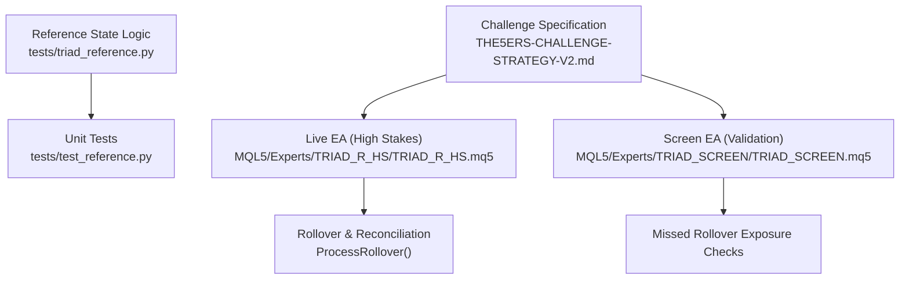
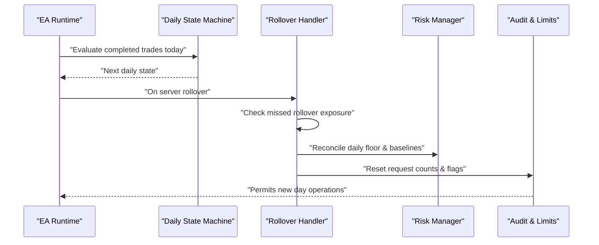
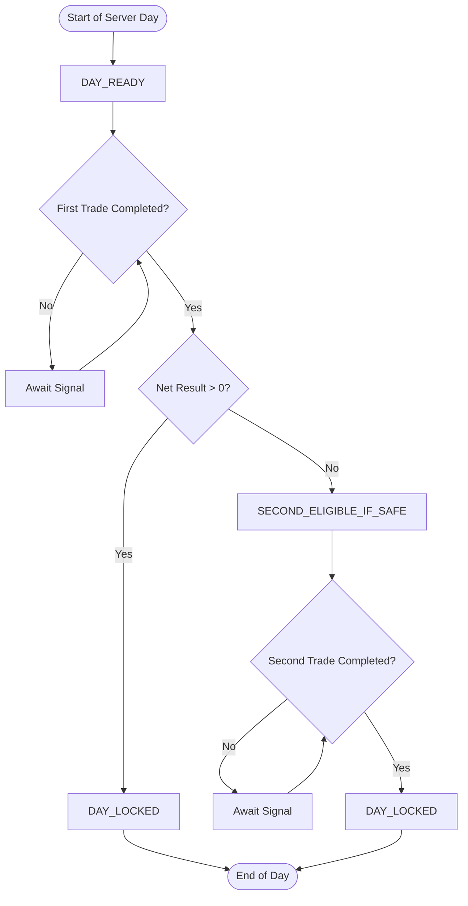
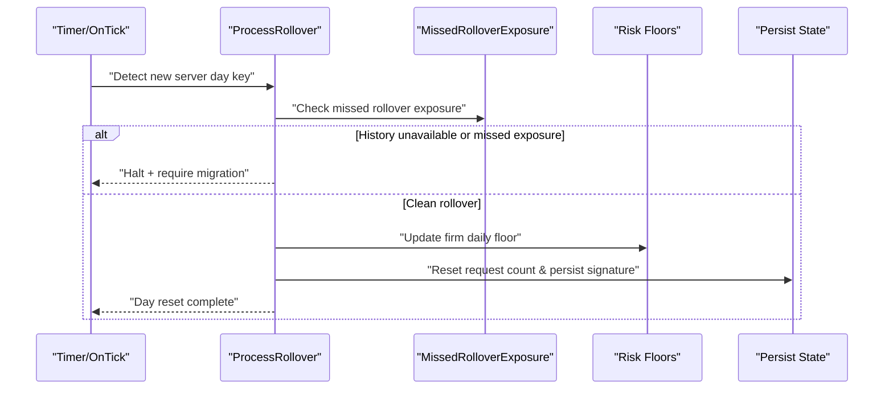
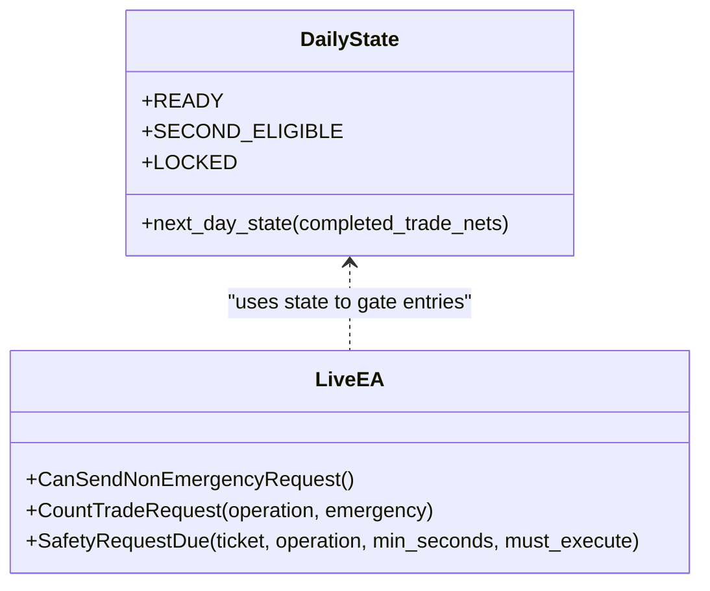
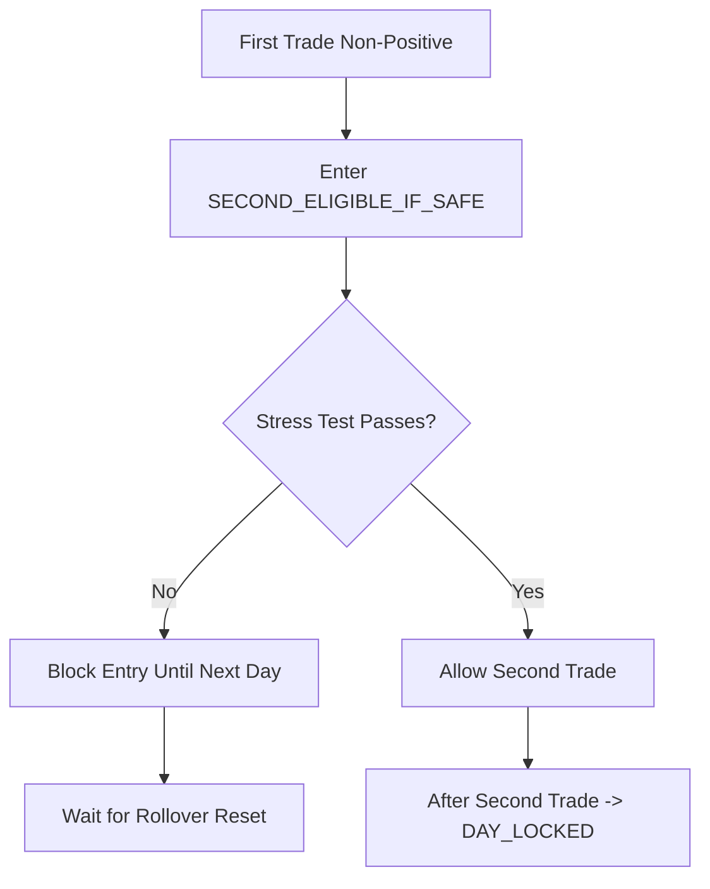
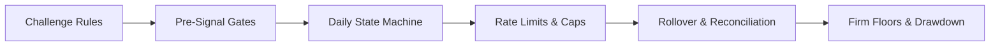
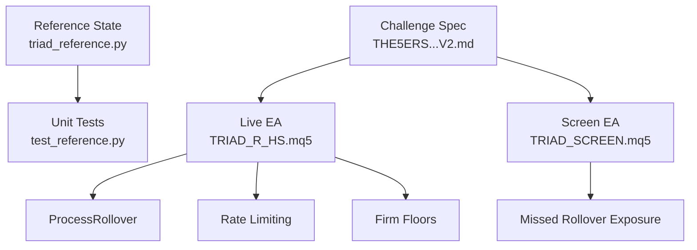

# Daily State Machine

<cite>
**Referenced Files in This Document**
- [triad_reference.py](file://tests/triad_reference.py)
- [test_reference.py](file://tests/test_reference.py)
- [TRIAD_R_HS.mq5](file://MQL5/Experts/TRIAD_R_HS/TRIAD_R_HS.mq5)
- [TRIAD_SCREEN.mq5](file://MQL5/Experts/TRIAD_SCREEN/TRIAD_SCREEN.mq5)
- [THE5ERS-CHALLENGE-STRATEGY-V2.md](file://THE5ERS-CHALLENGE-STRATEGY-V2.md)
</cite>

## Table of Contents
1. [Introduction](#introduction)
2. [Project Structure](#project-structure)
3. [Core Components](#core-components)
4. [Architecture Overview](#architecture-overview)
5. [Detailed Component Analysis](#detailed-component-analysis)
6. [Dependency Analysis](#dependency-analysis)
7. [Performance Considerations](#performance-considerations)
8. [Troubleshooting Guide](#troubleshooting-guide)
9. [Conclusion](#conclusion)

## Introduction
This document explains the daily operating state machine that enforces The5ers challenge rules for a single-position strategy. It covers:
- The complete state flow across a server day: DAY_READY → FIRST_TRADE → {NET_POSITIVE: DAY_LOCKED, NET_NONPOSITIVE: SECOND_ELIGIBLE_IF_SAFE} → SECOND_TRADE → DAY_LOCKED.
- Rules governing first-trade profit locking, second-trade eligibility under stress safety limits, and day locking mechanisms.
- The two-completed-trades-per-server-day constraint and how it is enforced.
- The state reset process triggered by confirmed server rollover and successful reconciliation.
- Examples of transitions for winning first trade, losing first trade, and reaching daily limits.
- Integration with risk management components to ensure compliance with The5ers rules.

## Project Structure
The daily state machine is defined by a small reference implementation and validated by tests. The live MQL5 expert advisors implement complementary controls such as rollover handling, request rate limiting, and exposure checks that interact with the daily state logic.

**Diagram sources**
- [triad_reference.py:30-84](file://tests/triad_reference.py#L30-L84)
- [test_reference.py:85-98](file://tests/test_reference.py#L85-L98)
- [TRIAD_R_HS.mq5:3379-3514](file://MQL5/Experts/TRIAD_R_HS/TRIAD_R_HS.mq5#L3379-L3514)
- [TRIAD_SCREEN.mq5:2904-3019](file://MQL5/Experts/TRIAD_SCREEN/TRIAD_SCREEN.mq5#L2904-L3019)
- [THE5ERS-CHALLENGE-STRATEGY-V2.md:32-50](file://THE5ERS-CHALLENGE-STRATEGY-V2.md#L32-L50)

**Section sources**
- [triad_reference.py:30-84](file://tests/triad_reference.py#L30-L84)
- [test_reference.py:85-98](file://tests/test_reference.py#L85-L98)
- [TRIAD_R_HS.mq5:3379-3514](file://MQL5/Experts/TRIAD_R_HS/TRIAD_R_HS.mq5#L3379-L3514)
- [TRIAD_SCREEN.mq5:2904-3019](file://MQL5/Experts/TRIAD_SCREEN/TRIAD_SCREEN.mq5#L2904-L3019)
- [THE5ERS-CHALLENGE-STRATEGY-V2.md:32-50](file://THE5ERS-CHALLENGE-STRATEGY-V2.md#L32-L50)

## Core Components
- DayState enum defines three states: READY (DAY_READY), SECOND_ELIGIBLE (SECOND_ELIGIBLE_IF_SAFE), LOCKED (DAY_LOCKED).
- next_day_state computes the next daily state from completed trade net results for the current server day.
- Unit tests assert the expected transitions for zero trades, positive first trade, non-positive first trade, and two trades.

Key behaviors:
- No completed trades: DAY_READY.
- One completed trade:
  - Positive net result: DAY_LOCKED (first-trade profit locks the day).
  - Zero or negative net result: SECOND_ELIGIBLE_IF_SAFE (second trade allowed only if safe).
- Two or more completed trades: DAY_LOCKED (two-trade maximum reached).

**Section sources**
- [triad_reference.py:30-84](file://tests/triad_reference.py#L30-L84)
- [test_reference.py:85-98](file://tests/test_reference.py#L85-L98)

## Architecture Overview
The daily state machine integrates with the live trading system through:
- Server-day boundaries via ProcessRollover, which resets daily counters and reconciles floors after rollover.
- Missed rollover exposure detection that prevents unsafe baseline migration when exposure crosses midnight.
- Request rate limiting and audit logging to enforce per-day operational constraints.
- Firm safety floors and drawdown controls that gate entry decisions and can halt trading.

**Diagram sources**
- [triad_reference.py:78-84](file://tests/triad_reference.py#L78-L84)
- [TRIAD_R_HS.mq5:3379-3514](file://MQL5/Experts/TRIAD_R_HS/TRIAD_R_HS.mq5#L3379-L3514)
- [TRIAD_R_HS.mq5:2527-2583](file://MQL5/Experts/TRIAD_R_HS/TRIAD_R_HS.mq5#L2527-L2583)

## Detailed Component Analysis

### Daily State Flow and Rules
The state machine enforces:
- Maximum two completed sequential trades per server day.
- First-trade profit lock: any positive net on the first completed trade immediately locks the day.
- Second-trade eligibility: if the first trade is zero or negative, a second trade may be taken only if all safety limits remain satisfied (stress-safe outcome).
- Locking: once locked, no further entries are permitted until rollover resets the day.

**Diagram sources**
- [triad_reference.py:78-84](file://tests/triad_reference.py#L78-L84)
- [test_reference.py:85-98](file://tests/test_reference.py#L85-L98)

**Section sources**
- [triad_reference.py:78-84](file://tests/triad_reference.py#L78-L84)
- [test_reference.py:85-98](file://tests/test_reference.py#L85-L98)

### Rollover and Day Reset Mechanism
- ProcessRollover detects server-day changes and validates history availability.
- If exposure spans rollover or history is unavailable, it halts and requires state migration rather than migrating contaminated baselines.
- On clean rollover, it resets daily counters, updates firm daily floor, clears rollover incident flags, and persists state signatures.

**Diagram sources**
- [TRIAD_R_HS.mq5:3379-3514](file://MQL5/Experts/TRIAD_R_HS/TRIAD_R_HS.mq5#L3379-L3514)
- [TRIAD_R_HS.mq5:3290-3377](file://MQL5/Experts/TRIAD_R_HS/TRIAD_R_HS.mq5#L3290-L3377)

**Section sources**
- [TRIAD_R_HS.mq5:3379-3514](file://MQL5/Experts/TRIAD_R_HS/TRIAD_R_HS.mq5#L3379-L3514)
- [TRIAD_R_HS.mq5:3290-3377](file://MQL5/Experts/TRIAD_R_HS/TRIAD_R_HS.mq5#L3290-L3377)

### Two-Trade Maximum Enforcement
- The reference state function returns LOCKED when two or more completed trades exist for the day.
- The live EA enforces one open position/account-wide working entry and rate-limits non-emergency requests, complementing the daily trade cap.

**Diagram sources**
- [triad_reference.py:30-84](file://tests/triad_reference.py#L30-L84)
- [TRIAD_R_HS.mq5:2527-2583](file://MQL5/Experts/TRIAD_R_HS/TRIAD_R_HS.mq5#L2527-L2583)

**Section sources**
- [triad_reference.py:78-84](file://tests/triad_reference.py#L78-L84)
- [TRIAD_R_HS.mq5:2527-2583](file://MQL5/Experts/TRIAD_R_HS/TRIAD_R_HS.mq5#L2527-L2583)

### Stress Safety and Second-Trade Eligibility
- When the first trade is non-positive, the day enters SECOND_ELIGIBLE_IF_SAFE.
- The “if safe” condition means projected stressed loss must remain above all internal and firm safety floors before allowing a second trade.
- The live EA’s risk engine enforces floors and drawdown throttles; violations prevent entries or trigger halts.

**Diagram sources**
- [triad_reference.py:78-84](file://tests/triad_reference.py#L78-L84)
- [THE5ERS-CHALLENGE-STRATEGY-V2.md:74-91](file://THE5ERS-CHALLENGE-STRATEGY-V2.md#L74-L91)

**Section sources**
- [triad_reference.py:78-84](file://tests/triad_reference.py#L78-L84)
- [THE5ERS-CHALLENGE-STRATEGY-V2.md:74-91](file://THE5ERS-CHALLENGE-STRATEGY-V2.md#L74-L91)

### Examples of State Transitions
- Winning first trade:
  - Input: one completed trade with positive net.
  - Output: DAY_LOCKED; no further entries until rollover.
- Losing first trade:
  - Input: one completed trade with zero or negative net.
  - Output: SECOND_ELIGIBLE_IF_SAFE; second trade allowed only if stress safety holds.
- Reaching daily limit:
  - Input: two completed trades.
  - Output: DAY_LOCKED; no further entries until rollover.

These scenarios are asserted by unit tests covering empty days, zero/loss first trade, and two-trade sequences.

**Section sources**
- [test_reference.py:85-98](file://tests/test_reference.py#L85-L98)

### Integration with Risk Management and Compliance
- The specification mandates one working entry or one open position account-wide, no grids/martingale, broker-visible stops, news blackout windows, and a maximum of two completed sequential trades per server day.
- The live EA enforces these via:
  - Pre-signal gates (news, spread, latency, symbol properties).
  - Rate limiting of non-emergency requests per day.
  - Rollover validation and safe baseline migration.
  - Firm daily floors and drawdown thresholds.

**Diagram sources**
- [THE5ERS-CHALLENGE-STRATEGY-V2.md:32-50](file://THE5ERS-CHALLENGE-STRATEGY-V2.md#L32-L50)
- [TRIAD_R_HS.mq5:2527-2583](file://MQL5/Experts/TRIAD_R_HS/TRIAD_R_HS.mq5#L2527-L2583)
- [TRIAD_R_HS.mq5:3379-3514](file://MQL5/Experts/TRIAD_R_HS/TRIAD_R_HS.mq5#L3379-L3514)

**Section sources**
- [THE5ERS-CHALLENGE-STRATEGY-V2.md:32-50](file://THE5ERS-CHALLENGE-STRATEGY-V2.md#L32-L50)
- [TRIAD_R_HS.mq5:2527-2583](file://MQL5/Experts/TRIAD_R_HS/TRIAD_R_HS.mq5#L2527-L2583)
- [TRIAD_R_HS.mq5:3379-3514](file://MQL5/Experts/TRIAD_R_HS/TRIAD_R_HS.mq5#L3379-L3514)

## Dependency Analysis
- Reference state logic depends only on completed trade nets for the current server day.
- Live EA depends on:
  - Server time and day keys to detect rollover.
  - History availability to reconstruct exposures crossing midnight.
  - Persisted globals for request counts, daily floors, and state signatures.
  - Risk parameters for floors, drawdown, and stress testing.

**Diagram sources**
- [triad_reference.py:30-84](file://tests/triad_reference.py#L30-L84)
- [test_reference.py:85-98](file://tests/test_reference.py#L85-L98)
- [TRIAD_R_HS.mq5:2527-2583](file://MQL5/Experts/TRIAD_R_HS/TRIAD_R_HS.mq5#L2527-L2583)
- [TRIAD_R_HS.mq5:3379-3514](file://MQL5/Experts/TRIAD_R_HS/TRIAD_R_HS.mq5#L3379-L3514)
- [TRIAD_SCREEN.mq5:2904-3019](file://MQL5/Experts/TRIAD_SCREEN/TRIAD_SCREEN.mq5#L2904-L3019)
- [THE5ERS-CHALLENGE-STRATEGY-V2.md:32-50](file://THE5ERS-CHALLENGE-STRATEGY-V2.md#L32-L50)

**Section sources**
- [triad_reference.py:30-84](file://tests/triad_reference.py#L30-L84)
- [test_reference.py:85-98](file://tests/test_reference.py#L85-L98)
- [TRIAD_R_HS.mq5:2527-2583](file://MQL5/Experts/TRIAD_R_HS/TRIAD_R_HS.mq5#L2527-L2583)
- [TRIAD_R_HS.mq5:3379-3514](file://MQL5/Experts/TRIAD_R_HS/TRIAD_R_HS.mq5#L3379-L3514)
- [TRIAD_SCREEN.mq5:2904-3019](file://MQL5/Experts/TRIAD_SCREEN/TRIAD_SCREEN.mq5#L2904-L3019)
- [THE5ERS-CHALLENGE-STRATEGY-V2.md:32-50](file://THE5ERS-CHALLENGE-STRATEGY-V2.md#L32-L50)

## Performance Considerations
- Keep daily state computation O(n) over completed trades for the day; n is bounded by the two-trade rule.
- Avoid unnecessary history scans at rollover; rely on cached day keys and minimal checks.
- Persist critical state (request counts, daily floors, signatures) promptly to avoid inconsistent recovery.
- Use efficient event-driven rollover detection to minimize CPU usage during high-frequency ticks.

[No sources needed since this section provides general guidance]

## Troubleshooting Guide
Common issues and resolutions:
- Rollover history unavailable:
  - Symptom: Halt due to inability to reconstruct rollover exposure.
  - Action: Ensure historical data is available; do not proceed without safe baseline migration.
- Missed rollover exposure:
  - Symptom: Pending order or position spans server day boundary.
  - Action: Halt and require state migration; do not estimate profitable days until dashboard reconciliation.
- Exceeded non-emergency request cap:
  - Symptom: New entries blocked; strategy halted.
  - Action: Reduce request frequency; allow rollover to reset counters.
- Stress safety violation:
  - Symptom: Second trade blocked after non-positive first trade.
  - Action: Review projected stressed loss against firm floors; wait for next day if necessary.

**Section sources**
- [TRIAD_R_HS.mq5:3379-3514](file://MQL5/Experts/TRIAD_R_HS/TRIAD_R_HS.mq5#L3379-L3514)
- [TRIAD_R_HS.mq5:2527-2583](file://MQL5/Experts/TRIAD_R_HS/TRIAD_R_HS.mq5#L2527-L2583)

## Conclusion
The daily state machine enforces a strict, compliant workflow:
- DAY_READY allows the first trade.
- A positive first trade locks the day (DAY_LOCKED).
- A zero or negative first trade permits a second trade only if stress safety holds (SECOND_ELIGIBLE_IF_SAFE), then locks the day.
- Two completed trades per server day is hard-capped.
- Confirmed server rollover resets the day safely, with robust checks for missed exposure and history integrity.
Integration with pre-signal gates, rate limits, and firm floors ensures alignment with The5ers challenge rules and protects against prohibited practices and unsafe outcomes.

[No sources needed since this section summarizes without analyzing specific files]