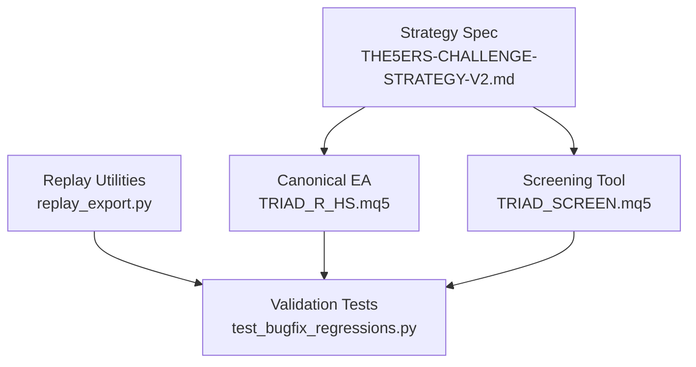
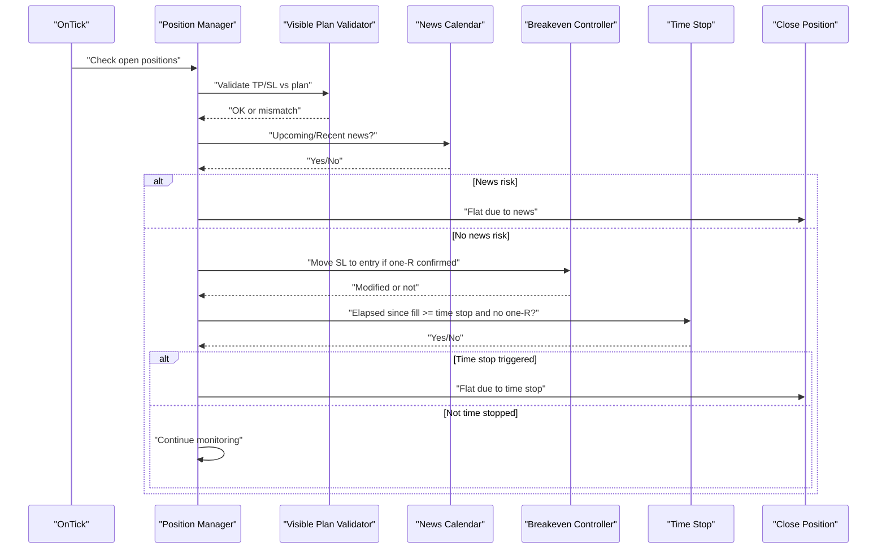
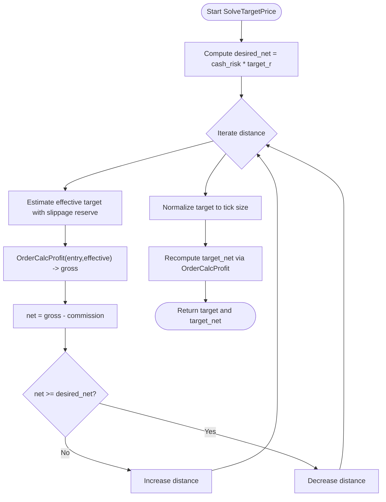
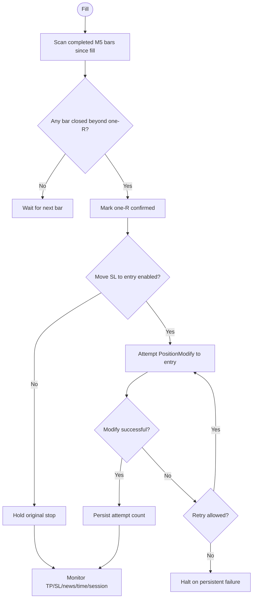
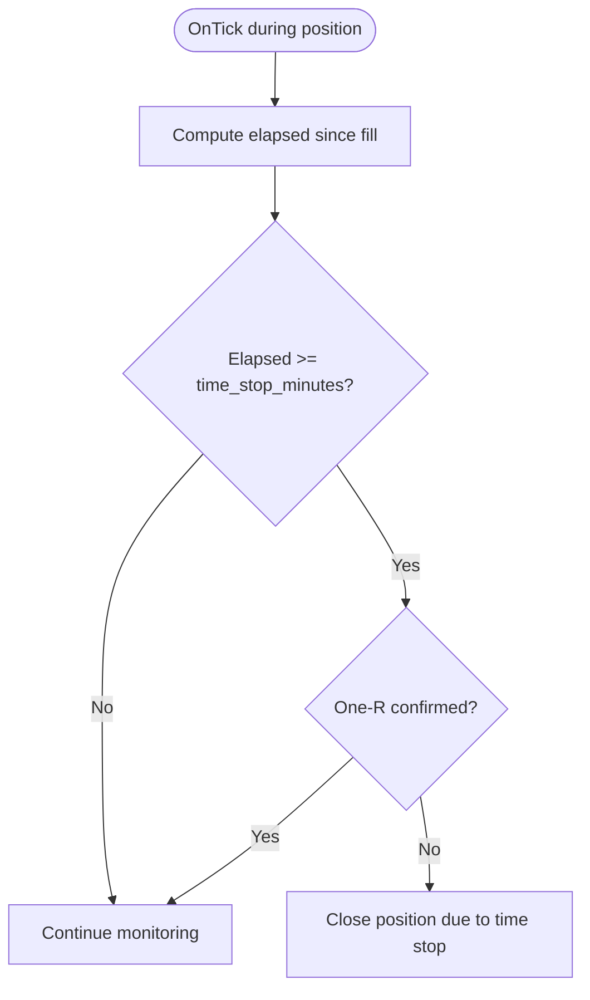
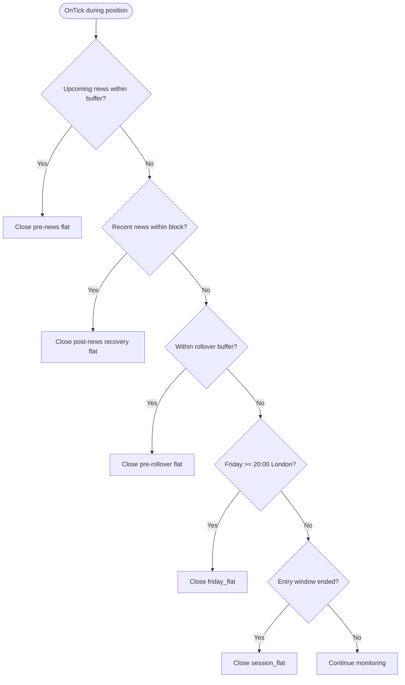
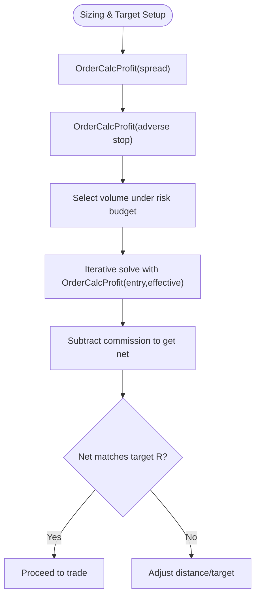
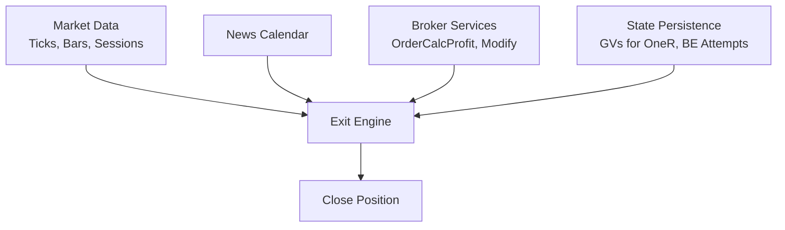

# Exit Engine

<cite>
**Referenced Files in This Document**
- [TRIAD_R_HS.mq5](file://MQL5/Experts/TRIAD_R_HS/TRIAD_R_HS.mq5)
- [TRIAD_SCREEN.mq5](file://MQL5/Experts/TRIAD_SCREEN/TRIAD_SCREEN.mq5)
- [THE5ERS-CHALLENGE-STRATEGY-V2.md](file://THE5ERS-CHALLENGE-STRATEGY-V2.md)
- [replay_export.py](file://tools/replay_export.py)
- [test_bugfix_regressions.py](file://tests/test_bugfix_regressions.py)
</cite>

## Table of Contents
1. Introduction
2. Project Structure
3. Core Components
4. Architecture Overview
5. Detailed Component Analysis
6. Dependency Analysis
7. Performance Considerations
8. Troubleshooting Guide
9. Conclusion
10. Appendices

## Introduction
This document explains the exit engine for the TRIAD-R High Stakes strategy, focusing on take-profit strategies, time stops, and forced-flat rules. It documents the champion baseline exit model with a fixed +1.5R target, +1R confirmation requirements using completed M5 candle closes, and a 45-minute time stop after confirmed fill. It also details how estimated net target profit is computed using OrderCalcProfit to ensure the configured target R is met after expected commission and slippage allowances, and it explains breakeven policy options and all forced-flat rules including rollover buffers, news event exits, Friday cutoff, and weekend restrictions. Finally, it provides scenario-based examples and rationale for each exit condition.

## Project Structure
The exit engine logic is implemented primarily in the canonical EA and mirrored in the screening tool:
- Canonical production EA: TRIAD_R_HS.mq5
- Screening tool (faithful port): TRIAD_SCREEN.mq5
- Strategy specification: THE5ERS-CHALLENGE-STRATEGY-V2.md
- Replay/export utilities used by backtests and validation: replay_export.py
- Regression tests that enforce internal consistency across exit paths: test_bugfix_regressions.py

**Diagram sources**
- [THE5ERS-CHALLENGE-STRATEGY-V2.md:150-182](file://THE5ERS-CHALLENGE-STRATEGY-V2.md#L150-L182)
- [TRIAD_R_HS.mq5:2273-2309](file://MQL5/Experts/TRIAD_R_HS/TRIAD_R_HS.mq5#L2273-L2309)
- [TRIAD_SCREEN.mq5:1574-1600](file://MQL5/Experts/TRIAD_SCREEN/TRIAD_SCREEN.mq5#L1574-L1600)
- [replay_export.py:679-708](file://tools/replay_export.py#L679-L708)
- [test_bugfix_regressions.py:140-183](file://tests/test_bugfix_regressions.py#L140-L183)

**Section sources**
- [THE5ERS-CHALLENGE-STRATEGY-V2.md:150-182](file://THE5ERS-CHALLENGE-STRATEGY-V2.md#L150-L182)
- [TRIAD_R_HS.mq5:2273-2309](file://MQL5/Experts/TRIAD_R_HS/TRIAD_R_HS.mq5#L2273-L2309)
- [TRIAD_SCREEN.mq5:1574-1600](file://MQL5/Experts/TRIAD_SCREEN/TRIAD_SCREEN.mq5#L1574-L1600)
- [replay_export.py:679-708](file://tools/replay_export.py#L679-L708)
- [test_bugfix_regressions.py:140-183](file://tests/test_bugfix_regressions.py#L140-L183)

## Core Components
- Target solver: Computes a take-profit price so that estimated net profit equals the configured target R after commission and target-side slippage allowance.
- One-R confirmation: Detects a completed M5 close beyond the one-R level; used to gate breakeven moves and time-stop behavior.
- Breakeven policy: Optionally moves broker-visible stop to entry after confirmed one-R, subject to persistence and retry limits.
- Time stop: Exits if no one-R confirmation within the configured horizon (default 45 minutes).
- Forced-flat rules: Pre-news flat, post-news recovery flat, pre-rollover flat, Friday cutoff, session end, and weekend restriction.

Key implementation references:
- Target solver uses iterative binary search with OrderCalcProfit to match desired net R and applies target-side slippage reserve before normalization.
- One-R confirmation scans completed M5 bars since fill to detect a closing touch at or beyond the one-R price.
- Breakeven move attempts are persisted and retried once on transient failures; persistent failures halt safely.
- Time stop checks elapsed time since fill and requires one-R confirmation to be absent.
- Forced-flat checks include upcoming news, recent news, rollover boundary, Friday cutoff, and session end.

**Section sources**
- [TRIAD_R_HS.mq5:2273-2309](file://MQL5/Experts/TRIAD_R_HS/TRIAD_R_HS.mq5#L2273-L2309)
- [TRIAD_R_HS.mq5:1098-1123](file://MQL5/Experts/TRIAD_R_HS/TRIAD_R_HS.mq5#L1098-L1123)
- [TRIAD_R_HS.mq5:3132-3283](file://MQL5/Experts/TRIAD_R_HS/TRIAD_R_HS.mq5#L3132-L3283)
- [TRIAD_SCREEN.mq5:1574-1600](file://MQL5/Experts/TRIAD_SCREEN/TRIAD_SCREEN.mq5#L1574-L1600)
- [TRIAD_SCREEN.mq5:2573-2638](file://MQL5/Experts/TRIAD_SCREEN/TRIAD_SCREEN.mq5#L2573-L2638)
- [THE5ERS-CHALLENGE-STRATEGY-V2.md:150-182](file://THE5ERS-CHALLENGE-STRATEGY-V2.md#L150-L182)

## Architecture Overview
The exit engine runs as part of the position management loop. On each tick, it validates visible plan alignment, enforces forced-flat conditions, manages breakeven moves after one-R confirmation, and applies time-stop and session boundaries.

**Diagram sources**
- [TRIAD_R_HS.mq5:3132-3283](file://MQL5/Experts/TRIAD_R_HS/TRIAD_R_HS.mq5#L3132-L3283)
- [TRIAD_SCREEN.mq5:2573-2638](file://MQL5/Experts/TRIAD_SCREEN/TRIAD_SCREEN.mq5#L2573-L2638)

**Section sources**
- [TRIAD_R_HS.mq5:3132-3283](file://MQL5/Experts/TRIAD_R_HS/TRIAD_R_HS.mq5#L3132-L3283)
- [TRIAD_SCREEN.mq5:2573-2638](file://MQL5/Experts/TRIAD_SCREEN/TRIAD_SCREEN.mq5#L2573-L2638)

## Detailed Component Analysis

### Take-Profit Solver and Net Target R
- The solver computes a target price such that the estimated net profit equals the configured target R after subtracting round-trip commission and accounting for target-side slippage reserve.
- It uses an iterative approach over distance from entry, calling OrderCalcProfit for gross profit and then subtracting commission to obtain net profit.
- After solving, the target is normalized to tick size and re-evaluated to compute target_net consistently.

**Diagram sources**
- [TRIAD_R_HS.mq5:2273-2309](file://MQL5/Experts/TRIAD_R_HS/TRIAD_R_HS.mq5#L2273-L2309)
- [TRIAD_SCREEN.mq5:1574-1600](file://MQL5/Experts/TRIAD_SCREEN/TRIAD_SCREEN.mq5#L1574-L1600)

**Section sources**
- [TRIAD_R_HS.mq5:2273-2309](file://MQL5/Experts/TRIAD_R_HS/TRIAD_R_HS.mq5#L2273-L2309)
- [TRIAD_SCREEN.mq5:1574-1600](file://MQL5/Experts/TRIAD_SCREEN/TRIAD_SCREEN.mq5#L1574-L1600)

### One-R Confirmation and Breakeven Policy
- One-R confirmation is defined as a completed M5 candle close at or beyond the one-R price. The function scans all completed M5 bars since fill to reconstruct missed confirmations after disconnects.
- If enabled, after one-R confirmation the EA attempts to move the broker-visible stop to entry. Persistence and retry logic guard against transient failures; persistent failures halt safely.
- Visible plan validation ensures the stop is either the original plan stop or a confirmed breakeven move; mismatches trigger immediate closure and halt.

**Diagram sources**
- [TRIAD_R_HS.mq5:1098-1123](file://MQL5/Experts/TRIAD_R_HS/TRIAD_R_HS.mq5#L1098-L1123)
- [TRIAD_R_HS.mq5:3132-3283](file://MQL5/Experts/TRIAD_R_HS/TRIAD_R_HS.mq5#L3132-L3283)
- [TRIAD_SCREEN.mq5:2573-2638](file://MQL5/Experts/TRIAD_SCREEN/TRIAD_SCREEN.mq5#L2573-L2638)

**Section sources**
- [TRIAD_R_HS.mq5:1098-1123](file://MQL5/Experts/TRIAD_R_HS/TRIAD_R_HS.mq5#L1098-L1123)
- [TRIAD_R_HS.mq5:3132-3283](file://MQL5/Experts/TRIAD_R_HS/TRIAD_R_HS.mq5#L3132-L3283)
- [TRIAD_SCREEN.mq5:2573-2638](file://MQL5/Experts/TRIAD_SCREEN/TRIAD_SCREEN.mq5#L2573-L2638)

### Time Stop Logic
- The time stop triggers when the elapsed time since confirmed fill exceeds the configured horizon (default 45 minutes) and one-R has not been confirmed.
- The check occurs after other forced-flat validations and before session-end enforcement.

**Diagram sources**
- [TRIAD_R_HS.mq5:3279-3283](file://MQL5/Experts/TRIAD_R_HS/TRIAD_R_HS.mq5#L3279-L3283)
- [TRIAD_SCREEN.mq5:2644-2644](file://MQL5/Experts/TRIAD_SCREEN/TRIAD_SCREEN.mq5#L2644-L2644)

**Section sources**
- [TRIAD_R_HS.mq5:3279-3283](file://MQL5/Experts/TRIAD_R_HS/TRIAD_R_HS.mq5#L3279-L3283)
- [TRIAD_SCREEN.mq5:2644-2644](file://MQL5/Experts/TRIAD_SCREEN/TRIAD_SCREEN.mq5#L2644-L2644)

### Forced-Flat Rules
- Pre-news flat: Close before relevant red events within the configured buffer window.
- Post-news recovery flat: Close after recent relevant events to avoid early recovery volatility.
- Pre-rollover flat: Close at least 15 minutes before confirmed MT5 server rollover.
- Friday cutoff: Flat by Friday 20:00 Europe/London or earlier if the symbol closes earlier.
- Session end: Close at the session hard stop when the entry window ends.
- Weekend restriction: No exposure across the weekend enforced via Friday cutoff and session boundaries.

**Diagram sources**
- [TRIAD_R_HS.mq5:3144-3183](file://MQL5/Experts/TRIAD_R_HS/TRIAD_R_HS.mq5#L3144-L3183)
- [TRIAD_SCREEN.mq5:2586-2623](file://MQL5/Experts/TRIAD_SCREEN/TRIAD_SCREEN.mq5#L2586-L2623)
- [THE5ERS-CHALLENGE-STRATEGY-V2.md:174-182](file://THE5ERS-CHALLENGE-STRATEGY-V2.md#L174-L182)

**Section sources**
- [TRIAD_R_HS.mq5:3144-3183](file://MQL5/Experts/TRIAD_R_HS/TRIAD_R_HS.mq5#L3144-L3183)
- [TRIAD_SCREEN.mq5:2586-2623](file://MQL5/Experts/TRIAD_SCREEN/TRIAD_SCREEN.mq5#L2586-L2623)
- [THE5ERS-CHALLENGE-STRATEGY-V2.md:174-182](file://THE5ERS-CHALLENGE-STRATEGY-V2.md#L174-L182)

### Exit Calculation Methodology Using OrderCalcProfit
- Cost-to-R and volume sizing use OrderCalcProfit to measure spread cost, adverse slippage reserve, and base stop loss in cash terms.
- Target solver uses OrderCalcProfit iteratively to find a price where net profit equals target R after commission and target-side slippage reserve.
- Consistency checks ensure that realized outcomes align with planned R values across exit paths.

**Diagram sources**
- [TRIAD_R_HS.mq5:2172-2233](file://MQL5/Experts/TRIAD_R_HS/TRIAD_R_HS.mq5#L2172-L2233)
- [TRIAD_R_HS.mq5:2273-2309](file://MQL5/Experts/TRIAD_R_HS/TRIAD_R_HS.mq5#L2273-L2309)
- [test_bugfix_regressions.py:140-183](file://tests/test_bugfix_regressions.py#L140-L183)

**Section sources**
- [TRIAD_R_HS.mq5:2172-2233](file://MQL5/Experts/TRIAD_R_HS/TRIAD_R_HS.mq5#L2172-L2233)
- [TRIAD_R_HS.mq5:2273-2309](file://MQL5/Experts/TRIAD_R_HS/TRIAD_R_HS.mq5#L2273-L2309)
- [test_bugfix_regressions.py:140-183](file://tests/test_bugfix_regressions.py#L140-L183)

### Scenario Examples and Rationale
- Target hit before one-R confirmation: Exit at take-profit; no breakeven move attempted because one-R was not confirmed. Rationale: preserve upside while respecting plan.
- One-R confirmed then time stop expires without further progress: Exit at market due to time stop. Rationale: limit holding period and reduce exposure to reversal risk.
- One-R confirmed then breakeven move succeeds: Stop moved to entry; subsequent stop-out returns near break-even minus costs. Rationale: protect capital after favorable move.
- News event approaches during holding: Exit before event to avoid unpredictable volatility. Rationale: compliance with news blackout and risk control.
- Approaching rollover: Exit before rollover buffer to avoid overnight swap and gap risk. Rationale: firm rule adherence and predictable daily accounting.
- Friday afternoon: Exit by cutoff to avoid weekend exposure. Rationale: prevent unintended weekend risk and simplify reconciliation.

These scenarios reflect the prioritized order of checks in the exit engine: visible plan validation, news checks, rollover buffer, Friday cutoff, session end, breakeven movement, and time stop.

**Section sources**
- [TRIAD_R_HS.mq5:3132-3283](file://MQL5/Experts/TRIAD_R_HS/TRIAD_R_HS.mq5#L3132-L3283)
- [TRIAD_SCREEN.mq5:2573-2638](file://MQL5/Experts/TRIAD_SCREEN/TRIAD_SCREEN.mq5#L2573-L2638)
- [THE5ERS-CHALLENGE-STRATEGY-V2.md:150-182](file://THE5ERS-CHALLENGE-STRATEGY-V2.md#L150-L182)

## Dependency Analysis
Exit engine components depend on:
- Market data: ticks, M5 bars, session bounds, calendar events.
- Broker services: OrderCalcProfit, PositionModify, trade request rate limiting.
- State persistence: global variables for one-R confirmation, breakeven attempts, and expected levels.
- Validation utilities: price matching, normalization, and safety lead times.

**Diagram sources**
- [TRIAD_R_HS.mq5:3132-3283](file://MQL5/Experts/TRIAD_R_HS/TRIAD_R_HS.mq5#L3132-L3283)
- [TRIAD_R_HS.mq5:2172-2233](file://MQL5/Experts/TRIAD_R_HS/TRIAD_R_HS.mq5#L2172-L2233)
- [TRIAD_R_HS.mq5:1098-1123](file://MQL5/Experts/TRIAD_R_HS/TRIAD_R_HS.mq5#L1098-L1123)

**Section sources**
- [TRIAD_R_HS.mq5:3132-3283](file://MQL5/Experts/TRIAD_R_HS/TRIAD_R_HS.mq5#L3132-L3283)
- [TRIAD_R_HS.mq5:2172-2233](file://MQL5/Experts/TRIAD_R_HS/TRIAD_R_HS.mq5#L2172-L2233)
- [TRIAD_R_HS.mq5:1098-1123](file://MQL5/Experts/TRIAD_R_HS/TRIAD_R_HS.mq5#L1098-L1123)

## Performance Considerations
- Iterative target solving is bounded (fixed iteration count), minimizing CPU usage per tick.
- One-R confirmation scans only completed M5 bars since fill, avoiding excessive history reads.
- Rate limiting on non-emergency requests prevents overload; emergency actions bypass caps.
- Slippage and commission assumptions are conservative; target solver accounts for them to maintain net R targets.

[No sources needed since this section provides general guidance]

## Troubleshooting Guide
Common issues and resolutions:
- Missing visible stop or target: Immediate close and halt; repair attempts may restore plan if safe.
- Breakeven modify failed: Persistent failures halt; transient failures allow one retry.
- One-R confirmation state persistence failure: Close and halt to prevent unsafe state drift.
- News calendar unavailable: Fail closed; new entries disabled until coverage is restored.
- Missed rollover exposure: Halt and require state migration; ensure positions are flat before rollover.

**Section sources**
- [TRIAD_R_HS.mq5:3105-3142](file://MQL5/Experts/TRIAD_R_HS/TRIAD_R_HS.mq5#L3105-L3142)
- [TRIAD_R_HS.mq5:3220-3283](file://MQL5/Experts/TRIAD_R_HS/TRIAD_R_HS.mq5#L3220-L3283)
- [TRIAD_R_HS.mq5:3400-3418](file://MQL5/Experts/TRIAD_R_HS/TRIAD_R_HS.mq5#L3400-L3418)

## Conclusion
The exit engine implements a disciplined, rule-based approach to exiting trades: a fixed +1.5R target solved via OrderCalcProfit to guarantee net target R after costs, one-R confirmation gating breakeven moves and time-stop behavior, and robust forced-flat rules protecting against news, rollover, Friday cutoff, and weekend exposure. The design emphasizes safety, transparency, and reproducibility, with clear validation and persistence mechanisms to ensure consistent operation across restarts and disconnections.

[No sources needed since this section summarizes without analyzing specific files]

## Appendices
- Champion baseline parameters:
  - Target: +1.5R
  - One-R confirmation: Completed M5 close beyond one-R
  - Time stop: 45 minutes after confirmed fill if one-R not confirmed
  - Breakeven policy: Optional move to entry after one-R confirmation
  - Forced-flat: Pre-news, post-news, pre-rollover (15 minutes), Friday 20:00 Europe/London, session end

**Section sources**
- [THE5ERS-CHALLENGE-STRATEGY-V2.md:150-182](file://THE5ERS-CHALLENGE-STRATEGY-V2.md#L150-L182)
- [TRIAD_R_HS.mq5:113-114](file://MQL5/Experts/TRIAD_R_HS/TRIAD_R_HS.mq5#L113-L114)
- [TRIAD_R_HS.mq5:3144-3183](file://MQL5/Experts/TRIAD_R_HS/TRIAD_R_HS.mq5#L3144-L3183)
- [TRIAD_R_HS.mq5:3279-3283](file://MQL5/Experts/TRIAD_R_HS/TRIAD_R_HS.mq5#L3279-L3283)