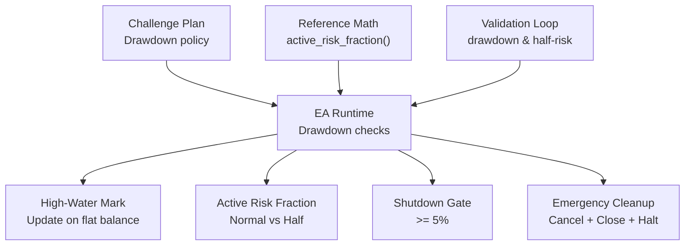
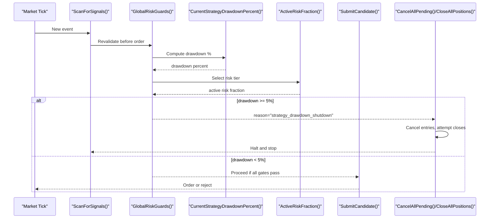
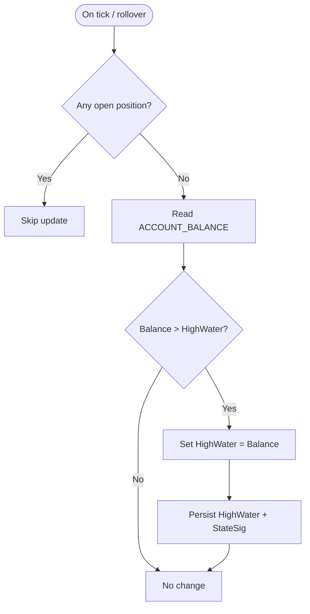
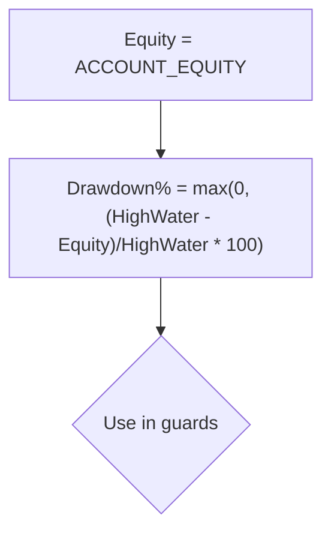
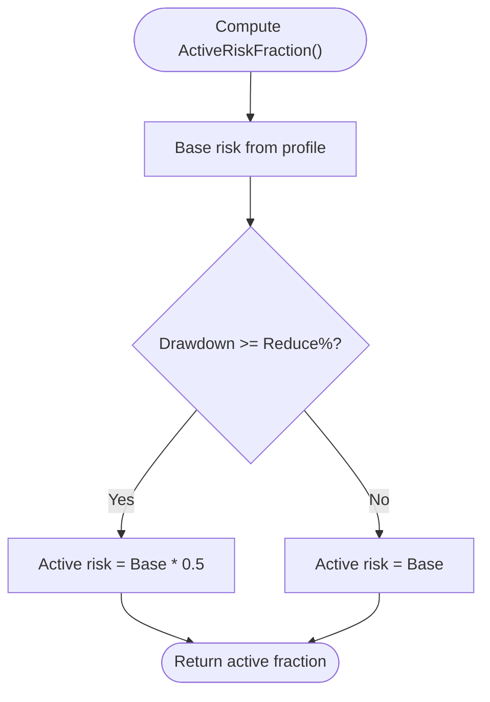
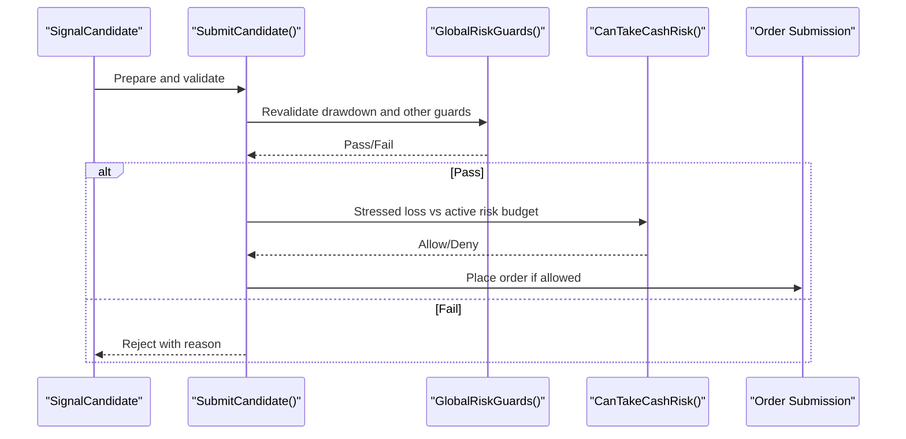
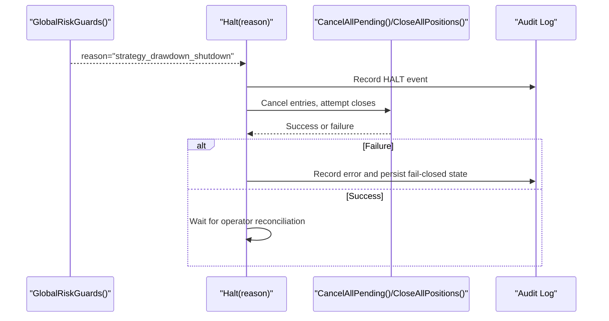
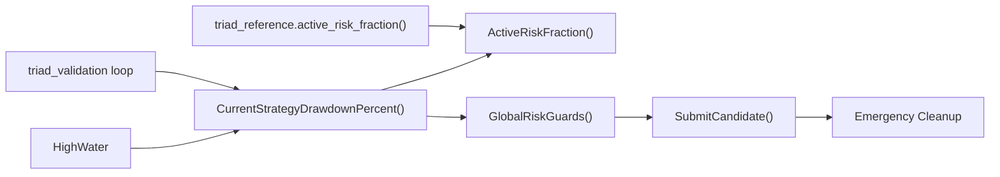

# Drawdown Throttle System

<cite>
**Referenced Files in This Document**
- [TRIAD_R_HS.mq5](file://MQL5/Experts/TRIAD_R_HS/TRIAD_R_HS.mq5)
- [triad_reference.py](file://tests/triad_reference.py)
- [triad_validation.py](file://tools/triad_validation.py)
- [THE5ERS-2.5K-CHALLENGE-PLAN.md](file://THE5ERS-2.5K-CHALLENGE-PLAN.md)
</cite>

## Table of Contents
1. Introduction
2. Project Structure
3. Core Components
4. Architecture Overview
5. Detailed Component Analysis
6. Dependency Analysis
7. Performance Considerations
8. Troubleshooting Guide
9. Conclusion

## Introduction
This document explains the drawdown throttle system that enforces tiered risk management before every new order. It covers how the high-water mark is maintained, how current strategy drawdown is measured from that high-water mark to current equity including open losses, and how three tiers respond: normal risk at low drawdown, reduced risk at moderate drawdown, and emergency halt at severe drawdown. It also documents the emergency protocol for canceling entries, attempting to close open positions, halting operations, and requiring reconciliation and revalidation before any future release. Finally, it explains why 5% is treated as an absolute internal emergency boundary and operational reserve limit.

## Project Structure
The drawdown throttle spans configuration, runtime checks, and emergency cleanup logic within the MQL5 expert advisor, with reference implementations and validation utilities in Python. The plan document defines the policy intent and thresholds used by the implementation.

**Diagram sources**
- [TRIAD_R_HS.mq5:1621-1658](file://MQL5/Experts/TRIAD_R_HS/TRIAD_R_HS.mq5#L1621-L1658)
- [TRIAD_R_HS.mq5:3516-3529](file://MQL5/Experts/TRIAD_R_HS/TRIAD_R_HS.mq5#L3516-L3529)
- [triad_reference.py:68-75](file://tests/triad_reference.py#L68-L75)
- [triad_validation.py:1019-1039](file://tools/triad_validation.py#L1019-L1039)
- [THE5ERS-2.5K-CHALLENGE-PLAN.md:189-203](file://THE5ERS-2.5K-CHALLENGE-PLAN.md#L189-L203)

**Section sources**
- [TRIAD_R_HS.mq5:137-140](file://MQL5/Experts/TRIAD_R_HS/TRIAD_R_HS.mq5#L137-L140)
- [THE5ERS-2.5K-CHALLENGE-PLAN.md:189-203](file://THE5ERS-2.5K-CHALLENGE-PLAN.md#L189-L203)

## Core Components
- High-water mark maintenance: updated only when the account is flat (no exposure), ensuring the reference peak reflects closed-balance performance.
- Strategy drawdown measurement: computed from the high-water mark to current equity, which includes floating P&L and open losses.
- Tiered risk response:
  - 0–2% drawdown: full base risk per profile.
  - 2–5% drawdown: risk reduced to 50% of base; same entry/target-R policy applies.
  - ≥5% drawdown: emergency shutdown; no active fraction; halt persists until reconciliation.
- Pre-order continuous monitoring: every candidate submission revalidates drawdown and other guards before execution.
- Emergency protocol: cancels pending entries, attempts to close open positions, logs failures, and halts with a persisted latch requiring formal revalidation.

**Section sources**
- [TRIAD_R_HS.mq5:1621-1658](file://MQL5/Experts/TRIAD_R_HS/TRIAD_R_HS.mq5#L1621-L1658)
- [TRIAD_R_HS.mq5:1835-1839](file://MQL5/Experts/TRIAD_R_HS/TRIAD_R_HS.mq5#L1835-L1839)
- [TRIAD_R_HS.mq5:3516-3529](file://MQL5/Experts/TRIAD_R_HS/TRIAD_R_HS.mq5#L3516-L3529)
- [triad_reference.py:68-75](file://tests/triad_reference.py#L68-L75)
- [THE5ERS-2.5K-CHALLENGE-PLAN.md:189-203](file://THE5ERS-2.5K-CHALLENGE-PLAN.md#L189-L203)

## Architecture Overview
The drawdown throttle integrates into the signal pipeline. Before any order is submitted, the system:
- Computes current strategy drawdown from the high-water mark to current equity.
- Selects the active risk fraction based on drawdown tiers.
- Projects whether the trade would breach internal or firm floors.
- If drawdown reaches the emergency threshold, triggers a hard halt and begins emergency cleanup.

**Diagram sources**
- [TRIAD_R_HS.mq5:1621-1658](file://MQL5/Experts/TRIAD_R_HS/TRIAD_R_HS.mq5#L1621-L1658)
- [TRIAD_R_HS.mq5:1835-1839](file://MQL5/Experts/TRIAD_R_HS/TRIAD_R_HS.mq5#L1835-L1839)
- [TRIAD_R_HS.mq5:2672-2690](file://MQL5/Experts/TRIAD_R_HS/TRIAD_R_HS.mq5#L2672-L2690)
- [TRIAD_R_HS.mq5:2978-2985](file://MQL5/Experts/TRIAD_R_HS/TRIAD_R_HS.mq5#L2978-L2985)

## Detailed Component Analysis

### High-Water Mark Calculation
- The high-water mark tracks the highest closed balance observed while the account is flat. It is updated only when there is no open exposure, preventing floating losses from artificially lowering the reference peak.
- On each update, the value is persisted and included in the account state signature so restarts cannot silently drift the reference.

**Diagram sources**
- [TRIAD_R_HS.mq5:3516-3529](file://MQL5/Experts/TRIAD_R_HS/TRIAD_R_HS.mq5#L3516-L3529)
- [TRIAD_R_HS.mq5:568-600](file://MQL5/Experts/TRIAD_R_HS/TRIAD_R_HS.mq5#L568-L600)

**Section sources**
- [TRIAD_R_HS.mq5:3516-3529](file://MQL5/Experts/TRIAD_R_HS/TRIAD_R_HS.mq5#L3516-L3529)
- [TRIAD_R_HS.mq5:568-600](file://MQL5/Experts/TRIAD_R_HS/TRIAD_R_HS.mq5#L568-L600)

### Strategy Drawdown Measurement
- Current strategy drawdown is calculated as the percentage drop from the high-water mark to current equity. Equity includes open P&L, so drawdown reflects both realized and unrealized losses.
- This measure drives both risk reduction and shutdown decisions.

**Diagram sources**
- [TRIAD_R_HS.mq5:1621-1626](file://MQL5/Experts/TRIAD_R_HS/TRIAD_R_HS.mq5#L1621-L1626)

**Section sources**
- [TRIAD_R_HS.mq5:1621-1626](file://MQL5/Experts/TRIAD_R_HS/TRIAD_R_HS.mq5#L1621-L1626)

### Tiered Risk Response
- Base risk is selected by profile (e.g., 0.40% for Profile A).
- If drawdown is at or above the reduce threshold, active risk becomes 50% of base.
- If drawdown reaches or exceeds the shutdown threshold, trading stops entirely.

**Diagram sources**
- [TRIAD_R_HS.mq5:1628-1658](file://MQL5/Experts/TRIAD_R_HS/TRIAD_R_HS.mq5#L1628-L1658)
- [triad_reference.py:68-75](file://tests/triad_reference.py#L68-L75)

**Section sources**
- [TRIAD_R_HS.mq5:1628-1658](file://MQL5/Experts/TRIAD_R_HS/TRIAD_R_HS.mq5#L1628-L1658)
- [triad_reference.py:68-75](file://tests/triad_reference.py#L68-L75)

### Continuous Monitoring Before Every Order
- Each candidate goes through a final revalidation path that rechecks environment, news, costs, margins, daily state, global risk guards, and cash risk budget.
- Global risk guards include the drawdown shutdown gate and phase target completion.

**Diagram sources**
- [TRIAD_R_HS.mq5:2692-2780](file://MQL5/Experts/TRIAD_R_HS/TRIAD_R_HS.mq5#L2692-L2780)
- [TRIAD_R_HS.mq5:1835-1845](file://MQL5/Experts/TRIAD_R_HS/TRIAD_R_HS.mq5#L1835-L1845)

**Section sources**
- [TRIAD_R_HS.mq5:2692-2780](file://MQL5/Experts/TRIAD_R_HS/TRIAD_R_HS.mq5#L2692-L2780)
- [TRIAD_R_HS.mq5:1835-1845](file://MQL5/Experts/TRIAD_R_HS/TRIAD_R_HS.mq5#L1835-L1845)

### Emergency Protocol
When drawdown reaches or exceeds the emergency threshold:
- The system sets a persistent halt latch with a reason hash bound to configuration and identity.
- It cancels all pending entries and attempts to close all open positions.
- Any failure during emergency cleanup escalates to a halt to prevent residual exposure.
- Resuming requires explicit reconciliation and revalidation; calendar-based daily/weekly stops are not sufficient to resume after non-calendar guard failures.

**Diagram sources**
- [TRIAD_R_HS.mq5:329-350](file://MQL5/Experts/TRIAD_R_HS/TRIAD_R_HS.mq5#L329-L350)
- [TRIAD_R_HS.mq5:2672-2690](file://MQL5/Experts/TRIAD_R_HS/TRIAD_R_HS.mq5#L2672-L2690)
- [TRIAD_R_HS.mq5:2978-2985](file://MQL5/Experts/TRIAD_R_HS/TRIAD_R_HS.mq5#L2978-L2985)

**Section sources**
- [TRIAD_R_HS.mq5:329-350](file://MQL5/Experts/TRIAD_R_HS/TRIAD_R_HS.mq5#L329-L350)
- [TRIAD_R_HS.mq5:2672-2690](file://MQL5/Experts/TRIAD_R_HS/TRIAD_R_HS.mq5#L2672-L2690)
- [TRIAD_R_HS.mq5:2978-2985](file://MQL5/Experts/TRIAD_R_HS/TRIAD_R_HS.mq5#L2978-L2985)

### Why 5% Is the Absolute Internal Emergency Boundary
- The 5% threshold is enforced as a hard shutdown, independent of firm limits. It preserves a buffer above the firm’s termination floor, leaving room for slippage and mistakes without using recovery capital.
- At this level, the system treats further trading as unacceptable risk and requires formal revalidation before any future operation can resume.

**Section sources**
- [THE5ERS-2.5K-CHALLENGE-PLAN.md:189-203](file://THE5ERS-2.5K-CHALLENGE-PLAN.md#L189-L203)
- [triad_reference.py:68-75](file://tests/triad_reference.py#L68-L75)
- [TRIAD_R_HS.mq5:1835-1839](file://MQL5/Experts/TRIAD_R_HS/TRIAD_R_HS.mq5#L1835-L1839)

### Examples of Drawdown Calculations and Decision Logic
- Example states:
  - Flat account with high-water $2,500 and equity $2,450: drawdown ≈ 2.0%. Action: reduce risk to 50% of base.
  - Flat account with high-water $2,500 and equity $2,375: drawdown ≈ 5.0%. Action: emergency halt; cancel entries; attempt to close positions; halt persists.
  - Flat account with high-water $2,500 and equity $2,475: drawdown ≈ 1.0%. Action: maintain full base risk.
- These examples align with the tiered policy and the implementation’s thresholds.

**Section sources**
- [THE5ERS-2.5K-CHALLENGE-PLAN.md:189-203](file://THE5ERS-2.5K-CHALLENGE-PLAN.md#L189-L203)
- [triad_reference.py:68-75](file://tests/triad_reference.py#L68-L75)
- [TRIAD_R_HS.mq5:1621-1658](file://MQL5/Experts/TRIAD_R_HS/TRIAD_R_HS.mq5#L1621-L1658)

## Dependency Analysis
The drawdown throttle depends on:
- High-water mark persistence and state signatures to ensure consistent references across restarts.
- Global risk guards to enforce drawdown shutdown alongside firm floors and daily/weekly stops.
- Candidate submission pipeline to revalidate conditions immediately before execution.
- Reference math and validation loops to mirror behavior in tests and simulations.

**Diagram sources**
- [TRIAD_R_HS.mq5:1621-1658](file://MQL5/Experts/TRIAD_R_HS/TRIAD_R_HS.mq5#L1621-L1658)
- [TRIAD_R_HS.mq5:1835-1839](file://MQL5/Experts/TRIAD_R_HS/TRIAD_R_HS.mq5#L1835-L1839)
- [triad_reference.py:68-75](file://tests/triad_reference.py#L68-L75)
- [triad_validation.py:1019-1039](file://tools/triad_validation.py#L1019-L1039)

**Section sources**
- [TRIAD_R_HS.mq5:1621-1658](file://MQL5/Experts/TRIAD_R_HS/TRIAD_R_HS.mq5#L1621-L1658)
- [triad_reference.py:68-75](file://tests/triad_reference.py#L68-L75)
- [triad_validation.py:1019-1039](file://tools/triad_validation.py#L1019-L1039)

## Performance Considerations
- Drawdown checks are lightweight computations performed frequently but do not incur heavy I/O.
- High-water updates occur only when flat, minimizing unnecessary writes.
- Emergency cleanup uses per-ticket throttling to avoid request storms while ensuring rapid risk reduction.

[No sources needed since this section provides general guidance]

## Troubleshooting Guide
Common issues and their indicators:
- Persistent halt after drawdown shutdown: check halt latch and reason hash; require reconciliation before resuming.
- Emergency order delete or close failures: these escalate to halt to prevent residual exposure; review audit log for retcodes and descriptions.
- State signature mismatch: indicates partial or stale persisted state; system will refuse to run until corrected.

**Section sources**
- [TRIAD_R_HS.mq5:329-350](file://MQL5/Experts/TRIAD_R_HS/TRIAD_R_HS.mq5#L329-L350)
- [TRIAD_R_HS.mq5:2601-2690](file://MQL5/Experts/TRIAD_R_HS/TRIAD_R_HS.mq5#L2601-L2690)
- [TRIAD_R_HS.mq5:1738-1762](file://MQL5/Experts/TRIAD_R_HS/TRIAD_R_HS.mq5#L1738-L1762)

## Conclusion
The drawdown throttle system protects accounts by continuously measuring drawdown from a robust high-water mark and responding with tiered risk controls. Normal risk applies below the reduce threshold, half risk applies between reduce and shutdown thresholds, and a hard halt triggers at the emergency boundary. The emergency protocol ensures immediate cancellation and closure attempts, persistent halting, and mandatory reconciliation. The 5% threshold serves as an absolute internal boundary, preserving operational reserve and preventing recovery trading under stress.

[No sources needed since this section summarizes without analyzing specific files]