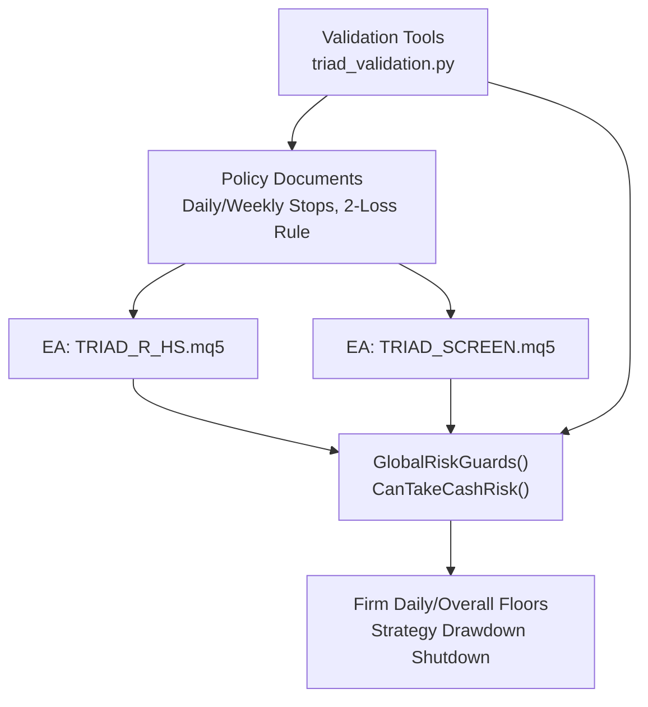
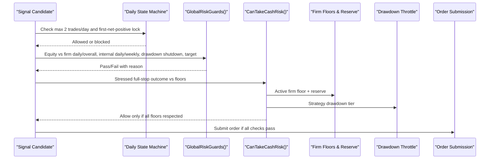
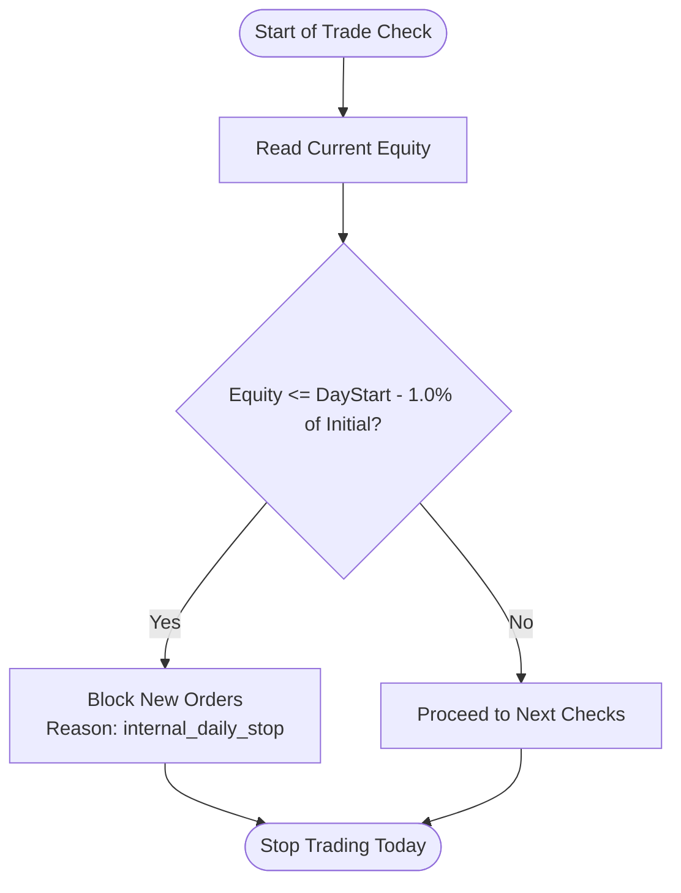
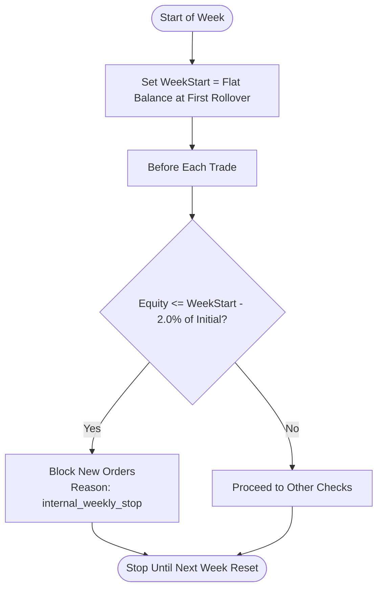
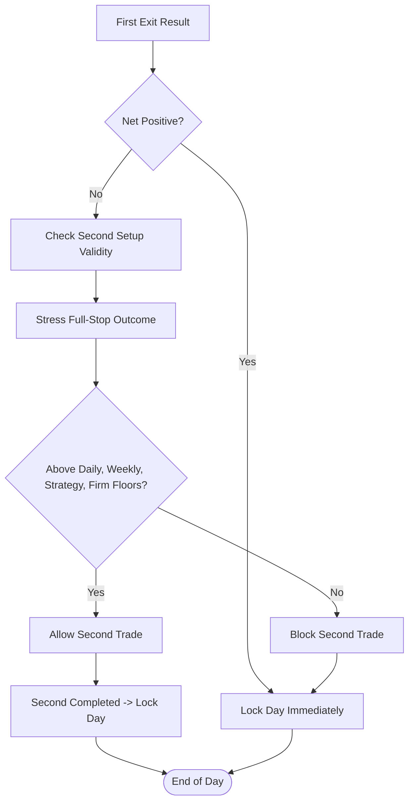
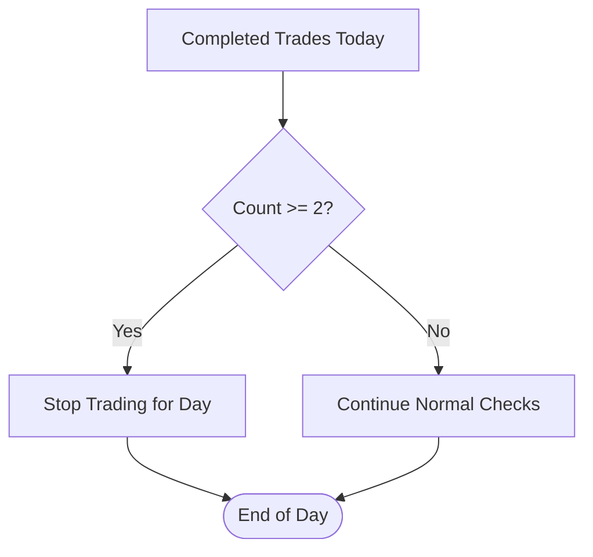
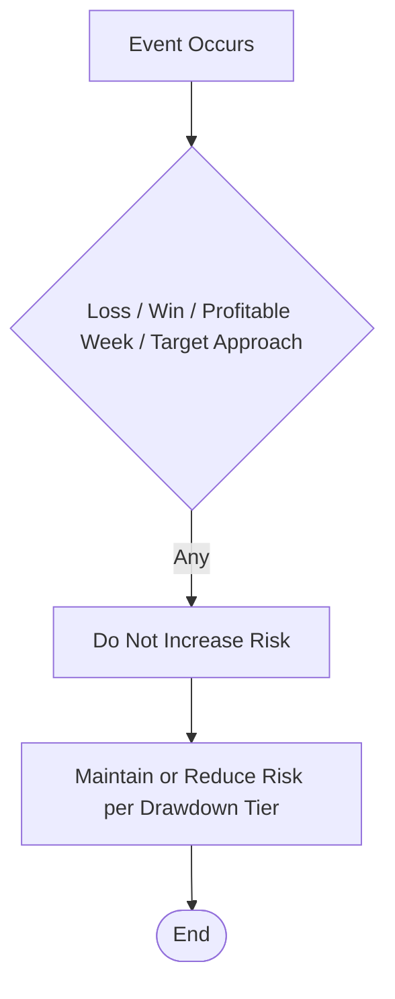
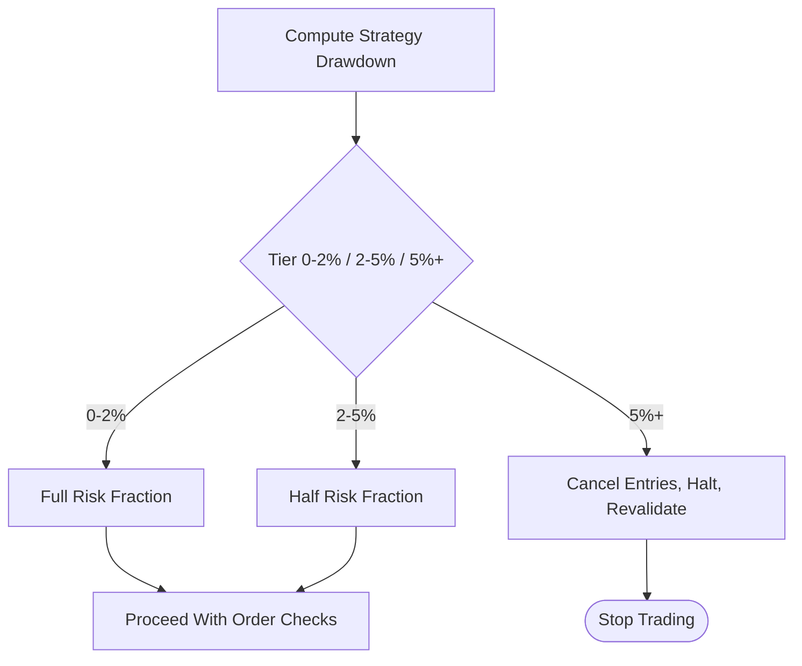
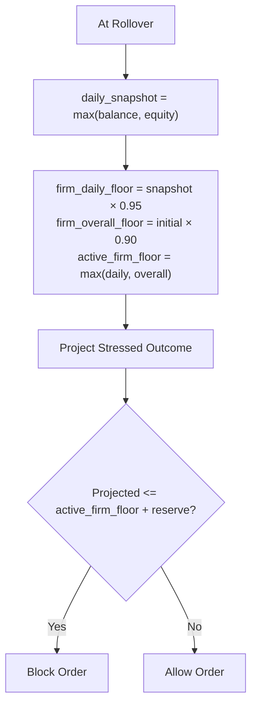
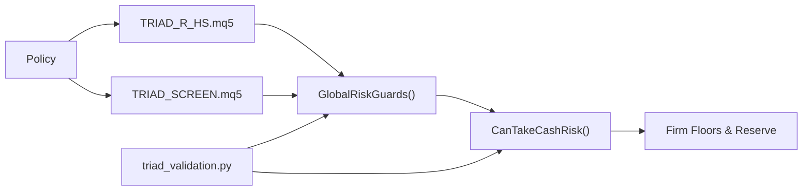

# Loss Governors

<cite>
**Referenced Files in This Document**
- [THE5ERS-CHALLENGE-STRATEGY-V2.md](file://THE5ERS-CHALLENGE-STRATEGY-V2.md)
- [TRIAD_R_HS.mq5](file://MQL5/Experts/TRIAD_R_HS/TRIAD_R_HS.mq5)
- [TRIAD_SCREEN.mq5](file://MQL5/Experts/TRIAD_SCREEN/TRIAD_SCREEN.mq5)
- [triad_validation.py](file://tools/triad_validation.py)
- [test_extended_validation.py](file://tests/test_extended_validation.py)
- [triad_reference.py](file://tests/triad_reference.py)
- [THE5ERS-2.5K-CHALLENGE-PLAN.md](file://THE5ERS-2.5K-CHALLENGE-PLAN.md)
</cite>

## Table of Contents
1. [Introduction](#introduction)
2. [Project Structure](#project-structure)
3. [Core Components](#core-components)
4. [Architecture Overview](#architecture-overview)
5. [Detailed Component Analysis](#detailed-component-analysis)
6. [Dependency Analysis](#dependency-analysis)
7. [Performance Considerations](#performance-considerations)
8. [Troubleshooting Guide](#troubleshooting-guide)
9. [Conclusion](#conclusion)

## Introduction
This document explains the multi-layered loss governor system that protects against excessive drawdown during evaluation and funded operation. It covers:
- Internal daily stop at -1.0% ($25 at inception), measured from the flat server-day starting balance, including closed/floating P&L and costs.
- Internal weekly stop at -2.0% ($50 at inception), measured from the flat balance at the first server rollover of the trading week, including closed/floating P&L and costs.
- Second-trade permission logic requiring a stressed full-stop outcome to remain above daily, weekly, strategy, and firm safety floors.
- Two-full-losses rule that stops trading for the day even if the -1% limit has not been reached.
- Prohibition against risk increases after losses, wins, profitable weeks, or target approaches.
- Examples and decision trees showing when trading is permitted or blocked.
- Interaction with other risk management components such as drawdown throttle and firm-rule protections.

## Project Structure
The loss governors are defined by policy documents and enforced in both MQL5 Expert Advisors and validation tools:
- Policy definitions and operating rules are documented in THE5ERS-CHALLENGE-STRATEGY-V2.md and THE5ERS-2.5K-CHALLENGE-PLAN.md.
- Enforcement logic resides in TRIAD_R_HS.mq5 and TRIAD_SCREEN.mq5 via global risk guards and cash-risk projection checks.
- Validation and simulation utilities in triad_validation.py implement day/week gating, drawdown throttling, and floor checks used to verify behavior under stress and replay.

**Diagram sources**
- [THE5ERS-CHALLENGE-STRATEGY-V2.md:200-218](file://THE5ERS-CHALLENGE-STRATEGY-V2.md#L200-L218)
- [TRIAD_R_HS.mq5:1685-1712](file://MQL5/Experts/TRIAD_R_HS/TRIAD_R_HS.mq5#L1685-L1712)
- [TRIAD_SCREEN.mq5:1977-2017](file://MQL5/Experts/TRIAD_SCREEN/TRIAD_SCREEN.mq5#L1977-L2017)
- [triad_validation.py:1010-1038](file://tools/triad_validation.py#L1010-L1038)

**Section sources**
- [THE5ERS-CHALLENGE-STRATEGY-V2.md:200-218](file://THE5ERS-CHALLENGE-STRATEGY-V2.md#L200-L218)
- [THE5ERS-2.5K-CHALLENGE-PLAN.md:164-188](file://THE5ERS-2.5K-CHALLENGE-PLAN.md#L164-L188)

## Core Components
- Internal daily stop: -1.0% from flat server-day starting balance; includes closed/floating P&L and costs.
- Internal weekly stop: -2.0% from flat balance at first server rollover of the trading week; includes closed/floating P&L and costs.
- Second-trade permission: requires projected stressed full-stop outcome to stay above all floors (daily, weekly, strategy drawdown shutdown, firm).
- Two-full-losses rule: stops trading for the day regardless of whether the -1% internal daily stop was reached.
- Risk increase prohibition: no risk increase after a loss, win, profitable week, or target approach.
- Drawdown throttle: reduces new-trade risk fraction based on current strategy drawdown from high-water mark; shuts down at threshold.
- Firm-rule protections: daily and overall floors computed at rollover; active firm floor plus reserve must not be breached by projected outcomes.

**Section sources**
- [THE5ERS-CHALLENGE-STRATEGY-V2.md:200-218](file://THE5ERS-CHALLENGE-STRATEGY-V2.md#L200-L218)
- [THE5ERS-2.5K-CHALLENGE-PLAN.md:164-188](file://THE5ERS-2.5K-CHALLENGE-PLAN.md#L164-L188)

## Architecture Overview
The system enforces layered protection before any order submission:
- Global risk guards check hard limits (firm floors, internal daily/weekly stops, strategy drawdown shutdown, phase targets).
- Cash-risk projection validates that a trade’s stressed full-stop outcome would not breach any floor.
- Day state machine restricts trades to two per day maximum and locks the day after a net-positive first exit or after two completed trades.
- Validation tools simulate these rules across days/weeks to ensure compliance under stress.

**Diagram sources**
- [TRIAD_SCREEN.mq5:1977-2017](file://MQL5/Experts/TRIAD_SCREEN/TRIAD_SCREEN.mq5#L1977-L2017)
- [TRIAD_R_HS.mq5:1685-1712](file://MQL5/Experts/TRIAD_R_HS/TRIAD_R_HS.mq5#L1685-L1712)
- [triad_validation.py:1010-1038](file://tools/triad_validation.py#L1010-L1038)

## Detailed Component Analysis

### Internal Daily Stop (-1.0%, $25 at inception)
- Measured from the flat server-day starting balance.
- Includes closed P&L, floating P&L, and costs.
- Implemented via equity comparisons against day-start balance minus the internal daily stop percentage of initial balance.
- Triggers immediate halt or block of further entries for the day.

**Diagram sources**
- [TRIAD_SCREEN.mq5:1995-1999](file://MQL5/Experts/TRIAD_SCREEN/TRIAD_SCREEN.mq5#L1995-L1999)
- [TRIAD_R_HS.mq5:1825-1829](file://MQL5/Experts/TRIAD_R_HS/TRIAD_R_HS.mq5#L1825-L1829)

**Section sources**
- [THE5ERS-CHALLENGE-STRATEGY-V2.md:212-218](file://THE5ERS-CHALLENGE-STRATEGY-V2.md#L212-L218)
- [TRIAD_SCREEN.mq5:1995-1999](file://MQL5/Experts/TRIAD_SCREEN/TRIAD_SCREEN.mq5#L1995-L1999)
- [TRIAD_R_HS.mq5:1825-1829](file://MQL5/Experts/TRIAD_R_HS/TRIAD_R_HS.mq5#L1825-L1829)

### Internal Weekly Stop (-2.0%, $50 at inception)
- Measured from the flat balance at the first server rollover of the trading week.
- Includes closed/floating P&L and costs.
- Enforced similarly to daily stop but referenced against week-start balance.

**Diagram sources**
- [TRIAD_SCREEN.mq5:2000-2004](file://MQL5/Experts/TRIAD_SCREEN/TRIAD_SCREEN.mq5#L2000-L2004)
- [TRIAD_R_HS.mq5:1830-1834](file://MQL5/Experts/TRIAD_R_HS/TRIAD_R_HS.mq5#L1830-L1834)
- [triad_validation.py:1010-1038](file://tools/triad_validation.py#L1010-L1038)

**Section sources**
- [THE5ERS-CHALLENGE-STRATEGY-V2.md:212-218](file://THE5ERS-CHALLENGE-STRATEGY-V2.md#L212-L218)
- [triad_validation.py:1010-1038](file://tools/triad_validation.py#L1010-L1038)

### Second-Trade Permission Logic
- After a zero or net-loss first exit, one second independent setup may trade only if its stressed full-stop outcome remains inside every daily, weekly, strategy, and firm limit.
- The second completed trade always locks the day regardless of outcome.
- The decision does not inspect the profitable-day counter or dollars needed to reach thresholds.

**Diagram sources**
- [THE5ERS-CHALLENGE-STRATEGY-V2.md:224-239](file://THE5ERS-CHALLENGE-STRATEGY-V2.md#L224-L239)
- [TRIAD_R_HS.mq5:1685-1712](file://MQL5/Experts/TRIAD_R_HS/TRIAD_R_HS.mq5#L1685-L1712)
- [triad_validation.py:1010-1038](file://tools/triad_validation.py#L1010-L1038)

**Section sources**
- [THE5ERS-CHALLENGE-STRATEGY-V2.md:224-239](file://THE5ERS-CHALLENGE-STRATEGY-V2.md#L224-L239)
- [TRIAD_R_HS.mq5:1685-1712](file://MQL5/Experts/TRIAD_R_HS/TRIAD_R_HS.mq5#L1685-L1712)

### Two-Full-Losses Rule
- Two full losses stop trading for the day even if the -1% limit has not been reached.
- Prevents recovery trading and ensures strict daily exposure control.

**Diagram sources**
- [TRIAD_SCREEN.mq5:1964-1974](file://MQL5/Experts/TRIAD_SCREEN/TRIAD_SCREEN.mq5#L1964-L1974)
- [THE5ERS-2.5K-CHALLENGE-PLAN.md:164-188](file://THE5ERS-2.5K-CHALLENGE-PLAN.md#L164-L188)

**Section sources**
- [TRIAD_SCREEN.mq5:1964-1974](file://MQL5/Experts/TRIAD_SCREEN/TRIAD_SCREEN.mq5#L1964-L1974)
- [THE5ERS-2.5K-CHALLENGE-PLAN.md:164-188](file://THE5ERS-2.5K-CHALLENGE-PLAN.md#L164-L188)

### Prohibition Against Risk Increases
- No risk increase after a loss, win, profitable week, or target approach.
- Risk adjustments are predeclared via drawdown throttle tiers; no ad-hoc increases to chase targets.

**Section sources**
- [THE5ERS-CHALLENGE-STRATEGY-V2.md:212-218](file://THE5ERS-CHALLENGE-STRATEGY-V2.md#L212-L218)
- [THE5ERS-2.5K-CHALLENGE-PLAN.md:189-203](file://THE5ERS-2.5K-CHALLENGE-PLAN.md#L189-L203)

### Drawdown Throttle Interaction
- Strategy drawdown measured from highest flat balance/equity reference; open losses count.
- Tiers reduce new-trade risk fraction; at threshold, cancel entries and halt.
- Interacts with loss governors by reducing risk before hitting hard stops and preventing escalation.

**Diagram sources**
- [THE5ERS-CHALLENGE-STRATEGY-V2.md:200-210](file://THE5ERS-CHALLENGE-STRATEGY-V2.md#L200-L210)
- [triad_validation.py:1010-1038](file://tools/triad_validation.py#L1010-L1038)

**Section sources**
- [THE5ERS-CHALLENGE-STRATEGY-V2.md:200-210](file://THE5ERS-CHALLENGE-STRATEGY-V2.md#L200-L210)
- [triad_validation.py:1010-1038](file://tools/triad_validation.py#L1010-L1038)

### Firm-Rule Protections Interaction
- At rollover: daily snapshot equals max(rollover_balance, rollover_equity); firm_daily_floor = snapshot × 0.95; firm_overall_floor = initial × 0.90; active_firm_floor = max(daily, overall).
- Orders blocked if projected stop loss, open risk, commission, and slippage could cross active_firm_floor + reserve.
- Loss governors operate alongside firm floors; projections must respect both.

**Diagram sources**
- [THE5ERS-2.5K-CHALLENGE-PLAN.md:239-258](file://THE5ERS-2.5K-CHALLENGE-PLAN.md#L239-L258)
- [TRIAD_R_HS.mq5:1674-1683](file://MQL5/Experts/TRIAD_R_HS/TRIAD_R_HS.mq5#L1674-L1683)
- [triad_reference.py:91-103](file://tests/triad_reference.py#L91-L103)

**Section sources**
- [THE5ERS-2.5K-CHALLENGE-PLAN.md:239-258](file://THE5ERS-2.5K-CHALLENGE-PLAN.md#L239-L258)
- [TRIAD_R_HS.mq5:1674-1683](file://MQL5/Experts/TRIAD_R_HS/TRIAD_R_HS.mq5#L1674-L1683)
- [triad_reference.py:91-103](file://tests/triad_reference.py#L91-L103)

## Dependency Analysis
- Policy defines thresholds and rules; EAs enforce them via functions:
  - GlobalRiskGuards checks equity against firm daily/overall floors, internal daily/weekly stops, strategy drawdown shutdown, and phase targets.
  - CanTakeCashRisk projects stressed loss against active firm floor, internal daily/weekly stops, and strategy drawdown shutdown.
- Validation tools simulate day/week flows, applying drawdown throttle and stop fractions to confirm behavior under stress.

**Diagram sources**
- [TRIAD_R_HS.mq5:1685-1712](file://MQL5/Experts/TRIAD_R_HS/TRIAD_R_HS.mq5#L1685-L1712)
- [TRIAD_SCREEN.mq5:1977-2017](file://MQL5/Experts/TRIAD_SCREEN/TRIAD_SCREEN.mq5#L1977-L2017)
- [triad_validation.py:1010-1038](file://tools/triad_validation.py#L1010-L1038)

**Section sources**
- [TRIAD_R_HS.mq5:1685-1712](file://MQL5/Experts/TRIAD_R_HS/TRIAD_R_HS.mq5#L1685-L1712)
- [TRIAD_SCREEN.mq5:1977-2017](file://MQL5/Experts/TRIAD_SCREEN/TRIAD_SCREEN.mq5#L1977-L2017)
- [triad_validation.py:1010-1038](file://tools/triad_validation.py#L1010-L1038)

## Performance Considerations
- Frequent equity checks and projections add minimal overhead but ensure robust protection.
- Drawdown throttle reduces risk early, lowering potential impact of slippage and gaps near hard stops.
- Validation simulations use deterministic seeds and day/week blocks to assess worst-case paths efficiently.

[No sources needed since this section provides general guidance]

## Troubleshooting Guide
Common reasons orders are blocked:
- Firm overall floor or firm daily floor breached.
- Internal daily stop or internal weekly stop breached.
- Strategy drawdown shutdown threshold reached.
- Phase target reached without required qualifying days.
- Daily state machine restrictions (two completed trades, first net-positive lock).
- Cash-risk projection fails (stressed outcome would breach floors).

Use logs and reasons returned by GlobalRiskGuards and CanTakeCashRisk to diagnose:
- “firm_overall_floor”, “firm_daily_floor”
- “internal_daily_stop”, “internal_weekly_stop”
- “strategy_drawdown_shutdown”
- “phase_complete”, “target_pending_days”
- “cash_risk_recheck”, “firm_floor_projection”, “internal_daily_projection”, “internal_weekly_projection”, “strategy_drawdown_projection”

**Section sources**
- [TRIAD_SCREEN.mq5:1977-2017](file://MQL5/Experts/TRIAD_SCREEN/TRIAD_SCREEN.mq5#L1977-L2017)
- [TRIAD_R_HS.mq5:1685-1712](file://MQL5/Experts/TRIAD_R_HS/TRIAD_R_HS.mq5#L1685-L1712)

## Conclusion
The loss governor system combines internal daily and weekly stops, a strict two-trades-per-day rule, and comprehensive cash-risk projections to protect against excessive drawdown. It integrates tightly with drawdown throttle and firm-rule protections, ensuring that no trade can push equity below critical floors. The design prevents risk escalation after wins or losses and enforces disciplined, predeclared risk adjustments based on observed drawdown.

[No sources needed since this section summarizes without analyzing specific files]