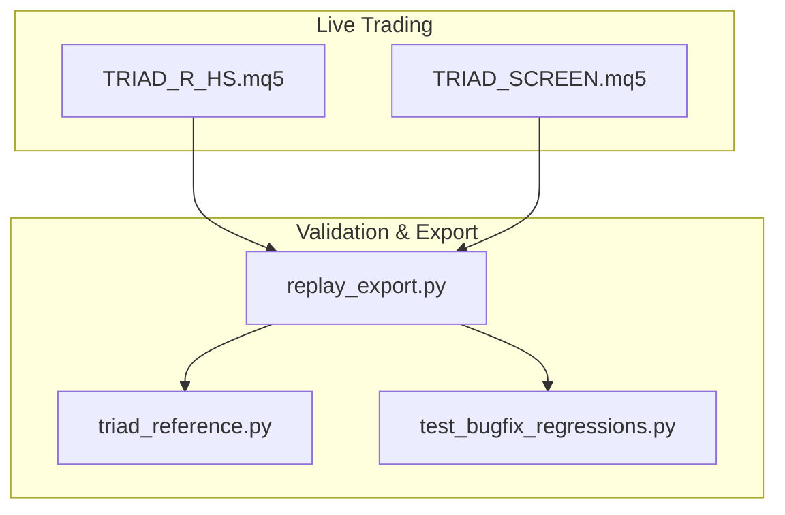
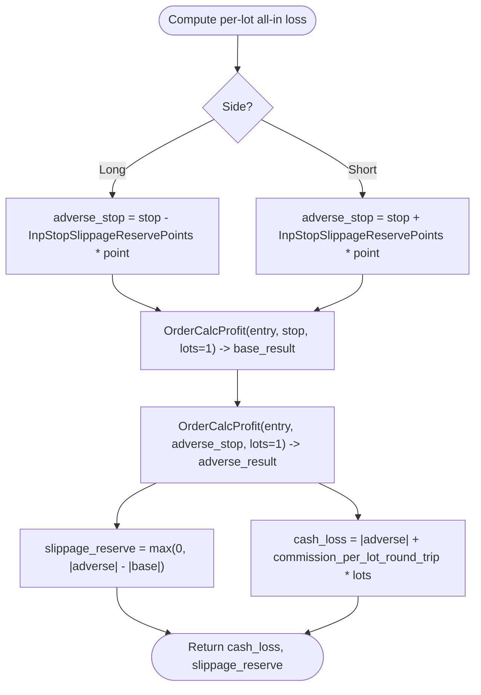
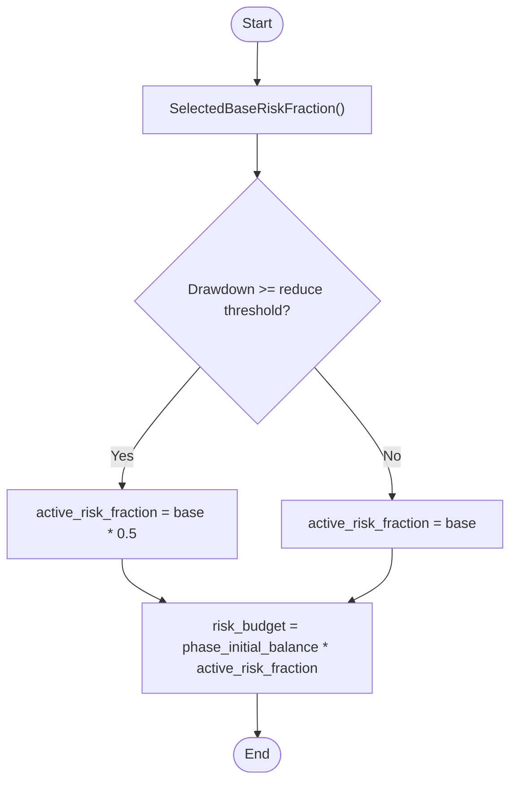
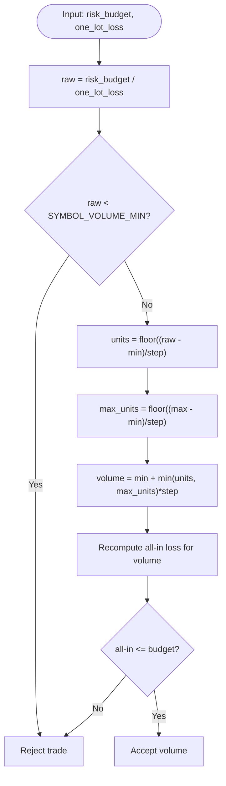
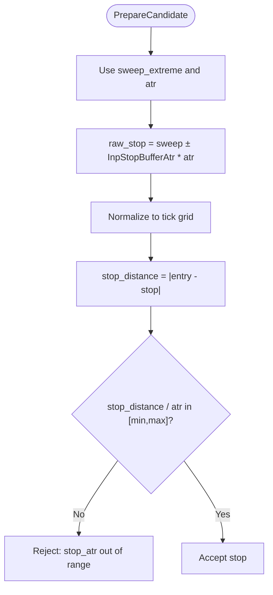
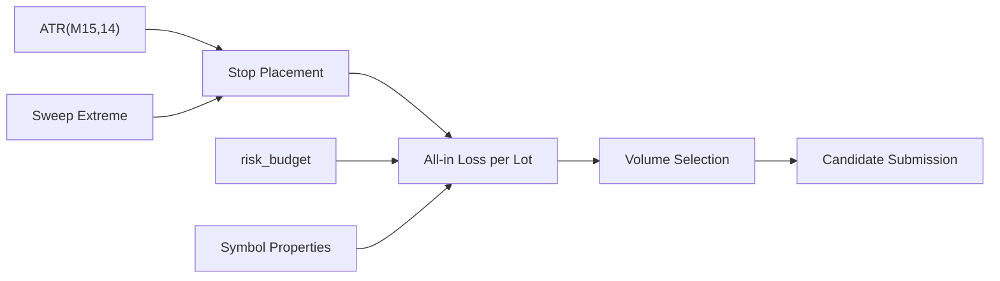

# Position Sizing Engine

<cite>
**Referenced Files in This Document**
- [TRIAD_R_HS.mq5](file://MQL5/Experts/TRIAD_R_HS/TRIAD_R_HS.mq5)
- [TRIAD_SCREEN.mq5](file://MQL5/Experts/TRIAD_SCREEN/TRIAD_SCREEN.mq5)
- [replay_export.py](file://tools/replay_export.py)
- [triad_reference.py](file://tests/triad_reference.py)
- [test_bugfix_regressions.py](file://tests/test_bugfix_regressions.py)
</cite>

## Table of Contents
1. [Introduction](#introduction)
2. [Project Structure](#project-structure)
3. [Core Components](#core-components)
4. [Architecture Overview](#architecture-overview)
5. [Detailed Component Analysis](#detailed-component-analysis)
6. [Dependency Analysis](#dependency-analysis)
7. [Performance Considerations](#performance-considerations)
8. [Troubleshooting Guide](#troubleshooting-guide)
9. [Conclusion](#conclusion)
10. [Appendices](#appendices)

## Introduction
This document explains the position sizing engine used by the strategy EAs. It focuses on how live symbol economics are read at runtime and applied to compute a risk-controlled lot size that respects all-in losses (price risk, commission, and slippage), stop placement rules tied to ATR, and volume rounding constraints enforced by broker-specific symbol properties.

## Project Structure
The position sizing logic is implemented in two MQL5 Expert Advisors and mirrored in Python validation/export tools:
- TRIAD_R_HS.mq5: Live trading EA with full risk controls, volume calculation, and target solving.
- TRIAD_SCREEN.mq5: Screening variant with equivalent sizing and validation routines.
- replay_export.py: Python reference for event resolution and lot sizing using live symbol properties captured from MT5.
- triad_reference.py: Reference utilities including volume rounding down and firm reserve calculations.
- test_bugfix_regressions.py: Tests validating that all-in loss stays within budget and minimum-volume edge cases are handled.



**Diagram sources**
- [TRIAD_R_HS.mq5:2217-2271](file://MQL5/Experts/TRIAD_R_HS/TRIAD_R_HS.mq5#L2217-L2271)
- [TRIAD_SCREEN.mq5:1516-1567](file://MQL5/Experts/TRIAD_SCREEN/TRIAD_SCREEN.mq5#L1516-L1567)
- [replay_export.py:729-759](file://tools/replay_export.py#L729-L759)
- [triad_reference.py:106-114](file://tests/triad_reference.py#L106-L114)
- [test_bugfix_regressions.py:373-384](file://tests/test_bugfix_regressions.py#L373-L384)

**Section sources**
- [TRIAD_R_HS.mq5:2217-2271](file://MQL5/Experts/TRIAD_R_HS/TRIAD_R_HS.mq5#L2217-L2271)
- [TRIAD_SCREEN.mq5:1516-1567](file://MQL5/Experts/TRIAD_SCREEN/TRIAD_SCREEN.mq5#L1516-L1567)
- [replay_export.py:729-759](file://tools/replay_export.py#L729-L759)
- [triad_reference.py:106-114](file://tests/triad_reference.py#L106-L114)
- [test_bugfix_regressions.py:373-384](file://tests/test_bugfix_regressions.py#L373-L384)

## Core Components
- All-in loss computation per lot: Uses live OrderCalcProfit to measure price risk between entry and an adverse stop adjusted by a slippage reserve, then adds round-trip commission.
- Risk budget derivation: Derived from phase_initial_balance multiplied by an active risk fraction that can be halved under drawdown conditions.
- Volume selection: Finds the largest valid volume-step multiple where all-in loss does not exceed the risk budget; always rounds down to the nearest step anchored at SYMBOL_VOLUME_MIN.
- Stop placement: Entry-to-stop distance validated against ATR(M15,14) bands; stops placed beyond sweep extremes with an ATR buffer.
- Live symbol properties: Tick size, tick value, contract size, volume limits, and point are read dynamically from the symbol at runtime.

**Section sources**
- [TRIAD_R_HS.mq5:2217-2271](file://MQL5/Experts/TRIAD_R_HS/TRIAD_R_HS.mq5#L2217-L2271)
- [TRIAD_R_HS.mq5:2380-2399](file://MQL5/Experts/TRIAD_R_HS/TRIAD_R_HS.mq5#L2380-L2399)
- [TRIAD_R_HS.mq5:1652-1658](file://MQL5/Experts/TRIAD_R_HS/TRIAD_R_HS.mq5#L1652-L1658)
- [TRIAD_SCREEN.mq5:1516-1567](file://MQL5/Experts/TRIAD_SCREEN/TRIAD_SCREEN.mq5#L1516-L1567)
- [TRIAD_SCREEN.mq5:1640-1662](file://MQL5/Experts/TRIAD_SCREEN/TRIAD_SCREEN.mq5#L1640-L1662)
- [replay_export.py:729-759](file://tools/replay_export.py#L729-L759)

## Architecture Overview
The sizing pipeline integrates signal preparation, stop placement, live symbol checks, and cash-risk-aware volume selection.

```mermaid
sequenceDiagram
participant EA as "EA (TRIAD_R_HS)"
participant Sym as "Symbol Info"
participant Calc as "OrderCalcProfit"
participant Vol as "CalculateVolume"
participant Budget as "ActiveRiskFraction"
EA->>Sym : Read SYMBOL_POINT, SYMBOL_TRADE_TICK_SIZE, SYMBOL_DIGITS
EA->>EA : PrepareCandidate(entry, sweep_extreme, atr)
EA->>EA : Compute stop_price with ATR buffer
EA->>EA : Validate stop_atr in [min,max]
EA->>Budget : ActiveRiskFraction() * PhaseInitialBalance = risk_budget
EA->>Vol : CalculateVolume(candidate, risk_budget)
Vol->>Calc : OrderCalcProfit(entry, stop, lots=1) base_result
Vol->>Calc : OrderCalcProfit(entry, adverse_stop, lots=1) adverse_result
Vol->>Vol : one_lot_loss = |adverse| + commission
Vol->>Sym : Read SYMBOL_VOLUME_MIN/MAX/STEP, SYMBOL_VOLUME_LIMIT
Vol->>Vol : units = floor((raw - min)/step); volume = min + units*step
Vol-->>EA : candidate.volume, candidate.cash_risk, slippage_reserve_cash
```

**Diagram sources**
- [TRIAD_R_HS.mq5:2217-2271](file://MQL5/Experts/TRIAD_R_HS/TRIAD_R_HS.mq5#L2217-L2271)
- [TRIAD_R_HS.mq5:2380-2399](file://MQL5/Experts/TRIAD_R_HS/TRIAD_R_HS.mq5#L2380-L2399)
- [TRIAD_R_HS.mq5:1652-1658](file://MQL5/Experts/TRIAD_R_HS/TRIAD_R_HS.mq5#L1652-L1658)

## Detailed Component Analysis

### All-in Loss Formula Using Live Symbol Economics
- The per-lot all-in loss combines:
  - Price risk measured via OrderCalcProfit between entry and an adverse stop adjusted by a slippage reserve in points.
  - Round-trip commission per lot.
- The adverse stop is computed by moving the nominal stop further against the position by InpStopSlippageReservePoints × SYMBOL_POINT.
- CashLossForVolume returns both the total cash loss and the incremental slippage reserve component used elsewhere for firm reserves and guard checks.



**Diagram sources**
- [TRIAD_R_HS.mq5:2217-2233](file://MQL5/Experts/TRIAD_R_HS/TRIAD_R_HS.mq5#L2217-L2233)
- [TRIAD_SCREEN.mq5:1516-1532](file://MQL5/Experts/TRIAD_SCREEN/TRIAD_SCREEN.mq5#L1516-L1532)

**Section sources**
- [TRIAD_R_HS.mq5:2217-2233](file://MQL5/Experts/TRIAD_R_HS/TRIAD_R_HS.mq5#L2217-L2233)
- [TRIAD_SCREEN.mq5:1516-1532](file://MQL5/Experts/TRIAD_SCREEN/TRIAD_SCREEN.mq5#L1516-L1532)

### Risk Budget Derivation
- risk_budget = phase_initial_balance × active_risk_fraction.
- active_risk_fraction starts from a profile-defined base and is halved if the strategy drawdown reaches or exceeds a configured threshold.



**Diagram sources**
- [TRIAD_R_HS.mq5:1628-1658](file://MQL5/Experts/TRIAD_R_HS/TRIAD_R_HS.mq5#L1628-L1658)
- [TRIAD_SCREEN.mq5:1781-1818](file://MQL5/Experts/TRIAD_SCREEN/TRIAD_SCREEN.mq5#L1781-L1818)

**Section sources**
- [TRIAD_R_HS.mq5:1628-1658](file://MQL5/Experts/TRIAD_R_HS/TRIAD_R_HS.mq5#L1628-L1658)
- [TRIAD_SCREEN.mq5:1781-1818](file://MQL5/Experts/TRIAD_SCREEN/TRIAD_SCREEN.mq5#L1781-L1818)

### Volume Selection Process
- The system computes the maximum number of whole steps allowed by the risk budget and symbol volume lattice:
  - raw = risk_budget / one_lot_loss
  - units = floor((raw - SYMBOL_VOLUME_MIN) / SYMBOL_VOLUME_STEP)
  - volume = SYMBOL_VOLUME_MIN + min(units, max_units) × SYMBOL_VOLUME_STEP
- After computing volume, it re-evaluates all-in loss for that exact volume and rejects if it exceeds the budget (fail-closed).
- Directional limits (SYMBOL_VOLUME_LIMIT) cap the effective maximum when present.



**Diagram sources**
- [TRIAD_R_HS.mq5:2236-2271](file://MQL5/Experts/TRIAD_R_HS/TRIAD_R_HS.mq5#L2236-L2271)
- [TRIAD_SCREEN.mq5:1535-1567](file://MQL5/Experts/TRIAD_SCREEN/TRIAD_SCREEN.mq5#L1535-L1567)
- [triad_reference.py:106-114](file://tests/triad_reference.py#L106-L114)

**Section sources**
- [TRIAD_R_HS.mq5:2236-2271](file://MQL5/Experts/TRIAD_R_HS/TRIAD_R_HS.mq5#L2236-L2271)
- [TRIAD_SCREEN.mq5:1535-1567](file://MQL5/Experts/TRIAD_SCREEN/TRIAD_SCREEN.mq5#L1535-L1567)
- [triad_reference.py:106-114](file://tests/triad_reference.py#L106-L114)

### Stop Loss Calculation and Entry-to-Stop Distance Validation
- Stop placement uses the sweep extreme plus an ATR buffer:
  - Long: stop_price = sweep_low − InpStopBufferAtr × ATR(M15,14)
  - Short: stop_price = sweep_high + InpStopBufferAtr × ATR(M15,14)
- The resulting stop is normalized to tick boundaries.
- Entry-to-stop distance must fall within a band relative to ATR(M15,14):
  - stop_distance / ATR ∈ [InpStopAtrMin, InpStopAtrMax], which corresponds to 0.60–1.50 × ATR(M15,14) in the canonical configuration.



**Diagram sources**
- [TRIAD_R_HS.mq5:2380-2399](file://MQL5/Experts/TRIAD_R_HS/TRIAD_R_HS.mq5#L2380-L2399)
- [TRIAD_SCREEN.mq5:1640-1662](file://MQL5/Experts/TRIAD_SCREEN/TRIAD_SCREEN.mq5#L1640-L1662)

**Section sources**
- [TRIAD_R_HS.mq5:2380-2399](file://MQL5/Experts/TRIAD_R_HS/TRIAD_R_HS.mq5#L2380-L2399)
- [TRIAD_SCREEN.mq5:1640-1662](file://MQL5/Experts/TRIAD_SCREEN/TRIAD_SCREEN.mq5#L1640-L1662)

### Volume Rounding Rules, Minimum Lot Constraints, and Why $10/pip Is Never Assumed
- Rounding: Always round down to the nearest valid step anchored at SYMBOL_VOLUME_MIN. This ensures compliance with broker-imposed lattices and avoids invalid lot sizes.
- Minimum lot: If the computed raw volume is below SYMBOL_VOLUME_MIN, the trade is rejected.
- No $10/pip assumption: The engine reads live symbol properties (tick size, tick value, contract size, point) and uses OrderCalcProfit to compute per-lot risk in account currency. This makes sizing robust across instruments and brokers without hard-coded pip values.

**Section sources**
- [TRIAD_R_HS.mq5:2242-2261](file://MQL5/Experts/TRIAD_R_HS/TRIAD_R_HS.mq5#L2242-L2261)
- [TRIAD_SCREEN.mq5:1541-1557](file://MQL5/Experts/TRIAD_SCREEN/TRIAD_SCREEN.mq5#L1541-L1557)
- [triad_reference.py:106-114](file://tests/triad_reference.py#L106-L114)
- [TRIAD_R_HS.mq5:2130-2152](file://MQL5/Experts/TRIAD_R_HS/TRIAD_R_HS.mq5#L2130-L2152)

### Live MT5 Symbol Properties Used Dynamically
- Point and digits: SYMBOL_POINT and SYMBOL_DIGITS for normalization and spread measurement.
- Tick size: SYMBOL_TRADE_TICK_SIZE (fallback to SYMBOL_POINT if needed) for precise price normalization.
- Contract size and tick value: SYMBOL_TRADE_CONTRACT_SIZE and SYMBOL_TRADE_TICK_VALUE_* used by validation and export tools to ensure consistent per-lot valuation.
- Volume limits: SYMBOL_VOLUME_MIN, SYMBOL_VOLUME_MAX, SYMBOL_VOLUME_STEP, and optional SYMBOL_VOLUME_LIMIT for directional caps.
- Trade mode and freeze/stops: SYMBOL_TRADE_MODE, SYMBOL_TRADE_STOPS_LEVEL, SYMBOL_TRADE_FREEZE_LEVEL to validate distances and order capabilities.

**Section sources**
- [TRIAD_R_HS.mq5:2130-2152](file://MQL5/Experts/TRIAD_R_HS/TRIAD_R_HS.mq5#L2130-L2152)
- [TRIAD_R_HS.mq5:3632-3651](file://MQL5/Experts/TRIAD_R_HS/TRIAD_R_HS.mq5#L3632-L3651)
- [TRIAD_SCREEN.mq5:1442-1467](file://MQL5/Experts/TRIAD_SCREEN/TRIAD_SCREEN.mq5#L1442-L1467)

## Dependency Analysis
- The sizing engine depends on live symbol queries and OrderCalcProfit for accurate per-lot risk in account currency.
- Stop placement depends on ATR(M15,14) and sweep extremes.
- Risk budget depends on phase_initial_balance and active_risk_fraction, which may be reduced under drawdown.
- Volume selection depends on symbol volume lattice (min, step, max, directional limit).



**Diagram sources**
- [TRIAD_R_HS.mq5:2380-2399](file://MQL5/Experts/TRIAD_R_HS/TRIAD_R_HS.mq5#L2380-L2399)
- [TRIAD_R_HS.mq5:2217-2271](file://MQL5/Experts/TRIAD_R_HS/TRIAD_R_HS.mq5#L2217-L2271)
- [TRIAD_R_HS.mq5:1652-1658](file://MQL5/Experts/TRIAD_R_HS/TRIAD_R_HS.mq5#L1652-L1658)

**Section sources**
- [TRIAD_R_HS.mq5:2217-2271](file://MQL5/Experts/TRIAD_R_HS/TRIAD_R_HS.mq5#L2217-L2271)
- [TRIAD_R_HS.mq5:2380-2399](file://MQL5/Experts/TRIAD_R_HS/TRIAD_R_HS.mq5#L2380-L2399)
- [TRIAD_R_HS.mq5:1652-1658](file://MQL5/Experts/TRIAD_R_HS/TRIAD_R_HS.mq5#L1652-L1658)

## Performance Considerations
- OrderCalcProfit calls are minimized by computing per-lot metrics once and reusing them for volume selection and final verification.
- Normalization to tick grids prevents unnecessary rework and ensures prices are executable.
- Fail-closed design avoids risky over-leverage by rejecting candidates that cannot satisfy all-in constraints within symbol volume limits.

[No sources needed since this section provides general guidance]

## Troubleshooting Guide
Common rejection reasons and their causes:
- stop_atr: Entry-to-stop distance outside the allowed ATR band; adjust sweep/ATR or accept fewer signals.
- quote_stale or quote_changed_or_stale: Prices too old or changed before submission; retry on next tick.
- cost_to_r_recheck: Spread, slippage, and commission relative to price risk exceed thresholds; widen stops or avoid high-spread periods.
- broker_stop_or_freeze_level: Stop/target too close to broker freeze/stop levels; increase distances.
- symbol_not_full_trade_mode: Symbol not available for full trading; skip until conditions change.
- cash_risk_budget_recheck: All-in loss for selected volume exceeds budget; volume will be reduced or trade rejected.

**Section sources**
- [TRIAD_R_HS.mq5:2311-2341](file://MQL5/Experts/TRIAD_R_HS/TRIAD_R_HS.mq5#L2311-L2341)
- [TRIAD_SCREEN.mq5:1608-1638](file://MQL5/Experts/TRIAD_SCREEN/TRIAD_SCREEN.mq5#L1608-L1638)

## Conclusion
The position sizing engine enforces strict, live-symbol-aware risk controls. It computes all-in losses using OrderCalcProfit, derives risk budgets from phase_initial_balance and active_risk_fraction, places stops based on ATR and sweep extremes, and selects volumes by rounding down to the nearest valid step while ensuring all-in loss never exceeds the budget. This approach avoids assumptions like $10/pip and adapts to any instrument’s live economics.

[No sources needed since this section summarizes without analyzing specific files]

## Appendices

### Concrete Examples of Position Size Calculations
Below are conceptual examples illustrating how the engine behaves under different market conditions. Replace placeholders with your live symbol properties and observed values.

- Example A: Low volatility, wide ATR
  - Inputs: atr = 0.0012, sweep_low = 1.08000, InpStopBufferAtr = 0.10 → stop ≈ 1.08000 − 0.10 × 0.0012 = 1.07988 (normalized to tick).
  - Entry-to-stop distance ratio: (|entry − stop|)/atr ≈ 0.10 (within 0.60–1.50? No; reject unless sweep/ATR yields a larger distance).
  - If ratio is within bounds, compute per-lot all-in loss via OrderCalcProfit and derive lots from risk_budget / one_lot_loss, rounded down to step.

- Example B: High volatility, narrow ATR
  - Inputs: atr = 0.0004, sweep_high = 1.08500, InpStopBufferAtr = 0.10 → stop ≈ 1.08500 + 0.10 × 0.0004 = 1.08504.
  - If stop_distance/atr falls within [0.60, 1.50], proceed to volume selection; otherwise reject.

- Example C: Tight budget vs. minimum lot
  - If risk_budget is small such that even SYMBOL_VOLUME_MIN all-in loss exceeds budget, the trade is rejected (no partial fills below minimum).

These scenarios reflect the same logic implemented in the EAs and validated by tests.

**Section sources**
- [TRIAD_R_HS.mq5:2380-2399](file://MQL5/Experts/TRIAD_R_HS/TRIAD_R_HS.mq5#L2380-L2399)
- [TRIAD_SCREEN.mq5:1640-1662](file://MQL5/Experts/TRIAD_SCREEN/TRIAD_SCREEN.mq5#L1640-L1662)
- [test_bugfix_regressions.py:373-384](file://tests/test_bugfix_regressions.py#L373-L384)