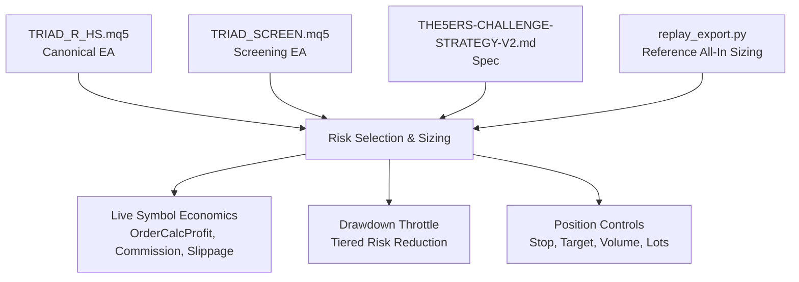
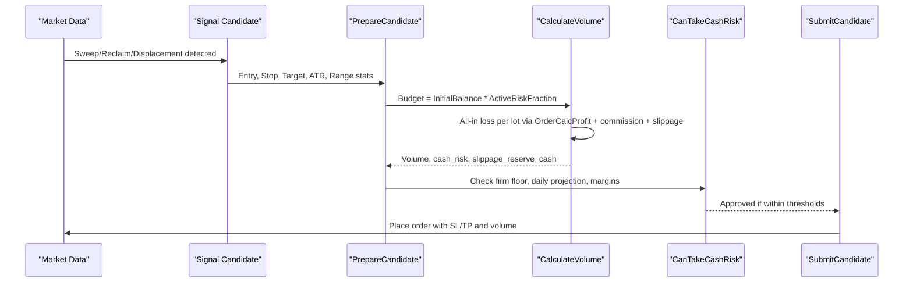
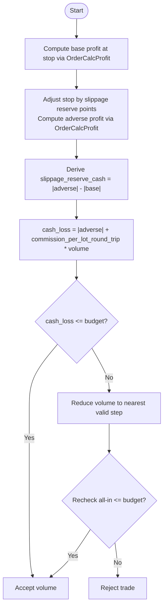
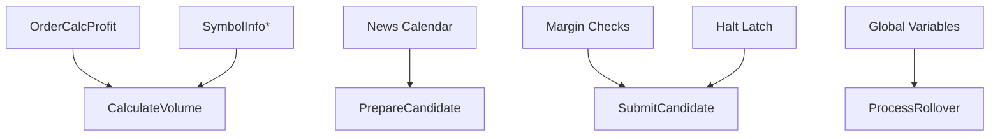

# Risk Management Framework

<cite>
**Referenced Files in This Document**
- [TRIAD_R_HS.mq5](file://MQL5/Experts/TRIAD_R_HS/TRIAD_R_HS.mq5)
- [TRIAD_SCREEN.mq5](file://MQL5/Experts/TRIAD_SCREEN/TRIAD_SCREEN.mq5)
- [replay_export.py](file://tools/replay_export.py)
- [THE5ERS-CHALLENGE-STRATEGY-V2.md](file://THE5ERS-CHALLENGE-STRATEGY-V2.md)
</cite>

## Table of Contents
1. Introduction
2. Project Structure
3. Core Components
4. Architecture Overview
5. Detailed Component Analysis
6. Dependency Analysis
7. Performance Considerations
8. Troubleshooting Guide
9. Conclusion
10. Appendices

## Introduction
This document explains the risk management framework implemented by the TRIAD-R High Stakes EA and its screening counterpart. It covers position sizing, drawdown controls, and risk tiers; the cash-risk calculation methodology using live symbol economics; risk budgeting based on phase initial balance and active risk fraction; four paired risk/target profiles (A–D); a tiered drawdown throttle system; stop loss calculation formulas; volume rounding rules; minimum lot constraints; and examples illustrating how risk tiers drive position sizing decisions under different market conditions.

## Project Structure
The risk logic is primarily implemented in two MQL5 Expert Advisors:
- TRIAD_R_HS.mq5: canonical production-grade research EA with full safety machinery, lifecycle locks, and journaling.
- TRIAD_SCREEN.mq5: demo-only screening tool that mirrors the same signal and risk selection logic without persistent state or hard safety latches.

Supporting documentation and validation utilities include THE5ERS-CHALLENGE-STRATEGY-V2.md (specification) and replay_export.py (reference implementation for all-in sizing used in tests).

**Diagram sources**
- [TRIAD_R_HS.mq5:2217-2271](file://MQL5/Experts/TRIAD_R_HS/TRIAD_R_HS.mq5#L2217-L2271)
- [TRIAD_SCREEN.mq5:1781-1818](file://MQL5/Experts/TRIAD_SCREEN/TRIAD_SCREEN.mq5#L1781-L1818)
- [THE5ERS-CHALLENGE-STRATEGY-V2.md:200-218](file://THE5ERS-CHALLENGE-STRATEGY-V2.md#L200-L218)
- [replay_export.py:732-759](file://tools/replay_export.py#L732-L759)

**Section sources**
- [TRIAD_R_HS.mq5:16-29](file://MQL5/Experts/TRIAD_R_HS/TRIAD_R_HS.mq5#L16-L29)
- [TRIAD_SCREEN.mq5:51-57](file://MQL5/Experts/TRIAD_SCREEN/TRIAD_SCREEN.mq5#L51-L57)
- [THE5ERS-CHALLENGE-STRATEGY-V2.md:200-218](file://THE5ERS-CHALLENGE-STRATEGY-V2.md#L200-L218)

## Core Components
- Risk Profiles (A–D): Paired risk percentages and target R multiples define each profile’s base risk fraction and expected reward.
- Active Risk Fraction: Base risk fraction adjusted by current strategy drawdown to implement the drawdown throttle.
- Cash-Risk Calculation: Uses live symbol economics to compute all-in loss per lot including OrderCalcProfit, commission, and slippage reserve.
- Position Sizing: Computes volume from risk budget and per-lot all-in loss, respecting broker minimums, steps, and maximums.
- Stop Loss and Target: Stop derived from sweep extreme plus ATR buffer; target solved to achieve selected R multiple after costs and slippage.
- Drawdown Throttle: Tiered reduction of active risk fraction based on high-water drawdown; emergency halt at threshold.
- Safety Guards: Daily/weekly internal stops, firm floor protection, news blackouts, margin checks, and request throttling.

**Section sources**
- [TRIAD_R_HS.mq5:121-140](file://MQL5/Experts/TRIAD_R_HS/TRIAD_R_HS.mq5#L121-L140)
- [TRIAD_SCREEN.mq5:1781-1818](file://MQL5/Experts/TRIAD_SCREEN/TRIAD_SCREEN.mq5#L1781-L1818)
- [TRIAD_R_HS.mq5:2217-2271](file://MQL5/Experts/TRIAD_R_HS/TRIAD_R_HS.mq5#L2217-L2271)
- [TRIAD_R_HS.mq5:2273-2309](file://MQL5/Experts/TRIAD_R_HS/TRIAD_R_HS.mq5#L2273-L2309)
- [THE5ERS-CHALLENGE-STRATEGY-V2.md:200-218](file://THE5ERS-CHALLENGE-STRATEGY-V2.md#L200-L218)

## Architecture Overview
The risk engine integrates signal detection, candidate preparation, sizing, and execution guards into a single flow. Each candidate is validated against live quote state, spread gates, cost-to-R limits, and risk budgets before submission. The drawdown throttle modulates the active risk fraction, while safety mechanisms enforce daily/weekly stops and firm floors.

**Diagram sources**
- [TRIAD_R_HS.mq5:2380-2521](file://MQL5/Experts/TRIAD_R_HS/TRIAD_R_HS.mq5#L2380-L2521)
- [TRIAD_R_HS.mq5:2217-2271](file://MQL5/Experts/TRIAD_R_HS/TRIAD_R_HS.mq5#L2217-L2271)
- [TRIAD_R_HS.mq5:1685-1699](file://MQL5/Experts/TRIAD_R_HS/TRIAD_R_HS.mq5#L1685-L1699)

## Detailed Component Analysis

### Risk Profiles and Target R Multiples
Four paired profiles define base risk fractions and target R multiples:
- Profile A: 0.40% base risk, target +1.50R
- Profile B: 0.35% base risk, target +1.75R
- Profile C: 0.30% base risk, target +2.00R
- Profile D: 0.25% base risk, target +2.50R

These are selected via input enums and mapped to base risk fractions and target R values in both EAs.

**Section sources**
- [TRIAD_R_HS.mq5:23-29](file://MQL5/Experts/TRIAD_R_HS/TRIAD_R_HS.mq5#L23-L29)
- [TRIAD_SCREEN.mq5:51-57](file://MQL5/Experts/TRIAD_SCREEN/TRIAD_SCREEN.mq5#L51-L57)
- [TRIAD_SCREEN.mq5:1781-1803](file://MQL5/Experts/TRIAD_SCREEN/TRIAD_SCREEN.mq5#L1781-L1803)

### Cash-Risk Calculation Methodology (All-In Loss)
The all-in loss per lot includes:
- Pure stop loss computed via OrderCalcProfit between entry and stop
- One-side adverse slippage reserve applied to stop price
- Round-trip commission per lot

The function computes both base and adverse results to derive slippage reserve cash and total cash loss. Volume is then sized so that the all-in loss fits the risk budget.

**Diagram sources**
- [TRIAD_R_HS.mq5:2217-2271](file://MQL5/Experts/TRIAD_R_HS/TRIAD_R_HS.mq5#L2217-L2271)
- [replay_export.py:732-759](file://tools/replay_export.py#L732-L759)

**Section sources**
- [TRIAD_R_HS.mq5:2217-2271](file://MQL5/Experts/TRIAD_R_HS/TRIAD_R_HS.mq5#L2217-L2271)
- [replay_export.py:732-759](file://tools/replay_export.py#L732-L759)

### Risk Budget Calculation
The risk budget equals Phase Initial Balance multiplied by the Active Risk Fraction. The Active Risk Fraction is the selected base risk fraction reduced by drawdown throttle:
- Normal drawdown (0–2%): 100% of base risk
- Reduced drawdown (2–5%): 50% of base risk
- Emergency (≥5%): 0% (halt)

Budget usage ensures that even with slippage and commission, the all-in loss remains within the declared ceiling.

**Section sources**
- [TRIAD_R_HS.mq5:2480-2485](file://MQL5/Experts/TRIAD_R_HS/TRIAD_R_HS.mq5#L2480-L2485)
- [TRIAD_SCREEN.mq5:1781-1818](file://MQL5/Experts/TRIAD_SCREEN/TRIAD_SCREEN.mq5#L1781-L1818)
- [THE5ERS-CHALLENGE-STRATEGY-V2.md:200-218](file://THE5ERS-CHALLENGE-STRATEGY-V2.md#L200-L218)

### Drawdown Throttle System
The drawdown throttle uses high-water mark-based equity drawdown to adjust new-trade risk:
- 0–2% drawdown: normal risk (full base fraction)
- 2–5% drawdown: reduced risk (half base fraction)
- ≥5% drawdown: emergency halt (zero risk, cancel entries, close open risk when possible)

This mechanism protects capital during adverse runs and enforces formal revalidation upon hitting the emergency boundary.

**Section sources**
- [TRIAD_SCREEN.mq5:1805-1818](file://MQL5/Experts/TRIAD_SCREEN/TRIAD_SCREEN.mq5#L1805-L1818)
- [THE5ERS-CHALLENGE-STRATEGY-V2.md:200-218](file://THE5ERS-CHALLENGE-STRATEGY-V2.md#L200-L218)

### Stop Loss Calculation Formulas
Stop distance is derived from the sweep extreme with an ATR buffer:
- Long: stop below sweep extreme minus ATR buffer times ATR
- Short: stop above sweep extreme plus ATR buffer times ATR

The resulting stop must fall within configured ATR bounds to ensure reasonable risk geometry.

**Section sources**
- [TRIAD_R_HS.mq5:2380-2402](file://MQL5/Experts/TRIAD_R_HS/TRIAD_R_HS.mq5#L2380-L2402)

### Volume Rounding Rules and Minimum Lot Constraints
Volume is calculated on the broker’s volume lattice anchored at SYMBOL_VOLUME_MIN with step SYMBOL_VOLUME_STEP:
- raw = budget / one_lot_all_in_loss
- units = floor((raw - min + epsilon) / step)
- volume = min + min(units, max_units) * step
- Normalize to volume digits and verify against min/max and directional limits
- Final all-in check ensures actual loss ≤ budget

Minimum lot constraints are enforced strictly; if the minimum lot exceeds the budget, the trade is rejected.

**Section sources**
- [TRIAD_R_HS.mq5:2236-2271](file://MQL5/Experts/TRIAD_R_HS/TRIAD_R_HS.mq5#L2236-L2271)

### Target Price Resolution
Target price is solved to achieve the selected R multiple net of commission and slippage:
- desired_net = cash_risk * target_R
- Binary search over distance from entry to find effective target that yields desired net after costs
- Normalize target to tick size and apply target slippage reserve for effective exit pricing

**Section sources**
- [TRIAD_R_HS.mq5:2273-2309](file://MQL5/Experts/TRIAD_R_HS/TRIAD_R_HS.mq5#L2273-L2309)

### Relationship Between Risk Tiers and Position Sizing
Risk tiers directly scale the budget used for sizing:
- Higher risk tier → larger budget → larger volume (subject to all-in ceiling and lot constraints)
- Lower risk tier → smaller budget → smaller volume
- If minimum lot cannot fit the reduced budget, no trade is taken

This ensures consistent risk exposure across varying market conditions while honoring broker constraints.

**Section sources**
- [TRIAD_R_HS.mq5:2480-2485](file://MQL5/Experts/TRIAD_R_HS/TRIAD_R_HS.mq5#L2480-L2485)
- [TRIAD_R_HS.mq5:2236-2271](file://MQL5/Experts/TRIAD_R_HS/TRIAD_R_HS.mq5#L2236-L2271)

## Dependency Analysis
Key dependencies and their roles:
- Live symbol economics: OrderCalcProfit for pure stop and adverse stop; SymbolInfo for point, volume limits, tick size
- News calendar: blocks entries around high-impact events
- Margin checks: ensures required margin is available for candidate volume
- State persistence: global variables track day/week keys, balances, high water, and request counts
- Safety latches: halt and instance lock prevent unauthorized trading

**Diagram sources**
- [TRIAD_R_HS.mq5:2172-2204](file://MQL5/Experts/TRIAD_R_HS/TRIAD_R_HS.mq5#L2172-L2204)
- [TRIAD_R_HS.mq5:2217-2271](file://MQL5/Experts/TRIAD_R_HS/TRIAD_R_HS.mq5#L2217-L2271)
- [TRIAD_R_HS.mq5:3379-3514](file://MQL5/Experts/TRIAD_R_HS/TRIAD_R_HS.mq5#L3379-L3514)

**Section sources**
- [TRIAD_R_HS.mq5:2172-2204](file://MQL5/Experts/TRIAD_R_HS/TRIAD_R_HS.mq5#L2172-L2204)
- [TRIAD_R_HS.mq5:3379-3514](file://MQL5/Experts/TRIAD_R_HS/TRIAD_R_HS.mq5#L3379-L3514)

## Performance Considerations
- Quote freshness and spread gates reduce costly rejections by validating live conditions early.
- Cost-to-R limit prevents trades where spread/slippage/commission erode expectancy.
- Volume lattice calculations are bounded by broker min/max/step to avoid invalid orders.
- Request throttling and emergency safety queues protect against excessive API calls and ensure critical actions execute promptly.

[No sources needed since this section provides general guidance]

## Troubleshooting Guide
Common rejection reasons and mitigations:
- Spread gate exceeded: widen acceptable range or wait for tighter spreads
- Cost-to-R too high: reduce exposure or wait for better liquidity
- Insufficient margin: lower leverage or reduce position size
- News blackout: avoid trading around high-impact releases
- Minimum lot exceeds budget: switch symbols or accept reduced risk tier
- Drawdown throttle triggered: expect reduced sizing or halt until recovery

**Section sources**
- [TRIAD_R_HS.mq5:2463-2478](file://MQL5/Experts/TRIAD_R_HS/TRIAD_R_HS.mq5#L2463-L2478)
- [TRIAD_R_HS.mq5:2512-2517](file://MQL5/Experts/TRIAD_R_HS/TRIAD_R_HS.mq5#L2512-L2517)

## Conclusion
The framework implements robust, live-market-aware risk management:
- All-in loss sizing ensures true risk exposure matches the declared budget
- Tiered drawdown throttle adapts risk dynamically to protect capital
- Clear stop/target logic and strict volume rounding honor broker constraints
- Safety mechanisms and governance gates maintain operational integrity

[No sources needed since this section summarizes without analyzing specific files]

## Appendices

### Examples of Risk Calculations Across Market Conditions
- Low volatility, tight spreads: higher probability of meeting cost-to-R; volumes may be closer to budget ceiling
- Wide spreads or elevated slippage: all-in loss increases; volumes reduce or trades reject to stay within budget
- News events: entries blocked; sizing irrelevant until post-news window clears
- Drawdown at 3%: active risk fraction halves; volumes halve proportionally, preserving risk discipline

[No sources needed since this section provides conceptual examples]