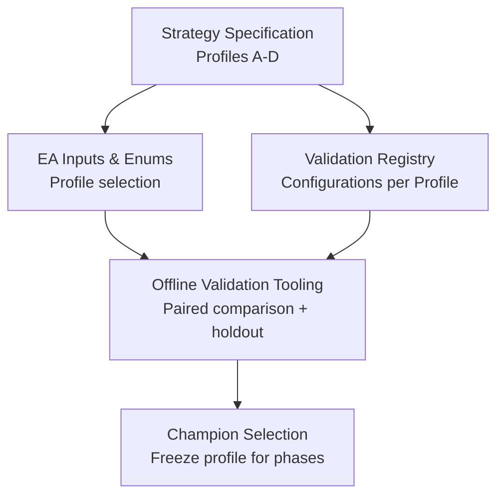
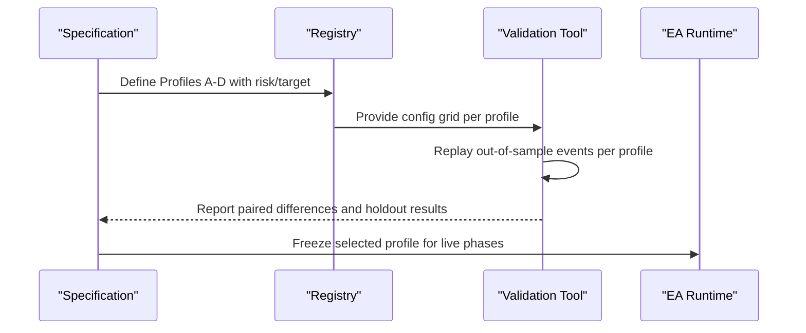
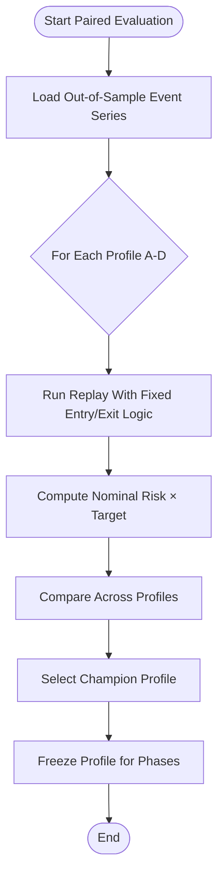
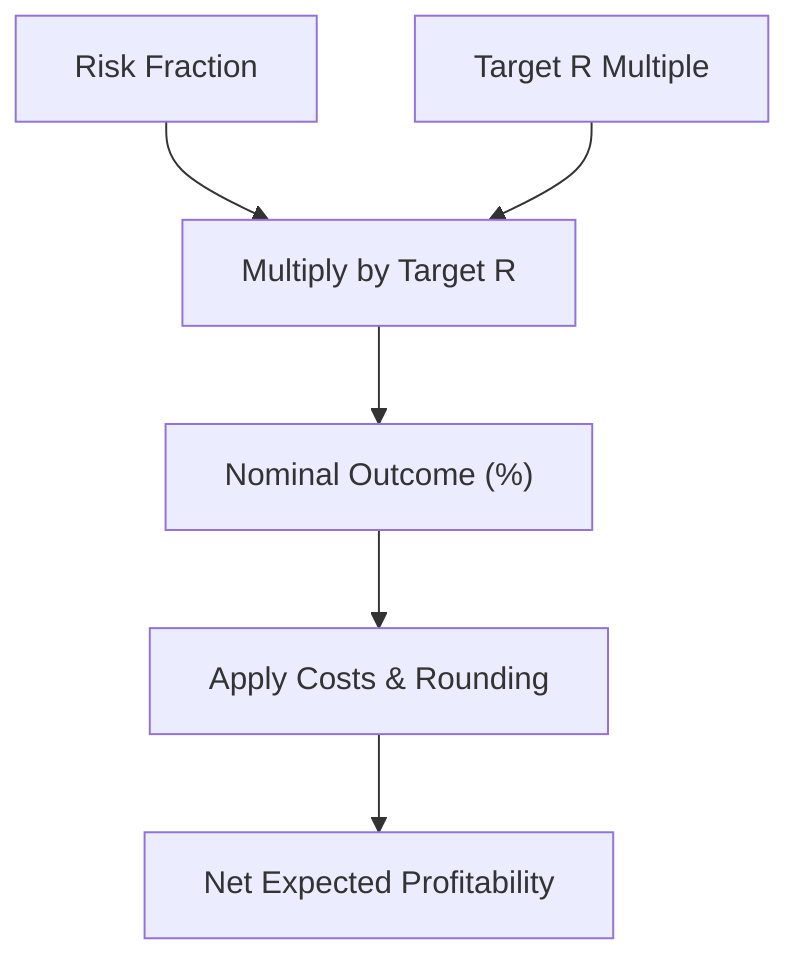
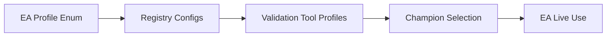

# Risk-Target Profiles

<cite>
**Referenced Files in This Document**
- [THE5ERS-CHALLENGE-STRATEGY-V2.md](file://THE5ERS-CHALLENGE-STRATEGY-V2.md)
- [triad_v2_1_registry.json](file://validation/triad_v2_1_registry.json)
- [TRIAD_R_HS.mq5](file://MQL5/Experts/TRIAD_R_HS/TRIAD_R_HS.mq5)
- [TRIAD_SCREEN.mq5](file://MQL5/Experts/TRIAD_SCREEN/TRIAD_SCREEN.mq5)
- [triad_validation.py](file://tools/triad_validation.py)
</cite>

## Table of Contents
1. [Introduction](#introduction)
2. [Project Structure](#project-structure)
3. [Core Components](#core-components)
4. [Architecture Overview](#architecture-overview)
5. [Detailed Component Analysis](#detailed-component-analysis)
6. [Dependency Analysis](#dependency-analysis)
7. [Performance Considerations](#performance-considerations)
8. [Troubleshooting Guide](#troubleshooting-guide)
9. [Conclusion](#conclusion)

## Introduction
This document specifies and explains the four paired risk/target profiles (A–D) used to test risk and target as coupled candidates for the TRIAD-R strategy under The5ers challenge constraints. Each profile pairs a maximum risk percentage with a fixed target R multiple so that lower-risk candidates still aim for a normal full-target outcome near 0.6% nominal before lot rounding and costs. The selection is performed offline using out-of-sample event series, and no candidate above 0.40% maximum risk is permitted.

## Project Structure
The profiles are defined and enforced across:
- Strategy specification: canonical rules and profile definitions
- EA inputs and runtime profile enums
- Validation registry enumerating all tested configurations
- Offline validation tooling that drives paired comparisons and holdout evaluation

**Diagram sources**
- [THE5ERS-CHALLENGE-STRATEGY-V2.md:185-199](file://THE5ERS-CHALLENGE-STRATEGY-V2.md#L185-L199)
- [triad_v2_1_registry.json:1-200](file://validation/triad_v2_1_registry.json#L1-L200)
- [TRIAD_R_HS.mq5:23-29](file://MQL5/Experts/TRIAD_R_HS/TRIAD_R_HS.mq5#L23-L29)
- [triad_validation.py:63-68](file://tools/triad_validation.py#L63-L68)

**Section sources**
- [THE5ERS-CHALLENGE-STRATEGY-V2.md:185-199](file://THE5ERS-CHALLENGE-STRATEGY-V2.md#L185-L199)
- [triad_v2_1_registry.json:1-200](file://validation/triad_v2_1_registry.json#L1-L200)
- [TRIAD_R_HS.mq5:23-29](file://MQL5/Experts/TRIAD_R_HS/TRIAD_R_HS.mq5#L23-L29)
- [triad_validation.py:63-68](file://tools/triad_validation.py#L63-L68)

## Core Components
- Profile A baseline: 0.40% maximum risk, $10.00 cash ceiling on $2,500 balance, fixed +1.50R target producing 0.600% nominal risk × target.
- Profile B: 0.35% maximum risk, $8.75 cash ceiling, fixed +1.75R target producing 0.613% nominal outcome.
- Profile C: 0.30% maximum risk, $7.50 cash ceiling, fixed +2.00R target producing 0.600% nominal result.
- Profile D: 0.25% maximum risk, $6.25 cash ceiling, fixed +2.50R target producing 0.625% nominal performance.

These values are explicitly enumerated in the strategy specification and mirrored in the EA’s profile enum and the validation registry.

**Section sources**
- [THE5ERS-CHALLENGE-STRATEGY-V2.md:185-199](file://THE5ERS-CHALLENGE-STRATEGY-V2.md#L185-L199)
- [triad_v2_1_registry.json:1-200](file://validation/triad_v2_1_registry.json#L1-L200)
- [TRIAD_R_HS.mq5:23-29](file://MQL5/Experts/TRIAD_R_HS/TRIAD_R_HS.mq5#L23-L29)

## Architecture Overview
The paired testing architecture ensures that each profile is evaluated consistently across the same event series, with identical entry logic and exit mechanics except for the risk fraction and target R multiple. The process includes:
- Defining profiles and their nominal outcomes
- Running offline evaluations over out-of-sample events
- Selecting a champion profile after freezing the event series
- Freezing the selected profile for Phase 1, Phase 2, and initial funded period

**Diagram sources**
- [THE5ERS-CHALLENGE-STRATEGY-V2.md:185-199](file://THE5ERS-CHALLENGE-STRATEGY-V2.md#L185-L199)
- [triad_v2_1_registry.json:1-200](file://validation/triad_v2_1_registry.json#L1-L200)
- [triad_validation.py:63-68](file://tools/triad_validation.py#L63-L68)

## Detailed Component Analysis

### Profile A Baseline
- Maximum risk: 0.40%
- Cash ceiling: $10.00
- Fixed target: +1.50R
- Nominal outcome: 0.600%
- Purpose: Baseline against which other profiles are compared; represents the highest allowed risk tier within the constraint that no candidate may exceed 0.40%.

Implementation anchors:
- Enum mapping for Profile A in the EA
- Registry entries for Profile A across time-stop variants
- Validation tool profile tuple defining risk and target

**Section sources**
- [THE5ERS-CHALLENGE-STRATEGY-V2.md:185-199](file://THE5ERS-CHALLENGE-STRATEGY-V2.md#L185-L199)
- [triad_v2_1_registry.json:1-200](file://validation/triad_v2_1_registry.json#L1-L200)
- [TRIAD_R_HS.mq5:23-29](file://MQL5/Experts/TRIAD_R_HS/TRIAD_R_HS.mq5#L23-L29)
- [triad_validation.py:63-68](file://tools/triad_validation.py#L63-L68)

### Profile B
- Maximum risk: 0.35%
- Cash ceiling: $8.75
- Fixed target: +1.75R
- Nominal outcome: 0.613%
- Purpose: Lower risk than A but higher target R to maintain near-normal full-target expectation; tests whether reduced risk can be compensated by a larger target while preserving profitability.

Implementation anchors:
- Enum mapping for Profile B in the EA
- Registry entries for Profile B across time-stop variants
- Validation tool profile tuple defining risk and target

**Section sources**
- [THE5ERS-CHALLENGE-STRATEGY-V2.md:185-199](file://THE5ERS-CHALLENGE-STRATEGY-V2.md#L185-L199)
- [triad_v2_1_registry.json:1-200](file://validation/triad_v2_1_registry.json#L1-L200)
- [TRIAD_R_HS.mq5:23-29](file://MQL5/Experts/TRIAD_R_HS/TRIAD_R_HS.mq5#L23-L29)
- [triad_validation.py:63-68](file://tools/triad_validation.py#L63-L68)

### Profile C
- Maximum risk: 0.30%
- Cash ceiling: $7.50
- Fixed target: +2.00R
- Nominal outcome: 0.600%
- Purpose: Further reduces risk while increasing target R to keep nominal outcome aligned with baseline; evaluates robustness when risk is halved relative to A and target doubles.

Implementation anchors:
- Enum mapping for Profile C in the EA
- Registry entries for Profile C across time-stop variants
- Validation tool profile tuple defining risk and target

**Section sources**
- [THE5ERS-CHALLENGE-STRATEGY-V2.md:185-199](file://THE5ERS-CHALLENGE-STRATEGY-V2.md#L185-L199)
- [triad_v2_1_registry.json:1-200](file://validation/triad_v2_1_registry.json#L1-L200)
- [TRIAD_R_HS.mq5:23-29](file://MQL5/Experts/TRIAD_R_HS/TRIAD_R_HS.mq5#L23-L29)
- [triad_validation.py:63-68](file://tools/triad_validation.py#L63-L68)

### Profile D
- Maximum risk: 0.25%
- Cash ceiling: $6.25
- Fixed target: +2.50R
- Nominal outcome: 0.625%
- Purpose: Lowest risk tier with the highest target R among the four; tests whether a substantially larger target can sustain expected profitability at minimal risk exposure.

Implementation anchors:
- Enum mapping for Profile D in the EA
- Registry entries for Profile D across time-stop variants
- Validation tool profile tuple defining risk and target

**Section sources**
- [THE5ERS-CHALLENGE-STRATEGY-V2.md:185-199](file://THE5ERS-CHALLENGE-STRATEGY-V2.md#L185-L199)
- [triad_v2_1_registry.json:1-200](file://validation/triad_v2_1_registry.json#L1-L200)
- [TRIAD_R_HS.mq5:23-29](file://MQL5/Experts/TRIAD_R_HS/TRIAD_R_HS.mq5#L23-L29)
- [triad_validation.py:63-68](file://tools/triad_validation.py#L63-L68)

### Paired Testing Methodology
- Risk and target are tested as paired profiles so lower-risk candidates still achieve normal full-target outcomes near 0.6% before lot rounding and costs.
- The methodology uses out-of-sample event series to evaluate each profile identically, ensuring fair comparison.
- No candidate above 0.40% maximum risk is permitted; this enforces an upper bound on risk exposure during selection.
- After selection, the winning profile is frozen and used unchanged through Phase 1, Phase 2, and the initial funded period.

**Diagram sources**
- [THE5ERS-CHALLENGE-STRATEGY-V2.md:185-199](file://THE5ERS-CHALLENGE-STRATEGY-V2.md#L185-L199)
- [triad_validation.py:63-68](file://tools/triad_validation.py#L63-L68)

**Section sources**
- [THE5ERS-CHALLENGE-STRATEGY-V2.md:185-199](file://THE5ERS-CHALLENGE-STRATEGY-V2.md#L185-L199)
- [triad_validation.py:63-68](file://tools/triad_validation.py#L63-L68)

### Relationship Between Risk Percentage, Target R Multiple, and Expected Profitability
- Expected nominal outcome equals risk fraction multiplied by target R multiple.
- Profiles are designed so that even with lower risk, the increased target R keeps nominal outcomes near 0.6%, maintaining similar expected profitability before costs and rounding.
- Actual profitability depends on:
  - Volume rounding down to lot steps
  - Commission and slippage reserves
  - Stop and target placement constraints
  - Market conditions affecting fill rates and slippage

[No sources needed since this diagram shows conceptual workflow, not actual code structure]

## Dependency Analysis
- The EA defines profile enums and accepts profile selection via input parameters.
- The validation registry enumerates all tested configurations per profile, including time-stop and breakeven policy variants.
- The offline validation tool maps profile tuples to risk and target values and drives paired comparisons.

**Diagram sources**
- [TRIAD_R_HS.mq5:23-29](file://MQL5/Experts/TRIAD_R_HS/TRIAD_R_HS.mq5#L23-L29)
- [triad_v2_1_registry.json:1-200](file://validation/triad_v2_1_registry.json#L1-L200)
- [triad_validation.py:63-68](file://tools/triad_validation.py#L63-L68)

**Section sources**
- [TRIAD_R_HS.mq5:23-29](file://MQL5/Experts/TRIAD_R_HS/TRIAD_R_HS.mq5#L23-L29)
- [triad_v2_1_registry.json:1-200](file://validation/triad_v2_1_registry.json#L1-L200)
- [triad_validation.py:63-68](file://tools/triad_validation.py#L63-L68)

## Performance Considerations
- Nominal outcomes near 0.6% provide a consistent baseline for comparing profiles before costs and rounding.
- Lower-risk profiles (C and D) rely on higher target R multiples to maintain expected profitability; this increases sensitivity to slippage and stop distance constraints.
- Time-stop and breakeven policies interact with profile selection; these are varied in the registry and evaluated offline.
- Real-world performance will vary due to market volatility, spread conditions, and execution quality.

[No sources needed since this section provides general guidance]

## Troubleshooting Guide
- If a profile fails to produce trades, verify:
  - News calendar coverage and red-folder restrictions
  - Range and ATR percentile filters
  - Spread and cost-to-R limits
  - Volume rounding and minimum lot constraints
- If expected profitability deviates significantly from nominal:
  - Check commission and slippage assumptions
  - Confirm stop and target placement feasibility
  - Review session boundaries and time-stop behavior

**Section sources**
- [THE5ERS-CHALLENGE-STRATEGY-V2.md:74-95](file://THE5ERS-CHALLENGE-STRATEGY-V2.md#L74-L95)
- [TRIAD_R_HS.mq5:121-140](file://MQL5/Experts/TRIAD_R_HS/TRIAD_R_HS.mq5#L121-L140)

## Conclusion
The four paired risk/target profiles (A–D) provide a structured approach to testing risk and target as coupled candidates. By keeping nominal outcomes near 0.6% and enforcing a maximum risk cap of 0.40%, the methodology ensures fair comparisons and maintains safety constraints. The offline selection process using out-of-sample event series identifies a champion profile that is then frozen for live trading across phases. Understanding the relationship between risk percentage, target R multiple, and expected profitability helps interpret performance variations under different market conditions.

[No sources needed since this section summarizes without analyzing specific files]