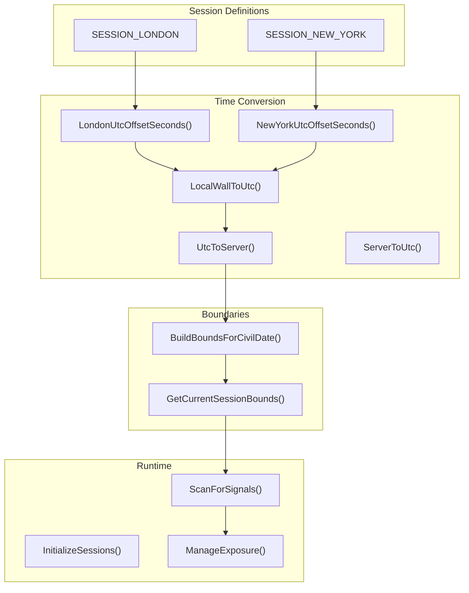
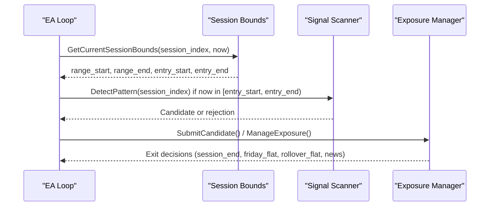
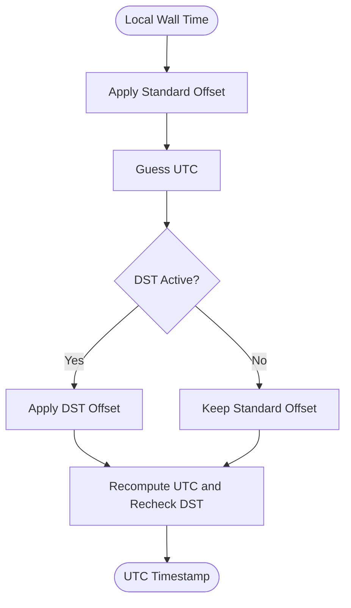
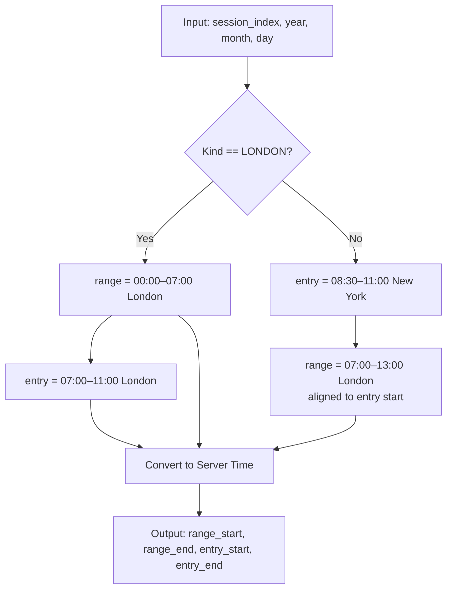
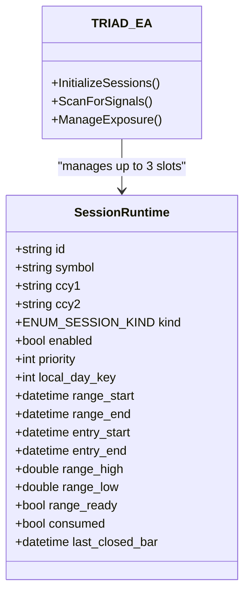
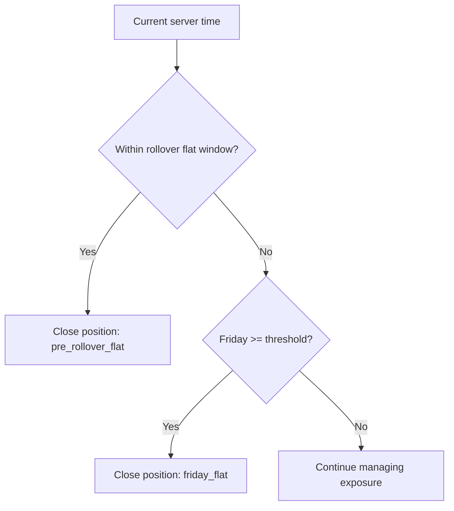
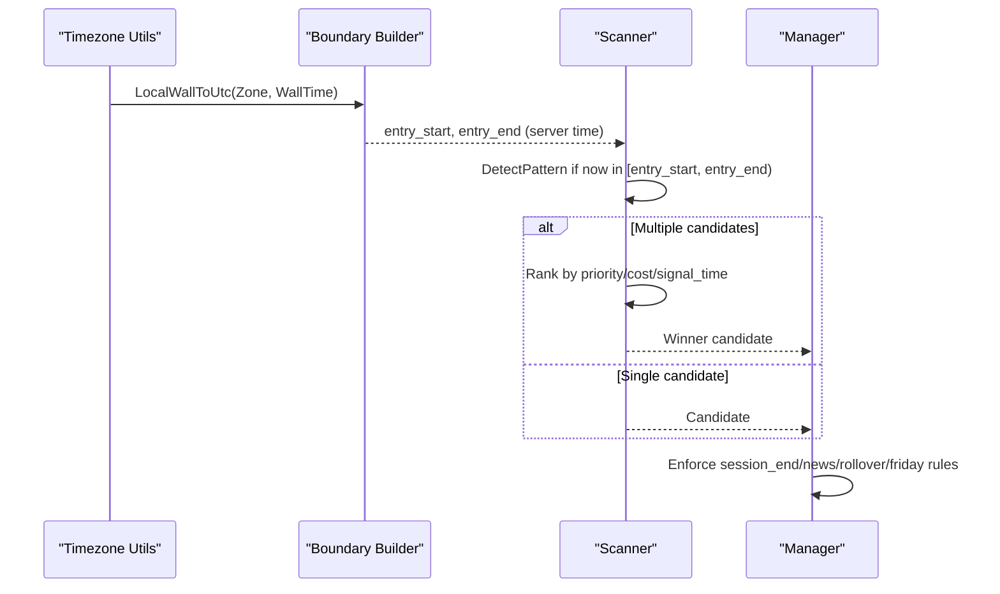
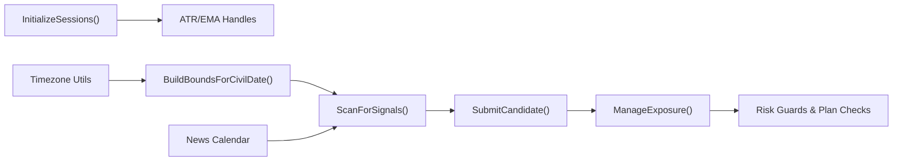

# Session Management

<cite>
**Referenced Files in This Document**
- [TRIAD_R_HS.mq5](file://MQL5/Experts/TRIAD_R_HS/TRIAD_R_HS.mq5)
</cite>

## Table of Contents
1. Introduction
2. Project Structure
3. Core Components
4. Architecture Overview
5. Detailed Component Analysis
6. Dependency Analysis
7. Performance Considerations
8. Troubleshooting Guide
9. Conclusion

## Introduction
This document explains the session management system used to handle London and New York market sessions for specific instrument combinations. It covers:
- Time windows defined in Europe/London and America/New_York timezones, including DST-aware conversions.
- MT5 server timestamp handling and conversion between UTC and server time.
- Session-based routing: EURUSD and GBPUSD are traded during London sessions; USDJPY is traded during New York sessions.
- Implementation details for session boundary detection, rollover handling, Friday cutoff procedures, and edge cases such as DST transitions and overlapping sessions.

## Project Structure
The session logic is implemented within a single Expert Advisor file that defines:
- Session kinds (London, New York).
- Session runtime state structures holding range and entry windows per session slot.
- Timezone conversion utilities for Europe/London and America/New_York with DST rules.
- Boundary builders that compute range_start/range_end and entry_start/entry_end per civil date and session kind.
- A scanning loop that refreshes each session’s bounds and only considers candidates inside the active entry window.
- Exposure management that enforces session-end exits, Friday flat rules, and rollover safety.

**Diagram sources**
- [TRIAD_R_HS.mq5:31-35](file://MQL5/Experts/TRIAD_R_HS/TRIAD_R_HS.mq5#L31-L35)
- [TRIAD_R_HS.mq5:663-701](file://MQL5/Experts/TRIAD_R_HS/TRIAD_R_HS.mq5#L663-L701)
- [TRIAD_R_HS.mq5:754-789](file://MQL5/Experts/TRIAD_R_HS/TRIAD_R_HS.mq5#L754-L789)
- [TRIAD_R_HS.mq5:3950-4001](file://MQL5/Experts/TRIAD_R_HS/TRIAD_R_HS.mq5#L3950-L4001)
- [TRIAD_R_HS.mq5:4003-4099](file://MQL5/Experts/TRIAD_R_HS/TRIAD_R_HS.mq5#L4003-L4099)
- [TRIAD_R_HS.mq5:2942-3284](file://MQL5/Experts/TRIAD_R_HS/TRIAD_R_HS.mq5#L2942-L3284)

**Section sources**
- [TRIAD_R_HS.mq5:31-35](file://MQL5/Experts/TRIAD_R_HS/TRIAD_R_HS.mq5#L31-L35)
- [TRIAD_R_HS.mq5:158-178](file://MQL5/Experts/TRIAD_R_HS/TRIAD_R_HS.mq5#L158-L178)
- [TRIAD_R_HS.mq5:663-701](file://MQL5/Experts/TRIAD_R_HS/TRIAD_R_HS.mq5#L663-L701)
- [TRIAD_R_HS.mq5:754-789](file://MQL5/Experts/TRIAD_R_HS/TRIAD_R_HS.mq5#L754-L789)
- [TRIAD_R_HS.mq5:3950-4001](file://MQL5/Experts/TRIAD_R_HS/TRIAD_R_HS.mq5#L3950-L4001)
- [TRIAD_R_HS.mq5:4003-4099](file://MQL5/Experts/TRIAD_R_HS/TRIAD_R_HS.mq5#L4003-L4099)
- [TRIAD_R_HS.mq5:2942-3284](file://MQL5/Experts/TRIAD_R_HS/TRIAD_R_HS.mq5#L2942-L3284)

## Core Components
- Session kinds and slots: Two session kinds (London, New York) and three session slots are used to represent two London instruments and one New York instrument. Each slot stores symbol, currencies, kind, enabled flag, priority, and dynamic boundaries (range and entry windows).
- Timezone utilities: DST-aware functions compute offsets for London and New York based on UTC timestamps, then convert local wall times to UTC and finally to MT5 server time using a configured offset.
- Boundary builder: For a given civil date and session kind, computes:
  - London: range 00:00–07:00 Europe/London; entry 07:00–11:00 Europe/London.
  - New York: entry 08:30–11:00 America/New_York; range derived from the corresponding London reference window (07:00–13:00 Europe/London) aligned to the New York entry start.
- Session refresh and scan: Each tick, the EA refreshes session bounds, checks if current server time falls within the entry window, and only then evaluates signals.
- Exposure management: Enforces session-end exits, news blackout windows, rollover flat periods, and Friday cutoffs.

**Section sources**
- [TRIAD_R_HS.mq5:31-35](file://MQL5/Experts/TRIAD_R_HS/TRIAD_R_HS.mq5#L31-L35)
- [TRIAD_R_HS.mq5:158-178](file://MQL5/Experts/TRIAD_R_HS/TRIAD_R_HS.mq5#L158-L178)
- [TRIAD_R_HS.mq5:663-701](file://MQL5/Experts/TRIAD_R_HS/TRIAD_R_HS.mq5#L663-L701)
- [TRIAD_R_HS.mq5:754-789](file://MQL5/Experts/TRIAD_R_HS/TRIAD_R_HS.mq5#L754-L789)
- [TRIAD_R_HS.mq5:4003-4099](file://MQL5/Experts/TRIAD_R_HS/TRIAD_R_HS.mq5#L4003-L4099)
- [TRIAD_R_HS.mq5:2942-3284](file://MQL5/Experts/TRIAD_R_HS/TRIAD_R_HS.mq5#L2942-L3284)

## Architecture Overview
The session management architecture centers on timezone-aware boundary computation and strict gating of trading activity to defined entry windows. The flow is:
- Initialize sessions with symbols, kinds, and priorities.
- On each iteration, compute current session bounds using DST-aware conversions and MT5 server time.
- Only consider signal detection when inside the entry window.
- After submission, manage exposure by enforcing session-end exits, news blackout, rollover flat, and Friday cutoff.

**Diagram sources**
- [TRIAD_R_HS.mq5:781-789](file://MQL5/Experts/TRIAD_R_HS/TRIAD_R_HS.mq5#L781-L789)
- [TRIAD_R_HS.mq5:4003-4099](file://MQL5/Experts/TRIAD_R_HS/TRIAD_R_HS.mq5#L4003-L4099)
- [TRIAD_R_HS.mq5:2942-3284](file://MQL5/Experts/TRIAD_R_HS/TRIAD_R_HS.mq5#L2942-L3284)

## Detailed Component Analysis

### Timezone Conversions and DST Awareness
- London DST: Uses last Sunday in March and October to determine BST vs GMT offset (+01:00 vs +00:00).
- New York DST: Uses second Sunday in March and first Sunday in November to determine EDT (-04:00) vs EST (-05:00).
- LocalWallToUtc: Converts a local wall time in either zone to UTC by applying standard offset, estimating DST via the target zone’s rules, then re-evaluating DST at the resulting UTC time for correctness across transition boundaries.
- Server conversions: UtcToServer and ServerToUtc apply a configured expected server UTC offset to align with MT5 server time.

**Diagram sources**
- [TRIAD_R_HS.mq5:663-691](file://MQL5/Experts/TRIAD_R_HS/TRIAD_R_HS.mq5#L663-L691)

**Section sources**
- [TRIAD_R_HS.mq5:663-701](file://MQL5/Experts/TRIAD_R_HS/TRIAD_R_HS.mq5#L663-L701)

### Session Boundaries and Instrument Routing
- London session:
  - Range window: 00:00–07:00 Europe/London.
  - Entry window: 07:00–11:00 Europe/London.
  - Instruments: EURUSD and GBPUSD.
- New York session:
  - Entry window: 08:30–11:00 America/New_York.
  - Range window: Derived from the corresponding London reference range (07:00–13:00 Europe/London), anchored to the New York entry start.
  - Instrument: USDJPY.

Boundary computation steps:
- Determine local date for the session kind using DST-aware GetLocalDate.
- Build bounds using BuildBoundsForCivilDate, which sets range and entry windows according to session kind.
- Convert all computed UTC times to MT5 server time using UtcToServer.

**Diagram sources**
- [TRIAD_R_HS.mq5:754-779](file://MQL5/Experts/TRIAD_R_HS/TRIAD_R_HS.mq5#L754-L779)

**Section sources**
- [TRIAD_R_HS.mq5:754-789](file://MQL5/Experts/TRIAD_R_HS/TRIAD_R_HS.mq5#L754-L789)
- [TRIAD_R_HS.mq5:3950-4001](file://MQL5/Experts/TRIAD_R_HS/TRIAD_R_HS.mq5#L3950-L4001)

### Session-Based Approach for Instrument Combinations
- Initialization assigns:
  - Slot 0: EURUSD, SESSION_LONDON, enabled/priority configurable.
  - Slot 1: GBPUSD, SESSION_LONDON, enabled/priority configurable.
  - Slot 2: USDJPY, SESSION_NEW_YORK, enabled/priority configurable.
- Scanning iterates over sessions, refreshing bounds and only considering candidates within the active entry window.
- Collisions between multiple valid candidates are resolved by configured priority, then cost-to-R, then earliest signal bar, then stable index.

**Diagram sources**
- [TRIAD_R_HS.mq5:158-178](file://MQL5/Experts/TRIAD_R_HS/TRIAD_R_HS.mq5#L158-L178)
- [TRIAD_R_HS.mq5:3950-4001](file://MQL5/Experts/TRIAD_R_HS/TRIAD_R_HS.mq5#L3950-L4001)
- [TRIAD_R_HS.mq5:4003-4099](file://MQL5/Experts/TRIAD_R_HS/TRIAD_R_HS.mq5#L4003-L4099)

**Section sources**
- [TRIAD_R_HS.mq5:3950-4001](file://MQL5/Experts/TRIAD_R_HS/TRIAD_R_HS.mq5#L3950-L4001)
- [TRIAD_R_HS.mq5:4003-4099](file://MQL5/Experts/TRIAD_R_HS/TRIAD_R_HS.mq5#L4003-L4099)

### Rollover Handling and Friday Cutoff Procedures
- Rollover flat: Positions are closed before rollover using a configurable minutes-before-midnight window plus a safety lead.
- Friday cutoff: Positions are closed after a fixed London-time threshold on Fridays to avoid weekend exposure.
- Missed rollover exposure: The system detects if history was unavailable around rollover and halts safely if necessary, persisting incident keys for auditability.

**Diagram sources**
- [TRIAD_R_HS.mq5:3157-3183](file://MQL5/Experts/TRIAD_R_HS/TRIAD_R_HS.mq5#L3157-L3183)
- [TRIAD_R_HS.mq5:3290-3428](file://MQL5/Experts/TRIAD_R_HS/TRIAD_R_HS.mq5#L3290-L3428)

**Section sources**
- [TRIAD_R_HS.mq5:3157-3183](file://MQL5/Experts/TRIAD_R_HS/TRIAD_R_HS.mq5#L3157-L3183)
- [TRIAD_R_HS.mq5:3290-3428](file://MQL5/Experts/TRIAD_R_HS/TRIAD_R_HS.mq5#L3290-L3428)

### Edge Cases: DST Transitions and Session Overlaps
- DST transitions:
  - London: Offsets change on last Sundays of March and October; LocalWallToUtc recomputes DST at both guess and final UTC to ensure correct boundaries.
  - New York: Offsets change on second Sunday of March and first Sunday of November; similar recomputation ensures robustness.
- Session overlaps:
  - New York entry window can overlap with London range; the system derives New York range from London’s reference window but gates entries strictly to the New York entry window.
  - Collision handling: If multiple sessions produce candidates simultaneously, priority and cost-to-R resolve the winner; losers are rejected and logged.

**Diagram sources**
- [TRIAD_R_HS.mq5:663-691](file://MQL5/Experts/TRIAD_R_HS/TRIAD_R_HS.mq5#L663-L691)
- [TRIAD_R_HS.mq5:754-789](file://MQL5/Experts/TRIAD_R_HS/TRIAD_R_HS.mq5#L754-L789)
- [TRIAD_R_HS.mq5:4003-4099](file://MQL5/Experts/TRIAD_R_HS/TRIAD_R_HS.mq5#L4003-L4099)
- [TRIAD_R_HS.mq5:2942-3284](file://MQL5/Experts/TRIAD_R_HS/TRIAD_R_HS.mq5#L2942-L3284)

**Section sources**
- [TRIAD_R_HS.mq5:663-691](file://MQL5/Experts/TRIAD_R_HS/TRIAD_R_HS.mq5#L663-L691)
- [TRIAD_R_HS.mq5:754-789](file://MQL5/Experts/TRIAD_R_HS/TRIAD_R_HS.mq5#L754-L789)
- [TRIAD_R_HS.mq5:4003-4099](file://MQL5/Experts/TRIAD_R_HS/TRIAD_R_HS.mq5#L4003-L4099)
- [TRIAD_R_HS.mq5:2942-3284](file://MQL5/Experts/TRIAD_R_HS/TRIAD_R_HS.mq5#L2942-L3284)

## Dependency Analysis
Key dependencies and relationships:
- Session initialization depends on symbol availability and indicator handles (ATR, H1 EMA). Invalid handles halt or warn accordingly.
- Boundary computation depends on DST-aware timezone utilities and MT5 server offset configuration.
- Scanning depends on refreshed session bounds and news calendar validity.
- Exposure management depends on plan persistence, quote freshness, and risk guards.

**Diagram sources**
- [TRIAD_R_HS.mq5:3950-4001](file://MQL5/Experts/TRIAD_R_HS/TRIAD_R_HS.mq5#L3950-L4001)
- [TRIAD_R_HS.mq5:754-789](file://MQL5/Experts/TRIAD_R_HS/TRIAD_R_HS.mq5#L754-L789)
- [TRIAD_R_HS.mq5:4003-4099](file://MQL5/Experts/TRIAD_R_HS/TRIAD_R_HS.mq5#L4003-L4099)
- [TRIAD_R_HS.mq5:2942-3284](file://MQL5/Experts/TRIAD_R_HS/TRIAD_R_HS.mq5#L2942-L3284)

**Section sources**
- [TRIAD_R_HS.mq5:3950-4001](file://MQL5/Experts/TRIAD_R_HS/TRIAD_R_HS.mq5#L3950-L4001)
- [TRIAD_R_HS.mq5:754-789](file://MQL5/Experts/TRIAD_R_HS/TRIAD_R_HS.mq5#L754-L789)
- [TRIAD_R_HS.mq5:4003-4099](file://MQL5/Experts/TRIAD_R_HS/TRIAD_R_HS.mq5#L4003-L4099)
- [TRIAD_R_HS.mq5:2942-3284](file://MQL5/Experts/TRIAD_R_HS/TRIAD_R_HS.mq5#L2942-L3284)

## Performance Considerations
- History reads for range and statistics are bounded by expected bar counts and validated against continuity gaps to avoid stale or incomplete data.
- Indicator handles are reused per session slot to minimize overhead.
- Quote freshness checks prevent processing on stale ticks.
- Safety leads reduce boundary misalignment risks near session edges.

[No sources needed since this section provides general guidance]

## Troubleshooting Guide
Common issues and their handling:
- Stale or invalid news calendar: Halts or blocks trading until coverage is sufficient.
- Missing or mismatched trade plan: Deletes pending orders or closes positions and halts to prevent unmanaged exposure.
- Order submission failures: Cleans up any uncertain orders and halts to ensure fail-closed behavior.
- Rollover history unavailable: Halts and requires migration/rebaseline to maintain integrity.
- Friday cutoff and session-end exits: Ensure positions are closed appropriately to avoid unintended weekend exposure.

**Section sources**
- [TRIAD_R_HS.mq5:836-918](file://MQL5/Experts/TRIAD_R_HS/TRIAD_R_HS.mq5#L836-L918)
- [TRIAD_R_HS.mq5:2942-3284](file://MQL5/Experts/TRIAD_R_HS/TRIAD_R_HS.mq5#L2942-L3284)
- [TRIAD_R_HS.mq5:3290-3428](file://MQL5/Experts/TRIAD_R_HS/TRIAD_R_HS.mq5#L3290-L3428)

## Conclusion
The session management system implements precise, DST-aware boundaries for London and New York sessions, routing EURUSD/GBPUSD to London and USDJPY to New York. It enforces strict entry windows, manages rollover and Friday cutoffs, and integrates news blackout checks. The design prioritizes safety through fail-closed mechanisms, plan reconciliation, and robust error handling, ensuring reliable operation across DST transitions and overlapping sessions.

[No sources needed since this section summarizes without analyzing specific files]