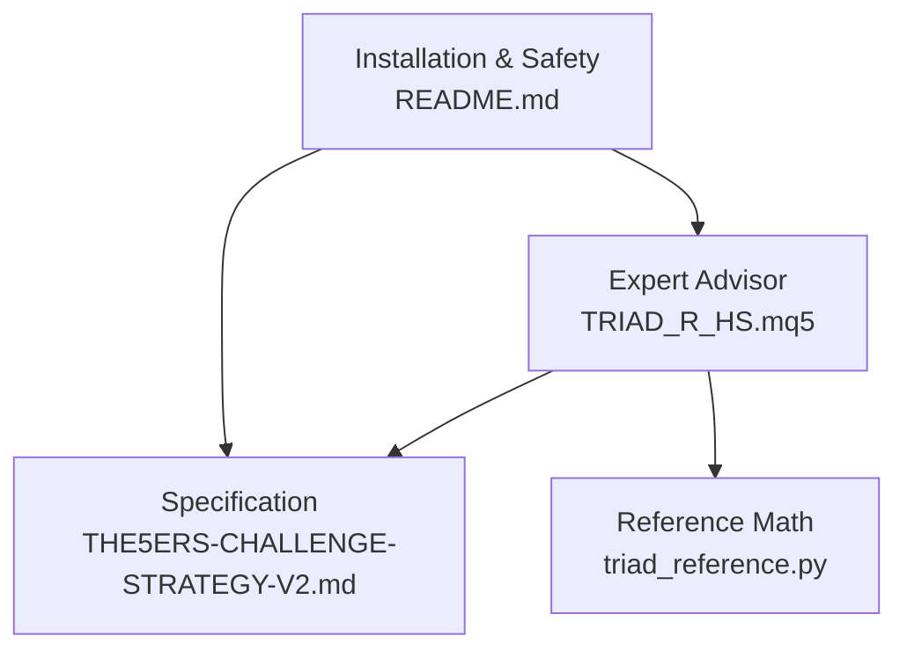
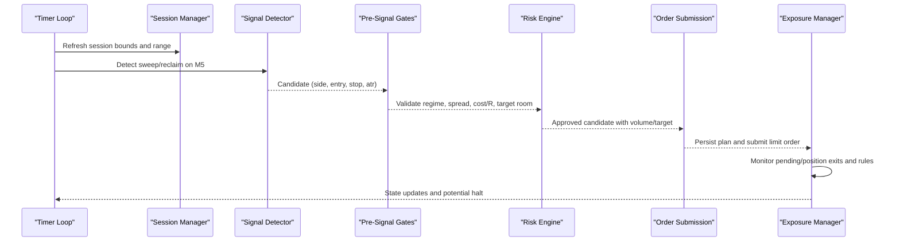
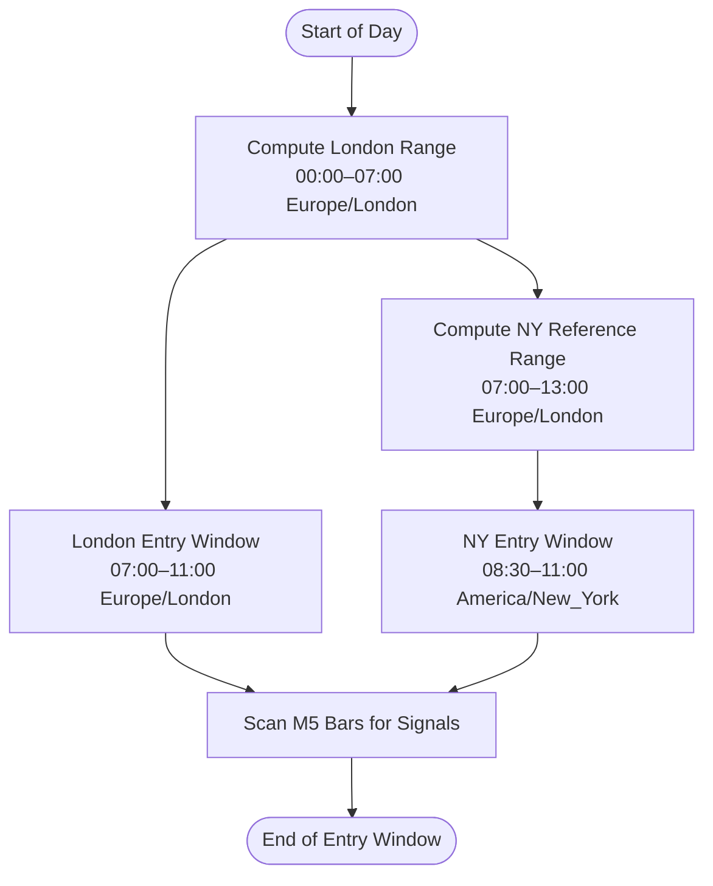
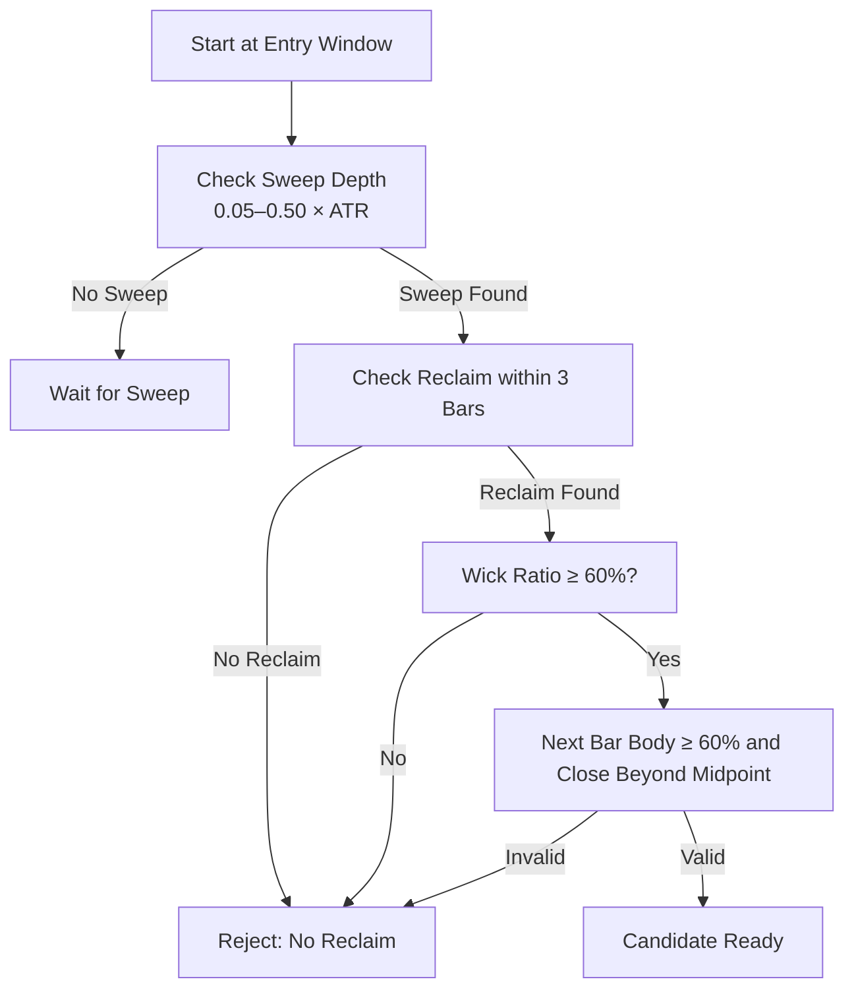
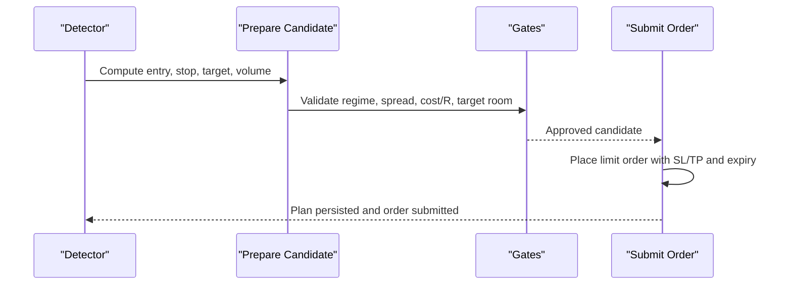
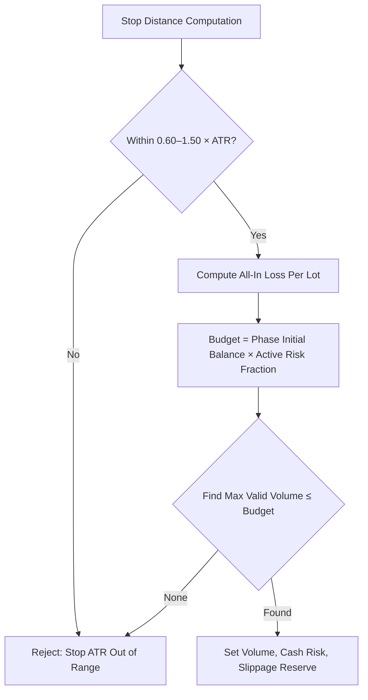
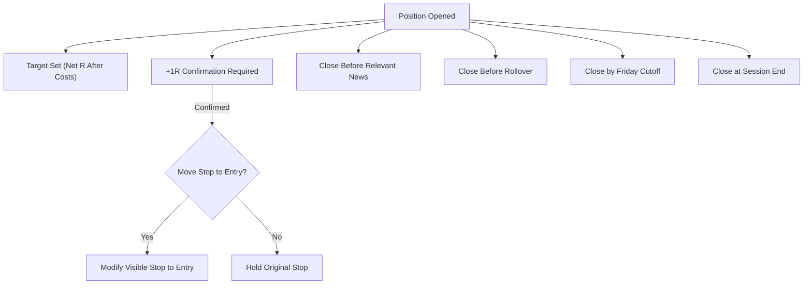
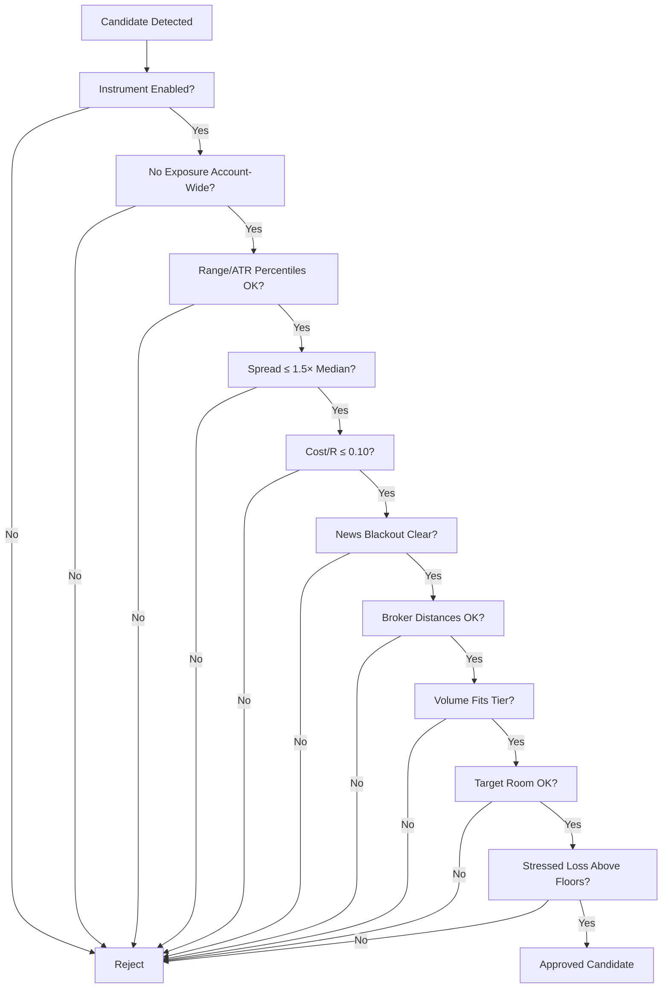
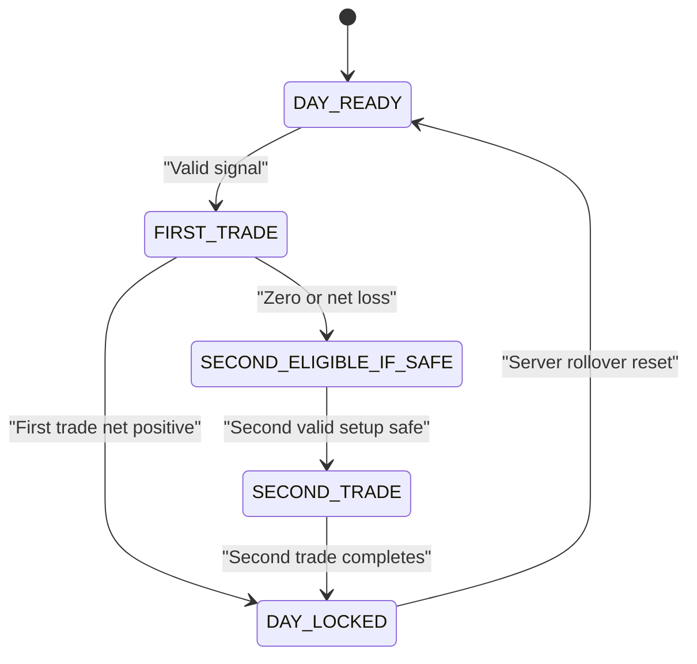
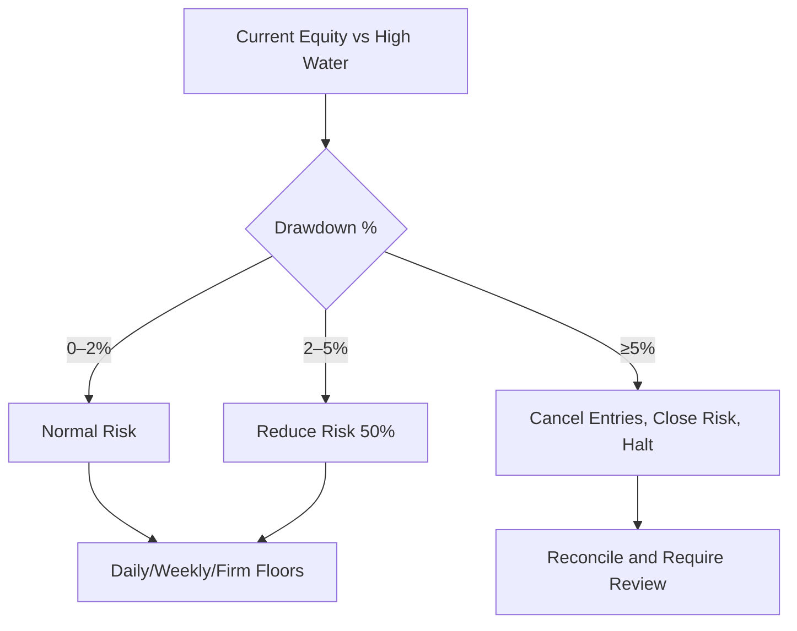

# Strategy Specification

<cite>
**Referenced Files in This Document**
- [TRIAD_R_HS.mq5](file://MQL5/Experts/TRIAD_R_HS/TRIAD_R_HS.mq5)
- [README.md](file://MQL5/Experts/TRIAD_R_HS/README.md)
- [THE5ERS-CHALLENGE-STRATEGY-V2.md](file://THE5ERS-CHALLENGE-STRATEGY-V2.md)
- [triad_reference.py](file://tests/triad_reference.py)
</cite>

## Table of Contents
1. [Introduction](#introduction)
2. [Project Structure](#project-structure)
3. [Core Components](#core-components)
4. [Architecture Overview](#architecture-overview)
5. [Detailed Component Analysis](#detailed-component-analysis)
6. [Dependency Analysis](#dependency-analysis)
7. [Performance Considerations](#performance-considerations)
8. [Troubleshooting Guide](#troubleshooting-guide)
9. [Conclusion](#conclusion)

## Introduction
This document specifies the TRIAD-R strategy for The5ers High Stakes evaluation. It covers session-based trading (London and New York), sweep/reclaim pattern detection, entry sequence rules, risk sizing, exits, daily operating state machine, pre-signal gates, drawdown controls, and compliance requirements. It maps these rules to the MQL5 implementation and provides diagrams that show how components interact during signal detection, order submission, and position management.

## Project Structure
The repository contains:
- A fail-closed MQL5 Expert Advisor implementing the strategy on MT5.
- A canonical specification describing immutable rules, validation, and lifecycle.
- A Python reference module used by tests to validate arithmetic and logic contracts.
- Documentation and review notes guiding safe installation and validation.

**Diagram sources**
- [TRIAD_R_HS.mq5:1-100](file://MQL5/Experts/TRIAD_R_HS/TRIAD_R_HS.mq5#L1-L100)
- [THE5ERS-CHALLENGE-STRATEGY-V2.md:1-120](file://THE5ERS-CHALLENGE-STRATEGY-V2.md#L1-L120)
- [triad_reference.py:1-167](file://tests/triad_reference.py#L1-L167)
- [README.md:1-120](file://MQL5/Experts/TRIAD_R_HS/README.md#L1-L120)

**Section sources**
- [TRIAD_R_HS.mq5:1-120](file://MQL5/Experts/TRIAD_R_HS/TRIAD_R_HS.mq5#L1-L120)
- [THE5ERS-CHALLENGE-STRATEGY-V2.md:1-120](file://THE5ERS-CHALLENGE-STRATEGY-V2.md#L1-L120)
- [README.md:1-120](file://MQL5/Experts/TRIAD_R_HS/README.md#L1-L120)

## Core Components
- Sessions: London and New York with defined reference ranges and entry windows.
- Signal detector: Sweep/reclaim pattern recognition on M5 bars with displacement confirmation.
- Risk engine: Cash-risk sizing using symbol economics, volume rounding, and drawdown tiers.
- Exit engine: Target solving, +1R confirmation, optional stop-to-entry move, time/session/news rollover exits.
- Daily state machine: One-position policy, first-trade lock, second-trade eligibility, day locking.
- Pre-signal gates: Range/ATR/spread regimes, news blackout, broker distances, cost/R, target room, firm floors.
- Lifecycle and compliance: Product identity, phase targets, payout/scale locks, The5ers constraints.

**Section sources**
- [TRIAD_R_HS.mq5:150-220](file://MQL5/Experts/TRIAD_R_HS/TRIAD_R_HS.mq5#L150-L220)
- [THE5ERS-CHALLENGE-STRATEGY-V2.md:54-183](file://THE5ERS-CHALLENGE-STRATEGY-V2.md#L54-L183)

## Architecture Overview
The EA runs a timer-driven loop that:
- Refreshes session bounds and range statistics.
- Scans M5 bars to detect sweep/reclaim patterns.
- Validates candidates through mandatory gates.
- Submits one limit order per candidate with SL/TP and expiry.
- Manages exposure: pending order cleanup, position exits, breakeven moves, forced flats.
- Enforces daily/weekly/firm limits and drawdown controls.
- Persists state across rollovers and restarts.

**Diagram sources**
- [TRIAD_R_HS.mq5:1867-1909](file://MQL5/Experts/TRIAD_R_HS/TRIAD_R_HS.mq5#L1867-L1909)
- [TRIAD_R_HS.mq5:1936-2116](file://MQL5/Experts/TRIAD_R_HS/TRIAD_R_HS.mq5#L1936-L2116)
- [TRIAD_R_HS.mq5:2380-2522](file://MQL5/Experts/TRIAD_R_HS/TRIAD_R_HS.mq5#L2380-L2522)
- [TRIAD_R_HS.mq5:2692-2901](file://MQL5/Experts/TRIAD_R_HS/TRIAD_R_HS.mq5#L2692-L2901)
- [TRIAD_R_HS.mq5:2942-3284](file://MQL5/Experts/TRIAD_R_HS/TRIAD_R_HS.mq5#L2942-L3284)

## Detailed Component Analysis

### Session Definitions and Time Boundaries
- Reference range: London 00:00–07:00 Europe/London; New York uses London 07:00–13:00 Europe/London.
- Entry window: London 07:00–11:00 Europe/London; New York 08:30–11:00 America/New_York.
- Civil-time conversion accounts for DST differences between London and New York.
- Server rollover boundaries are enforced separately from session times.

**Diagram sources**
- [TRIAD_R_HS.mq5:754-789](file://MQL5/Experts/TRIAD_R_HS/TRIAD_R_HS.mq5#L754-L789)
- [THE5ERS-CHALLENGE-STRATEGY-V2.md:54-72](file://THE5ERS-CHALLENGE-STRATEGY-V2.md#L54-L72)

**Section sources**
- [TRIAD_R_HS.mq5:754-789](file://MQL5/Experts/TRIAD_R_HS/TRIAD_R_HS.mq5#L754-L789)
- [THE5ERS-CHALLENGE-STRATEGY-V2.md:54-72](file://THE5ERS-CHALLENGE-STRATEGY-V2.md#L54-L72)

### Sweep/Reclaim Pattern Recognition Logic
- Sweep depth: Price must breach reference low/high by 0.05–0.50 × ATR(M15,14).
- Reclaim: Within three completed M5 bars after the sweep, price closes back inside the range with a strong wick (≥60% of bar range).
- Displacement: Next completed M5 bar must have a body ≥60% of its range and close beyond the reclaim midpoint.
- Ambiguity and invalidation: Deep sweeps, opposite-side breaches, weak displacement, or stale signals reject the event.

**Diagram sources**
- [TRIAD_R_HS.mq5:1936-2116](file://MQL5/Experts/TRIAD_R_HS/TRIAD_R_HS.mq5#L1936-L2116)

**Section sources**
- [TRIAD_R_HS.mq5:1936-2116](file://MQL5/Experts/TRIAD_R_HS/TRIAD_R_HS.mq5#L1936-L2116)
- [THE5ERS-CHALLENGE-STRATEGY-V2.md:98-115](file://THE5ERS-CHALLENGE-STRATEGY-V2.md#L98-L115)

### Entry Sequence Requirements and Timing Constraints
- Limit order placed at 50% retracement of displacement candle body.
- Stop and target attached in initial request; target solved for net R after commission and slippage allowance.
- Expiry: Cancel after three completed M5 bars, at session cutoff, before news buffer, or if theoretical +1R is reached without fill.
- No market chase after expired limit; one signal event per session produces at most one order.

**Diagram sources**
- [TRIAD_R_HS.mq5:2380-2522](file://MQL5/Experts/TRIAD_R_HS/TRIAD_R_HS.mq5#L2380-L2522)
- [TRIAD_R_HS.mq5:2692-2901](file://MQL5/Experts/TRIAD_R_HS/TRIAD_R_HS.mq5#L2692-L2901)
- [THE5ERS-CHALLENGE-STRATEGY-V2.md:98-115](file://THE5ERS-CHALLENGE-STRATEGY-V2.md#L98-L115)

**Section sources**
- [TRIAD_R_HS.mq5:2380-2522](file://MQL5/Experts/TRIAD_R_HS/TRIAD_R_HS.mq5#L2380-L2522)
- [TRIAD_R_HS.mq5:2692-2901](file://MQL5/Experts/TRIAD_R_HS/TRIAD_R_HS.mq5#L2692-L2901)
- [THE5ERS-CHALLENGE-STRATEGY-V2.md:98-115](file://THE5ERS-CHALLENGE-STRATEGY-V2.md#L98-L115)

### Stop Loss and Position Sizing Calculations
- Stop placement: For longs, stop below sweep low minus 0.10 × ATR; for shorts, above sweep high plus 0.10 × ATR.
- Stop distance must be within 0.60–1.50 × ATR.
- Cash risk: Use live symbol economics via profit calculation, include commission and slippage reserve.
- Volume selection: Largest valid step-rounded lot not exceeding budget; minimum lot respected; directional limits applied.

**Diagram sources**
- [TRIAD_R_HS.mq5:2217-2271](file://MQL5/Experts/TRIAD_R_HS/TRIAD_R_HS.mq5#L2217-L2271)
- [THE5ERS-CHALLENGE-STRATEGY-V2.md:117-148](file://THE5ERS-CHALLENGE-STRATEGY-V2.md#L117-L148)

**Section sources**
- [TRIAD_R_HS.mq5:2217-2271](file://MQL5/Experts/TRIAD_R_HS/TRIAD_R_HS.mq5#L2217-L2271)
- [THE5ERS-CHALLENGE-STRATEGY-V2.md:117-148](file://THE5ERS-CHALLENGE-STRATEGY-V2.md#L117-L148)

### Exit Engine Specifications
- Target solving: Solve take-profit so estimated net target equals profile’s target R after commission and configured slippage allowance.
- +1R confirmation: Requires a completed M5 close at or beyond +1R level; tick/wick touch does not qualify.
- Optional bounded breakeven: Move visible stop to entry after confirmed +1R, with retry limits and persistence checks.
- Forced flat rules: Before news events, rollover, Friday cutoff, and session end.

**Diagram sources**
- [TRIAD_R_HS.mq5:2273-2309](file://MQL5/Experts/TRIAD_R_HS/TRIAD_R_HS.mq5#L2273-L2309)
- [TRIAD_R_HS.mq5:3132-3284](file://MQL5/Experts/TRIAD_R_HS/TRIAD_R_HS.mq5#L3132-L3284)
- [THE5ERS-CHALLENGE-STRATEGY-V2.md:150-183](file://THE5ERS-CHALLENGE-STRATEGY-V2.md#L150-L183)

**Section sources**
- [TRIAD_R_HS.mq5:2273-2309](file://MQL5/Experts/TRIAD_R_HS/TRIAD_R_HS.mq5#L2273-L2309)
- [TRIAD_R_HS.mq5:3132-3284](file://MQL5/Experts/TRIAD_R_HS/TRIAD_R_HS.mq5#L3132-L3284)
- [THE5ERS-CHALLENGE-STRATEGY-V2.md:150-183](file://THE5ERS-CHALLENGE-STRATEGY-V2.md#L150-L183)

### Mandatory Pre-Signal Gates
- Instrument/session enabled by locked configuration.
- No working entry or open position account-wide.
- Range width and ATR within historical percentile bands computed over prior 60 comparable sessions.
- Spread no more than 1.5× median for same symbol and minute-of-session.
- Estimated all-in round-trip cost ≤ 0.10R.
- No red-folder news within 30 minutes for relevant currencies; calendar coverage must be current.
- Quote age, bar state, symbol properties, and calendar state valid.
- Execution health within tested latency/slippage bounds.
- Stop/target satisfy broker stop/freeze levels.
- Rounded volume does not exceed active risk tier.
- Target fits inside reference range.
- Projected stressed loss remains above internal and firm safety floors.

**Diagram sources**
- [TRIAD_R_HS.mq5:2428-2517](file://MQL5/Experts/TRIAD_R_HS/TRIAD_R_HS.mq5#L2428-L2517)
- [THE5ERS-CHALLENGE-STRATEGY-V2.md:74-96](file://THE5ERS-CHALLENGE-STRATEGY-V2.md#L74-L96)

**Section sources**
- [TRIAD_R_HS.mq5:2428-2517](file://MQL5/Experts/TRIAD_R_HS/TRIAD_R_HS.mq5#L2428-L2517)
- [THE5ERS-CHALLENGE-STRATEGY-V2.md:74-96](file://THE5ERS-CHALLENGE-STRATEGY-V2.md#L74-L96)

### Daily Operating State Machine
- States: DAY_READY → FIRST_TRADE → {NET_POSITIVE: DAY_LOCKED, NET_NONPOSITIVE: SECOND_ELIGIBLE_IF_SAFE} → SECOND_TRADE → DAY_LOCKED.
- First trade net positive locks the day regardless of dollar amount.
- After zero or net-loss first exit, one second independently valid setup may trade only if stressed outcome remains within all limits.
- Second completed trade always locks the day.
- Locking cancels working entries and prevents retries; reset occurs at confirmed server rollover.

**Diagram sources**
- [THE5ERS-CHALLENGE-STRATEGY-V2.md:224-240](file://THE5ERS-CHALLENGE-STRATEGY-V2.md#L224-L240)
- [TRIAD_R_HS.mq5:1593-1619](file://MQL5/Experts/TRIAD_R_HS/TRIAD_R_HS.mq5#L1593-L1619)

**Section sources**
- [THE5ERS-CHALLENGE-STRATEGY-V2.md:224-240](file://THE5ERS-CHALLENGE-STRATEGY-V2.md#L224-L240)
- [TRIAD_R_HS.mq5:1593-1619](file://MQL5/Experts/TRIAD_R_HS/TRIAD_R_HS.mq5#L1593-L1619)

### Risk Tiers and Drawdown Controls
- Profiles: Paired risk/target combinations (A: 0.40%/+1.5R; B: 0.35%/+1.75R; C: 0.30%/+2.0R; D: 0.25%/+2.5R).
- Drawdown throttle: At 2–5% drawdown, risk halves; at ≥5%, entries cancel and strategy halts.
- Internal daily stop: -1.0% from day start balance; weekly stop: -2.0% from week start balance.
- Two full losses stop the day even if -1% limit not reached.
- Firm floors: Overall floor at 90% of phase initial balance; daily floor at 95% of rollover balance/equity; reserve added to prevent crossing floors.

**Diagram sources**
- [THE5ERS-CHALLENGE-STRATEGY-V2.md:185-222](file://THE5ERS-CHALLENGE-STRATEGY-V2.md#L185-L222)
- [TRIAD_R_HS.mq5:1621-1712](file://MQL5/Experts/TRIAD_R_HS/TRIAD_R_HS.mq5#L1621-L1712)

**Section sources**
- [THE5ERS-CHALLENGE-STRATEGY-V2.md:185-222](file://THE5ERS-CHALLENGE-STRATEGY-V2.md#L185-L222)
- [TRIAD_R_HS.mq5:1621-1712](file://MQL5/Experts/TRIAD_R_HS/TRIAD_R_HS.mq5#L1621-L1712)

### The5ers Compliance Requirements
- One working entry or one open position account-wide; no simultaneous positions or copier usage.
- No grid, martingale, averaging, hedge, recovery trades, HFT, tick scalping, arbitrage, emulator, stealth stop.
- Broker-visible stop attached to every entry.
- No new entry or working entry within 30 minutes of relevant red-folder news.
- No market chase after expired limit.
- Maximum two completed sequential trades per server day.
- Volume rounded down; never increase size to satisfy profitable-day threshold.
- Long and short rules exact mirrors; no forced direction alternation.
- Runtime optimization and automatic parameter mutation disabled.
- Rate-limited trade actions: at most one revalidated retry after transient rejection; default cap of 20 non-emergency requests per server day.

**Section sources**
- [THE5ERS-CHALLENGE-STRATEGY-V2.md:32-50](file://THE5ERS-CHALLENGE-STRATEGY-V2.md#L32-L50)
- [TRIAD_R_HS.mq5:2528-2558](file://MQL5/Experts/TRIAD_R_HS/TRIAD_R_HS.mq5#L2528-L2558)

### Concrete Examples from Implementation
- Sweep/reclaim detection scans M5 bars within the entry window, computes sweep depth relative to ATR, validates reclaim wick strength, and requires displacement confirmation before producing a candidate.
- Candidate preparation sets entry at midpoint of displacement body, stop based on sweep extreme plus buffer, and solves target for net R after costs.
- Order submission persists expected plan fields, submits limit order with SL/TP and specified expiry, and reconciles accepted orders immediately.
- Exposure management enforces one-position invariant, validates visible exits, handles missing stops with repair attempts, and forces flat before news/rollover/Friday/session end.

**Section sources**
- [TRIAD_R_HS.mq5:1936-2116](file://MQL5/Experts/TRIAD_R_HS/TRIAD_R_HS.mq5#L1936-L2116)
- [TRIAD_R_HS.mq5:2380-2522](file://MQL5/Experts/TRIAD_R_HS/TRIAD_R_HS.mq5#L2380-L2522)
- [TRIAD_R_HS.mq5:2692-2901](file://MQL5/Experts/TRIAD_R_HS/TRIAD_R_HS.mq5#L2692-L2901)
- [TRIAD_R_HS.mq5:2942-3284](file://MQL5/Experts/TRIAD_R_HS/TRIAD_R_HS.mq5#L2942-L3284)

## Dependency Analysis
Key dependencies and relationships:
- Session manager depends on civil-time conversion and DST-aware bounds.
- Signal detector depends on M5 rates, ATR(M15,14), and range statistics.
- Risk engine depends on symbol properties, profit calculations, and volume grids.
- Exposure manager depends on order/position history, global variables, and safety throttles.
- Lifecycle controls depend on product code, phase targets, and dashboard-confirmed days.

**Diagram sources**
- [TRIAD_R_HS.mq5:754-789](file://MQL5/Experts/TRIAD_R_HS/TRIAD_R_HS.mq5#L754-L789)
- [TRIAD_R_HS.mq5:1936-2116](file://MQL5/Experts/TRIAD_R_HS/TRIAD_R_HS.mq5#L1936-L2116)
- [TRIAD_R_HS.mq5:2380-2522](file://MQL5/Experts/TRIAD_R_HS/TRIAD_R_HS.mq5#L2380-L2522)
- [TRIAD_R_HS.mq5:2692-2901](file://MQL5/Experts/TRIAD_R_HS/TRIAD_R_HS.mq5#L2692-L2901)
- [TRIAD_R_HS.mq5:2942-3284](file://MQL5/Experts/TRIAD_R_HS/TRIAD_R_HS.mq5#L2942-L3284)

**Section sources**
- [TRIAD_R_HS.mq5:754-789](file://MQL5/Experts/TRIAD_R_HS/TRIAD_R_HS.mq5#L754-L789)
- [TRIAD_R_HS.mq5:1936-2116](file://MQL5/Experts/TRIAD_R_HS/TRIAD_R_HS.mq5#L1936-L2116)
- [TRIAD_R_HS.mq5:2380-2522](file://MQL5/Experts/TRIAD_R_HS/TRIAD_R_HS.mq5#L2380-L2522)
- [TRIAD_R_HS.mq5:2692-2901](file://MQL5/Experts/TRIAD_R_HS/TRIAD_R_HS.mq5#L2692-L2901)
- [TRIAD_R_HS.mq5:2942-3284](file://MQL5/Experts/TRIAD_R_HS/TRIAD_R_HS.mq5#L2942-L3284)

## Performance Considerations
- Historical statistics loading can be expensive; candidates refresh quote-derived fields immediately before ranking to avoid stale quotes.
- Timer cadence and one-second synchronous request latency are constrained to prevent boundary crossings.
- Volume rounding and symbol limits ensure executable sizes without violating minimums or directional caps.
- Cost/R and spread gates reduce execution variance and improve fill reliability.

[No sources needed since this section provides general guidance]

## Troubleshooting Guide
Common issues and resolutions:
- Calendar coverage stale: Ensure triad_red_news.csv includes an explicit ALL,COVERAGE row covering required hours; reload at rollover.
- Insufficient history: Load enough comparable sessions to meet the 60-session requirement; otherwise signals are rejected until sufficient data exists.
- Duplicate instance: Only one live-order instance per account; terminal globals enforce ownership and heartbeat fencing.
- Missing visible stop/target: Immediate repair attempt; if failed, close position and halt for review.
- Audit log failure: Emergency safety requests remain permitted; non-emergency operations halted until log recovers.

**Section sources**
- [TRIAD_R_HS.mq5:836-918](file://MQL5/Experts/TRIAD_R_HS/TRIAD_R_HS.mq5#L836-L918)
- [TRIAD_R_HS.mq5:1160-1223](file://MQL5/Experts/TRIAD_R_HS/TRIAD_R_HS.mq5#L1160-L1223)
- [TRIAD_R_HS.mq5:494-566](file://MQL5/Experts/TRIAD_R_HS/TRIAD_R_HS.mq5#L494-L566)
- [TRIAD_R_HS.mq5:3105-3130](file://MQL5/Experts/TRIAD_R_HS/TRIAD_R_HS.mq5#L3105-L3130)
- [TRIAD_R_HS.mq5:298-327](file://MQL5/Experts/TRIAD_R_HS/TRIAD_R_HS.mq5#L298-L327)

## Conclusion
The TRIAD-R strategy implements a disciplined, session-based approach targeting London and New York sessions with strict sweep/reclaim pattern recognition, robust pre-signal gates, conservative risk sizing, and comprehensive exit management. The daily operating state machine enforces one-position discipline and limits daily activity. Drawdown controls and firm-floor protections align with The5ers compliance requirements. The MQL5 implementation is fail-closed, heavily validated, and designed for safe research and forward testing before any challenge activation.

[No sources needed since this section summarizes without analyzing specific files]