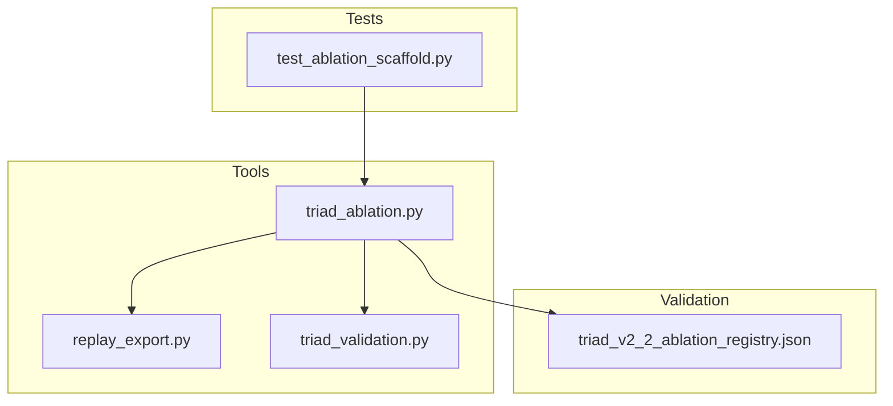
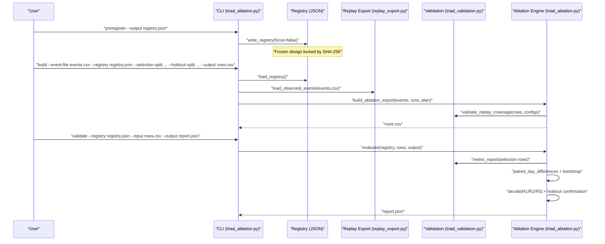
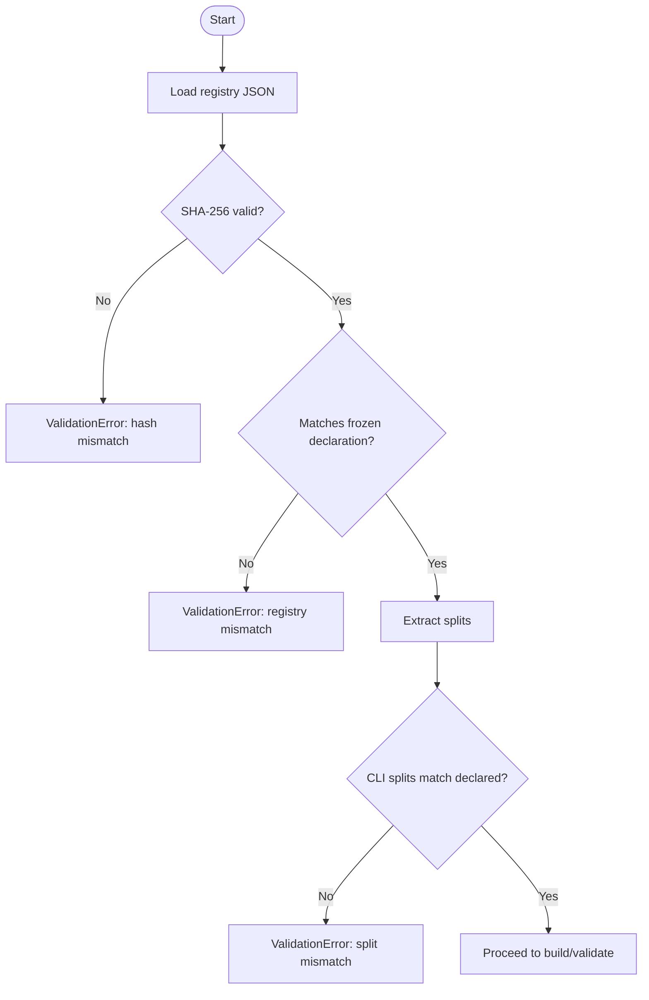
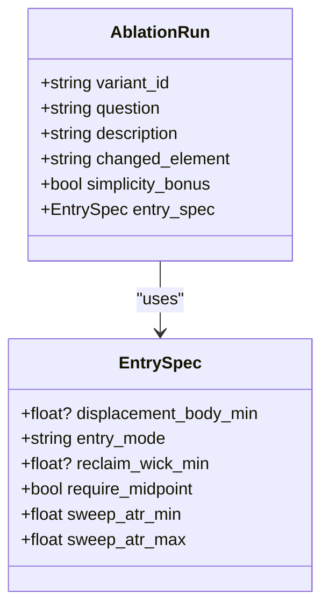
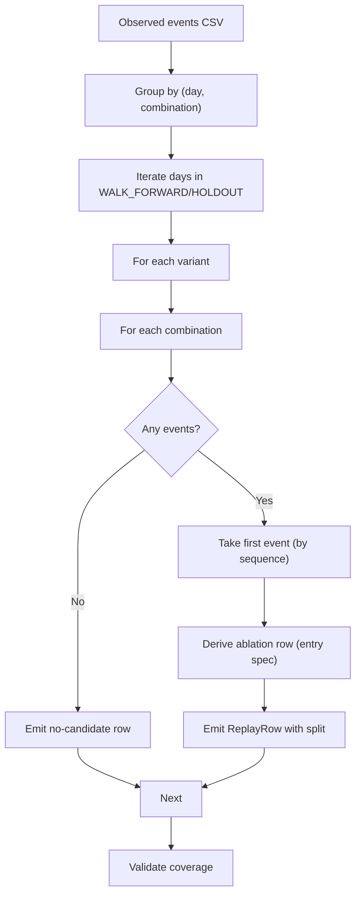
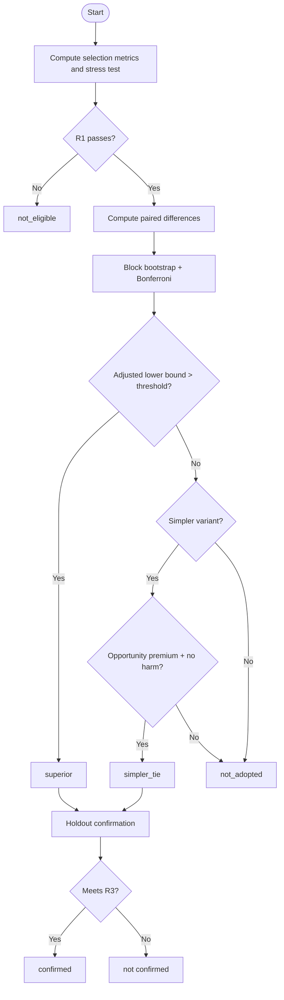
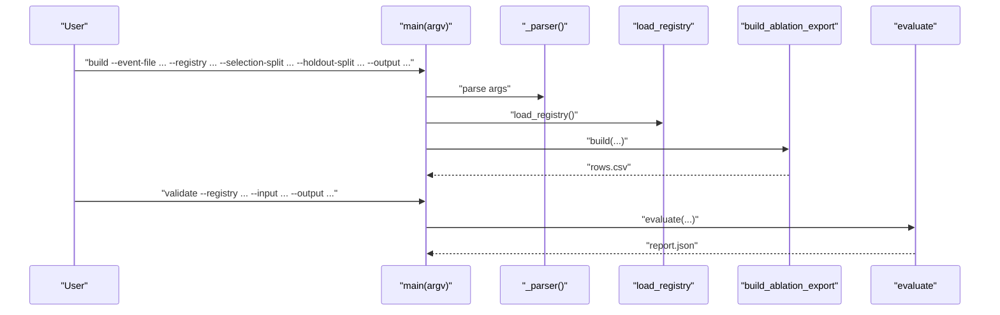
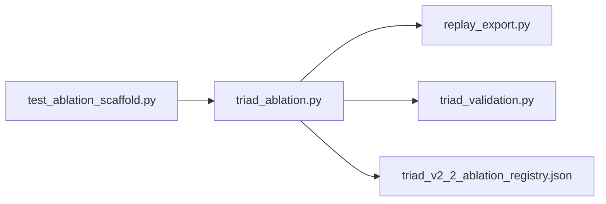

# Ablation Study Framework

<cite>
**Referenced Files in This Document**
- [triad_ablation.py](file://tools/triad_ablation.py)
- [test_ablation_scaffold.py](file://tests/test_ablation_scaffold.py)
- [triad_v2_2_ablation_registry.json](file://validation/triad_v2_2_ablation_registry.json)
- [replay_export.py](file://tools/replay_export.py)
- [triad_validation.py](file://tools/triad_validation.py)
</cite>

## Table of Contents
1. [Introduction](#introduction)
2. [Project Structure](#project-structure)
3. [Core Components](#core-components)
4. [Architecture Overview](#architecture-overview)
5. [Detailed Component Analysis](#detailed-component-analysis)
6. [Dependency Analysis](#dependency-analysis)
7. [Performance Considerations](#performance-considerations)
8. [Troubleshooting Guide](#troubleshooting-guide)
9. [Conclusion](#conclusion)
10. [Appendices](#appendices)

## Introduction
This document explains the ablation study testing scaffold that enables systematic feature importance analysis and strategy component isolation for the TRIAD-R V2.1 entry logic. The framework supports controlled removal or modification of specific strategy components to measure their individual impact on performance and risk characteristics, while preserving overall system integrity through preregistration, strict data splits, and predeclared decision rules.

The scaffold provides:
- A frozen registry that declares variants, fixed controls, evaluation methodology, and decision thresholds before any data is generated.
- A build pipeline that expands observed events into a full matrix of rows per variant, day, and market combination.
- Statistical comparison against a baseline using paired day-level differences with block bootstrap and familywise adjustment.
- Holdout confirmation to validate findings on fresh data.
- CLI commands to preregister, build, and evaluate ablations end-to-end.

## Project Structure
The ablation framework spans three primary areas:
- Tools: core ablation logic, replay export integration, and validation utilities.
- Tests: contract and behavior verification for the ablation scaffold.
- Validation: committed preregistry file that locks down the experiment design.

**Diagram sources**
- [triad_ablation.py:1-124](file://tools/triad_ablation.py#L1-L124)
- [replay_export.py:1-150](file://tools/replay_export.py#L1-L150)
- [triad_validation.py:1-95](file://tools/triad_validation.py#L1-L95)
- [triad_v2_2_ablation_registry.json:1-90](file://validation/triad_v2_2_ablation_registry.json#L1-L90)
- [test_ablation_scaffold.py:1-25](file://tests/test_ablation_scaffold.py#L1-L25)

**Section sources**
- [triad_ablation.py:1-124](file://tools/triad_ablation.py#L1-L124)
- [replay_export.py:1-150](file://tools/replay_export.py#L1-L150)
- [triad_validation.py:1-95](file://tools/triad_validation.py#L1-L95)
- [triad_v2_2_ablation_registry.json:1-90](file://validation/triad_v2_2_ablation_registry.json#L1-L90)
- [test_ablation_scaffold.py:1-25](file://tests/test_ablation_scaffold.py#L1-L25)

## Core Components
- Preregistered registry: Declares questions, fixed controls, splits, fill policy, decision thresholds, and runs (variants). It is hashed and enforced to prevent post-hoc changes.
- Variants: Each variant changes exactly one entry element relative to the baseline, enabling isolated measurement of component importance.
- Build pipeline: Converts observed events into ablation rows across all combinations and days, enforcing split boundaries and one-signal-per-session rules.
- Evaluation: Computes selection metrics, stress tests, paired differences, bootstrap intervals, and applies R1/R2/R5 decision rules; then confirms on holdout.
- CLI: Commands to print schema, preregister, build rows, and validate outcomes.

Key responsibilities:
- Controlled isolation: One change per variant ensures clear attribution of effects.
- Data gating: Splits are frozen at registration; out-of-cut days are rejected.
- Statistical rigor: Paired day-level differences with block bootstrap and Bonferroni adjustment control false positives across multiple variants.
- Integrity safeguards: Registry hash checks, coverage validation, and conflict resolution when multiple variants pass.

**Section sources**
- [triad_ablation.py:125-158](file://tools/triad_ablation.py#L125-L158)
- [triad_ablation.py:188-259](file://tools/triad_ablation.py#L188-L259)
- [triad_ablation.py:275-368](file://tools/triad_ablation.py#L275-L368)
- [triad_ablation.py:873-941](file://tools/triad_ablation.py#L873-L941)
- [triad_ablation.py:676-865](file://tools/triad_ablation.py#L676-L865)
- [triad_v2_2_ablation_registry.json:28-89](file://validation/triad_v2_2_ablation_registry.json#L28-L89)

## Architecture Overview
The ablation workflow integrates event ingestion, row expansion, statistical evaluation, and decision-making under strict governance.

**Diagram sources**
- [triad_ablation.py:979-1035](file://tools/triad_ablation.py#L979-L1035)
- [triad_ablation.py:873-941](file://tools/triad_ablation.py#L873-L941)
- [triad_ablation.py:676-865](file://tools/triad_ablation.py#L676-L865)
- [replay_export.py:105-150](file://tools/replay_export.py#L105-L150)
- [triad_validation.py:1-30](file://tools/triad_validation.py#L1-L30)

## Detailed Component Analysis

### Preregistration and Registry Integrity
- The registry defines schema version, purpose, questions, fixed controls, splits, evaluation method, decision rules, fill policy, and runs.
- Hashing ensures tamper detection; loading validates payload integrity and matches the tool’s frozen declaration.
- Split guards enforce that WALK_FORWARD and HOLDOUT windows cannot be altered after registration.

**Diagram sources**
- [triad_ablation.py:267-368](file://tools/triad_ablation.py#L267-L368)
- [triad_ablation.py:422-446](file://tools/triad_ablation.py#L422-L446)

**Section sources**
- [triad_ablation.py:267-368](file://tools/triad_ablation.py#L267-L368)
- [triad_v2_2_ablation_registry.json:1-90](file://validation/triad_v2_2_ablation_registry.json#L1-L90)

### Variant Design and Isolation
- Baseline run is first and immutable for the round.
- Each variant modifies exactly one entry element (e.g., removing displacement confirmation, changing entry mode, adjusting geometry filters).
- Simplicity bonus allows adoption of simpler rules if they provide more opportunity without significant harm.

**Diagram sources**
- [triad_ablation.py:160-186](file://tools/triad_ablation.py#L160-L186)
- [triad_ablation.py:188-259](file://tools/triad_ablation.py#L188-L259)

**Section sources**
- [triad_ablation.py:188-259](file://tools/triad_ablation.py#L188-L259)
- [triad_v2_2_ablation_registry.json:91-182](file://validation/triad_v2_2_ablation_registry.json#L91-L182)

### Row Expansion and Coverage
- Events are grouped by day and combination; only the first event per session/day can activate an order.
- For each day in the declared splits, every variant and combination receives a row; missing events produce no-candidate rows.
- Coverage validation ensures completeness across configurations, days, and combinations.

**Diagram sources**
- [triad_ablation.py:873-941](file://tools/triad_ablation.py#L873-L941)
- [replay_export.py:152-197](file://tools/replay_export.py#L152-L197)

**Section sources**
- [triad_ablation.py:873-941](file://tools/triad_ablation.py#L873-L941)
- [replay_export.py:152-197](file://tools/replay_export.py#L152-L197)

### Statistical Comparison and Decision Rules
- Paired day-level differences compute net R totals per day/combination for variant vs baseline; days with no fill contribute zero to preserve opportunity visibility.
- Block bootstrap (5-day blocks) estimates confidence intervals; Bonferroni adjustment accounts for multiple competing variants.
- Decision rules:
  - R1: Per-variant gates (fills, expectancy, profit factor, year robustness, stress).
  - R2: Superiority if adjusted lower bound exceeds threshold.
  - R5: Simplicity tie for simpler variants with more opportunity and no significant harm.
  - R3: Holdout confirmation requires minimum fills and non-negative expectancy relative to baseline.
  - R4: Conflict rule prevents stacking multiple confirmed variants in one round.

**Diagram sources**
- [triad_ablation.py:527-626](file://tools/triad_ablation.py#L527-L626)
- [triad_ablation.py:629-673](file://tools/triad_ablation.py#L629-L673)
- [triad_ablation.py:760-841](file://tools/triad_ablation.py#L760-L841)

**Section sources**
- [triad_ablation.py:527-626](file://tools/triad_ablation.py#L527-L626)
- [triad_ablation.py:629-673](file://tools/triad_ablation.py#L629-L673)
- [triad_ablation.py:760-841](file://tools/triad_ablation.py#L760-L841)

### CLI Interface and End-to-End Workflow
- Schema: Prints the ablation row contract and variant IDs.
- Preregister: Writes the frozen registry; refuses overwrite unless forced.
- Build: Validates splits, loads events, builds rows, writes CSV.
- Validate: Loads registry and rows, evaluates, writes report.

**Diagram sources**
- [triad_ablation.py:979-1035](file://tools/triad_ablation.py#L979-L1035)

**Section sources**
- [triad_ablation.py:979-1035](file://tools/triad_ablation.py#L979-L1035)

## Dependency Analysis
The ablation engine depends on:
- Replay export for observed-event handling and row generation.
- Validation utilities for coverage checks, metric computation, and fill policy application.
- Committed registry for governance and decision thresholds.

**Diagram sources**
- [triad_ablation.py:98-123](file://tools/triad_ablation.py#L98-L123)
- [replay_export.py:140-150](file://tools/replay_export.py#L140-L150)
- [triad_validation.py:1-30](file://tools/triad_validation.py#L1-L30)
- [triad_v2_2_ablation_registry.json:1-90](file://validation/triad_v2_2_ablation_registry.json#L1-L90)
- [test_ablation_scaffold.py:18-24](file://tests/test_ablation_scaffold.py#L18-L24)

**Section sources**
- [triad_ablation.py:98-123](file://tools/triad_ablation.py#L98-L123)
- [replay_export.py:140-150](file://tools/replay_export.py#L140-L150)
- [triad_validation.py:1-30](file://tools/triad_validation.py#L1-L30)
- [triad_v2_2_ablation_registry.json:1-90](file://validation/triad_v2_2_ablation_registry.json#L1-L90)
- [test_ablation_scaffold.py:18-24](file://tests/test_ablation_scaffold.py#L18-L24)

## Performance Considerations
- Bootstrap samples and block size affect stability and computational cost; defaults balance reliability with runtime.
- Paired differences aggregate per day/combination to reduce noise and highlight opportunity effects.
- Stress testing re-applies spread/slippage multipliers to assess robustness under adverse conditions.
- Coverage validation prevents incomplete datasets from biasing results.

[No sources needed since this section provides general guidance]

## Troubleshooting Guide
Common issues and resolutions:
- Registry tampering: Hash mismatch triggers ValidationError; regenerate or restore the committed registry.
- Split mismatch: CLI-provided splits must match preregistered windows; otherwise validation fails.
- Out-of-cut events: Days outside WALK_FORWARD/HOLDOUT are rejected during build.
- Insufficient fills: R1 gates fail if combination or aggregate fills fall below thresholds; ensure adequate data coverage.
- Multiple confirmations: R4 conflict indicates follow-up combined round required; do not stack changes from one round.

**Section sources**
- [triad_ablation.py:354-368](file://tools/triad_ablation.py#L354-L368)
- [triad_ablation.py:422-463](file://tools/triad_ablation.py#L422-L463)
- [triad_ablation.py:478-507](file://tools/triad_ablation.py#L478-L507)
- [triad_ablation.py:815-841](file://tools/triad_ablation.py#L815-L841)

## Conclusion
The ablation study framework provides a rigorous, preregistered environment to isolate and evaluate individual strategy components. By freezing design elements, enforcing data splits, applying paired statistical comparisons with familywise adjustments, and confirming findings on holdout data, it ensures reliable insights into feature importance while maintaining system integrity. Adoption decisions are conservative and require additional validation pipelines before any live changes.

[No sources needed since this section summarizes without analyzing specific files]

## Appendices

### How to Run an Ablation Study
- Preregister: Write the frozen registry to the validation directory.
- Build: Generate ablation rows from observed events across all variants, days, and combinations.
- Validate: Evaluate selection metrics, perform statistical comparisons, apply decision rules, and confirm on holdout.

**Section sources**
- [triad_ablation.py:979-1035](file://tools/triad_ablation.py#L979-L1035)

### Interpreting Results
- Superior: Adjusted lower bound exceeds threshold; variant shows statistically significant improvement.
- Simpler tie: Simpler variant offers more opportunity without significant harm; may replace complexity.
- Not adopted: No superiority or simplicity-tie eligibility; keep baseline.
- Not eligible: Fails R1 gates or stress tests; investigate operational errors or insufficient evidence.

**Section sources**
- [triad_ablation.py:629-673](file://tools/triad_ablation.py#L629-L673)
- [triad_ablation.py:815-841](file://tools/triad_ablation.py#L815-L841)

### Designing New Ablation Experiments
- Define a single change per variant to isolate impact.
- Update the registry with new runs, ensuring baseline remains first.
- Keep fixed controls consistent across variants to maintain comparability.
- Ensure sufficient data coverage for selection and holdout windows.

**Section sources**
- [triad_ablation.py:188-259](file://tools/triad_ablation.py#L188-L259)
- [triad_v2_2_ablation_registry.json:91-182](file://validation/triad_v2_2_ablation_registry.json#L91-L182)