# Bug Fix Regression Testing

<cite>
**Referenced Files in This Document**
- [test_bugfix_regressions.py](file://tests/test_bugfix_regressions.py)
- [test_validation.py](file://tests/test_validation.py)
- [test_extended_validation.py](file://tests/test_extended_validation.py)
- [test_reference.py](file://tests/test_reference.py)
- [triad_reference.py](file://tests/triad_reference.py)
- [replay_export.py](file://tools/replay_export.py)
- [triad_validation.py](file://tools/triad_validation.py)
- [triad_v2_1_registry.json](file://validation/triad_v2_1_registry.json)
</cite>

## Table of Contents
1. [Introduction](#introduction)
2. [Project Structure](#project-structure)
3. [Core Components](#core-components)
4. [Architecture Overview](#architecture-overview)
5. [Detailed Component Analysis](#detailed-component-analysis)
6. [Dependency Analysis](#dependency-analysis)
7. [Performance Considerations](#performance-considerations)
8. [Troubleshooting Guide](#troubleshooting-guide)
9. [Conclusion](#conclusion)
10. [Appendices](#appendices)

## Introduction
This document explains the regression testing framework that protects algorithmic trading logic from previously fixed defects reappearing after code changes. It focuses on how the test suite captures edge cases, failure modes, and known vulnerabilities discovered during development and production use; how to write effective regression tests; and how to maintain an evolving suite that validates fixes without breaking existing functionality. The framework is centered around deterministic replay-based validation, strict configuration registries, conservative fill policies, and statistical safeguards such as bootstrap intervals and holdout confirmation gates.

## Project Structure
The regression framework spans three layers:
- Test layer: unit and property tests encode specific bug fixes, invariants, and robustness checks.
- Tooling layer: replay export and validation modules implement the frozen strategy rules, CSV schema enforcement, selection/holdout splits, and metric reporting.
- Registry layer: a committed JSON registry defines the 160 candidate configurations and release gates, ensuring reproducibility and tamper detection.

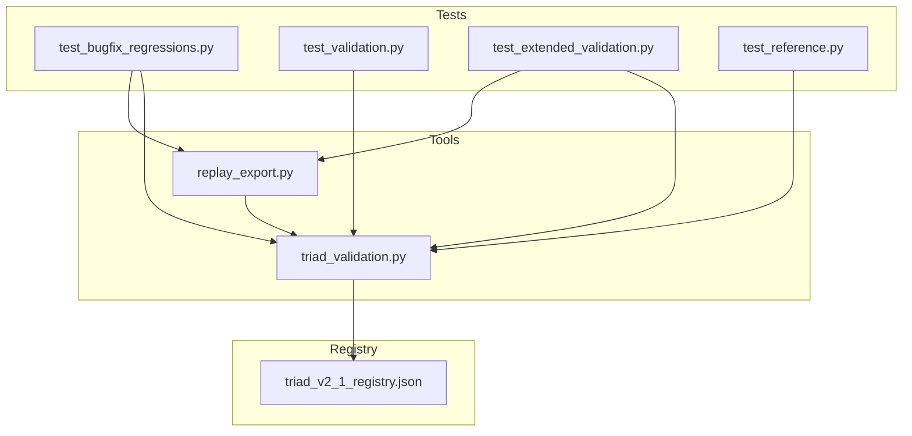
```mermaid
graph TB
subgraph "Tests"
TBR["test_bugfix_regressions.py"]
TV["test_validation.py"]
TEV["test_extended_validation.py"]
TR["test_reference.py"]
end
subgraph "Tools"
RE["replay_export.py"]
VAL["triad_validation.py"]
end
subgraph "Registry"
REG["triad_v2_1_registry.json"]
end
TBR --> RE
TBR --> VAL
TV --> VAL
TEV --> RE
TEV --> VAL
TR --> VAL
RE --> VAL
VAL --> REG
```

**Diagram sources**
- [test_bugfix_regressions.py:1-683](file://tests/test_bugfix_regressions.py#L1-L683)
- [test_validation.py:1-317](file://tests/test_validation.py#L1-L317)
- [test_extended_validation.py:1-583](file://tests/test_extended_validation.py#L1-L583)
- [test_reference.py:1-161](file://tests/test_reference.py#L1-L161)
- [replay_export.py:1-200](file://tools/replay_export.py#L1-L200)
- [triad_validation.py:1-200](file://tools/triad_validation.py#L1-L200)
- [triad_v2_1_registry.json:1-800](file://validation/triad_v2_1_registry.json#L1-L800)

**Section sources**
- [test_bugfix_regressions.py:1-683](file://tests/test_bugfix_regressions.py#L1-L683)
- [test_validation.py:1-317](file://tests/test_validation.py#L1-L317)
- [test_extended_validation.py:1-583](file://tests/test_extended_validation.py#L1-L583)
- [replay_export.py:1-200](file://tools/replay_export.py#L1-L200)
- [triad_validation.py:1-200](file://tools/triad_validation.py#L1-L200)
- [triad_v2_1_registry.json:1-800](file://validation/triad_v2_1_registry.json#L1-L800)

## Core Components
- Replay exporter: converts observed signal events into the exact CSV schema consumed by the validator, applying frozen entry/stop/cost/lot sizing and time-stop selection per configuration. It enforces one-signal-per-session semantics and expands coverage across all days and combinations.
- Validator: performs champion selection using only selection (walk-forward) data, evaluates holdout outcomes post-selection, applies conservative fill policies, computes bootstrap confidence intervals, and enforces thresholds for phase passes and firm floors.
- Reference math: independent standard-library reference for contract arithmetic, session bounds, daily state transitions, and persistence signatures used to validate EA behavior deterministically.
- Registries: committed configuration matrices and ablation registries with integrity hashes to prevent silent mutations.

Key responsibilities:
- Deterministic replay and schema enforcement ensure inputs are valid and complete.
- Conservative fill policy prevents overcounting fills and ensures stress scenarios are modeled consistently.
- Statistical guards (bootstrap intervals, familywise adjustments, holdout confirmation) reduce false positives and protect against overfitting.
- All-in risk ceiling and lot rounding enforce realistic capital constraints.

**Section sources**
- [replay_export.py:1-200](file://tools/replay_export.py#L1-L200)
- [triad_validation.py:1-200](file://tools/triad_validation.py#L1-L200)
- [triad_reference.py:1-167](file://tests/triad_reference.py#L1-L167)
- [triad_v2_1_registry.json:1-800](file://validation/triad_v2_1_registry.json#L1-L800)

## Architecture Overview
The regression pipeline follows a clear sequence: observed events are validated and exported into rows conforming to the frozen schema; the validator loads these rows, applies fill policies, selects a champion from selection data, and evaluates holdout outcomes with statistical rigor. Tests assert invariants at each stage to prevent regressions.

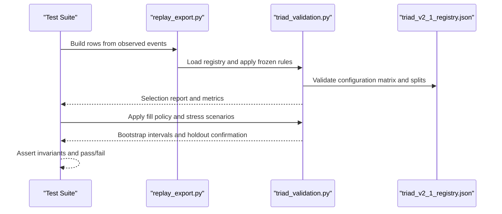
```mermaid
sequenceDiagram
participant Tester as "Test Suite"
participant Exporter as "replay_export.py"
participant Validator as "triad_validation.py"
participant Registry as "triad_v2_1_registry.json"
Tester->>Exporter : Build rows from observed events
Exporter->>Validator : Load registry and apply frozen rules
Validator->>Registry : Validate configuration matrix and splits
Validator-->>Tester : Selection report and metrics
Tester->>Validator : Apply fill policy and stress scenarios
Validator-->>Tester : Bootstrap intervals and holdout confirmation
Tester-->>Tester : Assert invariants and pass/fail
```

**Diagram sources**
- [test_extended_validation.py:408-583](file://tests/test_extended_validation.py#L408-L583)
- [replay_export.py:1-200](file://tools/replay_export.py#L1-L200)
- [triad_validation.py:1-200](file://tools/triad_validation.py#L1-L200)
- [triad_v2_1_registry.json:1-800](file://validation/triad_v2_1_registry.json#L1-L800)

## Detailed Component Analysis

### Breakeven Consistency and Cash/R Agreement
Regression tests verify that breakeven caps price net cash at entry and that net cash divided by risk equals net R across all exit paths. These assertions guard against mispricing when stops move to entry after confirmed 1R and ensure consistent R-to-cash conversion regardless of exit reason.

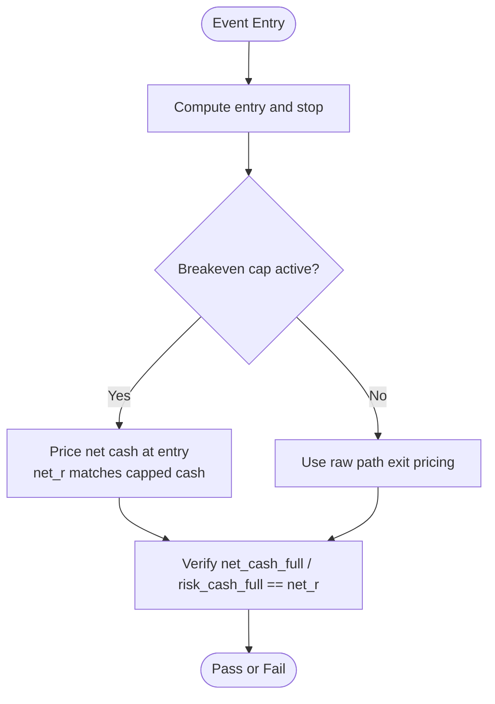
```mermaid
flowchart TD
Start(["Event Entry"]) --> ComputeEntry["Compute entry and stop"]
ComputeEntry --> CheckBreakeven{"Breakeven cap active?"}
CheckBreakeven --> |Yes| CapCash["Price net cash at entry<br/>net_r matches capped cash"]
CheckBreakeven --> |No| UseRaw["Use raw path exit pricing"]
CapCash --> VerifyR["Verify net_cash_full / risk_cash_full == net_r"]
UseRaw --> VerifyR
VerifyR --> End(["Pass or Fail"])
```

**Diagram sources**
- [test_bugfix_regressions.py:22-138](file://tests/test_bugfix_regressions.py#L22-L138)
- [test_bugfix_regressions.py:140-186](file://tests/test_bugfix_regressions.py#L140-L186)

**Section sources**
- [test_bugfix_regressions.py:22-138](file://tests/test_bugfix_regressions.py#L22-L138)
- [test_bugfix_regressions.py:140-186](file://tests/test_bugfix_regressions.py#L140-L186)

### Stop Side Guard and Rejection Handling
A dedicated test ensures that a long event whose displacement midpoint sits below the computed stop is rejected due to stop-on-wrong-side logic. The row builder must never produce an order in this case, preserving safety boundaries.

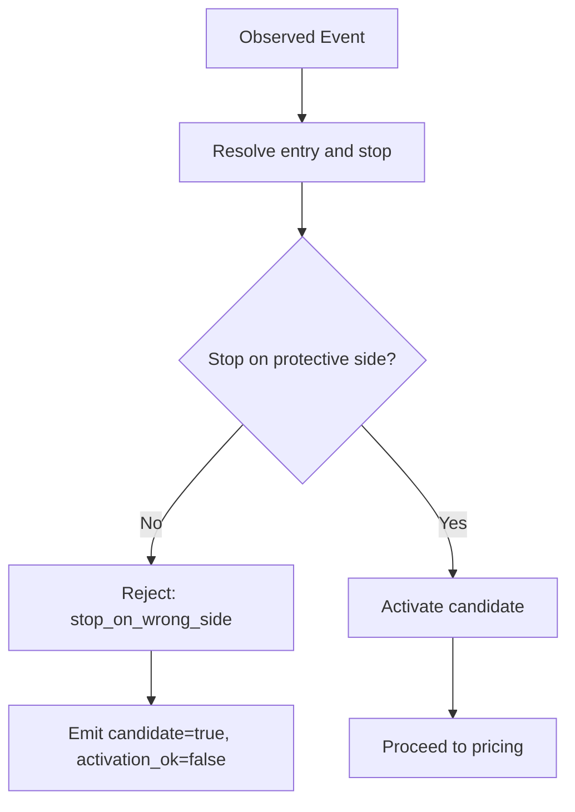
```mermaid
flowchart TD
Event["Observed Event"] --> ResolveEntry["Resolve entry and stop"]
ResolveEntry --> SideCheck{"Stop on protective side?"}
SideCheck --> |No| Reject["Reject: stop_on_wrong_side"]
SideCheck --> |Yes| Activate["Activate candidate"]
Reject --> AuditRow["Emit candidate=true, activation_ok=false"]
Activate --> Next["Proceed to pricing"]
```

**Diagram sources**
- [test_bugfix_regressions.py:188-227](file://tests/test_bugfix_regressions.py#L188-L227)

**Section sources**
- [test_bugfix_regressions.py:188-227](file://tests/test_bugfix_regressions.py#L188-L227)

### Loader Error Handling and Validation Errors
The loader rejects invalid trade-through ticks (non-integer or negative), raising a validation error. This prevents malformed upstream data from silently becoming trades and ensures data quality at ingestion.

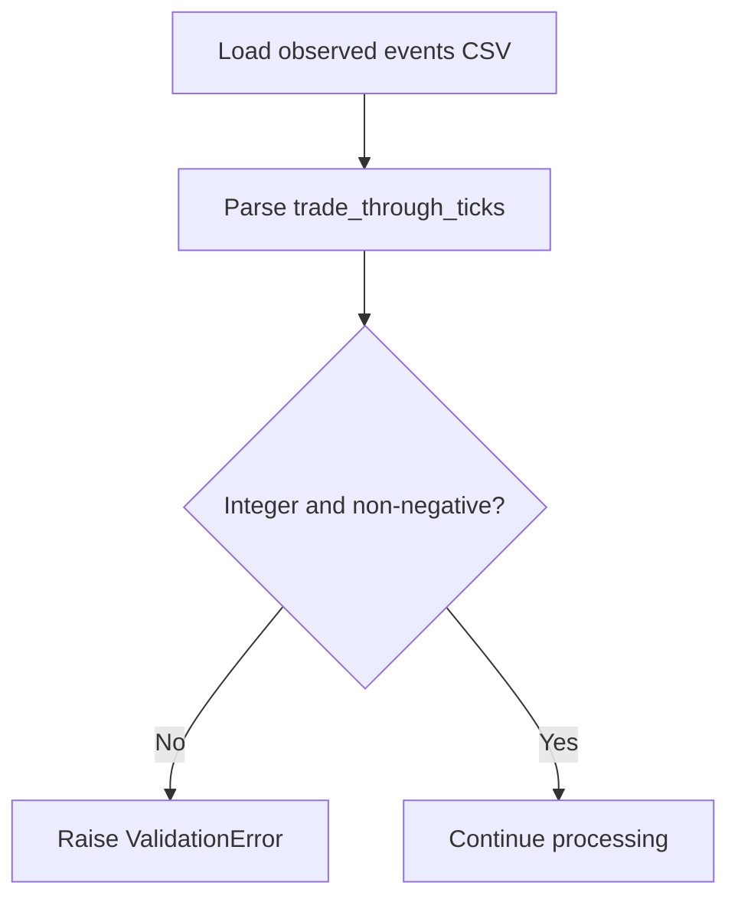
```mermaid
flowchart TD
LoadCSV["Load observed events CSV"] --> ParseField["Parse trade_through_ticks"]
ParseField --> ValidType{"Integer and non-negative?"}
ValidType --> |No| RaiseError["Raise ValidationError"]
ValidType --> |Yes| Continue["Continue processing"]
```

**Diagram sources**
- [test_bugfix_regressions.py:229-257](file://tests/test_bugfix_regressions.py#L229-L257)

**Section sources**
- [test_bugfix_regressions.py:229-257](file://tests/test_bugfix_regressions.py#L229-L257)

### Decision Robustness Without Paired Days
The decision function must not crash when paired-day statistics are missing; it should return a safe default outcome and explain why adoption is blocked.

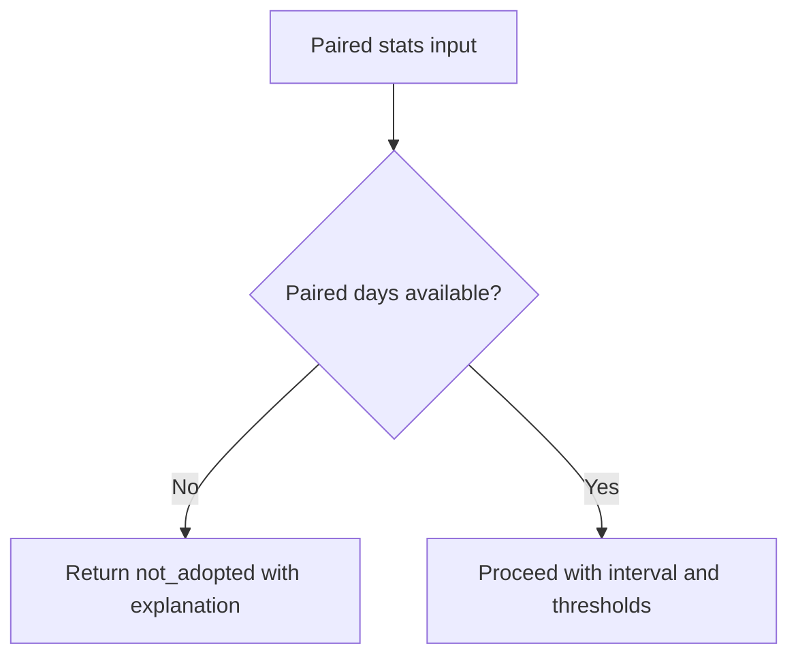
```mermaid
flowchart TD
Input["Paired stats input"] --> CheckPairs{"Paired days available?"}
CheckPairs --> |No| DefaultDecision["Return not_adopted with explanation"]
CheckPairs --> |Yes| Proceed["Proceed with interval and thresholds"]
```

**Diagram sources**
- [test_bugfix_regressions.py:259-284](file://tests/test_bugfix_regressions.py#L259-L284)

**Section sources**
- [test_bugfix_regressions.py:259-284](file://tests/test_bugfix_regressions.py#L259-L284)

### Preregistration Settings and Lattice Bounds
Registries declare minimum holdout fills and forbid certain opportunity floor parameters. Lattice functions must never return values below configured minima, protecting against undersized volumes.

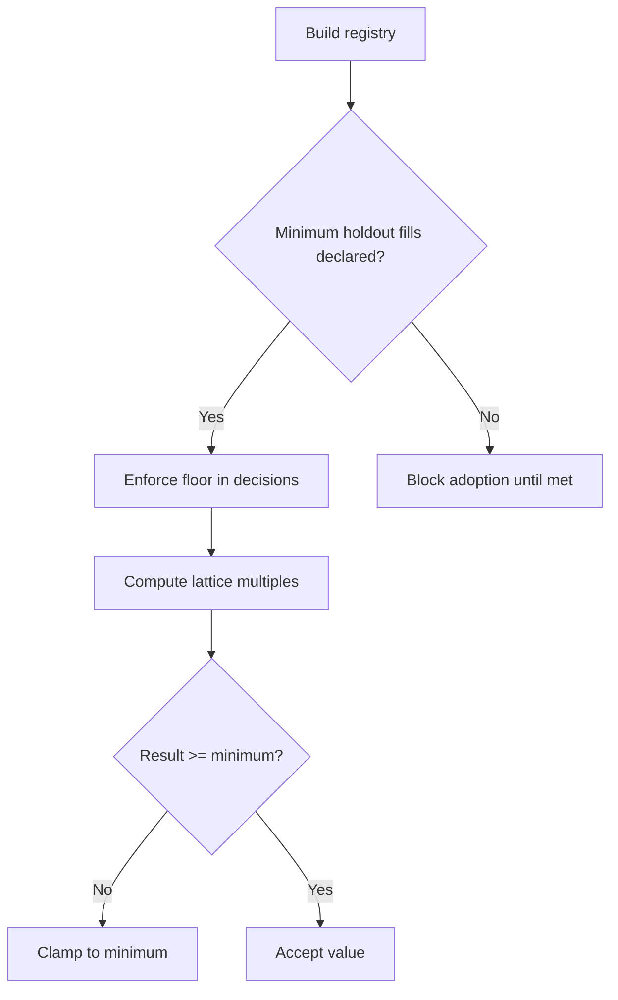
```mermaid
flowchart TD
Registry["Build registry"] --> CheckMinFills{"Minimum holdout fills declared?"}
CheckMinFills --> |Yes| Enforce["Enforce floor in decisions"]
CheckMinFills --> |No| Block["Block adoption until met"]
Enforce --> Lattice["Compute lattice multiples"]
Lattice --> MinGuard{"Result >= minimum?"}
MinGuard --> |No| Clamp["Clamp to minimum"]
MinGuard --> |Yes| Accept["Accept value"]
```

**Diagram sources**
- [test_bugfix_regressions.py:286-302](file://tests/test_bugfix_regressions.py#L286-L302)

**Section sources**
- [test_bugfix_regressions.py:286-302](file://tests/test_bugfix_regressions.py#L286-L302)

### Bootstrap Interval Invariant
Adjusted (Bonferroni) intervals must contain ordinary intervals and widen with larger family sizes. This invariant ensures conservative statistical inference under multiple comparisons.

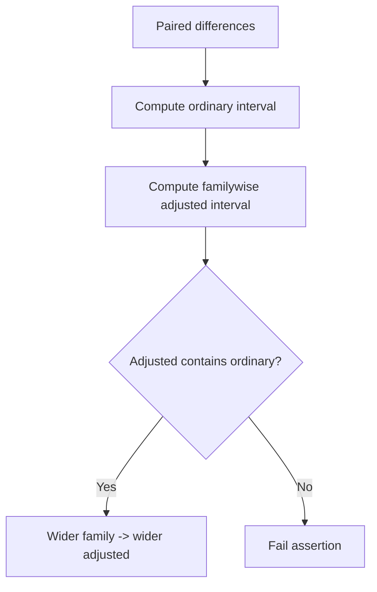
```mermaid
flowchart TD
Data["Paired differences"] --> Ordinary["Compute ordinary interval"]
Ordinary --> Adjusted["Compute familywise adjusted interval"]
Adjusted --> Contain{"Adjusted contains ordinary?"}
Contain --> |Yes| WiderFamily["Wider family -> wider adjusted"]
Contain --> |No| Fail["Fail assertion"]
```

**Diagram sources**
- [test_bugfix_regressions.py:320-346](file://tests/test_bugfix_regressions.py#L320-L346)

**Section sources**
- [test_bugfix_regressions.py:320-346](file://tests/test_bugfix_regressions.py#L320-L346)

### All-In Risk Ceiling and Minimum Volume Skip
Volume sizing must keep all-in loss within budget; if the minimum volume exceeds the risk budget, the event is skipped. This prevents risky micro-lots from being forced into trades.

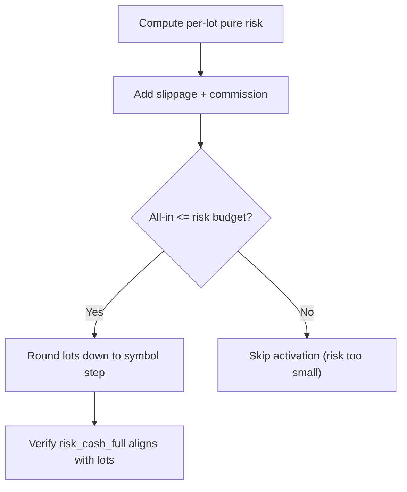
```mermaid
flowchart TD
Sizing["Compute per-lot pure risk"] --> AllIn["Add slippage + commission"]
AllIn --> Budget{"All-in <= risk budget?"}
Budget --> |Yes| Lots["Round lots down to symbol step"]
Budget --> |No| Skip["Skip activation (risk too small)"]
Lots --> Verify["Verify risk_cash_full aligns with lots"]
```

**Diagram sources**
- [test_bugfix_regressions.py:353-406](file://tests/test_bugfix_regressions.py#L353-L406)

**Section sources**
- [test_bugfix_regressions.py:353-406](file://tests/test_bugfix_regressions.py#L353-L406)

### Stressed Cash Consistency
Stressed reports must include additional cost components and match applied trade cash results. This ensures stress scenarios are additive and consistent with normal runs.

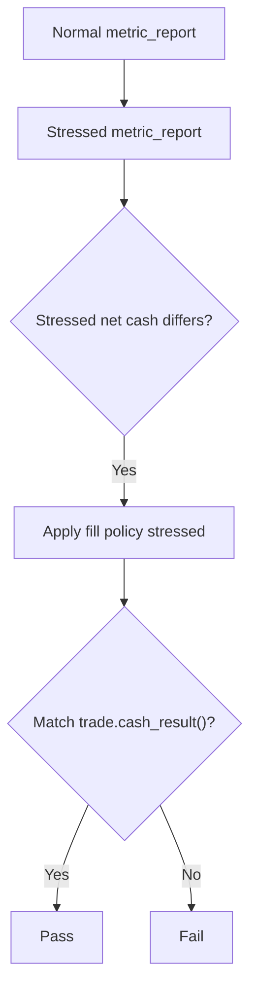
```mermaid
flowchart TD
Normal["Normal metric_report"] --> Stressed["Stressed metric_report"]
Stressed --> Compare{"Stressed net cash differs?"}
Compare --> |Yes| TradeApply["Apply fill policy stressed"]
TradeApply --> Match{"Match trade.cash_result()?"}
Match --> |Yes| Pass["Pass"]
Match --> |No| Fail["Fail"]
```

**Diagram sources**
- [test_bugfix_regressions.py:408-434](file://tests/test_bugfix_regressions.py#L408-L434)

**Section sources**
- [test_bugfix_regressions.py:408-434](file://tests/test_bugfix_regressions.py#L408-L434)

### Exit Reason Handling and Cancel Semantics
Cancel exits must never count as fills; unsupported time-stop horizons raise validation errors; loaders require breakeven timestamps when applicable. These rules prevent phantom fills and enforce strict exit semantics.

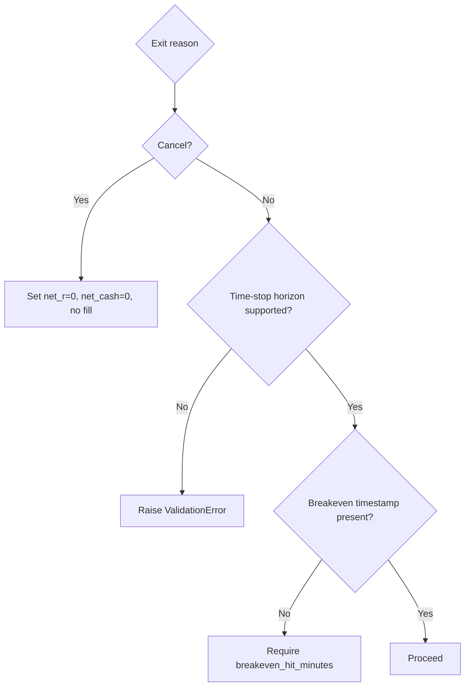
```mermaid
flowchart TD
ExitReason{"Exit reason"} --> Cancel{"Cancel?"}
Cancel --> |Yes| NoFill["Set net_r=0, net_cash=0, no fill"]
Cancel --> |No| TimeStop{"Time-stop horizon supported?"}
TimeStop --> |No| Raise["Raise ValidationError"]
TimeStop --> |Yes| Breakeven{"Breakeven timestamp present?"}
Breakeven --> |No| Require["Require breakeven_hit_minutes"]
Breakeven --> |Yes| Proceed["Proceed"]
```

**Diagram sources**
- [test_bugfix_regressions.py:436-512](file://tests/test_bugfix_regressions.py#L436-L512)

**Section sources**
- [test_bugfix_regressions.py:436-512](file://tests/test_bugfix_regressions.py#L436-L512)

### Randomized Property Tests
Deterministic randomized invariants across many events and configurations assert:
- Positive risk cash fields for activated candidates.
- All-in risk ceiling compliance.
- Net cash/risk agreement with net R.
- CSV round-trip fidelity.
- Fill policy requires activation, touch, trade-through, and full fraction.

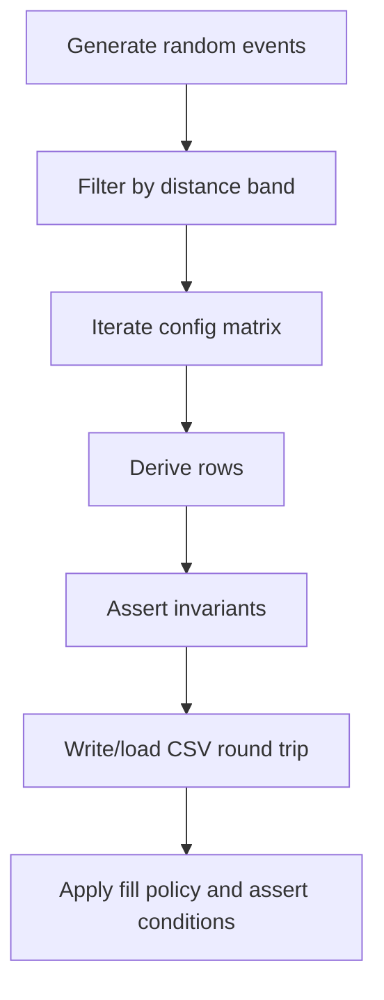
```mermaid
flowchart TD
Generate["Generate random events"] --> Filter["Filter by distance band"]
Filter --> ConfigMatrix["Iterate config matrix"]
ConfigMatrix --> Rows["Derive rows"]
Rows --> Invariants["Assert invariants"]
Invariants --> RoundTrip["Write/load CSV round trip"]
RoundTrip --> FillPolicy["Apply fill policy and assert conditions"]
```

**Diagram sources**
- [test_bugfix_regressions.py:514-683](file://tests/test_bugfix_regressions.py#L514-L683)

**Section sources**
- [test_bugfix_regressions.py:514-683](file://tests/test_bugfix_regressions.py#L514-L683)

### Registry Integrity and Coverage Validation
Tests ensure the committed registry matches the tool declaration, enumerates exactly 160 unique configurations, detects any mutation via hash mismatch, and enforces coverage requirements across every configuration, combination, and day.

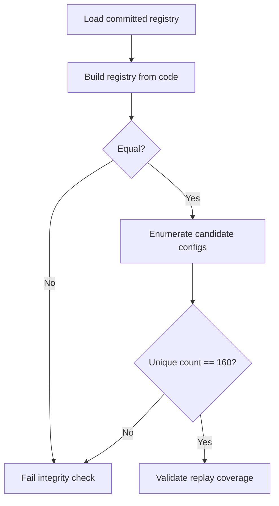
```mermaid
flowchart TD
LoadRegistry["Load committed registry"] --> BuildRegistry["Build registry from code"]
BuildRegistry --> Compare{"Equal?"}
Compare --> |No| Fail["Fail integrity check"]
Compare --> |Yes| Enumerate["Enumerate candidate configs"]
Enumerate --> Unique{"Unique count == 160?"}
Unique --> |No| Fail
Unique --> |Yes| Coverage["Validate replay coverage"]
```

**Diagram sources**
- [test_validation.py:80-133](file://tests/test_validation.py#L80-L133)

**Section sources**
- [test_validation.py:80-133](file://tests/test_validation.py#L80-L133)

### Fill Policy Assertions
Tests assert that touches without trade-through are not fills, inactive or partial orders are not fills, and stress costs are deducted again in stressed scenarios. Reports expose fill uncertainty counts.

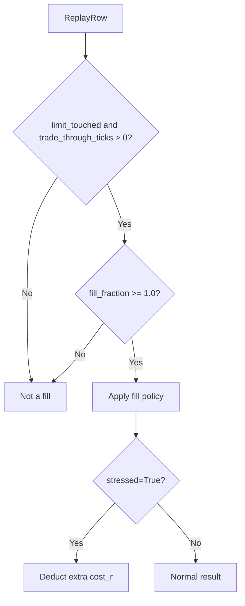
```mermaid
flowchart TD
Row["ReplayRow"] --> Touch{"limit_touched and trade_through_ticks > 0?"}
Touch --> |No| NotFill["Not a fill"]
Touch --> |Yes| Fraction{"fill_fraction >= 1.0?"}
Fraction --> |No| NotFill
Fraction --> |Yes| Apply["Apply fill policy"]
Apply --> Stress{"stressed=True?"}
Stress --> |Yes| ExtraCost["Deduct extra cost_r"]
Stress --> |No| Normal["Normal result"]
```

**Diagram sources**
- [test_validation.py:135-176](file://tests/test_validation.py#L135-L176)

**Section sources**
- [test_validation.py:135-176](file://tests/test_validation.py#L135-L176)

### Selection and Holdout Separation
Selection cannot be influenced by holdout outcomes; holdout rows are rejected in selection APIs. Bootstrap intervals remain conservative under selection-aware computation.

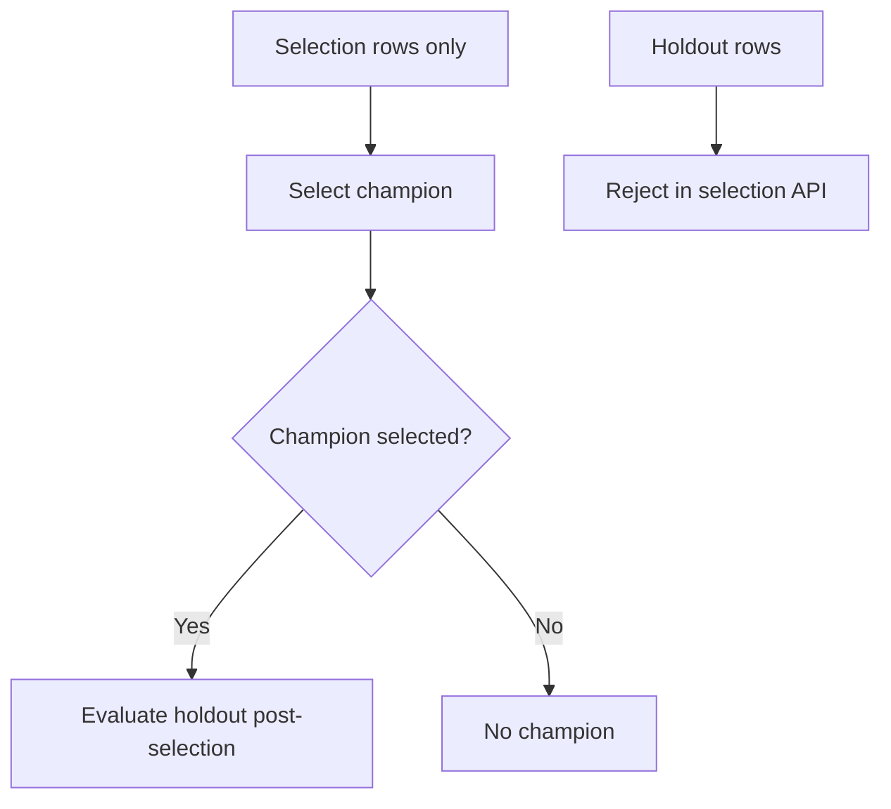
```mermaid
flowchart TD
SelectionRows["Selection rows only"] --> SelectChampion["Select champion"]
HoldoutRows["Holdout rows"] --> Reject["Reject in selection API"]
SelectChampion --> Champion{"Champion selected?"}
Champion --> |Yes| EvaluateHoldout["Evaluate holdout post-selection"]
Champion --> |No| Fail["No champion"]
```

**Diagram sources**
- [test_validation.py:178-273](file://tests/test_validation.py#L178-L273)

**Section sources**
- [test_validation.py:178-273](file://tests/test_validation.py#L178-L273)

### Phase Simulation and Firm Floor Checks
Phase simulation reports include confidence bounds, draws, median drawdown, and time in drawdown. Firm floor checks detect repeated full losses that breach overall account floors.

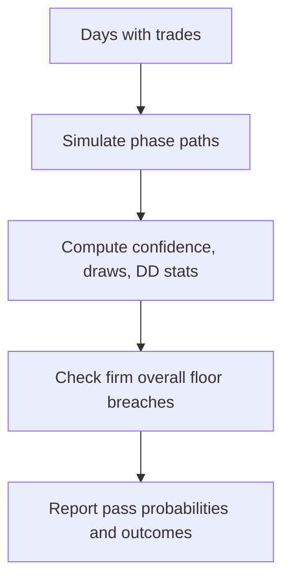
```mermaid
flowchart TD
Days["Days with trades"] --> Simulate["Simulate phase paths"]
Simulate --> Metrics["Compute confidence, draws, DD stats"]
Metrics --> Floors["Check firm overall floor breaches"]
Floors --> Report["Report pass probabilities and outcomes"]
```

**Diagram sources**
- [test_extended_validation.py:300-406](file://tests/test_extended_validation.py#L300-L406)

**Section sources**
- [test_extended_validation.py:300-406](file://tests/test_extended_validation.py#L300-L406)

### Router Priority and Session Rules
Account-wide router selects one combination per day based on priority, tie-breaks by lower cost R, and first-signal-wins within same combination. Demoted rows retain candidate flags for auditability.

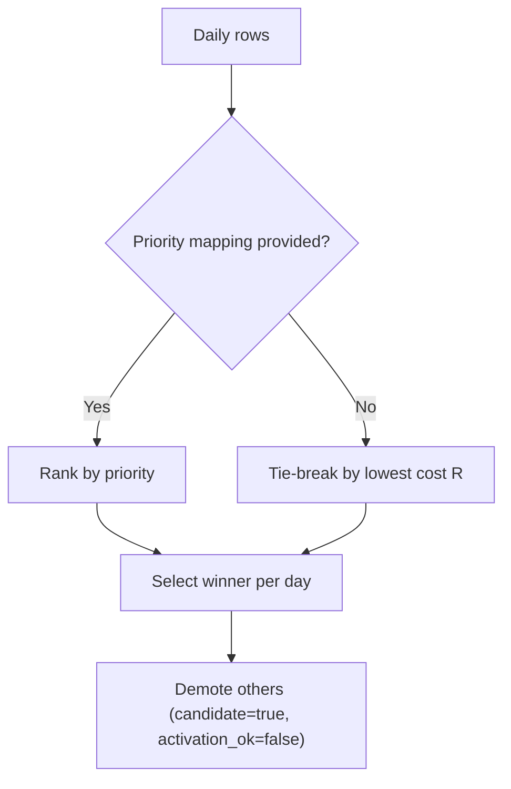
```mermaid
flowchart TD
DailyRows["Daily rows"] --> Priority{"Priority mapping provided?"}
Priority --> |Yes| Rank["Rank by priority"]
Priority --> |No| CostBreak["Tie-break by lowest cost R"]
Rank --> Winner["Select winner per day"]
CostBreak --> Winner
Winner --> Demote["Demote others (candidate=true, activation_ok=false)"]
```

**Diagram sources**
- [test_extended_validation.py:100-197](file://tests/test_extended_validation.py#L100-L197)

**Section sources**
- [test_extended_validation.py:100-197](file://tests/test_extended_validation.py#L100-L197)

### Export Math and Coverage
Exporter derives target math and rounded lots correctly, rejects weak displacement, skips small accounts below minimum volume, uses correct time-stop horizon prices, and enforces split cuts and calendar coverage.

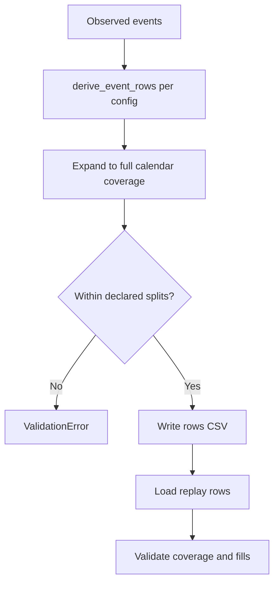
```mermaid
flowchart TD
Events["Observed events"] --> Derive["derive_event_rows per config"]
Derive --> Coverage["Expand to full calendar coverage"]
Coverage --> SplitCut{"Within declared splits?"}
SplitCut --> |No| Reject["ValidationError"]
SplitCut --> |Yes| Write["Write rows CSV"]
Write --> Load["Load replay rows"]
Load --> Validate["Validate coverage and fills"]
```

**Diagram sources**
- [test_extended_validation.py:408-583](file://tests/test_extended_validation.py#L408-L583)

**Section sources**
- [test_extended_validation.py:408-583](file://tests/test_extended_validation.py#L408-L583)

### Reference Math and Persistence Integrity
Reference tests validate profile cash math, drawdown tiers, profitable day calculation, phase locking, firm floors, volume rounding, session bounds, and halt latch signature integrity.

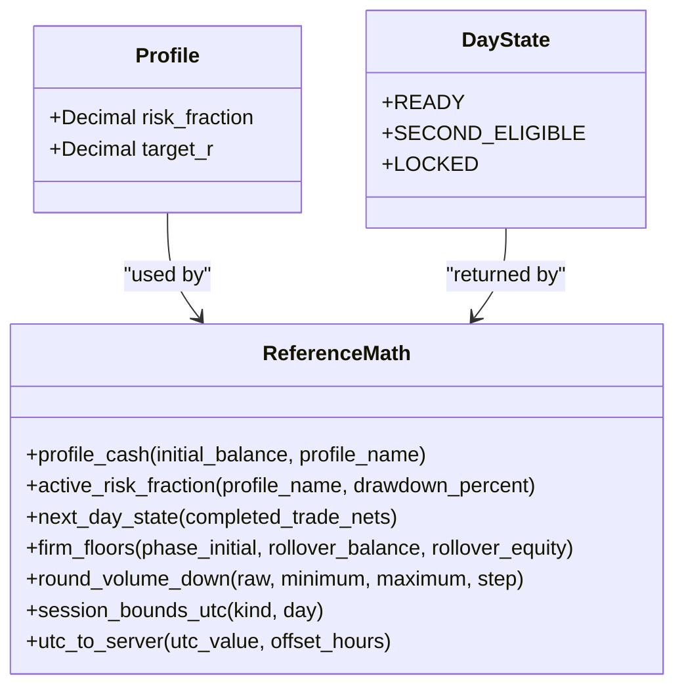
```mermaid
classDiagram
class Profile {
+Decimal risk_fraction
+Decimal target_r
}
class DayState {
+READY
+SECOND_ELIGIBLE
+LOCKED
}
class ReferenceMath {
+profile_cash(initial_balance, profile_name)
+active_risk_fraction(profile_name, drawdown_percent)
+next_day_state(completed_trade_nets)
+firm_floors(phase_initial, rollover_balance, rollover_equity)
+round_volume_down(raw, minimum, maximum, step)
+session_bounds_utc(kind, day)
+utc_to_server(utc_value, offset_hours)
}
Profile --> ReferenceMath : "used by"
DayState --> ReferenceMath : "returned by"
```

**Diagram sources**
- [triad_reference.py:16-167](file://tests/triad_reference.py#L16-L167)
- [test_reference.py:27-161](file://tests/test_reference.py#L27-L161)

**Section sources**
- [test_reference.py:27-161](file://tests/test_reference.py#L27-L161)
- [triad_reference.py:16-167](file://tests/triad_reference.py#L16-L167)

## Dependency Analysis
The test suite depends on the replay exporter and validator modules, which in turn depend on the committed registry. Tests also import reference math to assert deterministic behavior.

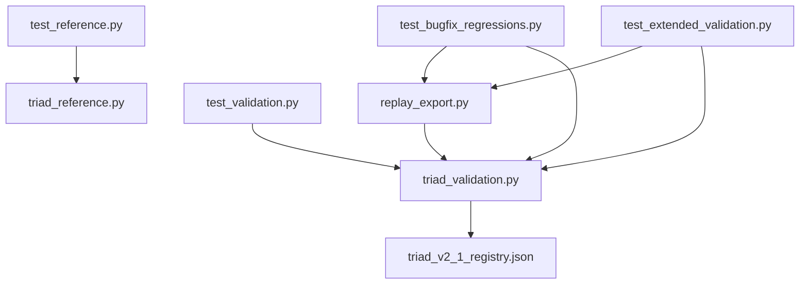
```mermaid
graph TB
TBR["test_bugfix_regressions.py"] --> RE["replay_export.py"]
TBR --> VAL["triad_validation.py"]
TV["test_validation.py"] --> VAL
TEV["test_extended_validation.py"] --> RE
TEV --> VAL
TR["test_reference.py"] --> REF["triad_reference.py"]
RE --> VAL
VAL --> REG["triad_v2_1_registry.json"]
```

**Diagram sources**
- [test_bugfix_regressions.py:1-683](file://tests/test_bugfix_regressions.py#L1-L683)
- [test_validation.py:1-317](file://tests/test_validation.py#L1-L317)
- [test_extended_validation.py:1-583](file://tests/test_extended_validation.py#L1-L583)
- [test_reference.py:1-161](file://tests/test_reference.py#L1-L161)
- [replay_export.py:1-200](file://tools/replay_export.py#L1-L200)
- [triad_validation.py:1-200](file://tools/triad_validation.py#L1-L200)
- [triad_v2_1_registry.json:1-800](file://validation/triad_v2_1_registry.json#L1-L800)

**Section sources**
- [test_bugfix_regressions.py:1-683](file://tests/test_bugfix_regressions.py#L1-L683)
- [test_validation.py:1-317](file://tests/test_validation.py#L1-L317)
- [test_extended_validation.py:1-583](file://tests/test_extended_validation.py#L1-L583)
- [replay_export.py:1-200](file://tools/replay_export.py#L1-L200)
- [triad_validation.py:1-200](file://tools/triad_validation.py#L1-L200)
- [triad_v2_1_registry.json:1-800](file://validation/triad_v2_1_registry.json#L1-L800)

## Performance Considerations
- Deterministic seeds and block-days in bootstrap computations ensure reproducible performance across runs.
- Conservative fill policies avoid inflating fill rates, reducing noise in metric reports.
- Registry-enforced coverage guarantees consistent computational load across configurations and days.
- Randomized property tests exercise large combinatorial spaces efficiently while maintaining determinism.

[No sources needed since this section provides general guidance]

## Troubleshooting Guide
Common issues and their diagnostic signals:
- Non-integer or negative trade-through ticks: loader raises validation errors; inspect upstream replay exports for type correctness.
- Cancel exits counted as fills: ensure cancel reasons set net_r and net_cash to zero and do not trigger fills.
- Unsupported time-stop horizons: validation errors indicate misconfigured time-stop minutes; adjust to allowed values.
- Missing breakeven timestamps: loader requires breakeven_hit_minutes for breakeven exits; ensure upstream records timestamps.
- Registry hash mismatch: indicates tampered configuration; regenerate and commit the registry.
- Coverage gaps: validation errors highlight missing configuration/combination/day rows; expand export plan to cover all required dates.

**Section sources**
- [test_bugfix_regressions.py:229-257](file://tests/test_bugfix_regressions.py#L229-L257)
- [test_bugfix_regressions.py:436-512](file://tests/test_bugfix_regressions.py#L436-L512)
- [test_validation.py:80-133](file://tests/test_validation.py#L80-L133)
- [test_extended_validation.py:546-573](file://tests/test_extended_validation.py#L546-L573)

## Conclusion
The regression testing framework provides comprehensive protection against previously resolved defects by encoding edge cases, failure modes, and known vulnerabilities as deterministic unit and property tests. It enforces strict configuration registries, conservative fill policies, and statistical safeguards to ensure that fixes remain stable and do not introduce new issues. By following the methodology outlined here—capturing failures early, categorizing tests by domain, assigning priorities based on risk impact, and automating execution—you can maintain an evolving regression suite that safeguards algorithmic trading systems against common pitfalls.

[No sources needed since this section summarizes without analyzing specific files]

## Appendices

### Methodology for Creating Effective Regression Tests
- Identify failure points: review recent bugs, production incidents, and code reviews to pinpoint vulnerable logic.
- Capture edge cases: design tests for boundary conditions (e.g., breakeven timing, stop placement, cancel exits).
- Assert invariants: ensure internal consistency (e.g., net cash/risk agreement, all-in risk ceiling).
- Use deterministic randomness: fix seeds and block-days for reproducibility.
- Automate execution: integrate tests into CI pipelines to run on every change.
- Maintain registries: commit configuration matrices and ablation registries with integrity hashes.

[No sources needed since this section provides general guidance]

### Test Case Categorization and Priority Assignment
- Category examples:
  - Pricing and sizing: breakeven caps, all-in ceilings, lot rounding.
  - Entry and stop logic: wrong-side stops, displacement strength, midpoint filters.
  - Fill policy: touch vs trade-through, partial fills, stress costs.
  - Data integrity: loader validation, registry integrity, coverage completeness.
  - Statistical guards: bootstrap intervals, familywise adjustments, holdout confirmation.
- Priority assignment:
  - P0: Directly impacts live trading risk or capital preservation (e.g., all-in ceiling, stop side guard).
  - P1: Affects performance or reliability (e.g., fill policy, coverage gaps).
  - P2: Improves robustness or clarity (e.g., randomized invariants, documentation).

[No sources needed since this section provides general guidance]