# Contract Validation

<cite>
**Referenced Files in This Document**
- [test_source_contract.py](file://tests/test_source_contract.py)
- [TRIAD_R_HS.mq5](file://MQL5/Experts/TRIAD_R_HS/TRIAD_R_HS.mq5)
- [README.md](file://MQL5/Experts/TRIAD_R_HS/README.md)
- [triad_reference.py](file://tests/triad_reference.py)
- [test_validation.py](file://tests/test_validation.py)
- [THE5ERS-CHALLENGE-STRATEGY-V2.md](file://THE5ERS-CHALLENGE-STRATEGY-V2.md)
</cite>

## Table of Contents
1. [Introduction](#introduction)
2. [Project Structure](#project-structure)
3. [Core Components](#core-components)
4. [Architecture Overview](#architecture-overview)
5. [Detailed Component Analysis](#detailed-component-analysis)
6. [Dependency Analysis](#dependency-analysis)
7. [Performance Considerations](#performance-considerations)
8. [Troubleshooting Guide](#troubleshooting-guide)
9. [Conclusion](#conclusion)
10. [Appendices](#appendices)

## Introduction
This document explains the contract validation testing framework that ensures the TRIAD_R_HS expert advisor implements the canonical strategy specification and compliance requirements. It focuses on how SourceContractTests validates critical trading rules, risk management parameters, session handling, safety mechanisms, state persistence integrity, news calendar schema, order submission controls, position sizing calculations, and architectural constraints. It also provides guidance for writing new contract tests, interpreting failures, and maintaining compliance as requirements evolve.

## Project Structure
The repository organizes the validated EA source under MQL5 Experts, with Python-based static contract tests under tests, a canonical strategy specification at the repository root, and reference math utilities to support test oracles. The key files used by this documentation are:
- The MQL5 expert source implementing the strategy logic and safety controls.
- A comprehensive Python unittest suite asserting structural and behavioral contracts against the source text and configuration defaults.
- A canonical specification defining immutable rules, profiles, sessions, and gates.
- Reference math providing deterministic expectations for risk tiers, volume rounding, daily state transitions, and halt signatures.

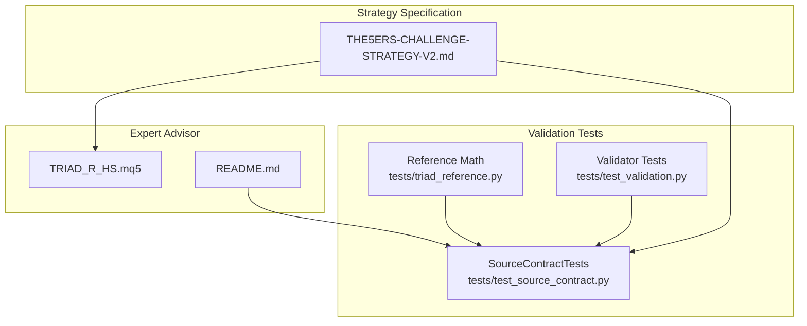

**Diagram sources**
- [THE5ERS-CHALLENGE-STRATEGY-V2.md:1-200](file://THE5ERS-CHALLENGE-STRATEGY-V2.md#L1-L200)
- [TRIAD_R_HS.mq5:1-200](file://MQL5/Experts/TRIAD_R_HS/TRIAD_R_HS.mq5#L1-L200)
- [README.md:1-120](file://MQL5/Experts/TRIAD_R_HS/README.md#L1-L120)
- [test_source_contract.py:15-547](file://tests/test_source_contract.py#L15-L547)
- [triad_reference.py:16-167](file://tests/triad_reference.py#L16-L167)
- [test_validation.py:1-317](file://tests/test_validation.py#L1-L317)

**Section sources**
- [test_source_contract.py:15-547](file://tests/test_source_contract.py#L15-L547)
- [TRIAD_R_HS.mq5:1-200](file://MQL5/Experts/TRIAD_R_HS/TRIAD_R_HS.mq5#L1-L200)
- [README.md:1-120](file://MQL5/Experts/TRIAD_R_HS/README.md#L1-L120)
- [triad_reference.py:16-167](file://tests/triad_reference.py#L16-L167)
- [test_validation.py:1-317](file://tests/test_validation.py#L1-L317)
- [THE5ERS-CHALLENGE-STRATEGY-V2.md:1-200](file://THE5ERS-CHALLENGE-STRATEGY-V2.md#L1-L200)

## Core Components
- SourceContractTests: A Python unittest class that statically inspects the compiled-invariant parts of the MQL5 source to enforce the canonical strategy contract. It checks defaults, forbidden tokens, required constants, control flow markers, and architectural constraints.
- Canonical Strategy Specification: Defines immutable rules, session definitions, pre-signal gates, entry sequence, stop/cash-risk calculation, exit engine, risk engine, and lifecycle constraints.
- Reference Math Module: Provides deterministic expectations for profile cash, drawdown-throttled active risk, daily state transitions, firm floors, volume rounding, phase targets, and halt latch signatures.
- Validator Tests: Validate the offline replay pipeline’s registry, fill policy, selection mechanics, and phase simulation reports.

Key responsibilities enforced by SourceContractTests include:
- Order submission disabled by default and all release gates closed.
- Only four paired risk/target profiles with maximum risk not exceeding 0.4%.
- Removal of prohibited trade behaviors (forbidden token detection).
- Pending orders must include visible stop and target; missing values trigger specific rejection reasons.
- Single half-risk tier and five percent shutdown threshold.
- Daily state using first net positive and two-trade lock semantics.
- Calendar-driven reset of daily/weekly governors without halting resets.
- Required persisted state completeness and failure modes.
- Initialization cannot proceed after session refresh halts.
- Trade plan persistence and reconciliation.
- Account-wide exposure and persistent halt presence.
- Instance lock heartbeat before owner claim.
- Actual symbol cash sizing with round-down behavior.
- ATR regime computed from session open, indicator buffer usage, and closed bar semantics.
- News coverage cannot expire silently; runtime checks enforced.
- First sweep reconstruction and repeat cannot reset event consumption.
- Range and candle sequence semantics locked to half-open ranges and displacement rules.
- State commit signature detecting partial global updates.
- Dedicated halt latch commit signature with ordering guarantees.
- Persisted identity frozen across account context changes.
- External account incident protection of risk baselines.
- Offline exposure crossing rollover reconstructed.
- Quote checks use same tick snapshot.
- Breakeven retry limited to one persisted attempt.
- Failed submission latches and reconciles before clearing plan.
- Each enabled combination requires its own release gate.
- Collision ranking uses frozen priority before cost/time.
- Server offset checked in seconds, not rounded hours.
- Operational guards present.
- Terminal global names fit platform limits.
- Delimiters balanced outside strings/comments.
- News block day counter structure and H1 EMA bias filter structure.
- Stats insufficient treated as error level.

**Section sources**
- [test_source_contract.py:20-547](file://tests/test_source_contract.py#L20-L547)
- [TRIAD_R_HS.mq5:53-149](file://MQL5/Experts/TRIAD_R_HS/TRIAD_R_HS.mq5#L53-L149)
- [triad_reference.py:16-167](file://tests/triad_reference.py#L16-L167)
- [THE5ERS-CHALLENGE-STRATEGY-V2.md:32-200](file://THE5ERS-CHALLENGE-STRATEGY-V2.md#L32-L200)

## Architecture Overview
The contract validation architecture is a static analysis layer over the MQL5 source code, guided by the canonical specification and reference math. SourceContractTests reads the EA source once and asserts:
- Defaults and gates match fail-closed design.
- Forbidden tokens are absent.
- Required constants and markers exist.
- Control flow sequences preserve safety invariants (e.g., instance lock heartbeat before ownership claim; initialization cleanup paths).
- Risk and sizing logic aligns with actual symbol properties and round-down behavior.
- Session and pattern logic adheres to half-open ranges and displacement rules.
- News calendar schema and runtime checks prevent silent expiration.
- Persistence structures include signatures and ordered writes to detect partial updates.
- Operational guards and alerts are present.

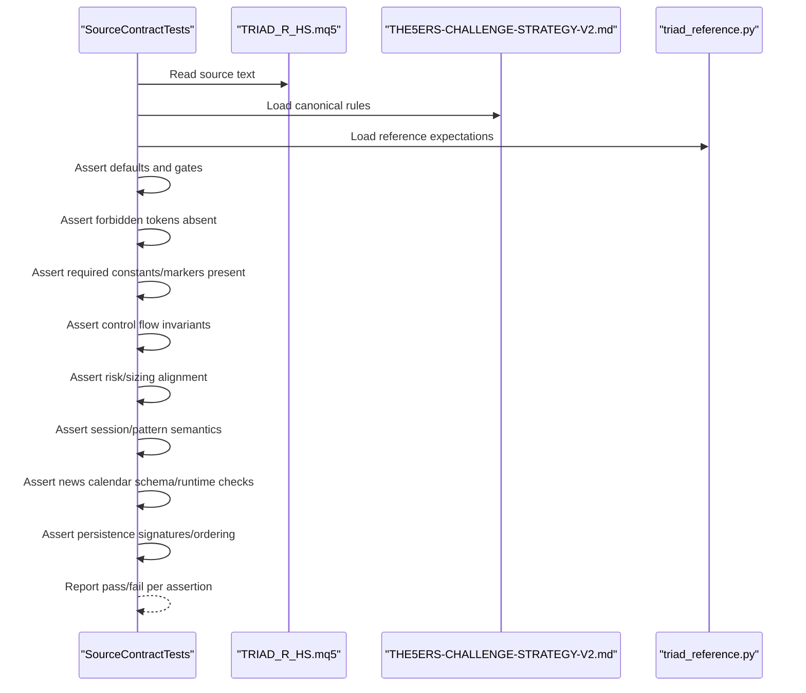

**Diagram sources**
- [test_source_contract.py:15-547](file://tests/test_source_contract.py#L15-L547)
- [TRIAD_R_HS.mq5:1-200](file://MQL5/Experts/TRIAD_R_HS/TRIAD_R_HS.mq5#L1-L200)
- [THE5ERS-CHALLENGE-STRATEGY-V2.md:1-200](file://THE5ERS-CHALLENGE-STRATEGY-V2.md#L1-L200)
- [triad_reference.py:16-167](file://tests/triad_reference.py#L16-L167)

## Detailed Component Analysis

### SourceContractTests: Contract Enforcement Mechanism
SourceContractTests performs static assertions over the EA source to ensure compliance with the canonical strategy and operational safeguards. It covers:
- Canonical file existence and build ID presence.
- News example schema validation (UTC time format, currency codes, impact types, coverage rows).
- Order submission disabled by default and all release gates closed.
- Four paired profiles with maximum risk capped at 0.4%.
- Forbidden token detection to remove prohibited trade behaviors.
- Pending orders requiring visible stop and target.
- Drawdown thresholds and single half-risk tier.
- Daily state using first net positive and two-trade lock.
- Calendar-driven reset of governors without halting resets.
- Required persisted state completeness and failure modes.
- Initialization cannot succeed after session refresh halts.
- Fresh state rejects cancelled order history without deals.
- State load failure cleans owned exposure only after lock.
- Trade plan persistence and reconciliation.
- Account-wide exposure and persistent halt presence.
- Instance lock publishes heartbeat before owner claim.
- Actual symbol cash sizing and round-down behavior.
- ATR regime uses session open and closed bar semantics.
- News coverage cannot expire silently at runtime.
- First sweep reconstruction and repeat cannot reset event consumption.
- Range and candle sequence semantics locked.
- State commit signature detects partial global updates.
- Halt latch has dedicated commit signature with ordering.
- Persisted identity frozen across account context changes.
- External account incident cannot migrate risk baselines.
- Offline exposure crossing rollover reconstructed.
- Quote checks use same tick snapshot.
- Breakeven has only one persisted retry.
- Failed submission latches and reconciles before plan clear.
- Each enabled combination needs its own release gate.
- Collision ranking uses frozen priority before cost/time.
- Server offset checked in seconds, not rounded hours.
- Operational guards present.
- Terminal global names fit platform limit.
- Delimiters balanced outside strings/comments.
- News block day counter structure and H1 EMA bias filter structure.
- Stats insufficient is error level.

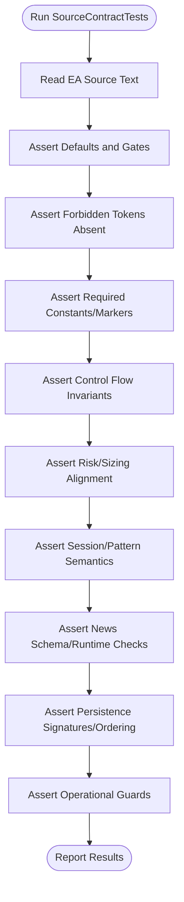

**Diagram sources**
- [test_source_contract.py:20-547](file://tests/test_source_contract.py#L20-L547)

**Section sources**
- [test_source_contract.py:20-547](file://tests/test_source_contract.py#L20-L547)

### Canonical Strategy Compliance Verification
The tests verify adherence to the canonical specification by checking:
- Session definitions and candidate entry windows.
- Pre-signal gates including spread, cost, news, quote age, execution health, and broker levels.
- Entry sequence with sweep/reclaim, displacement, limit placement, visible stops/targets, cancellation rules, and no market chase.
- Stop and cash-risk calculation using live symbol economics, OrderCalcProfit, and round-down volume.
- Exit engine with +1R confirmation, time stops, session hard stop, rollover buffers, and forced-flat rules.
- Risk engine with paired profiles, drawdown throttle, and firm floors.

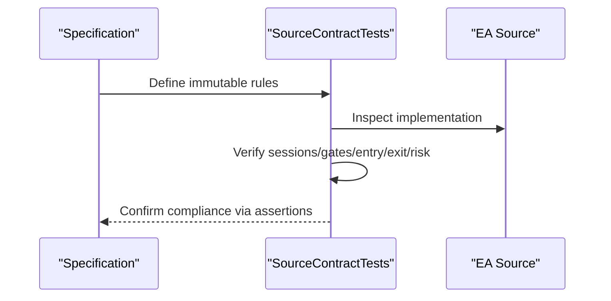

**Diagram sources**
- [THE5ERS-CHALLENGE-STRATEGY-V2.md:54-200](file://THE5ERS-CHALLENGE-STRATEGY-V2.md#L54-L200)
- [test_source_contract.py:62-211](file://tests/test_source_contract.py#L62-L211)

**Section sources**
- [THE5ERS-CHALLENGE-STRATEGY-V2.md:54-200](file://THE5ERS-CHALLENGE-STRATEGY-V2.md#L54-L200)
- [test_source_contract.py:62-211](file://tests/test_source_contract.py#L62-L211)

### News Calendar Schema Validation
The tests validate:
- Header fields and row count minimums.
- UTC time format and currency code patterns.
- Impact values restricted to RED/HIGH and COVERAGE metadata.
- Coverage row presence and enforcement of minimum required coverage hours.
- Runtime checks preventing silent expiration and ensuring recent relevant news blocking.

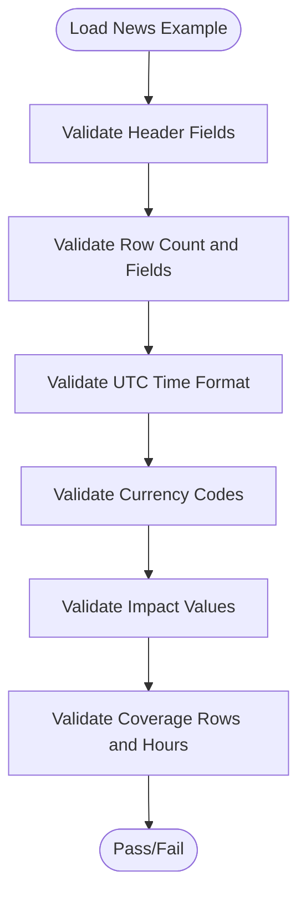

**Diagram sources**
- [test_source_contract.py:27-42](file://tests/test_source_contract.py#L27-L42)
- [test_source_contract.py:212-228](file://tests/test_source_contract.py#L212-L228)

**Section sources**
- [test_source_contract.py:27-42](file://tests/test_source_contract.py#L27-L42)
- [test_source_contract.py:212-228](file://tests/test_source_contract.py#L212-L228)

### Order Submission Controls and Release Gates
The tests assert:
- Order submission disabled by default.
- All release gates closed by default.
- Combination-specific gates present and closed.
- ManageExposure respects submission enablement.

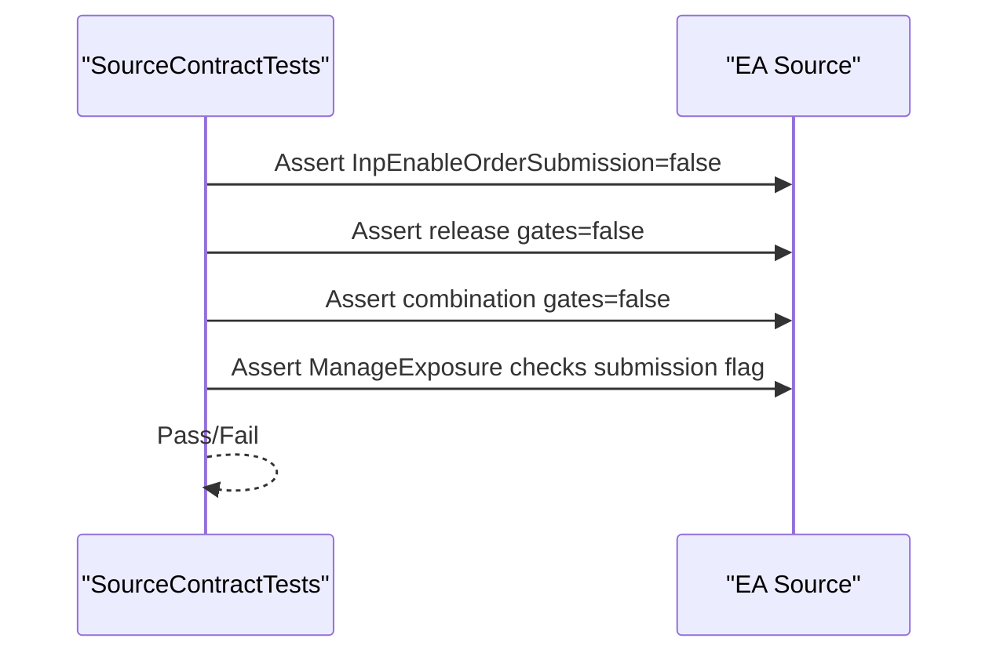

**Diagram sources**
- [test_source_contract.py:44-61](file://tests/test_source_contract.py#L44-L61)
- [test_source_contract.py:393-400](file://tests/test_source_contract.py#L393-L400)

**Section sources**
- [test_source_contract.py:44-61](file://tests/test_source_contract.py#L44-L61)
- [test_source_contract.py:393-400](file://tests/test_source_contract.py#L393-L400)

### Position Sizing Calculations and Volume Rounding
The tests verify:
- Use of OrderCalcProfit for cash sizing.
- Symbol properties: SYMBOL_VOLUME_STEP, SYMBOL_VOLUME_LIMIT.
- Round-down logic using MathFloor and step arithmetic.
- Minimum and maximum unit bounds applied.
- No hardcoded pip assumptions.

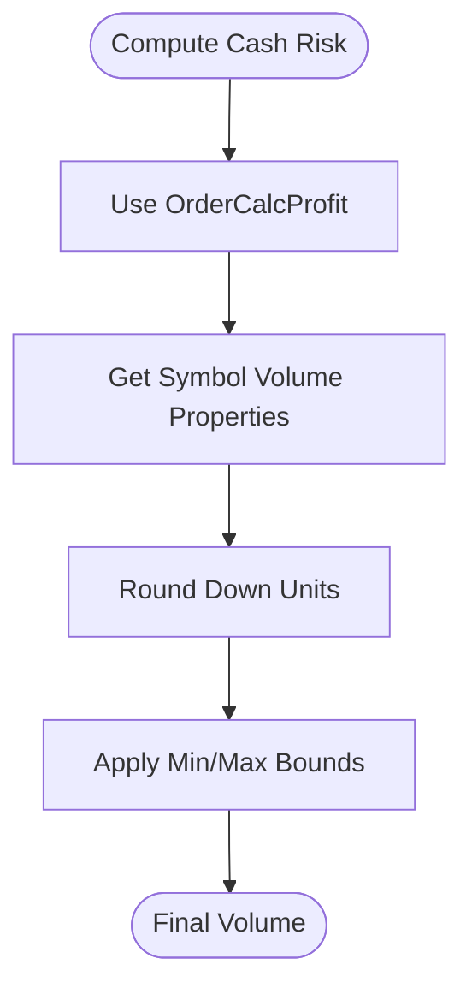

**Diagram sources**
- [test_source_contract.py:188-194](file://tests/test_source_contract.py#L188-L194)

**Section sources**
- [test_source_contract.py:188-194](file://tests/test_source_contract.py#L188-L194)

### State Persistence Integrity and Signatures
The tests assert:
- Presence of state commit signature and mismatch handling.
- Dedicated halt latch signature with ordered writes and reads.
- Identity hash persistence and authorization checks.
- Migration latches for external cashflow and unauthorized history.
- Missed rollover exposure reconstruction.

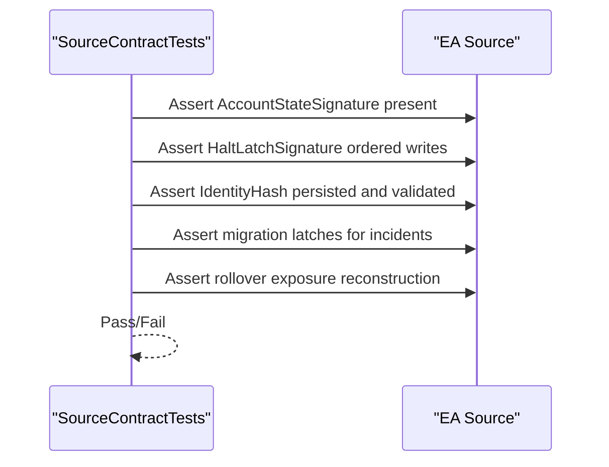

**Diagram sources**
- [test_source_contract.py:269-370](file://tests/test_source_contract.py#L269-L370)

**Section sources**
- [test_source_contract.py:269-370](file://tests/test_source_contract.py#L269-L370)

### Forbidding Prohibited Behaviors and Architectural Constraints
The tests enforce:
- Absence of forbidden tokens like partial closes, close-by, direct market orders, and risky risk multipliers.
- Balanced delimiters outside strings/comments.
- Platform global name length limits.
- Operational guard constants and alert names present.

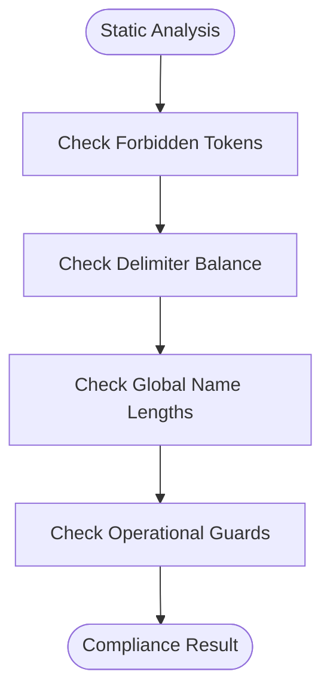

**Diagram sources**
- [test_source_contract.py:76-88](file://tests/test_source_contract.py#L76-L88)
- [test_source_contract.py:469-500](file://tests/test_source_contract.py#L469-L500)
- [test_source_contract.py:427-467](file://tests/test_source_contract.py#L427-L467)

**Section sources**
- [test_source_contract.py:76-88](file://tests/test_source_contract.py#L76-L88)
- [test_source_contract.py:469-500](file://tests/test_source_contract.py#L469-L500)
- [test_source_contract.py:427-467](file://tests/test_source_contract.py#L427-L467)

### Session Handling and Pattern Semantics
The tests verify:
- ATR computed before session open using closed bars and indicator buffers.
- Range read uses half-open intervals and expected bar counts.
- Sweep detection includes reclaim eligibility and displacement checks.
- Event consumption prevents repeated resets.

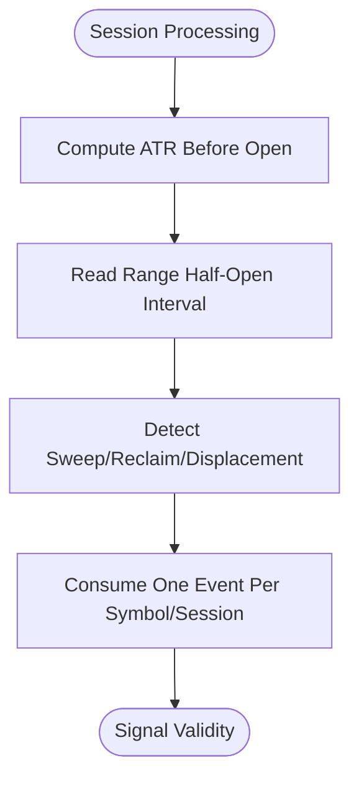

**Diagram sources**
- [test_source_contract.py:196-210](file://tests/test_source_contract.py#L196-L210)
- [test_source_contract.py:230-267](file://tests/test_source_contract.py#L230-L267)

**Section sources**
- [test_source_contract.py:196-210](file://tests/test_source_contract.py#L196-L210)
- [test_source_contract.py:230-267](file://tests/test_source_contract.py#L230-L267)

### Risk Management Parameters and Drawdown Controls
The tests assert:
- Drawdown reduce and shutdown percentages.
- Single half-risk tier application.
- Strategy shutdown reason present.
- Internal daily/weekly stop reasons excluded from persistent halt resets.

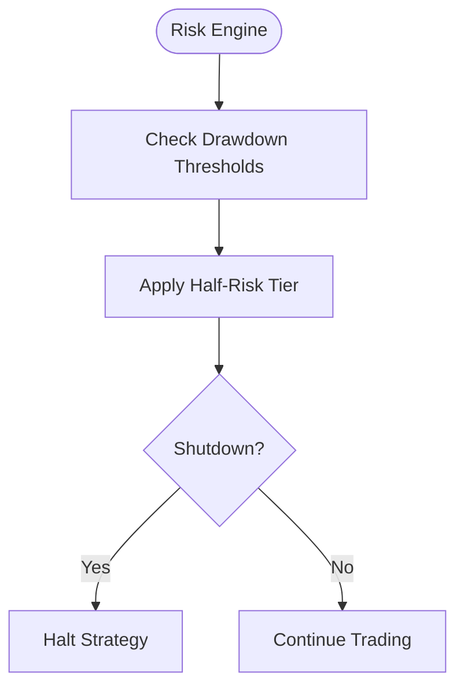

**Diagram sources**
- [test_source_contract.py:102-107](file://tests/test_source_contract.py#L102-L107)
- [test_source_contract.py:113-120](file://tests/test_source_contract.py#L113-L120)

**Section sources**
- [test_source_contract.py:102-107](file://tests/test_source_contract.py#L102-L107)
- [test_source_contract.py:113-120](file://tests/test_source_contract.py#L113-L120)

### Instance Locking and Heartbeat
The tests assert:
- Heartbeat published before owner claim.
- Release does not zero heartbeat improperly.
- Initialization cleanup cancels pending orders and closes positions when halted.

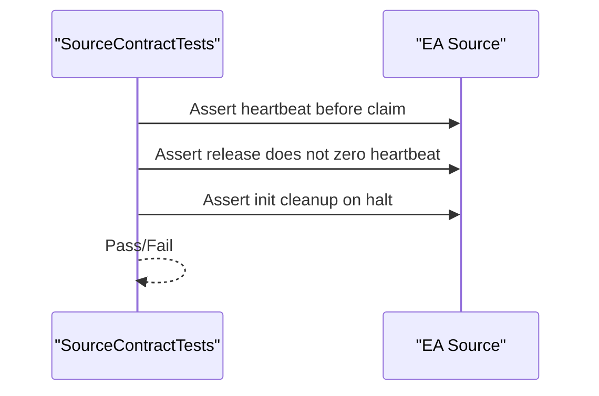

**Diagram sources**
- [test_source_contract.py:176-186](file://tests/test_source_contract.py#L176-L186)
- [test_source_contract.py:128-136](file://tests/test_source_contract.py#L128-L136)

**Section sources**
- [test_source_contract.py:176-186](file://tests/test_source_contract.py#L176-L186)
- [test_source_contract.py:128-136](file://tests/test_source_contract.py#L128-L136)

### Additional Contract Assertions
- Pending orders send visible stop and target; missing triggers specific rejections.
- Daily state uses first net positive and two-trade lock.
- Fresh state rejects cancelled order history without deals.
- State load failure cleans exposure only after lock.
- Trade plan persisted and reconciled.
- Account-wide exposure and persistent halt present.
- Quote checks use same tick snapshot.
- Breakeven retry limited to one persisted attempt.
- Failed submission latches and reconciles before plan clear.
- Collision ranking uses frozen priority before cost/time.
- Server offset checked in seconds.
- News block day counter structure and H1 EMA bias filter structure.
- Stats insufficient is error level.

**Section sources**
- [test_source_contract.py:89-100](file://tests/test_source_contract.py#L89-L100)
- [test_source_contract.py:108-112](file://tests/test_source_contract.py#L108-L112)
- [test_source_contract.py:138-155](file://tests/test_source_contract.py#L138-L155)
- [test_source_contract.py:156-175](file://tests/test_source_contract.py#L156-L175)
- [test_source_contract.py:371-391](file://tests/test_source_contract.py#L371-L391)
- [test_source_contract.py:402-425](file://tests/test_source_contract.py#L402-L425)
- [test_source_contract.py:503-542](file://tests/test_source_contract.py#L503-L542)

## Dependency Analysis
The contract validation depends on:
- The canonical strategy specification for rule definitions.
- The EA source for structural and behavioral assertions.
- Reference math for deterministic expectations.
- Validator tests for replay pipeline integrity.

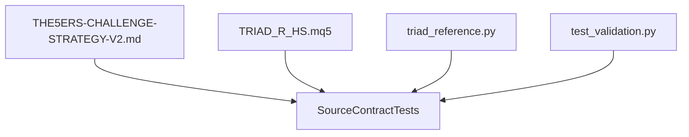

**Diagram sources**
- [THE5ERS-CHALLENGE-STRATEGY-V2.md:1-200](file://THE5ERS-CHALLENGE-STRATEGY-V2.md#L1-L200)
- [TRIAD_R_HS.mq5:1-200](file://MQL5/Experts/TRIAD_R_HS/TRIAD_R_HS.mq5#L1-L200)
- [triad_reference.py:16-167](file://tests/triad_reference.py#L16-L167)
- [test_validation.py:1-317](file://tests/test_validation.py#L1-L317)

**Section sources**
- [test_source_contract.py:15-547](file://tests/test_source_contract.py#L15-L547)
- [test_validation.py:1-317](file://tests/test_validation.py#L1-L317)

## Performance Considerations
- Static contract tests run quickly and deterministically since they inspect source text and reference math without compiling or executing MQL5.
- Avoid adding heavy I/O or network calls to SourceContractTests to keep CI fast.
- Prefer regex and string searches for structural checks; reserve complex parsing for reference modules if needed.
- Keep test assertions focused on contract invariants to minimize flakiness.

[No sources needed since this section provides general guidance]

## Troubleshooting Guide
Common failure categories and remediation steps:
- Forbidden token found: Remove prohibited behaviors such as partial closes, close-by, direct market orders, or risky risk multipliers.
- Missing constant/marker: Add required constants, reasons, or functions referenced by the test.
- Default gate not closed: Ensure order submission and all release gates default to false; add explicit defaults if missing.
- News schema mismatch: Fix header, time format, currency codes, impact values, or coverage rows; ensure coverage extends beyond required hours.
- Sizing logic incorrect: Use OrderCalcProfit, respect symbol volume properties, and apply round-down with min/max bounds.
- Persistence signature mismatch: Ensure ordered writes and matching signatures for state and halt latch; validate reads reject mismatches.
- Session/pattern semantics drift: Align range reads to half-open intervals; ensure ATR uses closed bars and indicator buffers; confirm sweep/reclaim/displacement logic.
- Operational guard missing: Add required constants, alerts, and checks referenced by the test.

When interpreting failures:
- Identify the failing assertion method and locate the corresponding requirement in the canonical specification or README.
- Trace the assertion to the relevant section of the EA source to understand the expected behavior.
- Update the EA source to conform to the contract; rerun tests to confirm resolution.
- If updating requirements, adjust both the specification and the corresponding test assertions.

**Section sources**
- [test_source_contract.py:76-88](file://tests/test_source_contract.py#L76-L88)
- [test_source_contract.py:27-42](file://tests/test_source_contract.py#L27-L42)
- [test_source_contract.py:188-194](file://tests/test_source_contract.py#L188-L194)
- [test_source_contract.py:269-370](file://tests/test_source_contract.py#L269-L370)
- [test_source_contract.py:196-210](file://tests/test_source_contract.py#L196-L210)
- [test_source_contract.py:427-467](file://tests/test_source_contract.py#L427-L467)

## Conclusion
The SourceContractTests provide a robust, static contract validation layer that enforces the canonical strategy specification, operational safeguards, and compliance requirements for the TRIAD_R_HS expert advisor. By asserting defaults, forbidden tokens, required constants, control flow invariants, risk/sizing alignment, session/pattern semantics, news calendar schema/runtime checks, and persistence signatures, the tests ensure that production code remains aligned with strategy requirements. Maintaining these tests alongside evolving specifications helps prevent drift and supports safe, compliant deployment.

[No sources needed since this section summarizes without analyzing specific files]

## Appendices

### Guidance for Writing New Contract Tests
- Identify the requirement in the canonical specification or README.
- Determine whether the requirement is structural (defaults, constants, markers), behavioral (control flow, sequencing), or mathematical (risk/sizing, daily state).
- Write assertions using regex and string searches where appropriate; avoid fragile parsing.
- Include negative assertions to forbid prohibited behaviors.
- If introducing new features, add corresponding reference math expectations and update related tests.
- Run the full test suite locally before committing changes.

**Section sources**
- [test_source_contract.py:15-547](file://tests/test_source_contract.py#L15-L547)
- [triad_reference.py:16-167](file://tests/triad_reference.py#L16-L167)
- [THE5ERS-CHALLENGE-STRATEGY-V2.md:1-200](file://THE5ERS-CHALLENGE-STRATEGY-V2.md#L1-L200)