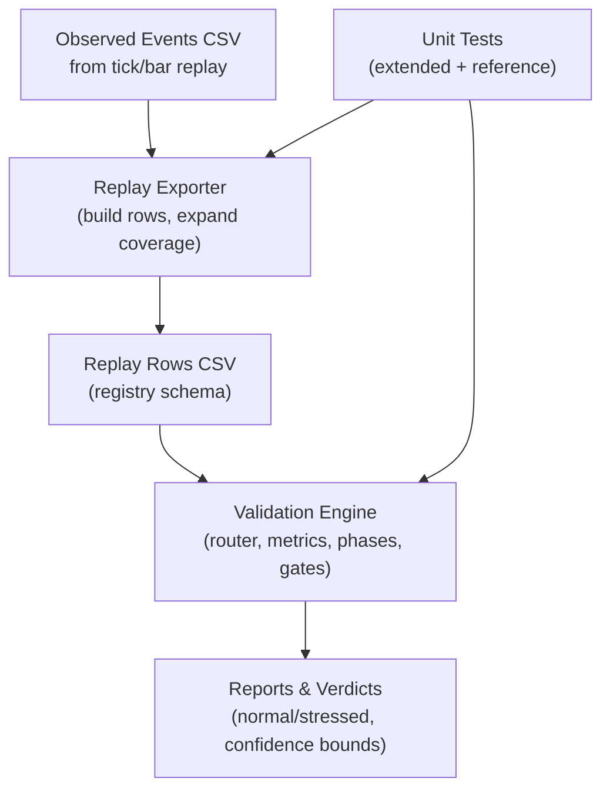
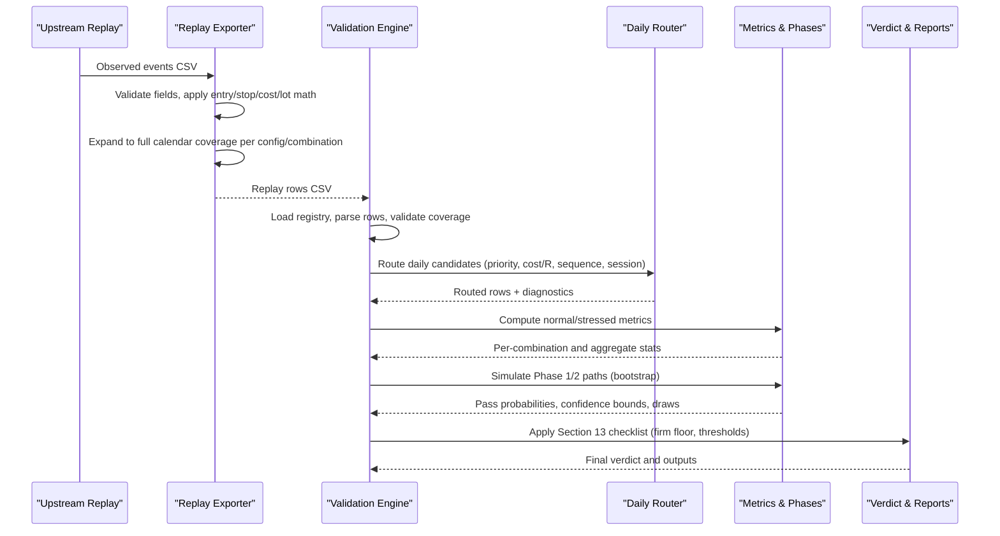
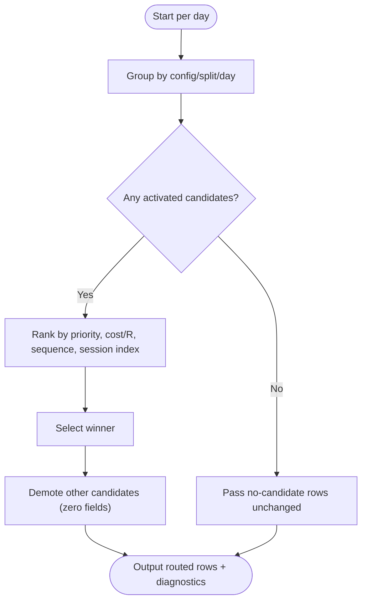
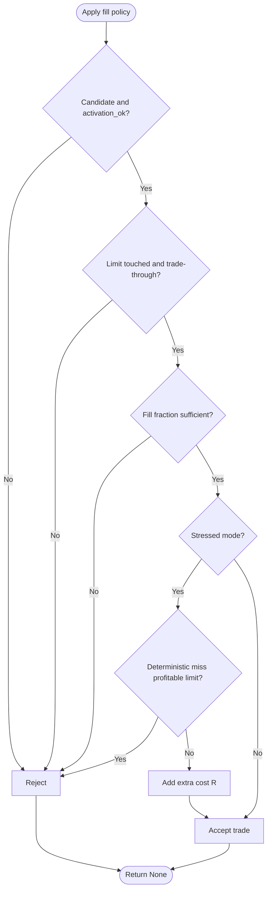
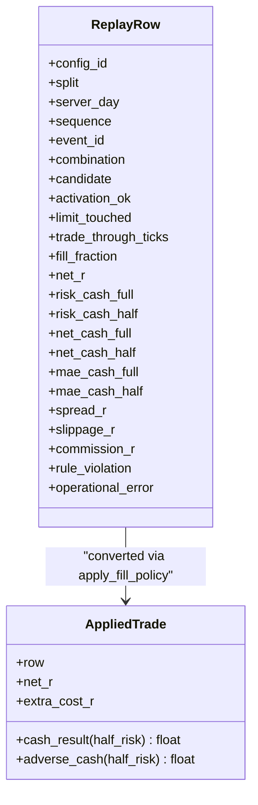
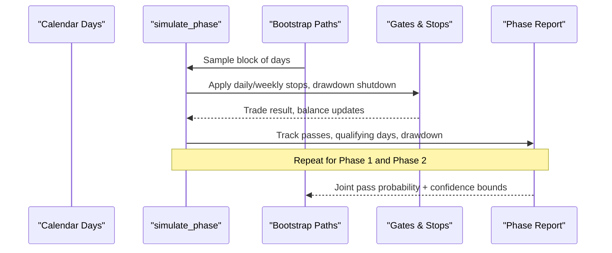
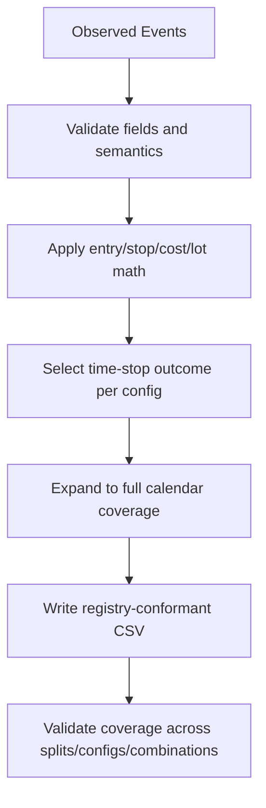
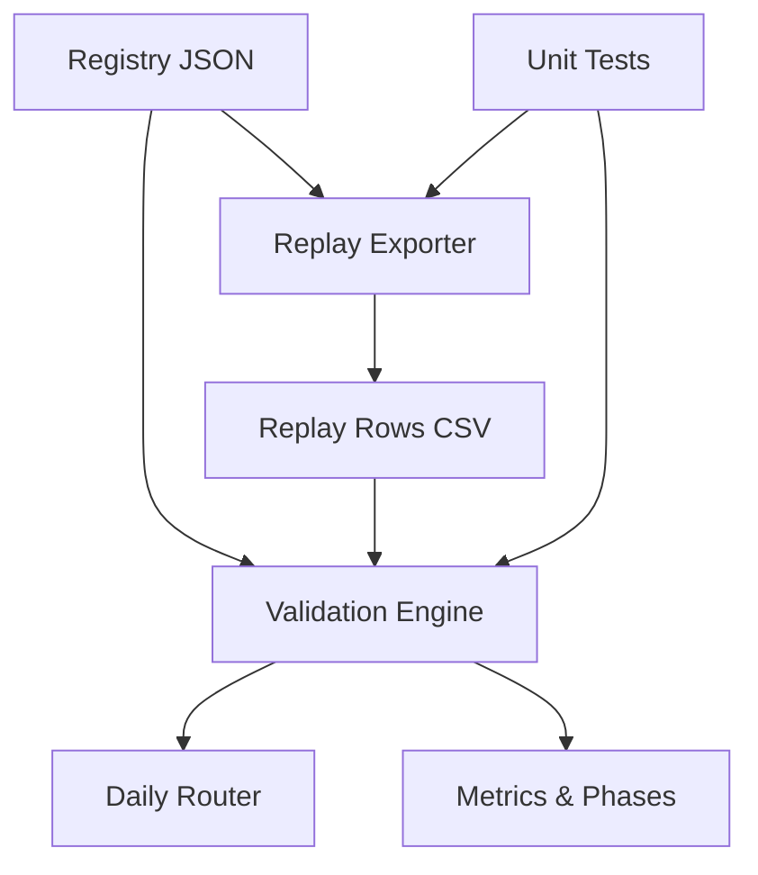

# Extended Validation Testing

<cite>
**Referenced Files in This Document**
- [test_extended_validation.py](file://tests/test_extended_validation.py)
- [test_validation.py](file://tests/test_validation.py)
- [test_reference.py](file://tests/test_reference.py)
- [triad_validation.py](file://tools/triad_validation.py)
- [replay_export.py](file://tools/replay_export.py)
- [triad_v2_1_registry.json](file://validation/triad_v2_1_registry.json)
- [triad_v2_2_ablation_registry.json](file://validation/triad_v2_2_ablation_registry.json)
</cite>

## Table of Contents
1. [Introduction](#introduction)
2. [Project Structure](#project-structure)
3. [Core Components](#core-components)
4. [Architecture Overview](#architecture-overview)
5. [Detailed Component Analysis](#detailed-component-analysis)
6. [Dependency Analysis](#dependency-analysis)
7. [Performance Considerations](#performance-considerations)
8. [Troubleshooting Guide](#troubleshooting-guide)
9. [Conclusion](#conclusion)
10. [Appendices](#appendices)

## Introduction
This document explains the extended validation testing framework used to deeply validate complex trading scenarios beyond basic functionality. It focuses on how multi-session interactions, cross-currency correlations, and risk management rules are validated under realistic and stressed conditions. It also covers stress testing, load testing, scenario validation under extreme market conditions, integration between replay export and validation, data consistency checks, and performance benchmarking. Finally, it provides guidance for creating new extended validation scenarios, interpreting results, and maintaining coverage of edge cases that could impact live trading operations.

## Project Structure
The extended validation framework is organized around three layers:
- Replay export layer: converts observed signal events into a registry-conformant CSV with full calendar coverage across configurations and instrument/session combinations.
- Validation engine: applies frozen strategy rules, routing, metrics, phase simulations, and Section 13 checklist gates to select and evaluate candidates.
- Test suite: unit tests that verify router behavior, metric extensions, phase simulation, replay exporter correctness, and reference math.

**Diagram sources**
- [replay_export.py:1-122](file://tools/replay_export.py#L1-L122)
- [triad_validation.py:360-437](file://tools/triad_validation.py#L360-L437)
- [triad_validation.py:803-875](file://tools/triad_validation.py#L803-L875)
- [triad_validation.py:1122-1200](file://tools/triad_validation.py#L1122-L1200)

**Section sources**
- [replay_export.py:1-122](file://tools/replay_export.py#L1-L122)
- [triad_validation.py:360-437](file://tools/triad_validation.py#L360-L437)
- [triad_validation.py:803-875](file://tools/triad_validation.py#L803-L875)
- [triad_validation.py:1122-1200](file://tools/triad_validation.py#L1122-L1200)

## Core Components
- Replay exporter: validates observed events, applies frozen per-config arithmetic (entry, stop, cost gate, lot rounding, cash risk/net target/time-stop selection), and expands to full calendar coverage for every configuration and allowed combination. It enforces split cuts declared before data generation and rejects unknown combinations or out-of-window dates.
- Validation engine: loads registry, parses replay rows, validates coverage, applies fill policy (including stressed costs), routes daily candidates using account-wide priority and tie-breaks, computes metrics (fill rates, cash utilization, year robustness), simulates Phase 1 and Phase 2 targets with moving-block bootstrap, and evaluates Section 13 checklist gates including firm-floor checks and confidence bounds.
- Test suite: verifies router selection, metric extensions, phase simulation outcomes, exporter row math and coverage, and reference calculations such as profile cash, volume rounding, session time bounds, and halt latch signatures.

Key responsibilities:
- Multi-session interactions: one-position routing per day across EURUSD_LONDON, GBPUSD_LONDON, USDJPY_NEW_YORK; first-signal-wins within same combination; stable session index tie-break.
- Cross-currency correlations: independent eligibility per combination; portfolio-level routing ensures only one candidate per day; correlation-aware risk groups are enforced by strategy design and validated through coverage and routing diagnostics.
- Risk management: daily/weekly stops, drawdown shutdown, firm overall floor checks, budget underuse detection, qualifying wins thresholds, and stressed cost penalties.

**Section sources**
- [triad_validation.py:49-68](file://tools/triad_validation.py#L49-L68)
- [triad_validation.py:112-145](file://tools/triad_validation.py#L112-L145)
- [triad_validation.py:162-181](file://tools/triad_validation.py#L162-L181)
- [triad_validation.py:183-229](file://tools/triad_validation.py#L183-L229)
- [triad_validation.py:480-497](file://tools/triad_validation.py#L480-L497)
- [triad_validation.py:803-875](file://tools/triad_validation.py#L803-L875)
- [triad_validation.py:941-1072](file://tools/triad_validation.py#L941-L1072)
- [replay_export.py:1-122](file://tools/replay_export.py#L1-L122)

## Architecture Overview
The end-to-end flow from observed events to validated reports:

**Diagram sources**
- [replay_export.py:1-122](file://tools/replay_export.py#L1-L122)
- [triad_validation.py:360-437](file://tools/triad_validation.py#L360-L437)
- [triad_validation.py:803-875](file://tools/triad_validation.py#L803-L875)
- [triad_validation.py:1122-1200](file://tools/triad_validation.py#L1122-L1200)
- [triad_validation.py:1380-1385](file://tools/triad_validation.py#L1380-L1385)

## Detailed Component Analysis

### Daily Router and Multi-Session Interaction
The router enforces one-position-per-day across allowed combinations. It ranks activated candidates by:
- Combination priority (predeclared)
- Lower all-in cost/R
- Earlier completed signal (sequence)
- Stable session index

Demoted candidates keep audit flags and zeroed risk/cash fields so coverage remains intact.

**Diagram sources**
- [triad_validation.py:803-875](file://tools/triad_validation.py#L803-L875)

**Section sources**
- [triad_validation.py:751-800](file://tools/triad_validation.py#L751-L800)
- [triad_validation.py:803-875](file://tools/triad_validation.py#L803-L875)
- [test_extended_validation.py:100-197](file://tests/test_extended_validation.py#L100-L197)

### Fill Policy and Stress Testing
The fill policy models conservative execution assumptions:
- Requires minimum trade-through ticks
- Rejects partial fills below threshold
- In stressed mode, deterministically misses some profitable limits and increases modeled spread/slippage costs

Stress testing validates resilience by applying extra cost R and removing otherwise profitable opportunities based on a stable hash of config/event/seed.

**Diagram sources**
- [triad_validation.py:480-497](file://tools/triad_validation.py#L480-L497)

**Section sources**
- [triad_validation.py:112-128](file://tools/triad_validation.py#L112-L128)
- [triad_validation.py:480-497](file://tools/triad_validation.py#L480-L497)
- [test_validation.py:135-176](file://tests/test_validation.py#L135-L176)

### Metric Extensions and Data Consistency
Metric extensions provide deeper insight into execution quality and risk utilization:
- Fill rate, activation refusals, limit touch rate, trade-through rate
- Net cash totals and means for full/half risk
- All-in cost R mean
- Small positive wins vs qualifying wins
- Executed risk fraction utilization and budget underuse share
- Calendar-year robustness (no single year responsible for entire profit)

Data consistency is enforced via strict CSV schema validation, unique key checks, and coverage verification across splits and combinations.

**Diagram sources**
- [triad_validation.py:183-229](file://tools/triad_validation.py#L183-L229)
- [triad_validation.py:480-497](file://tools/triad_validation.py#L480-L497)

**Section sources**
- [triad_validation.py:521-643](file://tools/triad_validation.py#L521-L643)
- [triad_validation.py:646-708](file://tools/triad_validation.py#L646-L708)
- [triad_validation.py:360-437](file://tools/triad_validation.py#L360-L437)
- [test_extended_validation.py:199-298](file://tests/test_extended_validation.py#L199-L298)

### Phase Simulation and Scenario Validation Under Extreme Conditions
Phase simulation uses moving-block bootstrap to simulate two phases against targets:
- Phase 1 target fraction and required qualifying days
- Phase 2 target fraction and required qualifying days
- Daily and weekly stops, drawdown shutdown, inactivity guard
- Tracks maximum drawdown, days in drawdown, and joint pass probability with Wilson score confidence bounds

Extreme condition validation includes:
- Stressed metrics (higher costs, missed profitable limits)
- Firm overall floor breach checks over many simulated paths
- Year robustness checks ensuring profits are not concentrated in a single regime

**Diagram sources**
- [triad_validation.py:970-1072](file://tools/triad_validation.py#L970-L1072)
- [triad_validation.py:1122-1200](file://tools/triad_validation.py#L1122-L1200)
- [triad_validation.py:1357-1377](file://tools/triad_validation.py#L1357-L1377)

**Section sources**
- [triad_validation.py:970-1072](file://tools/triad_validation.py#L970-L1072)
- [triad_validation.py:1122-1200](file://tools/triad_validation.py#L1122-L1200)
- [test_extended_validation.py:300-406](file://tests/test_extended_validation.py#L300-L406)

### Replay Export Integration and Coverage Validation
The replay exporter:
- Validates observed event fields and semantics
- Applies frozen per-config entry/stop/cost/lot math
- Selects time-stop outcome based on configuration horizon
- Expands events to full calendar coverage for every configuration and allowed combination
- Enforces predeclared split cuts and rejects unknown combinations or out-of-window dates

Coverage validation ensures:
- Every configuration has rows for every allowed combination and server day in both WALK_FORWARD and HOLDOUT
- No missing records can improve results or hide inactivity intervals

**Diagram sources**
- [replay_export.py:1-122](file://tools/replay_export.py#L1-L122)
- [triad_validation.py:440-473](file://tools/triad_validation.py#L440-L473)

**Section sources**
- [replay_export.py:1-122](file://tools/replay_export.py#L1-L122)
- [test_extended_validation.py:408-578](file://tests/test_extended_validation.py#L408-L578)
- [triad_validation.py:440-473](file://tools/triad_validation.py#L440-L473)

### Reference Math and Persistence Integrity
Reference tests validate core strategy math and persistence integrity:
- Profile cash calculations and active risk fractions
- Profitable day logic using lower midnight value
- Phase locking thresholds
- Firm floors and reserves
- Volume rounding down to contract constraints
- Session time bounds across DST transitions
- Halt latch signature invalidation on mutation

These ensure that the validator’s assumptions align with the EA’s frozen rules and that persisted state cannot be tampered with silently.

**Section sources**
- [test_reference.py:27-129](file://tests/test_reference.py#L27-L129)
- [test_reference.py:131-157](file://tests/test_reference.py#L131-L157)

## Dependency Analysis
The framework exhibits clear separation of concerns:
- Replay exporter depends on registry schema and validation types but does not change frozen rules.
- Validation engine depends on registry, replay rows, and test utilities; it orchestrates routing, metrics, and phase simulations.
- Tests depend on both exporter and validation engine to assert correctness and coverage.

**Diagram sources**
- [triad_v2_1_registry.json:1-15](file://validation/triad_v2_1_registry.json#L1-L15)
- [triad_v2_2_ablation_registry.json:1-89](file://validation/triad_v2_2_ablation_registry.json#L1-L89)
- [replay_export.py:140-150](file://tools/replay_export.py#L140-L150)
- [triad_validation.py:360-437](file://tools/triad_validation.py#L360-L437)

**Section sources**
- [triad_v2_1_registry.json:1-15](file://validation/triad_v2_1_registry.json#L1-L15)
- [triad_v2_2_ablation_registry.json:1-89](file://validation/triad_v2_2_ablation_registry.json#L1-L89)
- [replay_export.py:140-150](file://tools/replay_export.py#L140-L150)
- [triad_validation.py:360-437](file://tools/triad_validation.py#L360-L437)

## Performance Considerations
- Bootstrap path counts: selection_paths and holdout_paths control computational load; tests use reduced values for speed while production runs use higher counts for robust statistics.
- Moving-block bootstrap: blocks of calendar days preserve temporal dependence; block_days parameter balances variance and autocorrelation.
- Stress testing overhead: stressed metrics add deterministic misses and cost adjustments; ensure seed stability for reproducibility.
- CSV I/O: large replay datasets require efficient parsing; schema validation prevents costly downstream errors.
- Router efficiency: grouping by config/split/day and sorting by composite key minimizes per-day ranking cost.

[No sources needed since this section provides general guidance]

## Troubleshooting Guide
Common issues and resolutions:
- CSV header mismatch: run schema command to print expected fields and regenerate exports accordingly.
- Unknown combination or out-of-window date: ensure observed events match ALLOWED_COMBINATIONS and fall within preregistered WALK_FORWARD/HOLDOUT ranges.
- Duplicate replay rows: ensure unique keys per config/split/day/sequence/event_id.
- Missing coverage: generate explicit no-candidate rows for every configuration/combination/day in both splits.
- Registry hash mismatch: any modification to configuration or thresholds invalidates the committed registry; re-register if changes are intentional.
- Phase simulation failures: check daily/weekly stops, drawdown shutdown thresholds, and inactivity guards; adjust settings or inspect trade sequences causing early termination.
- Firm floor breaches: review loss sequences and stop levels; consider adjusting daily/weekly stops or risk fractions to reduce breach probability.

**Section sources**
- [triad_validation.py:360-437](file://tools/triad_validation.py#L360-L437)
- [triad_validation.py:440-473](file://tools/triad_validation.py#L440-L473)
- [triad_validation.py:1357-1377](file://tools/triad_validation.py#L1357-L1377)
- [test_extended_validation.py:546-573](file://tests/test_extended_validation.py#L546-L573)

## Conclusion
The extended validation testing framework provides rigorous, reproducible validation of complex trading scenarios. It enforces multi-session routing, cross-currency correlation controls, and comprehensive risk management through detailed metrics, phase simulations, and Section 13 checklist gates. The replay exporter ensures data consistency and full coverage, while the test suite validates router behavior, metric extensions, and reference math. By following the documented methodology, teams can create new scenarios, interpret results confidently, and maintain robust coverage of edge cases critical to live trading operations.

[No sources needed since this section summarizes without analyzing specific files]

## Appendices

### Creating New Extended Validation Scenarios
Steps:
- Define new observed events or modify existing ones to represent new market regimes or edge cases.
- Ensure events conform to the observed-event CSV contract and include all required fields.
- Use the replay exporter to build registry-conformant rows with full calendar coverage.
- Run validation with appropriate thresholds and settings; inspect diagnostics for routing decisions and metric anomalies.
- Add unit tests to assert expected behavior for new scenarios.

**Section sources**
- [replay_export.py:1-122](file://tools/replay_export.py#L1-L122)
- [triad_validation.py:360-437](file://tools/triad_validation.py#L360-L437)
- [test_extended_validation.py:408-578](file://tests/test_extended_validation.py#L408-L578)

### Interpreting Complex Test Results
Key indicators:
- Fill rates and activation refusals: identify execution bottlenecks or gating issues.
- Budget underuse share: detect sizing inefficiencies relative to risk budgets.
- Year robustness: ensure profits are not concentrated in a single calendar year.
- Phase pass probabilities and confidence bounds: assess reliability of strategy performance under resampling.
- Firm floor breach rate: measure tail risk exposure and adequacy of stops.

**Section sources**
- [triad_validation.py:521-643](file://tools/triad_validation.py#L521-L643)
- [triad_validation.py:1122-1200](file://tools/triad_validation.py#L1122-L1200)
- [triad_validation.py:1357-1377](file://tools/triad_validation.py#L1357-L1377)

### Maintaining Comprehensive Coverage of Edge Cases
Best practices:
- Include no-candidate rows for days with no signals to prevent hidden inactivity intervals.
- Validate all combinations and splits explicitly; avoid relying on inferred coverage.
- Use stressed scenarios to probe resilience under adverse conditions.
- Regularly re-run reference tests to catch drift in session time bounds, volume rounding, and persistence integrity.
- Keep registries frozen and versioned; re-register only when changes are intentional and documented.

**Section sources**
- [triad_validation.py:440-473](file://tools/triad_validation.py#L440-L473)
- [triad_v2_1_registry.json:1-15](file://validation/triad_v2_1_registry.json#L1-L15)
- [triad_v2_2_ablation_registry.json:1-89](file://validation/triad_v2_2_ablation_registry.json#L1-L89)
- [test_reference.py:27-157](file://tests/test_reference.py#L27-L157)