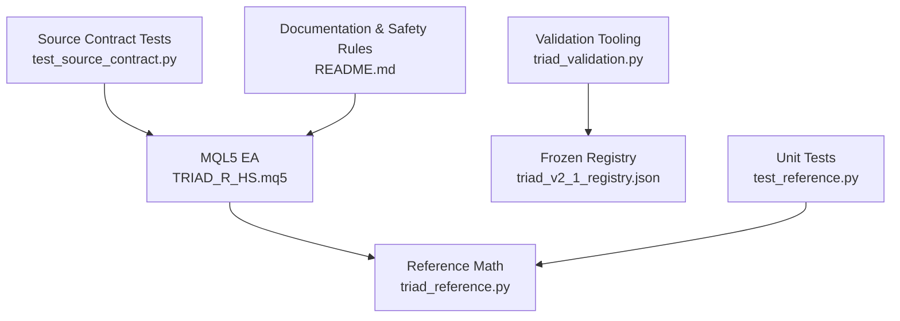
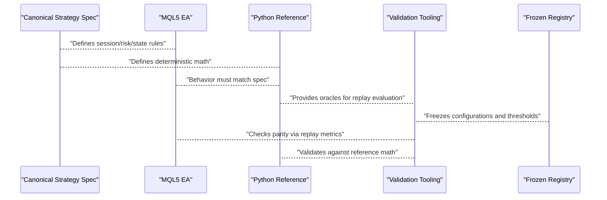
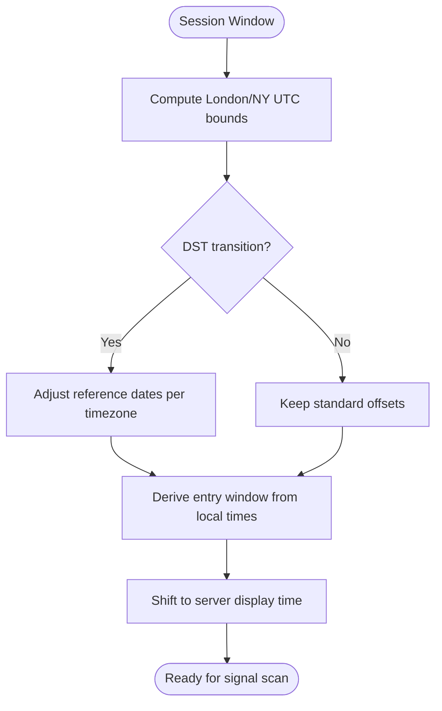
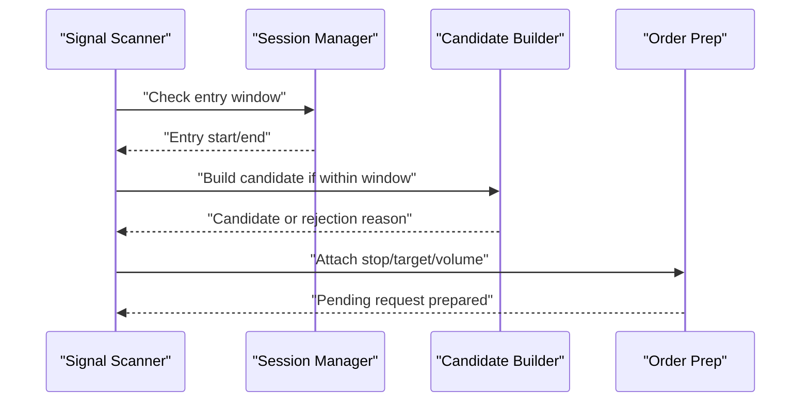
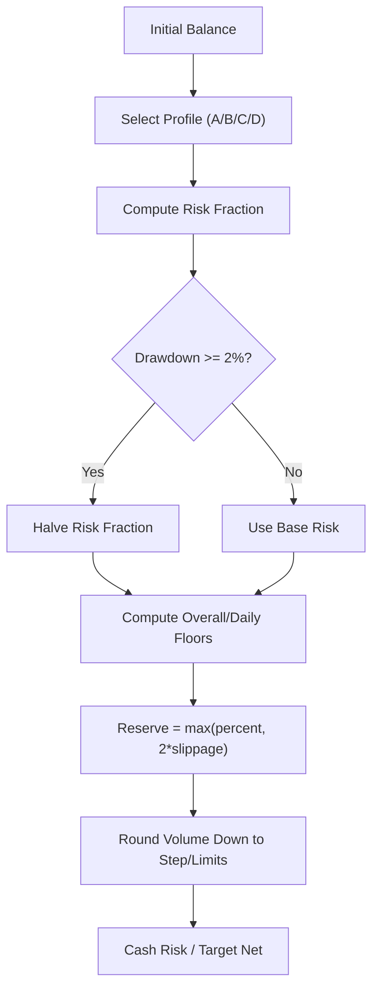
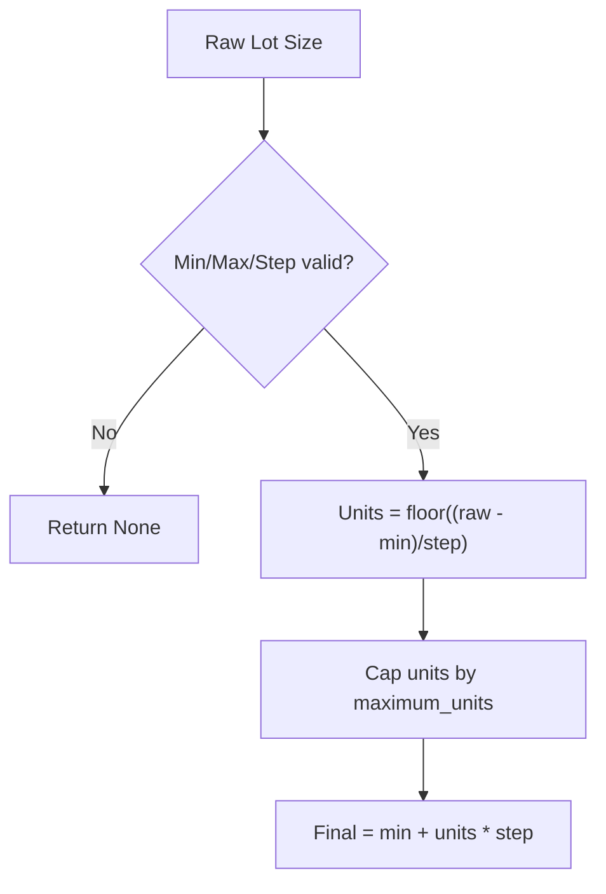
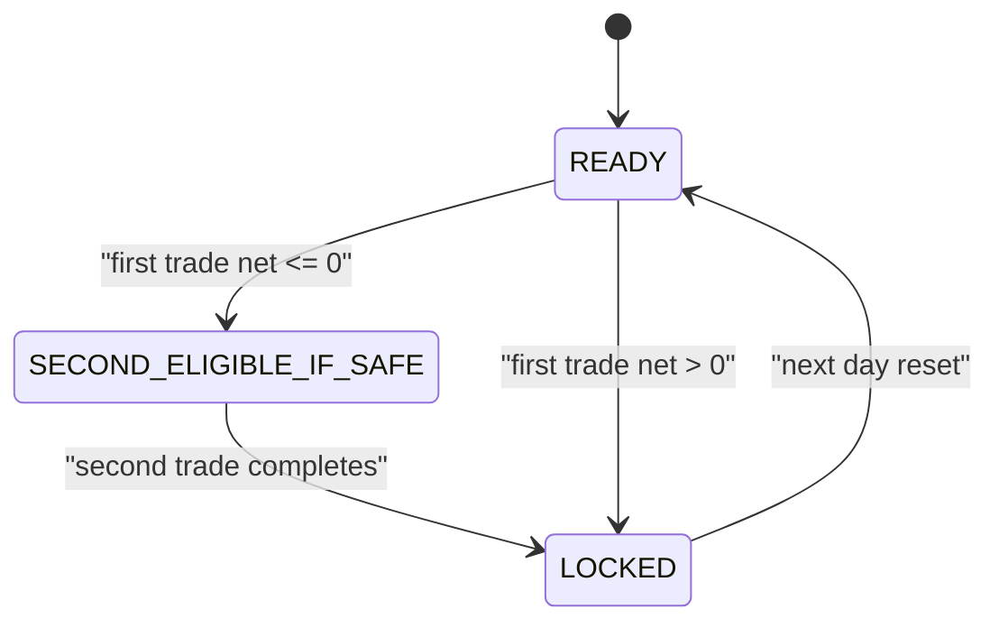
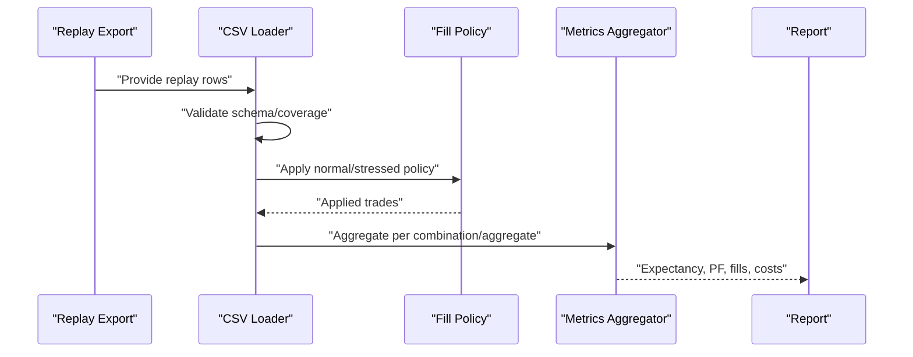
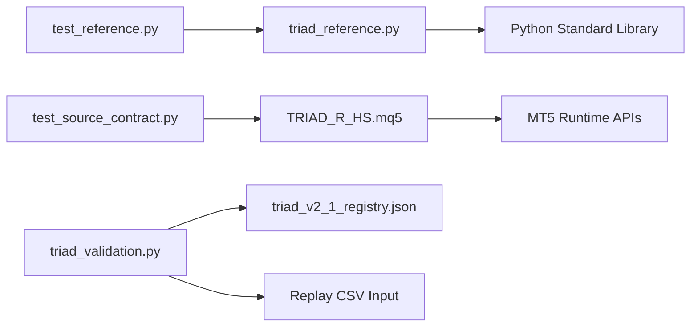

# Reference Implementation

<cite>
**Referenced Files in This Document**
- [triad_reference.py](file://tests/triad_reference.py)
- [test_reference.py](file://tests/test_reference.py)
- [TRIAD_R_HS.mq5](file://MQL5/Experts/TRIAD_R_HS/TRIAD_R_HS.mq5)
- [README.md](file://MQL5/Experts/TRIAD_R_HS/README.md)
- [triad_validation.py](file://tools/triad_validation.py)
- [triad_v2_1_registry.json](file://validation/triad_v2_1_registry.json)
- [test_source_contract.py](file://tests/test_source_contract.py)
</cite>

## Table of Contents
1. [Introduction](#introduction)
2. [Project Structure](#project-structure)
3. [Core Components](#core-components)
4. [Architecture Overview](#architecture-overview)
5. [Detailed Component Analysis](#detailed-component-analysis)
6. [Dependency Analysis](#dependency-analysis)
7. [Performance Considerations](#performance-considerations)
8. [Troubleshooting Guide](#troubleshooting-guide)
9. [Conclusion](#conclusion)
10. [Appendices](#appendices)

## Introduction
This document describes the TRIAD reference implementation as the authoritative Python verification layer for the trading strategy logic implemented in MQL5 production code. It explains how the reference model mathematically verifies session management, signal detection boundaries, risk calculations, and position sizing rules. It also documents the relationship between the Python reference and the MQL5 Expert Advisor (EA), the validation tooling that enforces parity across a frozen configuration matrix, and the practices required to keep both implementations synchronized when strategy logic changes. The goal is to provide a clear, progressive understanding for both technical and non-technical readers while preserving precise traceability to source files.

## Project Structure
The repository separates concerns into three layers:
- Production EA: MQL5 expert implementing live behavior with strict safety defaults and persistence.
- Reference implementation: Pure-Python functions modeling core arithmetic and state transitions deterministically.
- Validation tooling: Frozen registry and offline replay evaluation to verify selection and performance under standardized assumptions.

**Diagram sources**
- [TRIAD_R_HS.mq5:1-200](file://MQL5/Experts/TRIAD_R_HS/TRIAD_R_HS.mq5#L1-L200)
- [triad_reference.py:1-167](file://tests/triad_reference.py#L1-L167)
- [triad_validation.py:1-120](file://tools/triad_validation.py#L1-L120)
- [triad_v2_1_registry.json:1-50](file://validation/triad_v2_1_registry.json#L1-L50)
- [test_reference.py:1-161](file://tests/test_reference.py#L1-L161)
- [test_source_contract.py:1-100](file://tests/test_source_contract.py#L1-L100)
- [README.md:1-120](file://MQL5/Experts/TRIAD_R_HS/README.md#L1-L120)

**Section sources**
- [TRIAD_R_HS.mq5:1-200](file://MQL5/Experts/TRIAD_R_HS/TRIAD_R_HS.mq5#L1-L200)
- [triad_reference.py:1-167](file://tests/triad_reference.py#L1-L167)
- [triad_validation.py:1-120](file://tools/triad_validation.py#L1-L120)
- [triad_v2_1_registry.json:1-50](file://validation/triad_v2_1_registry.json#L1-L50)
- [test_reference.py:1-161](file://tests/test_reference.py#L1-L161)
- [test_source_contract.py:1-100](file://tests/test_source_contract.py#L1-L100)
- [README.md:1-120](file://MQL5/Experts/TRIAD_R_HS/README.md#L1-L120)

## Core Components
- Reference math module: deterministic functions for profiles, drawdown tiers, daily state transitions, firm floors/reserves, volume rounding, phase targets, session bounds, and UTC/server time conversions.
- Unit tests: assert correctness of profile cash math, drawdown halving and shutdown, daily state locking, profitable day calculation, phase target confirmation days, firm floor/reserve logic, volume rounding, and civil-time/DST handling.
- Source contract tests: enforce that the MQL5 EA implements only allowed behaviors, uses correct inputs by default, persists trade plans, and avoids prohibited order submission paths.
- Validation tooling: builds and validates a frozen 160-configuration matrix, loads replay CSVs with strict schema checks, applies fill policies (normal and stressed), computes metrics, selects champions using walk-forward data, and evaluates holdout outcomes.

Key responsibilities:
- Mathematical verification: ensure session windows, risk sizing, and state transitions are consistent across platforms.
- Parity enforcement: validate that MQL5 behavior matches canonical specification and Python reference through unit and contract tests.
- Offline evaluation: simulate execution outcomes under conservative assumptions and robust statistical gates.

**Section sources**
- [triad_reference.py:16-167](file://tests/triad_reference.py#L16-L167)
- [test_reference.py:27-161](file://tests/test_reference.py#L27-L161)
- [test_source_contract.py:15-200](file://tests/test_source_contract.py#L15-L200)
- [triad_validation.py:98-181](file://tools/triad_validation.py#L98-L181)

## Architecture Overview
The architecture ensures implementation parity through layered verification:

**Diagram sources**
- [TRIAD_R_HS.mq5:16-140](file://MQL5/Experts/TRIAD_R_HS/TRIAD_R_HS.mq5#L16-L140)
- [triad_reference.py:16-167](file://tests/triad_reference.py#L16-L167)
- [triad_validation.py:278-331](file://tools/triad_validation.py#L278-L331)
- [triad_v2_1_registry.json:1-50](file://validation/triad_v2_1_registry.json#L1-L50)

## Detailed Component Analysis

### Session Management
- Reference provides UTC-aware session bounds for London and New York sessions, including DST-aware conversion and server offset shifting.
- MQL5 maintains runtime session structures with range start/end, entry windows, and readiness flags; it enforces early cutoffs and news blackout buffers.
- Tests assert DST mismatch weeks and UK/US DST transitions produce correct UTC boundaries.

**Diagram sources**
- [triad_reference.py:134-167](file://tests/triad_reference.py#L134-L167)
- [TRIAD_R_HS.mq5:158-178](file://MQL5/Experts/TRIAD_R_HS/TRIAD_R_HS.mq5#L158-L178)

**Section sources**
- [triad_reference.py:134-167](file://tests/triad_reference.py#L134-L167)
- [TRIAD_R_HS.mq5:158-178](file://MQL5/Experts/TRIAD_R_HS/TRIAD_R_HS.mq5#L158-L178)
- [test_reference.py:131-157](file://tests/test_reference.py#L131-L157)

### Signal Detection
- Reference does not implement pattern detection directly but defines session windows and timing constraints used by the EA’s detection pipeline.
- MQL5 constructs candidates with sweep/reclaim geometry, ATR-based regime filters, displacement thresholds, and expiry windows; it logs rejections and candidate validity.
- Contract tests confirm pending orders include visible stop/target and that detection respects session boundaries and ATR computation timing.

**Diagram sources**
- [TRIAD_R_HS.mq5:180-207](file://MQL5/Experts/TRIAD_R_HS/TRIAD_R_HS.mq5#L180-L207)
- [test_source_contract.py:89-100](file://tests/test_source_contract.py#L89-L100)

**Section sources**
- [TRIAD_R_HS.mq5:180-207](file://MQL5/Experts/TRIAD_R_HS/TRIAD_R_HS.mq5#L180-L207)
- [test_source_contract.py:89-100](file://tests/test_source_contract.py#L89-L100)

### Risk Calculations
- Reference models four paired profiles with risk fractions and target R values; it halves risk at drawdown threshold and shuts down beyond a hard limit.
- Firm floors and reserves protect downside; volume rounding ensures downward-safe lot sizes aligned with symbol step and limits.
- Tests verify profile cash outputs, drawdown tier behavior, firm floor math, reserve selection, and volume rounding edge cases.

**Diagram sources**
- [triad_reference.py:22-125](file://tests/triad_reference.py#L22-L125)
- [test_reference.py:27-129](file://tests/test_reference.py#L27-L129)

**Section sources**
- [triad_reference.py:22-125](file://tests/triad_reference.py#L22-L125)
- [test_reference.py:27-129](file://tests/test_reference.py#L27-L129)

### Position Sizing
- Reference rounds volumes down to nearest step within symbol limits, returning None if raw size is below minimum or invalid parameters are provided.
- MQL5 uses broker APIs to compute profit and align volume with SYMBOL_VOLUME_STEP and SYMBOL_VOLUME_LIMIT; contract tests assert these mechanisms are present and no prohibited direct market-entry calls exist.

**Diagram sources**
- [triad_reference.py:106-115](file://tests/triad_reference.py#L106-L115)
- [test_source_contract.py:188-194](file://tests/test_source_contract.py#L188-L194)

**Section sources**
- [triad_reference.py:106-115](file://tests/triad_reference.py#L106-L115)
- [test_source_contract.py:188-194](file://tests/test_source_contract.py#L188-L194)

### Daily State and Phase Targets
- Reference defines daily states: READY, SECOND_ELIGIBLE_IF_SAFE, DAY_LOCKED based on completed trade nets; profitable day result uses the lower of midnight balance/equity minus previous day balance.
- Phase targets require dashboard-confirmed days before completion; phase_locked returns (phase_complete, target_pending_days).
- Tests assert first net-positive locks the day, zero/loss allows second trade eligibility, and phase targets require three confirmed days.

**Diagram sources**
- [triad_reference.py:30-88](file://tests/triad_reference.py#L30-L88)
- [test_reference.py:85-105](file://tests/test_reference.py#L85-L105)

**Section sources**
- [triad_reference.py:30-88](file://tests/triad_reference.py#L30-L88)
- [test_reference.py:85-105](file://tests/test_reference.py#L85-L105)

### Validation and Replay Evaluation
- The validation tooling enforces a frozen 160-configuration matrix covering range percentile bands, ATR percentile bands, time stops, profiles, and breakeven policies.
- Replay rows are strictly validated for schema, coverage, and consistency; applied trades incorporate normal/stressed fill policies and cost adjustments.
- Metrics include expectancy, profit factor, fill rates, calendar-year robustness, and simulation gates for phases and drawdowns.

**Diagram sources**
- [triad_validation.py:360-437](file://tools/triad_validation.py#L360-L437)
- [triad_validation.py:480-498](file://tools/triad_validation.py#L480-L498)
- [triad_validation.py:646-708](file://tools/triad_validation.py#L646-L708)

**Section sources**
- [triad_validation.py:98-181](file://tools/triad_validation.py#L98-L181)
- [triad_validation.py:360-437](file://tools/triad_validation.py#L360-L437)
- [triad_validation.py:480-498](file://tools/triad_validation.py#L480-L498)
- [triad_validation.py:646-708](file://tools/triad_validation.py#L646-L708)
- [triad_v2_1_registry.json:1-50](file://validation/triad_v2_1_registry.json#L1-L50)

## Dependency Analysis
- The reference module depends only on Python standard library types (dataclasses, datetime, decimal, enum, zoneinfo) ensuring deterministic, platform-independent math.
- The MQL5 EA depends on MT5 APIs for indicators, trade operations, terminal globals, and file I/O; it references the canonical strategy spec and README for operational constraints.
- Validation tooling depends on a frozen registry to constrain configuration space and thresholds; it reads replay CSVs and produces reports without modifying live systems.

**Diagram sources**
- [triad_reference.py:1-167](file://tests/triad_reference.py#L1-L167)
- [TRIAD_R_HS.mq5:1-200](file://MQL5/Experts/TRIAD_R_HS/TRIAD_R_HS.mq5#L1-L200)
- [triad_validation.py:1-120](file://tools/triad_validation.py#L1-L120)
- [triad_v2_1_registry.json:1-50](file://validation/triad_v2_1_registry.json#L1-L50)
- [test_reference.py:1-161](file://tests/test_reference.py#L1-L161)
- [test_source_contract.py:1-100](file://tests/test_source_contract.py#L1-L100)

**Section sources**
- [triad_reference.py:1-167](file://tests/triad_reference.py#L1-L167)
- [TRIAD_R_HS.mq5:1-200](file://MQL5/Experts/TRIAD_R_HS/TRIAD_R_HS.mq5#L1-L200)
- [triad_validation.py:1-120](file://tools/triad_validation.py#L1-L120)
- [triad_v2_1_registry.json:1-50](file://validation/triad_v2_1_registry.json#L1-L50)
- [test_reference.py:1-161](file://tests/test_reference.py#L1-L161)
- [test_source_contract.py:1-100](file://tests/test_source_contract.py#L1-L100)

## Performance Considerations
- Use Decimal in reference math to avoid floating-point drift in financial calculations; this ensures deterministic parity with MQL5 double computations when mapped correctly.
- Avoid unnecessary recomputation of session bounds; cache per-day results where appropriate in both reference and EA.
- In validation, batch CSV parsing and aggregate metrics efficiently; leverage set/dict lookups for coverage checks and router keys.
- Stress testing should be run with fixed seeds to ensure reproducibility; use block-bootstrap intervals and familywise adjustments to control multiple comparisons.

[No sources needed since this section provides general guidance]

## Troubleshooting Guide
Common issues and resolutions:
- Registry hash mismatch: indicates the frozen registry was altered; regenerate using the validator’s build function and commit the new hash.
- CSV schema mismatch: ensure replay exports match the declared fields; run the schema command to print expected headers.
- Missing coverage: every configuration/combination/day must be exported, including no-candidate rows; missing entries invalidate selection.
- Activation refusals: candidates may be blocked by gates, sizing skips, or router demotions; inspect activation_ok and rule_violation flags.
- Fill policy failures: baseline requires trade-through ticks and full fill; stressed scenarios remove some profitable limits and increase costs.

**Section sources**
- [triad_validation.py:317-331](file://tools/triad_validation.py#L317-L331)
- [triad_validation.py:360-437](file://tools/triad_validation.py#L360-L437)
- [triad_validation.py:480-498](file://tools/triad_validation.py#L480-L498)

## Conclusion
The TRIAD reference implementation provides a rigorous, deterministic foundation for verifying the MQL5 production EA’s session management, signal detection boundaries, risk calculations, and position sizing. Through unit tests, source contract checks, and a frozen validation registry, it ensures parity with the canonical strategy specification. Maintaining synchronization involves updating both the reference math and the EA together, regenerating and committing the registry when configuration matrices change, and running comprehensive validation across walk-forward and holdout splits. This approach supports educational understanding, safe research, and disciplined deployment practices.

[No sources needed since this section summarizes without analyzing specific files]

## Appendices

### Updating the Reference When Strategy Logic Changes
- Update reference functions to reflect new session windows, risk tiers, or state transitions; add unit tests asserting new behavior.
- If configuration matrix changes (e.g., new range/ATR bands or time stops), rebuild the registry and commit the new SHA-256; update validation thresholds if necessary.
- Ensure MQL5 EA mirrors changes: update enums, inputs, session logic, and persistence; run contract tests to confirm prohibited behaviors remain absent.
- Re-run validation with fresh replay exports; verify selection and holdout outcomes meet gates; archive evidence alongside source checksums.

**Section sources**
- [triad_reference.py:16-167](file://tests/triad_reference.py#L16-L167)
- [triad_validation.py:278-331](file://tools/triad_validation.py#L278-L331)
- [test_source_contract.py:15-200](file://tests/test_source_contract.py#L15-L200)
- [README.md:120-147](file://MQL5/Experts/TRIAD_R_HS/README.md#L120-L147)

### Using the Reference for Educational Purposes
- Study session bounds and DST handling to understand multi-timezone trading windows.
- Examine profile cash math and drawdown tiers to learn risk scaling and shutdown logic.
- Review daily state transitions and phase targets to grasp intra-day trading controls and dashboard-driven progression.
- Explore validation metrics to understand how expectancy, profit factor, and stress scenarios inform robust strategy assessment.

**Section sources**
- [triad_reference.py:22-167](file://tests/triad_reference.py#L22-L167)
- [test_reference.py:27-161](file://tests/test_reference.py#L27-L161)
- [triad_validation.py:521-708](file://tools/triad_validation.py#L521-L708)