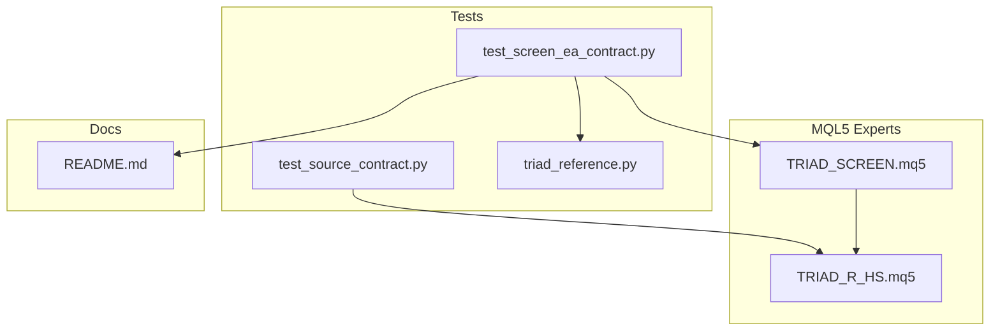
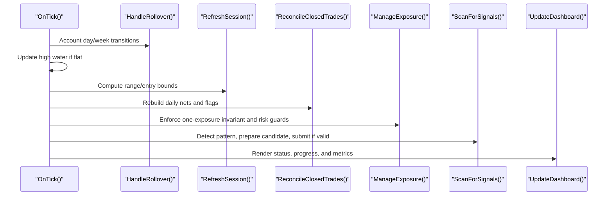
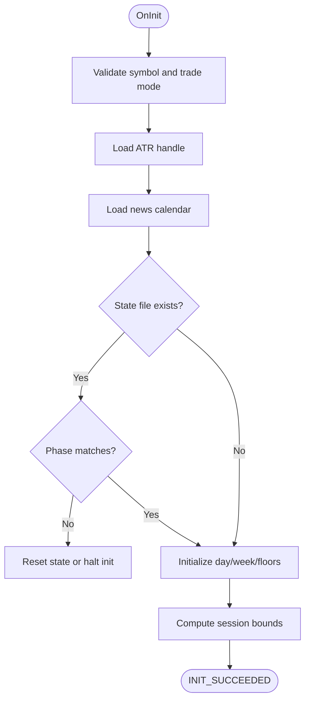
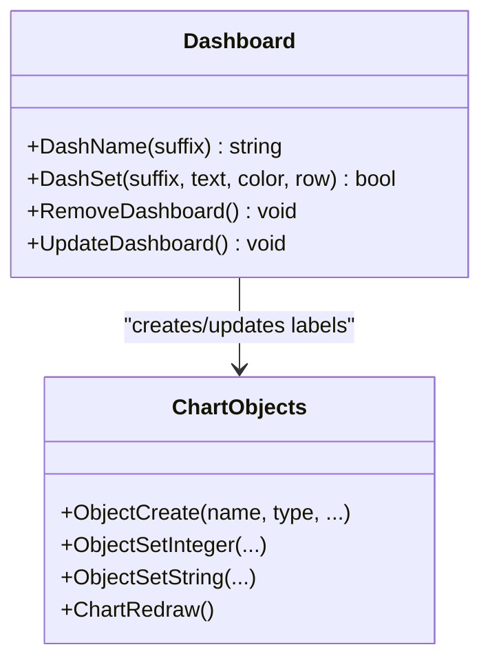
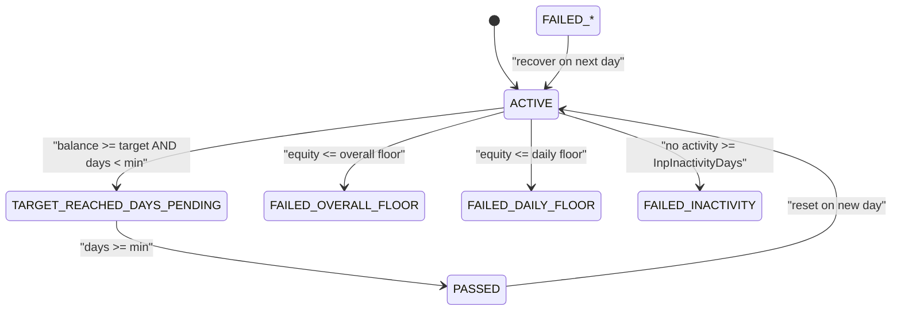
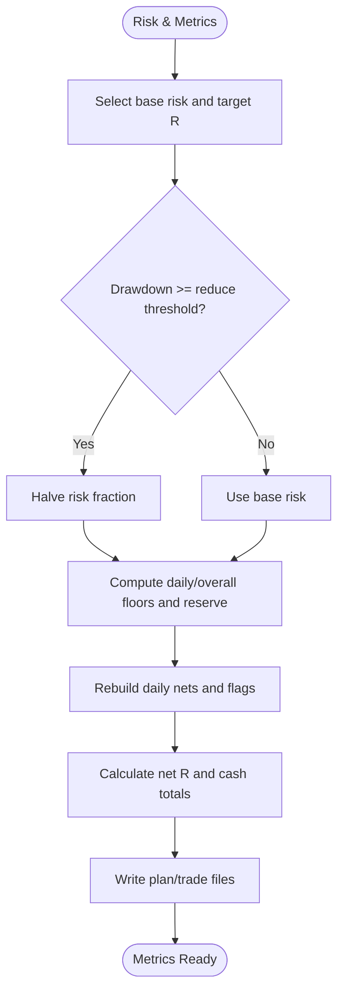
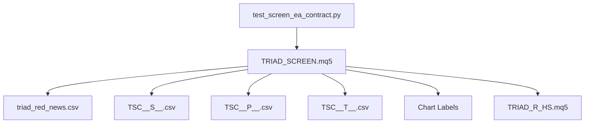

# Screen EA Contract Testing

<cite>
**Referenced Files in This Document**
- [test_screen_ea_contract.py](file://tests/test_screen_ea_contract.py)
- [TRIAD_SCREEN.mq5](file://MQL5/Experts/TRIAD_SCREEN/TRIAD_SCREEN.mq5)
- [README.md](file://MQL5/Experts/TRIAD_SCREEN/README.md)
- [triad_reference.py](file://tests/triad_reference.py)
- [test_source_contract.py](file://tests/test_source_contract.py)
- [TRIAD_R_HS.mq5](file://MQL5/Experts/TRIAD_R_HS/TRIAD_R_HS.mq5)
</cite>

## Table of Contents
1. [Introduction](#introduction)
2. [Project Structure](#project-structure)
3. [Core Components](#core-components)
4. [Architecture Overview](#architecture-overview)
5. [Detailed Component Analysis](#detailed-component-analysis)
6. [Dependency Analysis](#dependency-analysis)
7. [Performance Considerations](#performance-considerations)
8. [Troubleshooting Guide](#troubleshooting-guide)
9. [Conclusion](#conclusion)
10. [Appendices](#appendices)

## Introduction
This document explains the contract testing for the TRIAD_SCREEN multi-symbol screening Expert Advisor (EA). The test suite validates that the screen EA:
- Initializes correctly with a single symbol and session window per account
- Scans supported symbols and enforces a controlled universe
- Implements dashboard display logic on the chart
- Simulates challenge rules, including phase targets, qualifying days, daily/overall floors, and inactivity
- Applies risk profiles and guards consistently with the canonical strategy
- Calculates performance metrics such as net R and cash totals
- Manages chart objects and user interface elements safely
- Maintains compliance with research requirements while remaining separate from the canonical production EA

The goal is to ensure consistent behavior across market conditions and provide guidance for extending functionality without breaking the established contracts.

## Project Structure
The repository contains:
- MQL5 Experts implementing the screen EA and the canonical strategy
- Python tests that assert static contracts and behavioral invariants
- Reference math module used by tests to validate arithmetic and time handling
- Documentation describing usage, safety semantics, and operational constraints

**Diagram sources**
- [test_screen_ea_contract.py:1-321](file://tests/test_screen_ea_contract.py#L1-L321)
- [TRIAD_SCREEN.mq5:1-3509](file://MQL5/Experts/TRIAD_SCREEN/TRIAD_SCREEN.mq5#L1-L3509)
- [TRIAD_R_HS.mq5:1-200](file://MQL5/Experts/TRIAD_R_HS/TRIAD_R_HS.mq5#L1-L200)
- [test_source_contract.py:1-547](file://tests/test_source_contract.py#L1-L547)
- [triad_reference.py:1-167](file://tests/triad_reference.py#L1-L167)
- [README.md:1-159](file://MQL5/Experts/TRIAD_SCREEN/README.md#L1-L159)

**Section sources**
- [test_screen_ea_contract.py:1-321](file://tests/test_screen_ea_contract.py#L1-L321)
- [TRIAD_SCREEN.mq5:1-3509](file://MQL5/Experts/TRIAD_SCREEN/TRIAD_SCREEN.mq5#L1-L3509)
- [test_source_contract.py:1-547](file://tests/test_source_contract.py#L1-L547)
- [triad_reference.py:1-167](file://tests/triad_reference.py#L1-L167)
- [README.md:1-159](file://MQL5/Experts/TRIAD_SCREEN/README.md#L1-L159)

## Core Components
The screen EA implements:
- Session-based scanning for London and New York windows
- Pattern detection based on sweep/reclaim/displacement geometry
- Candidate preparation with volume sizing, target solving, and spread/statistical gates
- Risk guards aligned with the canonical strategy’s drawdown and floor protections
- Challenge status machine reflecting phase targets, qualifying days, and inactivity
- Dashboard UI using chart labels to present status, progress, and settings fingerprint
- Trade ledger and plan persistence to compute accurate net R across restarts

Key behaviors validated by tests include:
- Order submission disabled by default
- Supported symbol universe enforcement
- Session bounds correctness for both windows
- Editable challenge presets with plan defaults
- Presence of challenge state machine markers and formulas
- Dashboard object creation and refresh
- One combo per account design
- Emergency cleanup bypassing request caps
- Strict retcode acceptance
- Price normalization anchored to tick size
- Config hash covering all behavior-affecting inputs
- Missed rollover checks using cross-day comparisons
- High water updates only while flat
- Ledger double-count and partial close guards
- Inactivity using deal history
- Deinit releasing handles and flattening exposure
- Friday flat and latency measurement
- Expected account currency check

**Section sources**
- [TRIAD_SCREEN.mq5:39-156](file://MQL5/Experts/TRIAD_SCREEN/TRIAD_SCREEN.mq5#L39-L156)
- [TRIAD_SCREEN.mq5:751-805](file://MQL5/Experts/TRIAD_SCREEN/TRIAD_SCREEN.mq5#L751-L805)
- [TRIAD_SCREEN.mq5:1235-1426](file://MQL5/Experts/TRIAD_SCREEN/TRIAD_SCREEN.mq5#L1235-L1426)
- [TRIAD_SCREEN.mq5:1431-1606](file://MQL5/Experts/TRIAD_SCREEN/TRIAD_SCREEN.mq5#L1431-L1606)
- [TRIAD_SCREEN.mq5:1771-2017](file://MQL5/Experts/TRIAD_SCREEN/TRIAD_SCREEN.mq5#L1771-L2017)
- [TRIAD_SCREEN.mq5:2083-2670](file://MQL5/Experts/TRIAD_SCREEN/TRIAD_SCREEN.mq5#L2083-L2670)
- [TRIAD_SCREEN.mq5:2672-2898](file://MQL5/Experts/TRIAD_SCREEN/TRIAD_SCREEN.mq5#L2672-L2898)
- [TRIAD_SCREEN.mq5:2992-3127](file://MQL5/Experts/TRIAD_SCREEN/TRIAD_SCREEN.mq5#L2992-L3127)
- [TRIAD_SCREEN.mq5:3199-3509](file://MQL5/Experts/TRIAD_SCREEN/TRIAD_SCREEN.mq5#L3199-L3509)
- [test_screen_ea_contract.py:44-316](file://tests/test_screen_ea_contract.py#L44-L316)

## Architecture Overview
The screen EA operates per demo account with one symbol and one session window. Each tick it:
- Handles rollover accounting and daily resets
- Updates high water only when flat
- Refreshes session bounds and range data
- Reconciles closed trades and manages exposure
- Scans for signals and prepares candidates
- Updates the on-chart dashboard

**Diagram sources**
- [TRIAD_SCREEN.mq5:3470-3503](file://MQL5/Experts/TRIAD_SCREEN/TRIAD_SCREEN.mq5#L3470-L3503)
- [TRIAD_SCREEN.mq5:2992-3084](file://MQL5/Experts/TRIAD_SCREEN/TRIAD_SCREEN.mq5#L2992-L3084)
- [TRIAD_SCREEN.mq5:751-805](file://MQL5/Experts/TRIAD_SCREEN/TRIAD_SCREEN.mq5#L751-L805)
- [TRIAD_SCREEN.mq5:2838-2898](file://MQL5/Experts/TRIAD_SCREEN/TRIAD_SCREEN.mq5#L2838-L2898)
- [TRIAD_SCREEN.mq5:2347-2649](file://MQL5/Experts/TRIAD_SCREEN/TRIAD_SCREEN.mq5#L2347-L2649)
- [TRIAD_SCREEN.mq5:3141-3196](file://MQL5/Experts/TRIAD_SCREEN/TRIAD_SCREEN.mq5#L3141-L3196)
- [TRIAD_SCREEN.mq5:3237-3325](file://MQL5/Experts/TRIAD_SCREEN/TRIAD_SCREEN.mq5#L3237-L3325)

## Detailed Component Analysis

### Initialization and Session-Based Signal Detection
- Validates symbol support and trading mode
- Loads ATR indicator handle and news calendar
- Persists or initializes day/challenge state
- Computes session bounds for London and New York windows
- Skips mid-session fresh starts when configured
- Ensures range data is authoritative after range_end

**Diagram sources**
- [TRIAD_SCREEN.mq5:3330-3444](file://MQL5/Experts/TRIAD_SCREEN/TRIAD_SCREEN.mq5#L3330-L3444)
- [TRIAD_SCREEN.mq5:751-805](file://MQL5/Experts/TRIAD_SCREEN/TRIAD_SCREEN.mq5#L751-L805)

**Section sources**
- [TRIAD_SCREEN.mq5:3330-3444](file://MQL5/Experts/TRIAD_SCREEN/TRIAD_SCREEN.mq5#L3330-L3444)
- [test_screen_ea_contract.py:57-74](file://tests/test_screen_ea_contract.py#L57-L74)

### Multi-Symbol Scanning Capabilities
- Supports a fixed set of majors plus EURJPY/GBPJPY
- Enforces symbol support at initialization
- Uses TSC_SYMBOLS array and SymbolSupported function
- Limits to one combo per account via InpSymbol and InpWindow

**Section sources**
- [TRIAD_SCREEN.mq5:77-90](file://MQL5/Experts/TRIAD_SCREEN/TRIAD_SCREEN.mq5#L77-L90)
- [TRIAD_SCREEN.mq5:356-369](file://MQL5/Experts/TRIAD_SCREEN/TRIAD_SCREEN.mq5#L356-L369)
- [test_screen_ea_contract.py:57-67](file://tests/test_screen_ea_contract.py#L57-L67)

### Dashboard Display Logic and Chart Object Management
- Creates OBJ_LABEL objects for each dashboard row
- Positions labels using CORNER_LEFT_UPPER and incremental Y distances
- Removes dashboard objects on deinit or when disabled
- Displays status, progress, floors, today’s metrics, and configuration fingerprint
- Triggers ChartRedraw to update visuals

**Diagram sources**
- [TRIAD_SCREEN.mq5:3201-3325](file://MQL5/Experts/TRIAD_SCREEN/TRIAD_SCREEN.mq5#L3201-L3325)

**Section sources**
- [TRIAD_SCREEN.mq5:3201-3325](file://MQL5/Experts/TRIAD_SCREEN/TRIAD_SCREEN.mq5#L3201-L3325)
- [test_screen_ea_contract.py:118-126](file://tests/test_screen_ea_contract.py#L118-L126)

### Challenge Simulation Features and Status Machine
- Tracks phase targets and qualifying days
- Computes overall and daily floors
- Detects inactivity using deal history
- Returns status strings like ACTIVE, PASSED, FAILED_OVERALL_FLOOR, FAILED_DAILY_FLOOR, FAILED_INACTIVITY, TARGET_REACHED_DAYS_PENDING
- Integrates with dashboard to show current status and progress

**Diagram sources**
- [TRIAD_SCREEN.mq5:3089-3127](file://MQL5/Experts/TRIAD_SCREEN/TRIAD_SCREEN.mq5#L3089-L3127)

**Section sources**
- [TRIAD_SCREEN.mq5:3089-3127](file://MQL5/Experts/TRIAD_SCREEN/TRIAD_SCREEN.mq5#L3089-L3127)
- [test_screen_ea_contract.py:75-117](file://tests/test_screen_ea_contract.py#L75-L117)

### Risk Profile Application and Performance Metrics Calculation
- Selects base risk fraction and target R based on profile
- Reduces risk fraction under drawdown thresholds
- Calculates firm reserve cash and floors
- Rebuilds daily closed trades to compute net R and cash totals
- Persists plan entries and trade records for crash-safe accounting

**Diagram sources**
- [TRIAD_SCREEN.mq5:1781-1865](file://MQL5/Experts/TRIAD_SCREEN/TRIAD_SCREEN.mq5#L1781-L1865)
- [TRIAD_SCREEN.mq5:1867-1947](file://MQL5/Experts/TRIAD_SCREEN/TRIAD_SCREEN.mq5#L1867-L1947)
- [TRIAD_SCREEN.mq5:2672-2898](file://MQL5/Experts/TRIAD_SCREEN/TRIAD_SCREEN.mq5#L2672-L2898)

**Section sources**
- [TRIAD_SCREEN.mq5:1781-1865](file://MQL5/Experts/TRIAD_SCREEN/TRIAD_SCREEN.mq5#L1781-L1865)
- [TRIAD_SCREEN.mq5:1867-1947](file://MQL5/Experts/TRIAD_SCREEN/TRIAD_SCREEN.mq5#L1867-L1947)
- [TRIAD_SCREEN.mq5:2672-2898](file://MQL5/Experts/TRIAD_SCREEN/TRIAD_SCREEN.mq5#L2672-L2898)

### Data Visualization Components and User Interface Elements
- Uses OBJ_LABEL for text rows
- Colors status lines based on outcome
- Shows session ranges, entry windows, and config hash
- Displays pending orders, positions, signals, candidates, fills, rejects
- Indicates calendar status and order submission mode

**Section sources**
- [TRIAD_SCREEN.mq5:3237-3325](file://MQL5/Experts/TRIAD_SCREEN/TRIAD_SCREEN.mq5#L3237-L3325)
- [test_screen_ea_contract.py:118-126](file://tests/test_screen_ea_contract.py#L118-L126)

### Extending Screen EA Functionality While Maintaining Contract Compliance
Guidelines:
- Preserve symbol universe and session window enums; add new symbols via TSC_SYMBOLS and validation
- Keep one combo per account design; avoid multi-combo concurrency
- Maintain risk guard parity with canonical strategy; any new guard must flatten exposure
- Ensure emergency cleanup bypasses non-emergency request caps
- Use tick-size anchoring for price normalization and volume rounding
- Include new behavior-affecting inputs in ConfigHash
- Update dashboard to reflect new metrics and states
- Add tests asserting presence of new markers and invariants

**Section sources**
- [TRIAD_SCREEN.mq5:77-90](file://MQL5/Experts/TRIAD_SCREEN/TRIAD_SCREEN.mq5#L77-L90)
- [TRIAD_SCREEN.mq5:386-451](file://MQL5/Experts/TRIAD_SCREEN/TRIAD_SCREEN.mq5#L386-L451)
- [TRIAD_SCREEN.mq5:2347-2404](file://MQL5/Experts/TRIAD_SCREEN/TRIAD_SCREEN.mq5#L2347-L2404)
- [test_screen_ea_contract.py:194-203](file://tests/test_screen_ea_contract.py#L194-L203)

## Dependency Analysis
The screen EA depends on:
- MQL5 standard library for trading and indicators
- News calendar CSV for blackout periods
- Persistent state and ledger files for continuity
- Canonical strategy patterns for entry/risk logic
- Tests validating static contracts and behavioral invariants

**Diagram sources**
- [TRIAD_SCREEN.mq5:329-354](file://MQL5/Experts/TRIAD_SCREEN/TRIAD_SCREEN.mq5#L329-L354)
- [TRIAD_SCREEN.mq5:456-545](file://MQL5/Experts/TRIAD_SCREEN/TRIAD_SCREEN.mq5#L456-L545)
- [TRIAD_SCREEN.mq5:2676-2806](file://MQL5/Experts/TRIAD_SCREEN/TRIAD_SCREEN.mq5#L2676-L2806)
- [TRIAD_SCREEN.mq5:3201-3325](file://MQL5/Experts/TRIAD_SCREEN/TRIAD_SCREEN.mq5#L3201-L3325)
- [test_screen_ea_contract.py:1-321](file://tests/test_screen_ea_contract.py#L1-L321)

**Section sources**
- [TRIAD_SCREEN.mq5:329-354](file://MQL5/Experts/TRIAD_SCREEN/TRIAD_SCREEN.mq5#L329-L354)
- [TRIAD_SCREEN.mq5:456-545](file://MQL5/Experts/TRIAD_SCREEN/TRIAD_SCREEN.mq5#L456-L545)
- [TRIAD_SCREEN.mq5:2676-2806](file://MQL5/Experts/TRIAD_SCREEN/TRIAD_SCREEN.mq5#L2676-L2806)
- [test_screen_ea_contract.py:1-321](file://tests/test_screen_ea_contract.py#L1-L321)

## Performance Considerations
- Range reads occur only after range_end to avoid starvation in New York window
- Comparable statistics gather historical sessions efficiently with bounded attempts
- Spread median computed from minute bars to gate wide spreads
- Volume calculation uses broker limits and step rounding to minimize failed submissions
- Request throttling prevents excessive API calls; emergency operations bypass non-emergency caps
- Dashboard refresh interval configurable to balance responsiveness and overhead

[No sources needed since this section provides general guidance]

## Troubleshooting Guide
Common issues and resolutions:
- Unsupported symbol: Ensure symbol is in TSC_SYMBOLS and selected in Market Watch
- State load mismatch: Verify combo and phase match; use Allow Phase Reset to clear stale state
- News coverage stale: Update triad_red_news.csv with COVERAGE row and required hours
- Pending plan mismatch: Confirm SL/TP/volume match plan; delete and resubmit if necessary
- Missing visible stops/targets: Repair or close position; ensure broker allows modifications
- Foreign exposure detected: Cancel/close own-magic exposure; investigate manual trades
- Inactivity failure: Ensure executed deals exist within InpInactivityDays
- Deinit exposure cleanup: Detaching with exposure triggers protective closes/cancels

**Section sources**
- [TRIAD_SCREEN.mq5:3338-3350](file://MQL5/Experts/TRIAD_SCREEN/TRIAD_SCREEN.mq5#L3338-L3350)
- [TRIAD_SCREEN.mq5:3385-3405](file://MQL5/Experts/TRIAD_SCREEN/TRIAD_SCREEN.mq5#L3385-L3405)
- [TRIAD_SCREEN.mq5:847-929](file://MQL5/Experts/TRIAD_SCREEN/TRIAD_SCREEN.mq5#L847-L929)
- [TRIAD_SCREEN.mq5:2407-2457](file://MQL5/Experts/TRIAD_SCREEN/TRIAD_SCREEN.mq5#L2407-L2457)
- [TRIAD_SCREEN.mq5:2357-2368](file://MQL5/Experts/TRIAD_SCREEN/TRIAD_SCREEN.mq5#L2357-L2368)
- [TRIAD_SCREEN.mq5:3107-3127](file://MQL5/Experts/TRIAD_SCREEN/TRIAD_SCREEN.mq5#L3107-L3127)
- [TRIAD_SCREEN.mq5:3446-3468](file://MQL5/Experts/TRIAD_SCREEN/TRIAD_SCREEN.mq5#L3446-L3468)

## Conclusion
The TRIAD_SCREEN EA provides a robust, research-focused screening tool that mirrors canonical strategy behavior while enabling multi-symbol, multi-window exploration on demo accounts. The contract tests enforce critical invariants around initialization, session handling, risk management, dashboard display, and challenge simulation. By adhering to these contracts and following extension guidelines, developers can safely enhance functionality while preserving reliability and consistency across diverse market conditions.

[No sources needed since this section summarizes without analyzing specific files]

## Appendices

### Test Coverage Summary
- Existence and build identifiers
- Order submission defaults
- Supported symbol universe
- Session windows and bounds
- Challenge preset editability and defaults
- Challenge status machine presence
- Qualifying day computation
- Dashboard objects and refresh
- One combo per account
- Canonical EA and registries untouched
- Strategy port markers
- ZeroMemory avoidance for string structs
- Undefined identifier checks
- Range loads timing
- Emergency cleanup bypass
- ManageExposure risk guards
- Fill adoption for same ticket
- Strict retcode acceptance
- Last Sunday UTC signature
- Price normalizers tick-size anchored
- Config hash coverage
- Missed rollover cross-day checks
- High water updates while flat
- Ledger double-count and partial close guards
- Inactivity using deal history
- Deinit handle release and exposure flattening
- Friday flat and latency measurement
- Expected account currency check
- System CLI surface separation

**Section sources**
- [test_screen_ea_contract.py:44-316](file://tests/test_screen_ea_contract.py#L44-L316)

### Reference Math Validation
- Profiles and active risk fractions
- Day state transitions
- Profitable day result calculation
- Firm floors and reserves
- Volume rounding
- Phase targets and locking
- Session bounds UTC conversion
- Server offset handling

**Section sources**
- [triad_reference.py:16-167](file://tests/triad_reference.py#L16-L167)

### Canonical Strategy Parity Notes
- Entry/risk definitions ported verbatim
- Safety semantics mirrored (one exposure, floor breach flattens, news blackout, Friday flat)
- Operational guards and logging aligned
- Dashboard and state persistence consistent

**Section sources**
- [TRIAD_R_HS.mq5:1-200](file://MQL5/Experts/TRIAD_R_HS/TRIAD_R_HS.mq5#L1-L200)
- [test_source_contract.py:427-467](file://tests/test_source_contract.py#L427-L467)