# Strategy Validation Testing

<cite>
**Referenced Files in This Document**
- [test_validation.py](file://tests/test_validation.py)
- [test_reference.py](file://tests/test_reference.py)
- [triad_reference.py](file://tests/triad_reference.py)
- [triad_validation.py](file://tools/triad_validation.py)
- [TRIAD_R_HS.mq5](file://MQL5/Experts/TRIAD_R_HS/TRIAD_R_HS.mq5)
- [test_extended_validation.py](file://tests/test_extended_validation.py)
</cite>

## Table of Contents
1. [Introduction](#introduction)
2. [Project Structure](#project-structure)
3. [Core Components](#core-components)
4. [Architecture Overview](#architecture-overview)
5. [Detailed Component Analysis](#detailed-component-analysis)
6. [Dependency Analysis](#dependency-analysis)
7. [Performance Considerations](#performance-considerations)
8. [Troubleshooting Guide](#troubleshooting-guide)
9. [Conclusion](#conclusion)
10. [Appendices](#appendices)

## Introduction
This document explains the strategy validation testing framework that ensures mathematical parity between the MQL5 production Expert Advisor and the Python reference implementations. It covers how tests verify signal detection algorithms, session boundary calculations, ATR computations, pattern recognition logic, sweep/reclaim identification, displacement measurements, entry timing, risk management validations, position sizing accuracy, and drawdown control mechanisms. It also provides guidance for adding new validation scenarios, debugging failures, and maintaining parity as the strategy evolves.

## Project Structure
The repository separates live trading code from offline validation tooling:
- MQL5 production code implements the live strategy with strict safety controls and deterministic state persistence.
- Python tools implement a frozen 160-configuration matrix, replay ingestion, champion selection, phase simulations, and Section 13 release gates.
- Tests validate both the reference math and the end-to-end pipeline, including router behavior, metric extensions, and export round-trips.

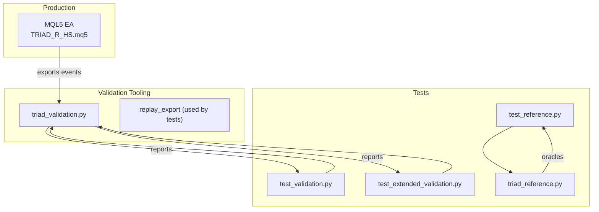

**Diagram sources**
- [triad_validation.py:1-30](file://tools/triad_validation.py#L1-L30)
- [TRIAD_R_HS.mq5:1-20](file://MQL5/Experts/TRIAD_R_HS/TRIAD_R_HS.mq5#L1-L20)
- [test_validation.py:1-30](file://tests/test_validation.py#L1-L30)
- [test_reference.py:1-25](file://tests/test_reference.py#L1-L25)
- [triad_reference.py:1-10](file://tests/triad_reference.py#L1-L10)

**Section sources**
- [triad_validation.py:1-30](file://tools/triad_validation.py#L1-L30)
- [TRIAD_R_HS.mq5:1-20](file://MQL5/Experts/TRIAD_R_HS/TRIAD_R_HS.mq5#L1-L20)
- [test_validation.py:1-30](file://tests/test_validation.py#L1-L30)
- [test_reference.py:1-25](file://tests/test_reference.py#L1-L25)
- [triad_reference.py:1-10](file://tests/triad_reference.py#L1-L10)

## Core Components
- Frozen registry and configuration matrix: defines 160 candidate configurations across range bands, ATR bands, time stops, profiles, and breakeven policies. The registry is hashed to prevent mutation.
- Replay ingestion and coverage checks: validates CSV schema, enforces allowed splits and combinations, and requires complete day coverage per configuration and combination.
- Fill policy and stress modeling: applies minimum trade-through requirements, rejects partial fills, and optionally removes profitable limits under stress while increasing modeled costs.
- Account-wide router: selects one daily winner per configuration using priority, all-in cost/R, sequence, and stable session index; demotes other candidates for auditability.
- Phase simulation and confidence bounds: bootstraps block days to simulate Phase 1 and Phase 2 targets, tracks drawdowns, qualifying days, and reports Wilson score intervals.
- Section 13 release gates: combines point estimates, year robustness, firm floor checks, and overshoot analysis into a final verdict.

**Section sources**
- [triad_validation.py:98-181](file://tools/triad_validation.py#L98-L181)
- [triad_validation.py:242-331](file://tools/triad_validation.py#L242-L331)
- [triad_validation.py:360-473](file://tools/triad_validation.py#L360-L473)
- [triad_validation.py:480-505](file://tools/triad_validation.py#L480-L505)
- [triad_validation.py:803-875](file://tools/triad_validation.py#L803-L875)
- [triad_validation.py:980-1214](file://tools/triad_validation.py#L980-L1214)
- [triad_validation.py:1343-1460](file://tools/triad_validation.py#L1343-L1460)

## Architecture Overview
The validation pipeline connects MQL5 exports to Python-based statistical evaluation and release gating.

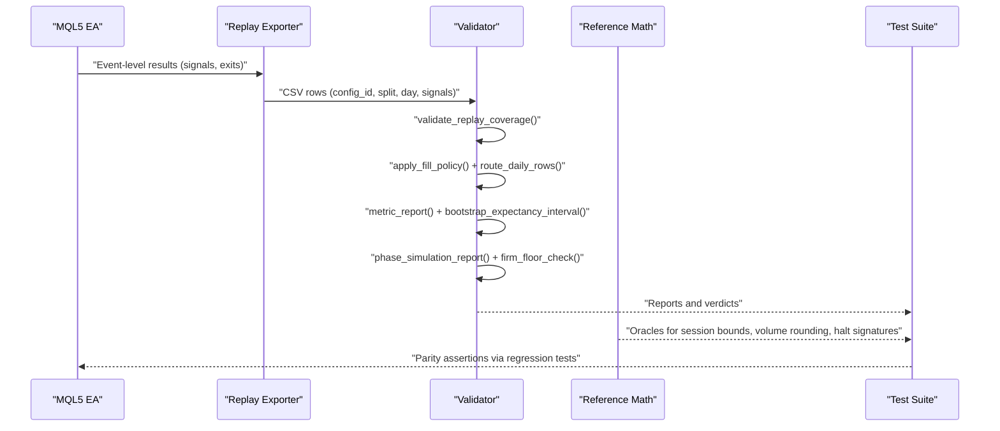

**Diagram sources**
- [triad_validation.py:360-473](file://tools/triad_validation.py#L360-L473)
- [triad_validation.py:480-505](file://tools/triad_validation.py#L480-L505)
- [triad_validation.py:803-875](file://tools/triad_validation.py#L803-L875)
- [triad_validation.py:1122-1214](file://tools/triad_validation.py#L1122-L1214)
- [triad_validation.py:1469-1522](file://tools/triad_validation.py#L1469-L1522)
- [triad_validation.py:1343-1460](file://tools/triad_validation.py#L1343-L1460)
- [test_reference.py:1-25](file://tests/test_reference.py#L1-L25)
- [triad_reference.py:134-167](file://tests/triad_reference.py#L134-L167)

## Detailed Component Analysis

### Signal Detection and Pattern Recognition
The MQL5 implementation detects sweep/reclaim patterns within session windows using ATR-normalized thresholds. It identifies the first qualifying sweep, tracks reclaim bars, and rejects ambiguous or invalid sequences. The Python validator consumes exported event rows and evaluates whether each candidate should activate based on fill policy and routing rules.

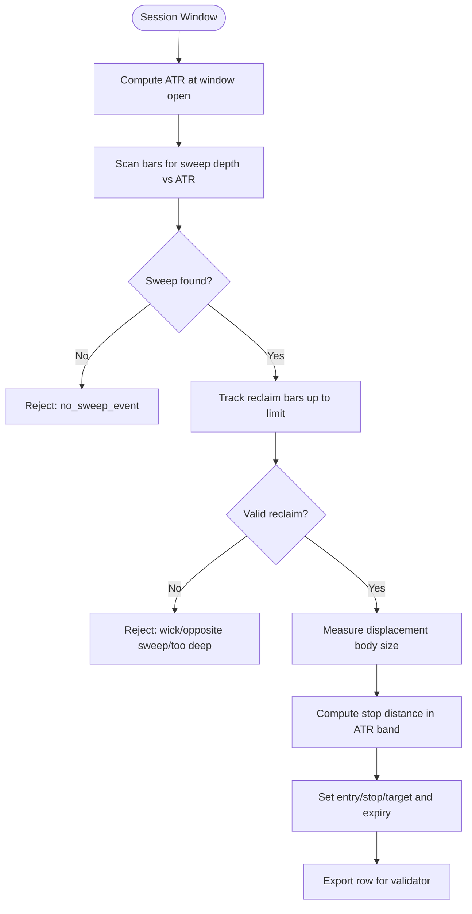

**Diagram sources**
- [TRIAD_R_HS.mq5:1949-2051](file://MQL5/Experts/TRIAD_R_HS/TRIAD_R_HS.mq5#L1949-L2051)
- [triad_validation.py:480-505](file://tools/triad_validation.py#L480-L505)

**Section sources**
- [TRIAD_R_HS.mq5:1949-2051](file://MQL5/Experts/TRIAD_R_HS/TRIAD_R_HS.mq5#L1949-L2051)
- [test_extended_validation.py:448-499](file://tests/test_extended_validation.py#L448-L499)

### Session Boundary Calculations
The reference module computes session start/end and entry windows in UTC, handling DST transitions for London and New York sessions. Tests assert correct boundaries during winter and summer, and ensure independence when US and UK DST differ within the same week.

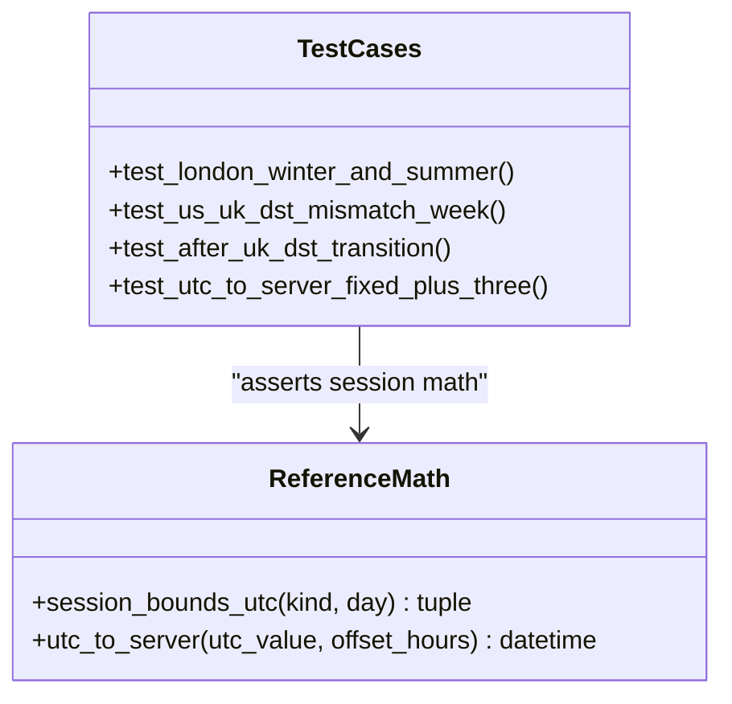

**Diagram sources**
- [triad_reference.py:134-167](file://tests/triad_reference.py#L134-L167)
- [test_reference.py:131-157](file://tests/test_reference.py#L131-L157)

**Section sources**
- [triad_reference.py:134-167](file://tests/triad_reference.py#L134-L167)
- [test_reference.py:131-157](file://tests/test_reference.py#L131-L157)

### ATR Computations and Stop Sizing
ATR is computed before the entry window opens to freeze regime volatility and prevent later signals from altering their scale. Stops are sized relative to ATR and validated against min/max bands. The Python exporter reconstructs stop distances and verifies net R after modeled costs.

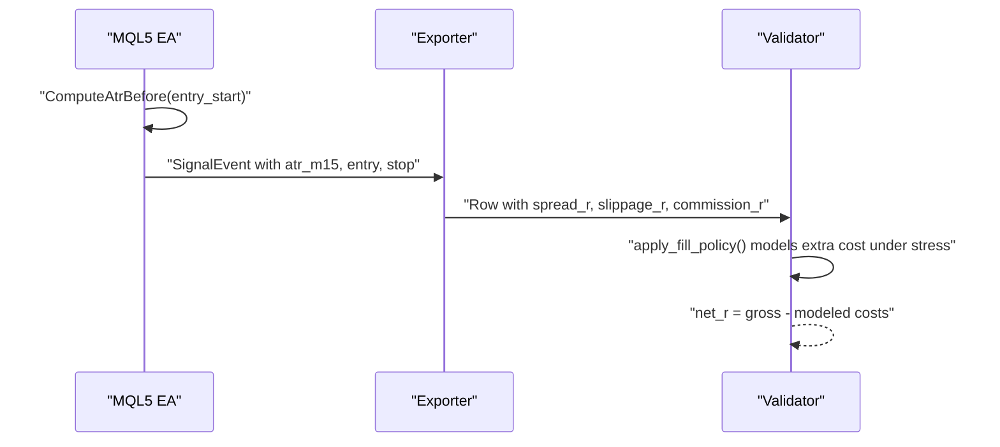

**Diagram sources**
- [TRIAD_R_HS.mq5:1961-1970](file://MQL5/Experts/TRIAD_R_HS/TRIAD_R_HS.mq5#L1961-L1970)
- [triad_validation.py:480-505](file://tools/triad_validation.py#L480-L505)
- [test_extended_validation.py:448-499](file://tests/test_extended_validation.py#L448-L499)

**Section sources**
- [TRIAD_R_HS.mq5:1961-1970](file://MQL5/Experts/TRIAD_R_HS/TRIAD_R_HS.mq5#L1961-L1970)
- [triad_validation.py:480-505](file://tools/triad_validation.py#L480-L505)
- [test_extended_validation.py:448-499](file://tests/test_extended_validation.py#L448-L499)

### Sweep/Reclaim Identification and Displacement Measurements
The tests validate that weak displacement is rejected, that time-stop exits produce expected net R, and that repeated same-session events do not create duplicate orders. The router ensures only one candidate per day wins, preserving audit trails by demoting others.

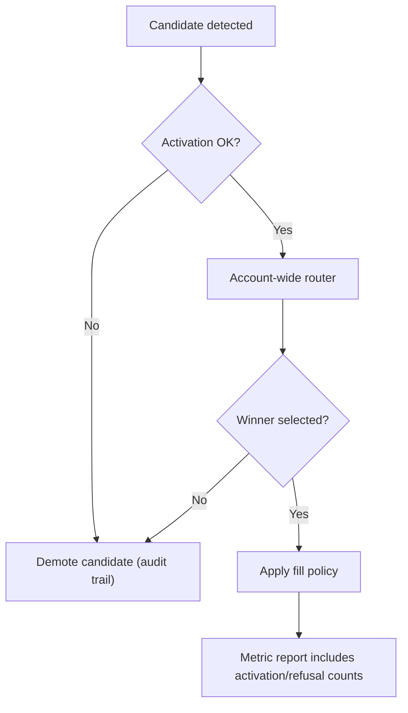

**Diagram sources**
- [triad_validation.py:803-875](file://tools/triad_validation.py#L803-L875)
- [triad_validation.py:646-708](file://tools/triad_validation.py#L646-L708)
- [test_extended_validation.py:106-180](file://tests/test_extended_validation.py#L106-L180)

**Section sources**
- [triad_validation.py:803-875](file://tools/triad_validation.py#L803-L875)
- [triad_validation.py:646-708](file://tools/triad_validation.py#L646-L708)
- [test_extended_validation.py:106-180](file://tests/test_extended_validation.py#L106-L180)

### Entry Timing Calculations
Entry timing uses the displacement bar’s close/open and ATR-derived stop placement. Tests assert that time-stop exits compute net R consistent with modeled costs and that the exporter derives target values correctly.

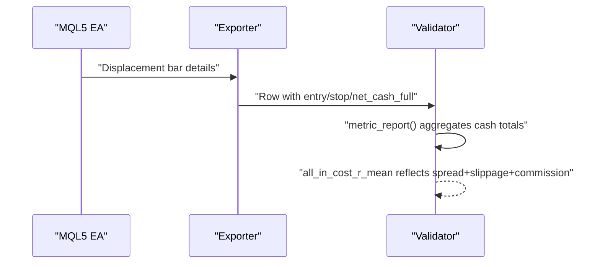

**Diagram sources**
- [test_extended_validation.py:485-499](file://tests/test_extended_validation.py#L485-L499)
- [triad_validation.py:516-519](file://tools/triad_validation.py#L516-L519)
- [triad_validation.py:646-708](file://tools/triad_validation.py#L646-L708)

**Section sources**
- [test_extended_validation.py:485-499](file://tests/test_extended_validation.py#L485-L499)
- [triad_validation.py:516-519](file://tools/triad_validation.py#L516-L519)
- [triad_validation.py:646-708](file://tools/triad_validation.py#L646-L708)

### Risk Management Validations
Risk management is enforced through profile-based risk fractions, drawdown throttling, and firm floors. The reference module defines active risk fractions and phase locking rules; the validator simulates phases with daily/weekly stops and tracks maximum drawdown percentiles.

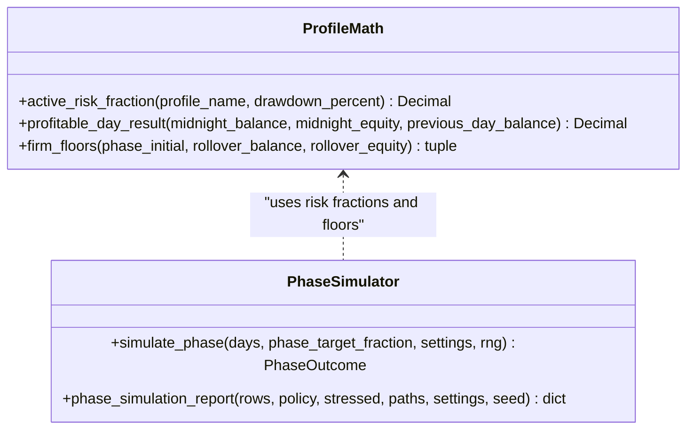

**Diagram sources**
- [triad_reference.py:68-95](file://tests/triad_reference.py#L68-L95)
- [triad_validation.py:980-1214](file://tools/triad_validation.py#L980-L1214)

**Section sources**
- [triad_reference.py:68-95](file://tests/triad_reference.py#L68-L95)
- [triad_validation.py:980-1214](file://tools/triad_validation.py#L980-L1214)

### Position Sizing Accuracy
Position sizing rounds down to symbol lot steps and respects minimum/maximum constraints. Tests assert rounding behavior and that small accounts may be skipped due to minimum lot constraints.

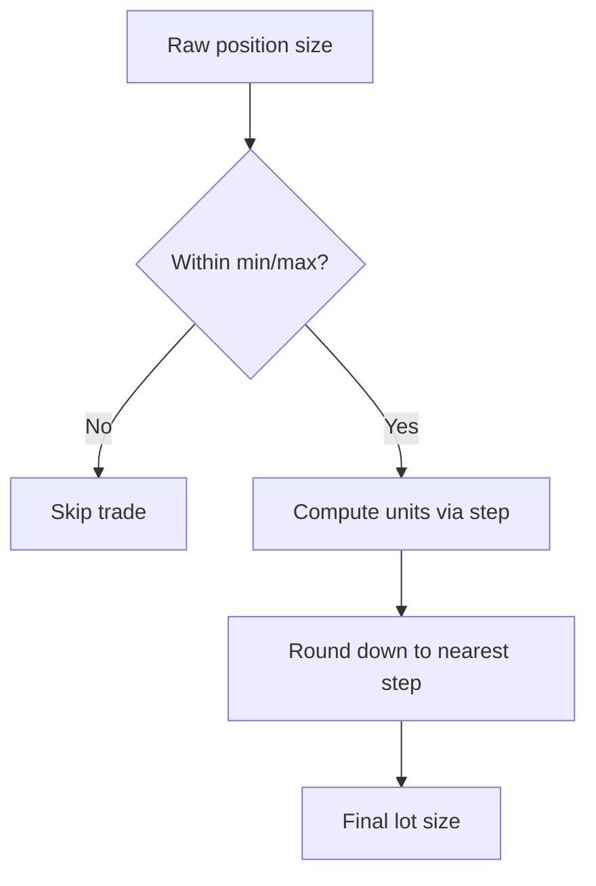

**Diagram sources**
- [triad_reference.py:106-114](file://tests/triad_reference.py#L106-L114)
- [test_extended_validation.py:476-484](file://tests/test_extended_validation.py#L476-L484)

**Section sources**
- [triad_reference.py:106-114](file://tests/triad_reference.py#L106-L114)
- [test_extended_validation.py:476-484](file://tests/test_extended_validation.py#L476-L484)

### Drawdown Control Mechanisms
Drawdown control reduces risk at thresholds and shuts down beyond a boundary. The validator tracks interim equity drawdowns, daily/weekly stops, and inactivity periods, reporting reasons for termination.

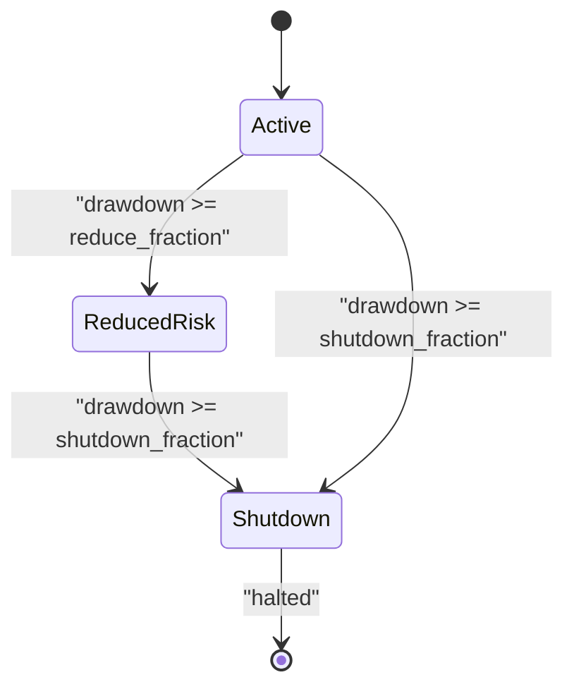

**Diagram sources**
- [triad_validation.py:980-1072](file://tools/triad_validation.py#L980-L1072)
- [triad_reference.py:68-75](file://tests/triad_reference.py#L68-L75)

**Section sources**
- [triad_validation.py:980-1072](file://tools/triad_validation.py#L980-L1072)
- [triad_reference.py:68-75](file://tests/triad_reference.py#L68-L75)

## Dependency Analysis
The validation framework depends on:
- MQL5 EA exporting event-level data used by the Python exporter and validator.
- Python reference math providing oracles for session bounds, volume rounding, and halt signatures.
- Tests asserting correctness of router behavior, metric extensions, and export round-trips.

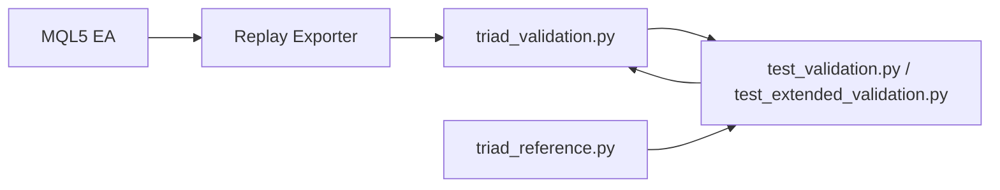

**Diagram sources**
- [triad_validation.py:1-30](file://tools/triad_validation.py#L1-L30)
- [test_validation.py:1-30](file://tests/test_validation.py#L1-L30)
- [test_extended_validation.py:1-48](file://tests/test_extended_validation.py#L1-L48)
- [triad_reference.py:1-10](file://tests/triad_reference.py#L1-L10)

**Section sources**
- [triad_validation.py:1-30](file://tools/triad_validation.py#L1-L30)
- [test_validation.py:1-30](file://tests/test_validation.py#L1-L30)
- [test_extended_validation.py:1-48](file://tests/test_extended_validation.py#L1-L48)
- [triad_reference.py:1-10](file://tests/triad_reference.py#L1-L10)

## Performance Considerations
- Block-bootstrap sampling uses moving calendar-day blocks to preserve temporal correlation and avoid overfitting.
- Stress modeling increases spread/slippage multipliers deterministically and removes some profitable limits to evaluate robustness.
- Registry hashing prevents accidental changes to thresholds or configuration matrices, ensuring reproducible validation runs.

[No sources needed since this section provides general guidance]

## Troubleshooting Guide
Common validation failures and debugging steps:
- Missing coverage: Ensure every configuration and combination has explicit no-candidate rows for all required days in both selection and holdout splits.
- Fill policy rejections: Check trade_through_ticks, activation_ok, and fill_fraction; stress mode may reject otherwise profitable limits.
- Router demotions: If multiple candidates exist per day, only one wins; demoted rows keep candidate flags for audit.
- Phase simulation failures: Inspect daily/weekly stops, inactivity thresholds, and drawdown shutdown conditions; review reason codes in outcomes.
- Section 13 verdict failures: Review failed_checks list; confirm year robustness, firm floor breaches, and confidence bounds.

**Section sources**
- [triad_validation.py:360-473](file://tools/triad_validation.py#L360-L473)
- [triad_validation.py:480-505](file://tools/triad_validation.py#L480-L505)
- [triad_validation.py:803-875](file://tools/triad_validation.py#L803-L875)
- [triad_validation.py:980-1214](file://tools/triad_validation.py#L980-L1214)
- [triad_validation.py:1380-1460](file://tools/triad_validation.py#L1380-L1460)

## Conclusion
The validation framework rigorously ensures parity between MQL5 production code and Python reference implementations through frozen registries, replay coverage enforcement, fill policy modeling, account-wide routing, phase simulations, and Section 13 release gates. Tests cover signal detection, session boundaries, ATR computations, pattern recognition, risk management, position sizing, and drawdown controls. Maintaining parity requires updating both MQL5 and reference math together, extending tests for new scenarios, and relying on the registry hash to detect unintended changes.

[No sources needed since this section summarizes without analyzing specific files]

## Appendices

### Adding New Validation Scenarios
- Extend the configuration matrix only if it aligns with the frozen V2.1 declaration; otherwise, add scenario-specific tests that reuse existing functions like apply_fill_policy, route_daily_rows, and phase_simulation_report.
- For new signal types, update the exporter and validator to accept additional fields, then add tests asserting correctness of derived metrics and routing behavior.
- Use triad_reference.py oracles to validate session bounds, volume rounding, and halt signatures for new edge cases.

**Section sources**
- [triad_validation.py:242-331](file://tools/triad_validation.py#L242-L331)
- [triad_validation.py:480-505](file://tools/triad_validation.py#L480-L505)
- [triad_validation.py:803-875](file://tools/triad_validation.py#L803-L875)
- [triad_reference.py:134-167](file://tests/triad_reference.py#L134-L167)

### Debugging Validation Failures
- Inspect metric_report outputs for activation_refusals, touch_without_trade_through, and partial_fill_observations to identify fill policy issues.
- Review router diagnostics for rejected_candidate_counts and priority tie-break rules to understand daily selection outcomes.
- Examine phase_simulation_report reason codes and drawdown statistics to diagnose phase failures.
- Use firm_floor_check outputs to assess firm overall floor breaches and overshoot beyond shutdown boundaries.

**Section sources**
- [triad_validation.py:646-708](file://tools/triad_validation.py#L646-L708)
- [triad_validation.py:803-875](file://tools/triad_validation.py#L803-L875)
- [triad_validation.py:1122-1214](file://tools/triad_validation.py#L1122-L1214)
- [triad_validation.py:1343-1460](file://tools/triad_validation.py#L1343-L1460)