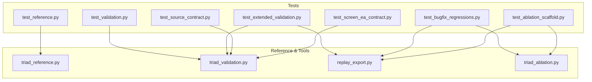
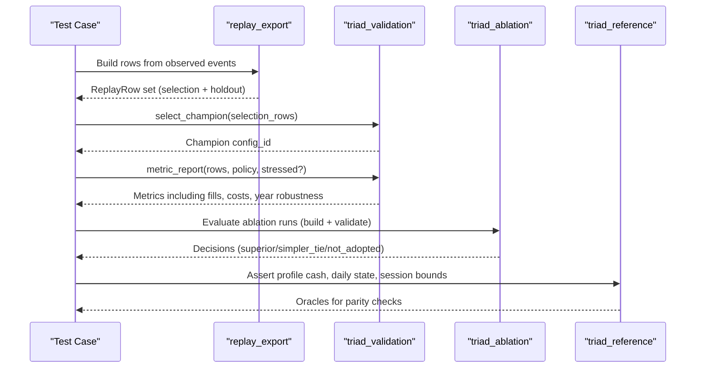
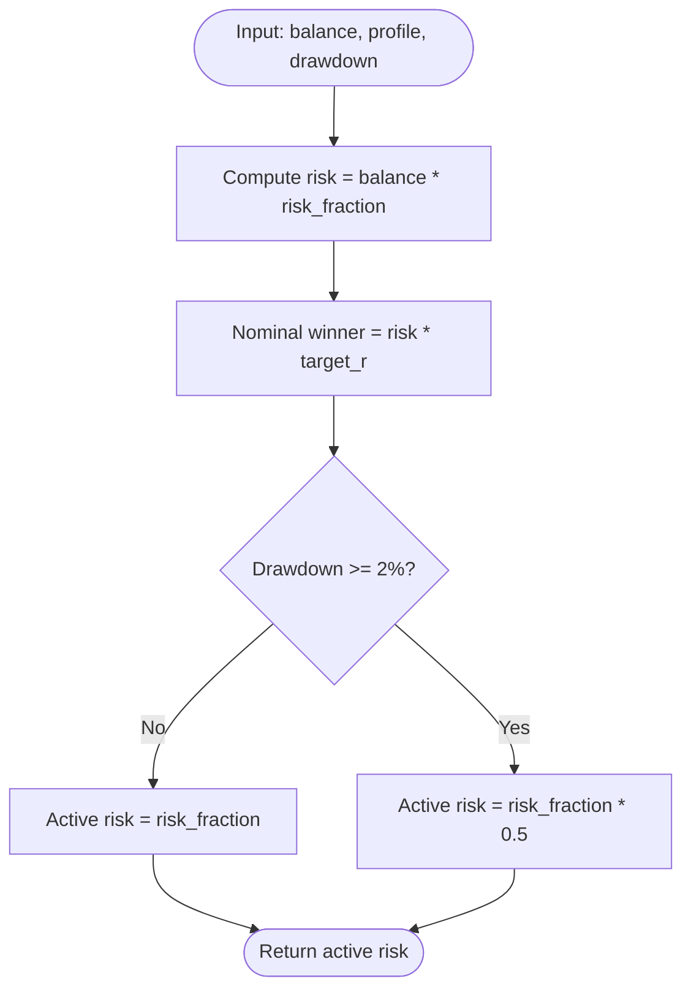
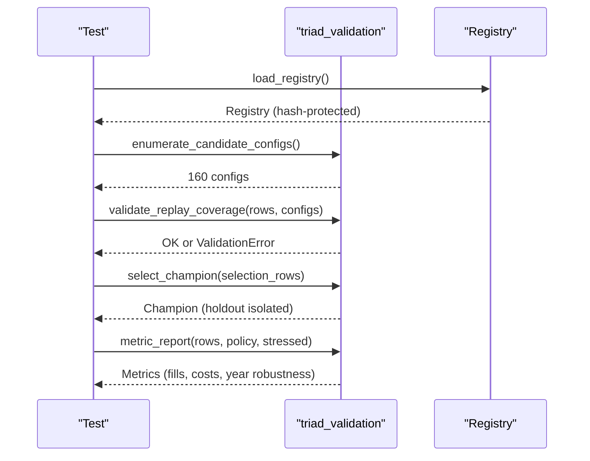
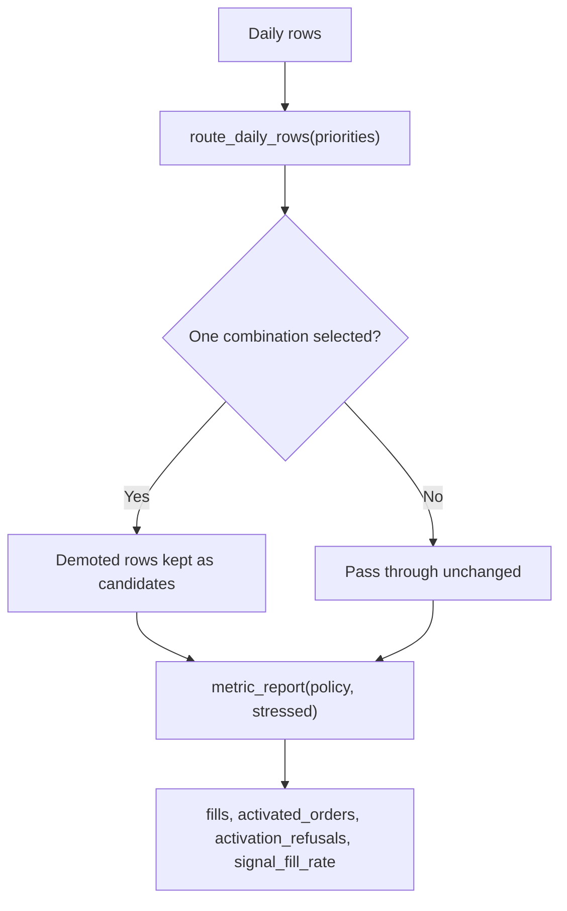
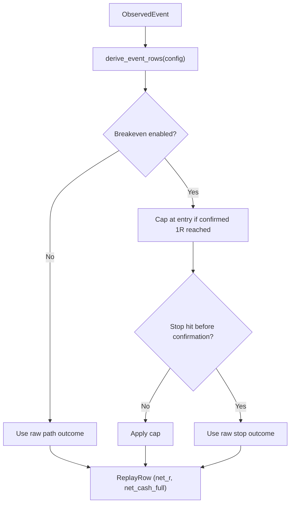
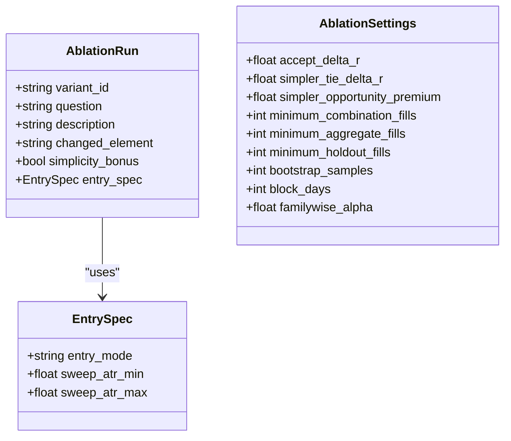
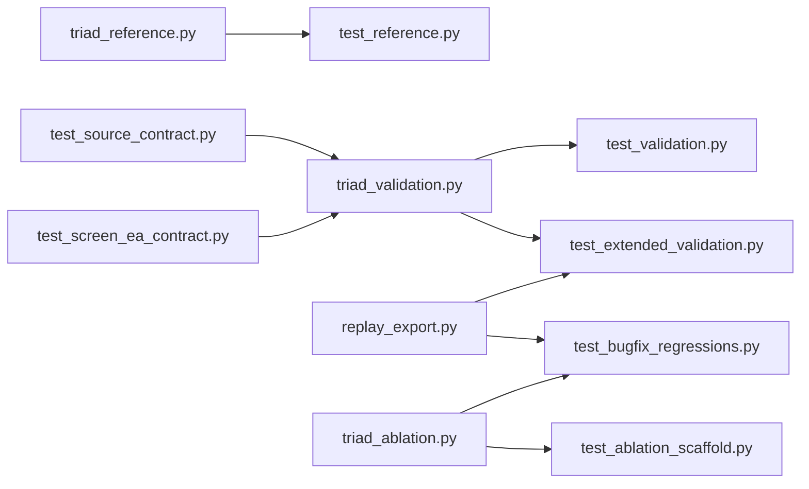

# Testing Suite

<cite>
**Referenced Files in This Document**
- [test_reference.py](file://tests/test_reference.py)
- [triad_reference.py](file://tests/triad_reference.py)
- [test_validation.py](file://tests/test_validation.py)
- [test_extended_validation.py](file://tests/test_extended_validation.py)
- [test_bugfix_regressions.py](file://tests/test_bugfix_regressions.py)
- [test_ablation_scaffold.py](file://tests/test_ablation_scaffold.py)
- [test_source_contract.py](file://tests/test_source_contract.py)
- [test_screen_ea_contract.py](file://tests/test_screen_ea_contract.py)
- [triad_validation.py](file://tools/triad_validation.py)
- [replay_export.py](file://tools/replay_export.py)
- [triad_ablation.py](file://tools/triad_ablation.py)
</cite>

## Table of Contents
1. [Introduction](#introduction)
2. [Project Structure](#project-structure)
3. [Core Components](#core-components)
4. [Architecture Overview](#architecture-overview)
5. [Detailed Component Analysis](#detailed-component-analysis)
6. [Dependency Analysis](#dependency-analysis)
7. [Performance Considerations](#performance-considerations)
8. [Troubleshooting Guide](#troubleshooting-guide)
9. [Conclusion](#conclusion)
10. [Appendices](#appendices)

## Introduction
This document explains the testing suite that ensures code quality, consistency, and parity between MQL5 production code and Python reference implementations for the TRIAD-R strategy. It covers:
- Contract validation tests that enforce CSV schemas, registries, and replay coverage
- Reference implementation tests that validate arithmetic, session time logic, and risk controls
- Bug regression tests that encode known defects and guard against re-introduction
- Extended validation tests that cover routing, metrics, phase simulation, and exporter behavior
- Ablation scaffold tests that preregister and evaluate variant hypotheses under strict rules

The suite uses deterministic data fixtures, frozen registries, and explicit thresholds to maintain reproducibility and prevent data leakage between selection and holdout phases.

## Project Structure
The test suite is organized by concern:
- Contract and source parity tests verify MQL5 EA behavior via static checks and hash-based guards
- Validation tests exercise the offline champion-selection pipeline and its statistical gates
- Extended validation tests cover account-wide routing, metric extensions, phase simulation, and export round-trips
- Regression tests assert invariants across exit pricing, sizing, error handling, and CSV round-trips
- Ablation scaffold tests validate preregistered research rounds with strict decision rules

**Diagram sources**
- [test_reference.py:1-161](file://tests/test_reference.py#L1-L161)
- [triad_reference.py:1-167](file://tests/triad_reference.py#L1-L167)
- [test_validation.py:1-317](file://tests/test_validation.py#L1-L317)
- [test_extended_validation.py:1-583](file://tests/test_extended_validation.py#L1-L583)
- [test_bugfix_regressions.py:1-683](file://tests/test_bugfix_regressions.py#L1-L683)
- [test_ablation_scaffold.py:1-503](file://tests/test_ablation_scaffold.py#L1-L503)
- [test_source_contract.py:1-547](file://tests/test_source_contract.py#L1-L547)
- [test_screen_ea_contract.py:1-321](file://tests/test_screen_ea_contract.py#L1-L321)
- [triad_validation.py:1-200](file://tools/triad_validation.py#L1-L200)
- [replay_export.py:1-200](file://tools/replay_export.py#L1-L200)
- [triad_ablation.py:1-200](file://tools/triad_ablation.py#L1-L200)

**Section sources**
- [test_reference.py:1-161](file://tests/test_reference.py#L1-L161)
- [triad_reference.py:1-167](file://tests/triad_reference.py#L1-L167)
- [test_validation.py:1-317](file://tests/test_validation.py#L1-L317)
- [test_extended_validation.py:1-583](file://tests/test_extended_validation.py#L1-L583)
- [test_bugfix_regressions.py:1-683](file://tests/test_bugfix_regressions.py#L1-L683)
- [test_ablation_scaffold.py:1-503](file://tests/test_ablation_scaffold.py#L1-L503)
- [test_source_contract.py:1-547](file://tests/test_source_contract.py#L1-L547)
- [test_screen_ea_contract.py:1-321](file://tests/test_screen_ea_contract.py#L1-L321)
- [triad_validation.py:1-200](file://tools/triad_validation.py#L1-L200)
- [replay_export.py:1-200](file://tools/replay_export.py#L1-L200)
- [triad_ablation.py:1-200](file://tools/triad_ablation.py#L1-L200)

## Core Components
- Reference math module provides oracles for profile cash, drawdown tiers, daily state transitions, firm floors/reserves, volume rounding, session bounds, and server time offsets. Tests assert parity with MQL5 behavior without calling MQL5.
- Validation tooling defines candidate configurations, fill policies, thresholds, replay rows, and functions for registry management, coverage validation, metric reporting, bootstrap intervals, and phase simulation. Tests ensure selection cannot be influenced by holdout outcomes and that coverage is complete.
- Replay exporter converts observed events into schema-conformant rows, applies entry/stop/target math, cost gates, lot rounding, and expands to full calendar coverage. Tests verify target math, time-stop selection, split enforcement, and CSV round-trips.
- Ablation module defines preregistered variants and decision rules (R1–R5), paired differences, bootstrap intervals, and CLI commands. Tests validate registry integrity, variant behavior, build coverage, and decision logic.
- Source contract tests perform static checks on MQL5 files to enforce required symbols, session windows, challenge rules, dashboard objects, order submission defaults, and behavioral markers. They also ensure canonical EA and registries remain unchanged.

**Section sources**
- [triad_reference.py:16-167](file://tests/triad_reference.py#L16-L167)
- [test_reference.py:27-161](file://tests/test_reference.py#L27-L161)
- [triad_validation.py:98-200](file://tools/triad_validation.py#L98-L200)
- [test_validation.py:80-317](file://tests/test_validation.py#L80-L317)
- [replay_export.py:152-200](file://tools/replay_export.py#L152-L200)
- [test_extended_validation.py:100-583](file://tests/test_extended_validation.py#L100-L583)
- [triad_ablation.py:125-200](file://tools/triad_ablation.py#L125-L200)
- [test_ablation_scaffold.py:46-503](file://tests/test_ablation_scaffold.py#L46-L503)
- [test_source_contract.py:15-547](file://tests/test_source_contract.py#L15-L547)
- [test_screen_ea_contract.py:39-321](file://tests/test_screen_ea_contract.py#L39-L321)

## Architecture Overview
The testing architecture enforces separation of concerns and prevents data leakage:
- Selection (WALK_FORWARD) is used only to choose a champion; HOLDOUT outcomes are evaluated after selection is finalized
- Registries are hashed and validated to detect mutations
- Fill policies are conservative: touches without trade-through do not count as fills; partial fills are excluded
- Bootstrap intervals are familywise-adjusted and never narrower than ordinary intervals
- Phase simulations compute confidence bounds, draws, median drawdown, and time-in-drawdown

**Diagram sources**
- [test_extended_validation.py:100-583](file://tests/test_extended_validation.py#L100-L583)
- [test_validation.py:178-317](file://tests/test_validation.py#L178-L317)
- [test_ablation_scaffold.py:213-503](file://tests/test_ablation_scaffold.py#L213-L503)
- [test_reference.py:27-161](file://tests/test_reference.py#L27-L161)

## Detailed Component Analysis

### Reference Implementation Parity
- Profile math asserts risk and nominal winner calculations per profile and validates active risk fraction with drawdown tiers
- Daily state logic ensures first net positive locks the day and two-trade lock behavior
- Firm floors and reserves use max-of-percent-and-slippage-reserve semantics
- Volume rounding always rounds down and respects symbol constraints
- Session bounds handle DST transitions independently for London and New York
- Server time offset conversion is fixed and timezone-aware

**Diagram sources**
- [triad_reference.py:61-76](file://tests/triad_reference.py#L61-L76)

**Section sources**
- [test_reference.py:27-161](file://tests/test_reference.py#L27-L161)
- [triad_reference.py:16-167](file://tests/triad_reference.py#L16-L167)

### Validation Pipeline Tests
- Registry integrity: committed registry matches built registry; hash mismatch detection on mutation
- Matrix completeness: exactly 160 unique configs across dimensions
- Coverage validation: every configuration/combination/day must be present
- Fill policy: touch without trade-through is not a fill; inactive/partial orders are not fills; stress cost applied consistently
- Selection isolation: holdout outcomes cannot change selected champion; selection-aware intervals never narrower
- Phase simulation: profitable sequences pass both phases with high probability; confidence bounds and draws reported

**Diagram sources**
- [test_validation.py:80-317](file://tests/test_validation.py#L80-L317)
- [triad_validation.py:98-200](file://tools/triad_validation.py#L98-L200)

**Section sources**
- [test_validation.py:80-317](file://tests/test_validation.py#L80-L317)

### Extended Validation and Routing
- Account-wide router selects one combination per day using priority, then cost/R, then sequence; demoted rows keep candidate flag for audit
- Metric extensions include fill rates, activation refusals, small positive wins, qualifying wins, budget underuse, and year robustness
- Phase extensions add confidence bounds, joint draws, maximum drawdown p50, and median time-in-drawdown
- Exporter verifies target math, rounded lots, weak displacement rejection, min-volume skip, time-stop horizon selection, split-cut enforcement, and CSV round-trips

**Diagram sources**
- [test_extended_validation.py:100-197](file://tests/test_extended_validation.py#L100-L197)
- [test_extended_validation.py:199-298](file://tests/test_extended_validation.py#L199-L298)

**Section sources**
- [test_extended_validation.py:100-583](file://tests/test_extended_validation.py#L100-L583)

### Bug Regression Tests
- Breakeven consistency: net_r and net_cash agree when breakeven cap applies; stop before confirmation not capped; non-breakeven logs raw path
- Cash and R agreement: all exit paths produce consistent implied R from cash
- Stop side guard: protective-side requirement enforced; wrong-side rejected
- Loader error handling: non-integer and negative trade_through_ticks raise validation errors
- Decide robustness: empty or None interval cases handled gracefully
- Holdout floor: R3 requires minimum holdout fills to confirm changes
- Bootstrap interval invariant: adjusted interval contains ordinary interval; wider families widen adjusted interval
- All-in risk ceiling: volume sized so total loss fits budget; minimum volume that breaches ceiling skipped
- Stressed cash consistency: totals include stress cost; mean all-in cost matches components
- Exit reason handling: breakeven honored; cancel never counts as fill; unsupported time-stop raises error; loader requires breakeven timestamp
- Randomized invariants: large sample assertions on sizing, costs, CSV round-trips, and fill policy conditions

**Diagram sources**
- [test_bugfix_regressions.py:22-138](file://tests/test_bugfix_regressions.py#L22-L138)
- [test_bugfix_regressions.py:140-186](file://tests/test_bugfix_regressions.py#L140-L186)
- [test_bugfix_regressions.py:353-406](file://tests/test_bugfix_regressions.py#L353-L406)
- [test_bugfix_regressions.py:408-486](file://tests/test_bugfix_regressions.py#L408-L486)
- [test_bugfix_regressions.py:514-683](file://tests/test_bugfix_regressions.py#L514-L683)

**Section sources**
- [test_bugfix_regressions.py:1-683](file://tests/test_bugfix_regressions.py#L1-L683)

### Ablation Scaffold Tests
- Registry integrity: preregistered registry matches tool declaration; tamper detection; split change requires reregistration
- Variant behavior: baseline equivalence, simpler reclaim acceptance, quote entry pricing, low wick filter skip, body threshold lowering, midpoint confirmation skip
- Builder coverage: every run/combination/day covered; out-of-cut days rejected; same-session repeat not an order
- Decision logic: R1 failure blocks everything; superiority threshold; simpler tie requires opportunity premium and no harm; non-simpler needs superiority
- Paired tests: extra opportunity included; bootstrap interval finite and deterministic
- End-to-end scenario: flat scenario recommends no change; V1 dominance confirmed on holdout with sufficient fills
- CLI tests: preregister refuses overwrite unless forced; build rejects different splits

**Diagram sources**
- [triad_ablation.py:160-200](file://tools/triad_ablation.py#L160-L200)

**Section sources**
- [test_ablation_scaffold.py:46-503](file://tests/test_ablation_scaffold.py#L46-L503)
- [triad_ablation.py:125-200](file://tools/triad_ablation.py#L125-L200)

### Source Contract Tests
- Static checks ensure MQL5 EA includes required symbols, session windows, challenge rule presets, dashboard objects, and strategy port markers
- Order submission defaults closed; release gates default false; canonical EA and registries remain untouched
- Required behaviors: pending orders send visible stops/targets, single half-risk tier, daily state locking, persistent halt latches, instance lock heartbeat, actual symbol cash sizing, ATR regime usage, news coverage enforcement, range/candle semantics, state commit signature, identity persistence, external incident protection, missed rollover reconstruction, quote freshness, breakeven retry limit, failed submission latching, combination gates, collision ranking, server offset checks, operational guards, global name limits, delimiter balancing, news block structure, H1 EMA bias structure, stats insufficient error level

**Section sources**
- [test_source_contract.py:15-547](file://tests/test_source_contract.py#L15-L547)
- [test_screen_ea_contract.py:39-321](file://tests/test_screen_ea_contract.py#L39-L321)

## Dependency Analysis
- Tests depend on tools modules for data generation, validation, and evaluation
- Reference module provides pure functions for parity checks without external dependencies
- Source contract tests rely on file system access and subprocess calls to git for integrity checks
- Validation and ablation tests share common types (ReplayRow, FillPolicy, ValidationError) ensuring consistency

**Diagram sources**
- [test_reference.py:1-161](file://tests/test_reference.py#L1-L161)
- [test_validation.py:1-317](file://tests/test_validation.py#L1-L317)
- [test_extended_validation.py:1-583](file://tests/test_extended_validation.py#L1-L583)
- [test_bugfix_regressions.py:1-683](file://tests/test_bugfix_regressions.py#L1-L683)
- [test_ablation_scaffold.py:1-503](file://tests/test_ablation_scaffold.py#L1-L503)
- [test_source_contract.py:1-547](file://tests/test_source_contract.py#L1-L547)
- [test_screen_ea_contract.py:1-321](file://tests/test_screen_ea_contract.py#L1-L321)

**Section sources**
- [triad_reference.py:1-167](file://tests/triad_reference.py#L1-L167)
- [triad_validation.py:1-200](file://tools/triad_validation.py#L1-L200)
- [replay_export.py:1-200](file://tools/replay_export.py#L1-L200)
- [triad_ablation.py:1-200](file://tools/triad_ablation.py#L1-L200)

## Performance Considerations
- Bootstrap samples and path counts are configurable; tests use reasonable defaults for speed while maintaining statistical validity
- Coverage validation ensures no missing combinations/days, preventing incomplete evidence
- Conservative fill policies reduce noise but may increase computational load due to stricter gating
- Registry hashing and integrity checks are lightweight but essential for preventing silent mutations

[No sources needed since this section provides general guidance]

## Troubleshooting Guide
Common failures and how to interpret them:
- ValidationError on registry load: indicates tampered or mismatched registry; check SHA-256 and schema version
- Coverage validation errors: missing configuration/combination/day entries; ensure exporter builds full calendar coverage
- Selection influence detected: holdout rows passed to selection function; ensure selection uses only WALK_FORWARD data
- Bootstrap interval issues: adjusted interval should contain ordinary interval; verify family size and alpha parameters
- Fill policy rejections: check activation_ok, limit_touched, trade_through_ticks, and fill_fraction fields
- Source contract failures: verify MQL5 files contain required markers and canonical files remain unchanged
- Ablation decision failures: ensure R1 gates pass (fill counts, profit factors, year robustness); check paired intervals and holdout fills

**Section sources**
- [test_validation.py:80-133](file://tests/test_validation.py#L80-L133)
- [test_extended_validation.py:500-583](file://tests/test_extended_validation.py#L500-L583)
- [test_ablation_scaffold.py:262-358](file://tests/test_ablation_scaffold.py#L262-L358)
- [test_source_contract.py:45-547](file://tests/test_source_contract.py#L45-L547)

## Conclusion
The testing suite provides comprehensive coverage across contract validation, reference implementation parity, bug regression, extended validation, and ablation research. It enforces strict separation between selection and holdout phases, uses frozen registries with integrity checks, and maintains parity between MQL5 production code and Python reference implementations. The suite’s design ensures reproducibility, prevents data leakage, and provides clear diagnostics for failures. As the codebase evolves, new tests should follow established patterns: define clear invariants, use deterministic fixtures, validate coverage, and maintain registry integrity.

[No sources needed since this section summarizes without analyzing specific files]

## Appendices

### Writing New Tests
- Follow existing patterns: use unittest.TestCase, create fixtures with helper functions, assert invariants with precise tolerances
- For contract tests: verify required markers, defaults, and behavioral guarantees in MQL5 files
- For validation tests: ensure coverage completeness, selection isolation, and statistical gate compliance
- For regression tests: encode specific defect scenarios and assert expected behavior
- For ablation tests: respect preregistered rules, validate variant behavior, and ensure decision logic correctness

### Maintaining Test Suite Effectiveness
- Update tests when contracts change; ensure registry hashes reflect new configurations
- Add tests for new features to prevent drift in MQL5 and Python implementations
- Use randomized property tests for robustness across varied inputs
- Regularly review bootstrap intervals and thresholds for statistical validity
- Ensure source contract tests catch accidental changes to critical behavior

[No sources needed since this section provides general guidance]