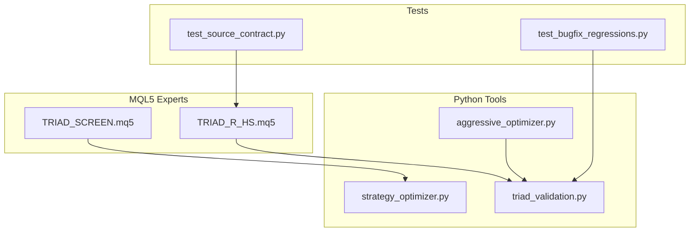
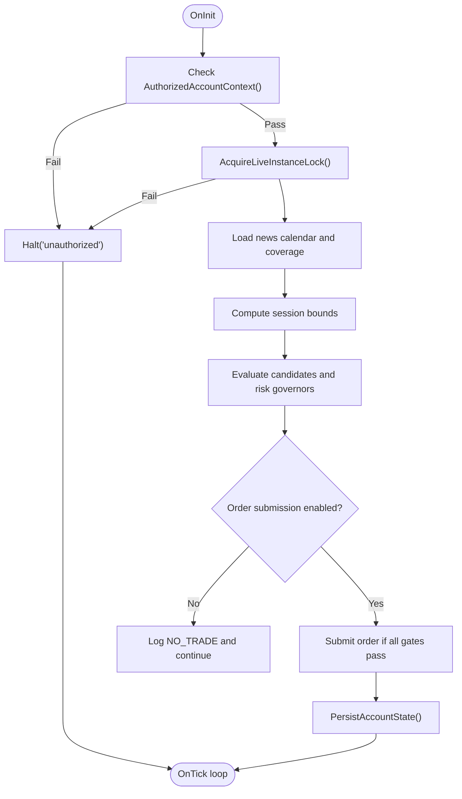
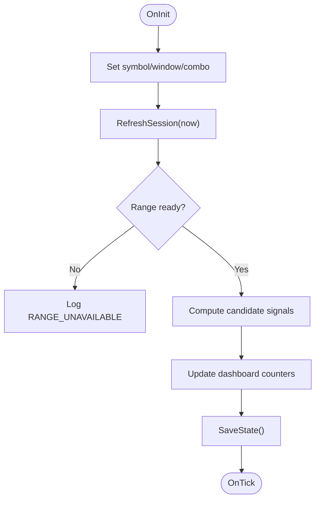
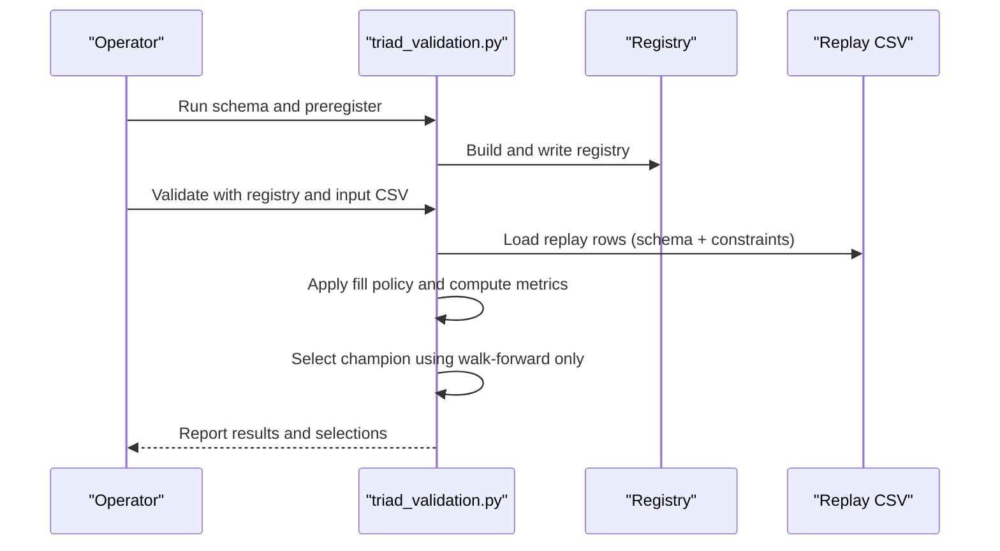
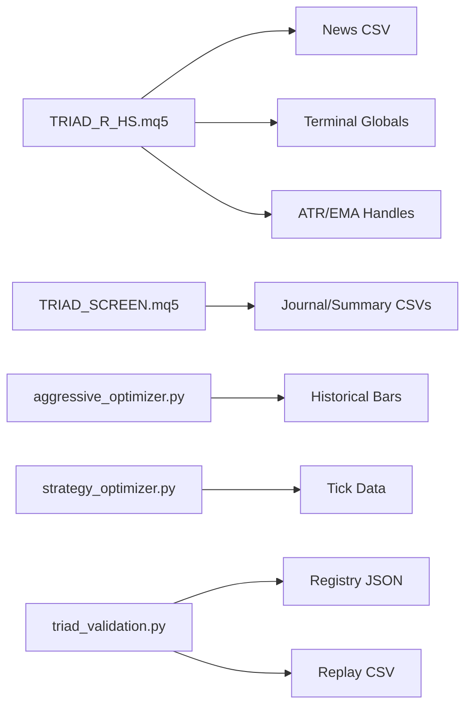

# Troubleshooting and FAQ

<cite>
**Referenced Files in This Document**
- [TRIAD_R_HS.mq5](file://MQL5/Experts/TRIAD_R_HS/TRIAD_R_HS.mq5)
- [TRIAD_SCREEN.mq5](file://MQL5/Experts/TRIAD_SCREEN/TRIAD_SCREEN.mq5)
- [aggressive_optimizer.py](file://tools/aggressive_optimizer.py)
- [strategy_optimizer.py](file://tools/strategy_optimizer.py)
- [triad_validation.py](file://tools/triad_validation.py)
- [test_source_contract.py](file://tests/test_source_contract.py)
- [test_bugfix_regressions.py](file://tests/test_bugfix_regressions.py)
</cite>

## Table of Contents
1. Introduction
2. Project Structure
3. Core Components
4. Architecture Overview
5. Detailed Component Analysis
6. Dependency Analysis
7. Performance Considerations
8. Troubleshooting Guide
9. Conclusion
10. Appendices

## Introduction
This document provides a comprehensive troubleshooting and FAQ guide for the TRIAD-R trading system, covering common issues, error message references, performance optimization tips, and operational best practices. It explains systematic diagnosis approaches, resolves frequent errors, and details performance tuning and maintenance procedures to ensure reliable operation across research, screening, and production environments.

## Project Structure
The project includes:
- MQL5 Expert Advisors (EAs):
  - Production-grade EA with fail-closed safety, lifecycle locks, and audit logging.
  - Demo screening EA with an on-chart dashboard and simplified state persistence.
- Python tools:
  - Optimizers for strategy parameter search and challenge simulation.
  - Validation tooling for replay-based champion selection and holdout evaluation.
- Tests:
  - Contract tests ensuring required event names and behaviors are present.
  - Regression tests encoding known defects and their fixes.



**Diagram sources**
- [TRIAD_R_HS.mq5:1-150](file://MQL5/Experts/TRIAD_R_HS/TRIAD_R_HS.mq5#L1-L150)
- [TRIAD_SCREEN.mq5:1-160](file://MQL5/Experts/TRIAD_SCREEN/TRIAD_SCREEN.mq5#L1-L160)
- [aggressive_optimizer.py:1-120](file://tools/aggressive_optimizer.py#L1-L120)
- [strategy_optimizer.py:1-120](file://tools/strategy_optimizer.py#L1-L120)
- [triad_validation.py:1-120](file://tools/triad_validation.py#L1-L120)
- [test_source_contract.py:445-478](file://tests/test_source_contract.py#L445-L478)
- [test_bugfix_regressions.py:1-60](file://tests/test_bugfix_regressions.py#L1-L60)

**Section sources**
- [TRIAD_R_HS.mq5:1-150](file://MQL5/Experts/TRIAD_R_HS/TRIAD_R_HS.mq5#L1-L150)
- [TRIAD_SCREEN.mq5:1-160](file://MQL5/Experts/TRIAD_SCREEN/TRIAD_SCREEN.mq5#L1-L160)
- [aggressive_optimizer.py:1-120](file://tools/aggressive_optimizer.py#L1-L120)
- [strategy_optimizer.py:1-120](file://tools/strategy_optimizer.py#L1-L120)
- [triad_validation.py:1-120](file://tools/triad_validation.py#L1-L120)
- [test_source_contract.py:445-478](file://tests/test_source_contract.py#L445-L478)
- [test_bugfix_regressions.py:1-60](file://tests/test_bugfix_regressions.py#L1-L60)

## Core Components
- Production EA (TRIAD_R_HS.mq5):
  - Fail-closed design with explicit release gates and account identity checks.
  - Instance lock management to prevent duplicate live instances.
  - Audit logging and persistent state via terminal globals with signatures.
  - News calendar enforcement and session bounds computation.
  - Risk governors: daily/weekly stops, drawdown reduction/shutdown, firm floor reserves.
- Screening EA (TRIAD_SCREEN.mq5):
  - Demo-only multi-symbol screening with on-chart dashboard.
  - Simplified state persistence and journaling; no lifecycle locks or identity hashing.
  - Mirrors canonical V2.1 signal logic for comparability.
- Optimizers:
  - Aggressive optimizer: multi-pair backtesting with fixed lot sizing and challenge simulation.
  - Strategy optimizer: grid search over ORB strategies, stop modes, sessions, and parameters.
- Validation tooling:
  - Replay CSV schema validation, registry integrity checks, fill policy application, metric reporting, and champion selection with holdout protection.

**Section sources**
- [TRIAD_R_HS.mq5:52-150](file://MQL5/Experts/TRIAD_R_HS/TRIAD_R_HS.mq5#L52-L150)
- [TRIAD_R_HS.mq5:268-600](file://MQL5/Experts/TRIAD_R_HS/TRIAD_R_HS.mq5#L268-L600)
- [TRIAD_SCREEN.mq5:86-160](file://MQL5/Experts/TRIAD_SCREEN/TRIAD_SCREEN.mq5#L86-L160)
- [TRIAD_SCREEN.mq5:291-355](file://MQL5/Experts/TRIAD_SCREEN/TRIAD_SCREEN.mq5#L291-L355)
- [aggressive_optimizer.py:34-120](file://tools/aggressive_optimizer.py#L34-L120)
- [strategy_optimizer.py:46-120](file://tools/strategy_optimizer.py#L46-L120)
- [triad_validation.py:49-160](file://tools/triad_validation.py#L49-L160)

## Architecture Overview
The system integrates live execution safeguards, demo screening, offline optimization, and rigorous validation:

```mermaid
sequenceDiagram
participant MT5 as "MT5 Terminal"
participant EA as "TRIAD_R_HS.mq5"
participant Screen as "TRIAD_SCREEN.mq5"
participant Opt as "Optimizers"
participant Val as "triad_validation.py"
MT5->>EA : Initialize with inputs and gates
EA->>EA : Verify account identity and instance lock
EA->>EA : Load news calendar and compute session bounds
EA->>EA : Evaluate signals and risk governors
EA-->>MT5 : Submit orders (if enabled and gates pass)
Screen->>Screen : Compute session bounds and signals
Screen-->>MT5 : Dashboard updates and demo logs
Opt->>Opt : Load historical data and run grids
Opt-->>Val : Export replay rows for validation
Val->>Val : Validate CSV schema and registry integrity
Val-->>Val : Apply fill policy and compute metrics
Val-->>Val : Select champion using walk-forward only
```

**Diagram sources**
- [TRIAD_R_HS.mq5:268-600](file://MQL5/Experts/TRIAD_R_HS/TRIAD_R_HS.mq5#L268-L600)
- [TRIAD_SCREEN.mq5:751-800](file://MQL5/Experts/TRIAD_SCREEN/TRIAD_SCREEN.mq5#L751-L800)
- [aggressive_optimizer.py:767-795](file://tools/aggressive_optimizer.py#L767-L795)
- [strategy_optimizer.py:777-800](file://tools/strategy_optimizer.py#L777-L800)
- [triad_validation.py:360-437](file://tools/triad_validation.py#L360-L437)

## Detailed Component Analysis

### Production EA Safety and Lifecycle
Key mechanisms:
- Account identity verification and authorized context gating.
- Live instance lock acquisition and heartbeat fencing.
- Persistent state with signature checks and migration latches.
- Halt latch with reason hashing and fail-closed behavior.



**Diagram sources**
- [TRIAD_R_HS.mq5:273-330](file://MQL5/Experts/TRIAD_R_HS/TRIAD_R_HS.mq5#L273-L330)
- [TRIAD_R_HS.mq5:494-566](file://MQL5/Experts/TRIAD_R_HS/TRIAD_R_HS.mq5#L494-L566)
- [TRIAD_R_HS.mq5:568-600](file://MQL5/Experts/TRIAD_R_HS/TRIAD_R_HS.mq5#L568-L600)

**Section sources**
- [TRIAD_R_HS.mq5:273-330](file://MQL5/Experts/TRIAD_R_HS/TRIAD_R_HS.mq5#L273-L330)
- [TRIAD_R_HS.mq5:494-566](file://MQL5/Experts/TRIAD_R_HS/TRIAD_R_HS.mq5#L494-L566)
- [TRIAD_R_HS.mq5:568-600](file://MQL5/Experts/TRIAD_R_HS/TRIAD_R_HS.mq5#L568-L600)

### Screening EA Dashboard and State
Key mechanisms:
- Single symbol/session focus with on-chart dashboard.
- Journaling and summary CSVs per combo and login.
- Session refresh and range availability handling.



**Diagram sources**
- [TRIAD_SCREEN.mq5:751-800](file://MQL5/Experts/TRIAD_SCREEN/TRIAD_SCREEN.mq5#L751-L800)
- [TRIAD_SCREEN.mq5:329-355](file://MQL5/Experts/TRIAD_SCREEN/TRIAD_SCREEN.mq5#L329-L355)
- [TRIAD_SCREEN.mq5:516-545](file://MQL5/Experts/TRIAD_SCREEN/TRIAD_SCREEN.mq5#L516-L545)

**Section sources**
- [TRIAD_SCREEN.mq5:751-800](file://MQL5/Experts/TRIAD_SCREEN/TRIAD_SCREEN.mq5#L751-L800)
- [TRIAD_SCREEN.mq5:329-355](file://MQL5/Experts/TRIAD_SCREEN/TRIAD_SCREEN.mq5#L329-L355)
- [TRIAD_SCREEN.mq5:516-545](file://MQL5/Experts/TRIAD_SCREEN/TRIAD_SCREEN.mq5#L516-L545)

### Validation Tooling and Replay Flow
Key mechanisms:
- Registry integrity and schema validation.
- Replay row loading with strict field checks.
- Fill policy application and metric reporting.
- Champion selection restricted to walk-forward splits.



**Diagram sources**
- [triad_validation.py:278-331](file://tools/triad_validation.py#L278-L331)
- [triad_validation.py:360-437](file://tools/triad_validation.py#L360-L437)
- [triad_validation.py:646-708](file://tools/triad_validation.py#L646-L708)

**Section sources**
- [triad_validation.py:278-331](file://tools/triad_validation.py#L278-L331)
- [triad_validation.py:360-437](file://tools/triad_validation.py#L360-L437)
- [triad_validation.py:646-708](file://tools/triad_validation.py#L646-L708)

## Dependency Analysis
- The production EA depends on:
  - News calendar CSV and server time offsets.
  - Terminal global variables for state persistence and instance locking.
  - Indicator handles for ATR and EMA filters.
- Screening EA depends on:
  - File I/O for journals and summaries.
  - Session boundary calculations mirroring the canonical EA.
- Optimizers depend on:
  - Historical data files and instrument specs.
  - DST-aware session windows and ATR computations.
- Validation depends on:
  - Frozen registry and replay CSV schema.
  - Fill policy thresholds and statistical methods.



**Diagram sources**
- [TRIAD_R_HS.mq5:78-86](file://MQL5/Experts/TRIAD_R_HS/TRIAD_R_HS.mq5#L78-L86)
- [TRIAD_R_HS.mq5:213-218](file://MQL5/Experts/TRIAD_R_HS/TRIAD_R_HS.mq5#L213-L218)
- [TRIAD_SCREEN.mq5:144-156](file://MQL5/Experts/TRIAD_SCREEN/TRIAD_SCREEN.mq5#L144-L156)
- [aggressive_optimizer.py:80-86](file://tools/aggressive_optimizer.py#L80-L86)
- [strategy_optimizer.py:214-224](file://tools/strategy_optimizer.py#L214-L224)
- [triad_validation.py:278-331](file://tools/triad_validation.py#L278-L331)

**Section sources**
- [TRIAD_R_HS.mq5:78-86](file://MQL5/Experts/TRIAD_R_HS/TRIAD_R_HS.mq5#L78-L86)
- [TRIAD_R_HS.mq5:213-218](file://MQL5/Experts/TRIAD_R_HS/TRIAD_R_HS.mq5#L213-L218)
- [TRIAD_SCREEN.mq5:144-156](file://MQL5/Experts/TRIAD_SCREEN/TRIAD_SCREEN.mq5#L144-L156)
- [aggressive_optimizer.py:80-86](file://tools/aggressive_optimizer.py#L80-L86)
- [strategy_optimizer.py:214-224](file://tools/strategy_optimizer.py#L214-L224)
- [triad_validation.py:278-331](file://tools/triad_validation.py#L278-L331)

## Performance Considerations
- Use fixed lot sizing in optimizers to avoid compounding blow-up during drawdown sequences.
- Limit trades per day to reduce correlated exposure across pairs.
- Prefer ATR-fixed stops to decouple stop distance from opening range width.
- Ensure news blackout windows are enforced to avoid high-impact volatility periods.
- Monitor request throttling and latency caps to prevent broker overload.
- Validate indicator handle initialization and reuse to minimize overhead.
- Keep session bounds and DST calculations consistent between tools and EAs.

[No sources needed since this section provides general guidance]

## Troubleshooting Guide

### Common Issues and Resolutions
- Duplicate live instance detected:
  - Cause: Another chart holds the instance lock with a recent heartbeat.
  - Resolution: Stop the other instance or allow lease expiry; verify ownership and beat variables.
  - Reference: Instance lock acquisition and heartbeat fencing.
  - Section sources
    - [TRIAD_R_HS.mq5:494-566](file://MQL5/Experts/TRIAD_R_HS/TRIAD_R_HS.mq5#L494-L566)

- Audit log open/write failures:
  - Cause: File permissions or disk issues preventing CSV creation/appending.
  - Resolution: Check file paths, permissions, and available disk space; ensure shareable read mode.
  - Reference: Audit logging functions and error flags.
  - Section sources
    - [TRIAD_R_HS.mq5:299-327](file://MQL5/Experts/TRIAD_R_HS/TRIAD_R_HS.mq5#L299-L327)
    - [TRIAD_SCREEN.mq5:329-355](file://MQL5/Experts/TRIAD_SCREEN/TRIAD_SCREEN.mq5#L329-L355)

- News calendar missing or stale:
  - Cause: Required coverage not met or file cannot be opened.
  - Resolution: Provide complete red-news CSV with coverage marker; verify file path and format.
  - Reference: News loading and coverage checks.
  - Section sources
    - [TRIAD_R_HS.mq5:791-800](file://MQL5/Experts/TRIAD_R_HS/TRIAD_R_HS.mq5#L791-L800)

- Range unavailable during entry window:
  - Cause: Session boundaries misaligned or insufficient history.
  - Resolution: Confirm session definitions and ensure bars exist up to range_end before reading.
  - Reference: Session refresh and range readiness.
  - Section sources
    - [TRIAD_SCREEN.mq5:751-800](file://MQL5/Experts/TRIAD_SCREEN/TRIAD_SCREEN.mq5#L751-L800)

- Invalid replay CSV schema or missing fields:
  - Cause: Header mismatch or invalid field types/values.
  - Resolution: Run schema command and regenerate exports; fix field types and ensure completeness.
  - Reference: Replay row loading and validation.
  - Section sources
    - [triad_validation.py:360-437](file://tools/triad_validation.py#L360-L437)

- Registry hash mismatch:
  - Cause: Registry payload altered after commit.
  - Resolution: Rebuild registry from validator declaration; do not edit committed registry manually.
  - Reference: Registry build and load with SHA-256 check.
  - Section sources
    - [triad_validation.py:278-331](file://tools/triad_validation.py#L278-L331)

- Breakeven cap inconsistency:
  - Cause: Net cash priced at raw exit instead of entry when breakeven applies.
  - Resolution: Ensure net cash equals entry price net of costs when breakeven is triggered.
  - Reference: Regression tests for breakeven consistency.
  - Section sources
    - [test_bugfix_regressions.py:22-75](file://tests/test_bugfix_regressions.py#L22-L75)

- Unsupported time-stop horizon:
  - Cause: Config specifies disallowed time-stop minutes.
  - Resolution: Use allowed horizons defined by the strategy specification.
  - Reference: Validation error raised for unsupported time-stop.
  - Section sources
    - [test_bugfix_regressions.py:479-486](file://tests/test_bugfix_regressions.py#L479-L486)

### Error Message Reference
- HALT events:
  - STRATEGY_HALTED: Strategy halted due to safety or rule violation.
  - live_instance_heartbeat_failure: Heartbeat write failed; emergency cleanup invoked.
  - STALE_INSTANCE_FENCED: Lost instance lock; fenced locally.
  - Section sources
    - [TRIAD_R_HS.mq5:329-350](file://MQL5/Experts/TRIAD_R_HS/TRIAD_R_HS.mq5#L329-L350)
    - [TRIAD_R_HS.mq5:534-554](file://MQL5/Experts/TRIAD_R_HS/TRIAD_R_HS.mq5#L534-L554)

- ERROR events:
  - INSTANCE_LOCK_STORAGE_FAILED: Cannot create owner/heartbeat variables.
  - DUPLICATE_LIVE_INSTANCE: Another instance owns the lock.
  - AUDIT_LOG_OPEN_FAILED / AUDIT_LOG_WRITE_FAILED: File I/O failure.
  - STATE_PERSIST_FAILED: Terminal global write failed.
  - Section sources
    - [TRIAD_R_HS.mq5:494-566](file://MQL5/Experts/TRIAD_R_HS/TRIAD_R_HS.mq5#L494-L566)
    - [TRIAD_R_HS.mq5:299-327](file://MQL5/Experts/TRIAD_R_HS/TRIAD_R_HS.mq5#L299-L327)
    - [TRIAD_R_HS.mq5:568-600](file://MQL5/Experts/TRIAD_R_HS/TRIAD_R_HS.mq5#L568-L600)

- WARN events:
  - MID_SESSION_START_SKIPPED: Fresh attach inside entry window skips reconstruction.
  - RANGE_UNAVAILABLE: Range data not ready within expected window.
  - Section sources
    - [TRIAD_SCREEN.mq5:771-780](file://MQL5/Experts/TRIAD_SCREEN/TRIAD_SCREEN.mq5#L771-L780)
    - [TRIAD_SCREEN.mq5:782-800](file://MQL5/Experts/TRIAD_SCREEN/TRIAD_SCREEN.mq5#L782-L800)

- Validation errors:
  - ValidationError: Schema mismatch, invalid fields, or registry hash mismatch.
  - Section sources
    - [triad_validation.py:334-357](file://tools/triad_validation.py#L334-L357)
    - [triad_validation.py:360-437](file://tools/triad_validation.py#L360-L437)
    - [triad_validation.py:278-331](file://tools/triad_validation.py#L278-L331)

### Systematic Diagnosis Approach
- Step 1: Confirm environment and identity:
  - Verify authorized account context and server offset settings.
  - Ensure instance lock is held and heartbeat is active.
- Step 2: Inspect logs and state:
  - Review audit logs for ERROR/HALT events and state persistence status.
  - Check terminal globals for configuration and identity hashes.
- Step 3: Validate data and calendars:
  - Confirm news CSV coverage and format; ensure session bounds align with server time.
  - Verify historical data availability for range reads.
- Step 4: Reproduce with tools:
  - Run optimizers to simulate signals and exits under identical parameters.
  - Use validation tooling to replay and validate CSV outputs against registry.
- Step 5: Resolve and retest:
  - Fix identified issues (permissions, data gaps, misconfigurations).
  - Re-run diagnostics and confirm resolution through logs and dashboards.

[No sources needed since this section provides general guidance]

### Operational Scenarios and Best Practices
- Scenario: Operator attaches EA mid-session:
  - Behavior: Skip reconstruction to avoid stale signals; dashboard warns accordingly.
  - Action: Allow session to proceed; rely on next valid range.
  - Section sources
    - [TRIAD_SCREEN.mq5:771-780](file://MQL5/Experts/TRIAD_SCREEN/TRIAD_SCREEN.mq5#L771-L780)

- Scenario: News blackout blocks all signals:
  - Behavior: Inactivity streak tracked; alert threshold configured to raise awareness.
  - Action: Verify news CSV coverage; adjust thresholds if necessary.
  - Section sources
    - [TRIAD_R_HS.mq5:142-150](file://MQL5/Experts/TRIAD_R_HS/TRIAD_R_HS.mq5#L142-L150)

- Scenario: Drawdown triggers reduction or shutdown:
  - Behavior: Risk fraction reduced or trading halted based on thresholds.
  - Action: Review daily/weekly stop settings; assess market conditions before resuming.
  - Section sources
    - [TRIAD_SCREEN.mq5:1810-1852](file://MQL5/Experts/TRIAD_SCREEN/TRIAD_SCREEN.mq5#L1810-L1852)

- Best practice: Maintain frozen registries and replay schemas:
  - Do not modify committed registries; rebuild only via validator tools.
  - Ensure replay exports include every configuration/combination/day for both splits.
  - Section sources
    - [triad_validation.py:278-331](file://tools/triad_validation.py#L278-L331)
    - [triad_validation.py:440-473](file://tools/triad_validation.py#L440-L473)

### Frequently Asked Questions
- Why does the EA halt even though no trade was submitted?
  - Halts can occur due to safety gates, instance lock loss, or state migration requirements. Check logs for specific reasons and resolve underlying issues.
  - Section sources
    - [TRIAD_R_HS.mq5:329-350](file://MQL5/Experts/TRIAD_R_HS/TRIAD_R_HS.mq5#L329-L350)
    - [TRIAD_R_HS.mq5:534-554](file://MQL5/Experts/TRIAD_R_HS/TRIAD_R_HS.mq5#L534-L554)

- How do I verify that my replay CSV is valid?
  - Run the schema command and validate with the registry; ensure headers match and all required fields are present and correctly typed.
  - Section sources
    - [triad_validation.py:360-437](file://tools/triad_validation.py#L360-L437)

- What should I do if the registry hash mismatches?
  - Rebuild the registry using the validator’s build function; do not edit the committed file manually.
  - Section sources
    - [triad_validation.py:278-331](file://tools/triad_validation.py#L278-L331)

- How can I optimize performance during heavy backtests?
  - Precompute session bounds and ATR; limit symbols and days; use efficient data structures; avoid redundant indicator recalculations.
  - Section sources
    - [aggressive_optimizer.py:174-208](file://tools/aggressive_optimizer.py#L174-L208)
    - [strategy_optimizer.py:387-405](file://tools/strategy_optimizer.py#L387-L405)

- How do I ensure consistent session timing across tools and EAs?
  - Use the same DST-aware conversion functions and server offset settings; verify alignment with London and New York windows.
  - Section sources
    - [TRIAD_R_HS.mq5:624-701](file://MQL5/Experts/TRIAD_R_HS/TRIAD_R_HS.mq5#L624-L701)
    - [TRIAD_SCREEN.mq5:583-661](file://MQL5/Experts/TRIAD_SCREEN/TRIAD_SCREEN.mq5#L583-L661)

## Conclusion
This troubleshooting guide consolidates common issues, error references, performance tips, and operational best practices for the TRIAD-R system. By following the systematic diagnosis approach and leveraging the provided tools and tests, operators can maintain reliable operation, resolve issues efficiently, and optimize performance across research, screening, and production environments.

[No sources needed since this section summarizes without analyzing specific files]

## Appendices

### Appendix A: Required Event Names in Source Contracts
- The source contract test asserts presence of critical event tokens such as ORDER_REQUEST_LATENCY_BREACH, emergency_order_delete_failed_, POSITION_ALREADY_ABSENT_AFTER_CLOSE, and others to ensure robust error signaling.
- Section sources
  - [test_source_contract.py:445-478](file://tests/test_source_contract.py#L445-L478)

### Appendix B: Build ID and Versioning
- Update the EA build ID constant when changes are made; ensure corresponding assertions in tests reflect the new version string.
- Section sources
  - [TRIAD_R_HS.mq5:1-10](file://MQL5/Experts/TRIAD_R_HS/TRIAD_R_HS.mq5#L1-L10)
  - [test_source_contract.py:277-310](file://tests/test_source_contract.py#L277-L310)