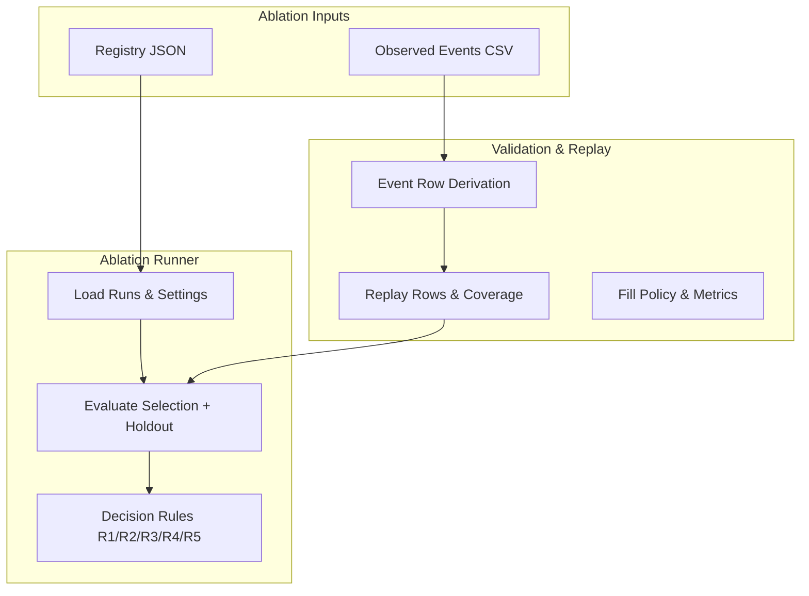
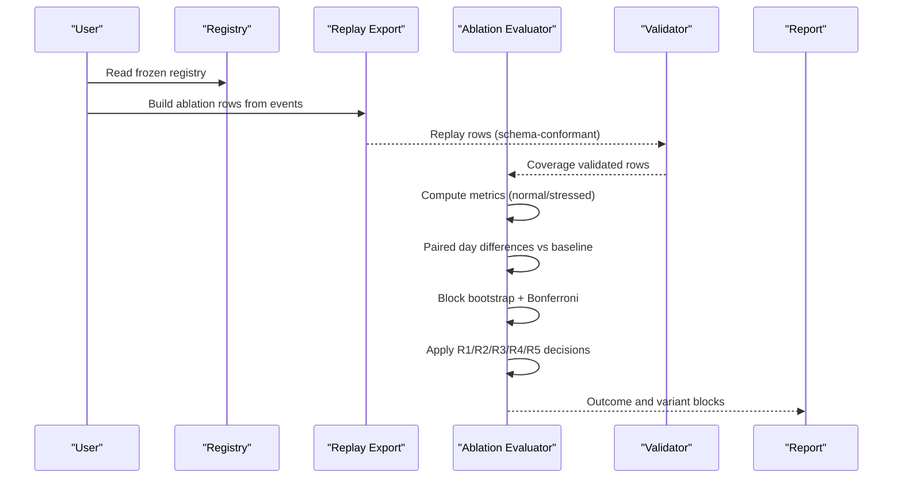
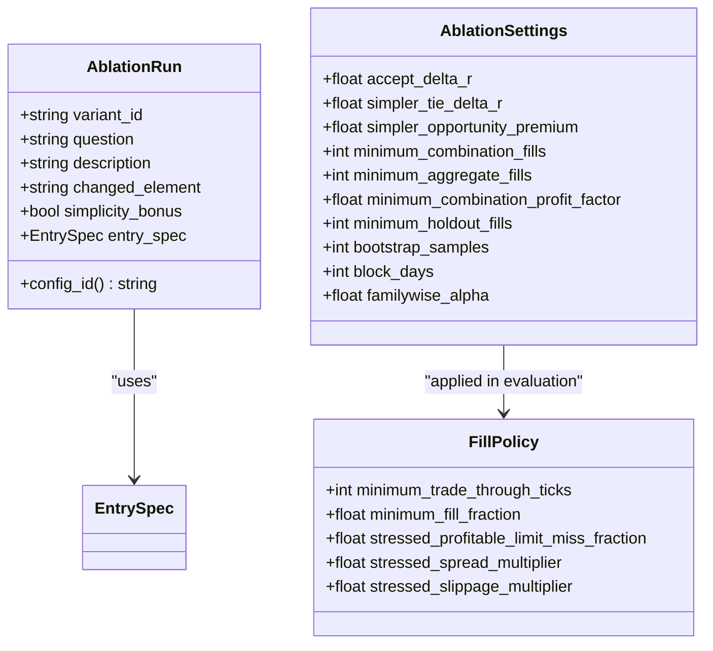
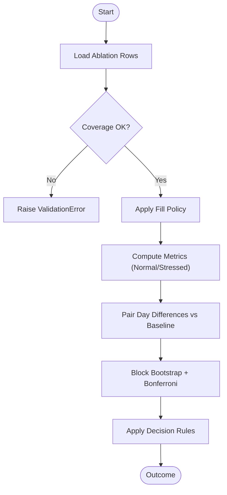
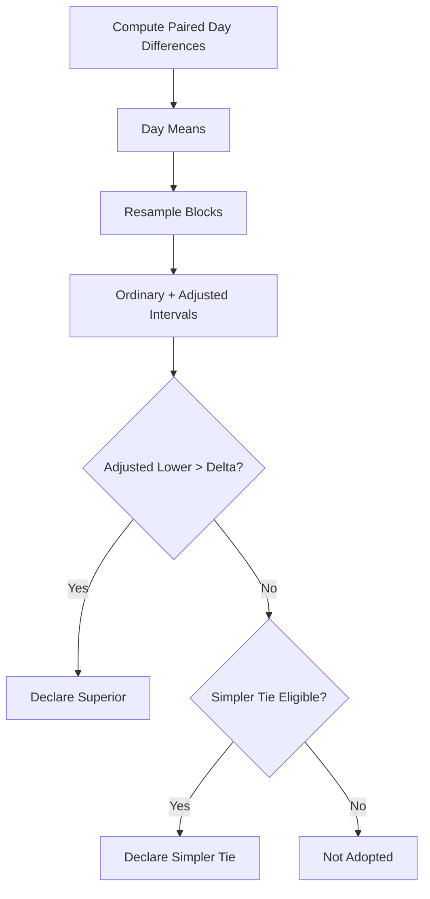
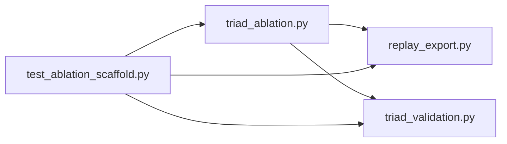

# Ablation Study Framework

<cite>
**Referenced Files in This Document**
- [triad_ablation.py](file://tools/triad_ablation.py)
- [triad_v2_2_ablation_registry.json](file://validation/triad_v2_2_ablation_registry.json)
- [test_ablation_scaffold.py](file://tests/test_ablation_scaffold.py)
- [triad_validation.py](file://tools/triad_validation.py)
- [replay_export.py](file://tools/replay_export.py)
</cite>

## Table of Contents
1. [Introduction](#introduction)
2. [Project Structure](#project-structure)
3. [Core Components](#core-components)
4. [Architecture Overview](#architecture-overview)
5. [Detailed Component Analysis](#detailed-component-analysis)
6. [Dependency Analysis](#dependency-analysis)
7. [Performance Considerations](#performance-considerations)
8. [Troubleshooting Guide](#troubleshooting-guide)
9. [Conclusion](#conclusion)
10. [Appendices](#appendices)

## Introduction
This document explains the ablation study framework that evaluates how individual strategy components affect overall performance. It focuses on isolating and testing specific features such as session timing, risk management parameters, and signal detection algorithms through a registry-based approach. The framework defines preregistered variants, enforces frozen splits and decision rules, and uses paired statistical testing with block bootstrap and Bonferroni adjustment to compare baseline performance against modified strategies. It also provides practical guidance for designing meaningful experiments and avoiding overfitting during feature importance analysis.

## Project Structure
The ablation framework is implemented across a small set of focused modules:
- A preregistration registry that locks down questions, fixed controls, evaluation method, and variant definitions.
- An ablation runner that builds rows from observed events, evaluates selection and holdout windows, and applies predeclared decision rules.
- A validation module providing replay row handling, fill policies, metrics, and coverage checks.
- A replay exporter that converts observed events into the schema consumed by the validator and supports ablation-specific row derivation.
- Tests that validate contracts, mechanics, and end-to-end scenarios without claiming any live edge.

**Diagram sources**
- [triad_ablation.py:160-259](file://tools/triad_ablation.py#L160-L259)
- [triad_v2_2_ablation_registry.json:1-196](file://validation/triad_v2_2_ablation_registry.json#L1-L196)
- [triad_validation.py:183-208](file://tools/triad_validation.py#L183-L208)
- [replay_export.py:830-900](file://tools/replay_export.py#L830-L900)

**Section sources**
- [triad_ablation.py:1-158](file://tools/triad_ablation.py#L1-L158)
- [triad_v2_2_ablation_registry.json:1-196](file://validation/triad_v2_2_ablation_registry.json#L1-L196)
- [triad_validation.py:1-120](file://tools/triad_validation.py#L1-L120)
- [replay_export.py:1-122](file://tools/replay_export.py#L1-L122)

## Core Components
- Registry-based configuration: A frozen JSON payload declares schema version, registry version, canonical strategy reference, purpose, research questions, fixed controls, data splits, evaluation method (paired day-level differences, block bootstrap, Bonferroni), fill policy, decision thresholds, and all ablation runs including their entry specifications.
- Ablation runs: Each run changes exactly one entry element relative to the baseline (e.g., removing displacement confirmation, switching to quote entry, adjusting geometry filters). Runs are tagged with simplicity bonuses where applicable.
- Evaluation pipeline: Loads registry and runs, validates input rows and coverage, computes metrics under normal and stressed conditions, performs paired comparisons against baseline, and applies decision rules to determine superiority or simpler tie.
- Statistical testing: Uses 5-day moving block bootstrap of paired day means with Bonferroni familywise adjustment across competing variants to compute confidence intervals for mean differences.
- Decision rules: Predeclared gates ensure eligibility (fills, expectancy, profit factor, year robustness, stress), superiority requires adjusted lower bound exceeding a threshold, and simpler ties require opportunity premium and no significant harm.

**Section sources**
- [triad_ablation.py:160-259](file://tools/triad_ablation.py#L160-L259)
- [triad_v2_2_ablation_registry.json:28-82](file://validation/triad_v2_2_ablation_registry.json#L28-L82)
- [triad_validation.py:112-146](file://tools/triad_validation.py#L112-L146)

## Architecture Overview
The ablation workflow proceeds through these stages:
1. Preregistration: Write and lock the registry with SHA-256 integrity; it cannot be changed without re-registration.
2. Build: Convert observed events into ablation rows for each variant and combination across WALK_FORWARD and HOLDOUT windows.
3. Validate: Load rows, enforce coverage, apply fill policy, compute metrics, perform paired comparisons, and decide outcomes.
4. Confirm: For adopted variants, confirm on fresh holdout data with minimum fills and non-negative expectancy relative to baseline.

**Diagram sources**
- [triad_ablation.py:676-800](file://tools/triad_ablation.py#L676-L800)
- [triad_validation.py:440-473](file://tools/triad_validation.py#L440-L473)
- [replay_export.py:830-900](file://tools/replay_export.py#L830-L900)

## Detailed Component Analysis

### Registry-Based Configuration
- Schema and versioning: Enforced via schema_version and registry_version fields; tamper protection via SHA-256 hash of the payload excluding the hash itself.
- Fixed controls: Profile, risk fraction, target R, time stop minutes, breakeven policy, range/ATR bands, initial balance, and flags ensuring one change per variant and no stacking this round.
- Splits: Frozen WALK_FORWARD and HOLDOUT date ranges; guard functions reject mismatched split arguments at runtime.
- Evaluation: Defines paired comparison methodology, bootstrap settings, and decision rules.
- Fill policy: Conservative assumptions about limit touches, trade-through ticks, partial fills, and stress multipliers for spread and slippage.
- Runs: Baseline plus five variants, each changing exactly one entry parameter; includes descriptions, changed elements, and simplicity bonus flags.

**Diagram sources**
- [triad_ablation.py:160-186](file://tools/triad_ablation.py#L160-L186)
- [triad_validation.py:112-128](file://tools/triad_validation.py#L112-L128)

**Section sources**
- [triad_v2_2_ablation_registry.json:1-196](file://validation/triad_v2_2_ablation_registry.json#L1-L196)
- [triad_ablation.py:267-377](file://tools/triad_ablation.py#L267-L377)
- [triad_ablation.py:422-463](file://tools/triad_ablation.py#L422-L463)

### Isolation of Strategy Components
Each variant modifies exactly one entry component:
- Displacement confirmation removal: Switches to reclaim-body retracement entry mode.
- Quote entry: Uses first executable quote after confirmation instead of limit retracement.
- Geometry filter adjustments: Removes reclaim wick filter, lowers displacement body threshold, removes midpoint confirmation.
These changes are explicitly declared in the registry’s runs array and enforced by tests that verify each variant changes at least one entry parameter while keeping sweep bands and stop parameters unchanged.

**Section sources**
- [triad_v2_2_ablation_registry.json:91-181](file://validation/triad_v2_2_ablation_registry.json#L91-L181)
- [test_ablation_scaffold.py:64-77](file://tests/test_ablation_scaffold.py#L64-L77)

### Data Flow and Processing Logic
- Event to row conversion: Observed events are transformed into ablation rows using an ablation-specific derivation function that respects variant entry specs.
- Coverage enforcement: Every config/combination/day must exist in both WALK_FORWARD and HOLDOUT; missing days cause validation errors.
- Fill policy application: Only candidates that activate, touch limits, and trade through by required ticks are considered; stressed scenarios may drop profitable limits deterministically and increase costs.
- Metric computation: Per-combination and aggregate metrics include fills, expectancy, profit factor, wins/losses, cash totals, cost breakdowns, and calendar-year robustness.

**Diagram sources**
- [triad_validation.py:440-473](file://tools/triad_validation.py#L440-L473)
- [triad_validation.py:480-498](file://tools/triad_validation.py#L480-L498)
- [triad_validation.py:646-708](file://tools/triad_validation.py#L646-L708)
- [triad_ablation.py:527-626](file://tools/triad_ablation.py#L527-L626)

**Section sources**
- [replay_export.py:830-900](file://tools/replay_export.py#L830-L900)
- [triad_validation.py:360-437](file://tools/triad_validation.py#L360-L437)
- [triad_validation.py:646-708](file://tools/triad_validation.py#L646-L708)

### Statistical Significance Testing and Result Interpretation
- Paired day-level differences: For each calendar day and combination, compute sum(net R of variant fills) minus sum(net R of baseline fills); days with no fill on either side contribute zero so opportunity effects are visible.
- Block bootstrap: Resample contiguous 5-day blocks to estimate the distribution of the mean paired difference; compute ordinary and familywise-adjusted intervals.
- Bonferroni adjustment: Widens intervals to control familywise error rate across competing variants.
- Decision thresholds: Superiority requires adjusted lower bound above a positive delta; simpler tie requires opportunity premium and no significant harm; R3 confirms on holdout with minimum fills and non-negative expectancy relative to baseline.

**Diagram sources**
- [triad_ablation.py:527-626](file://tools/triad_ablation.py#L527-L626)
- [triad_ablation.py:629-673](file://tools/triad_ablation.py#L629-L673)

**Section sources**
- [triad_ablation.py:527-626](file://tools/triad_ablation.py#L527-L626)
- [triad_ablation.py:629-673](file://tools/triad_ablation.py#L629-L673)
- [test_ablation_scaffold.py:262-358](file://tests/test_ablation_scaffold.py#L262-L358)

### Practical Examples and Best Practices
- Setting up ablation studies:
  - Preregister the registry to lock questions, fixed controls, splits, and decision rules before generating data.
  - Build ablation rows from observed events covering all combinations and days in both WALK_FORWARD and HOLDOUT.
  - Validate rows and evaluate metrics; inspect paired differences and bootstrap intervals.
- Configuring feature removals:
  - Define each variant to change exactly one entry parameter; mark simplicity bonuses where appropriate.
  - Ensure sweep bands and stop parameters remain unchanged to isolate entry logic effects.
- Analyzing comparative results:
  - Use paired day-level differences to capture opportunity effects even when only one side trades.
  - Interpret adjusted intervals to assess significance; adopt only if thresholds are met and confirmed on holdout.
- Avoiding overfitting:
  - Freeze splits and decision rules prior to seeing data; do not move cut dates post hoc.
  - Require minimum fills on both sides in holdout confirmation to prevent lucky single-fill confirmations.
  - Maintain one-change-per-variant discipline; avoid stacking multiple changes within the same round.

**Section sources**
- [triad_ablation.py:188-259](file://tools/triad_ablation.py#L188-L259)
- [triad_v2_2_ablation_registry.json:28-82](file://validation/triad_v2_2_ablation_registry.json#L28-L82)
- [test_ablation_scaffold.py:46-102](file://tests/test_ablation_scaffold.py#L46-L102)
- [test_ablation_scaffold.py:385-471](file://tests/test_ablation_scaffold.py#L385-L471)

## Dependency Analysis
The ablation framework depends on shared utilities and contracts:
- Replay export provides event-to-row conversion and ablation-specific derivation.
- Validation module supplies replay row structures, fill policy, metric computation, and coverage checks.
- Tests validate registry integrity, entry behavior, builder coverage, decision logic, and end-to-end scenarios.

**Diagram sources**
- [triad_ablation.py:98-123](file://tools/triad_ablation.py#L98-L123)
- [replay_export.py:140-150](file://tools/replay_export.py#L140-L150)
- [test_ablation_scaffold.py:18-21](file://tests/test_ablation_scaffold.py#L18-L21)

**Section sources**
- [triad_ablation.py:98-123](file://tools/triad_ablation.py#L98-L123)
- [replay_export.py:140-150](file://tools/replay_export.py#L140-L150)
- [test_ablation_scaffold.py:18-21](file://tests/test_ablation_scaffold.py#L18-L21)

## Performance Considerations
- Computational load: Block bootstrap with thousands of samples can be expensive; tune bootstrap_samples based on available resources while maintaining statistical reliability.
- Data volume: Ensure complete coverage across all combinations and days to avoid missing evidence; incomplete coverage triggers validation errors.
- Stress testing: Stressed scenarios increase computational overhead due to additional cost modeling and deterministic limit drops; use judiciously for robustness checks.
- Determinism: Fixed seeds ensure reproducible results; maintain consistent seeds across runs for fair comparisons.

[No sources needed since this section provides general guidance]

## Troubleshooting Guide
Common issues and resolutions:
- Registry tampering: If the registry file is modified, loading will raise a validation error due to hash mismatch; regenerate or restore the committed registry.
- Split mismatches: Using different WALK_FORWARD/HOLDOUT cuts than preregistered will raise a validation error; re-register before changing splits.
- Missing coverage: If any configuration/combination/day is absent in either split, coverage validation fails; ensure exports include explicit no-candidate rows for every day.
- Insufficient fills: R1 gates require minimum fills per combination and aggregate; insufficient evidence leads to not_eligible decisions; expand data or adjust experiment scope.
- Holdout confirmation failures: R3 requires minimum fills on both sides in holdout; thin evidence prevents confirmation; collect more data or refine variant design.

**Section sources**
- [triad_ablation.py:354-377](file://tools/triad_ablation.py#L354-L377)
- [triad_ablation.py:422-463](file://tools/triad_ablation.py#L422-L463)
- [triad_validation.py:360-437](file://tools/triad_validation.py#L360-L437)
- [triad_validation.py:440-473](file://tools/triad_validation.py#L440-L473)

## Conclusion
The ablation study framework provides a rigorous, preregistered methodology for isolating and evaluating individual strategy components. By locking configurations, enforcing coverage, applying conservative fill policies, and using paired statistical testing with block bootstrap and Bonferroni adjustment, it ensures reliable comparisons between baseline and modified strategies. Adherence to one-change-per-variant discipline, minimum fill floors, and fresh-window confirmation helps avoid overfitting and spurious conclusions. The registry-based approach and comprehensive tests provide a solid foundation for meaningful ablation experiments in trading strategy research.

[No sources needed since this section summarizes without analyzing specific files]

## Appendices

### Example Commands and Workflow
- Preregister registry: Write the frozen ablation registry to a JSON file; refuses overwrite unless forced.
- Build rows: Generate ablation rows from observed events for all variants and combinations across WALK_FORWARD and HOLDOUT.
- Validate: Evaluate selection and holdout, compute metrics, perform paired comparisons, and produce a report with decisions and confirmations.

**Section sources**
- [triad_ablation.py:58-79](file://tools/triad_ablation.py#L58-L79)
- [triad_ablation.py:676-800](file://tools/triad_ablation.py#L676-L800)