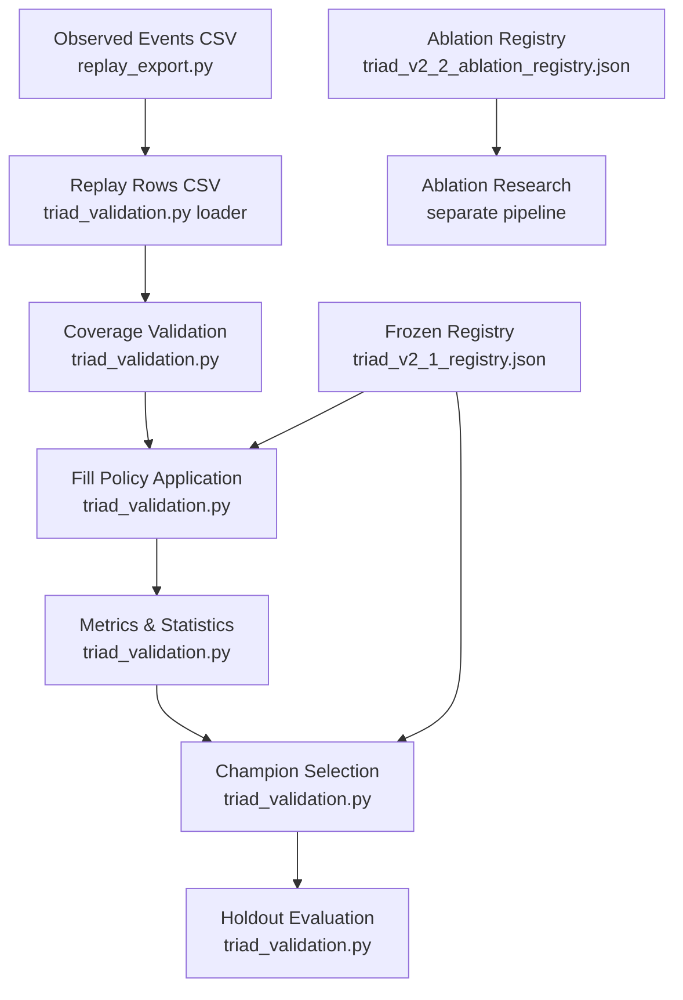
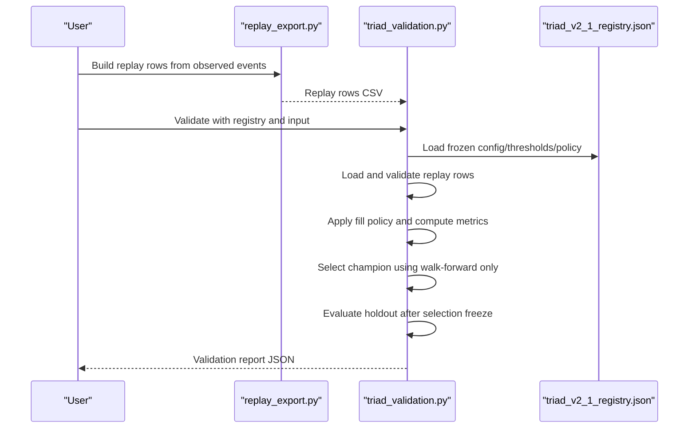
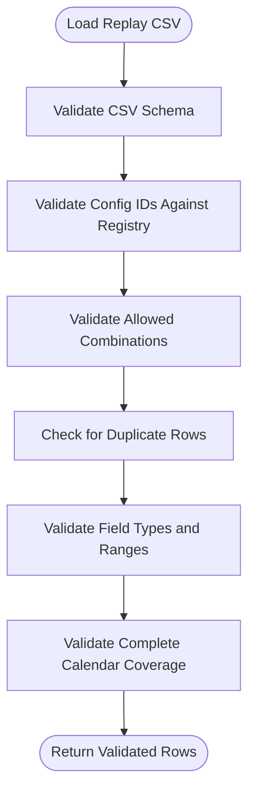
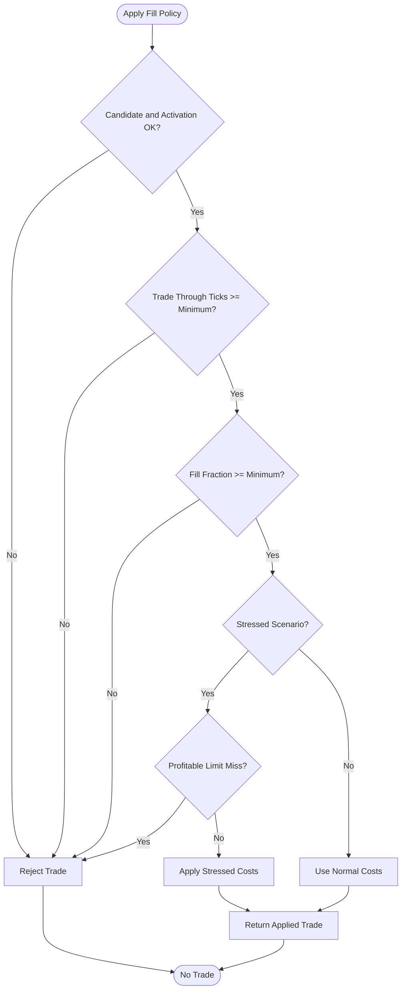
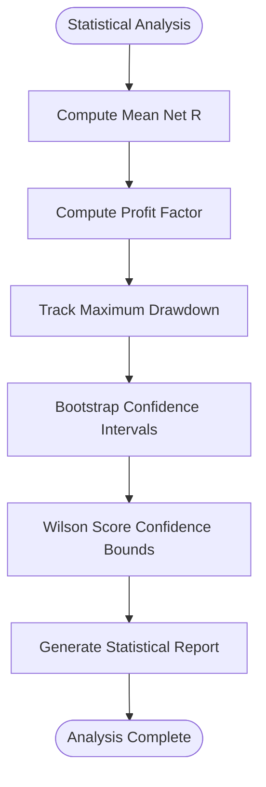
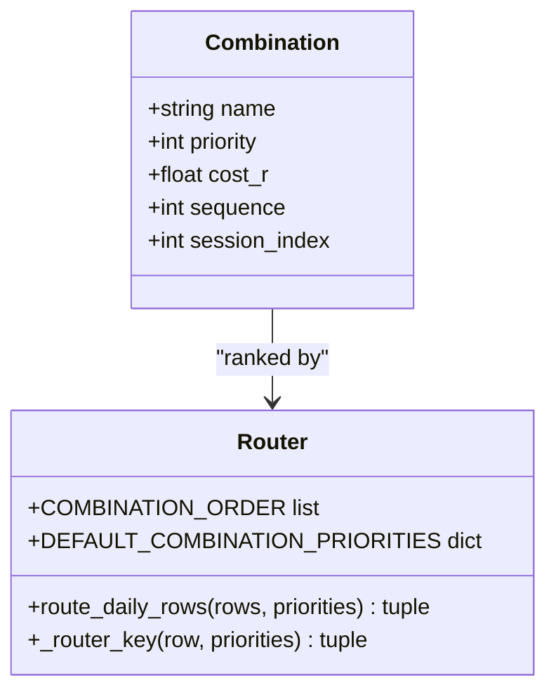
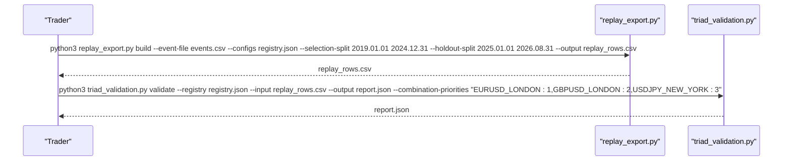
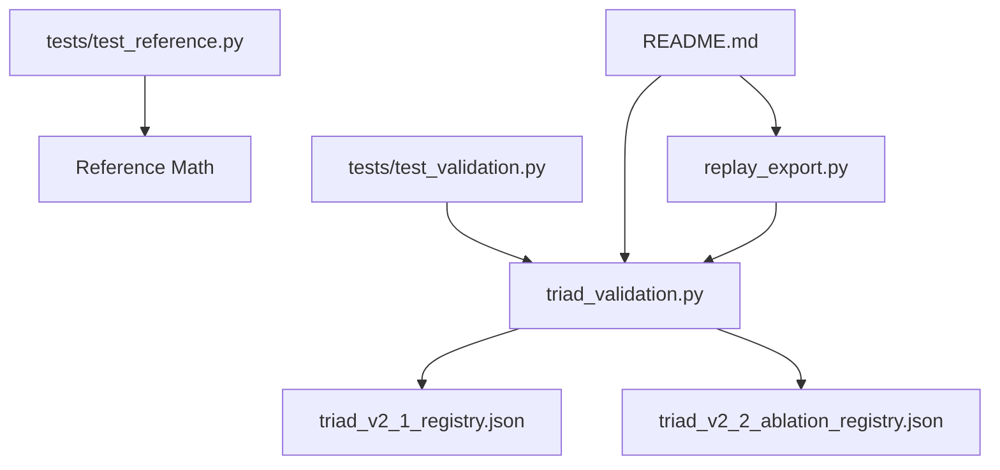

# Backtesting Engine

<cite>
**Referenced Files in This Document**
- [triad_validation.py](file://tools/triad_validation.py)
- [replay_export.py](file://tools/replay_export.py)
- [triad_v2_1_registry.json](file://validation/triad_v2_1_registry.json)
- [triad_v2_2_ablation_registry.json](file://validation/triad_v2_2_ablation_registry.json)
- [test_validation.py](file://tests/test_validation.py)
- [test_reference.py](file://tests/test_reference.py)
- [README.md](file://MQL5/Experts/TRIAD_R_HS/README.md)
</cite>

## Table of Contents
1. [Introduction](#introduction)
2. [Project Structure](#project-structure)
3. [Core Components](#core-components)
4. [Architecture Overview](#architecture-overview)
5. [Detailed Component Analysis](#detailed-component-analysis)
6. [Dependency Analysis](#dependency-analysis)
7. [Performance Considerations](#performance-considerations)
8. [Troubleshooting Guide](#troubleshooting-guide)
9. [Conclusion](#conclusion)
10. [Appendices](#appendices)

## Introduction
This document explains the TRIAD-R backtesting engine that processes replay CSV data and validates strategy performance against a frozen configuration registry. It covers the end-to-end validation workflow: loading replay rows, validating configuration coverage, applying conservative fill policies, computing statistics (expectancy, profit factor, drawdown), and performing session-based validation for London and New York combinations. It also documents how the engine prevents look-ahead bias and maintains consistency with live trading conditions through strict separation of selection and holdout phases, deterministic routing, and robust statistical checks.

## Project Structure
The backtesting system is implemented as a Python tooling pipeline with a frozen registry and MQL5 EA context:
- tools/triad_validation.py: Core validator, metrics, phase simulation, bootstrap confidence intervals, champion selection, and Section 13 checklist aggregation.
- tools/replay_export.py: Producer that converts observed signal events into the exact CSV schema consumed by the validator, including entry/stop/target arithmetic and full calendar expansion.
- validation/triad_v2_1_registry.json: Frozen 160-config matrix, thresholds, fill policy, and simulation settings used for V2.1 selection.
- validation/triad_v2_2_ablation_registry.json: Preregistered ablation research round registry defining variants and decision rules separate from the frozen V2.1 selection.
- tests/: Unit tests covering registry integrity, fill policy behavior, selection mechanics, and reference math for profiles, floors, volume rounding, and session time conversions.
- MQL5/Experts/TRIAD_R_HS/README.md: Operational guidance for the live EA, including offline tool usage, combination priorities, and required validation sequence.



**Diagram sources**
- [triad_validation.py:360-437](file://tools/triad_validation.py#L360-L437)
- [triad_validation.py:646-708](file://tools/triad_validation.py#L646-L708)
- [triad_validation.py:1529-1673](file://tools/triad_validation.py#L1529-L1673)
- [triad_v2_1_registry.json:1-200](file://validation/triad_v2_1_registry.json#L1-L200)
- [triad_v2_2_ablation_registry.json:1-196](file://validation/triad_v2_2_ablation_registry.json#L1-L196)

**Section sources**
- [triad_validation.py:1-30](file://tools/triad_validation.py#L1-L30)
- [replay_export.py:1-122](file://tools/replay_export.py#L1-L122)
- [triad_v2_1_registry.json:1-200](file://validation/triad_v2_1_registry.json#L1-L200)
- [triad_v2_2_ablation_registry.json:1-196](file://validation/triad_v2_2_ablation_registry.json#L1-L196)
- [README.md:147-226](file://MQL5/Experts/TRIAD_R_HS/README.md#L147-L226)

## Core Components
- ReplayRow and AppliedTrade: Data models representing each replay event and applied trade after fill policy filtering.
- FillPolicy: Conservative assumptions for pending order fills, including minimum trade-through ticks, minimum fill fraction, and stressed cost multipliers.
- CandidateConfig and SimulationSettings: Frozen parameters defining the 160-config matrix and simulation behavior (initial balance, targets, drawdown controls).
- ValidationThresholds: Point-estimate gates for fills, expectancy, profit factor, stress, pass probabilities, and drawdown limits.
- Metric Report: Aggregate and per-combination statistics including expectancy, profit factor, wins/losses, rule violations, operational errors, and execution metrics.
- Phase Simulation: Moving-block bootstrap path simulation for Phase 1 and Phase 2 with daily/weekly stops, drawdown shutdowns, qualifying days, and completion metrics.
- Champion Selection: Walk-forward-only selection with independent combination eligibility, router application, bootstrap confidence interval, and lexicographic tie-breaking.
- Section 13 Verdict: Combined checklist including year robustness, firm floor checks, stress overshoot, and Wilson score confidence bounds.

**Section sources**
- [triad_validation.py:98-181](file://tools/triad_validation.py#L98-L181)
- [triad_validation.py:184-225](file://tools/triad_validation.py#L184-L225)
- [triad_validation.py:646-708](file://tools/triad_validation.py#L646-L708)
- [triad_validation.py:980-1072](file://tools/triad_validation.py#L980-L1072)
- [triad_validation.py:1529-1673](file://tools/triad_validation.py#L1529-L1673)
- [triad_validation.py:1380-1460](file://tools/triad_validation.py#L1380-L1460)

## Architecture Overview
The backtesting engine follows a strict two-phase architecture:
- Selection Phase: Uses only WALK_FORWARD rows to select a champion configuration based on independent combination eligibility, point-estimate gates, phase simulation passes, bootstrap confidence intervals, and router application.
- Holdout Phase: Evaluates the selected champion on HOLDOUT rows only after selection is frozen, ensuring no look-ahead bias from future data.



**Diagram sources**
- [replay_export.py:105-121](file://tools/replay_export.py#L105-L121)
- [triad_validation.py:1676-1845](file://tools/triad_validation.py#L1676-L1845)
- [triad_v2_1_registry.json:1-200](file://validation/triad_v2_1_registry.json#L1-L200)

**Section sources**
- [triad_validation.py:1676-1845](file://tools/triad_validation.py#L1676-L1845)
- [README.md:183-197](file://MQL5/Experts/TRIAD_R_HS/README.md#L183-L197)

## Detailed Component Analysis

### Replay Row Loading and Coverage Validation
The engine loads replay CSV rows with strict validation:
- Schema enforcement: Exact field names and types are validated during loading.
- Configuration registry validation: Each row's config_id must exist in the frozen registry.
- Combination validation: Only allowed combinations (EURUSD_LONDON, GBPUSD_LONDON, USDJPY_NEW_YORK) are accepted.
- Coverage validation: Every configuration must have complete calendar-day coverage for both WALK_FORWARD and HOLDOUT splits across all combinations.



**Diagram sources**
- [triad_validation.py:360-437](file://tools/triad_validation.py#L360-L437)
- [triad_validation.py:440-473](file://tools/triad_validation.py#L440-L473)

**Section sources**
- [triad_validation.py:360-437](file://tools/triad_validation.py#L360-L437)
- [triad_validation.py:440-473](file://tools/triad_validation.py#L440-L473)

### Fill Policy Application
The fill policy enforces conservative assumptions consistent with live trading:
- Minimum trade-through: Limit orders require at least one tick beyond the limit price.
- Minimum fill fraction: Partial fills are excluded to maintain exact exposure reconciliation.
- Stressed scenario: Deterministic removal of profitable limits and increased spread/slippage costs.
- Cost reconstruction: All-in costs (spread + slippage + commission) are tracked in R units.



**Diagram sources**
- [triad_validation.py:480-498](file://tools/triad_validation.py#L480-L498)

**Section sources**
- [triad_validation.py:480-498](file://tools/triad_validation.py#L480-L498)

### Statistical Analysis Methods
The engine implements comprehensive statistical analysis:
- Expectancy calculations: Mean net R across all trades or per combination.
- Profit factor computation: Total profits divided by total losses, with infinity handling for zero-loss scenarios.
- Drawdown analysis: Maximum drawdown tracking with p50, p95, p99 percentiles across simulation paths.
- Bootstrap confidence intervals: Moving-calendar-day block bootstrap with Bonferroni familywise adjustment for multiple testing protection.
- Wilson score intervals: Confidence bounds for joint pass probabilities in phase simulations.



**Diagram sources**
- [triad_validation.py:500-505](file://tools/triad_validation.py#L500-L505)
- [triad_validation.py:1075-1119](file://tools/triad_validation.py#L1075-L1119)
- [triad_validation.py:1469-1522](file://tools/triad_validation.py#L1469-L1522)

**Section sources**
- [triad_validation.py:500-505](file://tools/triad_validation.py#L500-L505)
- [triad_validation.py:1075-1119](file://tools/triad_validation.py#L1075-L1119)
- [triad_validation.py:1469-1522](file://tools/triad_validation.py#L1469-L1522)

### Session-Based Validation Approach
The engine validates three specific instrument/session combinations independently:
- EURUSD_LONDON: European session trading for Euro/Dollar pair.
- GBPUSD_LONDON: European session trading for British Pound/Dollar pair.
- USDJPY_NEW_YORK: US session trading for US Dollar/Japanese Yen pair.

Each combination is evaluated independently with its own eligibility gates before portfolio ranking. The router applies account-wide collision resolution using priority, cost/R, sequence, and stable session index ordering.



**Diagram sources**
- [triad_validation.py:756-800](file://tools/triad_validation.py#L756-L800)
- [triad_validation.py:803-875](file://tools/triad_validation.py#L803-L875)

**Section sources**
- [triad_validation.py:756-800](file://tools/triad_validation.py#L756-L800)
- [triad_validation.py:803-875](file://tools/triad_validation.py#L803-L875)

### Practical Examples and Usage
Running backtests involves these key steps:

1. **Prepare Observed Events**: Generate observed-event CSV from MT5 Strategy Tester or external replay with signal geometry and fill/exit observations.

2. **Build Replay Rows**: Use replay exporter to convert observed events into registry-conformant replay rows with full calendar coverage.

3. **Run Validation**: Execute validation with frozen registry to select champion and evaluate holdout performance.

4. **Interpret Reports**: Analyze validation reports for selection results, holdout evaluation, statistical confidence, and Section 13 checklist compliance.



**Diagram sources**
- [replay_export.py:105-121](file://tools/replay_export.py#L105-L121)
- [triad_validation.py:1879-1929](file://tools/triad_validation.py#L1879-L1929)

**Section sources**
- [replay_export.py:105-121](file://tools/replay_export.py#L105-L121)
- [triad_validation.py:1879-1929](file://tools/triad_validation.py#L1879-L1929)
- [README.md:147-226](file://MQL5/Experts/TRIAD_R_HS/README.md#L147-L226)

### Look-Ahead Bias Prevention
The engine ensures look-ahead bias prevention through multiple mechanisms:
- Strict split separation: HOLDOUT rows are rejected from champion selection and only evaluated after selection is frozen.
- Frozen registry: Configuration matrix, thresholds, and simulation settings are committed with SHA-256 hash verification.
- Deterministic routing: Account-wide router uses fixed priorities and cost/R ordering without future information.
- Bootstrap confidence: Familywise-adjusted confidence intervals protect against multiple testing bias.
- Coverage validation: Complete calendar-day coverage ensures no selective omission of unfavorable days.

**Section sources**
- [triad_validation.py:1529-1673](file://tools/triad_validation.py#L1529-L1673)
- [triad_validation.py:1676-1845](file://tools/triad_validation.py#L1676-L1845)
- [triad_v2_1_registry.json:1-200](file://validation/triad_v2_1_registry.json#L1-L200)

### Live Trading Consistency
The backtesting engine maintains consistency with live trading conditions through:
- Conservative fill assumptions: Minimum trade-through ticks and full fill requirements match live execution constraints.
- Realistic cost modeling: Spread, slippage, and commission components are modeled consistently with broker economics.
- Volume rounding: Lattice-based volume sizing anchored at SYMBOL_VOLUME_MIN matches live order placement.
- Risk management: Daily/weekly stops, drawdown shutdowns, and risk tier reduction mirror live safety controls.
- News and session boundaries: Time-stop logic and session-end exits align with live trading schedules.

**Section sources**
- [replay_export.py:15-37](file://tools/replay_export.py#L15-L37)
- [triad_validation.py:113-128](file://tools/triad_validation.py#L113-L128)
- [README.md:120-136](file://MQL5/Experts/TRIAD_R_HS/README.md#L120-L136)

## Dependency Analysis
The backtesting engine has clear dependency relationships:
- replay_export.py depends on triad_validation.py for shared constants and utilities.
- Both modules depend on the frozen registry files for configuration and thresholds.
- Tests validate the integrity of both modules and their interaction patterns.
- The MQL5 EA README provides operational context and validation requirements.



**Diagram sources**
- [replay_export.py:140-150](file://tools/replay_export.py#L140-L150)
- [test_validation.py:9-29](file://tests/test_validation.py#L9-L29)
- [test_reference.py:7-21](file://tests/test_reference.py#L7-L21)

**Section sources**
- [replay_export.py:140-150](file://tools/replay_export.py#L140-L150)
- [test_validation.py:9-29](file://tests/test_validation.py#L9-L29)
- [test_reference.py:7-21](file://tests/test_reference.py#L7-L21)

## Performance Considerations
The backtesting engine is designed for computational efficiency while maintaining statistical rigor:
- Block bootstrap sampling: Moving-calendar-day blocks preserve temporal dependencies while enabling efficient resampling.
- Vectorized operations: Pandas-like operations are avoided in favor of efficient Python standard library functions.
- Memory management: Streaming CSV processing minimizes memory footprint for large datasets.
- Parallelization opportunities: Independent combination evaluations and bootstrap paths can be parallelized for faster turnaround.
- Caching strategies: Repeated metric computations can be cached when exploring different parameter sets.

[No sources needed since this section provides general guidance]

## Troubleshooting Guide
Common issues and their resolutions:

**CSV Schema Mismatch**: Ensure replay export uses the exact field names defined in the registry schema. Run `python3 tools/triad_validation.py schema` to verify expected format.

**Missing Configuration Coverage**: Every configuration must have complete calendar-day coverage for both WALK_FORWARD and HOLDOUT splits. Missing no-candidate rows will cause validation failures.

**Invalid Combination Values**: Only EURUSD_LONDON, GBPUSD_LONDON, and USDJPY_NEW_YORK are supported. Verify combination values match exactly.

**Fill Policy Rejections**: Check that limit orders have sufficient trade-through ticks and complete fill fractions. Partial fills and touches without trade-through are rejected by design.

**Selection Failures**: Review combination eligibility gates, point-estimate thresholds, and phase simulation passes. Inspect rejection reasons in the selection report.

**Holdout Evaluation Issues**: Ensure holdout rows are only evaluated after champion selection and use the same enabled combinations as selection.

**Section sources**
- [triad_validation.py:360-437](file://tools/triad_validation.py#L360-L437)
- [triad_validation.py:440-473](file://tools/triad_validation.py#L440-L473)
- [triad_validation.py:1529-1673](file://tools/triad_validation.py#L1529-L1673)
- [triad_validation.py:1676-1845](file://tools/triad_validation.py#L1676-L1845)

## Conclusion
The TRIAD-R backtesting engine provides a comprehensive, statistically rigorous framework for validating trading strategies against historical data. Its strict separation of selection and holdout phases, conservative fill policies, and robust statistical methods ensure that validation results are reliable and consistent with live trading conditions. The frozen registry system protects against data mining and look-ahead bias, while the session-based validation approach enables focused analysis of specific market conditions. The engine's modular design allows for easy extension and adaptation to new research questions while maintaining the integrity of the core validation process.

[No sources needed since this section summarizes without analyzing specific files]

## Appendices

### Appendix A: Command Reference
```bash
# Generate schema for replay CSV format
python3 tools/triad_validation.py schema

# Create frozen registry
python3 tools/triad_validation.py preregister --output validation/triad_v2_1_registry.json

# Build replay rows from observed events
python3 tools/replay_export.py build \
    --event-file events.csv \
    --configs validation/triad_v2_1_registry.json \
    --selection-split 2019.01.01 2024.12.31 \
    --holdout-split 2025.01.01 2026.08.31 \
    --output validation/triad_replay_rows.csv

# Run validation
python3 tools/triad_validation.py validate \
    --registry validation/triad_v2_1_registry.json \
    --input validation/triad_replay_rows.csv \
    --output validation/triad_validation_report.json \
    --combination-priorities "EURUSD_LONDON:1,GBPUSD_LONDON:2,USDJPY_NEW_YORK:3"
```

**Section sources**
- [triad_validation.py:1879-1929](file://tools/triad_validation.py#L1879-L1929)
- [replay_export.py:105-121](file://tools/replay_export.py#L105-L121)
- [README.md:147-226](file://MQL5/Experts/TRIAD_R_HS/README.md#L147-L226)

### Appendix B: Key Metrics Interpretation
- **Expectancy R**: Average profit/loss per trade in risk units; positive values indicate edge.
- **Profit Factor**: Ratio of gross profits to gross losses; values above 1.30 typically indicate robust strategies.
- **Maximum Drawdown P99**: Worst-case drawdown experienced in 99% of simulation paths; lower values indicate better risk control.
- **Phase Pass Probability**: Likelihood of achieving phase targets within specified timeframes; higher values indicate more reliable strategies.
- **Firm Floor Breach Rate**: Frequency of equity falling below 90% of initial balance; should be minimal for sustainable strategies.

**Section sources**
- [triad_validation.py:500-505](file://tools/triad_validation.py#L500-L505)
- [triad_validation.py:1182-1214](file://tools/triad_validation.py#L1182-L1214)
- [triad_validation.py:1343-1377](file://tools/triad_validation.py#L1343-L1377)