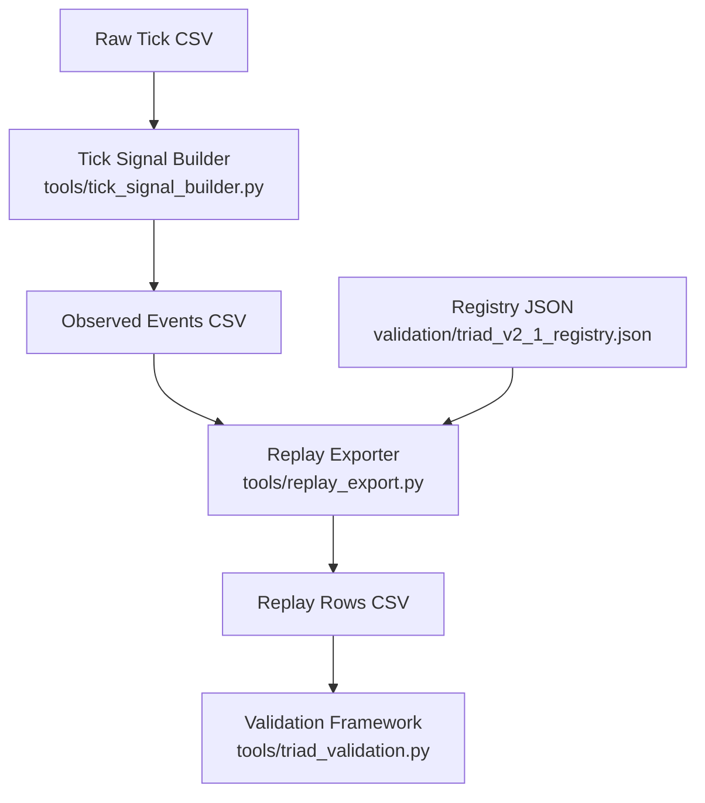
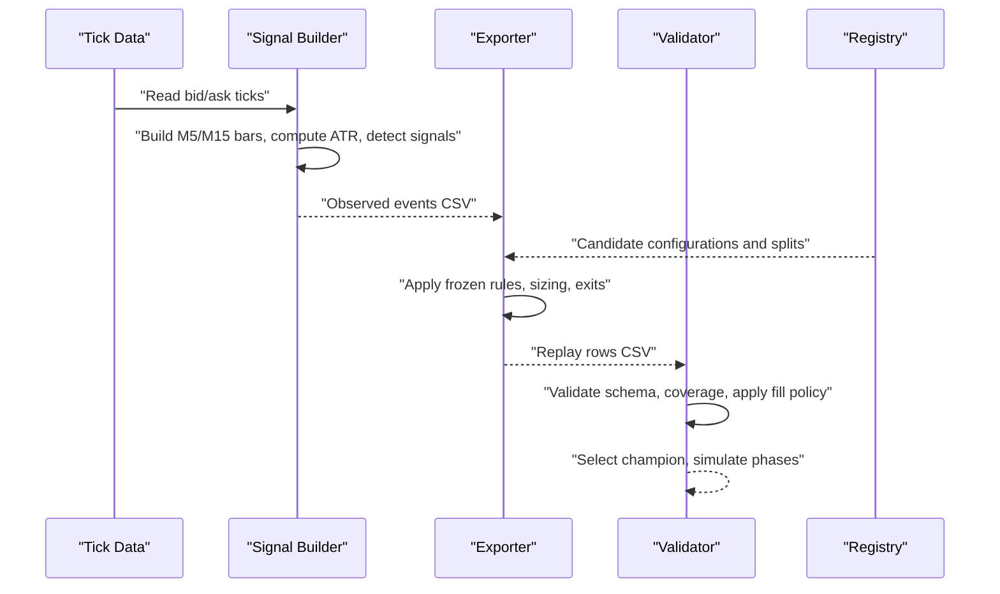
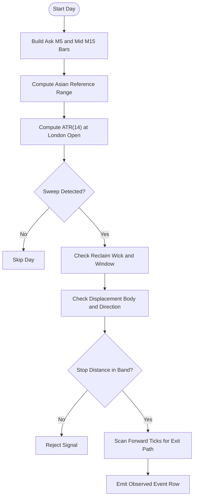
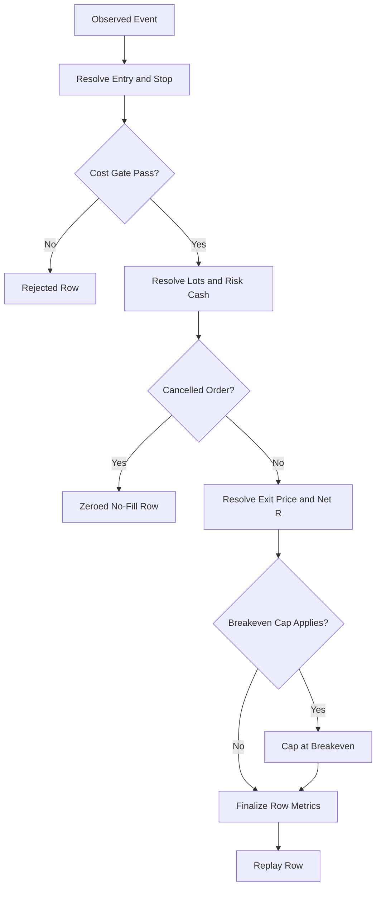
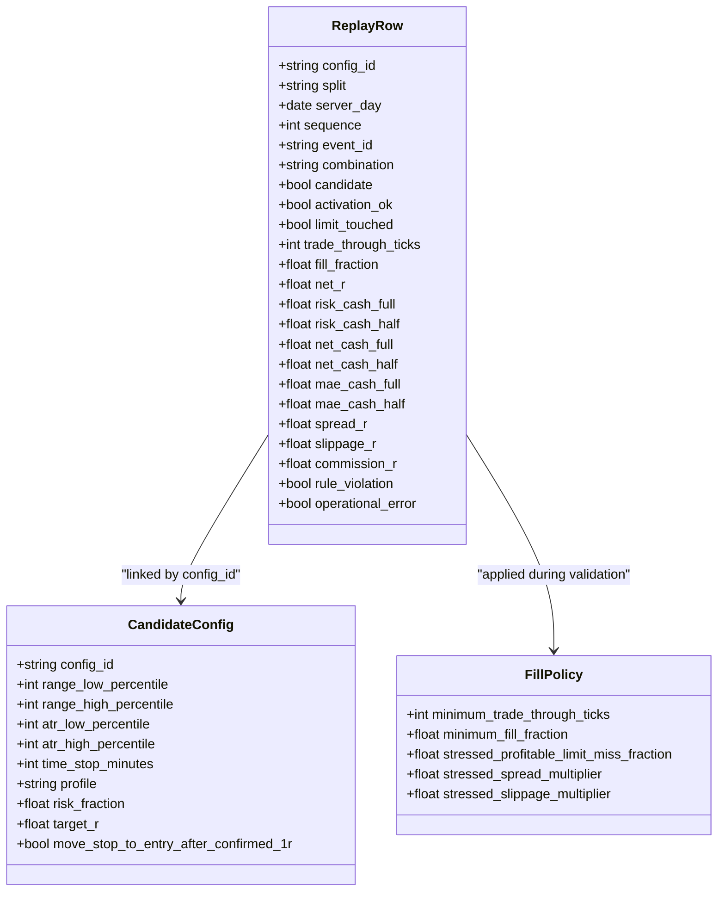
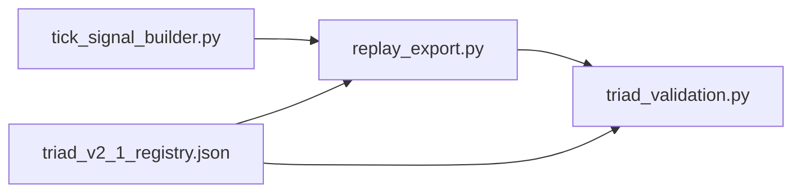

# Replay Export System

<cite>
**Referenced Files in This Document**
- [replay_export.py](file://tools/replay_export.py)
- [tick_signal_builder.py](file://tools/tick_signal_builder.py)
- [triad_validation.py](file://tools/triad_validation.py)
- [triad_v2_1_registry.json](file://validation/triad_v2_1_registry.json)
- [test_validation.py](file://tests/test_validation.py)
</cite>

## Table of Contents
1. [Introduction](#introduction)
2. [Project Structure](#project-structure)
3. [Core Components](#core-components)
4. [Architecture Overview](#architecture-overview)
5. [Detailed Component Analysis](#detailed-component-analysis)
6. [Dependency Analysis](#dependency-analysis)
7. [Performance Considerations](#performance-considerations)
8. [Troubleshooting Guide](#troubleshooting-guide)
9. [Conclusion](#conclusion)
10. [Appendices](#appendices)

## Introduction
This document explains the replay export system that converts raw MT5 tick data into a standardized CSV suitable for offline validation and champion selection. The pipeline has two stages:
- Tick-to-events builder: transforms raw bid/ask ticks into an observed-event CSV describing signal geometry, activation flags, and exit path observations.
- Replay exporter: applies the frozen strategy rules and configuration matrix to produce a canonical replay CSV consumed by the validation framework.

The system enforces strict schema contracts, deterministic ordering, complete calendar coverage across splits, and conservative fill policies so that downstream validation is robust and reproducible.

## Project Structure
At a high level:
- tools/tick_signal_builder.py builds observed events from raw tick data.
- tools/replay_export.py consumes those events plus a frozen registry to generate the final replay rows CSV.
- tools/triad_validation.py defines the replay CSV schema, loads and validates it, and performs selection and simulation.
- validation/triad_v2_1_registry.json declares the 160 candidate configurations and split boundaries.
- tests/test_validation.py asserts key behaviors like registry integrity, coverage requirements, and fill policy semantics.

**Diagram sources**
- [tick_signal_builder.py:1-47](file://tools/tick_signal_builder.py#L1-L47)
- [replay_export.py:1-122](file://tools/replay_export.py#L1-L122)
- [triad_validation.py:1-30](file://tools/triad_validation.py#L1-L30)
- [triad_v2_1_registry.json:1-15](file://validation/triad_v2_1_registry.json#L1-L15)

**Section sources**
- [tick_signal_builder.py:1-47](file://tools/tick_signal_builder.py#L1-L47)
- [replay_export.py:1-122](file://tools/replay_export.py#L1-L122)
- [triad_validation.py:1-30](file://tools/triad_validation.py#L1-L30)
- [triad_v2_1_registry.json:1-15](file://validation/triad_v2_1_registry.json#L1-L15)

## Core Components
- Observed event model: represents one completed signal sequence (sweep, reclaim, displacement) with geometry, costs, and exit-path observations.
- Configuration model: captures risk profile, target R, time-stop horizon, and breakeven policy per candidate.
- Export plan: defines selection and holdout date ranges used to expand events into full coverage.
- Replay row model: the canonical output schema consumed by the validator, including candidate status, activation flags, fills, R-denominated metrics, and cost breakdowns.

Key responsibilities:
- Event parsing and validation ensure upstream signals are well-formed and consistent with the contract.
- Per-config arithmetic mirrors the frozen EA entry, stop, sizing, and exit logic to guarantee parity between live behavior and offline replay.
- Coverage expansion guarantees every server day in each split contains a row for every configuration and instrument/session combination, including explicit no-candidate rows.

**Section sources**
- [replay_export.py:212-274](file://tools/replay_export.py#L212-L274)
- [triad_validation.py:98-199](file://tools/triad_validation.py#L98-L199)

## Architecture Overview
The end-to-end flow from raw ticks to validated results:

**Diagram sources**
- [tick_signal_builder.py:285-462](file://tools/tick_signal_builder.py#L285-L462)
- [replay_export.py:765-800](file://tools/replay_export.py#L765-L800)
- [triad_validation.py:360-460](file://tools/triad_validation.py#L360-L460)

## Detailed Component Analysis

### Observed Events Schema and Semantics
The observed-event CSV is the contract between the tick-to-events stage and the exporter. It includes:
- Identity and timing: server_day, sequence, event_id, combination, direction.
- Geometry: reference range, sweep extremes, reclaim bar OHLC, displacement bar OHLC, ATR(M15).
- Market microstructure: tick_size, tick_value, contract_size, volume_min, volume_step.
- Costs: spread_price, slippage_price, commission_per_lot_round_trip.
- Fill observation: limit_active, limit_touched, trade_through_ticks, fill_fraction.
- Exit path: exit_reason, minutes to target/stop/breakeven hits, prices at horizons, session-end price, worst adverse price.
- Flags: rule_violation, operational_error.

Semantics emphasize conservative fill interpretation: if the upstream cannot confirm a trade-through by at least one tick, the exporter treats it as a missed fill.

**Section sources**
- [replay_export.py:51-103](file://tools/replay_export.py#L51-L103)
- [replay_export.py:152-195](file://tools/replay_export.py#L152-L195)
- [replay_export.py:319-434](file://tools/replay_export.py#L319-L434)

### Tick-to-Events Pipeline
The signal builder:
- Builds ask-side M5 bars using all rows with non-empty ask values to avoid missing extremes.
- Builds mid-price M5/M15 bars using both-side ticks only for reference range and ATR.
- Computes ATR(14) at London open using prior M15 bars.
- Detects the Sleeve A signal in the London window: sweep depth within ATR band, reclaim wick strength, displacement body and direction, stop distance within ATR band.
- Reconstructs exit paths by scanning forward mid-price ticks to determine target/stop/breakeven/time/session outcomes and capture prices at horizons.

**Diagram sources**
- [tick_signal_builder.py:285-462](file://tools/tick_signal_builder.py#L285-L462)
- [tick_signal_builder.py:469-587](file://tools/tick_signal_builder.py#L469-L587)

**Section sources**
- [tick_signal_builder.py:285-462](file://tools/tick_signal_builder.py#L285-L462)
- [tick_signal_builder.py:469-587](file://tools/tick_signal_builder.py#L469-L587)

### Replay Exporter: Rules, Sizing, and Exits
The exporter re-applies the frozen strategy rules to each observed event under each configuration:
- Entry: typically the midpoint of the displacement body; alternative modes exist for ablation variants.
- Stop: placed beyond the sweep extreme with a buffer proportional to ATR; must be on the correct side and within ATR bands.
- Cost gate: round-trip modeled cost must not exceed a threshold relative to R.
- Sizing: volume is rounded down to the broker’s lattice anchored at SYMBOL_VOLUME_MIN; all-in loss (including commission and slippage reserve) must fit the risk budget.
- Exit: prioritizes observed target/stop/breakeven; otherwise uses configured time-stop or session-end price; confirmed +1R breakeven can cap losses by moving the stop to entry.

**Diagram sources**
- [replay_export.py:510-581](file://tools/replay_export.py#L510-L581)
- [replay_export.py:584-623](file://tools/replay_export.py#L584-L623)
- [replay_export.py:626-726](file://tools/replay_export.py#L626-L726)
- [replay_export.py:729-762](file://tools/replay_export.py#L729-L762)
- [replay_export.py:765-800](file://tools/replay_export.py#L765-L800)

**Section sources**
- [replay_export.py:510-581](file://tools/replay_export.py#L510-L581)
- [replay_export.py:584-623](file://tools/replay_export.py#L584-L623)
- [replay_export.py:626-726](file://tools/replay_export.py#L626-L726)
- [replay_export.py:729-762](file://tools/replay_export.py#L729-L762)
- [replay_export.py:765-800](file://tools/replay_export.py#L765-L800)

### Replay Rows CSV Schema
The replay rows CSV is the canonical output consumed by the validation framework. Required fields include:
- config_id, split, server_day, sequence, event_id, combination
- candidate, activation_ok, limit_touched, trade_through_ticks, fill_fraction
- net_r, risk_cash_full, risk_cash_half, net_cash_full, net_cash_half
- mae_cash_full, mae_cash_half
- spread_r, slippage_r, commission_r
- rule_violation, operational_error

The exporter ensures:
- Deterministic ordering by config_id, server_day, combination, sequence, event_id.
- Full coverage: every server day in WALK_FORWARD and HOLDOUT receives a row for every configuration and allowed combination, including no-candidate rows when applicable.

**Section sources**
- [triad_validation.py:71-95](file://tools/triad_validation.py#L71-L95)
- [triad_validation.py:183-199](file://tools/triad_validation.py#L183-L199)
- [replay_export.py:1023-1027](file://tools/replay_export.py#L1023-L1027)

### Registry and Candidate Matrix
The registry defines:
- Canonical strategy version and configuration matrix.
- 160 unique candidates spanning range percentiles, ATR percentiles, time stops, profiles (A–D), and breakeven policy toggles.
- Selection and holdout split dates.
- Conservative fill policy defaults enforced by the validator.

Tests assert:
- Committed registry matches built registry.
- Exactly 160 unique configs.
- Hash mismatch detection on registry mutation.
- Coverage requires every configuration/combination/day in both splits.

**Section sources**
- [triad_v2_1_registry.json:1-15](file://validation/triad_v2_1_registry.json#L1-L15)
- [test_validation.py:80-133](file://tests/test_validation.py#L80-L133)

### Relationship to Validation Framework
The exporter produces rows compatible with triad_validation.py:
- Schema alignment via shared constants and types.
- Coverage enforcement through validate_replay_coverage.
- Fill policy application via apply_fill_policy, which enforces minimum trade-through ticks and excludes partial fills.
- Champion selection uses only WALK_FORWARD rows; HOLDOUT outcomes cannot influence selection.

**Diagram sources**
- [triad_validation.py:98-199](file://tools/triad_validation.py#L98-L199)

**Section sources**
- [triad_validation.py:360-460](file://tools/triad_validation.py#L360-L460)
- [test_validation.py:135-176](file://tests/test_validation.py#L135-L176)

## Dependency Analysis
- replay_export.py depends on triad_validation.py for shared constants, types, and utilities (CSV_FIELDS, ReplayRow, load_registry, etc.).
- tick_signal_builder.py is independent of triad_validation.py but outputs the observed-event CSV consumed by replay_export.py.
- triad_validation.py reads the replay rows CSV and the registry JSON to perform validation and selection.

**Diagram sources**
- [replay_export.py:140-150](file://tools/replay_export.py#L140-L150)
- [triad_validation.py:360-372](file://tools/triad_validation.py#L360-L372)

**Section sources**
- [replay_export.py:140-150](file://tools/replay_export.py#L140-L150)
- [triad_validation.py:360-372](file://tools/triad_validation.py#L360-L372)

## Performance Considerations
- Bar construction and ATR computation are linear in number of ticks per day; use efficient grouping and sorting to minimize overhead.
- Exporter expands events into full coverage; ensure input event sets are deduplicated and minimal to reduce output size.
- Sizing and exit resolution are O(1) per event per configuration; overall complexity scales with number of events times number of configurations.
- Validation coverage checks iterate over expected combinations; precompute sets for efficiency.

[No sources needed since this section provides general guidance]

## Troubleshooting Guide
Common issues and resolutions:
- Header mismatch in observed events or replay rows: run schema commands to print expected headers and compare.
- Duplicate keys in observed events: ensure uniqueness of (server_day, sequence, event_id, combination).
- Missing coverage: verify that every server day in both splits has rows for all configurations and combinations; add no-candidate rows where necessary.
- Fill policy failures: ensure limit_touched=true and trade_through_ticks>=1; partial fills are excluded by default.
- Registry mutation: any change to configurations triggers hash mismatch; regenerate and commit the registry consistently.

**Section sources**
- [replay_export.py:319-434](file://tools/replay_export.py#L319-L434)
- [triad_validation.py:360-460](file://tools/triad_validation.py#L360-L460)
- [test_validation.py:103-133](file://tests/test_validation.py#L103-L133)

## Conclusion
The replay export system provides a rigorous, schema-driven bridge from raw MT5 tick data to a validated replay dataset. By enforcing frozen strategy rules, conservative fill assumptions, and complete coverage across splits, it ensures that offline validation faithfully reflects live trading behavior. The tight coupling between the exporter and the validation framework, along with comprehensive tests, safeguards data integrity and reproducibility.

[No sources needed since this section summarizes without analyzing specific files]

## Appendices

### Export Configuration Examples
- Build command example:
  - python3 tools/replay_export.py build --event-file events.csv --configs validation/triad_v2_1_registry.json --selection-split 2019.01.01 2024.12.31 --holdout-split 2025.01.01 2026.08.31 --output validation/triad_replay_rows.csv
- Self-test:
  - python3 tools/replay_export.py selftest --tmpdir /tmp/replay_selftest
- Schema inspection:
  - python3 tools/replay_export.py schema

**Section sources**
- [replay_export.py:105-121](file://tools/replay_export.py#L105-L121)

### Field Descriptions Summary
- Identity: config_id, split, server_day, sequence, event_id, combination
- Candidate and activation: candidate, activation_ok, limit_touched, trade_through_ticks, fill_fraction
- Metrics: net_r, risk_cash_full/half, net_cash_full/half, mae_cash_full/half
- Costs: spread_r, slippage_r, commission_r
- Flags: rule_violation, operational_error

**Section sources**
- [triad_validation.py:71-95](file://tools/triad_validation.py#L71-L95)
- [triad_validation.py:183-199](file://tools/triad_validation.py#L183-L199)

### Common Export Scenarios
- Standard replay: observed events from MT5 Strategy Tester or custom replay harness, expanded across WALK_FORWARD and HOLDOUT splits.
- Ablation studies: different entry modes and filter toggles via configuration variations in the registry.
- Stress testing: validator applies additional cost multipliers and probabilistic miss rates to assess robustness.

**Section sources**
- [replay_export.py:1-122](file://tools/replay_export.py#L1-L122)
- [triad_validation.py:112-128](file://tools/triad_validation.py#L112-L128)