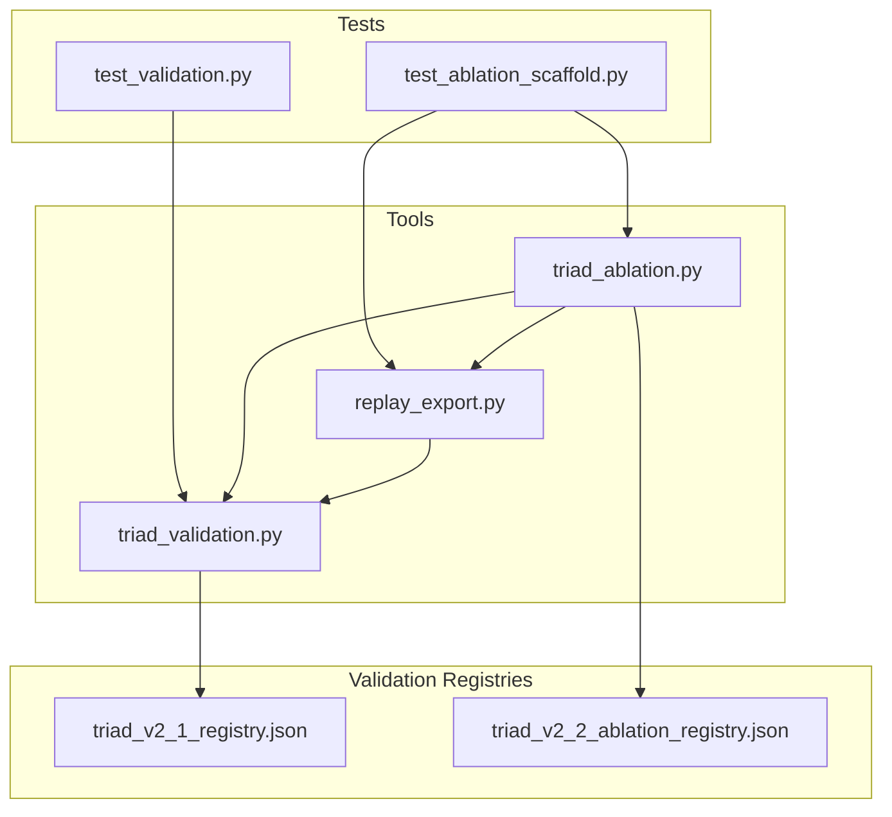
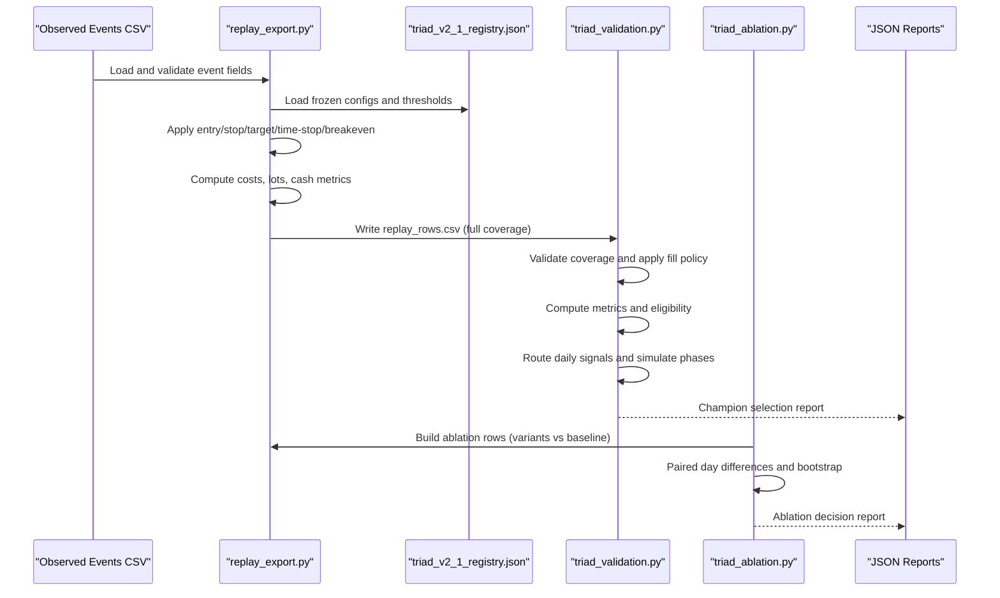
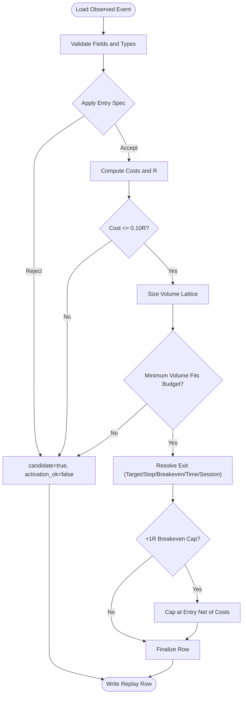
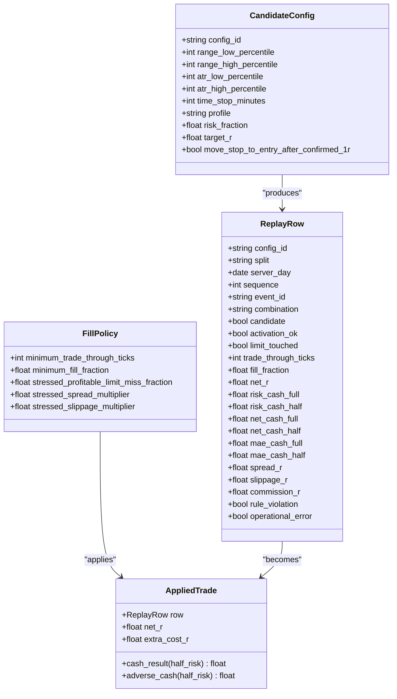
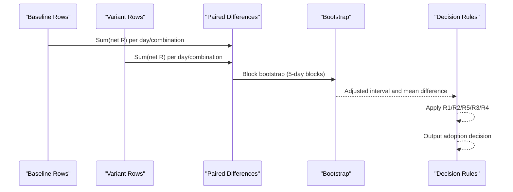
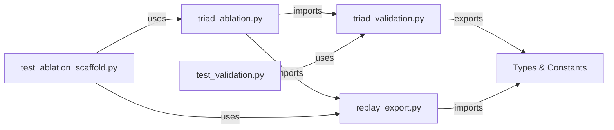

# Validation Framework

<cite>
**Referenced Files in This Document**
- [triad_validation.py](file://tools/triad_validation.py)
- [replay_export.py](file://tools/replay_export.py)
- [triad_ablation.py](file://tools/triad_ablation.py)
- [test_validation.py](file://tests/test_validation.py)
- [test_ablation_scaffold.py](file://tests/test_ablation_scaffold.py)
- [triad_v2_1_registry.json](file://validation/triad_v2_1_registry.json)
- [triad_v2_2_ablation_registry.json](file://validation/triad_v2_2_ablation_registry.json)
</cite>

## Table of Contents
1. [Introduction](#introduction)
2. [Project Structure](#project-structure)
3. [Core Components](#core-components)
4. [Architecture Overview](#architecture-overview)
5. [Detailed Component Analysis](#detailed-component-analysis)
6. [Dependency Analysis](#dependency-analysis)
7. [Performance Considerations](#performance-considerations)
8. [Troubleshooting Guide](#troubleshooting-guide)
9. [Conclusion](#conclusion)
10. [Appendices](#appendices)

## Introduction
This document explains the validation framework that ensures consistency between MQL5 production code and Python reference implementations for the TRIAD-R strategy. It covers:
- Replay export tooling that converts observed signal events into a registry-conformant CSV consumed by the validator.
- A frozen, hash-protected registry defining the 160-config selection matrix, thresholds, fill policy, and simulation settings.
- Statistical validation procedures including bootstrap confidence intervals, phase simulations, and stress testing.
- Ablation study capabilities to test whether specific entry components add value under preregistered decision rules.
- Backtesting infrastructure and performance benchmarking methods used to evaluate strategies across combinations, splits, and scenarios.
- Practical guidance for running tests, interpreting results, and using the framework for strategy improvement and risk assessment.

The framework is designed to be reproducible and tamper-evident: registries are hashed and enforced, splits are preregistered, and all evaluation logic is deterministic with fixed seeds.

## Project Structure
At a high level, the repository organizes validation around three core modules and two registries:
- tools/triad_validation.py: Frozen selection, thresholds, metrics, routing, phase simulation, and champion selection.
- tools/replay_export.py: Observed-event CSV schema, per-config arithmetic mirroring the EA, and full calendar coverage expansion.
- tools/triad_ablation.py: Preregistered ablation research round with decision rules and paired bootstrap comparisons.
- validation/triad_v2_1_registry.json: Frozen V2.1 configuration matrix and evaluation parameters.
- validation/triad_v2_2_ablation_registry.json: Frozen ablation runs, controls, and decision thresholds.
- tests/: Unit and integration tests validating contracts, mechanics, and end-to-end flows.

**Diagram sources**
- [triad_validation.py:1-120](file://tools/triad_validation.py#L1-L120)
- [replay_export.py:1-120](file://tools/replay_export.py#L1-L120)
- [triad_ablation.py:1-120](file://tools/triad_ablation.py#L1-L120)
- [triad_v2_1_registry.json:1-120](file://validation/triad_v2_1_registry.json#L1-L120)
- [triad_v2_2_ablation_registry.json:1-120](file://validation/triad_v2_2_ablation_registry.json#L1-L120)
- [test_validation.py:1-120](file://tests/test_validation.py#L1-L120)
- [test_ablation_scaffold.py:1-120](file://tests/test_ablation_scaffold.py#L1-L120)

**Section sources**
- [triad_validation.py:1-120](file://tools/triad_validation.py#L1-L120)
- [replay_export.py:1-120](file://tools/replay_export.py#L1-L120)
- [triad_ablation.py:1-120](file://tools/triad_ablation.py#L1-L120)
- [triad_v2_1_registry.json:1-120](file://validation/triad_v2_1_registry.json#L1-L120)
- [triad_v2_2_ablation_registry.json:1-120](file://validation/triad_v2_2_ablation_registry.json#L1-L120)
- [test_validation.py:1-120](file://tests/test_validation.py#L1-L120)
- [test_ablation_scaffold.py:1-120](file://tests/test_ablation_scaffold.py#L1-L120)

## Core Components
- Replay Exporter: Converts observed events into a strict CSV schema, applies frozen entry/stop/target/time-stop/breakeven logic, computes costs and cash metrics, and expands to full calendar coverage for WALK_FORWARD and HOLDOUT splits.
- Validator: Loads replay rows, enforces coverage, applies conservative fill policies, computes metrics (expectancy, profit factor, year robustness), performs independent combination eligibility checks, routes daily signals, simulates phases, and selects a champion based on frozen rules.
- Ablation Module: Defines preregistered variants that change exactly one entry element at a time, evaluates them against baseline using paired day-level differences and block bootstrap with Bonferroni adjustment, and applies predeclided decision rules (R1–R5).
- Registries: Hash-protected JSON files that lock configurations, thresholds, splits, and decision rules; any mutation invalidates loading.

Key responsibilities:
- Consistency: The exporter mirrors EA contract values (sweep bands, reclaim wick, displacement body, stop buffer, cost gate, lot rounding, target solving).
- Integrity: Registries enforce immutability via SHA-256 payload hashes.
- Robustness: Stress scenarios, year robustness checks, and phase simulations ensure evidence is not driven by single regimes or lucky fills.

**Section sources**
- [triad_validation.py:98-181](file://tools/triad_validation.py#L98-L181)
- [triad_validation.py:278-331](file://tools/triad_validation.py#L278-L331)
- [replay_export.py:212-266](file://tools/replay_export.py#L212-L266)
- [triad_ablation.py:160-186](file://tools/triad_ablation.py#L160-L186)
- [triad_v2_1_registry.json:1-120](file://validation/triad_v2_1_registry.json#L1-L120)
- [triad_v2_2_ablation_registry.json:1-120](file://validation/triad_v2_2_ablation_registry.json#L1-L120)

## Architecture Overview
The pipeline connects observed event data to validated outcomes through a series of guarded steps:

**Diagram sources**
- [replay_export.py:1209-1258](file://tools/replay_export.py#L1209-L1258)
- [triad_validation.py:360-437](file://tools/triad_validation.py#L360-L437)
- [triad_validation.py:646-708](file://tools/triad_validation.py#L646-L708)
- [triad_ablation.py:676-865](file://tools/triad_ablation.py#L676-L865)

## Detailed Component Analysis

### Replay Exporter
Purpose:
- Enforce observed-event CSV schema and semantics.
- Re-check sweep depth, reclaim wick, displacement confirmation, direction, and stop band from frozen constants.
- Solve target so modeled net target equals profile’s target R after commission and slippage reserve.
- Apply volume lattice rounding anchored at SYMBOL_VOLUME_MIN and enforce all-in loss ceiling.
- Expand events into full calendar coverage for every config and combination, emitting explicit no-candidate rows where none occurred.

Key functions and behaviors:
- load_observed_events: Validates headers, types, ranges, and exit reasons; rejects duplicates and inconsistent fields.
- resolve_entry: Applies sweep band, reclaim wick, displacement body/midpoint, and stop distance constraints; returns rejection reason if failed.
- resolve_prices: Computes cash_per_unit, per_lot_risk, spread/slippage/commission R, and cost gates.
- resolve_exit: Selects outcome from observed path or configured time-stop/session-end; applies breakeven cap when +1R confirmed before stop/time.
- resolve_lots: Sizes volume to fit all-in loss budget; fails closed if minimum volume exceeds risk budget.
- build_export_rows/_row_from_resolved: Produces ReplayRow objects with candidate/activation_ok flags and zeroed fields for rejected/cancelled cases.

**Diagram sources**
- [replay_export.py:319-434](file://tools/replay_export.py#L319-L434)
- [replay_export.py:510-581](file://tools/replay_export.py#L510-L581)
- [replay_export.py:584-623](file://tools/replay_export.py#L584-L623)
- [replay_export.py:626-726](file://tools/replay_export.py#L626-L726)
- [replay_export.py:729-762](file://tools/replay_export.py#L729-L762)
- [replay_export.py:765-800](file://tools/replay_export.py#L765-L800)

**Section sources**
- [replay_export.py:152-197](file://tools/replay_export.py#L152-L197)
- [replay_export.py:212-266](file://tools/replay_export.py#L212-L266)
- [replay_export.py:319-434](file://tools/replay_export.py#L319-L434)
- [replay_export.py:510-762](file://tools/replay_export.py#L510-L762)
- [replay_export.py:765-800](file://tools/replay_export.py#L765-L800)

### Validator
Purpose:
- Load and validate replay rows against the frozen registry.
- Enforce coverage completeness across splits, configs, and combinations.
- Apply conservative fill policy (trade-through ticks, full fills, stressed cost multipliers).
- Compute metrics (expectancy, profit factor, wins/losses, year robustness, execution rates).
- Independently check per-combination eligibility and aggregate gates.
- Route daily signals using priorities, cost/R, sequence, and session index.
- Simulate Phase 1 and Phase 2 with drawdown controls and probability estimates.
- Select champion based on frozen rules and bootstrap-adjusted lower bounds.

Key functions and behaviors:
- load_replay_rows: Strict parsing and validation of CSV fields, types, and constraints.
- validate_replay_coverage: Ensures every config/combination has identical day sets per split.
- apply_fill_policy: Filters touches without trade-through, partial fills, and applies stress costs deterministically.
- metric_report: Aggregates fills, expectancy, profit factor, rule violations, operational errors, and augmented execution/cash/year metrics.
- independently_eligible_combinations: Disables failing combinations before portfolio ranking.
- route_daily_rows/_router_key: Applies account-wide router (priority, cost/R, sequence, session) consistent with EA defaults.
- phase_simulation_report/simulate_phase: Estimates pass probabilities, qualifying days, and drawdown behavior under randomized paths.
- select_champion: Chooses best configuration using walk-forward only, then evaluates holdout post-selection.

**Diagram sources**
- [triad_validation.py:98-129](file://tools/triad_validation.py#L98-L129)
- [triad_validation.py:183-225](file://tools/triad_validation.py#L183-L225)

**Section sources**
- [triad_validation.py:360-437](file://tools/triad_validation.py#L360-L437)
- [triad_validation.py:440-473](file://tools/triad_validation.py#L440-L473)
- [triad_validation.py:480-497](file://tools/triad_validation.py#L480-L497)
- [triad_validation.py:521-708](file://tools/triad_validation.py#L521-L708)
- [triad_validation.py:720-800](file://tools/triad_validation.py#L720-L800)

### Ablation Study Module
Purpose:
- Test whether the complexity of the V2.1 entry earns itself by evaluating simplified or modified variants against the baseline.
- Use preregistered decision rules (R1–R5) to avoid data-driven bias.
- Employ paired day-level differences and block bootstrap with Bonferroni familywise adjustment to compare variant vs baseline.

Key elements:
- Fixed controls: Profile A, risk fraction 0.4%, target R 1.5, time stop 45 minutes, no breakeven move, range/ATR bands, initial balance $2500.
- Variants: Remove displacement confirmation, switch to quote entry, remove reclaim wick filter, lower displacement body threshold, remove midpoint confirmation.
- Decision rules:
  - R1: Per-variant selection gates (fills, expectancy, profit factor, year robustness, stress).
  - R2: Superiority requires adjusted lower bound > +0.05R.
  - R5: Simplicity tie allows simpler variants with >= 1.2x opportunity and no significant harm.
  - R3: Holdout confirmation requires fresh-window evidence and minimum fills on both sides.
  - R4: Conflict rule prevents adopting multiple variants simultaneously.

**Diagram sources**
- [triad_ablation.py:527-626](file://tools/triad_ablation.py#L527-L626)
- [triad_ablation.py:629-673](file://tools/triad_ablation.py#L629-L673)
- [triad_ablation.py:676-865](file://tools/triad_ablation.py#L676-L865)

**Section sources**
- [triad_ablation.py:160-243](file://tools/triad_ablation.py#L160-L243)
- [triad_ablation.py:275-351](file://tools/triad_ablation.py#L275-L351)
- [triad_ablation.py:478-507](file://tools/triad_ablation.py#L478-L507)
- [triad_ablation.py:527-626](file://tools/triad_ablation.py#L527-L626)
- [triad_ablation.py:629-673](file://tools/triad_ablation.py#L629-L673)
- [triad_ablation.py:676-865](file://tools/triad_ablation.py#L676-L865)

### Registries
- triad_v2_1_registry.json: Contains the 160-config matrix, thresholds, fill policy, simulation settings, and selection rules. Loaded and verified by the validator to prevent tampering.
- triad_v2_2_ablation_registry.json: Contains ablation runs, fixed controls, decision thresholds, splits, and evaluation methodology. Enforced by the ablation module.

Integrity mechanisms:
- SHA-256 payload hash stored in registry; recomputed and compared on load.
- Exact match against built-in declaration ensures no silent mutations.
- Split dates are preregistered and enforced; changing cuts requires re-registration.

**Section sources**
- [triad_v2_1_registry.json:1-120](file://validation/triad_v2_1_registry.json#L1-L120)
- [triad_v2_2_ablation_registry.json:1-120](file://validation/triad_v2_2_ablation_registry.json#L1-L120)
- [triad_validation.py:278-331](file://tools/triad_validation.py#L278-L331)
- [triad_ablation.py:275-351](file://tools/triad_ablation.py#L275-L351)

## Dependency Analysis
The modules have clear dependencies and separation of concerns:
- replay_export.py depends on shared constants and types from triad_validation.py (ALLOWED_COMBINATIONS, CSV_FIELDS, FillPolicy, ReplayRow, ValidationError, etc.).
- triad_ablation.py depends on replay_export.py for event handling and row generation, and on triad_validation.py for metrics, coverage, and fill policy.
- Tests depend on both modules to validate contracts and end-to-end flows.

**Diagram sources**
- [replay_export.py:140-150](file://tools/replay_export.py#L140-L150)
- [triad_ablation.py:98-123](file://tools/triad_ablation.py#L98-L123)
- [test_validation.py:9-29](file://tests/test_validation.py#L9-L29)
- [test_ablation_scaffold.py:18-23](file://tests/test_ablation_scaffold.py#L18-L23)

**Section sources**
- [replay_export.py:140-150](file://tools/replay_export.py#L140-L150)
- [triad_ablation.py:98-123](file://tools/triad_ablation.py#L98-L123)
- [test_validation.py:9-29](file://tests/test_validation.py#L9-L29)
- [test_ablation_scaffold.py:18-23](file://tests/test_ablation_scaffold.py#L18-L23)

## Performance Considerations
- Deterministic seeding: All bootstrap and simulation routines use fixed seeds to ensure reproducibility.
- Efficient aggregation: Metrics are computed per combination and aggregated efficiently using dictionaries and statistics functions.
- Conservative fill policy: Rejects ambiguous fills (touch without trade-through, partial fills) to avoid inflating performance.
- Stress testing: Multipliers on spread and slippage simulate adverse conditions; profitable limits may be missed deterministically.
- Year robustness: Checks that profits are not concentrated in a single year/regime; removing the best year must leave positive remainder.
- Bootstrap intervals: Block bootstrap preserves temporal dependence; Bonferroni adjustment widens intervals for multiple comparisons.

[No sources needed since this section provides general guidance]

## Troubleshooting Guide
Common issues and resolutions:
- Registry mismatch: If loading a registry fails due to hash mismatch, the file was mutated or does not match the tool’s declaration. Re-register or restore the committed registry.
- CSV header mismatch: Ensure replay exports use the exact schema printed by schema commands. Run schema to verify expected fields.
- Coverage gaps: Every config/combination must have identical day sets per split. Missing rows will cause validation errors; emit explicit no-candidate rows for inactive days.
- Invalid field types: Dates must be ISO format; booleans must be true/false or 1/0; numeric fields must be finite and nonnegative where required.
- Split enforcement: Ablation builds reject events outside preregistered windows; adjust splits only by re-registering.
- Fill policy rejections: Touch without trade-through or partial fills are not counted as trades; investigate upstream replay fidelity.

**Section sources**
- [triad_validation.py:317-331](file://tools/triad_validation.py#L317-L331)
- [triad_validation.py:360-437](file://tools/triad_validation.py#L360-L437)
- [triad_validation.py:440-473](file://tools/triad_validation.py#L440-L473)
- [replay_export.py:319-434](file://tools/replay_export.py#L319-L434)
- [triad_ablation.py:432-462](file://tools/triad_ablation.py#L432-L462)

## Conclusion
The validation framework provides a rigorous, reproducible pipeline for evaluating TRIAD-R strategies. It ensures consistency between MQL5 production code and Python reference implementations through:
- Frozen registries with tamper-evident hashing.
- Replay exporters that mirror EA contract logic and produce standardized CSV outputs.
- Statistical validation with bootstrap confidence intervals, stress testing, and phase simulations.
- Preregistered ablation studies that test entry complexity under strict decision rules.
- Comprehensive tests covering contracts, mechanics, and end-to-end flows.

Use this framework to validate strategies, assess risk, and guide improvements while maintaining integrity and reproducibility.

[No sources needed since this section summarizes without analyzing specific files]

## Appendices

### Practical Examples
- Running replay export:
  - Generate schema: python3 tools/replay_export.py schema
  - Build replay: python3 tools/replay_export.py build --event-file events.csv --configs validation/triad_v2_1_registry.json --selection-split 2019.01.01 2024.12.31 --holdout-split 2025.01.01 2026.08.31 --output validation/triad_replay_rows.csv
- Running validation:
  - Pre-register registry: python3 tools/triad_validation.py preregister --output validation/triad_v2_1_registry.json
  - Validate replay: python3 tools/triad_validation.py validate --registry validation/triad_v2_1_registry.json --input validation/triad_replay_rows.csv --output validation/report.json
- Running ablation:
  - Preregister ablation registry: python3 tools/triad_ablation.py preregister --output validation/triad_v2_2_ablation_registry.json
  - Build ablation rows: python3 tools/triad_ablation.py build --event-file events.csv --registry validation/triad_v2_2_ablation_registry.json --selection-split 2019.01.01 2024.12.31 --holdout-split 2025.01.01 2026.08.31 --output ablation_rows.csv
  - Evaluate: python3 tools/triad_ablation.py validate --registry validation/triad_v2_2_ablation_registry.json --input ablation_rows.csv --output ablation_report.json

**Section sources**
- [replay_export.py:105-121](file://tools/replay_export.py#L105-L121)
- [triad_validation.py:13-29](file://tools/triad_validation.py#L13-L29)
- [triad_ablation.py:58-78](file://tools/triad_ablation.py#L58-L78)

### Interpreting Results
- Champion selection report: Look for selection_result indicating CHAMPION_FROZEN_BEFORE_HOLDOUT; review per-combination metrics and year robustness.
- Ablation report: Check variant decisions (superior, simpler_tie, not_adopted); review paired bootstrap intervals and holdout confirmations.
- Stress scenarios: Verify stressed_expectancy_r meets thresholds; examine touch_without_trade_through and partial_fill_observations for execution quality.

**Section sources**
- [triad_validation.py:646-708](file://tools/triad_validation.py#L646-L708)
- [triad_ablation.py:676-865](file://tools/triad_ablation.py#L676-L865)
- [test_validation.py:230-255](file://tests/test_validation.py#L230-L255)
- [test_ablation_scaffold.py:445-471](file://tests/test_ablation_scaffold.py#L445-L471)